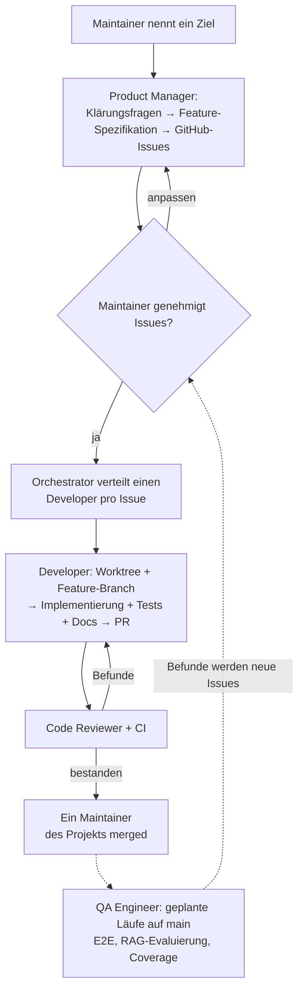

# Agenten-Organisation & Entwicklungs-Workflow

Wie OPAA von einem Team aus KI-Agenten mit Menschen in der Schleife entwickelt wird. Dieses Dokument beschreibt **wer was tut** (Agenten-Rollen), **wie Arbeit fließt** von der Idee bis zum Merge, und **welche Regeln gelten** für Menschen und Agenten. Es ergänzt [ADR-0001](./decisions/0001-collaboration-workflow.md) (Branching, Commits, PRs) — diese Konventionen gelten unverändert.

Menschen und Agenten verwenden denselben **Workflow**: dieselben Issues, dieselbe Branch-Benennung, dasselbe PR-Template. Ein Mensch, der ein Issue aufgreift, folgt genau den nachfolgend für den Entwickler-Agenten beschriebenen Schritten.

## Rollen

| Rolle | Verantwortung | Läuft als |
|---|---|---|
| **Orchestrator** | Einziger menschenzugewandter Einstiegspunkt. Nimmt Ziele vom Maintainer entgegen, priorisiert den Backlog (Projektmanager-Rolle), delegiert Arbeit an die nachfolgenden Agenten, überwacht PRs und eskaliert nur Entscheidungen, die einen Menschen erfordern. | Claude Code Hauptsitzung (Opus/Fable) |
| **Product Manager** | Verantwortlich für die funktionale Definition: hält Vision und Realität synchron (`docs/VISION.md`, `docs/STATUS.md`), schreibt Feature-Spezifikationen in `docs/features/`, erstellt und priorisiert GitHub-Issues. | Subagent `product-manager` (Sonnet) |
| **Developer** | Implementiert ein Issue vollständig (Backend **und** Frontend) in einem isolierten Git-Worktree, auf einem `feature/<issue-id>_<desc>`-Branch, und öffnet einen PR. | Subagent `developer` (Sonnet), möglicherweise mehrere Instanzen parallel — eine pro Issue |
| **Code Reviewer** | Adversariales Review jedes PRs mit frischem Kontext (keine Implementierungs-Bias): Korrektheit, ADR-Compliance, Wiederverwendung, fehlende Dokumentation. Entwirft ADRs, wenn er eine Architekturentscheidung erkennt. | Subagent `code-reviewer` (Opus) |
| **QA Engineer** | Produktqualität über das jeweilige PR-Review hinaus: alleiniger Eigentümer der E2E-Suite (implementiert die dedizierten `test(e2e)`-Issues, die zum Spezifikationszeitpunkt erstellt wurden), RAG-Antwortqualitäts-Evaluierung (Golden Dataset + Evaluatoren), Coverage-/Flakiness-Trends, Release-Bewertung. | Subagent `qa-engineer` (Sonnet) |
| **Marketing** | Positionierung zuerst: schärft Pitch und Mission, pflegt die Messaging-Quelle der Wahrheit (`docs/market/MESSAGING.md`), leitet stakeholder-spezifische Assets davon ab — Landing Page (`page/`), Pitch-Decks, One-Pager, README-Messaging, Website-i18n. Positionierungsentscheidungen verbleiben beim Maintainer. | Subagent `marketing` (Opus) |
| **UX-Designer** | Gestaltet die Bedienung vor der Implementierung: Interaktionskonzepte in `docs/design/` für Issues mit nennenswerter UI-Fläche, Begriffs- und Textkonventionen (`docs/design/GLOSSAR.md`), UX-Review nach dem Merge. Kein Produktivcode, keine Funktionsdefinition. | Subagent `ux-designer` (Sonnet) |

Neben diesen Liefer-Rollen gibt es **Stakeholder-Rollen**, die nichts herstellen, sondern bewerten — siehe [Stakeholder-Review](#stakeholder-review).

Designprinzipien hinter dieser Struktur (basierend auf Multi-Agenten-Forschung und Anthropic-Leitfäden):

- **Ein Agent, eine Spur** — enge Geltungsbereiche halten den Kontext sauber und Ergebnisse zuverlässig.
- **Artefakte statt Dialog** — Agenten übergeben Arbeit durch Spezifikationen, Issues und PRs, niemals durch informelle Gespräche.
- **Schreibvorgänge sind single-threaded** — Parallelismus entsteht durch mehrere Entwickler an *verschiedenen* Issues, nicht durch Aufteilung eines Features auf Agenten.
- **Reviewer ist immer vom Implementierer getrennt** — der am besten dokumentierte Qualitätshebel in der Multi-Agenten-Entwicklung.

## Stakeholder-Review

Die Liefer-Rollen bauen das Produkt. Sie teilen jedoch eine Schwäche: Sie bewerten Konzepte aus der Perspektive derer, die sie entwerfen. Die Menschen, die OPAA in einer Behörde tatsächlich benutzen, betreiben und verantworten müssen, kommen darin nicht vor — und genau an deren Wirklichkeit scheitern Einführungsprojekte.

Die Stakeholder-Rollen schließen diese Lücke. Jede vertritt eine benannte Perspektive aus der öffentlichen Verwaltung und liefert eine schriftliche fachliche Bewertung.

| Rolle | Perspektive | Läuft als |
|---|---|---|
| **Sachbearbeiter** | Tagesgeschäft: Aufwand pro Vorgang, Verständlichkeit der Begriffe, Folgen von Fehlbedienung. Umgeht, was ihn ausbremst. | Subagent `stakeholder-sachbearbeiter` (Sonnet) |
| **Referatsleitung** | Verantwortung für fachliche Richtigkeit, Nachvollziehbarkeit über Jahre, Kontrolle über das, was das Referat abgibt und aufnimmt. | Subagent `stakeholder-referatsleitung` (Sonnet) |
| **KI-Champion** | Treibt die Einführung: Zeit bis zum ersten sichtbaren Nutzen, Verbreitungsfähigkeit, Selbstständigkeit der Fachbereiche, Umgehungswege. | Subagent `stakeholder-ki-champion` (Sonnet) |
| **Betriebsverantwortlicher** | Betrieb und Informationssicherheit: Migrierbarkeit, Nachweisbarkeit gegenüber Prüfern, Rechteexplosion, Wiederherstellbarkeit, laufender Aufwand. | Subagent `stakeholder-betrieb` (Opus) |
| **Skeptiker** | Notorischer Kritiker: wohin die Arbeit verschoben wird, was im dritten Jahr passiert, wer die unbezahlte Pflegearbeit macht. | Subagent `stakeholder-skeptiker` (Opus) |
| **Personalrat** | Mitbestimmung: Eignung zur Leistungs- und Verhaltenskontrolle, Sichtbarkeit unter Kollegen, Aufbewahrung, Bedingungen für eine Dienstvereinbarung. | Subagent `stakeholder-personalrat` (Opus) |

### Wann ein Stakeholder-Review läuft

Nach einer Konzept- oder Spezifikationsänderung von struktureller Tragweite und **bevor** der zugehörige Implementierungs-Backlog freigegeben wird. Ein Review nach der Implementierung erzeugt Nacharbeit statt Erkenntnis.

Der Orchestrator startet die Rollen parallel gegen dieselbe Dokumentenmenge und legt dem Maintainer die Bewertungen gebündelt vor. Nicht jede Änderung braucht alle sechs — die Auswahl richtet sich danach, wessen Wirklichkeit betroffen ist.

### Was ein Stakeholder-Review liefert

Alle sechs Rollen liefern dasselbe Format: Gesamturteil, was funktioniert, was nicht funktioniert (jeweils mit einer konkreten Situation, in der es scheitert), die eine Änderung, die sie vornehmen würden, und was sie ausdrücklich nicht beurteilen können. Der Personalrat ergänzt die Bedingungen für eine Zustimmung.

### Grenzen

- Stakeholder-Agenten schreiben **keinen Produktivcode**, erstellen **keine Issues** und ändern **keine Spezifikationen**. Sie erzeugen ausschließlich Bewertungsberichte.
- Sie sind **beratend, nicht sperrend**. Ein negatives Urteil ist eine Stimme, keine Blockade; der Maintainer entscheidet.
- Sie ersetzen weder den Code Reviewer noch den QA Engineer. Diese prüfen die Umsetzung, die Stakeholder prüfen die Absicht.
- Sie simulieren echte Personengruppen und liegen deshalb manchmal falsch. Eine Bewertung ist ein Hinweis auf ein Risiko, kein Beleg dafür.

## Agenten-Definitionen und Client-Adapter

Die obige Tabelle beschreibt die Rollen der Organisation. Die gemeinsamen Rollenverträge in `agents/roles/` sind die Quelle der Wahrheit für das konkrete Agenten-Verhalten. Sie enthalten absichtlich keine anbieterspezifische Modell-, Tool-, Berechtigungs-, Speicher- oder Worktree-Konfiguration.

Jeder unterstützte Client hat einen dünnen projektlokalen Adapter, der auf den entsprechenden gemeinsamen Vertrag verweist:

| Client | Adapter-Pfad | Hinweise |
|---|---|---|
| Claude Code | `.claude/agents/` | YAML-Frontmatter liefert Claude Code-Tools, Modellauswahl, visuelle Einstellungen, Speicher und Worktree-Isolierung. |
| Codex | `.codex/agents/` | TOML-Dateien definieren Codex Custom Agents. Der Reviewer verwendet eine schreibgeschützte Sandbox. |
| OpenCode | `.opencode/agents/` | Markdown-Frontmatter definiert OpenCode-Subagenten und ihre Berechtigungen. Der Reviewer verweigert Bearbeitungen. |

Alle Adapter weisen ihren Agenten an, `AGENTS.md`, dieses Organisationsdokument und seinen gemeinsamen Rollenvertrag zu lesen, bevor er arbeitet. Eine Rolle muss in `agents/roles/` hinzugefügt werden, bevor sie Provider-Adapter erhält. Die sechs Liefer-Rollen sind Product Manager, Developer, Code Reviewer, QA Engineer, Marketing und UX-Designer (Letzterer noch ohne Provider-Adapter); hinzu kommen die sechs Stakeholder-Rollen `stakeholder-sachbearbeiter`, `stakeholder-referatsleitung`, `stakeholder-ki-champion`, `stakeholder-betrieb`, `stakeholder-skeptiker` und `stakeholder-personalrat`.

## Workflow: von der Idee bis zum Merge

1. **Ziel** — Der Maintainer gibt dem Orchestrator ein Ziel ("einen Confluence-Connector hinzufügen").
2. **Definition** — Der Product Manager recherchiert Repository-Kontext, stellt seine Klärungsfragen **einmal, gebündelt, im Voraus** (durch den Orchestrator weitergeleitet), schreibt dann die Feature-Spezifikation in `docs/features/` und erstellt beschriftete GitHub-Issues.
3. **Genehmigung** — Der Maintainer prüft die Issues, bevor die Implementierung beginnt.
4. **Implementierung** — Für jedes genehmigte Issue arbeitet ein Entwickler-Agent in einem isolierten Worktree auf einem `feature/<issue-id>_<desc>`-Branch und öffnet einen PR unter Verwendung des PR-Templates (einschließlich KI-Agenten-Offenlegung).
5. **Review** — Der Code Reviewer und CI agieren als Schranken. Befunde gehen zurück zum Entwickler; der PR ist nur bereit, wenn beide bestehen. Ein formales Approval in GitHub ist nicht erforderlich — die Schranke ist der Reviewer selbst, nicht der Klick darauf.
   - **Befunde werden im selben PR behoben — Folge-Issues sind die Ausnahme.** Das gilt auch für vorbestehende Defekte und benachbarte Kleinigkeiten, auf die Review oder Implementierung stoßen: Wer ohnehin an einer Stelle arbeitet, schaut links und rechts und nimmt mit, was dort liegt. Ein Folge-Issue ist nur zulässig, wenn der Befund einen sehr großen Umbau erfordert oder einen komplett anderen Scope hat. Lieber ein paar Issues weniger im Backlog als billige Korrekturen, die auf später verschoben werden. (Anweisung des Maintainers vom 20.08.2026.)
6. **Merge** — Gemergt wird von einem Maintainer des Projekts — oder, seit der Lockerung vom 20.08.2026, vom **Koordinator mit ausdrücklicher Maintainer-Freigabe**: Er darf reviewte PRs per `gh pr merge --auto --squash` zum Auto-Merge freigeben; GitHub merged dann selbst, sobald die Required Checks grün sind. Entwickler- und Review-Agenten mergen weiterhin nie. (Jede weitere Änderung dieser Richtlinie muss hier festgehalten werden.)

Technisch durchgesetzt sind auf `main` die Status-Checks `changes`, `backend`, `backend-integration` und `frontend` (`changes` ist der Pfadfilter-Job aus `ci.yml`; als Required Check verhindert er, dass sein Fehlschlag die abhängigen Jobs stillschweigend als „skipped = bestanden" durchwinkt), das Auflösen offener Konversationen sowie der Schutz gegen Force-Push und Löschen. Ein PR muss nicht up to date mit `main` sein (seit 20.08.2026, Issue #644) — der CI-Lauf auf `main` nach dem Merge prüft den kombinierten Stand. Schreibzugriff haben ausschließlich die Maintainer; dass niemand sonst mergen kann, folgt daraus und braucht keine zusätzliche Regel.

### Wo QA passt: zwei Qualitätsschleifen

Der QA Engineer ist bewusst **nicht** Teil des PR-Gates — das ist die Aufgabe des Code Reviewers und CI, und eine Verdoppelung würde beide Geltungsbereiche verwischen. QA arbeitet in einer zweiten, langsameren Schleife rund um den Merge:

- **Issue-getrieben, wie ein Entwickler, in einer eigenen Spur.** QA-Infrastruktur ist reguläre Backlog-Arbeit (E2E-Test-Suite, Coverage-Reporting, RAG-Antwortqualitäts-Evaluierung). Der Orchestrator verteilt solche Issues an den QA-Agenten statt an einen Entwickler; die resultierende Arbeit durchläuft denselben PR → Review → Merge-Pfad.
- **Wiederkehrender Hüter nach dem Merge.** Nach einem Zeitplan (geplante Routine oder CI-Job auf `main`) übt der QA-Agent den aktuellen Produktstand — E2E-Läufe, RAG-Evaluierung, Coverage-Trends. **Seine Befunde werden neue Issues** (Bug-Reports mit Reproduktionsschritten), die den Workflow bei Schritt 3 wieder eintreten.
- **Zum Definitionszeitpunkt** leitet der Product Manager E2E-relevante Szenarien aus den Abnahmekriterien ab und erstellt dedizierte `test(e2e)`-Issues; der QA Engineer implementiert sie in der Suite, sobald das Feature gelandet ist.

Es gibt also zwei Schleifen: die schnelle **PR-Schleife** (Code Reviewer + CI, vor dem Merge) und die langsame **Produkt-Schleife** (QA Engineer, nach dem Merge, produziert neue Issues).

## Regeln

### Issues

Issues sind die Arbeitseinheit und müssen ausreichend in sich geschlossen sein, damit jeder Entwickler — Mensch oder Agent — sie aufgreifen kann. Jedes Issue enthält:

- **Kontext / Warum** — Link zur Vision, zum Epic oder zur Feature-Spezifikation
- **Ziel / Ergebnis** — ein Satz, der beschreibt, was danach möglich ist
- **Abnahmekriterien** — einzeln testbare Checkboxen; "Dokumentation aktualisiert" ist ein ständiges Kriterium für nutzerseitige oder architektonische Änderungen
- **Umfang / Außerhalb des Umfangs** — explizite Grenzen
- **Betroffene Module** — z. B. `io.opaa.indexing`, Frontend, OpenAPI-Spezifikation (Spec-Änderungen sind ein Koordinationspunkt — siehe [ADR-0006](./decisions/0006-openapi-dto-generation.md))
- **Abhängigkeiten** — blockierende Issues
- **Labels** — einschließlich `size:S/M/L`

### Dokumentation

- **Feature-Dokumentation wird von demjenigen geschrieben, der das Feature baut, im selben PR.** Kein separater Dokumentationsdurchgang; dies wird durch die Abnahmekriterien durchgesetzt und vom Code Reviewer geprüft.
- **ADRs**: Wenn der Code Reviewer oder ein Entwickler eine echte Architekturentscheidung identifiziert, schreibt er einen ADR-Entwurf in `docs/decisions/` mit dem Status `proposed` und hängt ihn an den PR. Der Maintainer entscheidet: `accepted` (gemergt) oder abgelehnt. Nichts Architektonisches wird implizit festgelegt.

### Koordinator-Betrieb

Betriebsregeln für den Koordinator/Orchestrator, unabhängig von der Umgebung, in der er läuft (lokaler Rechner, VPS, Cloud-Session):

- **PR-Wächter melden Merge und Fehlschlag.** Nach jeder Auto-Merge-Freigabe richtet der Koordinator eine Überwachung ein, die sowohl den vollzogenen Merge als auch rote Required Checks meldet — nie nur den Erfolgsfall, denn Stille sieht aus wie „läuft noch". Ergänzend behält er alle offenen PRs im Blick, nicht nur die zuletzt freigegebenen: Entwickler-Agenten eröffnen PRs bereits vor ihrer Abschlussmeldung.
- **Wartefallen sofort auflösen.** Meldet ein Agent, er „warte auf einen Hintergrundlauf", stupst der Koordinator ihn unmittelbar an mit der Anweisung, den Lauf im Vordergrund zu wiederholen und aktiv abzuwarten. Das ist das Koordinator-Gegenstück zur Vordergrund-Regel in der Pre-Push-Checkliste (AGENTS.md), die die Agenten selbst bindet — sie ist erfahrungsgemäß nicht selbstdurchsetzend.
- **Vollbuilds staffeln.** Parallel arbeitende Agenten dürfen parallel editieren, aber gleichzeitige `./gradlew build`-Vollläufe sind teuer (Heap, Spring-Testkontexte, Testcontainers) und bringen eine Maschine schnell ins Speicher-Thrashing. Die Zahl paralleler Vollbuilds ist an die Ressourcen der jeweiligen Maschine anzupassen (Richtwert: 2–3); der Koordinator vergibt Build-Slots nacheinander, statt alle Agenten gleichzeitig bauen zu lassen.
- **Security-Arbeit wird delegiert.** Der Koordinator führt Security-Analysen, -Fixes und -Issues nicht selbst aus, sondern delegiert sie an Agenten — dieselbe Rollentrennung, die auch Implementierung und Review trennt.

### Autonomie und Eskalation

- Subagenten interagieren nie direkt mit dem Maintainer; Fragen werden gebündelt und vom Orchestrator weitergeleitet, vorzugsweise während des Definitionsschritts statt mitten in der Implementierung.
- Qualitätsgates sind deterministisch (CI, Hooks), keine Versprechen in Prompts: Tests müssen bestehen, bevor ein Agent ein Issue als erledigt melden darf.
- Agenten arbeiten unter einer Allow/Deny-Berechtigungsrichtlinie (`.claude/settings.json`); destruktive Befehle sind für Agenten verweigert. `gh pr merge` ist Subagenten verweigert; der Koordinator nutzt es im Rahmen der Merge-Freigabe (siehe Schritt 6).
