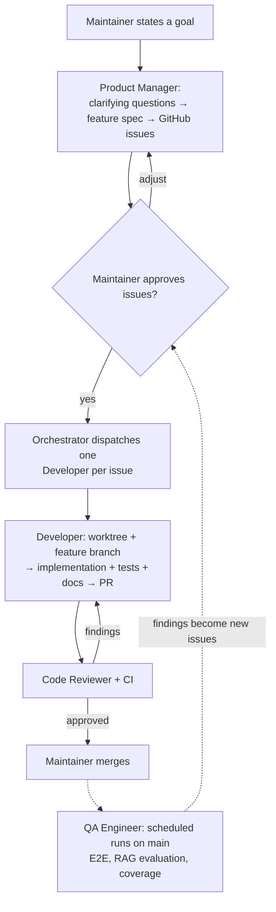

# Agent Organization & Development Workflow

How OPAA is developed by a team of AI agents with humans in the loop. This document describes **who does what** (agent roles), **how work flows** from idea to merge, and **which rules apply** to both humans and agents. It complements [ADR-0001](./decisions/0001-collaboration-workflow.md) (branching, commits, PRs) — those conventions apply unchanged.

Humans and agents use the **same workflow**: the same issues, the same branch naming, the same PR template. A human picking up an issue follows exactly the steps described below for the developer agent.

## Roles

| Role | Responsibility | Runs as |
|---|---|---|
| **Orchestrator** | Single human-facing entry point. Takes goals from the maintainer, prioritizes the backlog (project manager role), delegates work to the agents below, monitors PRs, and escalates only decisions that need a human. | Claude Code main session (Opus/Fable) |
| **Product Manager** | Owns the functional definition: keeps vision and reality in sync (`docs/VISION.md`, `docs/MVP-STATUS.md`), writes feature specs in `docs/features/`, cuts and prioritizes GitHub issues. | Subagent `product-manager` (Sonnet) |
| **Developer** | Implements one issue end-to-end (backend **and** frontend) in an isolated git worktree, on a `feature/<issue-id>_<desc>` branch, and opens a PR. | Subagent `developer` (Sonnet), possibly several instances in parallel — one per issue |
| **Code Reviewer** | Adversarial review of every PR with fresh context (no implementation bias): correctness, ADR compliance, reuse, missing documentation. Drafts ADRs when it detects an architectural decision. | Subagent `code-reviewer` (Opus) |
| **QA Engineer** | Product quality beyond per-PR review: sole owner of the E2E suite (implements the dedicated `test(e2e)` issues cut at specification time), RAG answer-quality evaluation (golden dataset + evaluators), coverage/flakiness trends, release assessment. | Subagent `qa-engineer` (Sonnet) |
| **Marketing** | Landing page (`page/`), pitch decks, sales assets, website i18n. | Subagent `marketing` (Sonnet) |

Design principles behind this setup (based on multi-agent research and Anthropic guidance):

- **One agent, one lane** — narrow scopes keep context clean and results reliable.
- **Artifacts over dialogue** — agents hand over work through specs, issues, and PRs, never through informal chat.
- **Writes are single-threaded** — parallelism comes from multiple developers on *different* issues, not from splitting one feature across agents.
- **Reviewer is always separate from implementer** — the best-documented quality lever in multi-agent development.

Agent definitions live in `.claude/agents/` and are versioned with the code.

## Workflow: from idea to merge

1. **Goal** — The maintainer gives the orchestrator a goal ("add a Confluence connector").
2. **Definition** — The product manager researches repo context, asks its clarifying questions **once, bundled, up front** (relayed through the orchestrator), then writes/updates the feature spec in `docs/features/` and creates labeled GitHub issues.
3. **Approval** — The maintainer reviews the issues before implementation starts.
4. **Implementation** — For each approved issue, a developer agent works in an isolated worktree on a `feature/<issue-id>_<desc>` branch and opens a PR using the PR template (including AI agent disclosure).
5. **Review** — The code reviewer and CI act as gates. Findings go back to the developer; the PR is only ready when both pass.
6. **Merge** — **Only humans merge.** No agent merges a PR, ever. (This policy may be relaxed gradually as trust is established — any change to it must be recorded here.)

### Where QA fits: two quality loops

The QA engineer is deliberately **not** part of the per-PR gate — that is the code reviewer's and CI's job, and doubling it would blur both scopes. QA operates in a second, slower loop around the merge:

- **Issue-driven, like a developer, in its own lane.** QA infrastructure is regular backlog work (E2E test suite, coverage reporting, RAG answer-quality evaluation). The orchestrator dispatches such issues to the QA agent instead of a developer; the resulting work goes through the same PR → review → merge path.
- **Recurring guardian after the merge.** On a schedule (scheduled routine or CI job on `main`), the QA agent exercises the current product state — E2E runs, RAG evaluation, coverage trends. **Its findings become new issues** (bug reports with reproduction steps) that re-enter the workflow at step 3.
- **At definition time**, the product manager derives E2E-relevant scenarios from the acceptance criteria and files dedicated `test(e2e)` issues; the QA engineer implements them in the suite once the feature lands.

So there are two loops: the fast **PR loop** (code reviewer + CI, before merge) and the slow **product loop** (QA engineer, after merge, producing new issues).

## Rules

### Issues

Issues are the unit of work and must be self-contained enough that any developer — human or agent — can pick them up. Every issue contains:

- **Context / Why** — link to the vision, epic, or feature spec
- **Goal / Outcome** — one sentence describing what is possible afterwards
- **Acceptance criteria** — individually testable checkboxes; "documentation updated" is a standing criterion for user-facing or architectural changes
- **Scope / Out of scope** — explicit boundaries
- **Affected modules** — e.g. `io.opaa.indexing`, frontend, OpenAPI spec (spec changes are a coordination point — see [ADR-0006](./decisions/0006-openapi-dto-generation.md))
- **Dependencies** — blocking issues
- **Labels** — including `size:S/M/L`

### Documentation

- **Feature documentation is written by whoever builds the feature, in the same PR.** No separate documentation pass; this is enforced via the acceptance criteria and checked by the code reviewer.
- **ADRs**: when the code reviewer or a developer identifies a genuine architectural decision, it writes an ADR draft in `docs/decisions/` with status `proposed` and attaches it to the PR. The maintainer decides: `accepted` (merged) or rejected. Nothing architectural is settled implicitly.

### Autonomy and escalation

- Subagents never interact with the maintainer directly; questions are bundled and relayed by the orchestrator, preferably during the definition step rather than mid-implementation.
- Quality gates are deterministic (CI, hooks), not promises in prompts: tests must pass before an agent may report an issue as done.
- Agents operate under an allow/deny permission policy (`.claude/settings.json`); destructive commands and `gh pr merge` are denied for agents.
