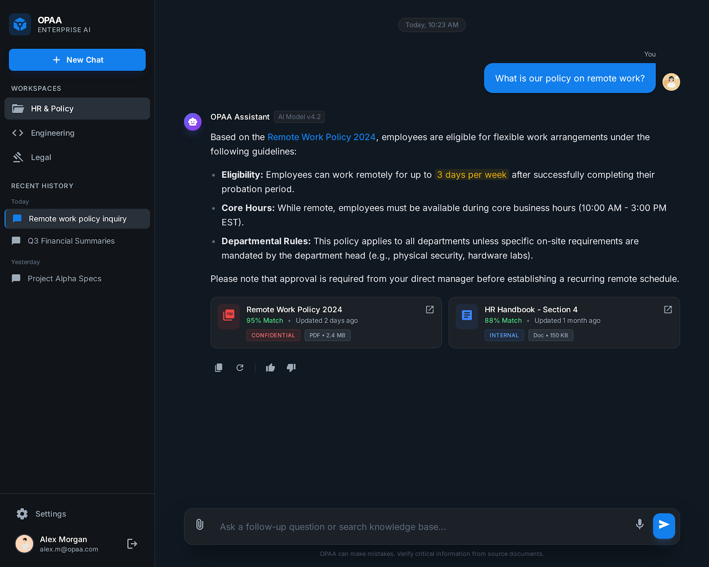
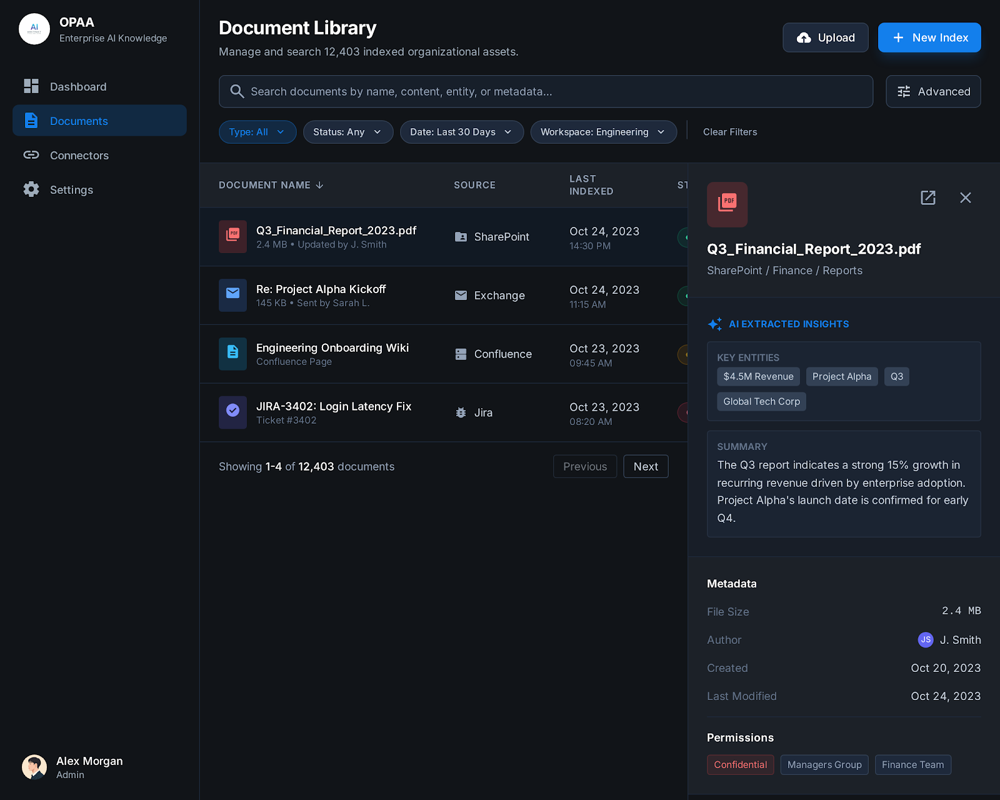
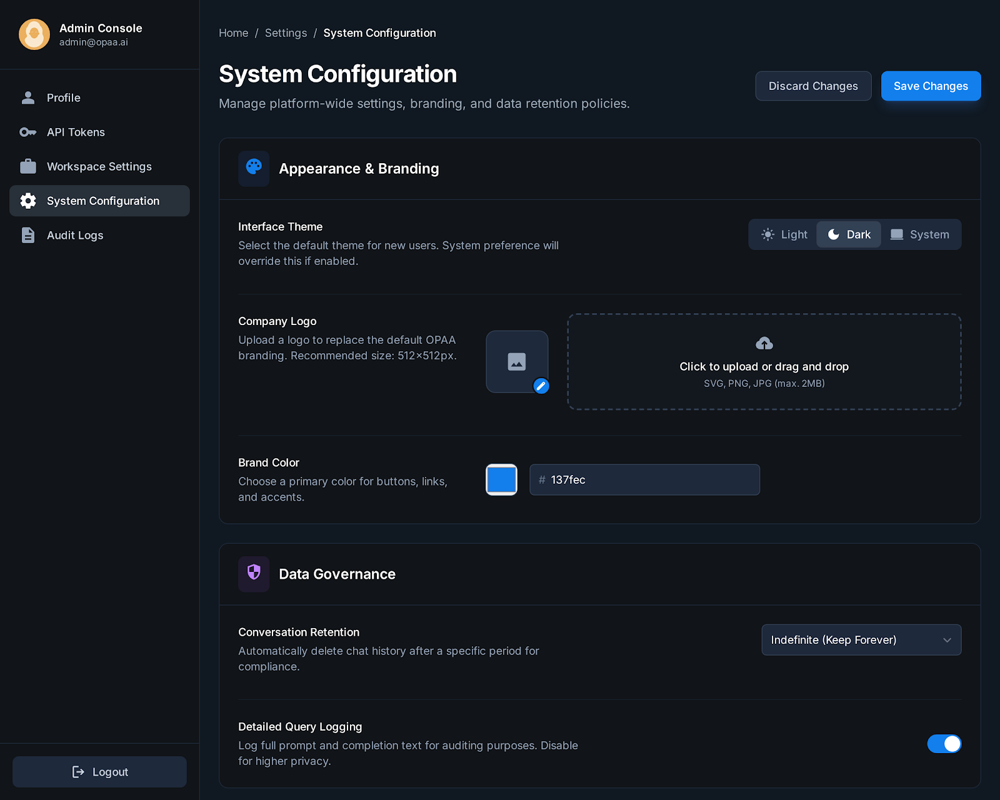

# OPAA — Dein Firmenwissen. Eine Frage entfernt.

> Stell dir vor, jeder Mitarbeiter hat einen Assistenten, der **alles** weiß, was je in deiner Firma geschrieben wurde — Wikis, E-Mails, Dokumente, Tickets. Und die Antwort kommt in Sekunden. Mit Quellenangabe.

---

## Das Problem, das jeder kennt

Du suchst eine Info. Du durchsuchst Confluence. Dann SharePoint. Dann fragst du Kollegin Anna auf Slack. Die ist im Urlaub. Also fragst du Markus. Der schickt dir ein PDF von 2021, das vielleicht stimmt.

**3 Stunden später** hast du deine Antwort. Vielleicht.

---

## Die Lösung: OPAA

OPAA ist ein **selbst gehosteter KI-Assistent**, der alle Wissensquellen deiner Organisation verbindet — und sofort Antworten liefert.

Keine Cloud-Abhängigkeit. Keine Daten, die das Haus verlassen. Volle Kontrolle.

---

## So sieht das aus

### 1. Frag einfach — in natürlicher Sprache



Du tippst deine Frage ein wie in einem Chat. OPAA durchsucht **alle angebundenen Quellen** gleichzeitig und antwortet mit einer strukturierten Antwort — inklusive der **Originaldokumente als Quellen** mit Vertraulichkeitsstufe und Match-Score.

Kein Raten. Kein Suchen. Kein "Frag mal Markus".

---

### 2. Alle Dokumente an einem Ort



12.000+ Dokumente aus SharePoint, Confluence, Exchange, Jira — alles durchsuchbar an **einem** Ort. Mit Filtern, KI-extrahierten Insights und Metadaten auf einen Blick.

Dein gesamtes Firmenwissen. Endlich auffindbar.

---

### 3. Dein Branding. Deine Regeln.



OPAA passt sich deiner Organisation an — nicht umgekehrt. Logo, Farben, Theme, Datenaufbewahrung, Audit-Logging: alles konfigurierbar. Auch welches KI-Modell im Hintergrund arbeitet.

---

## Warum OPAA?

| | OPAA | Typische SaaS-Lösung |
|---|---|---|
| **Datenhoheit** | Alles bleibt bei dir | Daten in fremder Cloud |
| **KI-Modell** | Frei wählbar (OpenAI, Ollama, lokal) | Vorgegeben, nicht änderbar |
| **Quellen** | Confluence, E-Mail, Jira, SharePoint, S3, ... | Meist nur eigene Plattform |
| **Quellenangaben** | Jede Antwort mit Originaldokument | Oft Blackbox |
| **Kosten** | Open Source (Apache 2.0) | Lizenzgebühren pro User |
| **Vendor Lock-in** | Kein Lock-in, jede Komponente austauschbar | Starke Abhängigkeit |

---

## Der Tech-Stack (für die Nerds)

```
Frontend:  React 19 + TypeScript + Material UI
Backend:   Java 21 + Spring Boot + Spring AI
Datenbank: PostgreSQL + pgvector
Deploy:    Docker Compose (ein Befehl!)
Lizenz:    Apache 2.0 — komplett Open Source
```

---

## In 60 Sekunden zusammengefasst

1. **Firmenwissen ist überall verstreut** — Mitarbeiter verschwenden Stunden mit Suchen
2. **OPAA verbindet alle Quellen** — Confluence, E-Mails, Dateien, Tickets, eigene Uploads
3. **Fragen stellen, Antworten bekommen** — in natürlicher Sprache, mit Quellenangabe
4. **Selbst gehostet, Open Source** — keine Daten verlassen dein Netzwerk
5. **Jede Komponente austauschbar** — kein Vendor Lock-in, volle Kontrolle

---

**OPAA** — Open Project AI Assistant

[github.com/criew/opaa](https://github.com/criew/opaa)
