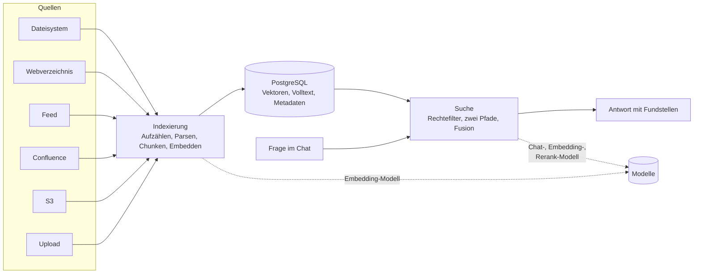

# OPAA-Handbuch: Betrieb und Verwaltung

Dieses Handbuch beschreibt, wie eine OPAA-Installation betrieben und verwaltet wird: was die
Software tut, wie sie konfiguriert wird und wo der Betrieb nachsieht, wenn etwas nicht wie erwartet
läuft. Es beschreibt den gebauten Ist-Stand, nicht Zielbilder.

## 1. Für wen das Handbuch ist

| Rolle | Typische Aufgaben | Einstieg |
|---|---|---|
| **Betrieb** | installiert, aktualisiert, sichert, überwacht; konfiguriert Modelle und Grenzwerte; geht Störungen nach | [Deployment](deployment.md), danach [Indexierung](indexierung.md) und [Suche](suche.md) |
| **Verwaltung** | legt Bibliotheken an, schließt Quellen an, vergibt Rechte, pflegt Metadaten, prüft Antworten mit dem Diagnosewerkzeug | [Indexierung](indexierung.md), die Konnektor-Kapitel, [Metadaten](metadaten.md), [Suche](suche.md) Abschnitt 8 |

Nicht Zielgruppe sind Entwickler (Spezifikationen und Entscheidungen liegen im Repository unter
`docs/features/` und `docs/decisions/`) und Endnutzende (die Oberfläche erklärt sich an Ort und
Stelle). Wer das Handbuch liest, braucht das Repository nicht.

## 2. Was OPAA aus Betriebssicht ist

OPAA nimmt Dokumente aus angeschlossenen Quellen in einen Index auf und beantwortet Fragen dazu mit
Fundstellen. Beides läuft in **einem Backend-Prozess** gegen **eine PostgreSQL-Datenbank**; nach
außen ruft das Backend nur die konfigurierten Modelle und die Quellen.

Drei Eigenschaften prägen alles Weitere:

- **Die Datenbank ist die einzige Wahrheit.** Dokumentzeilen, Chunks samt Vektoren, Volltext,
  Metadaten, Protokolle, Chats: alles liegt in PostgreSQL. Daneben steht genau ein zweiter Bestand,
  den die Datenbank nicht enthält: die Originale der hochgeladenen Dokumente. Eine Sicherung der
  Installation umfasst deshalb beides — die Datenbank und die
  [Originalablage](deployment.md#originalablage).
- **Genau eine Backend-Instanz.** Zeitpläne, Wiederanlauf und Thread-Pools sind prozesslokal.
  Skalierung ist eine Frage der Hardware dieser einen Instanz.
- **Rechte wirken in der Suche, nicht dahinter.** Jede Suchabfrage trägt den Filter auf die
  lesbaren Bibliotheken in sich; ein fremder Chunk wird nie geladen. Es gibt keinen
  Administrator-Durchgriff.

## 3. Funktionen im Überblick

| Funktion | Ein Satz | Kapitel |
|---|---|---|
| Quellen anschließen | Verzeichnisse, Webverzeichnisse, Feeds, Confluence-Spaces und S3-Buckets werden per Lauf gespiegelt; Uploads sofort verarbeitet | [Indexierung](indexierung.md), Abschnitte 2 bis 4 |
| Formate verarbeiten | PDF, Office, OpenDocument, Tabellen, HTML, Markdown, E-Mail samt Anhängen; Zulassung nach Inhalt, nicht nach Endung | [Indexierung](indexierung.md), Formatübersicht |
| Änderungen und Löschungen | Prüfsummen, Löscherkennung nur nach vollständiger Aufzählung, Anhänge als eigene Dokumente | [Indexierung](indexierung.md), Abschnitte 6 und 7 |
| Metadaten | Titel, Dokumentart, Datum/Stand je Dokument, dazu Bibliotheks- und Formatfelder; Filter, Kontextpräfix, Beleg | [Metadaten](metadaten.md) |
| Suche und Antwort | Rechtefilter, Teilfragen, Vektor- und Volltextsuche, Fusion, Reranking, Dokument-Vervollständigung, Belegprüfung | [Suche](suche.md) |
| Diagnose | Testfrage im gewählten Rechtekontext, jede Stufe einzeln, „Dokument verfolgen" | [Suche](suche.md), Abschnitt 8 |
| Modelle | Chat-, Embedding- und Rerank-Rolle, Endpunkte, Zugangsdaten | [Deployment](deployment.md), Abschnitte „LLM-Anbieter" und „Reranking einschalten" |
| Authentifizierung | Entwicklungsmodus, OIDC mit einem oder mehreren Anbietern, lokale Konten mit Passwort | [Deployment](deployment.md), Abschnitt „Authentifizierung" |
| Konten verwalten | Lokale Konten anlegen, einladen, sperren, zurücksetzen, befristen; Rollen und Anlegerechte; Selbstregistrierung | [Benutzerverwaltung](benutzerverwaltung.md) |
| Rechte vergeben und nachweisen | Rollen an Bibliotheken und Räumen, Gruppen als Empfänger, Anlegerechte, Vollmachten, Herleitung „warum sehe ich das", Rechtehistorie und Stichtagsauskunft, Übertragung, „Nachfolge offen" | [Bibliotheken und Berechtigungen](bibliotheken-und-berechtigungen.md) |
| Fremdzugänge | Freigegebene Bibliotheken für fremde KI-Werkzeuge erreichbar machen: Schalter, Freigabe je Bibliothek, persönliche Zugangstokens, MCP-Server, Kontingent und Abflussalarm | [Fremdzugänge](fremdzugaenge.md) |
| E-Mail-Versand | SMTP als Verwaltungseinstellung, öffentliche Basis-URL aus der Umgebung, zwölf überschreibbare Vorlagen, Testversand | [Deployment](deployment.md), Abschnitt „E-Mail-Versand (SMTP)" |
| Installation und Update | Docker Compose, Umgebungsvariablen, Härtung, Update-Verhalten des Index | [Deployment](deployment.md) |

## 4. Kapitel

### Vorhanden

| Kapitel | Inhalt |
|---|---|
| [Deployment](deployment.md) | Installation aus Images, Update-Ablauf und Folgen für den Index, alle Umgebungsvariablen, Härtung, Modellanbieter, Authentifizierung samt Erststart und Notfallprozedur, E-Mail-Versand, Originalablage der Uploads, Fehlerbehebung |
| [Benutzerverwaltung](benutzerverwaltung.md) | Lokale Konten: anlegen und einladen, Link-Übergabe ohne Mailserver, Sperren und Entsperren, Zurücksetzen, Anlagegrund und Ablaufdatum, Auflagenprüfung, Rollen und Anlegerechte, Löschen gegen Sperren, Übergabe an einen Identitätsanbieter, Selbstregistrierung, Selbstbedienung, Regeln und Fristen |
| [Bibliotheken und Berechtigungen](bibliotheken-und-berechtigungen.md) | Das Berechtigungsmodell an einer Stelle: Subjekte, die Begriffe Rolle / Anlegerecht / Vollmacht / Systemrolle, Rollen an Bibliothek und Raum, Verteilungsstufe und Auffindbarkeit, Freigabe-Obergrenze für Konnektorbibliotheken, Gruppenherkunft und -mechanismus, interne Gruppen und ihre Verantwortlichen, was wer sieht, die Herleitung „warum sehe ich das", Anlegerechte, Systemrollen und Vollmachten, Rechtehistorie und Stichtagsauskunft, Kontosperre aus dem Verzeichnis, Übertragung, „Nachfolge offen", Diagnose im Gruppenkontext, Konfiguration |
| [Indexierung](indexierung.md) | Aufnahmestrecke: Bibliothek, Quelle, Lauf, Dokument; Zeitplan; Dokumentstrecke Schritt für Schritt; Anhänge; Löscherkennung; Protokoll; Pipeline-Versionen und Nachzug; Formatübersicht |
| [Suche](suche.md) | Abfragestrecke: Suchbereich, Filter, Teilfragen, zwei Suchpfade, Fusion, Reranking, Vervollständigung, Antwort, Belegprüfung, Diagnose, Aufbewahrung der Rechtehistorie, Konfiguration |
| [Metadaten](metadaten.md) | Kernfelder, Format- und Bibliotheksfelder, Vokabular, Ermittlung, Bestandslauf, Pflege, Wirkung in Filter, Kontextpräfix und Beleg |
| [Fremdzugänge](fremdzugaenge.md) | Der Kanal für fremde KI-Werkzeuge: vor dem Einschalten, Schalter und Netzbereich, Freigabe einer Bibliothek, Zugangstokens aus Personen- und Verwaltungssicht, MCP-Server, Einrichtung in Claude Code, Cursor, VS Code und OpenCode, Kontingent und Abflussalarm, Protokollierung, Störungssuche, Prüfliste nach einer Wiederherstellung |
| Konnektoren: [Dateisystem](konnektor-filesystem.md), [Webverzeichnis](konnektor-http-directory.md), [Feed](konnektor-rss-feed.md), [Confluence](konnektor-confluence.md), [S3](konnektor-s3.md) | je Quellentyp: Einrichtung, Schutzmechanismen, Betriebsarten, Löschsemantik, Grenzwerte, Fehlerbilder |
| Formate: [PDF](format-pdf.md), [Word](format-docx.md), [PowerPoint](format-pptx.md), [Tabellen](format-tabular.md), [OpenDocument Text](format-odt.md), [OpenDocument Präsentation](format-odp.md), [HTML](format-html.md), [Markdown](format-markdown.md), [E-Mail](format-mail.md), [Confluence-Seite](format-confluence.md), [Auffang-Pipeline](format-fallback.md) | je Format: Zulassung, erkannte Struktur, Zuschnitt, Metadaten, Grenzen |

### In Vorbereitung

Diese Kapitel sind im Epic #1282 vorgesehen; bis dahin steht der jeweilige Inhalt verstreut in
[Deployment](deployment.md) oder nur im Repository.

| Kapitel | Vorgesehener Inhalt |
|---|---|
| Modelle | Chat-, Embedding- und Rerank-Modellrolle, verwaltete Modelle, Endpunkte, Fehlerbilder |
| Authentifizierung | Auth-Modi, Keycloak-Anbindung und Härtung des Realms an einer Stelle; heute im Deployment-Kapitel, die lokalen Konten in [Benutzerverwaltung](benutzerverwaltung.md) |
| Betrieb | Backup und Wiederherstellung, Update-Ablauf, Log- und Metrik-Übersicht, Single-Instance-Annahme, Grenzwerte auf einer Seite |

## 5. Lesewege nach Anlass

| Anlass | Reihenfolge |
|---|---|
| Erste Installation | [Deployment](deployment.md) Schnellstart und Konfiguration → [Deployment](deployment.md) „Erststart und Systemverwalter-Konto" → [Deployment](deployment.md) Härtung → [Indexierung](indexierung.md) Abschnitt 2 |
| Konten anlegen oder entziehen | [Benutzerverwaltung](benutzerverwaltung.md) → [Deployment](deployment.md) „E-Mail-Versand (SMTP)", falls Einladungen per Mail gehen sollen |
| Rechte einer Bibliothek oder eines Raums vergeben | [Bibliotheken und Berechtigungen](bibliotheken-und-berechtigungen.md) Abschnitte 2 bis 5 → Abschnitte 6 bis 8 (Gruppen) |
| Eine Person scheidet aus, ein Referat wird aufgelöst | [Bibliotheken und Berechtigungen](bibliotheken-und-berechtigungen.md) Abschnitt 13 → [Benutzerverwaltung](benutzerverwaltung.md) Abschnitte 4 und 8 |
| „Wer durfte das am 3. März lesen?" | [Bibliotheken und Berechtigungen](bibliotheken-und-berechtigungen.md) Abschnitt 12 → [Suche](suche.md) Abschnitt 8.4 (Aufbewahrung) |
| Niemand kommt mehr herein | [Deployment](deployment.md) „Notfallprozedur: wieder hereinkommen" → [Benutzerverwaltung](benutzerverwaltung.md) Abschnitt 4 |
| Neue Quelle anschließen | das Konnektor-Kapitel des Quellentyps → [Indexierung](indexierung.md) Abschnitte 3 und 7 (Zeitplan, Löscherkennung) |
| Dokumente fehlen oder sind veraltet | [Indexierung](indexierung.md) Abschnitte 7 bis 9 → Laufprotokoll der Bibliothek → Format-Kapitel des Dokuments |
| Eine Antwort ist schlecht | [Suche](suche.md) Abschnitte 8 und 9 → Diagnosewerkzeug → je nach Befund [Indexierung](indexierung.md) oder [Metadaten](metadaten.md) |
| Filter oder Beleg zeigen falsche Werte | [Metadaten](metadaten.md) Abschnitte 4, 7 und 8 |
| Update steht an | [Deployment](deployment.md) „Aktualisierung" und „Was ein Update mit dem Index macht" → [Indexierung](indexierung.md) Abschnitt 9 (Nachzug) |
| Reranking einschalten | [Deployment](deployment.md) „Reranking einschalten" → [Suche](suche.md) Stufe 8 |
| Ein fremdes KI-Werkzeug anschließen | [Fremdzugänge](fremdzugaenge.md) Abschnitte 2 bis 5 (einschalten, freigeben, Token) → Abschnitt 9 (Einrichtung im Client) → bei Störungen Abschnitt 13 |
| Originalablage wählen, sichern oder umstellen | [Deployment](deployment.md) „Originalablage" → Variablenliste desselben Kapitels |

## 6. Glossar

Begriffe, die in allen Kapiteln in genau dieser Bedeutung verwendet werden.

| Begriff | Bedeutung |
|---|---|
| **Wissensbibliothek** (Bibliothek) | Verwaltungseinheit für Dokumente: gehört zu einer Organisation, trägt Berechtigungen und genau eine Quelle |
| **Quelle** | Woher eine Bibliothek ihre Dokumente bezieht: Upload oder ein Quellentyp mit Konnektor (Dateisystem, Webverzeichnis, Feed, Confluence, S3) |
| **Konnektor** | Der Teil der Indexierung, der die Eigenheiten eines Quellentyps kennt: Aufzählen, Abrufen, Betriebsarten |
| **Indexierungslauf** (Lauf) | Ein Durchgang über die Quelle einer Bibliothek mit Status, Zählern und Protokoll |
| **Betriebsart** | Ob ein Lauf die Quelle vollständig auflistet (und Verschwundenes entfernen darf) oder nur ergänzt |
| **Dokument** | Eine Zeile in der Dokumenttabelle, eindeutig über Bibliothek und Quellpfad; Anhänge sind eigene Dokumente mit Verweis auf das Elterndokument |
| **Chunk** | Ein Textstück eines Dokuments mit Vektor, Volltext und Metadaten; die Einheit, auf der die Suche arbeitet |
| **Originalablage** | Der Ort, an dem die Originale hochgeladener Dokumente liegen: ein Verzeichnis (auch ein dorthin eingehängtes Netzlaufwerk) oder ein Objektspeicher; Dokumente aus einem Konnektor bleiben bei ihrer Quelle |
| **Format-Pipeline** | Die Verarbeitung eines Dateiformats: Parsen und Zuschnitt in Chunks, mit Kennung und Versionsnummer |
| **Nachzug** | Neuverarbeitung von Dokumenten, deren Chunks mit einer älteren Pipeline-Version oder Volltextfassung entstanden sind; von einem Systemadministrator angestoßen |
| **Kernfelder** | Titel, Dokumentart und Datum/Stand je Dokument |
| **Kontextpräfix** | Text, der jedem Chunk beim Einbetten und im Volltextindex vorangestellt wird (Titel, ausgewählte Felder, Gliederungspfad), ohne den gespeicherten Text zu ändern |
| **Raum** (Space) | Arbeitsbereich, in dem Chats liegen; kann Bibliotheken zuordnen und damit den Standard-Suchbereich verengen |
| **Suchbereich** | Die Bibliotheken, in denen eine Frage sucht; steht in der Chip-Leiste des Chats und ist nie weiter als die Leserechte |
| **Fundstelle** (Beleg) | Eine Quellenangabe unter einer Antwort, eine je Dokument, mit Rang, Ortsangabe und Kernfeldern |
| **Ortsangabe** | Die Stelle eines Chunks im Dokument, etwa „S. 3 · Abschn. Fristen" |
| **Modellrolle** | Eine der drei Aufgaben, für die ein externes Modell konfiguriert wird: Chat, Embedding, Reranking |
| **Rechteprofil** | Eine Gruppe samt der Bibliotheken, die sie lesen darf; der voreingestellte Kontext des Diagnosewerkzeugs |
| **Diagnosesperre** | Grundzustand jeder Bibliothek, der sie aus einer Diagnose im Rechtekontext einer benannten Person heraushält |
| **Lokales Konto** | Ein Konto, das OPAA selbst führt: Anmeldung mit E-Mail-Adresse und Passwort, verwaltet unter Administration → Benutzer; Gegenstück zu einem Konto aus einem Identitätsanbieter |
| **Notanker-Konto** | Das eine lokale Systemverwalterkonto, das OPAA beim Erststart anlegt; Notfallzugangsmittel, kein Arbeitskonto |
| **Rolle** | Gestufte Berechtigung an genau einem Objekt — an einer Bibliothek Leser, Bearbeiter, Verwalter, Eigentümer; in einem Raum Mitglied, Kurator, Administrator. Für eine Person oder eine Gruppe, unbefristet oder mit Ablaufdatum |
| **Anlegerecht** | Ein installationsweites Recht, etwas anzulegen (Spaces, Bibliotheken für Uploads, Konnektorbibliotheken, interne Gruppen); vergeben an eine Person, eine Gruppe oder „Alle Konten", ohne Gegenstand und ohne Lesewirkung |
| **Vollmacht** | Eine befristete, begründungspflichtige Erlaubnis mit Gegenstand, an genau eine Person gebunden und an keine Gruppe vergebbar: „Sicht als" in der Suchdiagnose und der Geltungsbereich einer anlassbezogenen Klärung im Nachweisprotokoll |
| **Interne Gruppe** | Eine Gruppe, die in OPAA selbst entsteht und von benannten Verantwortlichen gepflegt wird; für andere erst wählbar, nachdem diese sie zur Verwendung freigegeben haben |
| **Geschützte Gruppe** | Eine Gruppe der Personalvertretung, der Schwerbehindertenvertretung, der Gleichstellung oder der Personalvorgänge: über die Suche nicht auffindbar, in fremden Listen ohne Namen, ohne Größenangabe. Das Kennzeichen setzt die zuständige Stelle selbst, nicht die Administration |
| **Wirksame Gruppe** | Eine Gruppe, der ein Recht erteilt werden darf: nicht aufgelöst, ihr Anbieter eingeschaltet, ihre Mitgliedschaft noch gepflegt. Sie darf leer sein; hat sie mindestens ein **aktives** Konto, ist sie zusätzlich **handlungsfähig** und kann Eigentümerin oder Raumadministratorin sein |
| **Nachfolge offen** | Der abgeleitete Zustand eines Objekts ohne handlungsfähige Verantwortliche: nutzbar wie bisher, alle Rechte bleiben, allein die Reichweite ist eingefroren |
| **Rechtehistorie** | Die Zeiträume, in denen ein Recht galt — die Grundlage der Stichtagsauskunft; getrennt vom Nachweisprotokoll, das Handlungen festhält |
| **Anlagegrund** | Pflichtangabe zu jedem lokalen Konto: der dienstliche Anlass und der Grund seiner Befristung; die betroffene Person kann ihn lesen |
| **Aktivitätsklasse** | Die einzige Angabe zur Nutzung eines lokalen Kontos in der Kontenliste („nie", „länger nicht genutzt", „aktiv") — kein Zeitstempel, nicht sortierbar |
| **Fremdzugang** | Der lesende Kanal, über den ein KI-Werkzeug außerhalb von OPAA in freigegebenen Bibliotheken sucht; installationsweit schaltbar und standardmäßig aus |
| **Zugangstoken** | Ein persönliches Zugangsmerkmal für einen Fremdzugang, mit Name, unveränderlicher Bibliotheksauswahl und Pflicht-Ablaufdatum; Ausschnitt der Rechte seiner Person, nie mehr |
| **Fremdzugangsfreigabe** | Das befristete Merkmal einer Wissensbibliothek „darf über Fremdzugänge genutzt werden"; wird wie die übrigen Reichweitenfelder historisiert |
| **Effektive Sicht** | Was ein Zugangstoken bei einem Aufruf sieht: die Schnittmenge aus Rechten der Person, gültiger Freigabe, Tokenauswahl und Installationsschalter, je Aufruf neu ausgewertet |

## 7. Konventionen

- **Deutsch, Ist-Stand, keine Entstehungsgeschichte.** Warum etwas so gebaut ist, steht in den
  Spezifikationen und Entscheidungen im Repository, nicht hier.
- **Verweise nur innerhalb des Handbuchs.** Die einzige Ausnahme ist dieser Hinweis auf das
  Repository.
- **Ticketverweise nur für ausdrücklich noch nicht Gebautes**, etwa in „Was nicht gebaut ist".
- **Konfigurierbare Werte stehen nur in den Konfigurationstabellen** der Kapitel und in der
  Variablenliste des Deployment-Kapitels. Fließtext und Diagramme nennen Parameternamen oder
  bleiben neutral, damit ein geänderter Default nicht an fünf Stellen veraltet.
- **Grafiken sind Mermaid**, damit sie ohne Werkzeug im Repository gerendert werden.
- **Entwurf** am Kapitelanfang bedeutet: geschrieben und gegen den Code geprüft, aber noch nicht
  vom Maintainer abgenommen. Der Hinweis fällt mit der Abnahme weg.
- **Kapitel werden mit dem Code gepflegt.** Wer ein Verhalten ändert, das ein Kapitel beschreibt,
  ändert das Kapitel im selben Pull Request.
