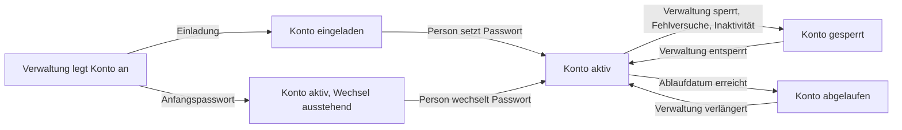

# Benutzerverwaltung

> **Entwurf.** Dieses Kapitel beschreibt die Verwaltung **lokaler Konten** — derjenigen Konten, die
> OPAA selbst führt. Konten, die über einen Identitätsanbieter entstehen, werden dort verwaltet, wo
> sie herkommen; in der Kontenliste stehen sie mit ihrer Herkunft und ihrer Rolle, aber ohne
> Zustand, Ablauf und Aktivität — was sich an ihnen ändern lässt, sagen die Abschnitte 6 und 7.
> Einrichtung des Anmeldewegs, Erststart, Umgebungsvariablen und E-Mail-Versand stehen im Kapitel
> [Deployment](deployment.md); hier geht es um die täglichen Abläufe.

## 1. Wann diese Verwaltung gebraucht wird

Die lokale Benutzerverwaltung ist **abschaltbar und im Auslieferungszustand aus**. Zwei Lagen
brauchen sie:

- **Ein Haus ohne Identitätsanbieter** — oder eines, dessen Anbindung noch nicht steht. Dann ist sie
  der einzige Anmeldeweg.
- **Jede Installation für ihre Systemverwaltung.** Das Konto, mit dem die Verwaltung beim Erststart
  hereinkommt, ist immer ein lokales Konto. Es bleibt anmeldefähig, auch wenn die Verwaltung
  regulärer lokaler Konten aus ist.

Läuft ein Identitätsanbieter, empfiehlt das Kapitel [Deployment](deployment.md) die Verwaltung im
Regelbetrieb **aus** zu lassen: Lokale Konten laufen an den Ein- und Austrittsprozessen des Hauses
vorbei, und jedes von ihnen ist ein Zugang, den niemand automatisch entzieht. Die Gegenmittel dazu
stehen in Abschnitt 6.

Einschalten, Abschalten und die Regeln darunter liegen unter **Administration → Benutzer →
Einstellungen** in der Karte „Lokale Anmeldung"; die Konten selbst stehen im Bereich **Konten**
daneben. Jede dieser Änderungen steht im Nachweisprotokoll.

**Wer neben einem Identitätsanbieter mit einem lokalen Konto hereinkommen will**, ruft
**`/login/system`** auf. Grund: Läuft im Browser noch eine Sitzung beim Identitätsanbieter, meldet
die reguläre Anmeldeseite automatisch damit an und ist fort, bevor ihre Maske für lokale Konten
benutzbar wird. `/login/system` schaltet diese Automatik für den Browser-Tab ab und führt dann zur
regulären Anmeldeseite, die damit stehen bleibt. Abmelden ist dafür nicht nötig und auch kein guter
Weg — es beendet die Sitzung beim Identitätsanbieter mit. Die Adresse gehört in die Anleitung für
die Personen, die beide Anmeldewege haben: Auf der Anmeldeseite verlinkt ist sie nur, solange die
lokale Verwaltung abgeschaltet ist.

## 2. Ein Konto anlegen

„Konto anlegen" fragt fünf Dinge ab: **E-Mail-Adresse** (sie ist die Anmeldekennung), **Anzeigename**,
**Rolle**, **Ablaufdatum** und **Anlagegrund**. Die letzten beiden sind keine Formalität — siehe
Abschnitt 3.

Für den Zugang gibt es zwei Wege, die das Formular zur Wahl stellt:

| Weg | Was passiert | Wann passend |
|---|---|---|
| **Einladung per E-Mail** (Vorgabe) | Das Konto entsteht im Zustand „eingeladen", ohne Passwort. Die Person erhält einen Einmal-Link und legt ihr Passwort selbst fest. Die Verwaltung kennt es nie. | Der Regelfall, sobald der E-Mail-Versand steht. |
| **Anfangspasswort jetzt erzeugen** | OPAA erzeugt ein Passwort, zeigt es **einmalig** an und verlangt von der Person bei der ersten Anmeldung einen Wechsel. | Wenn kein Postfach erreichbar ist oder die Übergabe mündlich erfolgen soll. |

Das erzeugte Anfangspasswort erscheint in einem Fenster, das sich nur über seine eigene Schaltfläche
schließt, und ist danach nicht wieder abrufbar. Wer es verliert, setzt das Konto zurück
(Abschnitt 5) — ein zweiter Abruf ist nicht vorgesehen.

Die Adresse muss unter den lokalen Konten eindeutig sein, ohne Rücksicht auf Groß- und
Kleinschreibung. Dass dieselbe Adresse zusätzlich bei einem Identitätsanbieter existiert, ist
zulässig: Das sind zwei Konten, und OPAA führt sie getrennt.

### Den Link ohne E-Mail-Versand übergeben

Ist kein Mailserver eingerichtet, fehlt die öffentliche Adresse der Installation oder scheitert der
Versand, zeigt OPAA den Einladungslink **an** — genau einmal, mit dem Hinweis, dass er nicht wieder
abrufbar ist. Die Verwaltung übergibt ihn dann auf einem anderen, nachvollziehbaren Weg.

Zwei Dinge sind dabei wichtig:

- **Das Protokoll unterscheidet die Fälle.** Zu jeder Einladung, jeder Rücksetzung und jeder Übergabe
  steht im Nachweisprotokoll, ob die Nachricht zugestellt wurde, ob der Versand gescheitert ist oder
  ob der Link angezeigt wurde. Eine Weitergabe außerhalb des Systems ist damit von einer Zustellung
  unterscheidbar.
- **Ohne öffentliche Adresse der Installation ist der Link ein Pfad.** Er beginnt dann mit `/` und
  braucht die Adresse der Installation davor. Das Fenster sagt das; wie die Adresse gesetzt wird,
  steht im Kapitel [Deployment](deployment.md).

Ein Link ist **einmal** einlösbar, und ein neuer macht einen älteren ungültig. Die Seite, auf die er
führt, entfernt ihn sofort aus der Adresszeile — ein Neuladen hilft deshalb nicht weiter, die Person
öffnet den Link aus der Nachricht erneut.

## 3. Anlagegrund und Ablaufdatum

Beide Felder sind das, was lokale Konten prüfbar hält.

**Der Anlagegrund ist ein Pflichtfeld** (höchstens 200 Zeichen) und **zweckgebunden**: Er nennt den
dienstlichen Anlass des Kontos und den Grund seiner Befristung. Nicht hineingehören Angaben zu
Gesundheit, Beschäftigungsverhältnis, Leistung, Disziplinarsachverhalten oder Dritten. Der Hilfetext
des Formulars sagt das, und zwar aus einem konkreten Grund: **Die betroffene Person liest den Grund
in ihren eigenen Einstellungen.** Er ist Teil ihrer Selbstauskunft. Im Nachweisprotokoll erscheint er
nie als Wert, sondern höchstens als Name eines geänderten Feldes.

Brauchbare Gründe sind kurz und sachlich: „Sachbearbeitung Meldewesen, Vertretung bis Jahresende",
„Externe Prüfbegleitung Jahresabschluss", „Hospitation Bauamt, drei Monate".

**Das Ablaufdatum ist vorbelegt** und vom Verwalter änderbar. Es lässt sich auch entfernen — dann
verlangt das Formular ein ausdrückliches Häkchen „Kein Ablaufdatum", und das Konto erscheint in der
Auflagenprüfung (Abschnitt 6), bis es befristet wird. Ein abgelaufenes Konto ist nicht gelöscht: Es
kann sich nicht anmelden, laufende Sitzungen enden, und die Liste hebt es hervor. Wer es weiter
braucht, trägt ein neues Datum ein.

## 4. Sperren und Entsperren

**Sperren ist der Regelweg, Löschen die Ausnahme.** Eine Sperre beendet alle Sitzungen des Kontos
sofort, nicht erst beim Ablauf des Zugangstokens, und die Person erfährt beim nächsten Aufruf, dass
und warum sie sich neu anmelden muss. Sie erhält zusätzlich eine Nachricht zum Zeitpunkt der
Handlung; ein optionaler Satz aus dem Sperrdialog wird darin zitiert.

Drei Dinge sperren ein Konto:

| Anlass | Wer hebt sie auf | Nachricht an die Person |
|---|---|---|
| **Die Verwaltung** | Die Verwaltung, über „Entsperren" | ja |
| **Fehlversuche** — mehrere falsche Passwörter in Folge | Sie endet nach kurzer Zeit von selbst; „Entsperren" hebt sie sofort auf; ein eingelöster Rücksetzlink ebenfalls | nein |
| **Inaktivität** — das Konto war lange nicht in Gebrauch | Die Verwaltung, über „Entsperren" | ja |

Die Fehlversuch-Sperre schickt **bewusst keine** Nachricht: Sie wäre sonst ein Belästigungskanal für
jeden, der eine Adresse kennt. Sie schneidet die Selbsthilfe auch nicht ab — „Passwort vergessen"
bleibt wirksam, und wer den Link aus seinem Postfach einlöst, ist damit wieder drin. Der Besitz des
Postfachs ist der Nachweis, den die Sperre verlangt.

Die **Anmeldeseite nennt den Grund einer abgelehnten Anmeldung nicht**. Ob eine Adresse unbekannt
ist, das Passwort falsch, das Konto gesperrt, abgelaufen oder noch nicht bestätigt — die Antwort ist
immer dieselbe. Das ist Absicht: Eine Antwort, die nach dem richtigen Passwort den Zustand nennt,
bestätigt einem Angreifer genau dieses Passwort. Die Person erfährt den Grund auf dem Weg, den
dieser Abschnitt beschreibt — per Nachricht und beim nächsten Aufruf einer laufenden Sitzung.

Das eigene Konto lässt sich hier nicht sperren und nicht löschen. Und das **letzte** anmeldefähige
Systemverwalterkonto lässt sich weder sperren noch befristen, in der Rolle herabsetzen oder löschen:
OPAA lehnt den Versuch mit einem Hinweis ab, statt die Installation auszusperren.

## 5. Passwort zurücksetzen oder erzeugen

Zwei Wege, dieselbe Wirkung auf laufende Sitzungen — beide beenden sie:

- **Rücksetz-Link per E-Mail.** Die Person erhält einen Einmal-Link und wählt ihr Passwort selbst.
  Mit demselben Rückfall auf die Anzeige des Links wie bei der Einladung (Abschnitt 2).
- **Passwort erzeugen.** OPAA zeigt ein neues Passwort einmalig an; die Person muss es bei der
  nächsten Anmeldung wechseln.

In beiden Fällen sagt OPAA der Person, **warum** ein Wechsel verlangt wird — „Ihr Passwort wurde von
der Systemverwaltung zurückgesetzt" steht an anderer Stelle als „Bitte legen Sie Ihr erstes Passwort
fest". Ein administratives Zurücksetzen **bestätigt keine E-Mail-Adresse**: Ein Konto, das seine
Adresse noch nicht bestätigt hat, wird dadurch nicht anmeldefähig.

## 6. Die Liste und die Auflagenprüfung

Die Kontenliste im Bereich **Konten** führt **alle Konten der Installation** — lokale und die der
Identitätsanbieter. Die **Herkunft** steht an jeder Zeile: „Lokal" mit einem Schlüssel, sonst der
Name des Anbieters. Der Filter „Herkunft" grenzt auf lokale Konten, auf alle Anbieter oder auf einen
einzelnen Anbieter ein.

Ein **lokales Konto** zeigt Zustand, Rolle, Ablauf, Anlagedatum, Anlagegrund und eine
**Aktivitätsklasse**. Die Klasse ist grob — „nie", „länger nicht genutzt", „aktiv" — und bewusst so:
Ein exakter Zeitstempel der letzten Nutzung wäre der Rohstoff für eine Anwesenheitsauswertung. Nach
Aktivität lässt sich deshalb auch **nicht sortieren**, und es gibt **keinen Export** der Liste. Das
ist eine dauerhafte Eigenschaft dieser Ansicht.

Sortieren lässt sich über die Spaltenköpfe Name, E-Mail, Herkunft, Rolle, Zustand, Ablauf und
Angelegt. Drei davon ordnen keine Wörter, sondern Kategorien, und tun das nach einer festen
Reihenfolge statt alphabetisch:

| Spalte | Reihenfolge aufsteigend |
|---|---|
| Herkunft | lokale Konten, dann die Anbieter nach Namen, zuletzt Konten ohne Anbieterzeile |
| Rolle | Nutzer, Revision, Systemverwaltung |
| Zustand | gesperrt, abgelaufen, eingeladen, aktiv — Anbieterkonten zuletzt, sie tragen keinen |

Der Zustand sortiert damit das nach oben, was eine Entscheidung braucht.

Ein **Konto eines Identitätsanbieters** zeigt Herkunft und Rolle, aber weder Zustand noch Ablauf
noch Aktivität: Sein Lebenszyklus liegt beim Anbieter, und die Prüfpflicht dieses Kapitels gilt ihm
nicht. Steht in seiner Zustandsspalte „Anbieter deaktiviert", kann sich niemand mehr über diesen
Anbieter anmelden; „Anmeldung nicht möglich" heißt, dass zu seinem Issuer gar keine Anbieterzeile
mehr existiert — das Konto bleibt, der Weg hinein ist zu. In der Spalte Herkunft steht dann „Kein
Anbieter", und der Tooltip nennt den Issuer. Sein Zeilenmenü bietet „Rolle ändern"
(Abschnitt 7) und den Weg zur Anbieterverwaltung.

Drei Filter bedienen die Prüfpflicht — sie beschreiben lokale Konten und blenden Anbieterkonten
aus:

- **ohne Ablaufdatum** — die Konten, die keine Befristung tragen,
- **länger nicht genutzt** — Kandidaten für eine Sperre oder Löschung,
- **offene Einladungen** — Konten, deren Einladung niemand eingelöst hat.

Ein Hinweis über der Liste nennt die beiden Zahlen „Konten ohne Ablaufdatum" und „offene
Einladungen" und führt direkt in den passenden Filter. Er verschwindet, sobald beide null sind. Die
Zahl und die Liste dahinter meinen dieselben Konten: Das Notanker-Konto der Systemverwaltung
erscheint in keiner von beiden. Es soll unbefristet bleiben — es ist der Weg zurück in eine
ausgesperrte Installation und deshalb kein Fall für die Auflagenprüfung.

Im Filter **länger nicht genutzt** fehlt es ebenfalls, dort aus einem eigenen Grund: Dieser Filter
zeigt Konten, an denen eine Sperre oder eine Löschung der nächste Schritt wäre — beides ist am
Notanker-Konto nicht vorgesehen, es soll gerade unbenutzt bleiben, und die automatische Sperre nach
Inaktivität lässt es aus demselben Grund aus. Wie lange es ruht, steht weiterhin in seiner eigenen
Zeile.

Dazu kommen zwei Automatiken, die die Prüfung am Laufen halten: Vor einem Ablauf erhalten die Person
und die Systemverwaltung eine Nachricht, und einmal im Quartal geht eine Wiedervorlage an die
Systemverwaltung — mit der Zahl der Konten ohne Ablaufdatum und einem Link auf die Liste, ohne Namen.
Systemverwalterkonten sind von keiner dieser Regeln ausgenommen; einzig in der Zahl der
Wiedervorlage bleibt das Notanker-Konto außen vor, weil es unbefristet bleiben soll.

## 7. Rollen

Die Rolle entscheidet, was ein Konto in der ganzen Anwendung darf; die Rechte an einzelnen Räumen und
Bibliotheken werden dort vergeben, nicht hier.

| Rolle | Bedeutung |
|---|---|
| **Nutzer** | Der Regelfall: fragen, eigene Inhalte verwalten, nutzen, was freigegeben ist |
| **Systemverwaltung** | Alles unter „Administration": Konten, Anbieter, Modelle, E-Mail, Suche, Erscheinungsbild |
| **Revision** | Lesender Zugriff auf das Nachweisprotokoll, ohne Verwaltungsrechte |

Die Rolle eines lokalen Kontos steht im Dialog „Bearbeiten". Die Rolle eines Anbieterkontos ändert
die Systemverwaltung über „Rolle ändern …" im Zeilenmenü — es sei denn, der Anbieter führt die
Rollen über seinen Rollen-Claim; dann ist der Eintrag deaktiviert und sagt das, weil ein hier
gesetzter Wert bei der nächsten Anmeldung der Person überschrieben würde. Für beide Kontotypen gilt
derselbe Schutz: Dem letzten anmeldefähigen Systemverwalter lässt sich die Rolle nicht entziehen.

Systemverwalterkonten sind **persönliche** Konten, je Person eines — keine Sammelkonten. Das
Notanker-Konto, das der Erststart anlegt, ist davon ausgenommen und kein Arbeitskonto; wofür es
gedacht ist und welche Auflagen dafür gelten, steht im Kapitel [Deployment](deployment.md).

## 8. Löschen oder sperren

**Löschen ist die Ausnahme.** Für das Ausscheiden einer Person ist die Sperre der vorgesehene Weg:
Sie entzieht den Zugang sofort und lässt nachvollziehbar, dass es dieses Konto gab.

Gelöscht werden kann ein lokales Konto nur, wenn **nichts mehr darauf verweist**. Das ist mehr als
Besitz: Neben einer eigenen Bibliothek, einem Raum außer dem persönlichen und einem Chat sperren
auch Rechtevergaben, Raumzuordnungen, Geltungsbereiche einer anlassbezogenen Klärung sowie
**Nachweiseinträge** über Gruppenmitgliedschaften und Rechteänderungen. Sonst lehnt OPAA die
Löschung ab und verweist auf die Sperre.

Eine Ausnahme ist die Befugnis „Sicht als" ([Suche](suche.md), Abschnitt 8.3): Sie hält keine
Löschung auf. Hat das Konto solche Befugnisse erteilt, **entzieht OPAA jede noch gültige davon beim
Löschen** — einzeln und mit einem eigenen Eintrag im Nachweisprotokoll, wie bei einem Entzug von
Hand; die Personen, die sie hielten, verlieren sie damit. Alle übrigen Befugnisse, an denen das
Konto beteiligt war — die abgelaufenen und die bereits entzogenen, die es erteilt oder entzogen hat,
und die es selbst hielt —, enden mit ihm, aber **ohne eigenen Eintrag**. Unberührt bleibt, woran das
Konto nicht beteiligt war.

Praktisch heißt das: Löschen ist der Weg für ein Konto, das nie benutzt wurde — eine falsch getippte
Adresse, eine Einladung an die falsche Person, ein Testkonto. Wer dagegen je Mitglied einer Gruppe
war, hinterlässt einen Nachweiseintrag, der bleibt; ein solches Konto ist nicht mehr löschbar,
solange dieser Eintrag liegt — wie lange das ist, steht in [Suche](suche.md), Abschnitt 8.4. Das
ist beabsichtigt — der Nachweis, wer wann welche Rechte hatte, überlebt das Konto. Für alle diese
Fälle ist die Sperre der vorgesehene Weg.

Das Notanker-Konto der Systemverwaltung lässt sich **nicht löschen**. Sperren, Befristen und
Herabsetzen sind daran nicht grundsätzlich gesperrt — sie werden abgelehnt, solange es der letzte
anmeldefähige Systemverwalter ist. Von der Sperre nach Inaktivität ist es ausgenommen.

## 9. Ein Konto an einen Identitätsanbieter übergeben

Stellt eine Installation, die mit lokalen Konten angefangen hat, später auf einen Identitätsanbieter
um, soll niemand von vorn beginnen: Räume, Mitgliedschaften und Rolle hängen am Konto, nicht am
Passwort. Dafür gibt es die **Übergabe** — den einzigen Weg, auf dem ein Konto seine Identität
wechselt.

**Die Übergabe braucht zwei Parteien.** Die Systemverwaltung stößt sie an und wählt dabei nur den
Anbieter; **einlösen kann sie allein die betroffene Person**, indem sie sich bei diesem Anbieter
anmeldet. Damit kann niemand ein fremdes Konto auf eine Kennung schreiben, die er selbst
kontrolliert — und niemand sich vertippen: Die Kennung beim Anbieter kommt aus der Anmeldung der
Person, sie wird nirgends eingegeben.

**So läuft es ab**

1. Zeilenmenü des Kontos → **„Übergabe anstoßen …"**. Der Dialog fragt nach dem
   Identitätsanbieter und nach einem **Anlass** (Pflichtfeld, höchstens 200 Zeichen; er gehört zur
   Sache, nicht zur Person — dieselbe Regel wie beim Anlagegrund). Ein Feld für eine Kennung gibt es
   nicht.
2. Die Person erhält eine E-Mail mit einem Link, der **72 Stunden** und **einmal** gilt. Geht die
   Nachricht nicht hinaus, zeigt OPAA den Link genau einmal zur Übergabe von Hand an — mit demselben
   Rückfall wie bei der Einladung (Abschnitt 2). Bis hierher ändert sich am Konto nichts: Es bleibt
   mit Passwort benutzbar.
3. Der Link führt auf eine Seite, die zeigt, **was mitgeht**: der persönliche Raum, die Zahl der
   Raum- und Gruppenmitgliedschaften und die Rolle, dazu der Anlass und der Name des Anbieters. Die
   Seite nennt auch, was danach gilt: Anmeldung nur noch über den Anbieter, das bisherige Passwort
   verfällt, einen Rückweg gibt es nicht.
4. Ein Klick führt zur Anmeldung beim Anbieter. Danach ist die Übergabe vollzogen: Das Konto gehört
   zur Anbieteridentität, alle laufenden Sitzungen enden, und die Person bekommt eine
   Bestätigungsmail. Inhalte, Mitgliedschaften und Rolle sind unverändert.

**Was abgelehnt wird**

| Fall | Antwort |
|---|---|
| Das Notanker-Konto der Systemverwaltung | Abgelehnt. Der Menüeintrag ist an diesem Konto abgeblendet und nennt den Grund: Es ist der Weg zurück in eine Installation ohne funktionierenden Identitätsanbieter und muss deshalb ein lokales Konto bleiben. |
| Es bliebe kein weiterer anmeldefähiger Systemverwalter | Abgelehnt — beim Anstoßen **und** beim Einlösen. Zwischen beidem können Wochen liegen; geprüft wird der Stand im Moment der Handlung. |
| Unter dieser Anbieteridentität besteht schon ein Konto | Abgelehnt. Zwei Konten werden nie zusammengeführt. Wer sich vorher bereits über den Anbieter angemeldet hat, hat zwei Konten und keinen Übergabeweg; die Inhalte des lokalen Kontos müssen dann von Hand übertragen werden. |
| Die Person meldet sich bei einem anderen Anbieter an | Abgelehnt. Die Übergabe gilt für den Anbieter, den der Anstoß genannt hat. |
| Das Konto ist inzwischen gesperrt oder abgelaufen | Abgelehnt, mit derselben Antwort wie ein ungültiger Link. Eine Übergabe hebt weder eine Sperre noch ein Ablaufdatum auf: Wer zwischen Anstoß und Einlösung ausscheidet, kommt über den Link nicht zurück herein. Eine Sperre nach Fehlversuchen ist davon ausgenommen — sie endet von selbst. |
| Die Systemverwaltung hat das Konto inzwischen geändert | Ein Adresswechsel, eine Sperre und ein erzeugtes Passwort schließen den offenen Übergabe-Link — wie sie einen Einladungs- oder Rücksetzlink schließen. Die Übergabe wird dann neu angestoßen. |
| Der Identitätsanbieter wurde gelöscht | Mit der Anbieterzeile verschwinden alle für sie vorbereiteten Übergaben. Die Links laufen ins Leere und werden nach dem Anlegen des neuen Anbieters neu angestoßen. |
| Der Link ist abgelaufen, verbraucht oder unbekannt | Dieselbe Antwort für alle drei: Der Link ist nicht mehr gültig. Die Systemverwaltung stößt die Übergabe dann erneut an. |

> **Bei einer Sammelumstellung an die Grenze denken.** Vorschau und Einlösung teilen sich ein
> Anfragebudget je Client-Adresse — und eine Behörde sitzt in der Regel mit allen Arbeitsplätzen
> hinter einer Adresse, je Person fallen zwei Aufrufe an. Wer eine ganze Abteilung an einem
> Vormittag umstellt, hebt das Budget vorübergehend an; die Vorgabe und die beiden Variablen stehen
> in der Variablentabelle des Kapitels [Deployment](deployment.md). Eine überschrittene Grenze ist
> keine verbrauchte Übergabe: Der Link bleibt gültig, die Person versucht es nach der genannten
> Wartezeit erneut.

> **Der Anlass steht nicht im Nachweisprotokoll.** Protokolliert werden Anstoß und Abschluss mit der
> Kennung des Anbieters, dem Zustellweg und Zahlen — nie die Kennung der Person beim Anbieter, nie
> ihre Adresse, ihr Name oder der Anlass im Wortlaut. Den Anlass liest die betroffene Person auf der
> Einlöseseite.

## 10. Selbstregistrierung

Selbstregistrierung ist **aus** und wirkt nur mit einer **nichtleeren Liste zulässiger
Adressdomänen**. Eine leere Liste bedeutet „niemand kann sich registrieren" — nicht „alle". Die
Verwaltung lässt sich ohne Domäne auch nicht einschalten und sagt, was fehlt.

Was ein selbstregistriertes Konto erhält: immer die Rolle „Nutzer", ein **Pflicht-Ablaufdatum** und
den festen Anlagegrund „Selbstregistrierung". Bis die Adresse über den Bestätigungslink bestätigt
ist, ist das Konto nicht anmeldefähig.

Drei Eigenschaften, die im Alltag auffallen:

- **Eine belegte Adresse ergibt kein zweites Konto**, und die Antwort ist dieselbe wie bei einer
  freien Adresse. An die belegte Adresse geht auch keine Hinweisnachricht — sie wäre selbst ein Weg,
  Adressen auszuprobieren.
- **Eine noch unbestätigte Registrierung kann es erneut versuchen** und erhält ihren
  Bestätigungslink neu. Name und Passwort der ersten Registrierung bleiben dabei erhalten.
- **Eine unbestätigte Registrierung ist keine Sackgasse, aber auch nicht reparierbar.** Ein
  administratives Zurücksetzen bestätigt die Adresse nicht. Ist die Selbstregistrierung inzwischen
  abgeschaltet, ist der Ausweg: das unbestätigte Konto **löschen** (es besitzt nichts, also geht das)
  und die Person regulär **einladen**.

Das Einschalten der Selbstregistrierung ist ein Punkt, der vor der Inbetriebnahme mit der
Personalvertretung zu klären ist; das Kapitel [Deployment](deployment.md) führt die Punkte auf.

## 11. Was Nutzende selbst können

Ein lokales Konto findet in seinen eigenen Einstellungen:

- **„Anlass des Kontos"** — den Anlagegrund, den die Systemverwaltung festgehalten hat.
- **„Passwort ändern"** — mit dem aktuellen Passwort. Die eigene Sitzung bleibt bestehen, alle
  übrigen Sitzungen des Kontos enden.

Ohne Anmeldung, wenn der Fluss eingeschaltet ist:

- **„Passwort vergessen"** — die Antwort ist immer dieselbe, ob es zu der Adresse ein Konto gibt oder
  nicht. Wer keine Nachricht erhält, hat entweder kein Konto unter dieser Adresse, oder das Konto ist
  von der Verwaltung gesperrt, abgelaufen oder noch eingeladen. In diesen Fällen hilft nur die
  Systemverwaltung.
- **„Konto registrieren"** — siehe Abschnitt 10.

Ein Konto eines Identitätsanbieters sieht keinen dieser Punkte; sein Passwort verwaltet der Anbieter.

## 12. Regeln und Fristen

Die Karte „Lokale Anmeldung" unter Administration → Benutzer → Einstellungen führt die Regeln, die für alle lokalen
Konten gelten. Sie wirken ab der nächsten Anwendung, nicht rückwirkend auf bestehende Passwörter.

| Einstellung | Bedeutung | Grenzen |
|---|---|---|
| Adress-Domänen der Selbstregistrierung | Zulässige Adressdomänen; Pflicht für die Selbstregistrierung | leer = keine Registrierung möglich |
| Mindestlänge des Passworts | Untergrenze der Passwortrichtlinie | 8 bis 64 Zeichen |
| Vorbelegtes Ablaufdatum (Tage) | Vorschlag beim Anlegen und Pflichtfrist selbstregistrierter Konten | mindestens 1 Tag |
| Sperre nach Inaktivität (Tage) | Frist, nach der ein ungenutztes Konto gesperrt wird | mindestens 30 Tage |
| Einladungslink gültig (Stunden) | Gültigkeit eines Einladungslinks | 1 bis 720 Stunden |
| Rücksetzlink gültig (Minuten) | Gültigkeit eines Rücksetz- und Bestätigungslinks | 1 bis 1440 Minuten |

Die **Passwortrichtlinie** selbst ist knapp und bewusst ohne Komplexitätsregeln: mindestens die
eingestellte Länge, höchstens 64 Zeichen, nicht gleich der eigenen E-Mail-Adresse und nicht auf der
mitgelieferten Liste besonders häufiger Passwörter. Einen erzwungenen regelmäßigen Wechsel gibt es
nicht. Die Eingabemasken zeigen die Regel an und bieten „Sicheres Passwort erzeugen".

> **Hinweis zur Länge:** Die Obergrenze ist zusätzlich durch die Zahl der Bytes begrenzt. Umlaute und
> Sonderzeichen zählen mehrfach; eine sehr lange Passphrase aus Sonderzeichen kann deshalb vor der
> Zeichengrenze abgewiesen werden. Die Eingabemaske sagt das im Feldfehler.

## 13. Was es hier nicht gibt

- **Keinen zweiten Faktor.** Lokale Konten melden sich mit Adresse und Passwort an. Für lokale
  Systemverwalterkonten lässt sich stattdessen der Zugang auf bestimmte Netze begrenzen; das Kapitel
  [Deployment](deployment.md) beschreibt, wie.
- **Keine Verwaltung des Lebenszyklus der Konten eines Identitätsanbieters.** Sperren, Befristen
  und Löschen erfolgen beim Anbieter; hier sind diese Konten mit Herkunft und Rolle sichtbar, und
  nur die Rolle lässt sich ändern.
- **Kein Export und kein Massenabruf der Kontenliste** (Abschnitt 6).
- **Keine Übersicht der eigenen Sitzungen.** Eine Person kann ihre übrigen Sitzungen über einen
  Passwortwechsel beenden, aber nicht einzeln einsehen oder abmelden.
- **Kein Zusammenführen zweier bestehender Konten.** Der einzige Weg, ein lokales Konto an eine
  Anbieteridentität zu binden, ist die Übergabe aus Abschnitt 9 — und nur, solange unter dieser
  Identität noch kein Konto besteht. Einen Rückweg von einer Anbieteridentität zu einem lokalen
  Konto gibt es nicht.
