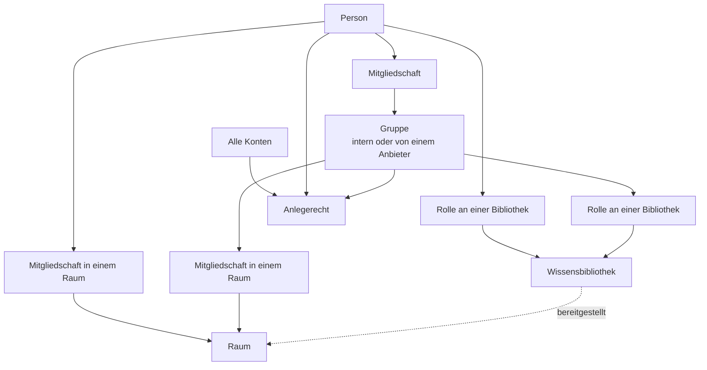

# Bibliotheken und Berechtigungen

> **Entwurf.** Dieses Kapitel beschreibt, wer in einer OPAA-Installation was lesen, ändern,
> freigeben und anlegen darf — und wie sich das nachweisen lässt. Es ist der eine Ort für das
> Berechtigungsmodell: Subjekte, Rollen, Gruppen, Anlegerechte, Vollmachten, Lebenszyklus und
> Rechtehistorie. Die Einrichtung des Anmeldewegs und des Verzeichnisabgleichs steht im Kapitel
> [Deployment](deployment.md), die Verwaltung lokaler Konten in der
> [Benutzerverwaltung](benutzerverwaltung.md), der Rechtefilter der Suche im Kapitel
> [Suche](suche.md).

## 1. Der Aufbau in vier Objekten

| Objekt | Was es ist | Was es an Rechten trägt |
|---|---|---|
| **Organisation** | Das Haus. Heute genau eine je Installation | Die Grenze jeder Berechtigung: Gruppen, Konten, Bibliotheken und Räume gehören ihr, und nichts wirkt darüber hinaus |
| **Wissensbibliothek** | Verwaltungseinheit für Dokumente mit genau einer Quelle | Eigene Rollen, eine Auffindbarkeit, einen Eigentümer |
| **Raum** (Space) | Arbeitsbereich, in dem Chats liegen und Bibliotheken bereitgestellt werden | Eigene Rollen, eigene Mitgliedschaften, einen Eigentümer |
| **Gruppe** | Eine benannte Menge von Konten | Kein Recht an sich selbst — sie ist das *Subjekt*, dem Rollen, Anlegerechte und Eigentum erteilt werden |

Zwei Sätze gelten in allen folgenden Abschnitten:

- **Ein Raum erweitert keine Leserechte.** Wer in einem Raum arbeitet, sieht dort die
  bereitgestellten Bibliotheken nur, soweit er sie ohnehin lesen darf; die Bereitstellung verengt
  den Suchbereich, sie öffnet ihn nicht.
- **Rechte wirken in der Suche, nicht dahinter.** Jede Suchabfrage trägt den Filter auf die
  lesbaren Bibliotheken in sich. Es gibt keinen Administrator-Durchgriff auf Inhalte
  (Abschnitt 10).

## 2. Vier Wörter, vier verschiedene Dinge

Die Oberfläche und dieses Handbuch benutzen durchgehend diese vier Begriffe. Sie sind nicht
austauschbar, und keiner von ihnen ist eine schwächere Fassung eines anderen.

| Begriff | Bedeutung | Gebunden an |
|---|---|---|
| **Rolle** | Gestufte Berechtigung an **einem Objekt** — „Leserin dieser Bibliothek", „Administrator in diesem Raum" | Person **oder** Gruppe; unbefristet oder mit Ablaufdatum |
| **Anlegerecht** | Installationsweites Recht, etwas **anzulegen** (Räume, Bibliotheken, interne Gruppen). Ohne Gegenstand, unbefristet, **öffnet nie einen Inhalt** | Person, Gruppe oder **„Alle Konten"** |
| **Vollmacht** | Befristete, begründungspflichtige Erlaubnis mit Gegenstand: „Sicht als" in der Suchdiagnose und der Geltungsbereich einer anlassbezogenen Klärung im Nachweisprotokoll | **genau eine Person**, nie eine Gruppe |
| **Systemrolle** | Systemverwaltung und Revision — die beiden installationsweiten Rollen aus der [Benutzerverwaltung](benutzerverwaltung.md), Abschnitt 7 | genau ein Konto |

Dazu zwei Maße, die im Text gebraucht werden und in keiner Oberfläche als Wort auftauchen:

- **Wirksam** ist eine Gruppe, der ein Recht **erteilt** werden darf: nicht aufgelöst, ihr Anbieter
  eingeschaltet, ihre Mitgliedschaft noch gepflegt. Eine wirksame Gruppe **darf leer sein**.
- **Handlungsfähig** ist eine wirksame Gruppe mit mindestens einem **aktiven** Konto. Das ist das
  Maß dafür, ob sie als Eigentümerin oder als Raumadministratorin **handeln** kann (Abschnitt 13).

## 3. Wem ein Recht gegeben werden kann

| Subjekt | Rolle an Bibliothek oder Raum | Anlegerecht | Eigentum | Vollmacht |
|---|---|---|---|---|
| **Person** | ja | ja | Bibliothek und Raum | ja |
| **Gruppe** | ja | ja | Bibliothek (kein Raum) | nein |
| **„Alle Konten"** | ja — als Empfänger wie jeder andere | — (dort heißt dieselbe Art „Alle Konten") | nein | nein |

**Gruppen werden nicht in Personen aufgelöst.** Wer eine Bibliothek an „Referat 50" freigibt, gibt
sie an die Gruppe frei: Wer dort morgen Mitglied wird, liest sie ab dann, wer heute ausscheidet,
verliert sie mit der Mitgliedschaft. Das ist gewollt und der Grund, warum Freigaben an Gruppen
gepflegt bleiben, ohne dass jemand sie anfasst — und der Grund für das Zuwachssignal aus
Abschnitt 8.

**Gruppen verschachteln nicht.** Eine Gruppe hat genau die Mitglieder, die ihre Quelle ihr gibt;
eine übergeordnete Einheit aus dem Verzeichnis ist eine Anzeige- und Gliederungsangabe und
**vererbt keine Mitgliedschaft**. Eine Abteilung, die im Verzeichnis nur Untergruppen hat, ist in
OPAA eine **leere** Gruppe — eine Freigabe an sie erreicht niemanden.

## 4. Rollen an einer Wissensbibliothek

Die Bibliotheken, die eine Person lesen darf, stehen in der Hauptnavigation unter **„Wissen"**. Jede
Art von Bestand hat dort einen eigenen Punkt; der Menüpunkt und die Seite dahinter heißen gleich —
die [Prompt-Bibliotheken](prompt-bibliotheken.md) stehen unter **„Prompts"**. Rollen,
Auffindbarkeit, Herleitung und „Nachfolge offen" gelten für beide Arten gleich; dafür stehen bei
beiden dieselben Abschnitte — **„Berechtigungen"** als Liste auf der Seite (nicht mehr hinter einem
Knopf „Rechte verwalten"), **„Im Katalog auffindbar"**, **„Zuordnungen"** und **„Warum sehe ich
das?"** — bei einer Wissensbibliothek im Reiter „Freigaben", bei einer Prompt-Bibliothek im Reiter
„Verwaltung".

Der Reiter **„Freigaben"** einer Wissensbibliothek führt sie in dieser Reihenfolge:

| Abschnitt | Inhalt |
|---|---|
| **Eigentümer** | die zuständige Stelle mit Namen; über „Eigentum übergeben" reicht der Eigentümer sie an eine Person oder eine Gruppe weiter — mit Rückfrage, und die Eigentümerrolle geht mit. Auch die **Systemverwaltung** kann übergeben: So bekommt eine Bibliothek mit offener Nachfolge wieder eine handlungsfähige Stelle, ohne das Konto der ausgeschiedenen Person. Jede Übergabe steht mit Namen im Nachweisprotokoll |
| **Berechtigungen** | Personen, Gruppen und „Alle Konten" mit Rolle, Befristung und Entzug, dazu das Formular „Freigeben". Für „Alle Konten" stehen dabei nur **Leser** und **Bearbeiter** zur Wahl — in der Liste wie im Formular; für die Systemverwaltung darunter die Obergrenze „Freigabe an Alle erlaubt" |
| **Im Katalog auffindbar** | der Schalter mit eigenem „Auffindbarkeit speichern"; für die Systemverwaltung darunter die Obergrenze „Auffindbarkeit im Katalog erlaubt" |
| **Externer Zugang** | die Freigabe für Fremdzugänge |
| **Zuordnungen** | die Spaces, in denen die Bibliothek als Datenquelle bereitsteht |
| **Diagnosesperre** | ob die Bibliothek in einer fremden Suchdiagnose auftauchen darf |
| **Warum sehe ich diese Wissensbibliothek?** | die eigene Herleitung |

Jeder Abschnitt speichert für sich; einen gemeinsamen „Speichern"-Knopf über Abschnitte hinweg gibt
es nicht. Eine lesende Rolle sieht Eigentümer, Zuordnungen, Diagnosesperre und die Herleitung —
schreibgeschützt.

**Zuordnungen: wer welchen Space erfährt.** Die Liste der Spaces, in denen ein Bestand
bereitsteht, sehen alle Leseberechtigten — aber nur so weit, wie der Space selbst sichtbar ist.
Ab der Verwalterrolle steht jede Zuordnung mit Namen da, samt Urheber, Zeitpunkt und dem Hinweis
„nicht alle Mitglieder lesen", und jede lässt sich einzeln lösen. Wer nur liest oder bearbeitet,
sieht die Namen der Spaces, die ohnehin im Space-Verzeichnis stehen oder in denen er Mitglied ist;
private Spaces, zu denen er nicht gehört, erscheinen nur als Zahl — „+ 2 weitere, die Sie nicht
sehen können". Ein privater Space verspricht, dass nur seine Mitglieder von ihm wissen, und dieses
Versprechen gilt auch hier.

| Rolle | Darf |
|---|---|
| **Leser** (`VIEWER`) | Die Bibliothek durchsuchen, Treffer und Dokumentenliste sehen |
| **Bearbeiter** (`EDITOR`) | Zusätzlich Dokumente hochladen und löschen, Ordner anlegen, umbenennen und löschen, einen Indexierungslauf anstoßen, Metadaten pflegen |
| **Verwalter** (`MANAGER`) | Zusätzlich Rechte vergeben und entziehen — auch an alle Konten —, die Auffindbarkeit im Katalog setzen, die Quellverbindung sehen und ändern, die Bibliothek für [Fremdzugänge](fremdzugaenge.md) freigeben |
| **Eigentümer** (`OWNER`) | Zusätzlich löschen und das Eigentum übertragen |

Die Rollen sind gestuft: Wer Verwalter ist, darf alles, was ein Bearbeiter darf. Die
**Quellverbindung** einer Bibliothek — interner Serverpfad, Quelladresse, Zugangsdaten — bleibt
einem Bearbeiter verborgen und wird erst ab der Verwalterrolle sichtbar; sie ist
Infrastrukturangabe, nicht Konfiguration.

**Ein Recht kann befristet sein.** Jede Rolle wird mit oder ohne Ablaufdatum erteilt; mit dem
Ablauf endet sie, ohne dass jemand eingreift, und das Erlöschen steht im Nachweisprotokoll.

**Eigentum.** Eine Bibliothek gehört einer **Person** oder einer **Gruppe**. Wer sie anlegt, wählt
das: Als persönliche Bibliothek erhält die anlegende Person die Eigentümerrolle, bei einer Gruppe
als Eigentümerin erhält die Gruppe die Verwalterrolle — die anlegende Person muss Mitglied dieser
Gruppe sein. **Gruppeneigentum ist die haltbarere Wahl**: Es übersteht den Weggang einzelner
Personen, und genau dafür ist Abschnitt 13 sonst zuständig.

Weitere Rollen lassen sich schon beim Anlegen vergeben. Der Schritt „Freigaben" des Assistenten
wählt Person oder Gruppe mit derselben Auswahl wie der Abschnitt „Berechtigungen" an einer
bestehenden Bibliothek — mit denselben Regeln für geschützte Gruppen (Abschnitt 8) und derselben
Rückfrage vor einer Freigabe an die Gruppe eines externen Anbieters. Den Empfänger **„Alle Konten"**
bietet der Assistent nicht an: Ein Bestand, den es noch nicht gibt, hat keine Reichweite zu weiten,
und die Obergrenze, die über eine solche Freigabe entscheidet, gehört der angelegten Bibliothek.

### Reichweite: „Alle Konten" und Auffindbarkeit

**Es gibt keine getrennte Verteilungsstufe mehr.** Wie weit eine Bibliothek reicht, ergibt sich
allein aus ihrer Rechteliste. Wer sie dem ganzen Haus öffnen will, erteilt ein Recht an den
Empfänger **„Alle Konten"** — im selben Abschnitt „Berechtigungen" und mit demselben Ablaufdatum
wie bei einer Person oder einer Gruppe, aber **höchstens mit der Rolle „Bearbeiter"**: Verwaltung
und Eigentum sind Zuständigkeiten und bleiben an eine benannte Stelle gebunden; mehr steht gar
nicht erst zur Wahl und würde auch abgewiesen. Vor dem Erteilen fragt die Anwendung eigens zurück
und spricht die Reichweite aus; zurücknehmen lässt sich die Freigabe wie jede andere — auch ein
späterer Rollenwechsel an dieser Zeile fragt zurück.

In den Übersichten steht die Reichweite als **abgeleitete Kennzeichnung**: „Alle", „3 Gruppen, 2
Personen" oder „nur Sie". Sie ist keine Einstellung, sondern die Zusammenfassung dessen, was in der
Rechteliste steht.

Daneben trägt jede Bibliothek genau ein Feld, das niemanden benennt und das ihr Verwalter setzt:

| Feld | Werte | Wirkung |
|---|---|---|
| **Auffindbarkeit** | im Katalog auffindbar, auch ohne Berechtigung, ja/nein | Ob der **Eintrag** der Bibliothek — Name, Beschreibung, zuständige Stelle — im Katalog erscheint. Der **Inhalt** bleibt den Berechtigten vorbehalten. Vorgabe: nein |

Beides wird **historisiert** wie eine erteilte Rolle: Zu jedem Stichtag innerhalb der
Aufbewahrungsfrist ist belegbar, wie weit eine Bibliothek gereicht hat (Abschnitt 12) — die
Freigabe an alle Konten in der Rechtehistorie, die Auffindbarkeit in ihrer eigenen. Die
Freigabe für [Fremdzugänge](fremdzugaenge.md) ist ein weiteres Reichweitenfeld derselben Art.

### Der Katalog

Der **Katalog** ist ein eigener Punkt der Hauptnavigation neben „Wissen" und „Prompts". Er zeigt
Wissens- und Prompt-Bibliotheken gemischt: alle, die die Person lesen darf — über eine eigene Rolle,
eine Rolle über eine Gruppe oder die Freigabe an „Alle Konten" —, und dazu alle, die im Katalog
auffindbar sind. Die Übersichten unter „Wissen" und „Prompts" bleiben daneben die Orte, an
denen Bibliotheken angelegt und verwaltet werden.

| Element | Inhalt |
|---|---|
| **Suche** | Über Name und Beschreibung, ohne Rücksicht auf Groß- und Kleinschreibung; der Suchtext ist begrenzt |
| **Filter** | „Alle", „Wissen" oder „Prompts" |
| **Eintrag** | Art (Wissens- oder Prompt-Bibliothek), Name, Beschreibung, Umfang (Dokumente bzw. Prompts), in wie vielen Räumen sie bereitsteht, zuständige Stelle; in der Tabelle zusätzlich die Herkunft |
| **Seiten** | Die Einträge kommen seitenweise; „Weitere laden" hängt die nächste Seite an |

**Auffindbar ist nicht zugänglich.** Eine auffindbare Bibliothek, die die Person nicht lesen darf,
steht im Katalog mit dem Hinweis **„Auffindbar ohne Berechtigung — zuständig: …"** und führt nirgendwohin;
ihre Adresse antwortet „nicht gefunden" wie bei einer unbekannten Bibliothek. Zuständig ist der
Eigentümer — bei einer Gruppe ihr Name, bei einer Person ihr Anzeigename. Eine geschützte Gruppe und
eine Person ohne Anzeigenamen bleiben unbenannt, eine E-Mail-Adresse erscheint nie. Ist die
Nachfolge offen (Abschnitt 13.3), nennt der Hinweis deren Adressaten.

Die Systemverwaltung sieht im Katalog nicht mehr als andere: **Verwalten ist nicht Lesen.** Eine
Bibliothek, die sie nur verwaltet, erscheint dort nur, wenn sie auffindbar ist, und dann als Eintrag
ohne Zugriff. Der Katalog zeigt nie etwas aus einer anderen Organisation, und ein Eintrag enthält
Beschreibungen, nie Inhalte: keine Dokumente, keine Prompts.

### Freigabe-Obergrenze für Konnektorbibliotheken

Wer eine Konnektorbibliothek anlegen darf, entscheidet auch über ihre Reichweite — bis zu einer
**Obergrenze**, die ausschließlich die Systemverwaltung setzt. Ohne sie könnte, wer eine Bibliothek
aus einem Dateiverzeichnis, einem Webverzeichnis, einem Feed, Confluence oder einem Objektspeicher
anlegt, den eingespeisten Bestand im nächsten Schritt dem ganzen Haus öffnen — die Obergrenze ist
die technische Sicherung gegen genau diesen einen Schritt. Bibliotheken für Uploads tragen keine
Obergrenze: Dort kuratiert dieselbe Person ohnehin jedes Dokument einzeln.

**Die Obergrenze gilt je Bibliothek und wird nicht automatisch gesetzt.** Neu angelegt ist jede
Konnektorbibliothek zunächst **ungedeckelt**: Beide Erlaubnisse stehen offen, und die
Systemverwaltung muss sie eigens entziehen, damit die Obergrenze wirkt. Die Bibliothek selbst
startet trotzdem eng — sie trägt nur die Rechte, die der Anlegende erteilt, und ist nicht
auffindbar. Wer die Obergrenze nicht senkt, lässt dem Anlegenden also die Wahl bis hin zur Freigabe
an alle Konten. Ein Betrieb, der das systematisch verhindern will, prüft die Obergrenze
deshalb **nach jeder Neuanlage** einer Konnektorbibliothek, oder schränkt das Anlegerecht
„Konnektorbibliotheken anlegen" auf eine benannte Gruppe ein (Abschnitt 9) — dann entscheidet diese
Gruppe, wer überhaupt anlegen darf, bevor die Obergrenze greifen müsste.

Zu finden ist die Obergrenze auf der Detailseite der jeweiligen Bibliothek, Reiter „Freigaben" —
sichtbar und änderbar nur für die Systemverwaltung. Zwei Erlaubnisse:

| Erlaubnis | Wirkung, wenn entzogen |
|---|---|
| **Freigabe an alle Konten erlaubt** | Ein Recht an „Alle Konten" kann nicht mehr erteilt werden; ein bestehendes wird beim Entziehen sofort zurückgenommen |
| **Auffindbarkeit im Katalog erlaubt** | Die Bibliothek kann nicht mehr im Katalog gelistet werden; eine bestehende Listung wird sofort gelöscht |

**Wird eine Erlaubnis entzogen, wirkt das sofort — aber ausschließlich für diese beiden Dinge.**
Es gibt keine Übergangszeit und keinen Zustand „noch zu weit, aber geduldet". **Unberührt bleiben
erteilte Rechte an einzelnen Personen und Gruppen sowie eine bestehende Fremdzugangsfreigabe**
(Abschnitt „Die Freigabe einer Wissensbibliothek" im Kapitel [Fremdzugänge](fremdzugaenge.md)) —
beide müssen gesondert geprüft und, falls gewünscht, gesondert zurückgenommen werden. Jeder Vorgang
steht im Nachweisprotokoll: das Setzen der Obergrenze selbst und, falls ausgelöst, die dadurch
bewirkte Rücknahme der Freigabe oder der Auffindbarkeit.

Versucht die Eigentümerin oder ein Verwalter der Bibliothek anschließend, an alle Konten
freizugeben oder die Bibliothek trotz gesperrter Auffindbarkeit zu listen, weist die Anwendung das
mit einer Meldung ab, die die geltende Obergrenze beim Namen nennt und auf die Systemverwaltung
verweist — kein technischer Fehler, sondern eine erklärte Grenze. Der Schalter für die
Auffindbarkeit ist im Formular bereits gesperrt, mit demselben Hinweis, sodass die Grenze schon vor
dem Speichern sichtbar ist.

### Ordner, Speicherkontingent, Löschen

- **Ordner sind keine Rechtegrenze.** Sie gliedern eine Bibliothek für die Navigation;
  Berechtigungen hängen immer an der Bibliothek, und die Suche durchsucht stets den ganzen Bestand.
  Wer Ordner anlegt und wer sie pflegt, hängt am Quellentyp — in einer Upload-Bibliothek legt sie
  ein Bearbeiter selbst an, bei allen übrigen Quellentypen spiegelt der Lauf die Quelle
  ([Indexierung](indexierung.md), Abschnitt 2).
- **Das Löschen eines Ordners löscht die enthaltenen Dokumente** samt Chunks und Originaldateien,
  nach einer Bestätigung, die ihre Anzahl nennt. Ein einzelnes Dokument löscht ebenfalls ein
  Bearbeiter; ein Dokument, das die Quelle weiterhin liefert, kommt mit dem nächsten Lauf wieder —
  wer einen Bestand dauerhaft aus dem Index halten will, ändert die Quellkonfiguration der
  Bibliothek, nicht das einzelne Dokument.
- **Jede Bibliothek hat ein Speicherkontingent** (`OPAA_LIBRARY_QUOTA_BYTES`, Variablentabelle im
  Kapitel [Deployment](deployment.md)). Es wirkt am Upload und an den Konnektorpfaden gleich: Was
  darüber liegt, wird abgelehnt beziehungsweise im Laufprotokoll als übersprungen vermerkt.

## 5. Rollen in einem Raum

| Rolle | Darf |
|---|---|
| **Mitglied** | Den Raum betreten, Chats anlegen und führen, geteilte Chats lesen, die bereitgestellten Bibliotheken sehen — gefiltert auf den eigenen Zugriff |
| **Kurator** | Zusätzlich Bibliotheken bereitstellen und lösen, Inhalte ordnen |
| **Administrator** | Zusätzlich Mitglieder und Rollen verwalten, Einstellungen setzen, geteilte Inhalte zurückziehen |

Daneben steht der **Eigentümer** als eigenes Merkmal: Er allein — und die Systemverwaltung — darf
den Raum löschen. **Ein Raum gehört immer einer natürlichen Person.**

**Auch eine Gruppe wird Mitglied eines Raums, mit Rolle.** Ihre Mitglieder tragen diese Rolle ohne
eigene Zeile und verlieren sie im Moment, in dem sie die Gruppe verlassen. Hält jemand mehrere Wege
in denselben Raum — direkt und über zwei Gruppen —, gilt die stärkste Rolle.

Drei Regeln halten einen Raum handlungsfähig:

- **Er verliert nie sein letztes handlungsfähiges Administrator-Mitglied durch eine
  Verwaltungshandlung.** Entfernen oder Herabstufen wird abgelehnt und nennt den Grund. **Eine
  Gruppe zählt dabei als Administrator, solange sie handlungsfähig ist.**
- **Den Eigentümerwechsel darf jedes handlungsfähige Administrator-Mitglied vollziehen**, das eine
  natürliche Person ist — an sich selbst oder an ein anderes solches Mitglied.
- **Ein archivierter Raum nimmt keine neuen Mitglieder auf.**

**Eine Bibliothek in einem Raum bereitzustellen ist eine Handlung im Raum.** Sie setzt die
Kuratorenrolle **im Raum** und mindestens die Leserrolle **an der Bibliothek** voraus: Wer etwas
bereitstellt, muss es selbst lesen dürfen. Die Bereitstellung **verschafft niemandem ein
Leserecht** — sie legt fest, worin die Chats dieses Raums standardmäßig suchen. Sind im Raum
Mitglieder ohne Leserecht an dieser Bibliothek, wird die Eigentümerin der Bibliothek darüber
benachrichtigt; eine Zustimmung braucht es nicht, die Bereitstellung wirkt sofort. Wer im Raum
mindestens Kurator ist, sieht auch eine Bereitstellung, die er selbst nicht lesen darf — sonst
könnte er eine zu weite Bereitstellung nicht zurücknehmen.

Die Mitgliederliste eines Raums sehen **nur** seine Administratoren, sein Eigentümer und die
Systemverwaltung. Mitglieder und Kuratoren sehen ausschließlich, wie viele Mitglieder je Rolle es
gibt. Wieweit ein Raum überhaupt auffindbar ist, entscheidet seine Sichtbarkeit: nur für
Mitglieder, im Verzeichnis sichtbar mit Beitritt auf Antrag, oder im Verzeichnis sichtbar mit
Selbstbeitritt.

**In der Oberfläche liegt all das auf einer Seite je Raum:** dem Zahnrad „Einstellungen" am Fuß der
Seitenleiste. Es sehen nur Administratoren und Kuratoren des Raums. Die Seite hat vier Reiter:

| Reiter | Inhalt |
|---|---|
| **Stammdaten** | Name, Beschreibung, Sichtbarkeit — und am Ende der abgesetzte **Gefahrenbereich** mit „Space archivieren" und „Space löschen" |
| **Mitglieder** | Die Mitgliederliste mit Rollen, das Aufnehmen von Personen und Gruppen, die Übertragung der Verantwortung und die Herleitung je Zeile |
| **Wissen** | Die dem Raum zugeordneten Wissensbibliotheken; Zuordnen und Lösen ab der Kuratorenrolle |
| **Prompts** | Die dem Raum zugeordneten [Prompt-Bibliotheken](prompt-bibliotheken.md); Zuordnen und Lösen ab der Kuratorenrolle |

**Die ersten beiden Reiter gehören den Administratoren.** Ein Kurator öffnet dieselbe Seite, sieht
die Stammdaten aber nur lesend, und im Reiter „Mitglieder" steht für ihn der Hinweis, dass die
Liste seiner Rolle nicht offensteht — seine Arbeit liegt in den Reitern „Wissen" und „Prompts". Den
Gefahrenbereich sieht nur der Eigentümer, und nicht im eigenen Standard-Raum: Der lässt sich weder
archivieren noch löschen.

### Die Space-Übersicht

Die Übersicht führt alle Räume auf, in denen Sie Mitglied sind — in der Oberfläche heißen sie
„Spaces". Die Überschrift nennt ihre Anzahl, oben rechts steht „Neuer Space". Ein Suchfeld filtert
über Name und Beschreibung, ein Umschalter wechselt zwischen Kacheln und Tabelle; die gewählte
Ansicht bleibt gemerkt.

Eine Kachel zeigt Name, Beschreibung und die Anzahl der Chats, darunter Ihre eigene Rolle und die
Mitglieder als Badges. Die Mitgliederangabe ist wie die Reichweite einer Bibliothek formuliert:
„2 Gruppen, 3 Personen", oder „nur Sie", wenn Ihr eigenes Konto das einzige Mitglied ist — gleich,
ob es der Standard-Raum ist oder nicht. Eine Gruppe zählt als eine Mitgliedschaft, wie viele Personen
sie auch umfasst; ihre Größe wird hier nicht genannt. Ein archivierter Space ist als solcher
gekennzeichnet und führt auf seine Übersicht statt in einen neuen Chat. Die Tabellenansicht zeigt
dieselben Angaben spaltenweise; das Space-Menü der Seitenleiste nennt unter jedem Namen dieselbe
Mitgliederangabe.

### Einstieg und Space-Wechsel

Nach der Anmeldung öffnet OPAA einen **leeren Chat im zuletzt genutzten Space** — nicht den letzten
Chat, und nicht mehr grundsätzlich den persönlichen Space. Ist der gemerkte Space nicht mehr
zugänglich, weil er archiviert wurde, die Mitgliedschaft entzogen ist oder der Rechner zuletzt von
jemand anderem benutzt wurde, führt der Einstieg in den persönlichen Space.

Das Space-Menü am Kopf der Seitenleiste führt aus demselben Grund **höchstens fünf Spaces**, den
zuletzt genutzten zuoberst; darunter stehen unverändert „Alle Spaces anzeigen" und „Neuen Space
anlegen". Wer in vielen Spaces Mitglied ist, findet den vollständigen Bestand samt Suchfeld in der
Übersicht — das Menü ist der schnelle Weg zurück, nicht das Verzeichnis.

Die Nutzungsreihenfolge merkt sich der Browser, nicht der Server: Sie gilt je Gerät und je Browser
und wandert nicht mit. Gemerkt werden nur Space-Kennungen, und die Liste wird bei jedem Öffnen gegen
die Spaces abgeglichen, die der Dienst dem angemeldeten Konto ausliefert. Melden sich zwei Personen
nacheinander am selben Rechner an, wirkt die Reihenfolge deshalb genau in den Spaces weiter, in
denen beide Mitglied sind — alles andere fällt heraus. Wer das nicht möchte, meldet sich in einem
privaten Fenster an oder löscht die Browserdaten; ein Recht verschafft die Liste ohnehin nicht.

## 6. Woher Gruppen kommen

Jede Gruppe hat genau eine Herkunft, und sie steht als Zusatz neben dem Namen — nie im Namen selbst:
„Referat 50 · Verzeichnis Haus A · /Haus/Abteilung 5 · 23 Mitglieder".

| Herkunft | Wer sie pflegt | Bearbeitbar in OPAA |
|---|---|---|
| **intern** | Die Verantwortlichen der Gruppe (Abschnitt 7) | ja |
| **von einem Identitätsanbieter** | Der Anbieter — über den Gruppen-Claim seiner Tokens oder über den Verzeichnisabgleich | nein, schreibgeschützt |

**Je Anbieter genau ein Mechanismus.** Entweder der **Gruppen-Claim** seiner Tokens oder der
**Verzeichnisabgleich**; beides zugleich lehnt OPAA ab. Einrichtung, Zeitplan, Trockenlauf,
Plausibilitätsschwelle, leeres Ergebnis, unerreichbares Verzeichnis und der Bestätigungsweg stehen
im Kapitel [Deployment](deployment.md), Abschnitt „Verzeichnisabgleich je Anbieter". Für das
Rechtemodell zählen vier Folgen:

- **Der Token ist die Vorgabe, weil er ohne Konfiguration funktioniert — der Verzeichnisabgleich
  ist der empfohlene Weg** für jedes Haus mit gepflegtem Verzeichnis. Nur er hat die vier
  Schutzmechaniken; der Token-Weg hat keine davon.
- **Eine Umbenennung des Claim-Werts im Identitätsmanagement ist im Token-Betrieb ein
  Gruppenwechsel ohne Schutzmechanik.** Ab der ersten Anmeldung ist jede Person Mitglied der neuen
  Gruppe, und jede Freigabe an der alten Gruppe wirkt für niemanden mehr. Nichts wird dabei
  gelöscht, und es fällt auch nicht von selbst auf — sichtbar wird es im Reiter „Freigaben ohne
  Empfänger" der Betriebsliste (Abschnitt 13).
- **Die Genauigkeit der Rechtehistorie hängt am Mechanismus.** Im Verzeichnisbetrieb steht in der
  Historie der Zeitpunkt des Laufs, der die Änderung gesehen hat. Im Token-Betrieb steht dort der
  Zeitpunkt der **Anmeldung**: Eine Verzeichnisänderung vom 3. März erscheint für eine Person, die
  sich am 20. März anmeldet, mit dem **20. März**. Welcher Mechanismus eine Gruppe pflegt, nennt die
  Herleitung je Gruppe (Abschnitt 11).
- **Ein Mechanismuswechsel entzieht nichts still.** Token-Gruppen und Verzeichnisgruppen sind
  verschiedene Objekte; die alten bleiben mit **eingefrorener** Mitgliedschaft stehen, sind kein
  neues Ziel einer Freigabe mehr, und ihre Rechte gehen mit einer Übertragung (Abschnitt 13.2) auf
  die neuen über.

**Externe Anbieter sind sichtbar abgehoben.** Jede Anbieterzeile trägt ein Kennzeichen „extern" —
Vorgabe ist: jeder Anbieter außer dem Standardanbieter, bis die Systemverwaltung es ändert. Gruppen
eines externen Anbieters erscheinen in jeder Auswahl mit einem eigenen Symbol, und das Erteilen
eines Rechts an eine solche Gruppe verlangt eine Zwischenfrage, die den Anbieter beim Namen nennt.
Dieselbe Zwischenfrage kommt auch, wenn die Gruppe über ihre Kennung statt über die Suche benannt
wurde — sonst wäre sie über diesen Weg umgehbar.

**Nicht wirksame Gruppen sind kein neues Ziel.** Sie stehen in der Auswahl, aber nicht wählbar, und
die Zeile nennt den Grund — „aufgelöst", „Anbieter deaktiviert", „Mitgliedschaft eingefroren" —
jeweils mit dem Zusatz, dass **bestehende Rechte bleiben**. Ohne diese Regel wirkte eine Freigabe an
eine Gruppe eines abgeschalteten Anbieters für niemanden und mit dem Wiedereinschalten schlagartig
für alle, ohne dass jemand darüber entschieden hätte.

**Lokale Konten haben keinen Gruppenmechanismus.** Für sie sind interne Gruppen der einzige Weg zu
einer Gruppe.

## 7. Interne Gruppen und ihre Verantwortlichen

Eine **interne Gruppe** ist eine Gruppe, die in OPAA selbst entsteht. Sie wird nicht von der
Systemverwaltung gepflegt, sondern von benannten **Verantwortlichen**.

**Wer sie anlegt, ist verantwortlich.** Das Anlegen verlangt das Anlegerecht „Interne Gruppen
anlegen" (Abschnitt 9); die anlegende Person wird im selben Schritt erste verantwortliche Person.
Verantwortliche sind immer Personen, nie Gruppen, und sie sind nicht automatisch Mitglied. Angelegt
und gepflegt wird unter **Einstellungen → Meine Gruppen**.

Verantwortliche dürfen:

- Mitglieder aufnehmen und entfernen — nur Konten des eigenen Hauses
- Name und Beschreibung ändern
- weitere Verantwortliche benennen und entlassen
- die Gruppe **zur Verwendung freigeben** und die Freigabe zurücknehmen
- die Gruppe als **geschützt** kennzeichnen
- die Gruppe löschen, solange sie keine Berechtigung, kein Anlegerecht und kein Eigentum mehr trägt
  und in keinem Raum Mitglied ist

**Wer nicht verantwortlich ist, sieht die Gruppe unter „Meine Gruppen" nicht** und bekommt auf jeden
Pflegeversuch dieselbe Antwort wie für eine Gruppe, die es nicht gibt. Die Systemverwaltung darf
jede interne Gruppe pflegen — sie muss eine Gruppe ohne Verantwortliche wieder besetzen können; ihr
Einstieg ist **Administration → Gruppen**. Dort stehen alle Gruppen in einer Tabelle wie die Konten
der Benutzerverwaltung: durchsuchbar über Name, Beschreibung und Quellpfad, filterbar nach Herkunft
und Zustand, sortierbar und seitenweise. Hinter dem Anbieter einer Anbietergruppe erklärt ein
Info-Symbol, was die Herkunft für die Mitglieder bedeutet: Eine Gruppe, die der Anbieter bei jeder
Anmeldung mitmeldet, wird erst bei der nächsten Anmeldung der Person aktualisiert; eine Gruppe aus
dem Verzeichnisabgleich im Takt des Abgleichs, auch ohne Anmeldung. Eine interne Gruppe, die ihre Verantwortlichen noch
nicht freigegeben haben, trägt den Zustand **„Nicht freigegeben“**; das Info-Symbol daneben nennt
den Grund, ebenso bei „Aufgelöst“, „Anbieter deaktiviert“ und „Nicht mehr gepflegt“. Die Handlungen
einer Gruppe stehen im Zeilenmenü: **Bearbeiten**, **Mitglieder**, **Wirkungen übertragen** und
**Löschen**; gelöscht werden kann nur eine interne Gruppe.

**Verantwortung wird abgegeben, nicht abgelegt.** Die letzte verantwortliche Person kann sich nicht
selbst entfernen: erst die Nachfolge benennen, dann zurücktreten. Wer die Aufgabe wechselt, gibt die
Verantwortung ausdrücklich ab; „Meine Gruppen" führt dafür die Handlung **„Verantwortung und
Eigentum abgeben"**. Scheidet jemand aus, kann die Systemverwaltung die letzte verantwortliche
Person entlassen — die Gruppe steht dann ohne Verantwortliche da, bis eine neue benannt wird, und
erscheint so lange in der Betriebsliste (Abschnitt 13).

**Freigabe zur Verwendung.** Eine neu angelegte interne Gruppe ist für andere zunächst **nicht**
wählbar: Wer eine Bibliothek freigibt, findet sie weder in der Auswahl noch über ihre Kennung. Erst
die Freigabe durch die Verantwortlichen macht sie zu einem möglichen Empfänger. Das gilt für jeden
Weg, auf dem eine Gruppe zum Zuge kommt: Berechtigung auf eine Bibliothek, Anlegerecht, Eigentum und
Aufnahme als Mitglied eines Raums. Bei der Umstellung wurde jede interne Gruppe, die bereits eines
davon trug, automatisch als freigegeben übernommen — niemand verliert eine Möglichkeit, die er
benutzt hat. Anbietergruppen brauchen keine Freigabe; sie sind immer wählbar, solange sie wirksam
sind.

**Namen interner Gruppen sind absichtlich nicht eindeutig.** Eine Ablehnung „diesen Namen gibt es
schon" verriete jedem Inhaber des Anlegerechts, dass eine Gruppe dieses Namens existiert — genau die
Auskunft, die Abschnitt 8 schützt. Stattdessen warnt das Formular, wenn eine für die anlegende
Person **sichtbare** Gruppe gleich heißt.

**Geschützte Gruppen** sind die Gruppen der Personalvertretung, der Schwerbehindertenvertretung, der
Gleichstellung und der Personalvorgänge. **Das Kennzeichen setzen und lösen die Verantwortlichen der
Gruppe selbst — die Systemverwaltung kann es nicht**, auch nicht mit Systemrolle. Dasselbe gilt für
die Freigabe zur Verwendung, sobald eine Gruppe geschützt ist: Wer die Gruppe in jede Auswahl stellen
könnte, entschiede sonst über den Schutz, ohne das Kennzeichen anfassen zu dürfen.

**Was festgehalten wird.** Aufnahme und Entfernung eines Mitglieds werden der betroffenen Person in
der Anwendung angezeigt (ohne E-Mail) und stehen mit der handelnden verantwortlichen Person im
Nachweisprotokoll und in der Rechtehistorie. Benennung, Entlassung und Abgabe der Verantwortung sowie
jede Änderung an Freigabe und Schutzkennzeichen stehen im Nachweisprotokoll; eine Rechtehistorie
führen sie nicht — Verantwortung trägt kein Leserecht. Ruft die **Systemverwaltung** die
Mitgliederliste einer Gruppe ab, die sie nicht selbst verantwortet, steht auch dieser Abruf im
Nachweisprotokoll — mit der Zahl der Mitglieder, ohne die Namen. Verantwortliche erzeugen beim Lesen
ihrer eigenen Gruppe keinen Eintrag.

**Gruppen aus dem Verzeichnis oder dem Anmeldetoken lassen sich hier nicht bearbeiten.** Sie haben
keine Verantwortlichen, sondern **Ansprechstellen**.

### 7.1 Ansprechstellen an Anbietergruppen

Eine Anbietergruppe wird beim Anbieter gepflegt — es gibt hier niemanden, der ihr Schutzkennzeichen
setzen könnte. Deshalb benennt die **Systemverwaltung Ansprechstellen**: eine oder mehrere Personen,
die **Mitglied der Gruppe** sind. In der Gruppenverwaltung steht dafür im Dialog **„Bearbeiten“**
jeder Anbietergruppe (Zeilenmenü) der Abschnitt „Ansprechstelle“; zur Auswahl stehen dort genau die
Mitglieder dieser Gruppe. Die Liste lädt erst über **„Mitgliederliste abrufen“**, denn ihr Abruf ist
ein protokollierter Vorgang.

**Die Benennung ist ein Verwaltungsakt und kein Pflegerecht.** Sie ändert an der Gruppe nichts, gibt
keine Möglichkeit, Namen oder Mitglieder zu ändern, und berechtigt zu genau einer Handlung: das
**Schutzkennzeichen** dieser Gruppe zu setzen und zu lösen. Die Systemverwaltung kann das Kennzeichen
an einer Anbietergruppe **nicht** setzen und nicht lösen — der Versuch wird mit einer Begründung
abgelehnt, so wie bei einer internen Gruppe, deren Kennzeichen nur die Verantwortlichen bedienen. Wer
Ansprechstelle ist, findet seine Anbietergruppen unter „Meine Gruppen" und bedient das Kennzeichen
dort; mehr gibt es dort nicht zu tun.

**Die Benennung endet mit ihrer Grundlage.** Verlässt die Person die Gruppe — im Verzeichnisabgleich
oder beim nächsten Anmeldetoken —, endet sie von selbst, mit einem Eintrag im Nachweisprotokoll und
ohne handelnde Person. Wird ihr Konto gesperrt, bleibt die Benennung stehen und zählt nicht mehr:
Eine **geschützte** Anbietergruppe ohne handlungsfähige Ansprechstelle erscheint dann in der
Betriebsliste unter „Offene Nachfolgen" (Abschnitt 13.3), denn ihr Kennzeichen kann niemand mehr
lösen. Eine ungeschützte Anbietergruppe braucht keine Ansprechstelle und steht dort nicht.

Benennung und Entlassung stehen im **Nachweisprotokoll**; eine Rechtehistorie führen sie nicht — die
Benennung trägt kein Leserecht, genau wie die Verantwortlichkeit an einer internen Gruppe.

## 8. Wer welche Gruppe sieht — und wie groß sie ist

Eine Gruppe ist eine Aussage über Personen. Deshalb ist die Sichtbarkeit einer Gruppe selbst
abgestuft, und die Regel wird im Dienst durchgesetzt, nicht in der Auswahlliste: Eine Gruppe, die
jemand nicht benennen darf, ist für ihn „nicht gefunden" — auch dann, wenn er ihre Kennung von Hand
eingibt.

| Wer | Name und Herkunft | Größe | Mitgliederliste |
|---|---|---|---|
| **Verantwortliche** einer internen Gruppe | ja | ja | ja |
| **Systemverwaltung** | ja | ja | ja — **der Abruf ist ein Nachweiseintrag** |
| **Wer ein Recht erteilt** (Verwalter einer Bibliothek, Administrator eines Raums) | ja, bei internen Gruppen nur nach Freigabe zur Verwendung | Zahl **aktiver Konten**, unterhalb der Mindestgruppengröße „kleine Gruppe" statt einer Zahl | ja, solange die Gruppe an **seinem** Objekt ein Recht hält — **nicht** unterhalb der Mindestgruppengröße und **nicht** bei geschützten Gruppen; dort tritt an ihre Stelle, wen man fragen kann |
| **Mitglied** der Gruppe | seine eigenen Gruppen | ja | nein |
| **Alle übrigen** | nichts | — | — |

Vier Eigenschaften gehören dazu:

- **„Kleine Gruppe" statt einer Zahl.** Liegt die Zahl aktiver Konten unter der Mindestgruppengröße
  (Abschnitt 15), erscheint sie nicht — auch nicht als Wert, aus dem sie sich errechnen ließe. Eine
  Gruppe von vier ist in einem Referat eine Person mit Namen.
- **„Erreicht derzeit niemanden."** Eine leere, aber wirksame Gruppe bleibt wählbar — sonst
  scheiterte „Gruppe anlegen, freigeben, Mitglieder aufnehmen" am ersten Schritt. Die Auswahl sagt
  es dazu, und die Betriebsliste führt die Folge (Abschnitt 13).
- **Das Zuwachssignal.** Jede Freigabe und jede Raummitgliedschaft einer Gruppe hält die Zahl
  aktiver Mitglieder **zum Zeitpunkt der Erteilung** fest. Die Freigabeliste zeigt beide Zahlen —
  „23 bei Erteilung, heute 41". Keine Nachricht, kein Vorgang: eine Zeile für die Person, die für
  die Freigabe geradesteht. Für beide Zahlen gilt die Unterdrückung kleiner Gruppen, und mit dem
  **Ende** der Freigabe verschwindet die Zahl — sie liegt am wirksamen Recht und überdauert es nie.
- **Geschützte Gruppen sind über die Suche nicht auffindbar.** In der Auswahl erscheinen sie nur bei
  Eingabe ihrer **vollständigen** Bezeichnung; wer ihre Kennung eingibt, erhält sie zur Bestätigung
  **ohne** Namen. In fremden Listen — Mitgliederliste eines Raums, Freigabeliste einer Bibliothek,
  Eigentümerspalte der Bibliotheksübersicht, Liste der Anlegerechte — steht „Geschützte Gruppe"
  statt der Bezeichnung. Die Zeile bleibt, damit eine Mitgliedschaft beendet werden kann, die
  niemand sieht; Größe und Zuwachssignal entfallen dort ganz.

**Wer ein Recht gibt, sieht, an wen.** An der Zeile einer Gruppe — in der Freigabeliste einer
Bibliothek und in der Mitgliederliste eines Raums — steht „Mitglieder anzeigen". Die Liste wird
**erst auf ausdrücklichen Wunsch** geladen, zeigt die **aktiven Konten** mit Namen und sagt dazu,
wie viele es insgesamt sind; bei langen Listen wird seitenweise nachgeladen. Fünf Grenzen gelten:

- **Nur am eigenen Objekt, und nur solange die Gruppe dort ein Recht hält.** Wer die Freigabe
  entzieht oder die Mitgliedschaft im Raum beendet, sieht die Mitglieder nicht mehr; eine
  abgelaufene Freigabe hält nichts. Eine Abfrage „wer ist in dieser Gruppe" ohne Objekt gibt es
  nicht.
- **Nur bei Gruppen, die zur Verwendung freigegeben sind** — Anbietergruppen sind es immer. Nehmen
  die Verantwortlichen die Freigabe zurück, endet auch diese Auskunft.
- **Die Vorgabe ist „nicht freigegeben".**
- **Bei einer geschützten Gruppe gibt es keine Liste**, keinen Namen und keine Größe: An ihre Stelle
  tritt, **wen man fragen kann** — die Verantwortlichen einer internen Gruppe, die
  **Ansprechstellen** einer Anbietergruppe (Abschnitt 7.1).
- **Unterhalb der Mindestgruppengröße gibt es keine Liste** und keine Zahl, sondern „kleine Gruppe"
  — dieselbe Unterdrückung wie beim Zuwachssignal derselben Zeile. Eine Gruppe von vier ist in einem
  Referat eine Person mit Namen.

**Der Abruf durch die Systemverwaltung steht im Nachweisprotokoll, auch hier.** Wer über seine
Systemrolle an die Liste kommt — und eine Systemrolle trägt an jeder Bibliothek und in jedem Raum —,
hinterlässt denselben Eintrag wie beim Abruf über die Gruppenverwaltung (Abschnitt 7), mit der Zahl
der Mitglieder und ohne die Namen. Wer die Gruppe an seinem eigenen Objekt berechtigt hat und keine
Systemrolle trägt, erzeugt keinen Eintrag: Er liest, wen er selbst hereingeholt hat; wer das war und
wann, steht ohnehin an der Freigabe.
## 9. Anlegerechte

**Anlegerechte** entscheiden installationsweit, wer etwas anlegen darf. Sie gelten für alle Konten,
gleich ob lokal oder aus einem Identitätsanbieter, und werden an eine Person, eine Gruppe oder an
**„Alle Konten"** vergeben.

| Anlegerecht | Ausgeliefert an |
|---|---|
| **Spaces anlegen** (Räume) | Alle Konten |
| **Bibliotheken für Uploads anlegen** | Alle Konten |
| **Konnektorbibliotheken anlegen** | Alle Konten |
| **Interne Gruppen anlegen** | niemanden — die Systemverwaltung hat es ohnehin |
| **Prompt-Bibliotheken anlegen** | Alle Konten |

Fünf Punkte dazu:

- **Der ausgelieferte Zustand ändert nichts.** Wer bisher Räume und Bibliotheken anlegen konnte, kann
  es weiterhin. Einschränken heißt: „Alle Konten" das Recht entziehen und es einer benannten Gruppe
  geben.
- **Konnektorbibliotheken sind der erste Kandidat für eine Einschränkung.** Sie erreichen Serverpfade
  und hinterlegte Zugangsdaten, tragen die Freigabe-Obergrenze und die Freigabe für
  [Fremdzugänge](fremdzugaenge.md). Wer das Anlegen dieser Bibliotheken auf eine benannte Gruppe
  begrenzt, begrenzt zugleich, wer serverseitige Quellen anschließen kann — und muss die
  Freigabe-Obergrenze nicht hinter jeder Neuanlage nachziehen.
- **„Interne Gruppen anlegen" wird bei der Einführung an eine benannte Gruppe vergeben**, etwa
  „Referatsleitungen", nicht an „Alle Konten". Ausgeliefert wird es an niemanden — ob und an wen es
  geht, entscheidet das Haus.
- **Ein Anlegerecht öffnet nie einen Inhalt.** Es erlaubt das Anlegen und sonst nichts; an der Menge
  der lesbaren Bibliotheken ändert es nichts, und in der Herleitung eines Zugriffs (Abschnitt 11)
  taucht es deshalb nicht auf.
- **Ein Entzug wirkt sofort**, ohne dass sich die betroffene Person neu anmelden muss. Fehlt das
  Recht, nennt die Anwendung es beim Namen und sagt, an wen man sich wendet — sie versteckt die
  Funktion nicht.

Vergeben und entzogen werden Anlegerechte unter **Administration → Anlegerechte**. Dort steht je
Anlegerecht eine Zeile in Klartext („Alle Konten dürfen Konnektorbibliotheken anlegen."), darunter
die berechtigten Personen, Gruppen und „Alle Konten" — jede mit der Handlung „Entziehen" — und ein
Feld, um es einer Person, einer Gruppe oder allen Konten zu erteilen. Der Entzug von „Alle Konten"
verlangt eine Rückfrage: Er ändert die Arbeitsbedingungen aller Beschäftigten. **Vergabe und Entzug
sind Governance-Ereignisse** im Nachweisprotokoll und werden mit ihrem Zeitraum in der
Rechtehistorie festgehalten.

## 10. Systemrollen und Vollmachten

**Die Systemverwaltung liest in der Suche nichts, was ihr nicht freigegeben ist — verwaltet aber
jede Bibliothek.** Beide Sätze gelten gleichzeitig, und sie widersprechen sich nicht: Der
Rechtefilter der Suche kennt keine Ausnahme für die Systemrolle, die Bibliotheksverwaltung dagegen
führt sie an jeder Bibliothek als Eigentümerin. Kein Anlegerecht und keine Vollmacht ändert das
Erste.

**Auch der einzelne Inhalt bleibt zu.** Die Systemverwaltung sieht die Dokumentenliste jeder
Bibliothek; das Öffnen eines Originals und die Chunk-Ansicht der Suchdiagnose prüfen aber dieselbe
Formel wie die Suche: Ohne Leserecht auf die Bibliothek antwortet die Anwendung mit einer Meldung,
die den Grund benennt, statt den Inhalt auszuliefern. Wer ihn tatsächlich braucht, holt sich das
Recht sichtbar: **sich selbst die Rolle „Leser" auf diese Bibliothek geben** — der kleinste Schritt,
und er steht mit Beginn und Ende in der Rechtehistorie (Abschnitt 12) — oder, wenn die Zuständigkeit
ohnehin übergeht, das Eigentum übernehmen („Eigentum abgeben", Abschnitt 13). So oder so geschieht
das Lesen danach mit einem Recht, das jeder nachsehen kann. Wer eine Störung nachstellen muss („die Suche liefert ein Dokument, das ich nicht sehen
dürfte"), tut das über die Suchdiagnose mit Rechteprofil ([Suche](suche.md), Abschnitt 8) — das ist
der vorgesehene Weg, nicht der Umweg über eine Rolle.

**Die Revision verleiht kein Anlegerecht und keine Rolle.** Sie ist ein Lesezugang zum
Nachweisprotokoll und zur Stichtagsauskunft (Abschnitt 12) und sonst nichts; ein Revisionskonto hat
an Inhalten genau das, was „Alle Konten" oder seine Gruppen ihm geben.

**Neue Systemrollen gibt es nicht.** Ein Haus, das einen „Bibliotheksverwalter" will, legt eine
Gruppe an und gibt ihr die Anlegerechte und die Rollen.

**Vollmachten sind das Gegenstück zu Rollen und Anlegerechten**: befristet, begründungspflichtig, an
genau eine Person gebunden, an Gruppen und an „Alle Konten" **nicht** vergebbar. Es gibt zwei:

| Vollmacht | Gegenstand | Grenzen |
|---|---|---|
| **„Sicht als"** | Eine Diagnose im Rechtekontext einer benannten Person | Geltungsbereich ist eine wirksame **Anbietergruppe** — aus dem Verzeichnis oder aus dem Anmeldetoken —, die mindestens die Mindestgruppengröße an aktiven Konten erreicht, auch im Moment jeder Nutzung; höchstens 12 Monate; Pflichtbegründung je Lauf; Protokolleintrag; die Diagnosesperre der Bibliotheken wird abgezogen ([Suche](suche.md), Abschnitte 8.2 und 8.3) |
| **Geltungsbereich einer anlassbezogenen Klärung** | Der eine Fall, in dem das Nachweisprotokoll nach einer Person gefiltert werden darf | Person, Zeitraum und Zweck vorab benannt; **Vier-Augen-Freigabe** durch eine zweite Person der Revision |

Eine Vollmacht wird nicht historisiert: Sie ist ein Betriebsrecht der Gegenwart und sagt nichts
darüber, wer am Tag X was lesen durfte. Ihre Erteilung, Nutzung und ihr Entzug stehen im
Nachweisprotokoll.

## 11. „Warum sehe ich das?" — die Herleitung

Für jede Bibliothek und jeden Raum, den eine Person sieht, zeigt die Oberfläche ihr **den eigenen
Weg** zur wirksamen Rolle — ohne Vollmacht, ohne Protokolleintrag, und **ohne die Mitglieder einer
Gruppe offenzulegen**. Die Herleitung steht auf der Detailseite der Bibliothek und am Raum.

| Grundlage | Was die Zeile nennt |
|---|---|
| Freigabe an Sie | die Rolle |
| Freigabe an eine Gruppe | die Rolle, den Gruppennamen, Herkunft und **Mechanismus** („gepflegt über Token" / „über Verzeichnisabgleich") und den Zeitpunkt |
| Freigabe an alle Konten | die Rolle, ohne jemanden zu benennen |
| Eigene Mitgliedschaft / Mitgliedschaft über eine Gruppe | die Raumrolle, bei einer Gruppe mit Name, Herkunft und Mechanismus |
| Eigentum | dass das Objekt Ihnen gehört |
| Systemverwaltung | dass der Zugang allein aus der Systemrolle folgt — **ohne** Rolle, weil es keine Mitgliedschaftsrolle ist |

**Gegenüber anderen ist die Herleitung enger.** Für einen anderen Menschen gibt sie ein
Administrator oder der Eigentümer eines Raums ab — dieselben Personen, die die Mitgliederliste
ohnehin sehen. Führt ein Weg dabei über eine **geschützte Gruppe**, nennt die Antwort nur die
wirksame Rolle und sagt, dass ein Weg nicht benannt wird: Stünde dort „Rolle über eine geschützte
Gruppe" und wirkte im Raum genau eine solche Gruppe, wäre sie benannt. **Die eigene Herleitung
bleibt immer vollständig.**

## 12. Nachweis: Rechtehistorie und Stichtagsauskunft

**Nachweisprotokoll und Rechtehistorie sind zwei verschiedene Bestände.** Ein Protokolleintrag sagt,
**dass** jemand etwas getan hat. Eine Historienzeile sagt, **in welchem Zeitraum** ein Recht galt —
sie trägt die Stichtagsauskunft und überlebt das Löschen des Gegenstands, auf den sie sich bezieht.

Historisiert werden: Berechtigungen an Bibliotheken, Gruppenmitgliedschaften, die Reichweitenfelder
einer Bibliothek, Raummitgliedschaften (Person und Gruppe, mit Rolle), Eigentum, Anlegerechte und
der Kontozustand. **Keine** Historie führen die Systemrollen, die Verantwortlichkeiten für interne
Gruppen, die Vollmachten und die Nachfolgevorgänge — die drei Letzten tragen kein Leserecht, und
was mit einer Systemrolle geschah, steht allein im Nachweisprotokoll.

**Die Stichtagsauskunft ist eine Funktion der Revision** und steht ihr unter **Revision →
Rechtehistorie** offen. Sie beantwortet eine Frage: „Wer durfte dieses Objekt an diesen Tagen
lesen?" Fünf Schutzregeln gehören dazu:

- **Genau ein benanntes Objekt je Abfrage** — eine Bibliothek oder ein Raum, über Objektart und
  Kennung. Es gibt keine Sammelabfrage über einen Raum, eine Organisationseinheit oder einen Filter:
  Sonst setzte die Revision aus dreißig Objektabfragen desselben Referats das Rechteprofil jeder
  Person darin zusammen.
- **Zeitfenster und Seitengrenze sind Pflicht**, mit denselben Grenzen wie jeder andere Zugang zum
  Nachweisprotokoll: höchstens **92 Tage** je Abfrage. **Eine zu weite Anfrage wird abgelehnt, nicht
  zurechtgestutzt** — eine gekürzte Antwort sähe vollständig aus. Ein Zeitraum über mehrere Jahre
  wird aus mehreren Abfragen zusammengesetzt, jede für sich nachvollziehbar.
- **Ein Anlass ist Pflichtangabe**, und **jeder Abruf ist selbst ein Protokollereignis**, der
  abgewiesene eingeschlossen.
- **Die Antwort sagt, wo sie nichts sagen kann.** Liegt das Fenster vor der Aufbewahrungsgrenze,
  weist die Auskunft das aus: Dort heißt leer „nicht mehr vorgehalten", nicht „kein Zugriff".
  Ebenso nennt jede Antwort die vier Rechtequellen, die sie **nicht** abdeckt: Systemrolle,
  Eigentum, Anlegerechte und Kontozustand. Die Systemrolle wiegt am schwersten — eine
  Systemverwaltung verwaltet jede Bibliothek ihrer Organisation, ohne dass ein Zeitraum das belegt.
  Zusammengerechnet werden heute Berechtigungen, Gruppenmitgliedschaften, Reichweitenfelder und
  Raummitgliedschaften.
- **Es gibt keinen Personen-Einstieg.** „Worauf hatte Person X am 3. März Zugriff" ist nicht
  gebaut und bleibt es, bis die Pseudonymisierung der Historie vorliegt (#391/#395).

Wie lange Zeiträume liegen bleiben, wie eine Verkürzung wirkt und was das für die Löschbarkeit
eines Kontos bedeutet, steht im Kapitel [Suche](suche.md), Abschnitt 8.4.

## 13. Lebenszyklus: Ausscheiden, Übertragung, „Nachfolge offen"

### 13.1 Kontosperre aus dem Verzeichnis

Läuft der Verzeichnisabgleich, übernimmt derselbe Lauf auch den **Kontostatus**: Ein Konto, das das
Verzeichnis als gesperrt meldet oder gar nicht mehr meldet, verliert beim nächsten Lauf seinen
Zugang — nicht erst mit dem Ablauf seines Tokens. Es ist **gesperrt, nicht gelöscht**:
Mitgliedschaften, Räume, Rollen und Eigentum bleiben stehen, die Sperre ist über das Verzeichnis
rückholbar, und **die betroffene Person erhält bei der nächsten Anmeldung Grund und Ansprechstelle**
statt einer wortlosen Abweisung. Sperren zählen in dieselbe Plausibilitätsschwelle und denselben
Bestätigungsweg wie Mitgliedschaftsentzüge. Die Einzelheiten stehen im Kapitel
[Deployment](deployment.md), Abschnitt „Verzeichnisabgleich je Anbieter".

**Eine Kontosperre wird nie wegen offener Eigentums- oder Zuständigkeitsfragen abgelehnt.** Sie ist
die eine Handlung, die den Zustand „Nachfolge offen" erzeugen darf; die einzige Ausnahme bleibt der
Schutz des letzten anmeldefähigen Systemverwalters.

### 13.2 Rechte einer Gruppe auf eine andere übertragen

Wird ein Referat aufgelöst, ein Identitätsanbieter abgelöst oder eine Person durch eine andere
ersetzt, müssen die Rechte mitgehen. Dafür gibt es **eine** Handlung statt Objekt-für-Objekt-Arbeit:
die Übertragung.

**Was übertragen wird.** Der Umfang ist wählbar — alles oder nur ein Teil:

| Umfang | Gruppe → Gruppe | Gruppe → Person | Person → Person |
|---|---|---|---|
| Berechtigungen an Bibliotheken | ja | — | — |
| Mitgliedschaften in Räumen | ja | — | — |
| Anlegerechte | ja | — | — |
| Eigentum an Bibliotheken | ja | ja | ja |
| Eigentum an Räumen | — | — | ja |
| Verantwortung für interne Gruppen | — | — | ja |

**Ein Raum gehört immer einer natürlichen Person.** Deshalb wechselt sein Eigentum nur zwischen
Personen; eine Gruppe besitzt keinen Raum und wird auch keiner. **Der persönliche Raum ist von der
Übertragung ausgenommen** — über sein Eigentum entscheidet niemand, er erscheint auch in keiner
Vorschau. Übernimmt eine Person einen Raum,
wird sie dabei — falls sie es noch nicht ist — als Administratorin aufgenommen: Eine Verantwortliche,
die in der Mitgliederliste nicht auftaucht, wäre genau der Zustand, den die Übertragung beenden
soll.

**Von einer Person gehen nur Eigentum und Verantwortung über.** Die Berechtigungen einer Person
werden hier weder übertragen noch aufgezählt — sie enden mit ihrem Konto. Eine Vorschau „alles, was
Frau Vogt darf" gibt es bewusst nicht.

**Wer das darf.** Die Systemverwaltung für das ganze Haus. Ihre eigene Verantwortung und ihr eigenes
Eigentum gibt jede Person selbst ab, aus „Meine Gruppen". Wer eine Bibliothek verwaltet, ändert deren
Berechtigungen weiterhin einzeln.

**Ablauf.** Zuerst die **Vorschau**: Sie nennt in einem Satz, was bewegt würde („12 Berechtigungen an
7 Objekten, Mitglied in 2 Räumen, Eigentum an 3 Objekten"). Danach die ausdrückliche **Bestätigung**,
gegen dieselbe Lage, die die Vorschau gezeigt hat: Hat sich an den betroffenen Zeilen inzwischen
etwas geändert oder ist die Vorschau zu alt, wird nichts angewendet, und OPAA verlangt eine neue
Vorschau. Beides steht im Nachweisprotokoll — **auch eine Vorschau, die niemand ausführt**: Sie
liest alles, was eine Gruppe oder eine Person hält.

**Das Ziel muss wirksam sein** — nicht aufgelöst, sein Anbieter eingeschaltet. **Leer sein darf es:**
Im Token-Betrieb entsteht die Gruppe eines neuen Anbieters erst mit der ersten Anmeldung. Die Quelle
darf dagegen aufgelöst sein; das ist der Regelfall. Über die Grenze des Hauses hinweg gibt es keine
Übertragung.

**Hat das Ziel an einem Objekt schon eine Rolle, bleibt die stärkere stehen.** Eine Übertragung gibt
Rechte weiter und nimmt dem Ziel nichts weg.

**Danach steht am Objekt, was geschehen ist** („übertragen am 14.03.2026, Vorgang …") — bei einer
Gruppe als Quelle mit deren Namen, bei einer Person **ohne** ihren Namen. Die Rechtehistorie zeigt
für jedes betroffene Objekt an jedem Tag genau ein Subjekt: Das Intervall der Quelle endet genau
dort, wo das des Ziels beginnt, und beide tragen dieselbe Vorgangsnummer.

**Danach lässt sich ein Anbieter löschen, dessen Gruppen noch Rechte trugen.** Das ist der vorgesehene
Weg aus der Ablehnung „Diese Gruppen wirken noch"; die Rechte werden umgezogen, nicht entfernt.

**Mit dem Eigentum geht die Rolle mit.** Wer eine Bibliothek übernimmt, darf sie danach auch
verwalten; die vorherige Eigentümerin verliert ihre Rolle an dieser Bibliothek. Bei einer Gruppe als
neuer Eigentümerin ist es die Verwalterrolle, bei einer Person die Eigentümerrolle — dieselben
Rollen, die beim Anlegen einer Bibliothek vergeben werden.

**Es gibt eine Obergrenze.** Eine Übertragung bewegt höchstens so viele Zeilen, wie die
Konfigurationstabelle in Abschnitt 15 nennt. Darüber wird sie abgelehnt, mit der Zahl und dem
Hinweis, in mehreren Schritten zu übertragen — etwa erst die Berechtigungen, dann das Eigentum.

**Was die Übertragung nicht tut:** Sie läuft nie automatisch. Eine Reorganisation im Verzeichnis
erzeugt eine aufgelöste Gruppe und einen Eintrag in der Betriebsliste — die Entscheidung, wohin ihre
Rechte gehen, trifft ein Mensch. Ebenso wenig nimmt sie Mitgliedschaften zurück, die ein
kompromittierter Anbieter gesetzt hat; das bleibt Handarbeit.

**Wo sie steht.** In der Gruppenverwaltung (**Administration → Gruppen**) steht im Zeilenmenü jeder
Gruppe die Handlung „Wirkungen übertragen“; für die Gruppen eines Anbieters führt die **Arbeitsliste** desselben
Anbieters dieselbe Handlung je Gruppe (**Administration → Identitätsanbieter → Zeilenmenü →
Arbeitsliste der Gruppen**). Die eigene Abgabe steht unter **Einstellungen → Meine Gruppen →
„Verantwortung und Eigentum abgeben"**. In allen drei Fällen ist der Ablauf derselbe: Ziel wählen,
Umfang wählen, Vorschau, Bestätigung.

### 13.3 Wenn niemand mehr zuständig ist: „Nachfolge offen"

Wird ein Konto gesperrt oder verliert eine Gruppe ihr letztes aktives Mitglied, steht das, was daran
hängt, ohne Verantwortliche da. OPAA nennt diesen Zustand **„Nachfolge offen"** und leitet ihn ab —
er wird nirgends gesetzt und muss nirgends zurückgenommen werden. Sobald wieder jemand handlungsfähig
ist, ist er vorbei.

**Was der Zustand bedeutet — und was nicht.** Das Objekt bleibt nutzbar, alle bestehenden Rechte
bleiben, **nichts wird gelöscht**. Eingefroren ist allein die **Reichweite**: keine neuen oder
größeren Berechtigungen, keine größere Sichtbarkeit, keine neue oder verlängerte Freigabe für
Fremdzugänge, keine neue Bereitstellung in einem Raum, keine neuen Raummitglieder. Der Versuch wird
mit einer Meldung abgelehnt, die auch sagt, wer zuständig ist.

**Alles, was Reichweite wegnimmt, bleibt möglich** — und zwar dieselben Wege wie sonst: eine
Berechtigung herabstufen oder entziehen, eine Befristung vorziehen, eine Freigabe verkürzen oder
zurücknehmen, ein Raummitglied entfernen, das Objekt umbenennen, einschränken, lesen, durchsuchen
und indexieren.

**Jedes betroffene Objekt führt Zustand und Zuständigkeit mit** — „Nachfolge offen — zuständig: die
Systemverwaltung" —, und zwar für jeden, der das Objekt sehen darf: bewusst ohne Datum, ohne den
bisherigen Eigentümer und ohne Grund, dazu der Satz, dass das Objekt nutzbar bleibt und nichts
gelöscht wird. Zu sehen ist die Kennzeichnung in der **Übersicht** und in der **Detailansicht**
einer Bibliothek — einer Wissens- wie einer Prompt-Bibliothek — sowie in der **Space-Übersicht**
und am **Space** selbst. Das Datum steht allein in der Betriebsliste. **Suchtreffer und
Quellenverweise tragen den Hinweis nicht:** Der Zustand betrifft die Zuständigkeit, nicht die Richtigkeit des Inhalts, und eine
Kennzeichnung dort machte jede Antwort zu einer Zustandsauswertung.

**Die Betriebsliste der Systemverwaltung** steht unter **Administration → Lebenszyklus** und **hat
drei Reiter** — jeder mit eigener Adresse, damit ein Verweis im richtigen Reiter landet und ein
Neuladen ihn behält (`/admin/succession/open`, `…/grants`, `…/groups`):

| Reiter | Was darin steht |
|---|---|
| Offene Nachfolgen | Bibliotheken, Räume und interne Gruppen ohne handlungsfähige Verantwortliche — mit Zuständigkeit und Alter |
| Freigaben ohne Empfänger | Gruppen, die Rechte tragen, aber kein aktives Mitglied mehr haben — die Freigaben laufen ins Leere |
| Gruppen ohne Wirkung | interne Gruppen, die nichts halten und niemanden erreichen |

Die Liste ist **vollständig ab dem ersten Tag**, gleich wer zuständig ist; die Angabe der
Zuständigkeit ist eine Auskunft, keine Zugangsbeschränkung zur Liste. Gealterte Einträge werden
hervorgehoben — ab welchem Alter, steht in Abschnitt 15 —, und ein **Sichtungsvermerk** („geprüft
am …, weiterhin offen, Grund") nimmt die Hervorhebung für eine weitere Periode zurück. Es gibt keine
Frist, keine Erinnerung und keine E-Mail — die Liste zeigt, sie treibt nicht.

**Es gibt keine Abfrage „was gehörte Frau Vogt".** Die Liste geht vom Objekt aus; wem es gehört,
steht in der Zeile, ist aber weder sortierbar noch zählbar. Dasselbe gilt für die Person, die einen
Vorgang beendet oder einen Sichtungsvermerk gesetzt hat.

**Der Ausgang ist die Übertragung** (Abschnitt 13.2) mit dem Umfang „Eigentum und Verantwortung".
Endet der Zustand damit wirklich, wird der Vorgang geschlossen und die handelnde Person am Vorgang
vermerkt; geht das Objekt an jemanden, der ebenfalls nicht handeln kann, bleibt der Vorgang offen —
sonst begänne sein Alter von vorn.

**Was eine Zeile zeigt und anbietet.** Objekt, zuständige Stelle und Alter; der Name des Objekts
führt in die Bibliothek beziehungsweise in den Raum. Eine gealterte Zeile ist als solche
gekennzeichnet, und der **Sichtungsvermerk** wird an ihr mit seinem Grund eingetragen. Jede Zeile hat
ihren Ausgang: bei einer Gruppe die **Übernahme** an eine andere Gruppe, bei einem Objekt einer
Person die **Nachfolge** von Person zu Person (Umfang Eigentum und Verantwortung; wessen Bestand
übergeben wird, wählt die Systemverwaltung dabei selbst — die Liste nennt die Person nur als Text),
und bei einem Objekt einer Gruppe der Weg in die Gruppenverwaltung. In jedem Fall ist es derselbe
Übertragungsdialog wie in Abschnitt 13.2, mit Vorschau und ausdrücklicher Bestätigung. Eine Zeile,
die der Feststellungslauf noch nicht gesehen hat, steht bereits in der Liste — einen Vermerk nimmt
sie erst an, wenn ihr Vorgang angelegt ist; wann der Lauf hinsieht, steht in Abschnitt 15.

**Der kleine Weg für ein einzelnes Objekt.** Geht es nur um eine Bibliothek und nicht um den ganzen
Bestand einer Person, genügt im Reiter „Freigaben" der Abschnitt „Eigentümer" mit „Eigentum
übergeben" (Abschnitt 4). Auch das beendet den Zustand „Nachfolge offen" dieses Objekts und wird am
Vorgang vermerkt; auch das darf die Systemverwaltung. Der Unterschied zum Übertragungsdialog ist
allein der Umfang: ein Objekt statt aller Wirkungen eines Subjekts.

**Vorgänge und Sichtungsvermerke sind Protokoll**, kein Rechtenachweis: Ein monatlicher Lauf löscht
abgeschlossene Vorgänge samt ihren Vermerken, sobald ihr Ende länger zurückliegt als die
Aufbewahrungsfrist des Nachweisprotokolls — dieselbe Frist, eine Verwaltungseinstellung und keine
Umgebungsvariable (Abschnitt 15). Ein offener Vorgang wird nie gelöscht, gleich wie alt er ist.

## 14. Diagnose im Gruppenkontext

Die Suchdiagnose läuft im **Rechteprofil** einer Gruppe: Ein Profil *ist* eine Gruppe samt der
Bibliotheken, die sie lesen darf. Zusätzlich lässt sich ein **Raum** dazuwählen; dann sucht die
Diagnose in der Schnittmenge aus den Bibliotheken des Raums und den für die Gruppe lesbaren. Diese
Kombination ist nur zulässig, wenn mindestens so viele **aktive** Konten der Gruppe den Raum auf
irgendeinem Weg erreichen, wie die Mindestgruppengröße verlangt — geprüft im Moment des Laufs, nicht
bei der Auswahl. Sonst antwortet die Seite mit einem Hinweis auf den Personenkontext mit Vollmacht.
Jeder Lauf mit Raumkontext erzeugt **einen** Protokolleintrag.

Die Diagnose bleibt der Systemverwaltung vorbehalten; kein Anlegerecht öffnet sie. Sie ist **kein**
Nachweis über vergangene Zugriffe — dafür gibt es die Stichtagsauskunft (Abschnitt 12), und beide
bleiben getrennt. Die Stufen, das Erklärprotokoll, die Diagnosesperre und „Sicht als" beschreibt das
Kapitel [Suche](suche.md), Abschnitt 8.

## 15. Konfiguration

Vier der Größen sind Umgebungsvariablen und stehen mit ihrer vollständigen Beschreibung in der
Variablenliste des Kapitels [Deployment](deployment.md); das Abgleichintervall ist eine Einstellung
der Anbieterzeile, zwei sind Verwaltungseinstellungen, und die beiden letzten Werte sind fest
eingebaut.

| Größe | Vorgabe | Grenzen | Wirkung |
|---|---|---|---|
| `OPAA_MINIMUM_GROUP_SIZE` | **5** | **erzwungene Untergrenze 5**, nur nach oben änderbar | Mindestgruppengröße: ab wann eine Gruppengröße als Zahl erscheint statt als „kleine Gruppe" (Abschnitt 8), und wie viele aktive Konten ein Rechteprofil mit Raumkontext braucht (Abschnitt 14). Ein Start mit einem kleineren Wert bricht ab — abschalten kann den Schutz niemand |
| Abgleichintervall je Anbieter | **360 Minuten** (6 Stunden) | 5 Minuten bis 1 Woche | Wie oft der Verzeichnisabgleich eines Anbieters fällig ist; Einstellung der Anbieterzeile, nicht der Umgebung |
| `OPAA_DIRECTORY_SYNC_CHANGE_THRESHOLD_FRACTION` | **0,3** (30 %) | größer als 0, höchstens 1 | Plausibilitätsschwelle: Ein Lauf, der mehr als diesen Anteil der Mitgliedschaften entziehen oder Konten sperren würde, schreibt nichts und legt seinen Plan zur Bestätigung vor |
| `OPAA_SUCCESSION_AGING_THRESHOLD_MONTHS` | **12 Monate** | frei nach oben; ein Wert **≤ 0 fällt still auf 12 zurück** (kein Startabbruch, anders als bei der Mindestgruppengröße) | Ab welchem Alter ein Eintrag der Betriebsliste hervorgehoben wird — und wie lange ein Sichtungsvermerk die Hervorhebung aufhebt. Hebt hervor, löst nichts aus |
| `OPAA_SUCCESSION_DETECTION_CRON` | **stündlich** (`0 5 * * * *`) | Spring-Cron, sechs Felder | Wann der Feststellungslauf hinsieht. Er schreibt nur Erstfeststellung und Ende eines Vorgangs; der Zustand selbst ist abgeleitet und gilt auch ohne ihn — ohne den Lauf fehlt den Einträgen nur das Alter |
| Aufbewahrungshöchstdauer der Rechtehistorie | **36 Monate** | 12 bis 120 Monate | Wie lange ein beendeter Zeitraum nach seinem Ende liegen bleibt; eine Verwaltungseinstellung, keine Umgebungsvariable ([Suche](suche.md), Abschnitt 8.4). Jede Änderung ist ein Protokollereignis |
| Aufbewahrungsfrist des Nachweisprotokolls | **36 Monate** | 12 bis 120 Monate | Verwaltungseinstellung; ihr folgen auch die abgeschlossenen Nachfolgevorgänge samt Sichtungsvermerken (Abschnitt 13.3). Eine Verkürzung wirkt mit dem nächsten Monatslauf, und zwar vollständig; eine Verlängerung wirkt sofort, holt aber Gelöschtes nicht zurück |
| Obergrenze einer Übertragung | **500 Zeilen** | fest | Mehr bewegt eine Übertragung nicht; darüber wird sie abgelehnt und in mehreren Schritten gefahren (Abschnitt 13.2) |
| Gültigkeit einer Übertragungsvorschau | **30 Minuten** | fest | Danach wird gegen einen frischen Stand neu gerechnet, statt eine alte Vorschau anzuwenden |

## 16. Vor der Einführung

Drei Dinge gehören vor die Inbetriebnahme, nicht danach:

- **Die Auskunft über die Datenerhebung** — einschließlich der Bestände, die dieses Kapitel
  beschreibt: Rechtehistorie, Kontozustandshistorie, Nachfolgevorgänge und Sichtungsvermerke. Die
  Personalvertretung erhält einen **Testzugang**, um die Zusagen dieses Kapitels nachzuvollziehen.
- **Änderungen an den vier Größen, die den Schutz tragen, sind Governance-Ereignisse** — mit einem
  Unterschied im Nachweis, den dieses Kapitel ausspricht: Die **Aufbewahrungsfristen** und das
  **Abgleichintervall eines Anbieters** sind Verwaltungseinstellungen und stehen mit jeder Änderung
  im Nachweisprotokoll, für die Personalvertretung nachlesbar. **Mindestgruppengröße und
  Plausibilitätsschwelle** sind dagegen Umgebungsvariablen: Sie werden beim Start gelesen, eine
  Änderung wirkt erst mit dem Neustart und **erzeugt keinen Protokolleintrag**. Für sie trägt der
  organisatorische Weg — die Änderung wird wie ein Governance-Ereignis behandelt und dokumentiert,
  nachweisbar ist sie nur über die Konfiguration der Installation.
- **Der ausgelieferte Zustand der Anlegerechte wird bewusst bestätigt oder geändert** (Abschnitt 9).
  Die Klartextzeile unter Administration → Anlegerechte ist dafür gedacht.

**Vor einem Update auf die Gruppenherkunft** prüft der Betrieb einmalig, wie viele Gruppen dabei zu
internen Gruppen werden; die Abfragen dafür stehen im Kapitel [Deployment](deployment.md),
Abschnitt „Vor dem Update auf die Gruppenherkunft".

## 17. Was es hier nicht gibt

- **Keinen Administrator-Durchgriff in der Suche** (Abschnitt 10).
- **Keine Gruppenschachtelung** und keine vererbte Mitgliedschaft (Abschnitt 3).
- **Keine Gruppe als Verantwortliche einer Gruppe** und keine Gruppe als Raumeigentümerin.
- **Keine freien Rollen.** Die vier Bibliotheks- und die drei Raumrollen sind fest; wer ein Bündel
  braucht, nimmt eine Gruppe.
- **Keine Mitgliederliste ohne Objekt.** Wer wissen will, wer in einer Gruppe ist, fragt an einem
  Objekt, an dem er selbst das Recht vergibt (Abschnitt 8), oder verantwortet die Gruppe.
- **Keinen Personen-Einstieg in die Stichtagsauskunft** (Abschnitt 12) und **keine Vorschau
  „alles, was diese Person darf"** (Abschnitt 13.2).
- **Keine Historie der Systemrollen.** Was mit einer Systemrolle geschah, steht im
  Nachweisprotokoll und unterliegt dessen Frist.
- **Keine Zustimmung des Freigebenden bei Gruppenzuwachs.** Die Gruppe bleibt Subjekt der Freigabe;
  was bleibt, ist das passive Zuwachssignal (Abschnitt 8).
- **Keine Rezertifizierung.** Ein Recht kann befristet werden, aber niemand wird zur Wiedervorlage
  gezwungen.
- **Keinen Freigabestand, keine Versionen und keine Nutzungsangaben im Katalog** (Abschnitt 4,
  „Der Katalog"). Ein Eintrag sagt, was es gibt und wer zuständig ist.
- **Kein Schreiben ins Verzeichnis.** OPAA liest, und zwar nur.

## 18. Weiterführende Kapitel

- Anmeldewege, Anbieterverwaltung, Verzeichnisabgleich, Keycloak als Verzeichnis und die
  Variablenliste: [Deployment](deployment.md)
- Lokale Konten, Systemrollen und ihre Fristen: [Benutzerverwaltung](benutzerverwaltung.md)
- Rechtefilter, Suchdiagnose, Diagnosesperre und die Aufbewahrung der Rechtehistorie:
  [Suche](suche.md)
- Bibliothek, Quelle, Lauf, Ordner und Dokument: [Indexierung](indexierung.md)
- Der lesende Kanal für fremde KI-Werkzeuge und seine Freigabe je Bibliothek:
  [Fremdzugänge](fremdzugaenge.md)
