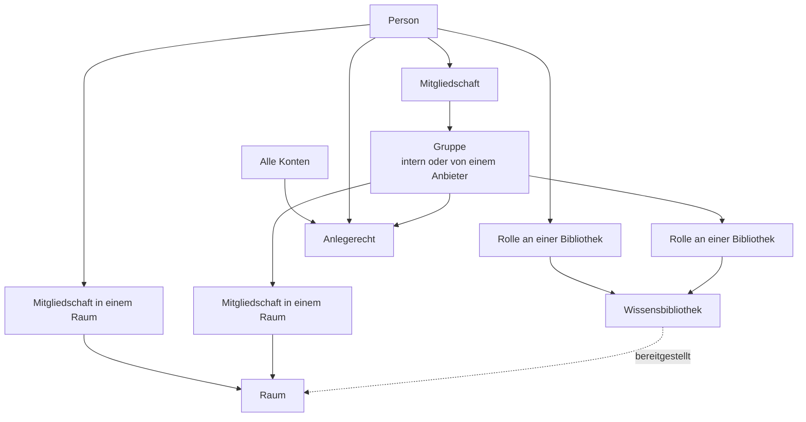

# Bibliotheken und Berechtigungen

> **Entwurf.** Dieses Kapitel beschreibt, wer in einer OPAA-Installation was lesen, ändern,
> freigeben und anlegen darf — und wie sich das nachweisen lässt. Es ist der eine Ort für das
> Berechtigungsmodell: Subjekte, Rollen, Gruppen, Anlegerechte, Vollmachten, Lebenszyklus und
> Rechtehistorie. Die Einrichtung des Anmeldewegs und des Verzeichnisabgleichs steht im Kapitel
> [Deployment](deployment.md), die Verwaltung lokaler Konten in der
> [Benutzerverwaltung](benutzerverwaltung.md), der Rechtefilter der Suche im Kapitel
> [Suche](suche.md).

## 1. Der Aufbau in vier Objekten

| Objekt | Was es ist | Was es an Rechten trägt |
|---|---|---|
| **Organisation** | Das Haus. Heute genau eine je Installation | Die Grenze jeder Berechtigung: Gruppen, Konten, Bibliotheken und Räume gehören ihr, und nichts wirkt darüber hinaus |
| **Wissensbibliothek** | Verwaltungseinheit für Dokumente mit genau einer Quelle | Eigene Rollen, einen Eigentümer |
| **Raum** (Space) | Arbeitsbereich, in dem Chats liegen und Bibliotheken bereitgestellt werden | Eigene Rollen, eigene Mitgliedschaften, einen Eigentümer |
| **Gruppe** | Eine benannte Menge von Konten | Kein Recht an sich selbst — sie ist das *Subjekt*, dem Rollen, Anlegerechte und Eigentum erteilt werden |

Zwei Sätze gelten in allen folgenden Abschnitten:

- **Ein Raum enthält genau, was ihm zugeordnet ist, und erweitert keine Leserechte.** Der Chat
  eines Raums sucht nur in den zugeordneten Bibliotheken und bietet nur die zugeordneten Prompts
  an — und davon nur, was die Person ohnehin lesen darf. Die Zuordnung legt fest, was im Raum zur
  Verfügung steht; ein Leserecht öffnet sie nicht.
- **Rechte wirken in der Suche, nicht dahinter.** Jede Suchabfrage trägt den Filter auf die
  lesbaren Bibliotheken in sich. Es gibt keinen Administrator-Durchgriff auf Inhalte
  (Abschnitt 10).


```mermaid
flowchart TB
    P[Person] --> M[Mitgliedschaft]
    M --> G[Gruppe<br/>intern oder von einem Anbieter]
    P --> DG[Rolle an einer Bibliothek]
    G --> GG[Rolle an einer Bibliothek]
    P --> SM[Mitgliedschaft in einem Raum]
    G --> SG[Mitgliedschaft in einem Raum]
    DG --> B[Wissensbibliothek]
    GG --> B
    SM --> S[Raum]
    SG --> S
    B -. bereitgestellt .-> S
    A["Alle Konten"] --> C[Anlegerecht]
    P --> C
    G --> C
```

## 2. Vier Wörter, vier verschiedene Dinge

Die Oberfläche und dieses Handbuch benutzen durchgehend diese vier Begriffe. Sie sind nicht
austauschbar, und keiner von ihnen ist eine schwächere Fassung eines anderen.

| Begriff | Bedeutung | Gebunden an |
|---|---|---|
| **Rolle** | Gestufte Berechtigung an **einem Objekt** — „Leserin dieser Bibliothek", „Administrator in diesem Raum" | Person **oder** Gruppe; unbefristet oder mit Ablaufdatum |
| **Anlegerecht** | Installationsweites Recht, etwas **anzulegen** (Räume, Bibliotheken, interne Gruppen). Ohne Gegenstand, unbefristet, **öffnet nie einen Inhalt** | Person, Gruppe oder **„Alle Konten"** |
| **Vollmacht** | Befristete, begründungspflichtige Erlaubnis mit Gegenstand: „Sicht als" in der Suchdiagnose und der Geltungsbereich einer anlassbezogenen Klärung im Nachweisprotokoll | **genau eine Person**, nie eine Gruppe |
| **Systemrolle** | Systemverwaltung und Revision — die beiden installationsweiten Rollen aus der [Benutzerverwaltung](benutzerverwaltung.md), Abschnitt 7 | genau ein Konto |

Dazu zwei Maße, die im Text gebraucht werden und in keiner Oberfläche als Wort auftauchen:

- **Wirksam** ist eine Gruppe, der ein Recht **erteilt** werden darf: nicht aufgelöst, ihr Anbieter
  eingeschaltet, ihre Mitgliedschaft noch gepflegt. Eine wirksame Gruppe **darf leer sein**.
- **Handlungsfähig** ist eine wirksame Gruppe mit mindestens einem **aktiven** Konto. Das ist das
  Maß dafür, ob sie als Eigentümerin oder als Raumadministratorin **handeln** kann (Abschnitt 13).

## 3. Wem ein Recht gegeben werden kann

| Subjekt | Rolle an Bibliothek oder Raum | Anlegerecht | Eigentum | Vollmacht |
|---|---|---|---|---|
| **Person** | ja | ja | Bibliothek und Raum | ja |
| **Gruppe** | ja | ja | Bibliothek (kein Raum) | nein |
| **„Alle Konten"** | ja — als Empfänger wie jeder andere | — (dort heißt dieselbe Art „Alle Konten") | nein | nein |

**Gruppen werden nicht in Personen aufgelöst.** Wer eine Bibliothek an „Referat 50" freigibt, gibt
sie an die Gruppe frei: Wer dort morgen Mitglied wird, liest sie ab dann, wer heute ausscheidet,
verliert sie mit der Mitgliedschaft. Das ist gewollt und der Grund, warum Freigaben an Gruppen
gepflegt bleiben, ohne dass jemand sie anfasst — und der Grund, warum die Zeile einer Gruppe
ihre heutige Größe nennt (Abschnitt 8).

**Gruppen verschachteln nicht.** Eine Gruppe hat genau die Mitglieder, die ihre Quelle ihr gibt;
eine übergeordnete Einheit aus dem Verzeichnis ist eine Anzeige- und Gliederungsangabe und
**vererbt keine Mitgliedschaft**. Eine Abteilung, die im Verzeichnis nur Untergruppen hat, ist in
OPAA eine **leere** Gruppe — eine Freigabe an sie erreicht niemanden.

## 4. Rollen an einer Wissensbibliothek

Die Bibliotheken, die eine Person lesen darf, findet sie im **Katalog**, dem einen Punkt der
Hauptnavigation für jede Art von Bestand; die [Prompt-Bibliotheken](prompt-bibliotheken.md) stehen
dort neben den Wissensbibliotheken. Rollen, Herleitung und „Nachfolge offen" gelten für beide Arten
gleich, und beide Detailseiten sind gleich aufgebaut.

**Der Kopf der Detailseite.** In der ersten Zeile stehen die Art als Etikett („Wissen" bzw.
„Prompts"), das Welt-Symbol, wenn die Bibliothek an „Alle Konten" freigegeben ist, bei einer
Wissensbibliothek die Quellart und dann die eigene Rolle, für die Systemverwaltung ohne eigene
Berechtigung zusätzlich „administrativ"; rechts davon der **Stern** für den
eigenen Favoriten — er wirkt wie der Stern einer Kachel im Katalog — und das Menü **„⋯"** mit
„In Space verwenden" und, abgesetzt, „Löschen" für den Eigentümer. Darunter stehen Name und
Beschreibung; wer die Bibliothek verwaltet, ändert beide über den Stift daneben. Die Kennzahlen
darunter nennen den Umfang (Dokumente bzw. Prompts), in wie vielen Räumen die Bibliothek
bereitsteht, die zuständige Stelle und „Aktualisiert am". Ein „Zurück" gibt es nicht; der Weg
zurück führt über den Katalog in der Hauptnavigation.

**Die Reiter.** Eine Wissensbibliothek hat „Dokumente", „Quelle" (nur bei einer
Konnektorbibliothek), „Metadaten", „Freigaben" und „Zuordnungen", eine Prompt-Bibliothek
„Prompts", „Freigaben" und „Zuordnungen". Jede Rolle sieht jeden Reiter; wer nur liest, sieht ihn
schreibgeschützt. **„Berechtigungen"** steht als Liste auf der Seite, nicht hinter einem Knopf
„Rechte verwalten".

Der Reiter **„Freigaben"** einer Wissensbibliothek führt sie in dieser Reihenfolge:

| Abschnitt | Inhalt |
|---|---|
| **Eigentümer** | die zuständige Stelle mit Namen; über „Eigentum übergeben" reicht der Eigentümer sie an eine Person oder eine Gruppe weiter — mit Rückfrage, und die Eigentümerrolle geht mit. Auch die **Systemverwaltung** kann übergeben: So bekommt eine Bibliothek mit offener Nachfolge wieder eine handlungsfähige Stelle, ohne das Konto der ausgeschiedenen Person. Jede Übergabe steht mit Namen im Nachweisprotokoll |
| **Berechtigungen** | Personen, Gruppen und „Alle Konten" mit Rolle, Befristung und Entzug, dazu das Formular „Freigeben". Für „Alle Konten" stehen dabei nur **Leser** und **Bearbeiter** zur Wahl — in der Liste wie im Formular; für die Systemverwaltung darunter die Obergrenze „Freigabe an Alle erlaubt" |
| **Externer Zugang** | die Freigabe für Fremdzugänge |
| **Diagnosesperre** | ob die Bibliothek in einer fremden Suchdiagnose auftauchen darf |
| **Warum sehe ich diese Wissensbibliothek?** | die eigene Herleitung |

Jeder Abschnitt speichert für sich; einen gemeinsamen „Speichern"-Knopf über Abschnitte hinweg gibt
es nicht. Eine lesende Rolle sieht Eigentümer, Diagnosesperre und die Herleitung —
schreibgeschützt.

**Der Reiter „Zuordnungen": wer welchen Space erfährt.** Oben steht „In Space verwenden" mit
derselben Auswahl wie im Katalog, darunter die Liste der Spaces, in denen der Bestand bereitsteht.
Sie sehen alle Leseberechtigten — aber nur so weit, wie der Space selbst sichtbar ist. Ab der
Verwalterrolle steht jede Zuordnung mit Namen da, samt „zugeordnet von", Datum und dem Hinweis
„nicht alle Mitglieder lesen". Wer nur liest oder bearbeitet, sieht die Namen der Spaces, die
ohnehin im Space-Verzeichnis stehen oder in denen er Mitglied ist; private Spaces, zu denen er
nicht gehört, erscheinen nur als Zahl — „+ 2 weitere Spaces, die Sie nicht sehen dürfen". Ein
privater Space verspricht, dass nur seine Mitglieder von ihm wissen, und dieses Versprechen gilt
auch hier. **Lösen** lässt sich eine Zuordnung über „⋯" ihrer Zeile, „Aus Space lösen" — von der
Verwaltung der Bibliothek und von jedem, der den Space kuratiert oder administriert.

| Rolle | Darf |
|---|---|
| **Leser** (`VIEWER`) | Die Bibliothek durchsuchen, Treffer und Dokumentenliste sehen |
| **Bearbeiter** (`EDITOR`) | Zusätzlich Dokumente hochladen und löschen, Ordner anlegen, umbenennen und löschen, einen Indexierungslauf anstoßen, Metadaten pflegen |
| **Verwalter** (`MANAGER`) | Zusätzlich Rechte vergeben und entziehen — auch an alle Konten —, die Quellverbindung sehen und ändern, die Bibliothek für [Fremdzugänge](fremdzugaenge.md) freigeben |
| **Eigentümer** (`OWNER`) | Zusätzlich löschen und das Eigentum übertragen |

Die Rollen sind gestuft: Wer Verwalter ist, darf alles, was ein Bearbeiter darf. Die
**Quellverbindung** einer Bibliothek — interner Serverpfad, Quelladresse, Zugangsdaten — bleibt
einem Bearbeiter verborgen und wird erst ab der Verwalterrolle sichtbar; sie ist
Infrastrukturangabe, nicht Konfiguration.

**Ein Recht kann befristet sein.** Jede Rolle wird mit oder ohne Ablaufdatum erteilt; mit dem
Ablauf endet sie, ohne dass jemand eingreift, und das Erlöschen steht im Nachweisprotokoll.

**Eigentum.** Eine Bibliothek gehört einer **Person** oder einer **Gruppe**. Wer sie anlegt, wählt
das: Als persönliche Bibliothek erhält die anlegende Person die Eigentümerrolle, bei einer Gruppe
als Eigentümerin erhält die Gruppe die Verwalterrolle — die anlegende Person muss Mitglied dieser
Gruppe sein. **Gruppeneigentum ist die haltbarere Wahl**: Es übersteht den Weggang einzelner
Personen, und genau dafür ist Abschnitt 13 sonst zuständig.

Weitere Rollen lassen sich schon beim Anlegen vergeben. Der Schritt „Freigaben" des Assistenten
sucht Personen und Gruppen im selben Suchfeld „Person oder Gruppe suchen" wie der Abschnitt
„Berechtigungen" an einer bestehenden Bibliothek — mit denselben Regeln für geschützte Gruppen
(Abschnitt 8) und derselben Rückfrage vor einer Freigabe an die Gruppe eines externen Anbieters.
Die Treffer stehen gemischt, die passendsten zuerst; eine Gruppe trägt „Gruppe" im Namen der
Zeile. Suche, Rolle und „Vormerken" stehen in einer Zeile. Den Empfänger **„Alle Konten"**
bietet der Assistent nicht an: Ein Bestand, den es noch nicht gibt, hat keine Reichweite zu weiten,
und die Obergrenze, die über eine solche Freigabe entscheidet, gehört der angelegten Bibliothek.

### Reichweite: „Alle Konten"

**Es gibt keine getrennte Verteilungsstufe mehr.** Wie weit eine Bibliothek reicht, ergibt sich
allein aus ihrer Rechteliste. Wer sie dem ganzen Haus öffnen will, erteilt ein Recht an den
Empfänger **„Alle Konten"** — als eigener Eintrag im Suchfeld des Abschnitts „Berechtigungen",
mit demselben Ablaufdatum
wie bei einer Person oder einer Gruppe, aber **höchstens mit der Rolle „Bearbeiter"**: Verwaltung
und Eigentum sind Zuständigkeiten und bleiben an eine benannte Stelle gebunden; mehr steht gar
nicht erst zur Wahl und würde auch abgewiesen. Vor dem Erteilen fragt die Anwendung eigens zurück
und spricht die Reichweite aus; zurücknehmen lässt sich die Freigabe wie jede andere — auch ein
späterer Rollenwechsel an dieser Zeile fragt zurück.

In den Übersichten steht die Reichweite als **abgeleitete Kennzeichnung**: „Alle", „3 Gruppen, 2
Personen" oder „nur Sie". Sie ist keine Einstellung, sondern die Zusammenfassung dessen, was in der
Rechteliste steht.

**Sichtbar ist nur, was lesbar ist.** Eine Bibliothek, die eine Person nicht lesen darf, erscheint
für sie nirgends — weder in der Übersicht noch im Katalog noch in der Suche, auch nicht mit Namen
oder Beschreibung. Wer einen Bestand für andere sichtbar machen will, gibt ihn frei.

Die Freigabe an alle Konten wird **historisiert** wie jede erteilte Rolle: Zu jedem Stichtag
innerhalb der Aufbewahrungsfrist ist belegbar, wie weit eine Bibliothek gereicht hat (Abschnitt 12).
Die Freigabe für [Fremdzugänge](fremdzugaenge.md) ist ein weiteres Reichweitenfeld und wird
ebenso historisiert.

### Der Katalog

Der **Katalog** ist der eine Punkt der Hauptnavigation für Bestände jeder Art. Er zeigt Wissens- und
Prompt-Bibliotheken gemischt: genau die, die die Person lesen darf — über eine eigene Rolle, eine
Rolle über eine Gruppe oder die Freigabe an „Alle Konten". Unter der Überschrift steht „Alles, was
Sie nutzen dürfen. Ihre Favoriten stehen oben." Die Adressen `/libraries` und `/prompts` führen auf
den Katalog, eingegrenzt auf die jeweilige Art.

| Element | Inhalt |
|---|---|
| **Suche** | Über Name und Beschreibung, ohne Rücksicht auf Groß- und Kleinschreibung; der Suchtext ist begrenzt |
| **Filterzeile** | In einer Zeile, die auf schmalen Bildschirmen umbricht: Suche, dann die Art („Alle", „Wissen" oder „Prompts"), dann abgesetzt der Schalter „Favoriten" für die eigenen Favoriten. Die Filter wirken zusammen; Art und „Favoriten" stehen in der Adresse der Seite |
| **Reihenfolge** | Fest: die eigenen Favoriten zuerst, dann nach Name von A bis Z. Eine Sortierauswahl gibt es nicht |
| **Eintrag** | Eine Kachel: die Art als Etikett mit Symbol („Wissen" oder „Prompts"), direkt daneben das Welt-Symbol, wenn die Bibliothek an „Alle Konten" freigegeben ist; Stern für den eigenen Favoriten und „⋯" für weitere Aktionen; Name, Beschreibung, Umfang (Dokumente bzw. Prompts), in wie vielen Räumen sie bereitsteht, zuständige Stelle mit Personen- oder Gruppensymbol und „Aktualisiert am" oder der Zustand. Jede Kachel führt zur Detailseite der Bibliothek; eine Tabellenansicht gibt es nicht |
| **In Space verwenden** | Im Menü „⋯" jeder Kachel und auf der Detailseite (Menü „⋯" und Reiter „Zuordnungen"): ordnet die Bibliothek einem Raum zu (Abschnitt 5, „Zuordnen aus dem Katalog") |
| **Seiten** | Die Einträge kommen seitenweise; über „Weitere laden" steht, wie viele von wie vielen angezeigt sind, und der Knopf hängt die nächste Seite an |
| **Neu** | Oben rechts, nur wenn die Person mindestens ein Anlegerecht für eine Art hat (siehe unten, „Anlegen über ‚Neu'") |

**Freigabe an alle.** Das Welt-Symbol heißt: an „Alle Konten" freigegeben; beim Darüberfahren und
für Screenreader lautet es „Für alle Konten freigegeben". Eine Bibliothek, die nur über Freigaben an
Personen oder Gruppen erreichbar ist, trägt kein Symbol. Das Symbol wird aus der Rechteliste
abgeleitet und ist keine eigene Einstellung. Die eigene Rolle steht nicht auf der Kachel, sondern
auf der Detailseite.

**Aktualisiert und Zustand.** Ist eine Bibliothek bereit, nennt die Kachel „Aktualisiert am" mit
Datum, ohne farbigen Punkt: bei einer Konnektorbibliothek das Datum des letzten erfolgreichen Laufs,
sonst das Datum der letzten Änderung an Stammdaten oder Inhalt. Sonst nennt sie den Zustand in
Worten, mit einem farbigen Punkt davor:
„Wird aktualisiert", „Aktualisierung fehlgeschlagen" oder „Noch kein Inhalt". Ist die Nachfolge
offen, steht zusätzlich die Zeile „Nachfolge offen", ebenfalls mit Punkt; der Adressat steht als
zuständige Stelle, und der Stand der Indexierung bleibt sichtbar. Als Änderung zählt, was Stammdaten oder Inhalt ändert; Freigaben zählen nicht.

Eine Bibliothek ohne Leserecht steht nicht im Katalog; auch die Suche über Name oder Beschreibung
findet sie nicht, und ihre Adresse antwortet „nicht gefunden" wie bei einer unbekannten Bibliothek.
Zuständig ist der Eigentümer — bei einer Gruppe ihr Name, bei einer Person ihr Anzeigename. Eine
geschützte Gruppe und eine Person ohne Anzeigenamen bleiben unbenannt, eine E-Mail-Adresse erscheint
nie. Ist die Nachfolge offen (Abschnitt 13.3), nennt der Eintrag deren Adressaten.

Die Systemverwaltung sieht im Katalog nicht mehr als andere: **Verwalten ist nicht Lesen.** Eine
Bibliothek, die sie nur verwaltet, erscheint dort nicht. Der Katalog zeigt nie etwas aus einer
anderen Organisation, und ein Eintrag enthält Beschreibungen, nie Inhalte: keine Dokumente, keine
Prompts.

#### Favoriten

Jede Person kann jede Bibliothek, die sie im Katalog sieht, mit dem **Stern** auf der Kachel als
**Favorit** markieren und mit einem zweiten Druck wieder entfernen. Favoriten stehen im Katalog
oben; der Filter „Favoriten" zeigt nur sie. Der Stern ist ein eigenes Bedienelement neben dem Link
der Kachel: Er ist mit der Tabulatortaste erreichbar, Enter und Leertaste schalten ihn um, und ein
Bildschirmleser liest vor, was der nächste Druck bewirkt („… als Favorit markieren" oder „… aus den
Favoriten entfernen"). Nach dem Umschalten bleibt die Kachel bis zum nächsten Laden an ihrem Platz.

Favoriten sind eine rein persönliche Ordnung und ändern keine Rechte:

- **Nur die Person selbst sieht sie.** Weder die Systemverwaltung noch die Verantwortlichen einer
  Bibliothek oder eines Raums erfahren, wer was markiert hat; es gibt keine Zahl der Favoriten je
  Bibliothek.
- **Kein Nachweis.** Setzen und Entfernen erscheinen weder im Nachweisprotokoll noch in einer
  Historie und in keinem Bericht oder Export.
- **Nur Lesbares.** Markieren lässt sich nur, was die Person lesen darf. Verliert sie das
  Leserecht, verschwindet der Favorit aus dem Katalog; entfernen kann sie ihre Markierung trotzdem
  jederzeit.
- **Mit dem Konto gelöscht.** Wird das Konto gelöscht, gehen seine Favoriten mit, und sie halten
  die Löschung nicht auf. Wird eine Bibliothek gelöscht, verschwinden die Favoriten daran ebenso.

#### Anlegen über „Neu"

Neue Bestände entstehen über **„Neu"** im Katalog. Der erste Schritt fragt „Was möchten Sie
anlegen?" und bietet jede Art als Kachel mit Symbol und einem Satz dazu an — **nur die Arten, für
die die Person ein Anlegerecht hat** (Abschnitt 9). Für Wissen genügt eines der beiden Rechte
„Bibliotheken für Uploads anlegen" oder „Konnektorbibliotheken anlegen", für Prompts das Recht
„Prompt-Bibliotheken anlegen". Hat sie für keine Art ein Recht, fehlt „Neu" im Katalog; wer die
Seite dennoch erreicht, liest dort, dass ein Anlegerecht fehlt.

„Weiter" führt in den Assistenten der gewählten Art: für Wissen in den Assistenten aus
[Indexierung](indexierung.md), Abschnitt „Eine Bibliothek anlegen", für Prompts in den aus
[Prompt-Bibliotheken](prompt-bibliotheken.md), Abschnitt „Anlegen". „Abbrechen" in einem der
Assistenten führt zurück in den Katalog.

Die Kacheln sind eine Auswahlgruppe: Die Pfeiltasten wechseln die Wahl, Leertaste und Enter
wählen, und ein Bildschirmleser sagt die Gruppe mit ihrer Frage an. Die gewählte Kachel trägt einen
Rahmen und ein Häkchen.

### Freigabe-Obergrenze für Konnektorbibliotheken

Wer eine Konnektorbibliothek anlegen darf, entscheidet auch über ihre Reichweite — bis zu einer
**Obergrenze**, die ausschließlich die Systemverwaltung setzt. Ohne sie könnte, wer eine Bibliothek
aus einem Dateiverzeichnis, einem Webverzeichnis, einem Feed, Confluence oder einem Objektspeicher
anlegt, den eingespeisten Bestand im nächsten Schritt dem ganzen Haus öffnen — die Obergrenze ist
die technische Sicherung gegen genau diesen einen Schritt. Bibliotheken für Uploads tragen keine
Obergrenze: Dort kuratiert dieselbe Person ohnehin jedes Dokument einzeln.

**Die Obergrenze gilt je Bibliothek und wird nicht automatisch gesetzt.** Neu angelegt ist jede
Konnektorbibliothek zunächst **ungedeckelt**: Die Erlaubnis steht offen, und die
Systemverwaltung muss sie eigens entziehen, damit die Obergrenze wirkt. Die Bibliothek selbst
startet trotzdem eng — sie trägt nur die Rechte, die der Anlegende erteilt. Wer die Obergrenze nicht senkt, lässt dem Anlegenden also die Wahl bis hin zur Freigabe
an alle Konten. Ein Betrieb, der das systematisch verhindern will, prüft die Obergrenze
deshalb **nach jeder Neuanlage** einer Konnektorbibliothek, oder schränkt das Anlegerecht
„Konnektorbibliotheken anlegen" auf eine benannte Gruppe ein (Abschnitt 9) — dann entscheidet diese
Gruppe, wer überhaupt anlegen darf, bevor die Obergrenze greifen müsste.

Zu finden ist die Obergrenze auf der Detailseite der jeweiligen Bibliothek, Reiter „Freigaben" —
sichtbar und änderbar nur für die Systemverwaltung. Sie besteht aus einer Erlaubnis:

| Erlaubnis | Wirkung, wenn entzogen |
|---|---|
| **Freigabe an alle Konten erlaubt** | Ein Recht an „Alle Konten" kann nicht mehr erteilt werden; ein bestehendes wird beim Entziehen sofort zurückgenommen |

**Wird die Erlaubnis entzogen, wirkt das sofort — aber ausschließlich für die Freigabe an alle
Konten.**
Es gibt keine Übergangszeit und keinen Zustand „noch zu weit, aber geduldet". **Unberührt bleiben
erteilte Rechte an einzelnen Personen und Gruppen sowie eine bestehende Fremdzugangsfreigabe**
(Abschnitt „Die Freigabe einer Wissensbibliothek" im Kapitel [Fremdzugänge](fremdzugaenge.md)) —
beide müssen gesondert geprüft und, falls gewünscht, gesondert zurückgenommen werden. Jeder Vorgang
steht im Nachweisprotokoll: das Setzen der Obergrenze selbst und, falls ausgelöst, die dadurch
bewirkte Rücknahme der Freigabe.

Versucht die Eigentümerin oder ein Verwalter der Bibliothek anschließend, an alle Konten
freizugeben, weist die Anwendung das mit einer Meldung ab, die die geltende Obergrenze beim Namen
nennt und auf die Systemverwaltung verweist — kein technischer Fehler, sondern eine erklärte
Grenze.

### Private Bibliotheken

Eine **private Bibliothek** speist sich aus dem verbundenen Konto ihrer Besitzerin auf einem Zugang
für Personen (Kapitel [Indexierung](indexierung.md), „Zugänge“). Ihr Inhalt ist, was die Person
beim Anbieter selbst sieht, und außer ihr liest ihn niemand. Anlegen lässt sie sich erst, wenn ein
Konnektor die Besitzart „Person“ anbietet; die mitgelieferten Konnektoren tun das noch nicht.

**Anlegen.** Die Person wählt beim Anlegen ausdrücklich „privat“; bei einem Zugang, der Bibliotheken
und Personen zulässt, entscheidet allein diese Wahl, und sie bleibt für immer. Im Assistenten steht
dafür im Schritt „Quelle“ unter den Zugängen die Gruppe **„Über mein verbundenes Konto“** mit dem
Hinweis „Nur Sie sehen diese Bibliothek“. Sie erscheint nur für Zugänge, auf denen die Person
bereits ein verbundenes Konto hat; ohne ein solches Konto gibt es weder die Gruppe noch einen
Hinweis darauf. Ein Zugang, der Bibliotheken und Personen zulässt, steht dort zweimal: in den
Zugängen als teilbare Bibliothek, in der Gruppe als private. Ein Zugang nur für Personen steht nur in
der Gruppe; über ihn ist auch die Quellart wählbar, wenn es sonst keinen Weg zu ihr gibt. Für die
private gibt es kein Feld für Zugangsdaten, und der Schritt „Freigaben“ entfällt. Vorausgesetzt
sind:

- ein verbundenes Konto der Person auf dem Zugang und das Anlegerecht für den Zugang (Abschnitt 9);
- keine eigenen Zugangsdaten — die Bibliothek meldet sich mit dem verbundenen Konto an;
- dasselbe Ziel wie das Konto: eine Adresse unter der Server-Adresse des Zugangs und keine eigene
  Bindung, etwa eine andere Freigabe eines Dateiservers. Eine abweichende wird abgewiesen.

Verbindungstest und Auflistung vor dem Anlegen laufen ebenso über das verbundene Konto.

**Erkennbar** ist eine private Bibliothek an der Marke **„Privat“** (Schloss und Wort) auf ihrer
Kachel im Katalog und im Kopf ihrer Detailseite. Im Reiter „Freigaben“ stehen nur Eigentümerin,
Diagnosesperre und ein Hinweis, warum es nicht mehr gibt; Berechtigungen, Externer Zugang,
Obergrenze, Herleitung und „Eigentum übergeben“ fehlen. Im Reiter „Quelle“ fehlt „Zugang lösen“,
und „Zugang wechseln“ bietet nur Zugänge an, auf denen die Besitzerin ein verbundenes Konto hat,
auch solche nur für Personen.

**Im Chat** trägt ein Beleg aus einer privaten Bibliothek im Belegfenster den Zusatz **„Private
Quelle“**, auch wenn die Antwort ihn nicht zitiert. Stand eine solche Quelle im Kontext der Antwort,
steht darunter die Zeile **„Private Quellen im Kontext“**. Beides sieht nur die Besitzerin, denn nur
sie liest ihre privaten Bibliotheken; die Kennzeichnung wird mit der Antwort gespeichert und bleibt
auch, wenn die Bibliothek später gelöscht und ihr Beleg zu „Quelle entfernt“ wird.

**Was nicht geht — auch nicht für die Systemverwaltung:** Rechte an Personen, Gruppen oder „Alle
Konten“, Übertragung, Fremdzugangsfreigabe, eine Freigabe-Obergrenze, Nachfolge und „Sicht als“. Die
Diagnosesperre ist bei einer privaten Bibliothek fest gesetzt und lässt sich nicht lösen. Vom Zugang
lösen lässt sie sich nicht; einem anderen Zugang ordnet sie nur ihre Besitzerin zu, und nur einem
Zugang für Personen, auf dem sie ein verbundenes Konto hat. Für alle anderen gibt es die Bibliothek
nicht: Jede Anfrage, die sie nennt, beantwortet OPAA wie die nach einer unbekannten.

**Wenn sie ruht**, trägt sie einen Hinweis, der die zuständige Stelle nennt; der Bestand bleibt
durchsuchbar:

| Hinweis | Ursache | Zuständig |
|---|---|---|
| „Verbindung getrennt“ | Die Besitzerin hat ihr Konto getrennt, oder es wurde getrennt (Notabschaltung, Adressänderung) | Besitzerin: Konto unter „Verbundene Konten“ neu verbinden |
| „Abgelaufen“ | Der Anbieter hat die Anmeldung abgelehnt | Besitzerin: neu verbinden |
| „Ruhend“ | Das Konto der Besitzerin wird derzeit nicht genutzt | Besitzerin bzw. Systemverwaltung |
| „Konto deaktiviert“ | Das Konto der Besitzerin ist deaktiviert; der Hinweis nennt den Tag, ab dem die Bibliothek gelöscht wird, wenn es deaktiviert bleibt | Systemverwaltung |
| „Ziel weicht ab“ | Die Bibliothek erreicht ein anderes Ziel als das, für das das Konto gilt | Besitzerin: neu verbinden, sonst neu anlegen |
| „Zugang nicht mehr nutzbar“ | Der Zugang wurde gelöscht, lässt keine Personen mehr zu oder sein Konnektor lehnte eine Änderung für die Bibliothek ab | Besitzerin: anderem Zugang zuordnen; gibt es keinen, die Systemverwaltung |

Der Hinweis steht im Reiter „Quelle“. Bei „Verbindung getrennt“ und „Abgelaufen“ führt er die
Besitzerin mit „Konto verbinden“ bzw. „Konto neu verbinden“ zu „Verbundene Konten“, bei „Zugang
nicht mehr nutzbar“ bietet er „Zugang zuordnen“ an. Ein Lauf, der daran scheitert, speichert den
Grund als Kategorie ohne Inhaltsbezug.

**Speicherkontingent der Person.** Alle privaten Bibliotheken einer Person teilen sich ein
Kontingent; eine weitere private Bibliothek schafft keinen zusätzlichen Platz. Das Kontingent je
Bibliothek gilt daneben unverändert. Gezählt wird, was tatsächlich gespeichert ist. Ist das
Kontingent erschöpft, endet der laufende Lauf geordnet als unvollständig mit der Kategorie
`QUOTA_EXHAUSTED`. Im Reiter „Quelle“ trägt dieser Lauf unter „Läufe“ die Marke „unvollständig:
Speicherkontingent Ihrer privaten Bibliotheken erschöpft“ und aufgeklappt den Hinweis, was Platz
schafft; das Laufprotokoll nennt ihren Verbrauch und die Grenze. Endete der letzte Lauf so, steht
derselbe Hinweis auch im Kopf der Detailseite. Bereits Aufgenommenes bleibt durchsuchbar. Weil der
Lauf vor dem Abgleich endet, übernimmt er auch Löschungen in der Quelle nicht mehr: Dateien beim
Anbieter zu löschen oder die Quelle einzugrenzen schafft deshalb keinen Platz, solange noch ein nicht
aufgenommenes Element vor dem Ende steht. Platz schafft das Löschen einer ganzen privaten
Bibliothek; sonst hilft nur eine höhere Grenze der Systemverwaltung. So sagt es auch der Hinweis.

Ihren **eigenen Verbrauch** sieht die Besitzerin im Kopf der Detailseite jeder ihrer privaten
Bibliotheken: „… von … in Ihren privaten Bibliotheken belegt“, bei unbegrenzter Grenze „… in Ihren
privaten Bibliotheken belegt (unbegrenzt)“. Die Zahl gilt für alle ihre privaten Bibliotheken
zusammen (`GET /api/v1/me/private-storage`); im Einzelnen sieht sie niemand sonst.

Die Grenze ist ein **hausweiter Wert**, den nur die Systemverwaltung setzt: unter **Administration →
Zugänge**, Abschnitt „Private Bibliotheken“, im Feld „Grenze je Person (GB)“ oder mit „Unbegrenzt“
und „Grenze speichern“ (`PUT /api/v1/admin/private-libraries/quota`). Der Abschnitt nennt, ob die
Vorgabe der Installation oder eine eigene Grenze gilt. Das Feld nimmt Komma und Punkt als
Dezimaltrenner an und weist eine Grenze unter 1 MB ab; unbegrenzt wird sie nur über „Unbegrenzt“; „Vorgabe wiederherstellen“ führt zur Vorgabe
`OPAA_LIBRARY_PRIVATE_STORAGE_QUOTA_BYTES` zurück (Variablentabelle im Kapitel
[Deployment](deployment.md)). `0` bedeutet unbegrenzt. Vor dem Speichern fragt OPAA nach. Eine
Änderung wirkt ab dem nächsten aufgenommenen Dokument und löscht nichts. Jede Änderung steht im
Revisionsprotokoll (`PRIVATE_STORAGE_QUOTA_CHANGED`).

Darunter steht die **Übersicht der Verwaltung** (`GET /api/v1/admin/private-libraries/summary`). Sie
zeigt für die eigene Organisation nur Summen: die Zahl der Besitzerinnen, den belegten Speicher
insgesamt, eine Tabelle „Belegter Speicher je Zugang“ für Zugänge für Personen und eine Tabelle
der Laufabbrüche je Ursache im Zeitfenster. Jede dieser Zahlen ruht auf Personen und folgt der
Mindestgruppengröße: Die Gesamtzahlen erscheinen erst ab N Besitzerinnen, sonst als „weniger als
N“. Eine Zahl je Zugang oder je Kategorie ist exakt nur, wenn ihre Besitzerinnen und die aller
übrigen privaten Bibliotheken je mindestens N sind, und nur, solange das, was die exakten Zahlen je
Zugang zusammen übrig lassen, auf mindestens N Personen ruht — ein leerer Rest gilt als wenige —;
sonst steht dort „nicht ausgewiesen“. Ein Speicherwert unter der Mindestgruppengröße erscheint als
„nicht ausgewiesen (weniger als N Personen)“. Die Oberfläche zeigt jede Zahl so, wie der Server sie
liefert, und rechnet nichts zusammen. Einen Weg zum Verbrauch einer einzelnen Person gibt es für die
Verwaltung nicht.

**Was die Verwaltung sieht:** nur Zusammenfassungen. Indexstatus und Pipeline-Stand zeigen private
Bibliotheken als eine Zeile ohne Namen und Kennung; jede Zahl über sie richtet sich nach der Zahl
ihrer Besitzerinnen und steht unterhalb der Mindestgruppengröße nur als „weniger als N“, ohne
Summen. Eine Teilzahl, etwa die abgelehnten privaten Bibliotheken eines Zugangs, nennt OPAA nur
exakt, wenn sowohl ihre Besitzerinnen als auch die Besitzerinnen aller übrigen privaten Bibliotheken
mindestens N sind — je Organisation, falls ein Zugang Bibliotheken mehrerer trägt; ein leerer Rest
gilt als wenige —; sonst entfällt sie. Die Speicherbereiche der Bereinigung, die Prüfung
chunk-armer Dokumente, die Zahlen am Zugang und die Zahl der diagnosegesperrten
Bibliotheken zählen sie nicht mit. Der Neuaufbau nach einem Pipeline-Wechsel bezieht sie ein, nennt
sie aber in keiner Zahl seiner Antwort: Jeder Aufruf merkt alle ihre veralteten Dokumente auf einmal
für den nächsten Lauf der Bibliothek vor, der sie mit dem verbundenen Konto der Besitzerin neu
einliest.
Einträge im Revisionsprotokoll nennen weder Dateinamen noch Pfade noch Metadatenwerte. Lehnt der Konnektor eine Änderung des Zugangs für eine private
Bibliothek ab, erfährt die Verwaltung nur die Anzahl, ohne Bibliothek und Grund, und die Änderung
gilt trotzdem; die Besitzerin erhält eine Benachrichtigung. Ist ihr Konto gerade nicht nutzbar
(ruhend, deaktiviert), wird der Konnektor für ihre Bibliothek nicht gefragt, und sie bleibt am
Zugang. Verwirft eine Änderung den Abgleichstand des Zugangs, zählt OPAA private Bibliotheken
dabei nicht mit und wartet nicht auf ihre laufenden Indexierungen; ihr Abgleichstand wird ebenso
verworfen, nach dem Ende eines laufenden Laufs noch einmal, und die Besitzerin wird benachrichtigt. Die Space-Zuordnung einer privaten Bibliothek sehen andere Mitglieder nicht, auch
nicht in Zählern und Hinweisen oder beim Löschen des Space. Im Revisionsprotokoll und in der
Stichtagsauskunft heißt sie „Private Bibliothek“ und ist nur an ihrer Kennung zu erkennen.

**Löschen.** Löscht die Besitzerin ihre private Bibliothek, wird sie mit allem gelöscht, was von ihr
irgendwo liegt, und das Revisionsprotokoll hält es ohne Namen fest; dasselbe tut der tägliche
Löschlauf, wenn ihr Konto länger als die Löschfrist ausdrücklich deaktiviert ist ([Benutzerverwaltung](benutzerverwaltung.md),
„Private Bibliotheken löschen“). Eine laufende Indexierung hält das Löschen nicht auf. Die
Indexübersicht nennt die Zahl der zur Löschung anstehenden privaten Bibliotheken nach denselben
Regeln wie jede Teilzahl.

In der Oberfläche heißt die Aktion **„Sofort löschen“** und steht im Menü „⋯“ im Kopf der
Detailseite. Die Rückfrage nennt, was gelöscht wird (Dokumente, Index, Originale, Ordner, Metadaten,
Läufe und die Zuordnungen zu Spaces), dass Belege in ihren Chats danach „Quelle entfernt“ heißen, der Text der Antworten aber
stehen bleibt, dass die Dateien beim Anbieter unverändert bleiben und dass sich das nicht rückgängig
machen lässt; der Fokus liegt zunächst auf „Abbrechen“. Ist die Bibliothek gelöscht, führt die Seite
zurück in den Katalog und bestätigt es. Solange die Anfrage läuft, ist „Sofort löschen“ gesperrt.
Läuft gerade eine Indexierung, meldet OPAA, dass die Bibliothek zur Löschung vorgemerkt ist, und die
Seite bleibt stehen: Die
Bibliothek trägt im Kopf die Marke **„Wird gelöscht“** und den Hinweis „Wird gelöscht – vorgemerkt
am …“, ohne einen Zeitpunkt für den Abschluss zu versprechen. Bis dahin bietet die Seite weder
„Jetzt indizieren“ noch ein erneutes Löschen, kein Bearbeiten von Name, Quelle, Zugang, Zeitplan,
Metadatenfeldern oder Zuordnungen und kein Hochladen oder Löschen von Dokumenten. Ein Dokument
lässt sich nicht mehr öffnen; der Versuch meldet „Die Bibliothek wird gelöscht – ihre Dokumente
lassen sich nicht mehr öffnen.“ Die Katalogkachel trägt jetzt ebenfalls „Wird gelöscht“.

### Ordner, Speicherkontingent, Löschen

- **Ordner sind keine Rechtegrenze.** Sie gliedern eine Bibliothek für die Navigation;
  Berechtigungen hängen immer an der Bibliothek, und die Suche durchsucht stets den ganzen Bestand.
  Wer Ordner anlegt und wer sie pflegt, hängt am Quellentyp — in einer Upload-Bibliothek legt sie
  ein Bearbeiter selbst an, bei allen übrigen Quellentypen spiegelt der Lauf die Quelle
  ([Indexierung](indexierung.md), Abschnitt 2).
- **Das Löschen eines Ordners löscht die enthaltenen Dokumente** samt Chunks und Originaldateien,
  nach einer Bestätigung, die ihre Anzahl nennt. Ein einzelnes Dokument löscht ebenfalls ein
  Bearbeiter; ein Dokument, das die Quelle weiterhin liefert, kommt mit dem nächsten Lauf wieder —
  wer einen Bestand dauerhaft aus dem Index halten will, ändert die Quellkonfiguration der
  Bibliothek, nicht das einzelne Dokument.
- **Jede Bibliothek hat ein Speicherkontingent** (`OPAA_LIBRARY_QUOTA_BYTES`, Variablentabelle im
  Kapitel [Deployment](deployment.md)). Es wirkt am Upload und an den Konnektorpfaden gleich: Was
  darüber liegt, wird abgelehnt beziehungsweise im Laufprotokoll als übersprungen vermerkt. Für
  private Bibliotheken gilt zusätzlich das Kontingent der Person (Abschnitt „Private
  Bibliotheken“).

## 5. Rollen in einem Raum

| Rolle | Darf |
|---|---|
| **Mitglied** | Den Raum betreten, Chats anlegen und führen, geteilte Chats lesen, die bereitgestellten Bibliotheken sehen — gefiltert auf den eigenen Zugriff |
| **Kurator** | Zusätzlich Bibliotheken bereitstellen und lösen, Inhalte ordnen |
| **Administrator** | Zusätzlich Mitglieder und Rollen verwalten, Einstellungen setzen, geteilte Inhalte zurückziehen |

Daneben steht der **Eigentümer** als eigenes Merkmal: Er allein — und die Systemverwaltung — darf
den Raum löschen. **Ein Raum gehört immer einer natürlichen Person.**

**Auch eine Gruppe wird Mitglied eines Raums, mit Rolle.** Ihre Mitglieder tragen diese Rolle ohne
eigene Zeile und verlieren sie im Moment, in dem sie die Gruppe verlassen. Hält jemand mehrere Wege
in denselben Raum — direkt und über zwei Gruppen —, gilt die stärkste Rolle.

Drei Regeln halten einen Raum handlungsfähig:

- **Er verliert nie sein letztes handlungsfähiges Administrator-Mitglied durch eine
  Verwaltungshandlung.** Entfernen oder Herabstufen wird abgelehnt und nennt den Grund. **Eine
  Gruppe zählt dabei als Administrator, solange sie handlungsfähig ist.**
- **Den Eigentümerwechsel darf jedes handlungsfähige Administrator-Mitglied vollziehen**, das eine
  natürliche Person ist — an sich selbst oder an ein anderes solches Mitglied.
- **Ein archivierter Raum nimmt keine neuen Mitglieder auf.**

### Zuordnung: was ein Raum enthält

**Ein Raum enthält genau, was ihm zugeordnet ist** — für jede Art von Bestand. Die Chats des Raums
suchen nur in den zugeordneten Wissensbibliotheken, auch über `@`-Bezüge, und bieten nur die
Prompts der zugeordneten Prompt-Bibliotheken an. Was eine Person lesen darf, aber dem Raum nicht
zugeordnet ist, steht dort nicht zur Verfügung. Ein Raum ohne zugeordnetes Wissen durchsucht nichts;
das gilt auch für den persönlichen Standard-Raum, der zunächst leer ist. Der Chat und die Seite des
Raums sagen das mit „Diesem Space ist kein Wissen zugeordnet."; Kuratoren und Administratoren
führt „Wissen zuordnen" direkt in den Reiter „Inhalte" der Einstellungen. Die Durchsetzung liegt im
Backend, nicht nur in der Oberfläche: Einen `@`-Bezug auf eine nicht zugeordnete Bibliothek und
einen Prompt aus einer nicht zugeordneten Prompt-Bibliothek lehnt es ab.

**Eine Bibliothek in einem Raum bereitzustellen ist eine Handlung im Raum.** Sie setzt die
Kuratorenrolle **im Raum** und mindestens die Leserrolle **an der Bibliothek** voraus: Wer etwas
bereitstellt, muss es selbst lesen dürfen. Die Bereitstellung **verschafft niemandem ein
Leserecht** — sie legt fest, worin die Chats dieses Raums suchen. Sind im Raum
Mitglieder ohne Leserecht an dieser Bibliothek, wird die Eigentümerin der Bibliothek darüber
benachrichtigt; eine Zustimmung braucht es nicht, die Bereitstellung wirkt sofort. Das gilt für jede
Art von Bestand. Entstehen beim Anlegen eines Raums mehrere solche Bereitstellungen, erhält jede
Eigentümerin **eine** Benachrichtigung, die alle ihre Bestände nennt.

**Was eine Person nicht lesen darf, sieht sie auch in der Zuordnungsliste nicht** — in keiner
Rolle, auch nicht als Kurator, Administrator oder Systemverwaltung. Die Liste nennt weder Namen
noch Anzahl solcher Bereitstellungen. Sind nicht alle Zuordnungen lesbar, steht im Reiter
„Inhalte" der Einstellungen der Hinweis „Nicht alle zugeordneten Inhalte sind für Sie
lesbar."; ist nur Nicht-Lesbares zugeordnet, steht allein dieser Hinweis da. Lösen kann eine
Bereitstellung im Raum nur, wer die Bibliothek lesen darf; jeder andere Versuch wird wie bei einer
unbekannten Bibliothek mit „nicht gefunden" beantwortet. Eine Bereitstellung, die man nicht lesen
darf, löst die Verwaltung der Bibliothek von deren Seite aus, Reiter „Zuordnungen".

Die Mitgliederliste eines Raums sehen **nur** seine Administratoren, sein Eigentümer und die
Systemverwaltung. Mitglieder und Kuratoren sehen ausschließlich, wie viele Mitglieder je Rolle es
gibt. Ein Raum ist nur für seine Mitglieder auffindbar; ein Verzeichnis der Räume gibt es
nicht, und eine Einstellung zur Sichtbarkeit eines Raums deshalb auch nicht.

**In der Oberfläche liegt all das auf einer Seite je Raum:** dem Zahnrad „Einstellungen" am Fuß der
Seitenleiste. Das Zahnrad sieht jedes Mitglied; wer den Raum nicht verwalten darf, liest dort nur.
Die Seite hat drei Reiter, und keine Überschrift im Reiter wiederholt seinen Namen:

| Reiter | Inhalt |
|---|---|
| **Stammdaten** | Name, Beschreibung, der Schalter der automatischen Chat-Bereinigung mit den Fristen der Installation ([Suche](suche.md), Abschnitt 2) — und am Ende der abgesetzte **Gefahrenbereich** mit „Space archivieren" und „Space löschen" |
| **Mitglieder** | Die Mitgliederliste und das Aufnehmen von Personen und Gruppen. Die Liste beginnt mit dem Eigentümer, danach folgen Administratoren, Kuratoren und Mitglieder, je Rolle nach Name, Personen und Gruppen gemischt; eine lange Liste bekommt darüber ein Suchfeld. Jede Zeile trägt nur die Rolle — für Administratoren als Auswahl, beim Eigentümer als schreibgeschützte Auswahl „Eigentümer" mit Schloss statt Pfeil und dem Hinweis, dass der Eigentümer über „Zum Eigentümer machen" bei einem anderen Mitglied wechselt — und ein Menü „⋯" mit „Warum hat … Zugriff?", „Mitglieder der Gruppe anzeigen", „Zum Eigentümer machen" und „Aus Space entfernen", soweit der Eintrag für Zeile und eigene Rolle gilt. Darunter steht „Mitglied hinzufügen" mit einem Suchfeld für Personen und Gruppen, der Rolle und „Hinzufügen" in einer Zeile |
| **Inhalte** | Eine Kachelliste aller Arten von Bestand — Wissensbibliotheken und [Prompt-Bibliotheken](prompt-bibliotheken.md). Ein Häkchen heißt „dem Raum zugeordnet"; anhaken und abhaken dürfen Kuratoren, Administratoren und der Eigentümer des Raums |

**Im Reiter „Mitglieder" meldet sich jede Änderung kurz.** Hinzufügen, Entfernen, Rollenwechsel und
Übertragung bestätigt je eine Meldung, die von selbst verschwindet („Gruppe Meldewesen
hinzugefügt", „Rolle von Thomas Klein: Kurator"). Die Liste aktualisiert sich dabei ohne neues
Laden. Ein Fehler bleibt stehen, bis er geschlossen wird.

**Im Reiter „Inhalte" wirkt ein Häkchen sofort.** Anhaken ordnet zu und bestätigt das kurz; Abhaken
löst die Zuordnung, und die Meldung dazu bietet „Rückgängig" an. Schlägt die Änderung fehl, springt
das Häkchen zurück, und eine Fehlermeldung nennt den Grund. Beim Öffnen ist der Filter „Nur
zugeordnete" eingeschaltet; ausgeschaltet zeigt die Liste alles, was man lesen darf und deshalb
zuordnen könnte. In beiden Ansichten sind es dieselben Kacheln wie im Katalog, in derselben
Reihenfolge: Favoriten zuerst, dann nach Name. Darüber stehen dieselben Filter wie im Katalog:
Suche, Typ und Favoriten. Wer
weder Kurator noch Administrator noch Eigentümer des Raums ist, sieht die zugeordneten Inhalte, die
er lesen darf, nur lesend.

**Die ersten beiden Reiter gehören den Administratoren.** Kuratoren und Mitglieder öffnen dieselbe
Seite und sehen die Stammdaten nur lesend. Im Reiter „Mitglieder" steht für sie keine Liste und
kein Name, nur die Größe des Raums: wie viele Personen und Gruppen aufgenommen sind („10 Personen
und 2 Gruppen") und wie sich die Rollen darauf verteilen („Rollen: 2 Administratoren, 1 Kurator,
9 Mitglieder"). Eine Gruppe zählt dabei einmal, gleich wie viele Konten sie hat. Die Arbeit eines Kurators
liegt im Reiter „Inhalte".
Den Schalter der Chat-Bereinigung im eigenen Standard-Raum legt nur dessen Eigentümer um, auch die
Systemverwaltung nicht. Deshalb lässt sich ein Standard-Raum auch nicht übertragen: Der Knopf „Zum
Eigentümer machen" fehlt dort, und eine Übertragung wird abgewiesen. Den
Gefahrenbereich sieht nur der Eigentümer, und nicht im eigenen Standard-Raum: Der lässt sich weder
archivieren noch löschen.

### Einen Raum anlegen: der Space-Assistent

„Neuer Space" führt durch vier Schritte: **Grunddaten**, **Mitglieder**, **Inhalte** und
**Zusammenfassung**. Nur der Name ist Pflicht; die Schritte „Mitglieder" und „Inhalte" lassen sich
mit „Weiter" überspringen.

Die **Grunddaten** sind Name, Beschreibung und der Schalter der automatischen Chat-Bereinigung. Der
Schalter nennt die Fristen, die der Betrieb festgelegt hat; was sie bewirken, steht in
[Suche](suche.md), Abschnitt 2. Jeder Raum ist nur für seine Mitglieder sichtbar.

Im Schritt **Mitglieder** nimmt der Assistent Personen **und** Gruppen auf, über dasselbe Suchfeld
wie der Reiter „Mitglieder" der Einstellungen: Suche, Rolle und „Vormerken" in einer Zeile, mit
denselben Angaben zu Gruppengröße und denselben Regeln für geschützte Gruppen (Abschnitt 8). Eine
Gruppe gibt ihre Rolle an alle ihre Mitglieder weiter.

Die **Zusammenfassung** nennt Mitglieder und Inhalte je mit einem kleinen Symbol; Gruppen tragen
zusätzlich „Gruppe", Inhalte ihre Art im Text. Die Chat-Bereinigung erscheint nur, wenn der Schalter
an ist, als Satz mit beiden Fristen.

Im Schritt **Inhalte** stehen alle Bestände als Kacheln, die die Person lesen darf — dieselbe Menge
wie im Katalog, in derselben Reihenfolge. Mehrere Kacheln lassen sich zugleich wählen. Darüber
steht dieselbe Filterzeile wie im Katalog: Suche über Name und Beschreibung, Art („Alle", „Wissen",
„Prompts") und „Favoriten". Über „Weitere laden" steht, wie viele von wie vielen angezeigt sind. Eine Wahl bleibt bestehen,
wenn Filter oder Suche ihre Kachel ausblenden; die Zeile unter den Kacheln nennt alles Gewählte.
Die Kacheln sind dieselben wie im Katalog — Art, Welt-Symbol, Stern, Name, Beschreibung, Umfang,
zuständige Stelle und „Aktualisiert am" —, nur ohne „⋯". Eine gewählte Kachel trägt links oben ein
Häkchen und einen hervorgehobenen Rahmen. Ein Klick auf die Kachel wählt sie oder hebt die Wahl
auf; ein Klick auf den Stern setzt nur den eigenen Favoriten und ändert die Wahl nicht. Jede Kachel
ist ein Kontrollkästchen mit eigenem Tabstopp, der Stern ein eigener Tabstopp daneben: Leertaste und
Enter wählen oder heben die Wahl auf.

„Space anlegen" legt den Raum samt vorgemerkten Mitgliedern und allen Zuordnungen in einem Schritt
an. Lässt sich ein Mitglied nicht aufnehmen oder ein gewählter Bestand nicht zuordnen, entsteht kein
Raum; der Assistent bleibt mit allen Eingaben offen und nennt den Grund. Die Aufnahme jedes
Mitglieds steht wie beim späteren Hinzufügen im Nachweisprotokoll. Ist kein Wissen gewählt, sagt die Zusammenfassung „Kein
Wissen zugeordnet — der Space durchsucht kein Wissen, bis Sie etwas zuordnen."

Dieselbe Kachelauswahl steht im Reiter „Inhalte" der Einstellungen. Dort ist das Häkchen die
Zuordnung selbst und wirkt sofort (Abschnitt „Zuordnung: was ein Raum enthält"); eine Zeile mit
allem Gewählten und einen Knopf „Zuordnen" gibt es dort nicht.

### Zuordnen aus dem Katalog: „In Space verwenden"

Im Menü „⋯" jeder Kachel des Katalogs, im Menü „⋯" im Kopf der Detailseite einer Bibliothek und
oben in ihrem Reiter „Zuordnungen" steht **„In Space verwenden"**. Es öffnet die Liste der Räume, in denen die Person Kurator oder Administrator ist;
archivierte Räume fehlen, Räume mit dieser Bibliothek sind als „Bereits zugeordnet" gesperrt. Ein
Klick auf einen Raum ordnet zu — vom Katalog aus sind es drei Klicks: „⋯", „In Space verwenden",
der Raum. „Neuen Space damit anlegen" öffnet den Space-Assistenten mit der Bibliothek als bereits
gewählter Kachel.

### Die Space-Übersicht

Die Übersicht führt alle Räume auf, in denen Sie Mitglied sind — in der Oberfläche heißen sie
„Spaces". Die Überschrift nennt ihre Anzahl, oben rechts steht „Neuer Space". Ein Suchfeld filtert
über Name und Beschreibung. Die Räume stehen als Kacheln; eine Tabellenansicht gibt es nicht.

Eine Kachel zeigt Name, Beschreibung und die Anzahl der Chats, darunter Ihre eigene Rolle und die
Mitglieder als Badges. Die Mitgliederangabe ist wie die Reichweite einer Bibliothek formuliert:
„2 Gruppen, 3 Personen", oder „nur Sie", wenn Ihr eigenes Konto das einzige Mitglied ist — gleich,
ob es der Standard-Raum ist oder nicht. Eine Gruppe zählt als eine Mitgliedschaft, wie viele Personen
sie auch umfasst; ihre Größe wird hier nicht genannt. Ein archivierter Space ist als solcher
gekennzeichnet und führt auf seine Übersicht statt in einen neuen Chat. Das Space-Menü der
Seitenleiste nennt unter jedem Namen dieselbe Mitgliederangabe.

### Einstieg und Space-Wechsel

Nach der Anmeldung öffnet OPAA einen **leeren Chat im zuletzt genutzten Space** — nicht den letzten
Chat, und nicht mehr grundsätzlich den persönlichen Space. Ist der gemerkte Space nicht mehr
zugänglich, weil er archiviert wurde, die Mitgliedschaft entzogen ist oder der Rechner zuletzt von
jemand anderem benutzt wurde, führt der Einstieg in den persönlichen Space.

Das Space-Menü am Kopf der Seitenleiste führt aus demselben Grund **höchstens fünf Spaces**, den
zuletzt genutzten zuoberst; darunter stehen unverändert „Alle Spaces anzeigen" und „Neuen Space
anlegen". Wer in vielen Spaces Mitglied ist, findet den vollständigen Bestand samt Suchfeld in der
Übersicht — das Menü ist der schnelle Weg zurück, nicht das Verzeichnis.

Die Nutzungsreihenfolge merkt sich der Browser, nicht der Server: Sie gilt je Gerät und je Browser
und wandert nicht mit. Gemerkt werden nur Space-Kennungen, und die Liste wird bei jedem Öffnen gegen
die Spaces abgeglichen, die der Dienst dem angemeldeten Konto ausliefert. Melden sich zwei Personen
nacheinander am selben Rechner an, wirkt die Reihenfolge deshalb genau in den Spaces weiter, in
denen beide Mitglied sind — alles andere fällt heraus. Wer das nicht möchte, meldet sich in einem
privaten Fenster an oder löscht die Browserdaten; ein Recht verschafft die Liste ohnehin nicht.

## 6. Woher Gruppen kommen

Jede Gruppe hat genau eine Herkunft, und sie steht als Zusatz neben dem Namen — nie im Namen selbst:
„Referat 50 · Verzeichnis Haus A · /Haus/Abteilung 5 · 23 Mitglieder".

| Herkunft | Wer sie pflegt | Bearbeitbar in OPAA |
|---|---|---|
| **intern** | Die Verantwortlichen der Gruppe (Abschnitt 7) | ja |
| **von einem Identitätsanbieter** | Der Anbieter — über den Gruppen-Claim seiner Tokens oder über den Verzeichnisabgleich | nein, schreibgeschützt |

**Wie OPAA die Mitglieder einer Anbietergruppe erfährt.** Gruppen aus einem Identitätsanbieter
unterscheiden sich nicht in sich, sondern darin, wie ihr Anbieter angeschlossen ist. Das wird je
Anbieter eingerichtet, und alle seine Gruppen folgen dieser Einstellung:

- **Über die Anmeldung (Gruppen-Claim):** OPAA darf beim Anbieter nichts nachfragen. Es erfährt die
  Gruppen einer Person nur in dem Moment, in dem sie sich anmeldet — der Anbieter schickt dann mit,
  in welchen Gruppen sie ist. Wird jemand dort aus einer Gruppe genommen, bleibt die Person in OPAA
  Mitglied, bis sie sich das nächste Mal anmeldet; wer sich nicht mehr anmeldet, bleibt es.
  Vergleichbar dem Dienstausweis am Einlass: Man sieht nur, wer gerade durch die Tür kommt.
- **Über den Verzeichnisabgleich:** OPAA hat ein eigenes Lesekonto beim Anbieter und liest Gruppen
  und Mitglieder im eingestellten Takt selbst aus. Änderungen gelten nach dem nächsten Abgleich,
  auch für Personen, die sich nicht anmelden. Vergleichbar der Personalliste, die das Personalamt
  regelmäßig schickt.

Warum nicht jeder Anbieter abgeglichen wird: Der Abgleich braucht ein Lesekonto, das die IT des
Verzeichnisses einrichten und freigeben muss. Die Anmeldung kommt ohne aus und ist deshalb schneller
eingerichtet — um den Preis, dass Änderungen erst mit der nächsten Anmeldung ankommen. In der
Gruppenverwaltung erklärt das Info-Symbol hinter dem Anbieternamen, welcher der beiden Wege für eine
Gruppe gilt.

**Je Anbieter genau ein Mechanismus.** Entweder der **Gruppen-Claim** seiner Tokens oder der
**Verzeichnisabgleich**; beides zugleich lehnt OPAA ab. Einrichtung, Zeitplan, Trockenlauf,
Plausibilitätsschwelle, leeres Ergebnis, unerreichbares Verzeichnis und der Bestätigungsweg stehen
im Kapitel [Deployment](deployment.md), Abschnitt „Verzeichnisabgleich je Anbieter". Für das
Rechtemodell zählen vier Folgen:

- **Der Token ist die Vorgabe, weil er ohne Konfiguration funktioniert — der Verzeichnisabgleich
  ist der empfohlene Weg** für jedes Haus mit gepflegtem Verzeichnis. Nur er hat die vier
  Schutzmechaniken; der Token-Weg hat keine davon.
- **Eine Umbenennung des Claim-Werts im Identitätsmanagement ist im Token-Betrieb ein
  Gruppenwechsel ohne Schutzmechanik.** Ab der ersten Anmeldung ist jede Person Mitglied der neuen
  Gruppe, und jede Freigabe an der alten Gruppe wirkt für niemanden mehr. Nichts wird dabei
  gelöscht, und es fällt auch nicht von selbst auf — sichtbar wird es im Reiter „Freigaben ohne
  Empfänger" der Betriebsliste (Abschnitt 13).
- **Die Genauigkeit der Rechtehistorie hängt am Mechanismus.** Im Verzeichnisbetrieb steht in der
  Historie der Zeitpunkt des Laufs, der die Änderung gesehen hat. Im Token-Betrieb steht dort der
  Zeitpunkt der **Anmeldung**: Eine Verzeichnisänderung vom 3. März erscheint für eine Person, die
  sich am 20. März anmeldet, mit dem **20. März**. Welcher Mechanismus eine Gruppe pflegt, nennt die
  Herleitung je Gruppe (Abschnitt 11).
- **Ein Mechanismuswechsel entzieht nichts still.** Token-Gruppen und Verzeichnisgruppen sind
  verschiedene Objekte; die alten bleiben mit **eingefrorener** Mitgliedschaft stehen, sind kein
  neues Ziel einer Freigabe mehr, und ihre Rechte gehen mit einer Übertragung (Abschnitt 13.2) auf
  die neuen über.

**Externe Anbieter sind sichtbar abgehoben.** Jede Anbieterzeile trägt ein Kennzeichen „extern" —
Vorgabe ist: jeder Anbieter außer dem Standardanbieter, bis die Systemverwaltung es ändert. Gruppen
eines externen Anbieters erscheinen in jeder Auswahl mit einem eigenen Symbol, und das Erteilen
eines Rechts an eine solche Gruppe verlangt eine Zwischenfrage, die den Anbieter beim Namen nennt.
Dieselbe Zwischenfrage kommt auch, wenn die Gruppe über ihre Kennung statt über die Suche benannt
wurde — sonst wäre sie über diesen Weg umgehbar.

**Nicht wirksame Gruppen sind kein neues Ziel.** Sie stehen in der Auswahl, aber nicht wählbar, und
die Zeile nennt den Grund — „aufgelöst", „Anbieter deaktiviert", „Mitgliedschaft eingefroren" —
jeweils mit dem Zusatz, dass **bestehende Rechte bleiben**. Ohne diese Regel wirkte eine Freigabe an
eine Gruppe eines abgeschalteten Anbieters für niemanden und mit dem Wiedereinschalten schlagartig
für alle, ohne dass jemand darüber entschieden hätte.

**Lokale Konten haben keinen Gruppenmechanismus.** Für sie sind interne Gruppen der einzige Weg zu
einer Gruppe.

## 7. Interne Gruppen und ihre Verantwortlichen

Eine **interne Gruppe** ist eine Gruppe, die in OPAA selbst entsteht. Sie wird nicht von der
Systemverwaltung gepflegt, sondern von benannten **Verantwortlichen**.

**Wer sie anlegt, ist verantwortlich.** Das Anlegen verlangt das Anlegerecht „Interne Gruppen
anlegen" (Abschnitt 9); die anlegende Person wird im selben Schritt verantwortliche Person.
Verantwortliche sind immer Personen, nie Gruppen, und sie sind nicht automatisch Mitglied. Angelegt
und gepflegt wird unter **Einstellungen → Meine Gruppen**.

Der Dialog **„Gruppe anlegen“** ist aufgebaut wie „Bearbeiten“: Name, Beschreibung, der Schalter
„Zur Verwendung freigegeben“ und darunter die Verantwortlichen, die sich gleich mitbenennen lassen —
alles wird mit „Anlegen“ in einem Schritt übernommen. Die **Systemverwaltung** sieht zusätzlich den
Schalter „Geschützte Gruppe“ und kann eine Gruppe auch für andere anlegen: Benennt sie
Verantwortliche, wird sie selbst es nur, wenn sie sich in der Liste lässt. Wer ohne Systemrolle
anlegt, bleibt immer verantwortlich.

Verantwortliche dürfen:

- Mitglieder aufnehmen und entfernen — nur Konten des eigenen Hauses
- Name und Beschreibung ändern
- weitere Verantwortliche benennen und entlassen
- die Gruppe **zur Verwendung freigeben** und die Freigabe zurücknehmen
- die Gruppe löschen, solange sie keine Berechtigung, kein Anlegerecht und kein Eigentum mehr trägt
  und in keinem Raum Mitglied ist

**Wer nicht verantwortlich ist, sieht die Gruppe unter „Meine Gruppen" nicht** und bekommt auf jeden
Pflegeversuch dieselbe Antwort wie für eine Gruppe, die es nicht gibt. Die Systemverwaltung darf
jede interne Gruppe pflegen — sie muss eine Gruppe ohne Verantwortliche wieder besetzen können; ihr
Einstieg ist **Administration → Gruppen**. Dort stehen alle Gruppen in einer Tabelle wie die Konten
der Benutzerverwaltung: durchsuchbar über Name, Beschreibung und Quellpfad, filterbar nach Herkunft
und Zustand, sortierbar und seitenweise. Hinter dem Anbieter einer Anbietergruppe erklärt ein
Info-Symbol, wie OPAA die Mitglieder erfährt: nur bei der Anmeldung der jeweiligen Person oder durch
eigenes Auslesen im Takt des Verzeichnisabgleichs, auch ohne Anmeldung (Abschnitt 6). Eine interne Gruppe, die ihre Verantwortlichen noch
nicht freigegeben haben, trägt den Zustand **„Nicht freigegeben“**; das Info-Symbol daneben nennt
den Grund, ebenso bei „Aufgelöst“, „Anbieter deaktiviert“ und „Nicht mehr gepflegt“. Die Spalte
**Verwendung** beantwortet vor dem Aufräumen, ob an einer Gruppe etwas hängt: an wie vielen
Bibliotheken sie Rechte hat, in wie vielen Spaces sie Mitglied ist, ob ihr Bibliotheken gehören und
ob sie Anlegerechte trägt, etwa „2 Bibliotheken · 1 Space“. Der Tooltip schlüsselt die Angabe auf;
„nicht verwendet“ heißt, dass die Gruppe nichts davon vermittelt. Die Handlungen
einer Gruppe stehen im Zeilenmenü: **Bearbeiten**, **Mitglieder**, **Rechte übertragen** und
**Löschen**; gelöscht werden kann nur eine interne Gruppe. **Mitglieder** zeigt die Mitglieder als
alphabetische Tabelle mit dem Datum der Aufnahme und ihre Zahl im Titel, mit einem Filterfeld
über der Tabelle; die Liste
lädt beim Öffnen des Dialogs. Bei einer internen Gruppe lassen sich dort Personen aufnehmen und
entfernen. Jeder Abruf durch die Systemverwaltung steht im Nachweisprotokoll, und der Dialog sagt
das.

**Verantwortung wird abgegeben, nicht abgelegt.** Die letzte verantwortliche Person kann sich nicht
selbst entfernen: erst die Nachfolge benennen, dann zurücktreten. Wer die Aufgabe wechselt, gibt die
Verantwortung ausdrücklich ab; „Meine Gruppen" führt dafür die Handlung **„Verantwortung und
Eigentum abgeben"**. Scheidet jemand aus, kann die Systemverwaltung die letzte verantwortliche
Person entlassen — die Gruppe steht dann ohne Verantwortliche da, bis eine neue benannt wird, und
erscheint so lange in der Betriebsliste (Abschnitt 13).

**Freigabe zur Verwendung.** Eine neu angelegte interne Gruppe ist für andere zunächst **nicht**
wählbar: Wer eine Bibliothek freigibt, findet sie weder in der Auswahl noch über ihre Kennung. Erst
die Freigabe durch die Verantwortlichen macht sie zu einem möglichen Empfänger. Das gilt für jeden
Weg, auf dem eine Gruppe zum Zuge kommt: Berechtigung auf eine Bibliothek, Anlegerecht, Eigentum und
Aufnahme als Mitglied eines Raums. Bei der Umstellung wurde jede interne Gruppe, die bereits eines
davon trug, automatisch als freigegeben übernommen — niemand verliert eine Möglichkeit, die er
benutzt hat. Anbietergruppen brauchen keine Freigabe; sie sind immer wählbar, solange sie wirksam
sind.

**Namen interner Gruppen sind absichtlich nicht eindeutig.** Eine Ablehnung „diesen Namen gibt es
schon" verriete jedem Inhaber des Anlegerechts, dass eine Gruppe dieses Namens existiert — genau die
Auskunft, die Abschnitt 8 schützt. Stattdessen warnt das Formular, wenn eine für die anlegende
Person **sichtbare** Gruppe gleich heißt.

**Geschützte Gruppen** sind die Gruppen der Personalvertretung, der Schwerbehindertenvertretung, der
Gleichstellung und der Personalvorgänge. **Über den Schutz entscheidet die Systemverwaltung** — für
interne Gruppen ebenso wie für Gruppen eines Identitätsanbieters. Sie setzt und löst das Kennzeichen
in der Gruppenverwaltung im Dialog **„Bearbeiten“** mit dem Schalter **„Geschützte Gruppe“**;
Verantwortliche einer internen Gruppe können es nicht. Jede Änderung steht mit handelnder Person im
Nachweisprotokoll.

**Was festgehalten wird.** Aufnahme und Entfernung eines Mitglieds werden der betroffenen Person in
der Anwendung angezeigt (ohne E-Mail) und stehen mit der handelnden verantwortlichen Person im
Nachweisprotokoll und in der Rechtehistorie. Benennung, Entlassung und Abgabe der Verantwortung sowie
jede Änderung an Freigabe und Schutzkennzeichen stehen im Nachweisprotokoll; eine Rechtehistorie
führen sie nicht — Verantwortung trägt kein Leserecht. Ruft die **Systemverwaltung** die
Mitgliederliste einer Gruppe ab, die sie nicht selbst verantwortet, steht auch dieser Abruf im
Nachweisprotokoll — mit der Zahl der Mitglieder, ohne die Namen. Verantwortliche erzeugen beim Lesen
ihrer eigenen Gruppe keinen Eintrag. Auch der Bericht des Verzeichnisabgleichs nennt aufgenommene
und entfernte Mitglieder namentlich; jede Auslieferung dieses Berichts an die Systemverwaltung steht
ebenfalls im Nachweisprotokoll, mit der Zahl der genannten Gruppen und Personen.

**Gruppen aus dem Verzeichnis oder dem Anmeldetoken lassen sich hier nicht bearbeiten.** Sie haben
keine Verantwortlichen; Name und Mitglieder pflegt ihre Quelle. In der Gruppenverwaltung lässt sich an
ihnen nur der Schutz einstellen.

## 8. Wer welche Gruppe sieht — und wie groß sie ist

Eine Gruppe ist eine Aussage über Personen. Deshalb ist die Sichtbarkeit einer Gruppe selbst
abgestuft, und die Regel wird im Dienst durchgesetzt, nicht in der Auswahlliste: Eine Gruppe, die
jemand nicht benennen darf, ist für ihn „nicht gefunden" — auch dann, wenn er ihre Kennung von Hand
eingibt.

| Wer | Name und Herkunft | Größe | Mitgliederliste |
|---|---|---|---|
| **Verantwortliche** einer internen Gruppe | ja | ja | ja |
| **Systemverwaltung** | ja | ja | ja — **der Abruf ist ein Nachweiseintrag** |
| **Wer ein Recht erteilt** (Verwalter einer Bibliothek, Administrator eines Raums) | ja, bei internen Gruppen nur nach Freigabe zur Verwendung | Zahl **aktiver Konten**: in der Auswahl unterhalb der Mindestgruppengröße „kleine Gruppe" statt einer Zahl, an der Zeile einer bestehenden Freigabe oder Mitgliedschaft immer die Zahl | ja, solange die Gruppe an **seinem** Objekt ein Recht hält, auch bei kleinen Gruppen — **nicht** bei geschützten Gruppen; dort tritt an ihre Stelle, wen man fragen kann |
| **Mitglied** der Gruppe | seine eigenen Gruppen | ja | nein |
| **Alle übrigen** | nichts | — | — |

Vier Eigenschaften gehören dazu:

- **„Kleine Gruppe" statt einer Zahl in der Auswahl.** Liegt die Zahl aktiver Konten unter der
  Mindestgruppengröße (Abschnitt 15), nennt die Auswahl eines Empfängers sie nicht. Eine Gruppe von
  vier ist in einem Referat eine Person mit Namen.
- **„Erreicht derzeit niemanden."** Eine leere, aber wirksame Gruppe bleibt wählbar — sonst
  scheiterte „Gruppe anlegen, freigeben, Mitglieder aufnehmen" am ersten Schritt. Die Auswahl sagt
  es dazu, und die Betriebsliste führt die Folge (Abschnitt 13).
- **Die heutige Größe an der Zeile.** Die Freigabeliste einer Bibliothek und die Mitgliederliste
  eines Raums nennen bei einer Gruppe die Zahl ihrer aktiven Konten von heute („Gruppe · …
  Mitglieder"), ohne Mindestgruppengröße: Wer die Zeile sieht, verwaltet das Recht und darf die
  Mitglieder ohnehin aufklappen. Eine Zahl vom Tag der Erteilung wird nicht festgehalten; wer seit
  wann über welche Gruppe Zugriff hat, beantworten Rechtehistorie, Nachweisprotokoll und die
  Herleitung (Abschnitte 11 und 12).
- **Geschützte Gruppen sind über die Suche nicht auffindbar.** In der Auswahl erscheinen sie nur bei
  Eingabe ihrer **vollständigen** Bezeichnung; wer ihre Kennung eingibt, erhält sie zur Bestätigung
  **ohne** Namen. In fremden Listen — Mitgliederliste eines Raums, Freigabeliste einer Bibliothek,
  Liste der Anlegerechte — steht „Geschützte Gruppe"
  statt der Bezeichnung. Die Zeile bleibt, damit eine Mitgliedschaft beendet werden kann, die
  niemand sieht; die Größe entfällt dort ganz.

**Wer ein Recht gibt, sieht, an wen.** An der Zeile einer Gruppe steht in der Freigabeliste einer
Bibliothek „Mitglieder anzeigen", in der Mitgliederliste eines Raums im Menü „⋯" der Eintrag
„Mitglieder der Gruppe anzeigen". Die Liste wird
**erst auf ausdrücklichen Wunsch** geladen, zeigt die **aktiven Konten** mit Namen und sagt dazu,
wie viele es insgesamt sind; bei langen Listen wird seitenweise nachgeladen. Die Größe der Gruppe
begrenzt dabei nichts, auch eine kleine Gruppe zeigt ihre Namen. Vier Grenzen gelten:

- **Nur am eigenen Objekt, und nur solange die Gruppe dort ein Recht hält.** Wer die Freigabe
  entzieht oder die Mitgliedschaft im Raum beendet, sieht die Mitglieder nicht mehr; eine
  abgelaufene Freigabe hält nichts. Eine Abfrage „wer ist in dieser Gruppe" ohne Objekt gibt es
  nicht.
- **Nur bei Gruppen, die zur Verwendung freigegeben sind** — Anbietergruppen sind es immer. Nehmen
  die Verantwortlichen die Freigabe zurück, endet auch diese Auskunft.
- **Die Vorgabe ist „nicht freigegeben".**
- **Bei einer geschützten Gruppe gibt es keine Liste**, keinen Namen und keine Größe: An ihre Stelle
  tritt, **wen man fragen kann** — die Verantwortlichen einer internen Gruppe; bei einer Gruppe
  eines Identitätsanbieters gibt die Systemverwaltung Auskunft.

**Der Abruf durch die Systemverwaltung steht im Nachweisprotokoll, auch hier.** Wer über seine
Systemrolle an die Liste kommt — und eine Systemrolle trägt an jeder Bibliothek und in jedem Raum —,
hinterlässt denselben Eintrag wie beim Abruf über die Gruppenverwaltung (Abschnitt 7), mit der Zahl
der Mitglieder und ohne die Namen. Wer die Gruppe an seinem eigenen Objekt berechtigt hat und keine
Systemrolle trägt, erzeugt keinen Eintrag: Er liest, wen er selbst hereingeholt hat; wer das war und
wann, steht ohnehin an der Freigabe.
## 9. Anlegerechte

**Anlegerechte** entscheiden installationsweit, wer etwas anlegen darf. Sie gelten für alle Konten,
gleich ob lokal oder aus einem Identitätsanbieter, und werden an eine Person, eine Gruppe oder an
**„Alle Konten"** vergeben.

| Anlegerecht | Ausgeliefert an |
|---|---|
| **Spaces anlegen** (Räume) | Alle Konten |
| **Bibliotheken für Uploads anlegen** | Alle Konten |
| **Konnektorbibliotheken anlegen** | je Quellart und je Zugang (unten); die mitgelieferten Quellarten an Alle Konten |
| **Interne Gruppen anlegen** | niemanden — die Systemverwaltung hat es ohnehin |
| **Prompt-Bibliotheken anlegen** | Alle Konten |

Fünf Punkte dazu:

- **Der ausgelieferte Zustand ändert nichts.** Wer bisher Räume und Bibliotheken anlegen konnte, kann
  es weiterhin. Einschränken heißt: „Alle Konten" das Recht entziehen und es einer benannten Gruppe
  geben.
- **Konnektorbibliotheken sind der erste Kandidat für eine Einschränkung.** Sie erreichen Serverpfade
  und hinterlegte Zugangsdaten, tragen die Freigabe-Obergrenze und die Freigabe für
  [Fremdzugänge](fremdzugaenge.md). Wer das Anlegen dieser Bibliotheken auf eine benannte Gruppe
  begrenzt, begrenzt zugleich, wer serverseitige Quellen anschließen kann — und muss die
  Freigabe-Obergrenze nicht hinter jeder Neuanlage nachziehen.
- **„Interne Gruppen anlegen" wird bei der Einführung an eine benannte Gruppe vergeben**, etwa
  „Referatsleitungen", nicht an „Alle Konten". Ausgeliefert wird es an niemanden — ob und an wen es
  geht, entscheidet das Haus.
- **Ein Anlegerecht öffnet nie einen Inhalt.** Es erlaubt das Anlegen und sonst nichts; an der Menge
  der lesbaren Bibliotheken ändert es nichts, und in der Herleitung eines Zugriffs (Abschnitt 11)
  taucht es deshalb nicht auf.
- **Ein Entzug wirkt sofort**, ohne dass sich die betroffene Person neu anmelden muss. Unter „Neu"
  im Katalog erscheinen nur die Arten, für die die Person ein Anlegerecht hat; ohne jedes fehlt
  „Neu" ganz (Abschnitt 4, „Anlegen über ‚Neu'"). Wer einen Assistenten direkt aufruft, liest das
  fehlende Recht beim Namen und erfährt, an wen man sich wendet; dasselbe gilt für eine Quellart
  im Wissens-Assistenten, deren Recht fehlt.

### Konnektor-Freigabe: je Quellart und je Zugang

„Konnektorbibliotheken anlegen" wird nicht als Ganzes erteilt, sondern **für eine Quellart** oder
**für einen Zugang** (Kapitel [Indexierung](indexierung.md), „Zugänge"):

| Neue Bibliothek | Das Recht muss gelten für |
|---|---|
| mit eigener Adresse | ihre Quellart, etwa „Quellart RSS-Feed" |
| über einen Zugang | genau diesen Zugang, etwa „Zugang Nextcloud intern" |

Die Freigabe eines Zugangs öffnet keinen zweiten Zugang derselben Quellart, und die Freigabe einer
Quellart öffnet keinen ihrer Zugänge.

- **Auslieferung:** Die mitgelieferten Quellarten Dateisystem, Webverzeichnis, RSS-Feed, Confluence
  und S3-Objektspeicher sind für Alle Konten frei, wie vor der Einführung der Freigabe. Jede weitere
  Quellart und jeder neu angelegte Zugang ist **aus**: Bis zur Freigabe legt dort nur die
  Systemverwaltung an. Ein Update öffnet so nie stillschweigend einen neuen Weg nach draußen.
- **Die Freigabe regelt nur, was ein neues Ziel öffnet:** eine Bibliothek anlegen, sie einem
  anderen Zugang zuordnen oder von ihrem Zugang lösen (das gibt ihr eine eigene Adresse, also gilt
  die Freigabe der Quellart), und vor dem Anlegen die Verbindung testen oder die Quelle auflisten.
  Wird sie entzogen, laufen bestehende Bibliotheken weiter; auch das erneute Zuordnen zum
  bisherigen Zugang bleibt möglich. Läufe stoppt nur die **Sperre** einer Quellart oder eines
  Zugangs (Kapitel [Indexierung](indexierung.md), „Zugänge").
- **Wer anlegen darf, sagt OPAA vor dem Versuch:** Im Wissens-Assistenten ist eine Quellart, die
  die Person nicht mit eigener Adresse anlegen darf oder die gesperrt ist, als Kachel gesperrt und
  nennt den Grund und die zuständige Stelle. Das Anlegen über einen Zugang bietet der Assistent
  nicht an. Als Anlegerecht der Person erscheint „Konnektorbibliotheken anlegen", sobald sie es
  für mindestens eine Quellart oder einen Zugang hat.
- **Ein gelöschter Zugang nimmt seine Freigaben mit**; ihr Entzug steht in der Rechtehistorie.

Vergeben und entzogen werden Anlegerechte unter **Administration → Anlegerechte**. Dort steht je
Anlegerecht eine Zeile in Klartext („Alle Konten dürfen Spaces anlegen."), bei „Konnektorbibliotheken
anlegen" je Quellart und je Zugang eine („Zugang Nextcloud intern: frei für Alle Konten."), darunter
die berechtigten Personen, Gruppen und „Alle Konten" — jede mit der Handlung „Entziehen" — und ein
Feld, um es einer Person, einer Gruppe oder allen Konten zu erteilen; bei „Konnektorbibliotheken
anlegen" wählt es zuerst den Geltungsbereich, eine Quellart oder einen Zugang. Der Entzug von „Alle Konten"
verlangt eine Rückfrage: Er ändert die Arbeitsbedingungen aller Beschäftigten. **Vergabe und Entzug
sind Governance-Ereignisse** im Nachweisprotokoll und werden mit ihrem Zeitraum in der
Rechtehistorie festgehalten.

## 10. Systemrollen und Vollmachten

**Die Systemverwaltung liest in der Suche nichts, was ihr nicht freigegeben ist — verwaltet aber
jede Bibliothek.** Beide Sätze gelten gleichzeitig, und sie widersprechen sich nicht: Der
Rechtefilter der Suche kennt keine Ausnahme für die Systemrolle, die Bibliotheksverwaltung dagegen
führt sie an jeder Bibliothek als Eigentümerin. Kein Anlegerecht und keine Vollmacht ändert das
Erste.

**Auch der einzelne Inhalt bleibt zu.** Die Systemverwaltung sieht die Dokumentenliste jeder
Bibliothek; das Öffnen eines Originals und die Chunk-Ansicht der Suchdiagnose prüfen aber dieselbe
Formel wie die Suche: Ohne Leserecht auf die Bibliothek antwortet die Anwendung mit einer Meldung,
die den Grund benennt, statt den Inhalt auszuliefern. Wer ihn tatsächlich braucht, holt sich das
Recht sichtbar: **sich selbst die Rolle „Leser" auf diese Bibliothek geben** — der kleinste Schritt,
und er steht mit Beginn und Ende in der Rechtehistorie (Abschnitt 12) — oder, wenn die Zuständigkeit
ohnehin übergeht, das Eigentum übernehmen („Eigentum abgeben", Abschnitt 13). So oder so geschieht
das Lesen danach mit einem Recht, das jeder nachsehen kann. Wer eine Störung nachstellen muss („die Suche liefert ein Dokument, das ich nicht sehen
dürfte"), tut das über die Suchdiagnose mit Rechteprofil ([Suche](suche.md), Abschnitt 8) — das ist
der vorgesehene Weg, nicht der Umweg über eine Rolle.

**Die Revision verleiht kein Anlegerecht und keine Rolle.** Sie ist ein Lesezugang zum
Nachweisprotokoll, zur Stichtagsauskunft und zum Verbindungsprotokoll (Abschnitt 12) und sonst
nichts; ein Revisionskonto hat
an Inhalten genau das, was „Alle Konten" oder seine Gruppen ihm geben.

**Neue Systemrollen gibt es nicht.** Ein Haus, das einen „Bibliotheksverwalter" will, legt eine
Gruppe an und gibt ihr die Anlegerechte und die Rollen.

**Vollmachten sind das Gegenstück zu Rollen und Anlegerechten**: befristet, begründungspflichtig, an
genau eine Person gebunden, an Gruppen und an „Alle Konten" **nicht** vergebbar. Es gibt zwei:

| Vollmacht | Gegenstand | Grenzen |
|---|---|---|
| **„Sicht als"** | Eine Diagnose im Rechtekontext einer benannten Person | Geltungsbereich ist eine wirksame **Anbietergruppe** — aus dem Verzeichnis oder aus dem Anmeldetoken —, die mindestens die Mindestgruppengröße an aktiven Konten erreicht, auch im Moment jeder Nutzung; höchstens 12 Monate; Pflichtbegründung je Lauf; Protokolleintrag; die Diagnosesperre der Bibliotheken wird abgezogen ([Suche](suche.md), Abschnitte 8.2 und 8.3) |
| **Geltungsbereich einer anlassbezogenen Klärung** | Der eine Fall, in dem das Nachweisprotokoll nach einer Person gefiltert werden darf | Person, Zeitraum und Zweck vorab benannt; **Vier-Augen-Freigabe** durch eine zweite Person der Revision |

Eine Vollmacht wird nicht historisiert: Sie ist ein Betriebsrecht der Gegenwart und sagt nichts
darüber, wer am Tag X was lesen durfte. Ihre Erteilung, Nutzung und ihr Entzug stehen im
Nachweisprotokoll.

## 11. „Warum sehe ich das?" — die Herleitung

Für jede Bibliothek und jeden Raum, den eine Person sieht, zeigt die Oberfläche ihr **den eigenen
Weg** zur wirksamen Rolle — ohne Vollmacht, ohne Protokolleintrag, und **ohne die Mitglieder einer
Gruppe offenzulegen**. Die Herleitung steht auf der Detailseite der Bibliothek und am Raum.

**Aufbau.** Der erste Satz nennt die wirksame Rolle: „Thomas Klein ist Kurator in diesem Space."
bzw. „Maria Weber darf diese Bibliothek lesen." Gibt es nur einen Weg, folgt seine Herkunft im
selben Satz („… – direkt aufgenommen."). Bei mehreren Wegen steht darunter eine Zeile je Weg mit
der Rolle, die er verleiht, und zum Schluss „Es gilt die höhere Rolle.":

```
Maria Weber ist Administrator in diesem Space.
  Direkt aufgenommen: Kurator
  Über die Gruppe Meldewesen: Administrator
Es gilt die höhere Rolle.
```

Space und Bibliothek zeigen die Herleitung gleich; „Schließen" klappt sie wieder zu. Der Zeitpunkt
eines Wegs steht nur als Tooltip an seiner Zeile. Herkunft und Mechanismus einer Gruppe nennt die
Herleitung nicht; wer verwaltet, sieht die Mitglieder über „Mitglieder der Gruppe anzeigen".

| Grundlage | Wie der Weg heißt |
|---|---|
| Freigabe an Sie | „direkt freigegeben" |
| Freigabe an eine Gruppe | „über die Gruppe …" mit dem Gruppennamen |
| Freigabe an alle Konten | „für alle Konten freigegeben", ohne jemanden zu benennen |
| Eigene Mitgliedschaft | „direkt aufgenommen" |
| Mitgliedschaft über eine Gruppe | „über die Gruppe …" mit dem Gruppennamen |
| Eigentum | „als Eigentümer" |
| Systemverwaltung | Am Raum „über die Systemverwaltung", **ohne** Rolle, weil es keine Mitgliedschaftsrolle ist. An einer Bibliothek ein eigener Satz: „… verwaltet diese Bibliothek über die Systemverwaltung (ohne Leserecht am Inhalt)." Verwalten ist nicht Lesen (Abschnitt 4); die wirksame Rolle im ersten Satz und „Es gilt die höhere Rolle." ergeben sich deshalb nur aus den übrigen Wegen |

**Gegenüber anderen ist die Herleitung enger.** Für einen anderen Menschen gibt sie ein
Administrator oder der Eigentümer eines Raums ab — dieselben Personen, die die Mitgliederliste
ohnehin sehen. Führt ein Weg dabei über eine **geschützte Gruppe**, nennt die Antwort nur die
wirksame Rolle und sagt, dass ein Weg nicht benannt wird: Stünde dort „Rolle über eine geschützte
Gruppe" und wirkte im Raum genau eine solche Gruppe, wäre sie benannt. **Die eigene Herleitung
bleibt immer vollständig.**

## 12. Nachweis: Rechtehistorie und Stichtagsauskunft

**Nachweisprotokoll und Rechtehistorie sind zwei verschiedene Bestände.** Ein Protokolleintrag sagt,
**dass** jemand etwas getan hat. Eine Historienzeile sagt, **in welchem Zeitraum** ein Recht galt —
sie trägt die Stichtagsauskunft und überlebt das Löschen des Gegenstands, auf den sie sich bezieht.

Historisiert werden: Berechtigungen an Bibliotheken, Gruppenmitgliedschaften, die Reichweitenfelder
einer Bibliothek, Raummitgliedschaften (Person und Gruppe, mit Rolle), Eigentum, Anlegerechte und
der Kontozustand. **Keine** Historie führen die Systemrollen, die Verantwortlichkeiten für interne
Gruppen, die Vollmachten und die Nachfolgevorgänge — die drei Letzten tragen kein Leserecht, und
was mit einer Systemrolle geschah, steht allein im Nachweisprotokoll.

**Die Stichtagsauskunft ist eine Funktion der Revision** und steht ihr unter **Revision →
Stichtagsauskunft** offen. Sie beantwortet eine Frage: „Wer durfte dieses Objekt an diesen Tagen
lesen?" Fünf Schutzregeln gehören dazu:

- **Genau ein benanntes Objekt je Abfrage** — eine Bibliothek oder ein Raum, über Objektart und
  Kennung. Es gibt keine Sammelabfrage über einen Raum, eine Organisationseinheit oder einen Filter:
  Sonst setzte die Revision aus dreißig Objektabfragen desselben Referats das Rechteprofil jeder
  Person darin zusammen.
- **Zeitfenster und Seitengrenze sind Pflicht**, mit denselben Grenzen wie jeder andere Zugang zum
  Nachweisprotokoll: höchstens **92 Tage** je Abfrage. **Eine zu weite Anfrage wird abgelehnt, nicht
  zurechtgestutzt** — eine gekürzte Antwort sähe vollständig aus. Ein Zeitraum über mehrere Jahre
  wird aus mehreren Abfragen zusammengesetzt, jede für sich nachvollziehbar.
- **Ein Anlass ist Pflichtangabe**, und **jeder Abruf ist selbst ein Protokollereignis**, der
  abgewiesene eingeschlossen.
- **Die Antwort sagt, wo sie nichts sagen kann.** Liegt das Fenster vor der Aufbewahrungsgrenze,
  weist die Auskunft das aus: Dort heißt leer „nicht mehr vorgehalten", nicht „kein Zugriff".
  Ebenso nennt jede Antwort die vier Rechtequellen, die sie **nicht** abdeckt: Systemrolle,
  Eigentum, Anlegerechte und Kontozustand. Die Systemrolle wiegt am schwersten — eine
  Systemverwaltung verwaltet jede Bibliothek ihrer Organisation, ohne dass ein Zeitraum das belegt.
  Zusammengerechnet werden heute Berechtigungen, Gruppenmitgliedschaften, Reichweitenfelder und
  Raummitgliedschaften.
- **Es gibt keinen Personen-Einstieg.** „Worauf hatte Person X am 3. März Zugriff" ist nicht
  gebaut und bleibt es, bis die Pseudonymisierung der Historie vorliegt (#391/#395).

Eine private Bibliothek (Abschnitt 4, „Private Bibliotheken“) nennen Stichtagsauskunft und
Nachweisprotokoll nie mit ihrem Namen, sondern „Private Bibliothek“ mit ihrer Kennung — auch in den
Einträgen, die beim Anlegen, Ändern und Löschen entstehen.

Wie lange Zeiträume liegen bleiben, wie eine Verkürzung wirkt und was das für die Löschbarkeit
eines Kontos bedeutet, steht im Kapitel [Suche](suche.md), Abschnitt 8.4.

### Verbindungsprotokoll

**Das Verbindungsprotokoll ist ein eigener Bestand neben dem Nachweisprotokoll.** Es ist für die
Verbindungen zu einem Zugang gedacht, und zwar für drei Besitzarten: die persönliche Verbindung einer
Person (verbundenes Konto), die Quellverbindung einer Bibliothek (Dienstkonto, „Quelle verbinden“)
und eine Verbindung, die der Zugang selbst hält. Festgehalten werden Verbinden, Neuverbinden,
Trennen, Ablauf, Notabschaltung und Löschung, bei der Notabschaltung ein Eintrag je betroffener
Verbindung. **Heute schreiben nur die verbundenen Konten hinein**
([Benutzerverwaltung](benutzerverwaltung.md), Abschnitt 12): Verbinden, Neuverbinden und Trennen durch
die Person, der Ablauf, wenn der Anbieter die Zugangsdaten ablehnt, und das Ende durch eine Handlung
der Systemverwaltung am Zugang — Notabschaltung, geänderte Server-Adresse oder App-Registrierung,
geänderte Vorgabe, Löschen des Zugangs —, je ein Eintrag für jede betroffene Verbindung. Für die
Quellverbindungen von Bibliotheken entstehen noch keine Einträge; ihre Notabschaltung steht wie
Anlegen, Ändern, Sperren und Löschen eines Zugangs im Nachweisprotokoll. Solange niemand ein Konto
verbunden hat, bleibt das Protokoll leer.

- **Inhalt:** wer gehandelt hat, wessen Verbindung es ist, welcher Zugang (mit dem Namen, den er zu
  dem Zeitpunkt trug), welches Ereignis, wann und — bei jedem Ende — warum: selbst getrennt,
  Notabschaltung, geänderte Server-Adresse, geänderte App-Registrierung, deaktiviertes Konto,
  gelöschter Zugang, vom Anbieter abgelehnt oder abgelaufen, bei einer Quellverbindung außerdem
  gelöschte Bibliothek oder Bibliothek auf einen anderen Zugang umgehängt. Ein Ende ohne Anlass nimmt die
  Datenbank nicht an. Personen erscheinen wie im Nachweisprotokoll nur als Pseudonym; ein Ereignis
  ohne handelnde Person trägt die Kennung `SYSTEM`. **Kein Eintrag enthält ein Token.**
- **Wessen Verbindung:** Bei einer **persönlichen** Verbindung steht die Person als Pseudonym im
  Eintrag, **nie eine Bibliothek oder ein Kontoname beim Anbieter** — das erzwingt die Datenbank.
  Bei einer **Quellverbindung** stehen die Bibliothek und die Kontoadresse des Dienstkontos im
  Eintrag, aber keine Person. Eine Verbindung des **Zugangs** nennt weder Person noch Bibliothek
  noch Konto. Der Eintrag überlebt die Bibliothek. Die Verbindung einer privaten Bibliothek gilt
  immer als persönliche Verbindung ihrer Besitzerin, nie als Quellverbindung.
- **Lesen darf nur die Revision.** Die Systemverwaltung liest es nicht, auch nicht mit ihrer
  Systemrolle. Es gelten dieselben Schutzregeln wie für das Nachweisprotokoll: Anlass und Zeitfenster
  sind Pflicht, die Seiten sind begrenzt, und jeder Abruf — der abgewiesene eingeschlossen — steht
  als Ereignis `CONNECTION_LOG_ACCESSED` im Nachweisprotokoll. Eingrenzen lässt sich nach Ereignis
  und Zugang, **nicht nach Person**; jede Abfrage bleibt in der eigenen Organisation.
- **Aufbewahrung:** Einträge werden nach Ablauf der Aufbewahrungsfrist des Verbindungsprotokolls
  gelöscht (Abschnitt 15), monatsweise und ohne Zutun; ein täglicher Lauf entfernt abgelaufene
  Monate. Abschalten lässt sich die Löschung nicht, nur die Frist innerhalb ihrer Grenzen ändern —
  das darf die Systemverwaltung, und jede Änderung steht als `CONNECTION_LOG_RETENTION_CHANGED` mit
  altem und neuem Wert im Nachweisprotokoll.
- **Schutz auf Datenbankebene:** Das Anwendungskonto darf Einträge nur anfügen und lesen; ändern,
  einzeln löschen oder die Tabelle leeren kann es mit seinen Rechten nicht. Es gilt derselbe
  Vorbehalt wie beim Nachweisprotokoll: Solange das Anwendungskonto die Eigentümerrolle der
  Protokolle selbst anlegt, behält es über deren Verwaltungsrecht einen Weg, sich diese Rechte
  zurückzuholen — sichtbar im Systemkatalog, aber nicht verschlossen. Vollständig gilt der Schutz
  erst, wenn die Eigentümerrolle außerhalb des Anwendungskontos eingerichtet wird.

**Ansicht:** Die Revision liest das Protokoll unter **Revision → Verbindungsprotokoll**. Pflicht sind
Zeitraum (von, bis) und Anlass; eingrenzen lässt es sich nach Ereignis und nach Zugang. Zur Wahl der
Zugänge stehen alle, zu denen das Protokoll Einträge hat, mit ihrem zuletzt protokollierten Namen;
ein inzwischen gelöschter trägt den Zusatz „(gelöscht)“. Die Liste stammt aus dem Protokoll selbst,
die Revision liest dafür nichts aus der Verwaltung, und ihr Abruf nennt keine Person und wird nicht
protokolliert. Die Tabelle zeigt je Eintrag Zeit, Ereignis, Grund des Endes, Besitzart,
bei einer persönlichen Verbindung das Pseudonym der Person und bei einer Quellverbindung Bibliothek
und Kontoadresse, den Zugang und wer ausgelöst hat — „System“ für ein Ereignis ohne handelnde Person.
Geblättert wird seitenweise, solange es weitere Einträge gibt. Eine leere Antwort sagt, dass Einträge
erst mit verbundenen Konten entstehen.

**Frist:** Die Systemverwaltung stellt die Aufbewahrungsfrist unter **Administration → Zugänge** im
Abschnitt „Verbindungsprotokoll“ ein, innerhalb der Grenzen aus Abschnitt 15. Die Rückfrage vor dem
Speichern sagt, ob mit dem nächsten täglichen Lauf gelöscht wird (Verkürzung) oder die längere Frist
sofort gilt (Verlängerung); eine Frist außerhalb der Grenzen nimmt die Maske nicht an. Lesen kann die
Systemverwaltung das Protokoll dort nicht.

## 13. Lebenszyklus: Ausscheiden, Übertragung, „Nachfolge offen"

### 13.1 Kontosperre aus dem Verzeichnis

Läuft der Verzeichnisabgleich, übernimmt derselbe Lauf auch den **Kontostatus**: Ein Konto, das das
Verzeichnis als gesperrt meldet oder gar nicht mehr meldet, verliert beim nächsten Lauf seinen
Zugang — nicht erst mit dem Ablauf seines Tokens. Es ist **gesperrt, nicht gelöscht**:
Mitgliedschaften, Räume, Rollen und Eigentum bleiben stehen, die Sperre ist über das Verzeichnis
rückholbar, und **die betroffene Person erhält bei der nächsten Anmeldung Grund und Ansprechstelle**
statt einer wortlosen Abweisung. Sperren zählen in dieselbe Plausibilitätsschwelle und denselben
Bestätigungsweg wie Mitgliedschaftsentzüge. Die Einzelheiten stehen im Kapitel
[Deployment](deployment.md), Abschnitt „Verzeichnisabgleich je Anbieter".

**Eine Kontosperre wird nie wegen offener Eigentums- oder Zuständigkeitsfragen abgelehnt.** Sie ist
die eine Handlung, die den Zustand „Nachfolge offen" erzeugen darf; die einzige Ausnahme bleibt der
Schutz des letzten anmeldefähigen Systemverwalters.

### 13.2 Rechte einer Gruppe auf eine andere übertragen

Wird ein Referat aufgelöst, ein Identitätsanbieter abgelöst oder eine Person durch eine andere
ersetzt, müssen die Rechte mitgehen. Dafür gibt es **eine** Handlung statt Objekt-für-Objekt-Arbeit:
die Übertragung.

**Was übertragen wird.** Der Umfang ist wählbar — alles oder nur ein Teil:

| Umfang | Gruppe → Gruppe | Gruppe → Person | Person → Person |
|---|---|---|---|
| Berechtigungen an Bibliotheken | ja | — | — |
| Mitgliedschaften in Räumen | ja | — | — |
| Anlegerechte | ja | — | — |
| Eigentum an Bibliotheken | ja | ja | ja |
| Eigentum an Räumen | — | — | ja |
| Verantwortung für interne Gruppen | — | — | ja |

**Ein Raum gehört immer einer natürlichen Person.** Deshalb wechselt sein Eigentum nur zwischen
Personen; eine Gruppe besitzt keinen Raum und wird auch keiner. **Der persönliche Raum ist von der
Übertragung ausgenommen** — über sein Eigentum entscheidet niemand, er erscheint auch in keiner
Vorschau. Übernimmt eine Person einen Raum,
wird sie dabei — falls sie es noch nicht ist — als Administratorin aufgenommen: Eine Verantwortliche,
die in der Mitgliederliste nicht auftaucht, wäre genau der Zustand, den die Übertragung beenden
soll.

**Von einer Person gehen nur Eigentum und Verantwortung über.** Die Berechtigungen einer Person
werden hier weder übertragen noch aufgezählt — sie enden mit ihrem Konto. Eine Vorschau „alles, was
Frau Vogt darf" gibt es bewusst nicht.

**Wer das darf.** Die Systemverwaltung für das ganze Haus. Ihre eigene Verantwortung und ihr eigenes
Eigentum gibt jede Person selbst ab, aus „Meine Gruppen". Wer eine Bibliothek verwaltet, ändert deren
Berechtigungen weiterhin einzeln.

**Ablauf.** Zuerst die **Vorschau**: Sie nennt in einem Satz, was bewegt würde („12 Berechtigungen an
7 Objekten, Mitglied in 2 Räumen, Eigentum an 3 Objekten"). Danach die ausdrückliche **Bestätigung**,
gegen dieselbe Lage, die die Vorschau gezeigt hat: Hat sich an den betroffenen Zeilen inzwischen
etwas geändert oder ist die Vorschau zu alt, wird nichts angewendet, und OPAA verlangt eine neue
Vorschau. Beides steht im Nachweisprotokoll — **auch eine Vorschau, die niemand ausführt**: Sie
liest alles, was eine Gruppe oder eine Person hält.

**Das Ziel muss wirksam sein** — nicht aufgelöst, sein Anbieter eingeschaltet. **Leer sein darf es:**
Im Token-Betrieb entsteht die Gruppe eines neuen Anbieters erst mit der ersten Anmeldung. Die Quelle
darf dagegen aufgelöst sein; das ist der Regelfall. Über die Grenze des Hauses hinweg gibt es keine
Übertragung.

**Hat das Ziel an einem Objekt schon eine Rolle, bleibt die stärkere stehen.** Eine Übertragung gibt
Rechte weiter und nimmt dem Ziel nichts weg.

**Danach steht am Objekt, was geschehen ist** („übertragen am 14.03.2026, Vorgang …") — bei einer
Gruppe als Quelle mit deren Namen, bei einer Person **ohne** ihren Namen. Die Rechtehistorie zeigt
für jedes betroffene Objekt an jedem Tag genau ein Subjekt: Das Intervall der Quelle endet genau
dort, wo das des Ziels beginnt, und beide tragen dieselbe Vorgangsnummer.

**Danach lässt sich ein Anbieter löschen, dessen Gruppen noch Rechte trugen.** Das ist der vorgesehene
Weg aus der Ablehnung „Diese Gruppen wirken noch"; die Rechte werden umgezogen, nicht entfernt.

**Mit dem Eigentum geht die Rolle mit.** Wer eine Bibliothek übernimmt, darf sie danach auch
verwalten; die vorherige Eigentümerin verliert ihre Rolle an dieser Bibliothek. Bei einer Gruppe als
neuer Eigentümerin ist es die Verwalterrolle, bei einer Person die Eigentümerrolle — dieselben
Rollen, die beim Anlegen einer Bibliothek vergeben werden.

**Es gibt eine Obergrenze.** Eine Übertragung bewegt höchstens so viele Zeilen, wie die
Konfigurationstabelle in Abschnitt 15 nennt. Darüber wird sie abgelehnt, mit der Zahl und dem
Hinweis, in mehreren Schritten zu übertragen — etwa erst die Berechtigungen, dann das Eigentum.

**Was die Übertragung nicht tut:** Sie läuft nie automatisch. Eine Reorganisation im Verzeichnis
erzeugt eine aufgelöste Gruppe und einen Eintrag in der Betriebsliste — die Entscheidung, wohin ihre
Rechte gehen, trifft ein Mensch. Ebenso wenig nimmt sie Mitgliedschaften zurück, die ein
kompromittierter Anbieter gesetzt hat; das bleibt Handarbeit.

**Wo sie steht.** In der Gruppenverwaltung (**Administration → Gruppen**) steht im Zeilenmenü jeder
Gruppe die Handlung „Rechte übertragen“; für die Gruppen eines Anbieters führt die **Arbeitsliste** desselben
Anbieters dieselbe Handlung je Gruppe (**Administration → Identitätsanbieter → Zeilenmenü →
Arbeitsliste der Gruppen**). Die eigene Abgabe steht unter **Einstellungen → Meine Gruppen →
„Verantwortung und Eigentum abgeben"**. In allen drei Fällen ist der Ablauf derselbe: Ziel wählen,
Umfang wählen, Vorschau, Bestätigung.

### 13.3 Wenn niemand mehr zuständig ist: „Nachfolge offen"

Wird ein Konto gesperrt oder verliert eine Gruppe ihr letztes aktives Mitglied, steht das, was daran
hängt, ohne Verantwortliche da. OPAA nennt diesen Zustand **„Nachfolge offen"** und leitet ihn ab —
er wird nirgends gesetzt und muss nirgends zurückgenommen werden. Sobald wieder jemand handlungsfähig
ist, ist er vorbei.

**Was der Zustand bedeutet — und was nicht.** Das Objekt bleibt nutzbar, alle bestehenden Rechte
bleiben, **nichts wird gelöscht**. Eingefroren ist allein die **Reichweite**: keine neuen oder
größeren Berechtigungen, keine größere Sichtbarkeit, keine neue oder verlängerte Freigabe für
Fremdzugänge, keine neue Bereitstellung in einem Raum, keine neuen Raummitglieder. Der Versuch wird
mit einer Meldung abgelehnt, die auch sagt, wer zuständig ist.

**Alles, was Reichweite wegnimmt, bleibt möglich** — und zwar dieselben Wege wie sonst: eine
Berechtigung herabstufen oder entziehen, eine Befristung vorziehen, eine Freigabe verkürzen oder
zurücknehmen, ein Raummitglied entfernen, das Objekt umbenennen, einschränken, lesen, durchsuchen
und indexieren.

**Jedes betroffene Objekt führt Zustand und Zuständigkeit mit** — „Nachfolge offen — zuständig: die
Systemverwaltung" —, und zwar für jeden, der das Objekt sehen darf: bewusst ohne Datum, ohne den
bisherigen Eigentümer und ohne Grund, dazu der Satz, dass das Objekt nutzbar bleibt und nichts
gelöscht wird. Zu sehen ist die Kennzeichnung im **Katalog** und in der **Detailansicht**
einer Bibliothek — einer Wissens- wie einer Prompt-Bibliothek — sowie in der **Space-Übersicht**
und am **Space** selbst. Das Datum steht allein in der Betriebsliste. **Suchtreffer und
Quellenverweise tragen den Hinweis nicht:** Der Zustand betrifft die Zuständigkeit, nicht die Richtigkeit des Inhalts, und eine
Kennzeichnung dort machte jede Antwort zu einer Zustandsauswertung.

**Die Betriebsliste der Systemverwaltung** steht unter **Administration → Lebenszyklus** und **hat
drei Reiter** — jeder mit eigener Adresse, damit ein Verweis im richtigen Reiter landet und ein
Neuladen ihn behält (`/admin/succession/open`, `…/grants`, `…/groups`):

| Reiter | Was darin steht |
|---|---|
| Offene Nachfolgen | Bibliotheken, Räume und interne Gruppen ohne handlungsfähige Verantwortliche — mit Zuständigkeit und Alter |
| Freigaben ohne Empfänger | Gruppen, die Rechte tragen, aber kein aktives Mitglied mehr haben — die Freigaben laufen ins Leere |
| Gruppen ohne Wirkung | interne Gruppen, die nichts halten und niemanden erreichen |

Die Liste ist **vollständig ab dem ersten Tag**, gleich wer zuständig ist; die Angabe der
Zuständigkeit ist eine Auskunft, keine Zugangsbeschränkung zur Liste. Gealterte Einträge werden
hervorgehoben — ab welchem Alter, steht in Abschnitt 15 —, und ein **Sichtungsvermerk** („geprüft
am …, weiterhin offen, Grund") nimmt die Hervorhebung für eine weitere Periode zurück. Es gibt keine
Frist, keine Erinnerung und keine E-Mail — die Liste zeigt, sie treibt nicht.

**Es gibt keine Abfrage „was gehörte Frau Vogt".** Die Liste geht vom Objekt aus; wem es gehört,
steht in der Zeile, ist aber weder sortierbar noch zählbar. Dasselbe gilt für die Person, die einen
Vorgang beendet oder einen Sichtungsvermerk gesetzt hat.

**Der Ausgang ist die Übertragung** (Abschnitt 13.2) mit dem Umfang „Eigentum und Verantwortung".
Endet der Zustand damit wirklich, wird der Vorgang geschlossen und die handelnde Person am Vorgang
vermerkt; geht das Objekt an jemanden, der ebenfalls nicht handeln kann, bleibt der Vorgang offen —
sonst begänne sein Alter von vorn.

**Was eine Zeile zeigt und anbietet.** Objekt, zuständige Stelle und Alter; der Name des Objekts
führt in die Bibliothek beziehungsweise in den Raum. Eine gealterte Zeile ist als solche
gekennzeichnet, und der **Sichtungsvermerk** wird an ihr mit seinem Grund eingetragen. Jede Zeile hat
ihren Ausgang: bei einer Gruppe die **Übernahme** an eine andere Gruppe, bei einem Objekt einer
Person die **Nachfolge** von Person zu Person (Umfang Eigentum und Verantwortung; wessen Bestand
übergeben wird, wählt die Systemverwaltung dabei selbst — die Liste nennt die Person nur als Text),
und bei einem Objekt einer Gruppe der Weg in die Gruppenverwaltung. In jedem Fall ist es derselbe
Übertragungsdialog wie in Abschnitt 13.2, mit Vorschau und ausdrücklicher Bestätigung. Eine Zeile,
die der Feststellungslauf noch nicht gesehen hat, steht bereits in der Liste — einen Vermerk nimmt
sie erst an, wenn ihr Vorgang angelegt ist; wann der Lauf hinsieht, steht in Abschnitt 15.

**Der kleine Weg für ein einzelnes Objekt.** Geht es nur um eine Bibliothek und nicht um den ganzen
Bestand einer Person, genügt im Reiter „Freigaben" der Abschnitt „Eigentümer" mit „Eigentum
übergeben" (Abschnitt 4). Auch das beendet den Zustand „Nachfolge offen" dieses Objekts und wird am
Vorgang vermerkt; auch das darf die Systemverwaltung. Der Unterschied zum Übertragungsdialog ist
allein der Umfang: ein Objekt statt aller Wirkungen eines Subjekts.

**Vorgänge und Sichtungsvermerke sind Protokoll**, kein Rechtenachweis: Ein monatlicher Lauf löscht
abgeschlossene Vorgänge samt ihren Vermerken, sobald ihr Ende länger zurückliegt als die
Aufbewahrungsfrist des Nachweisprotokolls — dieselbe Frist, eine Verwaltungseinstellung und keine
Umgebungsvariable (Abschnitt 15). Ein offener Vorgang wird nie gelöscht, gleich wie alt er ist.

## 14. Diagnose im Gruppenkontext

Die Suchdiagnose läuft im **Rechteprofil** einer Gruppe: Ein Profil *ist* eine Gruppe samt der
Bibliotheken, die sie lesen darf. Zusätzlich lässt sich ein **Raum** dazuwählen; dann sucht die
Diagnose in der Schnittmenge aus den Bibliotheken des Raums und den für die Gruppe lesbaren. Diese
Kombination ist nur zulässig, wenn mindestens so viele **aktive** Konten der Gruppe den Raum auf
irgendeinem Weg erreichen, wie die Mindestgruppengröße verlangt — geprüft im Moment des Laufs, nicht
bei der Auswahl. Sonst antwortet die Seite mit einem Hinweis auf den Personenkontext mit Vollmacht.
Jeder Lauf mit Raumkontext erzeugt **einen** Protokolleintrag.

Die Diagnose bleibt der Systemverwaltung vorbehalten; kein Anlegerecht öffnet sie. Sie ist **kein**
Nachweis über vergangene Zugriffe — dafür gibt es die Stichtagsauskunft (Abschnitt 12), und beide
bleiben getrennt. Die Stufen, das Erklärprotokoll, die Diagnosesperre und „Sicht als" beschreibt das
Kapitel [Suche](suche.md), Abschnitt 8.

## 15. Konfiguration

Vier der Größen sind Umgebungsvariablen und stehen mit ihrer vollständigen Beschreibung in der
Variablenliste des Kapitels [Deployment](deployment.md); das Abgleichintervall ist eine Einstellung
der Anbieterzeile, drei sind Verwaltungseinstellungen, und die beiden letzten Werte sind fest
eingebaut.

| Größe | Vorgabe | Grenzen | Wirkung |
|---|---|---|---|
| `OPAA_MINIMUM_GROUP_SIZE` | **5** | **erzwungene Untergrenze 5**, nur nach oben änderbar | Mindestgruppengröße: ab wann die Auswahl eines Empfängers eine Gruppengröße als Zahl nennt statt „kleine Gruppe" (Abschnitt 8), und wie viele aktive Konten ein Rechteprofil mit Raumkontext braucht (Abschnitt 14). Ein Start mit einem kleineren Wert bricht ab — abschalten kann den Schutz niemand |
| Abgleichintervall je Anbieter | **360 Minuten** (6 Stunden) | 5 Minuten bis 1 Woche | Wie oft der Verzeichnisabgleich eines Anbieters fällig ist; Einstellung der Anbieterzeile, nicht der Umgebung |
| `OPAA_DIRECTORY_SYNC_CHANGE_THRESHOLD_FRACTION` | **0,3** (30 %) | größer als 0, höchstens 1 | Plausibilitätsschwelle: Ein Lauf, der mehr als diesen Anteil der Mitgliedschaften entziehen oder Konten sperren würde, schreibt nichts und legt seinen Plan zur Bestätigung vor |
| `OPAA_SUCCESSION_AGING_THRESHOLD_MONTHS` | **12 Monate** | frei nach oben; ein Wert **≤ 0 fällt still auf 12 zurück** (kein Startabbruch, anders als bei der Mindestgruppengröße) | Ab welchem Alter ein Eintrag der Betriebsliste hervorgehoben wird — und wie lange ein Sichtungsvermerk die Hervorhebung aufhebt. Hebt hervor, löst nichts aus |
| `OPAA_SUCCESSION_DETECTION_CRON` | **stündlich** (`0 5 * * * *`) | Spring-Cron, sechs Felder | Wann der Feststellungslauf hinsieht. Er schreibt nur Erstfeststellung und Ende eines Vorgangs; der Zustand selbst ist abgeleitet und gilt auch ohne ihn — ohne den Lauf fehlt den Einträgen nur das Alter |
| Aufbewahrungshöchstdauer der Rechtehistorie | **36 Monate** | 12 bis 120 Monate | Wie lange ein beendeter Zeitraum nach seinem Ende liegen bleibt; eine Verwaltungseinstellung, keine Umgebungsvariable ([Suche](suche.md), Abschnitt 8.4). Jede Änderung ist ein Protokollereignis |
| Aufbewahrungsfrist des Nachweisprotokolls | **36 Monate** | 12 bis 120 Monate | Verwaltungseinstellung; ihr folgen auch die abgeschlossenen Nachfolgevorgänge samt Sichtungsvermerken (Abschnitt 13.3). Eine Verkürzung wirkt mit dem nächsten Monatslauf, und zwar vollständig; eine Verlängerung wirkt sofort, holt aber Gelöschtes nicht zurück |
| Aufbewahrungsfrist des Verbindungsprotokolls | **12 Monate** | 6 bis 24 Monate | Verwaltungseinstellung der Systemverwaltung unter Administration → Zugänge, Abschnitt „Verbindungsprotokoll“; einen Wert außerhalb der Grenzen weist sie ab, und die Datenbank erzwingt sie zusätzlich. Jede Änderung ist ein Protokollereignis. Eine Verkürzung wirkt mit dem nächsten täglichen Lauf vollständig; eine Verlängerung wirkt sofort, holt aber Gelöschtes nicht zurück |
| Obergrenze einer Übertragung | **500 Zeilen** | fest | Mehr bewegt eine Übertragung nicht; darüber wird sie abgelehnt und in mehreren Schritten gefahren (Abschnitt 13.2) |
| Gültigkeit einer Übertragungsvorschau | **30 Minuten** | fest | Danach wird gegen einen frischen Stand neu gerechnet, statt eine alte Vorschau anzuwenden |

## 16. Vor der Einführung

Drei Dinge gehören vor die Inbetriebnahme, nicht danach:

- **Die Auskunft über die Datenerhebung** — einschließlich der Bestände, die dieses Kapitel
  beschreibt: Rechtehistorie, Kontozustandshistorie, Nachfolgevorgänge und Sichtungsvermerke. Die
  Personalvertretung erhält einen **Testzugang**, um die Zusagen dieses Kapitels nachzuvollziehen.
- **Änderungen an den vier Größen, die den Schutz tragen, sind Governance-Ereignisse** — mit einem
  Unterschied im Nachweis, den dieses Kapitel ausspricht: Die **Aufbewahrungsfristen** und das
  **Abgleichintervall eines Anbieters** sind Verwaltungseinstellungen und stehen mit jeder Änderung
  im Nachweisprotokoll, für die Personalvertretung nachlesbar. **Mindestgruppengröße und
  Plausibilitätsschwelle** sind dagegen Umgebungsvariablen: Sie werden beim Start gelesen, eine
  Änderung wirkt erst mit dem Neustart und **erzeugt keinen Protokolleintrag**. Für sie trägt der
  organisatorische Weg — die Änderung wird wie ein Governance-Ereignis behandelt und dokumentiert,
  nachweisbar ist sie nur über die Konfiguration der Installation.
- **Der ausgelieferte Zustand der Anlegerechte wird bewusst bestätigt oder geändert** (Abschnitt 9).
  Die Klartextzeile unter Administration → Anlegerechte ist dafür gedacht.

## 17. Was es hier nicht gibt

- **Keinen Administrator-Durchgriff in der Suche** (Abschnitt 10).
- **Keinen Rückgriff auf alles Lesbare im Chat.** Ein Raum ohne Zuordnung sucht nichts; es gibt
  keinen Schalter, der einen Raum auf alle lesbaren Bibliotheken öffnet (Abschnitt 5).
- **Keine Gruppenschachtelung** und keine vererbte Mitgliedschaft (Abschnitt 3).
- **Keine Gruppe als Verantwortliche einer Gruppe** und keine Gruppe als Raumeigentümerin.
- **Keine freien Rollen.** Die vier Bibliotheks- und die drei Raumrollen sind fest; wer ein Bündel
  braucht, nimmt eine Gruppe.
- **Keine Mitgliederliste ohne Objekt.** Wer wissen will, wer in einer Gruppe ist, fragt an einem
  Objekt, an dem er selbst das Recht vergibt (Abschnitt 8), oder verantwortet die Gruppe.
- **Keinen Personen-Einstieg in die Stichtagsauskunft** (Abschnitt 12) und **keine Vorschau
  „alles, was diese Person darf"** (Abschnitt 13.2).
- **Keine Historie der Systemrollen.** Was mit einer Systemrolle geschah, steht im
  Nachweisprotokoll und unterliegt dessen Frist.
- **Keine Zustimmung des Freigebenden bei Gruppenzuwachs** und kein Signal dafür. Die Gruppe bleibt
  Subjekt der Freigabe; ihre Zeile nennt die heutige Größe (Abschnitt 8).
- **Keine Rezertifizierung.** Ein Recht kann befristet werden, aber niemand wird zur Wiedervorlage
  gezwungen.
- **Keinen Freigabestand, keine Versionen und keine Nutzungsangaben im Katalog** (Abschnitt 4,
  „Der Katalog"). Ein Eintrag sagt, was es gibt und wer zuständig ist.
- **Kein Schreiben ins Verzeichnis.** OPAA liest, und zwar nur.

## 18. Weiterführende Kapitel

- Anmeldewege, Anbieterverwaltung, Verzeichnisabgleich, Keycloak als Verzeichnis und die
  Variablenliste: [Deployment](deployment.md)
- Lokale Konten, Systemrollen und ihre Fristen: [Benutzerverwaltung](benutzerverwaltung.md)
- Rechtefilter, Suchdiagnose, Diagnosesperre und die Aufbewahrung der Rechtehistorie:
  [Suche](suche.md)
- Bibliothek, Quelle, Lauf, Ordner und Dokument: [Indexierung](indexierung.md)
- Der lesende Kanal für fremde KI-Werkzeuge und seine Freigabe je Bibliothek:
  [Fremdzugänge](fremdzugaenge.md)
