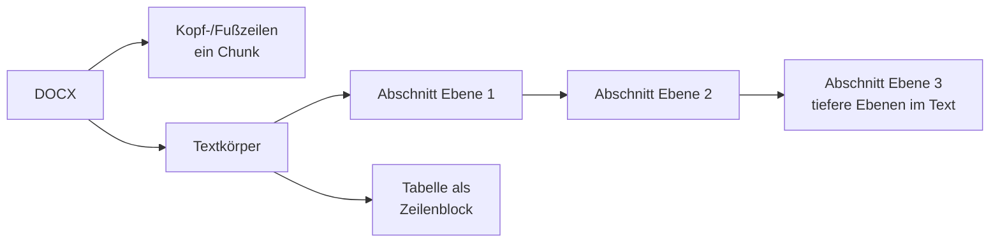

# Format: Word (DOCX)

> **Entwurf.** Pipeline `docx`, Version 3. Der gemeinsame Rahmen aller Format-Pipelines steht im
> Kapitel [Indexierung](indexierung.md), Abschnitt 5. Das ältere Binärformat `.doc` läuft über die
> [Auffang-Pipeline](format-fallback.md).

## 1. Zulassung

| Endung | Prüfung |
|---|---|
| `.docx` | strikt: OOXML-Container mit Word-Inhaltstyp |

## 2. Was gelesen wird

Die Pipeline liest die Datei mit Apache POI, nicht über Apache Tika, weil Tika die
Überschriftenebenen verliert. Gelesen werden in Dokumentreihenfolge alle Absätze und Tabellen
sowie die Kopf- und Fußzeilen aller Abschnitte.

## 3. Struktur und Chunks

**Überschriften.** Die Ebene kommt aus der Formatvorlage („Überschrift 1", „Heading 2",
auch die englische und die umlautlose Schreibweise) oder aus der Gliederungsebene des Absatzes.
Geschnitten wird an den Ebenen 1 bis 3; tiefere Überschriften bleiben Teil des Abschnittstexts.
Zielgröße rund 4.000 Zeichen, harte Obergrenze 20.000 Zeichen, keine Überlappung; die
Überschriftenzeile steht am Anfang jedes Chunks.

**Tabellen.** Jede Tabellenzeile wird eine Textzeile, Zellen durch ` | ` getrennt. Die ganze
Tabelle ist ein Absatzblock innerhalb ihres Abschnitts und wird nie zur Überschrift.

**Kopf- und Fußzeilen.** Alle Varianten (Standard, erste Seite, gerade Seiten) aller
Abschnitte werden gesammelt, doppelte entfernt und als **ein** führender Chunk mit der
Ortsangabe „Kopf-/Fußzeile" abgelegt. Ein Briefkopf mit Aktenzeichen wird so genau einmal
gefunden statt auf jeder Seite. Ein Kandidat ohne einen einzigen Buchstaben, etwa nur eine
Seitenzahl, wird verworfen.

**Was ausgeschlossen wird.** Feldanweisungen (etwa die Formel hinter einem Datumsfeld) und
gelöschter Text aus der Änderungsverfolgung. Der sichtbare Feldwert bleibt erhalten.

## 4. Metadaten am Chunk

| Feld | Inhalt | Beispiel |
|---|---|---|
| Ortsangabe (`location`) | Abschnittspfad | `Abschn. Allgemeines › Geltungsbereich` |
| Ortsangabe des Kopfzeilen-Chunks | fest | `Kopf-/Fußzeile` |

**Dokumenteigenschaften:** Titel, Erstellungs- und Änderungsdatum aus den Dokumenteigenschaften
der Datei sowie die erste Überschrift der Ebene 1.

## 5. Scans und Fehler

| Befund | Ergebnis |
|---|---|
| Datei nicht als DOCX lesbar | fehlgeschlagen, „kein Inhalt" |
| Dokument ohne einen einzigen Absatz | fehlgeschlagen, „kein Inhalt" |
| Absätze vorhanden, aber ohne Text (etwa nur ein eingebettetes Scanbild) | abgewiesen, „kein extrahierbarer Text" |

Kopf- und Fußzeilen retten ein Dokument nie vor dieser Einstufung: Ein gescannter Behördenbrief
mit Textbriefkopf, aber Bildinhalt bleibt als Scan sichtbar, statt mit nur dem Briefkopf als
indiziert zu gelten. Ein einzelner beschädigter Absatz kostet nur diesen Absatz.

## 6. Grenzwerte

Keine eigenen Konfigurationsschlüssel. Apache POI schützt prozessweit gegen ZIP-Bomben
(Entpackverhältnis).

## 7. Nicht verarbeitet

- Fußnoten und Endnoten, Kommentare
- Textfelder und Zeichnungsobjekte, eingebettete Objekte
- Linkziele hinter Hyperlinks
- Änderungsverfolgung wird nicht ausgewertet; nur gelöschter Text wird ausgeschlossen,
  eingefügter Text ist vom übrigen nicht unterscheidbar
