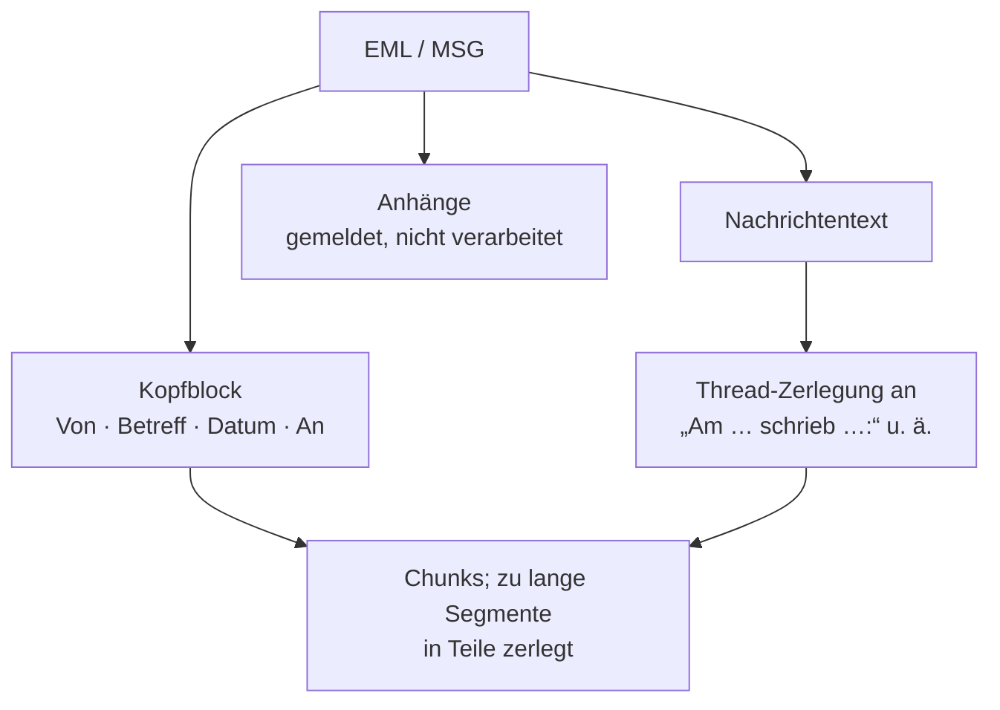

# Format: E-Mail (EML, MSG)

> **Entwurf.** Pipeline `email`, Version 4. Der gemeinsame Rahmen aller Format-Pipelines steht
> im Kapitel [Indexierung](indexierung.md), Abschnitt 5; der Anhangsweg dort in Abschnitt 6.

## 1. Zulassung

| Endung | Prüfung |
|---|---|
| `.msg` | strikt: Outlook-Container |
| `.eml` | text-tolerant: Inhalt muss Text sein **und** die Datei muss `.eml` heißen |

Die unterschiedliche Strenge ist Absicht. Für `.eml` gibt es keine verlässliche Signatur, nur
eine lose Heuristik über Kopfzeilen wie `Date:` oder `From:`. Als strikte Regel würde sie eine
Protokolldatei mit Datumszeilen fälschlich als Mail einstufen und zugleich eine echte Mail mit
`Authentication-Results:` als erster Zeile abweisen.

Für `.msg` am Webverzeichnis-Konnektor: Eine große MSG-Datei ist aus dem Dateianfang allein
nur als „Office-Container" erkennbar; der Konnektor lädt sie dann vollständig, um zu
entscheiden.

## 2. Was gelesen wird

| Format | Leser |
|---|---|
| EML | Apache James Mime4j; ein HTML-Nachrichtentext wird von Markup befreit |
| MSG | Apache POI HSMF; ebenso |

Bei EML gewinnt die Klartext-Fassung des Nachrichtentexts; die HTML-Fassung dient nur als
Ersatz. Beide Leser halten die ganze Nachricht im Speicher.

## 3. Struktur und Chunks

**Kopfblock.** Die vier Kopfdaten werden als deutsche Kontextzeilen in der Reihenfolge Von,
Betreff, Datum, An vor den Nachrichtentext gesetzt. „An" steht bewusst zuletzt, weil es als
einziges Feld beliebig lang sein kann. Das Datum wird als `dd.MM.yyyy HH:mm` in der Zeitzone
des Servers ausgegeben. Der Kopfblock ist Teil des ersten Chunks und läuft durch denselben
Zuschnitt wie der übrige Text; ein Rundschreiben an hunderte Empfänger wird deshalb in Teile
zerlegt statt einen Chunk unbegrenzt wachsen zu lassen.

**Thread-Zerlegung.** Zitierte Vorgängernachrichten werden an den üblichen Trennzeilen
erkannt und als eigene Segmente behandelt:

- `Am … schrieb …:` (deutsch)
- `On … wrote:` (englisch)
- `----- Ursprüngliche Nachricht -----` bzw. `----- Original Message -----`

Eine unerkannte Zitierkonvention ist unschädlich: Die Nachricht bleibt dann ein Segment. Jedes
Segment trägt die Kopfdaten der äußeren Nachricht; die Kopfzeilen zitierter Nachrichten sind
freier Text und werden nicht ausgewertet.

**Zuschnitt.** Ein Segment, das die konfigurierte Chunk-Größe der Auffang-Pipeline
(Standard 1000 Tokens, 100 Überlappung) überschreitet, wird mit deren Token-Splitter geteilt.
Das ist der einzige Größenparameter dieser Pipeline.

**Nur Kopfdaten.** Eine Mail ohne Nachrichtentext, aber mit Anhängen, bekommt einen Chunk aus
dem Kopfblock. So bleibt „Von wem kam der Bescheid und wann?" beantwortbar. Eine leere Mail
ohne Anhänge wird dagegen als „kein extrahierbarer Text" abgewiesen.

## 4. Kopfdaten als Metadaten

Am Chunk trägt die Mail-Pipeline nur die Ortsangabe wie jede andere Pipeline:

| Feld | Inhalt |
|---|---|
| `location` | `Nachricht 2 von 4`, `Teil 3 von 7` oder `Nachricht 2 von 4 · Teil 3 von 7`; bei einer ungeteilten Nachricht leer |

Die Kopfdaten selbst sind seit #1242 **Werte des Metadatenschemas am Dokument**, keine
mail-eigenen Chunk-Schlüssel mehr — dieselbe Mechanik wie bei den Kernfeldern, mit Herkunft
„deterministisch" und Extraktionsversion (siehe [Metadaten](metadaten.md), Abschnitt 2a):

| Feld | Inhalt | Filterbar |
|---|---|---|
| **Absender** | die reine Adresse des `From`-Kopfs, kleingeschrieben (`Max Mustermann <Max.Mueller@Stadt.de>` → `max.mueller@stadt.de`) | ja, als Genau-Treffer |
| **An** | alle Empfänger, mit `; ` getrennt, auf 200 Zeichen gekürzt | nein |
| **Betreff** | Betreff der Nachricht | nein |
| **Datum/Stand** | Kalendertag aus dem `Date`-Kopf (Kernfeld) | ja, als Zeitraum |

Ein `From`-Kopf ohne Adresse — bei MSG kann dort nur ein Anzeigename stehen — ergibt **keinen**
Absender; geraten wird nichts. Die Suche bietet den Absender im Filter-Popover mit den im
Suchbereich vorkommenden Adressen an; ein Dokument ohne Absender bleibt gefunden
(Leerwert-Regel). Nach dem Betreff wird nicht gefiltert — er steht im Kopfblock des Chunk-Textes
und damit in der Volltextsuche.

**Dokumenteigenschaften:** Betreff als Titel, der `Date`-Kopf als Dokumentdatum mit höchstem
Rang für das Metadatenschema. Weil der Betreff zugleich der Titel ist, zeigt die Belegzeile ihn
nur einmal.

**Altbestand.** Eine vor #1242 indizierte Mail trägt die Kopfdaten noch nicht als Schemafelder.
Sie kommen mit dem nächsten Lauf über das Dokument: Pipeline-Reindex (die Pipeline-Version ist
auf 5 gestiegen) oder Bestandslauf des Metadatenschemas.

## 5. Anhänge

Die Pipeline **meldet** Anhänge, verarbeitet sie aber nicht selbst. Jeder gemeldete Anhang
wird ein eigenes Dokument mit eigener Pipeline: Ein PDF-Anhang trägt `pipeline_id=pdf`, nicht
`email`.

| Regel | EML | MSG |
|---|---|---|
| Was gilt als Anhang | jeder Teil mit `Content-Disposition: attachment` oder mit einem Dateinamen; ein Teil ohne Namen heißt `anhang` | jede Anlage mit Daten |
| Eingebettete Nachricht | wird als `nachricht.eml` gemeldet; die Kette geht bis zur Tiefengrenze weiter | eingebettete Outlook-Objekte werden übersprungen, weil sie sich nicht als Datei ausgeben lassen |
| Inline-Bilder | ein Inline-Bild mit Dateiname gilt als Anhang; ohne Namen wird es übergangen | wie Anhang |
| Größengrenze je Anhang | beim Kopieren durchgesetzt | erst nach dem Lesen, weil der Leser alles im Speicher hält |

**Speicherkontingent.** Die Mail meldet als eigene Größe nur Kopfblock plus Nachrichtentext.
Sonst stünden die Anhänge, die in der Rohdatei base64-kodiert stecken, doppelt in der Bilanz:
einmal in der Mail, einmal als eigenes Dokument.

**Gezielte Extraktion.** Der Pipeline-Nachzug kann einen einzelnen Anhang anhand seiner
Position erneut aus der Mail holen. Anhänge, die im normalen Lauf gar nicht gemeldet würden
(zu groß, nicht dekodierbar), verbrauchen dabei keine Position.

Anhangsnamen sind fremdbestimmter Inhalt; ihre Endung wird für temporäre Dateien auf zehn
alphanumerische Zeichen beschränkt.

## 6. Fehler

| Befund | Ergebnis |
|---|---|
| Datei größer als die Nachrichtengrenze | fehlgeschlagen, „kein Inhalt", geprüft vor jedem Leser |
| Weder Text noch Kopfdaten, aber Anhänge | Mail selbst „kein extrahierbarer Text", Anhänge werden trotzdem gemeldet und indiziert |
| Leere Mail ohne Anhänge | abgewiesen, „kein extrahierbarer Text" |
| Lese- oder Parse-Fehler | Fehler wird als Ausnahme gemeldet, das Dokument ist „fehlgeschlagen" |

## 7. Grenzwerte

Schlüssel unter `opaa.indexing.mail.*`:

| Schlüssel | Standard | Wirkung |
|---|---|---|
| `max-message-bytes` | 100 MiB | Obergrenze der Datei; die eigentliche Speichergrenze, weil die Leser alles im Speicher halten |
| `max-attachments-per-message` | 50 | ab dieser Zahl wird kein Anhang mehr ausgepackt |
| `max-attachment-bytes` | 50 MiB | je Anhang |

Die Verschachtelungstiefe für Mail-in-Mail ist seit #1269 kein eigener Mail-Schlüssel mehr, sondern
die allgemeine `opaa.indexing.attachments.max-depth` (siehe [Indexierung](indexierung.md)) - dieselbe
Grenze gilt für jede Anhangskette, unabhängig vom Konnektor.

Die Anhangsgrenzen oben schützen Platte und nachgelagerte Verarbeitung, nicht den Parse-Vorgang
selbst.

## 8. Nicht verarbeitet

- Verschlüsselte oder signierte Nachrichten (S/MIME, PGP) werden weder entschlüsselt noch geprüft
- Kopfdaten außer den vieren: kein Cc, Bcc, Reply-To, Message-ID
- Echte Thread-Verkettung über `References`; nur die Texterkennung der Trennzeilen
- Der Kopfblock steht nur im ersten Chunk. Ein späterer Chunk trägt die Kopfdaten nur über die
  Metadaten des Dokuments, nicht im Text. Bewusst in Kauf genommen.
- Ein Filter auf den Betreff; er ist ein Anzeigefeld, und Teilstring-Filter gibt es im Schema
  nicht (Maintainer-Entscheidung 04.09.2026)
