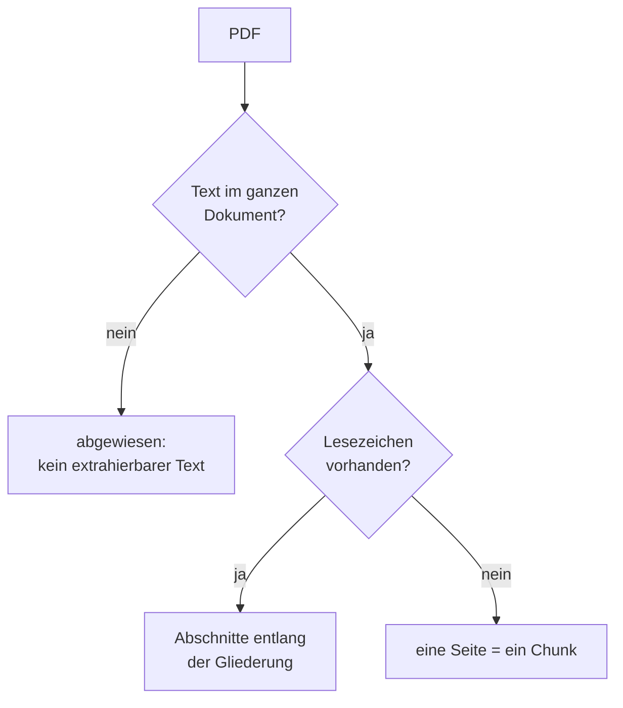

# Format: PDF

> **Entwurf.** Pipeline `pdf`, Version 1. Der gemeinsame Rahmen aller Format-Pipelines steht im
> Kapitel [Indexierung](indexierung.md), Abschnitt 5.

## 1. Zulassung

| Endung | Prüfung |
|---|---|
| `.pdf` | strikt: der Inhalt muss die PDF-Signatur tragen |

Eine als `.pdf` benannte Datei mit anderem Inhalt wird nach ihrem tatsächlichen Format
verarbeitet und mit „Formatabweichung" protokolliert.

## 2. Was gelesen wird

Die Pipeline liest PDFs direkt mit Apache PDFBox. Sie nutzt zwei Quellen:

- den **Text** in Lesereihenfolge, seitenweise,
- die **Lesezeichen-Gliederung** (Outline), sofern das Dokument eine hat.

## 3. Struktur und Chunks

**Mit Gliederung.** Jeder Lesezeichen-Eintrag, der auf eine Seite zeigt, wird zur Überschrift
seiner Ebene. Es gibt keine Begrenzung der Ebenentiefe: Bei einer Satzung sind Paragraf und
Absatz oft zwei Gliederungsebenen, und beide sollen zitierfähig bleiben. Der Text wird entlang
dieser Überschriften in Abschnitte geschnitten:

- Zielgröße rund 4.000 Zeichen; kleinere Abschnitte werden bis dahin zusammengelegt, größere an
  Absatzgrenzen geteilt. Harte Obergrenze 20.000 Zeichen mit sichtbarem Vermerk „gekürzt".
- Die Überschriftenzeile steht am Anfang jedes Chunks, auch bei jedem Teilstück eines geteilten
  Abschnitts.
- Zeigen mehrere Lesezeichen auf dieselbe Seite, wird der Seitentext anhand der
  Überschriftentexte aufgeteilt. Lässt sich ein Titel im Text nicht wörtlich wiederfinden, fällt
  der ganze Bereich dem letzten Eintrag zu.
- Text vor dem ersten Lesezeichen wird ein eigener Chunk ohne Abschnittspfad.
- Keine Überlappung zwischen Chunks.

**Ohne Gliederung.** Eine Seite ist ein Chunk. Leere Seiten werden übersprungen. Auch hier gilt
die Obergrenze von 20.000 Zeichen.

## 4. Metadaten am Chunk

| Feld | Inhalt | Beispiel |
|---|---|---|
| Ortsangabe (`location`) mit Gliederung | Abschnittspfad | `Abschn. Satzung › § 7 Gebühren › Absatz 2` |
| Ortsangabe ohne Gliederung | Seitenzahl | `S. 4` |

Die Ortsangabe erscheint im Zitat der Antwort.

**Dokumenteigenschaften** für das Metadatenschema: Titel, Erstellungs- und Änderungsdatum aus den
PDF-Dokumentinfos sowie der erste Gliederungseintrag der obersten Ebene als erste Überschrift.

## 5. Scans und Fehler

| Befund | Ergebnis |
|---|---|
| Kein Text im ganzen Dokument (Scan ohne Textebene) | abgewiesen, „kein extrahierbarer Text". Das Dokument erscheint in der Admin-Liste der Dokumente ohne Chunks. |
| Text vorhanden, aber Zuschnitt ergibt nichts | abgewiesen, „kein extrahierbarer Text" |
| Datei nicht lesbar oder beschädigt | fehlgeschlagen, „kein Inhalt" |

Ein PDF mit Textebene aus einer früheren OCR-Verarbeitung wird normal verarbeitet; die Qualität
hängt dann von dieser Textebene ab.

## 6. Grenzwerte

Keine eigenen Konfigurationsschlüssel. Es gelten die Zeichenobergrenzen des gemeinsamen
Abschnittsschneiders und die Grenzen von PDFBox. Am Webverzeichnis-Konnektor greift zusätzlich
die Dateigrößengrenze des Konnektors.

## 7. Nicht verarbeitet

- Texterkennung (OCR) für Scans. Eigenes Vorhaben, siehe Kapitel Indexierung.
- Formularfelder, Anmerkungen und Kommentare
- eingebettete Dateien und PDF-Portfolios
- Tabellenstruktur; Tabellen kommen als Fließtext in Lesereihenfolge an
