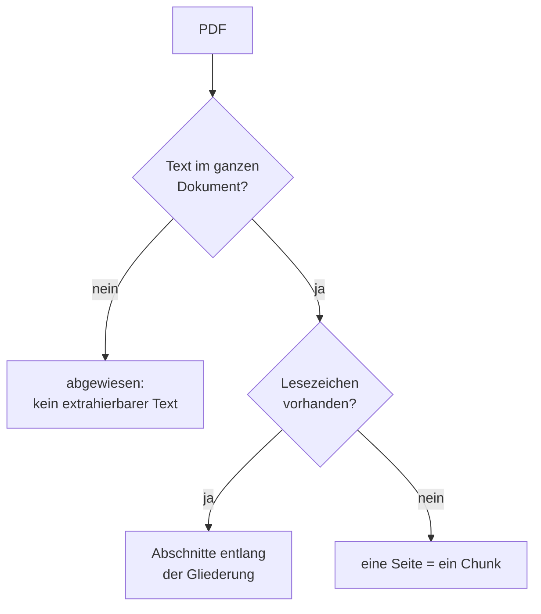

# Format: PDF

> **Entwurf.** Pipeline `pdf`, Version 3. Der gemeinsame Rahmen aller Format-Pipelines steht im
> Kapitel [Indexierung](indexierung.md), Abschnitt 5.

## 1. Zulassung

| Endung | Prüfung |
|---|---|
| `.pdf` | strikt: der Inhalt muss die PDF-Signatur tragen |

Eine als `.pdf` benannte Datei mit anderem Inhalt wird nach ihrem tatsächlichen Format
verarbeitet und mit „Formatabweichung" protokolliert.

## 2. Was gelesen wird

Die Pipeline liest PDFs direkt mit Apache PDFBox. Sie nutzt drei Quellen:

- den **Text** in Lesereihenfolge, seitenweise,
- die **Linien** einer Seite, um Tabellen mit Gitter zu erkennen (Abschnitt 3),
- die **Lesezeichen-Gliederung** (Outline), sofern das Dokument eine hat.

**Hochgestellte Satz- und Fußnotennummern.** Eine Ziffer, die kleiner und mit angehobener
Grundlinie gesetzt ist, wird durch ein Leerzeichen von einer unmittelbar folgenden Ziffer oder
einem Buchstaben getrennt: Aus „¹10 Jahre" wird „1 10 Jahre", aus „²Mit" wird „2 Mit". Es wird
nur Leerraum ergänzt, die Nummer selbst bleibt im Text. Normal gesetzte Zahlen, Sonderzeichen wie
€ und Einheiten mit eigenem Hochzeichen wie m² bleiben unverändert. Das gilt auch in
Tabellenzellen.


```mermaid
flowchart TB
    P[PDF] --> T{Text im ganzen<br/>Dokument?}
    T -- nein --> S[abgewiesen:<br/>kein extrahierbarer Text]
    T -- ja --> O{Lesezeichen<br/>vorhanden?}
    O -- ja --> G[Abschnitte entlang<br/>der Gliederung]
    O -- nein --> Pg[eine Seite = ein Chunk]
```

## 3. Struktur und Chunks

**Mit Gliederung.** Jeder Lesezeichen-Eintrag, der auf eine Seite zeigt, wird zur Überschrift
seiner Ebene. Es gibt keine Begrenzung der Ebenentiefe: Bei einer Satzung sind Paragraf und
Absatz oft zwei Gliederungsebenen, und beide sollen zitierfähig bleiben. Der Text wird entlang
dieser Überschriften in Abschnitte geschnitten:

- Zielgröße rund 4.000 Zeichen; kleinere Abschnitte werden bis dahin zusammengelegt, größere an
  Absatzgrenzen geteilt. Harte Obergrenze 20.000 Zeichen mit sichtbarem Vermerk „gekürzt".
- Die Überschriftenzeile steht am Anfang jedes Chunks, auch bei jedem Teilstück eines geteilten
  Abschnitts.
- Zeigen mehrere Lesezeichen auf dieselbe Seite, wird der Seitentext anhand der
  Überschriftentexte aufgeteilt. Lässt sich ein Titel im Text nicht wörtlich wiederfinden, fällt
  der ganze Bereich dem letzten Eintrag zu.
- Text vor dem ersten Lesezeichen wird ein eigener Chunk ohne Abschnittspfad.
- Keine Überlappung zwischen Chunks.

**Ohne Gliederung.** Eine Seite ist ein Chunk. Leere Seiten werden übersprungen. Auch hier gilt
die Obergrenze von 20.000 Zeichen.

**Tabellen.** Eine Tabelle, deren Zellen vollständig von Linien umschlossen sind, wird wie in
allen anderen Formaten ausgegeben: jede Tabellenzeile eine Textzeile, Zellen durch ` | `
getrennt, eine leere Zelle behält ihre Spaltenposition. Bricht der Text einer Zelle um, wird er
zu einer Zeile zusammengefügt. Die Tabelle steht an der Stelle im Seitentext, an der sie im
Dokument beginnt; der übrige Text der Seite steht davor und danach in Lesereihenfolge.

```
Datum | Wochentag | Standort | Besetzung
4. August 2026 | Dienstag | Stadtteilzentrum Rheinau | Maria Weber
12. August 2026 | Mittwoch | Gemeindezentrum Nordfeld | Selin Kaya
```

Die Erkennung ist bewusst streng, damit Briefköpfe, Rahmen und mehrspaltiges Layout nicht als
Tabelle gelesen werden. Als Tabelle gilt nur ein Gitter aus mindestens drei waagerechten und drei
senkrechten Linien, die jeweils über die ganze Tabelle reichen, mit Text in mindestens zwei Zeilen
und zwei Spalten. Alles andere ist Fließtext in Lesereihenfolge, die Wörter einer Zeile nur durch
Leerzeichen getrennt:

| Fall | Ergebnis |
|---|---|
| Tabelle ohne Linien oder nur mit waagerechten Linien | Fließtext |
| Tabelle mit verbundenen Zellen (eine Linie reicht nicht über die ganze Tabelle) | Fließtext |
| Kasten um einen Absatz, Formular mit leeren Feldern | Fließtext |
| gedrehte Seite, Seite mit Artikelfluss (Artikel-Threads) | ganze Seite Fließtext |
| Seite mit sehr vielen Linien oder Pfadpunkten, etwa ein Plan oder eine Grafik | ganze Seite Fließtext |
| Fehler beim Lesen der Linien | ganze Seite Fließtext, das Dokument wird trotzdem verarbeitet |

Eine Tabelle, die über mehrere Seiten läuft, erscheint je Seite als eigener Block; die Kopfzeile
steht nur dort, wo das Dokument sie druckt.

## 4. Metadaten am Chunk

| Feld | Inhalt | Beispiel |
|---|---|---|
| Ortsangabe (`location`) mit Gliederung | Abschnittspfad | `Abschn. Satzung › § 7 Gebühren › Absatz 2` |
| Ortsangabe ohne Gliederung | Seitenzahl | `S. 4` |

Die Ortsangabe erscheint im Zitat der Antwort.

**Dokumenteigenschaften** für das Metadatenschema: Titel, Erstellungs- und Änderungsdatum aus den
PDF-Dokumentinfos sowie der erste Gliederungseintrag der obersten Ebene als erste Überschrift.

## 5. Scans und Fehler

| Befund | Ergebnis |
|---|---|
| Kein Text im ganzen Dokument (Scan ohne Textebene) | abgewiesen, „kein extrahierbarer Text". Das Dokument erscheint in der Admin-Liste der Dokumente ohne Chunks. |
| Text vorhanden, aber Zuschnitt ergibt nichts | abgewiesen, „kein extrahierbarer Text" |
| Datei nicht lesbar oder beschädigt | fehlgeschlagen, „kein Inhalt" |

Ein PDF mit Textebene aus einer früheren OCR-Verarbeitung wird normal verarbeitet; die Qualität
hängt dann von dieser Textebene ab.

## 6. Grenzwerte

Keine eigenen Konfigurationsschlüssel. Es gelten die Zeichenobergrenzen des gemeinsamen
Abschnittsschneiders und die Grenzen von PDFBox. Am Webverzeichnis-Konnektor greift zusätzlich
die Dateigrößengrenze des Konnektors.

## 7. Nicht verarbeitet

- Texterkennung (OCR) für Scans. Eigenes Vorhaben, siehe Kapitel Indexierung.
- Formularfelder, Anmerkungen und Kommentare
- eingebettete Dateien und PDF-Portfolios
- Tabellen ohne vollständiges Gitter aus Linien behalten keine Spaltenstruktur (Abschnitt 3)
