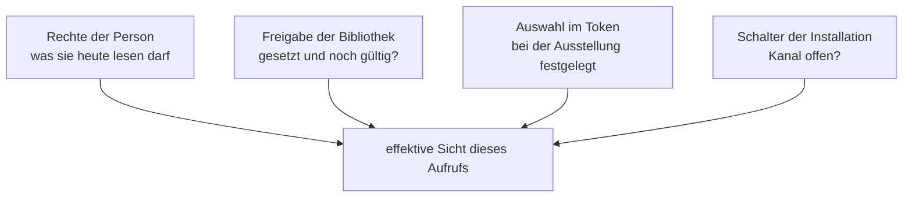

# Fremdzugänge: Zugangstokens und MCP-Server

Fremdzugänge machen freigegebene Wissensbibliotheken für KI-Werkzeuge erreichbar, die außerhalb von
OPAA laufen — einen Entwicklungsassistenten, ein Automatisierungswerkzeug, ein eigenes Skript. Das
fremde Werkzeug bleibt, wo es ist, und holt sich Fundstellen aus dem Bestand des Hauses: mit den
Rechten der Person, die es benutzt, und nur aus den Beständen, die dafür ausdrücklich freigegeben
sind.

Eine frische Installation liefert den Kanal **ausgeschaltet** aus. Ihn einzuschalten ist eine
Entscheidung mit organisatorischen Vorbedingungen, kein Konfigurationsschritt — Abschnitt 2.

## 1. Was Fremdzugänge sind — und was nicht

| | |
|---|---|
| **Ist** | Ein **lesender** Zugang für Werkzeuge, die eine Person auf ihrem Arbeitsplatz oder im Hausnetz betreibt |
| **Ist** | Ein Kanal hinter **drei** Freigaben: Schalter der Installation, Freigabe der Bibliothek, Auswahl im Zugangstoken |
| **Ist nicht** | Ein Zugang für fremd betriebene Dienste im offenen Netz. OPAA wird dafür nicht öffentlich erreichbar gemacht und betreibt keinen Autorisierungsserver |
| **Ist nicht** | Eine zweite Assistenzoberfläche. Fremdzugänge liefern **Fundstellen**, keine erzeugten Antworten; formuliert wird im fremden Werkzeug, mit dessen Modell |
| **Ist nicht** | Ein Verwaltungs-, Indizierungs- oder Schreibweg. Ein Zugangstoken erreicht ausschließlich die drei Lesewege aus Abschnitt 8; jeder andere Pfad wird abgewiesen |
| **Ist nicht** | Der Zugang für ein Fachverfahren — siehe Abschnitt 7 |

**Ein Zugangstoken kann nie mehr als seine Person.** Es ist ein Ausschnitt ihrer Rechte, kein
eigener Rechteträger. Was ein Token sieht, ist bei **jedem einzelnen Aufruf** neu die Schnittmenge
aus vier Bedingungen:



Fällt eine Bibliothek aus einem dieser vier Gründe weg, verschwindet sie aus den Treffern. Sie
erzeugt keinen Fehler und keinen Hinweis auf ihre Existenz — dieselbe Regel wie in der
Web-Oberfläche.

## 2. Vor dem Einschalten

Der Fremdzugang ist eine technische Einrichtung, die zur Überwachung von Verhalten und Leistung
geeignet sein kann. **Ob und in welchem Umfang daraus ein Mitbestimmungstatbestand folgt, richtet
sich nach dem einschlägigen Personalvertretungsrecht und ist von der einführenden Stelle rechtlich
zu prüfen.** Vier Punkte gehören deshalb **vor** das Einschalten, nicht danach:

- **Beteiligung der Personalvertretung klären.** Der Schalter ist ein Verwaltungsakt; er lässt sich
  technisch in einer Minute umlegen, und genau deshalb steht dieser Punkt hier.
- **Die Beschäftigten unterrichten** über den Kanal, über die dabei erhobenen Angaben (Abschnitt 11)
  und über die **Freiwilligkeit** der Nutzung. Aus der Nichtnutzung eines Fremdzugangs entsteht kein
  Nachteil: Jede Fachaufgabe bleibt über die Web-Oberfläche vollständig erledigbar.
- **Abstimmung mit dem behördlichen Datenschutzbeauftragten**, insbesondere darüber, dass Fragen und
  abgerufene Inhalte im fremden Werkzeug weiterverarbeitet werden — mit dessen Protokollierung,
  dessen Telemetrie und dessen Modell. Die Zusage, dass OPAA einzelne Abfragen nicht mitschreibt,
  endet an der Grenze der Anwendung.
- **Festlegen, wer freigibt.** Eine Bibliothek gibt frei, wer sie verwaltet (Abschnitt 4). Ohne
  vorher benannte Zuständigkeit landet jede Anfrage beim Betrieb, der sie nicht entscheiden kann.

Die Oberfläche sagt dasselbe an der Stelle der Handlung: beim Erzeugen eines Tokens steht der
Hinweis, dass Fragen und Inhalte OPAA verlassen und dass Name, Bibliotheken und Ablauf des Tokens
auch die Systemverwaltung sieht.

## 3. Der Schalter der Installation

*Administration → Fremdzugänge → Kanaleinstellungen.* Die Seite gehört der Systemverwaltung und gilt
für die ganze Installation.

| Einstellung | Bedeutung |
|---|---|
| **Fremdzugänge erlauben** | Der Hauptschalter und zugleich der **Notaus**. Ausgeliefert: aus |
| **Höchstlaufzeit für Zugangstokens** | Die längste Befristung, die eine Person beim Anlegen wählen darf |
| **Kontingent je Token** | Anfragen je Stunde und Token — eine Lastbremse (Abschnitt 10) |
| **Netzbereiche des Kanals** | Aus welchen Netzen der Kanal überhaupt antwortet; ausgeliefert nur das Hausnetz |
| **Schwelle des Abflussalarms** | Abrufe je Stunde über den ganzen Kanal, ab denen eine Meldung entsteht |
| **Einleitungstext für fremde Werkzeuge** | Der Text, den der MCP-Server dem fremden Modell beim Verbinden mitgibt |

Vorgabewerte und Grenzen stehen in Abschnitt 15.

**Solange der Schalter aus ist, verhält sich die Installation, als gäbe es den Kanal nicht.** Wer
kein gültiges Token vorweisen kann, erfährt am MCP-Endpunkt nicht einmal, dass es ihn gibt. Die
genauen Antworten stehen in der Störungssuche (Abschnitt 13).

**Der Notaus wirkt je Aufruf.** Schalterzustand, Tokengültigkeit und effektive Sicht werden bei
jedem einzelnen Werkzeug- und Endpunktaufruf neu geprüft; der MCP-Server arbeitet zustandsfrei, es
gibt also keine offene Sitzung, die den Notaus überdauern könnte. Vorhandene Tokens bleiben beim
Ausschalten **bestehen** und wirken nach dem Wiedereinschalten wieder — ein Notaus, der die
Einrichtung aller Beschäftigten vernichtet, wird im Zweifel nicht benutzt.

**Der Netzbereich gehört dem Kanal, nicht dem Token.** Der realistische Weg, auf dem ein Tokenwert
nach außen gerät, ist kein Angriff, sondern eine Konfigurationsdatei, die in einem Repository oder
einem über Geräte synchronisierten Profil landet. Mit der Vorgabe „nur Hausnetz" wirkt er dort
nicht. Eine Einschränkung je Token gibt es bewusst nicht.

> **Hinter einem Reverse Proxy muss `OPAA_RATE_LIMIT_TRUSTED_PROXY_CIDRS` gesetzt sein.** Geprüft
> wird die Adresse aus der Trusted-Proxy-Auflösung: `X-Forwarded-For` zählt nur, wenn die Verbindung
> selbst aus einem dort eingetragenen Netz kommt. Ist die Liste leer, prüft die Netzbeschränkung die
> Adresse des Proxys — die im Hausnetz liegt und damit **jeden** Aufrufer durchlässt. Siehe
> [Deployment](deployment.md#alle-umgebungsvariablen).

**Der Einleitungstext** wird auf derselben Seite gepflegt; ein Vorgabetext ist gesetzt und für die
meisten Häuser ausreichend. Er sagt dem fremden Modell, wann es den Kanal in Betracht ziehen soll
und dass es seine Antworten mit Fundstellen zu belegen hat. Seine Änderung ändert keine Reichweite
und wird deshalb **nicht** protokolliert — jede andere Änderung auf dieser Seite schon.

## 4. Die Freigabe einer Wissensbibliothek

Freigabe-Einheit ist die **Wissensbibliothek**, nicht der Raum. Jede Bibliothek trägt im Reiter
**„Freigaben"** ihrer Detailseite, Abschnitt **„Externer Zugang"**, das Merkmal „über Fremdzugänge
nutzbar", Standard **aus**. Setzen darf es, wer die Bibliothek verwaltet (Verwalter-Rolle), sowie
die Systemverwaltung. Eine zusätzliche
Genehmigungsstufe gibt es nicht: Wer den Bestand verantwortet, entscheidet über ihn.

**Die Freigabe ist pflichtbefristet.** Ohne Ablauf wäre sie eine Ratsche — jede Anfrage erzeugt
eine, nichts erzeugt je eine Rücknahme. Die Befristung darf die installationsweite Obergrenze nicht
überschreiten (Abschnitt 15). Läuft sie ab, **erlischt** die Freigabe von selbst; erneuern kann nur,
wer den Bestand verantwortet.

- Ein täglicher Lauf verschickt die **Wiedervorlage per Mail** und lässt danach die fälligen
  Freigaben erlöschen. Der Vorlauf steht in Abschnitt 15; ohne eingerichteten Mailversand
  ([Deployment](deployment.md#e-mail-versand-smtp)) erlischt die Freigabe trotzdem, nur
  unangekündigt. **Empfänger ist genau eine Person: wer die Freigabe zuletzt gesetzt hat.** Ist
  dieses Konto entfallen, tritt die Eigentümerin der Bibliothek an ihre Stelle — gehört die
  Bibliothek jedoch einer Gruppe, unterbleibt die Wiedervorlage und wird nur im Anwendungslog
  vermerkt. Die Freigabe erlischt in diesem Fall unangekündigt, obwohl der Mailversand eingerichtet
  ist; bei gruppeneigenen Bibliotheken gehört das Ablaufdatum deshalb in die eigene Wiedervorlage.
- Setzen, Zurücknehmen und Erlöschen erzeugen je einen Protokolleintrag. Zusätzlich ist das Merkmal
  **historisiert** wie die übrigen Reichweitenfelder: Zu einem beliebigen vergangenen Stichtag ist
  belegbar, ob eine Bibliothek über Fremdzugänge erreichbar war — auch nachdem der Protokollzeitraum
  nach Frist gelöscht wurde.
- Der Verantwortliche sieht die **Anzahl** der Zugangstokens, die seine Bibliothek gerade enthalten.
  Eine Zahl, keine Namen, keine Personen, keine Nutzung — der eine Anhalt für die Frage, ob die
  Freigabe überhaupt gebraucht wird.

*Administration → Fremdzugangsfreigaben* führt alle freigegebenen Bibliotheken der Installation mit
ihrem Ablaufdatum — die Sicht, mit der die Systemverwaltung die Aussage „diese Bestände sind aus dem
Haus erreichbar" belegen kann.

**Eine zurückgenommene oder erloschene Freigabe wirkt sofort für alle Tokens**, ohne dass diese
angefasst werden müssen. Die betroffene Auswahl bleibt im Token gespeichert und wird dort als
**ausgesetzt** angezeigt. Sie lebt **nicht wieder auf**, wenn die Bibliothek später erneut
freigegeben wird; wer sie wieder nutzen will, erzeugt ein neues Token.

## 5. Zugangstokens aus Sicht der Person

*Einstellungen → Zugangstokens.* Jede Person verwaltet ihre eigenen Tokens selbst; der Betrieb wird
dafür nicht gebraucht.

**Anlegen.** Pflichtangaben sind Name, Bibliotheken und Ablaufdatum.

- **Name** — der Zweck, nicht eine Nummer: „Claude Code auf dem Dienstrechner". Er ist das Einzige,
  woran die Person in einem Jahr noch erkennt, was sie widerrufen darf. Er steht in der Tokenliste,
  **nicht** im Nachweisprotokoll.
- **Bibliotheken** — eine konkrete Liste, mindestens eine. Auswählbar ist nur, was die Person selbst
  lesen darf **und** was freigegeben ist. Eine Option „alle, auch künftige" gibt es nicht, und die
  Auswahl ist nach der Ausstellung **unveränderlich**: Eine Änderung ist ein neues Token.
- **Ablauf** — Pflicht, begrenzt durch die Höchstlaufzeit der Installation. Die Person wird vor dem
  Ablauf per Mail erinnert (Abschnitt 15), und die eigene Liste weist rechtzeitig darauf hin.

Ist keine Bibliothek wählbar, liegt es entweder am fehlenden Lesezugriff oder an der fehlenden
Freigabe. Beides entscheidet, wer die Bibliothek verwaltet; einen Antragsweg in der Anwendung gibt
es bewusst nicht.

**Der Wert wird genau einmal angezeigt**, unmittelbar nach dem Erzeugen, zusammen mit einem
Kurzausschnitt für die Einrichtung. Die vollständigen Wege je Client — und zwar die, die den Wert aus
eingecheckten Dateien heraushalten — stehen in Abschnitt 9; im Zweifel gilt dieser Abschnitt.
Danach steht nur noch ein Präfix zur Wiedererkennung in der Liste. **Niemand kann ihn nachträglich anzeigen, auch die Systemverwaltung nicht** — ist er verloren,
wird ein neues Token erzeugt und das alte widerrufen.

**Die eigene Liste** zeigt Name, Bibliotheken, Zustand (gültig, abgelaufen, widerrufen, gesperrt),
erstellt am, läuft ab am und *zuletzt benutzt* — jeweils nur das Datum, nie eine Uhrzeit und nie
eine Zahl. „Zuletzt benutzt" ist die Hilfe für die Frage „darf ich das widerrufen?" und wird beim
Widerruf und beim Ablauf gelöscht.

**Widerrufen** wirkt sofort: Schon der nächste Aufruf des Werkzeugs wird abgewiesen. Ein Widerruf
ist endgültig; ein neuer Zugang ist ein neues Token.

Tokens lassen sich auch bei geschlossenem Kanal ansehen und widerrufen. Ein **neues** Token kann
erst angelegt werden, wenn die Systemverwaltung den Kanal geöffnet hat — bei geschlossenem Kanal ist
keine Bibliothek wählbar.

## 6. Zugangstokens aus Sicht der Verwaltung

*Administration → Fremdzugänge → Zugangstokens.* Die Liste ist eine **Bestandsliste für die
Rechteprüfung und für Sperrentscheidungen**, mehr nicht.

Sie zeigt Besitzer, Name, Bibliotheken, Ablauf und Zustand. Sie kennt **kein Nutzungsdatum, keine
Nutzungszählung und keinen Filter nach Person**, sondern nur Filter über Zustand und Ablauf. Gesperrt
wird wegen eines Vorfalls oder eines Kontenlebenszyklus, nicht wegen Nichtbenutzung — dafür braucht
die Entscheidung kein Nutzungsdatum, und eine nach Person filterbare Tabelle mit Nutzungsdatum wäre
der Einstieg in eine Auswertung je Beschäftigtem. Für arbeitsrechtliche, disziplinarische und
leistungsbezogene Fragen steht die Liste nicht zur Verfügung; es gilt dieselbe Zweckbindung wie für
den übrigen Nachweisbestand.

Zwei Hebel hat die Verwaltung: **ein einzelnes Token sperren** und **alle Tokens einer Person
sperren**. Beides wirkt ab dem nächsten Aufruf und wird protokolliert. Den Tokenwert sieht sie nie.

**Tokens folgen dem Lebenszyklus ihrer Person.** Wird ein Konto gesperrt, deaktiviert, gelöscht oder
an eine Anbieteridentität übergeben, treten seine Tokens in derselben Transaktion außer Kraft. Ein
Token, das die Deaktivierung überdauert, wäre der bequemste Weg, den Kontenlebenszyklus zu umgehen.

**Abgelaufene und widerrufene Tokenzeilen werden gelöscht**, sobald die Protokollfrist der
Installation über ihr Außerkrafttreten hinweggelaufen ist — nicht früher, sonst fehlt der Beleg, dass
das Token existiert hat, und nicht später, sonst wäre die Tokentabelle selbst das Nutzungsarchiv,
das dieser Kanal ausschließt.

## 7. Wohin der Tokenwert nicht gehört

Ein Tokenwert beginnt mit `opaa_pat_` und ist ein Zugangsmerkmal wie ein Passwort — er wird
serverseitig nur als Hash gespeichert und ist nach der Einmalanzeige nirgends mehr abrufbar.

- **Nicht in eine Datei, die in einem Repository landet.** Das betrifft in der Praxis genau die
  Projektkonfigurationen der Clients: `.mcp.json` im Projektwurzelverzeichnis, `.cursor/mcp.json`,
  `.vscode/mcp.json`. Abschnitt 9 nennt für jeden Client den Weg, der ohne Wert in der Datei
  auskommt.
- **Nicht in ein Profil, das über Geräte synchronisiert wird** — und damit auf Geräte, für die die
  Netzbeschränkung des Kanals nicht gedacht war.
- **Nicht weitergeben.** Ein Token trägt die Rechte genau einer Person; wer es benutzt, handelt unter
  ihrem Namen. Für gemeinsame Nutzung ist es nicht gebaut.
- **Nicht in ein Betriebsprotokoll.** Die Anwendung schreibt weder den Wert noch sein Präfix, auf
  keiner Ebene, auch nicht gekürzt. Das Präfix ist über Monate stabil und über die Tokentabelle einer
  Person zuzuordnen; zusammen mit Zeitstempel und Netzadresse in einem technischen Zugriffsprotokoll
  ergäbe es die minutengenaue Abfragehistorie je Person, die das Nachweisprotokoll zu Recht
  ausschließt. **Diesen Punkt muss die Proxy- und Lastverteiler-Konfiguration der einführenden Stelle
  mit abdecken** — ein Reverse Proxy, der `Authorization`-Köpfe mitschreibt, hebt die Zusage auf,
  ohne dass OPAA davon erfährt.

**Kein Fachverfahren am Konto einer Person.** Diese Stufe kennt ausschließlich **persönliche**
Tokens. Eine Ablaufsteuerung, ein Nachtjob oder ein Fachverfahren an einem persönlichen Token steht
still, sobald die Person ausscheidet, sich ihre Rechte ändern oder ihr Konto gesperrt wird — und
niemand weiß dann, woran es hing. Das ist keine unterstützte Betriebsform. Für maschinelle Zugänge
ohne Person gibt es bisher keine Lösung; bis dahin bleibt der Weg über die Oberfläche.

## 8. Was ein Fremdzugang erreicht

Drei Zugriffe, in dieser Reihenfolge gedacht: erst wissen, was da ist, dann suchen, dann das
Gefundene ganz lesen.

| Zweck | Verhalten |
|---|---|
| **Bibliotheken auflisten** | Die effektive Sicht des Tokens: Kennung, Name, Beschreibung. Die einzige Stelle, an der ein fremdes Werkzeug den Umfang seines Zugangs erfährt |
| **Suchen** | Frage hinein, **Treffer** heraus: Fundstellen mit Auszug, Herkunft, Metadaten und Rangwert. Keine erzeugte Antwort, kein Modellaufruf für eine Generierung. Optional auf einzelne der erteilten Bibliotheken eingegrenzt |
| **Suchen über MCP** | Dasselbe, nur knapper dargestellt: **ein Eintrag je Dokument** (weitere Fundstellen desselben Dokuments stehen als Liste von Kennungen daneben) und je Eintrag ein **Auszug um die Fundstelle** statt des ganzen Abschnitts. Wie viele Dokumente und wie lang der Auszug, sagen `OPAA_MCP_DEFAULT_MAX_HITS` und `OPAA_MCP_EXCERPT_CHARACTERS` (Abschnitt 15). Den vollen Text holt das Werkzeug anschließend mit *Abrufen* — und nur für den Treffer, für den es sich entschieden hat |
| **Abrufen** | Zu einer **Trefferkennung** den Abschnitt samt angrenzendem Kontext — auf ausdrückliches Verlangen das ganze Dokument, unter einem Zeichen-Deckel. Statt der Trefferkennung genügt auch die **Dokumentkennung** desselben Treffers; ohne ausdrückliches Verlangen liefert sie den ersten Abschnitt des Dokuments mit Kontext. Beide Angaben gehen durch dieselbe Rechteprüfung, und ein Dokument außerhalb der erteilten Sicht antwortet wie ein unbekanntes |

Der Suchweg ist **derselbe** wie der der Web-Oberfläche: Teilfragen, Vektor- und Volltextsuche,
Fusion, Reranking, Rechtefilter in der Suche selbst (siehe [Suche](suche.md), Abschnitt 7.1). Was
dort nicht gefunden wird, wird hier auch nicht gefunden; was hier gefunden wird, hätte dieselbe
Person auch dort gefunden. Einen zweiten Zugriffsweg auf den Index gibt es nicht.

Ein Zugangstoken erreicht **genau diese drei Wege** — eine Positivliste, keine Ausschlussliste.
Jeder andere Pfad wird mit `403` abgewiesen, auch die Bibliotheksliste der Weboberfläche (sie
antwortet mit allem, was die Person lesen darf, statt mit der Sicht des Tokens) und der Abruf der
Originaldatei eines Dokuments: Der Kanal gibt Fundstellen heraus, keine Originale, und einem
Token-Aufruf wird deshalb gar kein Download-Link angeboten.

**Zwei Zugänge zu denselben drei Wegen.** Fremde Werkzeuge sprechen den **MCP-Server** unter `/mcp`
an (Abschnitt 9). Wer ein eigenes Skript schreibt, kann stattdessen direkt die REST-Endpunkte
benutzen; sie stehen auch jeder angemeldeten Person offen und sind in [Suche](suche.md),
Abschnitt 7.1 beschrieben.

### Der MCP-Server

Das Model Context Protocol ist der Standard, den die einschlägigen Werkzeuge bereits sprechen. OPAA
baut deshalb keine eigene Erweiterung je Werkzeug, sondern **einen** Server, den alle gleichermaßen
benutzen.

- **Adresse:** `https://<host>/mcp` — derselbe Host wie die Weboberfläche, hinter demselben Proxy.
  Der Endpunkt nimmt **`POST`** entgegen; ein `GET` **mit gültigem Token** beantwortet er mit `405`.
  Ein Aufruf im Browser trägt kein Token und bekommt deshalb `404` bzw. `401` — er ist kein
  Funktionstest und sagt insbesondere nichts über die Richtigkeit der Adresse aus.
- **Transport:** Streamable HTTP, zustandsfrei. Kein stdio, keine Installation am Arbeitsplatz.
- **Anmeldung:** das Zugangstoken als `Authorization: Bearer opaa_pat_…`. Kein OAuth — Clients, die
  von sich aus einen OAuth-Ablauf starten, sind dort abzuschalten (Abschnitt 9).
- **Werkzeuge:** `search`, `fetch` und `list_libraries` — die drei Zugriffe der Tabelle oben.
  `search` nimmt `query`, wahlweise `libraryIds` und `maxHits` (Höchstzahl der **Dokumente**);
  `fetch` nimmt **entweder** `id` — das Feld `id` eines Treffers — **oder** `documentId`, dazu
  wahlweise `whole` für das ganze Dokument. Fehlen beide, sagt die Fehlermeldung, welche zwei
  Angaben zur Wahl stehen.
- **Werkzeugbeschreibungen je Anfrage.** Sie werden aus Namen und Beschreibungen der Bibliotheken
  der **effektiven Sicht dieses Tokens** erzeugt, damit das fremde Modell von allein erkennt, welche
  Fragen hierher gehören. Das ist keine zusätzliche Auskunft — dieselben Namen liefert
  `list_libraries` — und es ist reiner Anzeigetext: Der Rechtefilter sitzt in der Suche und hängt
  nicht daran.

**Protokollfassungen.** Der Server bedient eine feste Liste von Fassungen (Abschnitt 15). Ein Client,
der eine nicht bediente Fassung verlangt, wird **abgewiesen** und nie stillschweigend unter einer
anderen bedient — je nachdem, wie er fragt, auf zwei Wegen: Nennt er sie im Handschlag, antwortet der
Server mit einem Fehler, der die bedienten Fassungen aufzählt; nennt er sie im Kopf
`MCP-Protocol-Version`, mit `400` und derselben Aufzählung im Klartext. Jeder erfolgreiche Handschlag
trägt die Liste zusätzlich mit — die einzige Stelle, an der ein älterer Client sie erfährt. Was
daraus im Störungsfall folgt, steht in Abschnitt 13.

**Der Pfad wird überall gleich gelesen.** Eine prozentkodierte Schreibweise wie `/%6Dcp` ist
derselbe Endpunkt und wird genauso geprüft und genauso abgewiesen. Eine Adresse mit angehängter
Matrixangabe (`/mcp;x=1`) weist die Anwendung dagegen schon vor dem Endpunkt mit `403` ab — ein
Proxy, der so etwas anhängt, muss es lassen.

## 9. Einrichtung im Client

Die Einrichtung braucht zwei Angaben: die Adresse `https://<host>/mcp` und den Tokenwert. Sie ist so
knapp gehalten, dass sie ohne Betriebsunterstützung gelingt.

Der Dialog, der den Tokenwert einmalig zeigt (Abschnitt 5), stellt dafür **drei fertige Ausschnitte**
bereit, jeweils schon mit der Adresse Ihrer Installation: den Claude-Code-Befehl mit `--scope user`,
das JSON für VS Code mit einer Eingabeaufforderung für den Wert und das JSON für Cursor mit dem
Verweis auf eine Umgebungsvariable. Nur der Claude-Code-Befehl trägt den Wert im Klartext; die
beiden JSON-Ausschnitte enthalten ihn bewusst nicht. Dieser Abschnitt erklärt sie und ergänzt, was
im Dialog keinen Platz hat: wo die jeweilige Datei liegt, wie sich der Eintrag prüfen und wieder
entfernen lässt, und welche Clients sonst noch in Frage kommen.

Voraussetzungen, ohne die kein Client verbindet:

1. Die Systemverwaltung hat den Kanal **eingeschaltet**.
2. Mindestens eine Bibliothek, die Sie lesen dürfen, ist **freigegeben**.
3. Sie haben ein gültiges **Zugangstoken** mit dieser Bibliothek (Abschnitt 5).
4. Der Arbeitsplatz liegt in einem der **zugelassenen Netzbereiche**.

> Die Ausschnitte unten wurden am **18.09.2026** gegen die Herstellerdokumentation des jeweiligen
> Clients geprüft. Diese Werkzeuge aktualisieren sich selbst; weicht die Oberfläche ab, gilt deren
> aktuelle Dokumentation, und dieser Abschnitt gehört nachgezogen. `<host>` ist jeweils durch die
> Adresse Ihrer Installation zu ersetzen.

### Claude Code

Geprüft gegen die Claude-Code-Dokumentation, Stand 18.09.2026.

```bash
claude mcp add --transport http --scope user opaa https://<host>/mcp \
  --header "Authorization: Bearer opaa_pat_…"
```

`--scope user` legt den Eintrag in der Benutzerkonfiguration ab und macht ihn in allen Projekten
verfügbar. **Ohne diese Angabe** landet er im aktuellen Projekt; mit `--scope project` sogar in einer
`.mcp.json` im Projektwurzelverzeichnis, die in die Versionsverwaltung wandert — mit dem Tokenwert
darin (Abschnitt 7).

Prüfen und wieder entfernen:

```bash
claude mcp list
claude mcp get opaa
claude mcp remove opaa --scope user
```

### Cursor

Geprüft gegen die Cursor-Dokumentation, Stand 18.09.2026. Datei: `~/.cursor/mcp.json` für alle
Projekte — oder `.cursor/mcp.json` im Projekt, dann jedoch ohne den Wert in der Datei.

```json
{
  "mcpServers": {
    "opaa": {
      "url": "https://<host>/mcp",
      "headers": {
        "Authorization": "Bearer ${env:OPAA_TOKEN}"
      }
    }
  }
}
```

Cursor löst `${env:NAME}` in `url` und `headers` auf. Der Wert steht damit in einer
Umgebungsvariablen Ihres Arbeitsplatzes und nicht in der Datei. Wer ihn unmittelbar einträgt, muss
die Datei außerhalb der Versionsverwaltung halten.

### VS Code mit Copilot

Geprüft gegen die VS-Code-Dokumentation, Stand 18.09.2026. Am besten in der Benutzerkonfiguration —
Befehlspalette, *MCP: Open User Configuration*; die Projektdatei `.vscode/mcp.json` ist zum Teilen im
Team gedacht und wird mit eingecheckt.

```json
{
  "inputs": [
    {
      "type": "promptString",
      "id": "opaa-token",
      "description": "OPAA-Zugangstoken",
      "password": true
    }
  ],
  "servers": {
    "opaa": {
      "type": "http",
      "url": "https://<host>/mcp",
      "headers": {
        "Authorization": "Bearer ${input:opaa-token}"
      }
    }
  }
}
```

VS Code fragt den Wert beim ersten Start des Servers ab und legt ihn anschließend in seinem sicheren
Speicher ab; in der Datei steht nur der Verweis. `"type": "http"` gehört dazu, damit der Eintrag
eindeutig als entfernter Server gelesen wird.

### OpenCode

Geprüft gegen die OpenCode-Dokumentation, Stand 18.09.2026. Datei: `~/.config/opencode/opencode.json`
für alle Projekte, oder `opencode.json` im Projekt.

```json
{
  "$schema": "https://opencode.ai/config.json",
  "mcp": {
    "opaa": {
      "type": "remote",
      "url": "https://<host>/mcp",
      "enabled": true,
      "oauth": false,
      "headers": {
        "Authorization": "Bearer {env:OPAA_TOKEN}"
      }
    }
  }
}
```

**`"oauth": false` gehört hier hin.** OpenCode beginnt sonst von sich aus einen OAuth-Ablauf, sobald
ein Server mit `401` antwortet — und genau das tut OPAA bei einem abgelaufenen oder widerrufenen
Token. Der Kanal betreibt keinen Autorisierungsserver; ohne diese Angabe sieht die Person statt der
klaren Ursache einen scheiternden Anmeldeversuch. `{env:OPAA_TOKEN}` hält den Wert aus der Datei
heraus.

### Ein eigenes Werkzeug anschließen

Für ein eigenes Skript ist der direkte Weg meist der kürzere: dieselben drei Lesewege als REST-Aufruf
mit demselben Kopf.

```bash
curl -s https://<host>/api/v1/search/libraries \
  -H "Authorization: Bearer opaa_pat_…"

curl -s https://<host>/api/v1/search \
  -H "Authorization: Bearer opaa_pat_…" \
  -H "Content-Type: application/json" \
  -d '{"question":"Fristen bei der Anhörung"}'

curl -s "https://<host>/api/v1/search/hits/<hitId>" \
  -H "Authorization: Bearer opaa_pat_…"
```

Das Anfragefeld der Suche heißt `question` — **nicht** `query`: So heißt das Argument des
gleichnamigen MCP-Werkzeugs, und die Verwechslung endet in einem `400`, das wie ein Tokenproblem
aussieht. Alle weiteren Anfrage- und Antwortfelder stehen in der OpenAPI-Beschreibung der
Installation.

Wer eine MCP-Bibliothek verwenden will, richtet sie wie oben auf `https://<host>/mcp` mit dem
`Authorization`-Kopf ein; besondere Fähigkeiten muss der Client nicht mitbringen — der Server bietet
Werkzeuge an, keine Ressourcen, Prompts oder Vervollständigungen. Ein selbst gebauter Aufruf muss
allerdings `Accept: application/json, text/event-stream` mitsenden; ohne beide Medientypen weist der
Transport ihn ab, und die Abweisung sieht nach einem Tokenproblem aus.

## 10. Kontingent und Abflussalarm

Ein Skript stellt in einer Minute mehr Anfragen als ein Mensch an einem Tag. Deshalb hat der Kanal
ein **Kontingent je Token** — zusätzlich zu den Grenzen je Netzadresse, nicht an ihrer Stelle: Hinter
einem gemeinsamen Ausgangspunkt im Behördennetz teilen sich alle dieselbe Adresse, und eine Grenze je
Adresse träfe die Falschen.

**Am MCP-Endpunkt ist das Kontingent die einzige Bremse.** Die Anfragegrenze je Netzadresse gilt für
die Pfade unter `/api/`; `/mcp` liegt außerhalb davon. Deshalb zählt dort **jeder** Aufruf gegen das
Kontingent des Tokens — auch das Abrufen der Werkzeugliste, mit der sich ein Client verbindet. Sonst
gäbe es am MCP-Endpunkt einen ungezählten und damit unbegrenzten Weg. In den **Abflussalarm** geht
die Werkzeugliste dagegen **nicht** ein: Der Alarm beobachtet Bestände, die das Haus verlassen, und
eine Liste von Namen, die ein Token ohnehin sehen darf, ist kein Abruf.

**Das Kontingent ist eine Lastbremse, kein Schutz vor Massenabfluss.** Diese Rechnung kann jeder
anstellen: Ein konservativer Stundenwert ergibt über die Höchstlaufzeit eines einzigen Tokens
sechsstellig viele Abrufe. Was in einer Nacht nicht geht, geht in Monaten. Ein überschrittenes
Kontingent führt zu einer klaren Ablehnung mit Wartehinweis, nicht zu einer langsamen Antwort. Der
Zähler läuft nur im Arbeitsspeicher, wird nicht historisiert, nicht je Person ausgewertet und nicht
angezeigt; eine Ablehnung erzeugt **keinen** Eintrag.

**Der Abflussalarm** zählt die Abrufe des **ganzen Kanals** in einem gleitenden Stundenfenster,
ebenfalls nur im Arbeitsspeicher. Wird die Schwelle überschritten, entsteht **eine** Meldung an die
Systemverwaltung mit Zeitfenster und Token-Kennung, dazu eine Warnzeile im Anwendungslog; danach
schweigt der Alarm für eine Beruhigungsfrist, damit ein anhaltender Vorgang nicht in eine
Meldungsreihe zerfällt, die faktisch ein Verlauf wäre. Die Meldung wird nach einer festen Frist
gelöscht, gelesen oder nicht (Abschnitt 15) — eine stehenbleibende Folge solcher Meldungen wäre nach
Zeit sortiert genau der Verlauf je Token, den dieser Kanal ausschließt. Die Frist ist deshalb ein
fester Wert und keine Einstellung.

Die Token-Kennung führt über die Tokenliste zur Person — ein Alarm, nach dem niemand handeln kann,
wäre keiner. Sie steht unter derselben Zweckbindung wie der übrige Nachweisbestand: Vorfall und
Sperre, nicht arbeitsrechtliche, disziplinarische oder leistungsbezogene Fragen. Der Alarm ist ein
**Sicherheitsereignis** und steht **nicht** im Nachweisprotokoll; dorthin gelangt allein die daraus
folgende Sperre.

Der Zähler des Alarms überlebt keinen Neustart des Backends.

## 11. Was protokolliert wird — und was nicht

Protokolliert wird, was die **Reichweite eines Zugriffs ändert**:

| Ereignis | Was der Eintrag trägt |
|---|---|
| Zugangstoken ausgestellt | Person, **Token-Kennung** (nicht der Name), Bibliotheksauswahl, Ablauf |
| Zugangstoken widerrufen oder gesperrt | dazu, ob durch die Person selbst oder durch die Systemverwaltung |
| Zugangstoken außer Kraft getreten | Anlass: abgelaufen oder Kontenlebenszyklus |
| Bibliotheksfreigabe gesetzt oder zurückgenommen | handelnde Person, Bibliothek, Richtung, Ablaufdatum der Freigabe |
| Bibliotheksfreigabe erloschen | Bibliothek, Anlass: Fristablauf |
| Schalter oder Grenzwerte des Kanals geändert | handelnde Person, Vorher/Nachher |

**Kein Freitext.** Der Tokenname ist von der Person frei formuliert; in solche Felder geraten
Vorgangsnummern, Projektkürzel und gelegentlich Personennamen. Das Protokoll trägt deshalb die
Token-Kennung, der Name steht in der Tokenliste. Für den Nachweis „welcher Zugang entstand wann, mit
welchem Umfang" genügt die Kennung.

**Ausdrücklich nicht protokolliert wird die einzelne Abfrage** — weder die Frage noch die
Suchbegriffe, der Suchbereich, die Trefferzahl noch die abgerufenen Dokumente. Weder die Suche noch
der Abruf noch die Auflistung erzeugt einen Eintrag. Das gilt für den Fremdzugang genau wie für die
Web-Oberfläche.

Ebenfalls nicht:

- **Keine Nutzungszählung je Token** und keine Statistik darüber.
- **Kein Nutzungsdatum in der Verwaltungssicht** und kein Filter nach Person (Abschnitt 6).
- **Keine Aufzeichnung der tatsächlich abgerufenen Fundstellen.** Ein solches Protokoll je Person
  wäre das Tätigkeitsprofil, dessen Nichtexistenz die Mitbestimmungsfähigkeit trägt. Wer den Weg
  eines Vorgangs rekonstruieren muss, führt ihn im fremden Werkzeug — **es** protokolliert, was es
  geladen hat.
- **Kein Token-Präfix im Anwendungslog** (Abschnitt 7).
- **Keine Änderung des Einleitungstextes** — sie ändert keine Reichweite.

Was die Prüfbarkeit trägt, ist nicht die Abfrage, sondern die **Rechtelage**: Rechtehistorie,
historisierte Freigabe und die Ereignisse oben beantworten „wer konnte wann worauf zugreifen?".

Auch die Ausstellungsereignisse ergeben in der Menge ein Bild: Über Jahre zeigt die Folge der
Einträge je Person, welche Fachbestände sie wann für welches Werkzeug brauchte. Das ist als
Zugriffsänderung richtig protokolliert und unterliegt genau deshalb denselben Regeln wie der übrige
Protokollbestand — Zugriff im Vier-Augen-Prinzip, Zweckausschluss, dieselbe Frist, dieselbe
Pseudonymisierung.

## 12. Was der Kanal nicht leistet

Vier Punkte, die vor dem Einschalten gesagt gehören, damit sie nicht später als Enttäuschung
auftauchen:

- **Er löst kein Abflussproblem.** Der Weg über die Zwischenablage bleibt daneben offen. Der Gewinn
  ist **Entscheidbarkeit und Rückholbarkeit**, nicht Dichtheit: Aus „ein Dokument über die
  Zwischenablage, an jeder Freigabe vorbei" wird „die freigegebene Bibliothek, mit Herkunftsangabe
  und einer zurücknehmbaren Entscheidung dahinter".
- **Das Kontingent ist eine Lastbremse** (Abschnitt 10), kein Mengenschutz.
- **Eine Rücknahme holt nichts zurück.** Was einmal in ein fremdes Werkzeug geholt wurde —
  Chatverlauf, Kontextfenster, Zwischenspeicher eines Anbieters —, bleibt dort. „Freigeben" ist
  faktisch unumkehrbar, sobald einmal abgerufen wurde, auch wenn die Oberfläche später „aus" zeigt.
  Genau darum ist die Freigabe pflichtbefristet: Die teure Entscheidung soll bewusst und wiederholt
  getroffen werden.
- **Welche Fundstellen abgerufen wurden, hält OPAA nicht fest** (Abschnitt 11). Dieses Protokoll
  führt das fremde Werkzeug.

## 13. Störungssuche

Die einzelne Abfrage wird bewusst nicht protokolliert — es gibt also **kein Log, in dem der Betrieb
nachsehen könnte**, wer wann was gesucht hat. Die Zuordnung erfolgt deshalb aus dem beobachtbaren
Verhalten. Diese Antworten unterscheiden die Fälle:

| Antwort | Bedeutung |
|---|---|
| `404` am MCP-Endpunkt | Der Kanal ist **aus** *und* der Aufrufer hat kein brauchbares Token. Die Installation verrät nicht einmal, dass es den Dienst gibt. Dasselbe Bild erzeugt ein **falscher Pfad** — und ein Aufruf ohne `Authorization`-Kopf, etwa im Browser. Die drei sind von außen nicht zu unterscheiden; deshalb erst den Aufruf mit gültigem Token wiederholen, dann die Adresse prüfen |
| `503` am MCP-Endpunkt | Der Kanal ist **aus**, das vorgelegte Token wäre sonst gültig. Diese Antwort trennt „Kanal zu" von „falscher Pfad" und von „Proxy kaputt"; sie nennt die Ursache im Feld `reason` |
| `401` | Das Token selbst wird abgewiesen. Der Grund steht im Kopf `WWW-Authenticate` als `error_description`; am MCP-Endpunkt zusätzlich im Feld `reason` der Antwort |
| `403` | Token gültig, aber der angesprochene Pfad gehört nicht zu den drei Lesewegen (Abschnitt 8) |
| `429` | Das Kontingent des Tokens ist erschöpft (Abschnitt 10) — an den REST-Lesewegen |
| `405` | Ein `GET` auf `/mcp` **mit gültigem Token bei offenem Kanal**. Der Endpunkt nimmt `POST` entgegen. Ein Browseraufruf trägt kein Token und sieht diese Antwort nie — er endet bei `404` bzw. `401` und ist deshalb kein Funktionstest |

Bei geschlossenem Kanal antworten die REST-Lesewege mit `401` und der Ursache `channel_closed`;
`404`/`503` sind das Sonderverhalten des MCP-Endpunkts, weil dort eine Person ihren Client einrichtet
und wissen muss, ob es an ihr liegt. Die Ursachen heißen `token_expired`, `token_revoked`,
`account_not_active`, `invalid_token`, `network_not_allowed` und `channel_closed` — und sie sind auf
der „unbekannt"-Seite bewusst grob: Ein unbekannter, ein verstümmelter und ein fremder Wert
beantworten sich gleich, damit der Kanal nie bestätigt, dass ein Token existiert.

**Die Fehlerbilder und ihre Ursache:**

| Beobachtung | Ursache | Abhilfe |
|---|---|---|
| `401`, `reason: token_expired` | Das Token hat sein Ablaufdatum erreicht | Die Person legt in ihren Einstellungen ein neues an. Ein abgelaufenes Token lässt sich nicht verlängern |
| `401`, `reason: token_revoked` | Die Person hat widerrufen — oder die Systemverwaltung hat gesperrt | Neues Token. Bei einer Sperre zuerst deren Anlass klären |
| `401`, `reason: account_not_active` | Das **Konto** ist gesperrt, abgelaufen, deaktiviert oder übergeben; alle seine Tokens sind damit außer Kraft | [Benutzerverwaltung](benutzerverwaltung.md), Abschnitt 4. Danach ist ein neues Token nötig — die alten leben nicht wieder auf |
| `401`, `reason: invalid_token` | Wert unbekannt, verstümmelt oder unvollständig kopiert | Neu einrichten. Der Wert ist nach der Einmalanzeige nirgends abrufbar; im Zweifel neues Token |
| `401`, `reason: network_not_allowed` | Der Aufruf kam von außerhalb der zugelassenen Netzbereiche — Heimarbeit ohne Hausnetzverbindung, ein anderes Netzsegment, oder ein Reverse Proxy ohne Eintrag in `OPAA_RATE_LIMIT_TRUSTED_PROXY_CIDRS` (Abschnitt 3) | Verbindung ins Hausnetz herstellen, oder die Netzbereiche der Installation prüfen. **Trifft der Fehler alle Beschäftigten gleichzeitig, ist es die Proxy-Auflösung, nicht das Netz** |
| `401`/`503`, `reason: channel_closed` | Der Schalter der Installation steht auf aus — Notaus, geplante Abschaltung oder ein Restore (Abschnitt 14) | *Administration → Fremdzugänge → Kanaleinstellungen*. Tokens sind dabei nicht verloren |
| `404` am MCP-Endpunkt | Kanal aus **und** kein brauchbares Token — oder die falsche Adresse — oder ein Aufruf ganz ohne `Authorization`-Kopf | Zuerst mit einem gültigen Token wiederholen: Kommt dann `503`, ist der Schalter zu; kommt `401`, liegt es am Token; bleibt es bei `404`, ist die Adresse falsch |
| Ein bestimmter Bestand fehlt in `list_libraries` und in den Treffern, alles andere geht | Einer der vier Faktoren der effektiven Sicht fehlt: Lesezugriff entzogen, **Freigabe zurückgenommen**, **Freigabe erloschen** (Fristablauf) oder Freigabe ausgesetzt. Eine fehlende Bibliothek erzeugt bewusst **keine** Fehlermeldung | Erst Lesezugriff der Person prüfen, dann *Administration → Fremdzugangsfreigaben*. Nach einer erneuten Freigabe lebt die Auswahl in bestehenden Tokens **nicht** wieder auf — es braucht ein neues Token |
| Die Bibliothek ist im Token als **ausgesetzt** markiert | Die Freigabe wurde zurückgenommen oder ist erloschen | Freigabe erneuern lassen, dann ein **neues** Token erzeugen |
| `429` mit Wartehinweis (REST) — oder am MCP-Endpunkt eine Fehlerantwort mit dem Code `-32000` bzw. ein Werkzeugergebnis mit dem Wort „Kontingent" | Kontingent des Tokens erschöpft — meist ein Skript in einer Schleife. **Am MCP-Endpunkt ist das keine `429`**: Die Ablehnung kommt als Protokollfehler bzw. als Fehlerergebnis des Werkzeugs zurück, damit das fremde Modell damit umgehen kann. Schon das Verbinden zählt (Abschnitt 10) — ein Client, der sich in Schleife neu verbindet, kann das Kontingent allein damit ausschöpfen | Werkzeug drosseln; notfalls das Kontingent der Installation anheben (Abschnitt 15) |
| `403` bei einem Aufruf, der bis gestern lief | Ein Proxy hängt der Adresse etwas an (`/mcp;x=1`); solche Pfade weist die Anwendung ab, bevor sie den Endpunkt erreichen | Proxy-Regel bereinigen. Eine prozentkodierte Schreibweise (`/%6Dcp`) ist dagegen unschädlich — sie wird wie `/mcp` behandelt |
| Der Client meldet „MCP server failed" o. ä., **alle** Fremdzugänge des Hauses zugleich | **Fassungsbruch** nach einem Client- oder Server-Update — siehe unten |
| Die Antwort ist **HTML** statt JSON — etwa eine Seite der Anwendung oder `405` mit HTML-Rumpf | Ein vorgelagerter Reverse-Proxy reicht `/mcp` nicht an OPAA durch, sondern beantwortet den Pfad mit der Auslieferung der Oberfläche. Der Endpunkt selbst antwortet immer als JSON | Die Proxy-Regel um `/mcp` ergänzen — sie muss den Pfad genauso weiterreichen wie `/` ([Deployment](deployment.md#netzwerkzugang)) |
| Der Client startet einen Anmelde- oder OAuth-Ablauf statt die Ursache zu zeigen | Der Client hat auf `401` mit einer OAuth-Erkennung reagiert | Im Client OAuth abschalten (bei OpenCode `"oauth": false`, Abschnitt 9) und die eigentliche Ursache aus der `reason`-Angabe lesen |
| Es lässt sich kein neues Token anlegen, keine Bibliothek ist wählbar | Kanal geschlossen, oder es ist keine der lesbaren Bibliotheken freigegeben | Abschnitt 3 bzw. 4 |

### Fassungsbruch: ein Ticket, das kein Einzelfall ist

Es gibt genau **einen** MCP-Server für die ganze Installation. Spricht ein Client eine
Protokollfassung, die er nicht bedient, fallen deshalb **alle Fremdzugänge des Hauses zugleich aus**
— nicht der eine Arbeitsplatz, von dem das Ticket kam.

Woran der Betrieb es erkennt:

- **Mehrere Meldungen zur selben Zeit**, aus verschiedenen Referaten, mit unterschiedlich
  formulierten Fehlern.
- **Die Meldung stammt nicht von OPAA.** „MCP server failed", „failed to connect" und Ähnliches
  formuliert der Client; OPAA hat auf diesen Wortlaut keinen Einfluss.
- **Die Web-Oberfläche funktioniert unverändert** — Fremdzugänge sind ein eigener Weg.
- **Die Antwort ist `400`** mit einer Klartextmeldung, die die bedienten Fassungen aufzählt, wenn der
  Client seine Fassung im Kopf `MCP-Protocol-Version` nennt. Im Handschlag verlangt, wird sie als
  Fehler mit derselben Aufzählung beantwortet. Ein Client wird **nie** stillschweigend unter einer
  anderen Fassung bedient.

Zwei Auslöser kommen in Frage: Ein Client hat sich auf eine neuere Fassung aktualisiert, oder ein
OPAA-Update hat eine alte Fassung fallen lassen. Die bedienten Fassungen stehen in Abschnitt 15; der
Betrieb kann sie dort ablesen, ohne in eine Abhängigkeitsliste zu schauen. Abhilfe ist in beiden
Fällen eine Abstimmung zwischen Client-Stand und Installation — kein Eingriff am einzelnen
Arbeitsplatz.

## 14. Prüfliste nach einer Wiederherstellung

Schalter, Freigaben und Tokens sind Zeilen in der Datenbank. Eine Rücksicherung rollt sie
**gemeinsam** zurück — einschließlich eines Notaus und gesperrter Tokens — und das Protokoll, das
beides belegen würde, gleich mit. Nach jeder Wiederherstellung deshalb, zusätzlich zur allgemeinen
Nacharbeit ([Deployment](deployment.md#nacharbeit-nach-einer-rücksicherung-der-datenbank)):

1. **Schalterzustand prüfen.** *Administration → Fremdzugänge → Kanaleinstellungen*: Steht der
   Schalter so, wie er zuletzt stand? Die Seite zeigt Zeitpunkt und handelnde Person der letzten
   Änderung. War der Kanal wegen eines Vorfalls abgeschaltet, ist er nach dem Restore womöglich
   wieder offen.
2. **Grenzwerte prüfen** — Höchstlaufzeit, Kontingent, Alarmschwelle, Netzbereiche. Eine kurz vor dem
   Sicherungsstand verschärfte Einstellung ist zurückgerollt.
3. **Freigegebene Bibliotheken prüfen.** *Administration → Fremdzugangsfreigaben*: Steht eine
   Bibliothek auf der Liste, deren Freigabe seit dem Sicherungsstand zurückgenommen wurde oder
   erloschen ist? Der tägliche Lauf holt Fristabläufe von selbst nach, eine **Rücknahme von Hand**
   aber nicht.
4. **Tokenbestand prüfen.** *Administration → Fremdzugänge → Zugangstokens*: Ist ein Token wieder
   gültig, das gesperrt oder widerrufen war? Gesperrte Tokens gehören erneut gesperrt — abgelaufene
   erledigen sich von selbst.
5. **Den Befund festhalten.** Die Protokolleinträge über Sperren und Rücknahmen aus dem verlorenen
   Zeitraum sind weg; nur eine Notiz außerhalb der Datenbank belegt später, was nachgezogen wurde.

Bis diese Prüfung erledigt ist, ist der **Schalter auszuschalten** die sichere Zwischenlösung: Er
wirkt sofort für alle Tokens und vernichtet keines.

## 15. Konfiguration

**Systemeinstellungen** unter *Administration → Fremdzugänge → Kanaleinstellungen*. Sie gelten
installationsweit, werden je Aufruf gelesen und wirken ohne Neustart; jede Änderung außer der des
Einleitungstextes wird protokolliert.

| Einstellung | Auslieferung | Grenzen |
|---|---|---|
| Fremdzugänge erlauben | aus | an/aus |
| Höchstlaufzeit für Zugangstokens | 90 Tage | 1–365 |
| Kontingent je Token | 60 Anfragen/Stunde | 1–10.000 |
| Schwelle des Abflussalarms | 600 Abrufe/Stunde | 1–1.000.000 |
| Netzbereiche des Kanals | `10.0.0.0/8`, `172.16.0.0/12`, `192.168.0.0/16`, `127.0.0.0/8`, `::1/128`, `fc00::/7` | höchstens 50 Einträge, nur CIDR-Notation |
| Einleitungstext für fremde Werkzeuge | Vorgabetext | höchstens 4.000 Zeichen |

Eine leere Netzbereichsliste weist **jeden** Aufruf ab: Die Prüfung versagt geschlossen, und
Namensauflösung findet dabei nicht statt.

**Umgebungsvariablen**, gesetzt beim Start des Backends (siehe
[Deployment](deployment.md#alle-umgebungsvariablen)):

| Variable | Standard | Wirkung |
|---|---|---|
| `OPAA_EXTERNAL_ACCESS_MAX_RELEASE_DAYS` | `365` | Längste zulässige Befristung einer Bibliotheksfreigabe in Tagen. Muss positiv sein — eine Freigabe ohne Obergrenze ist genau die Ratsche, die die Befristung verhindert |
| `OPAA_EXTERNAL_ACCESS_REMINDER_LEAD_DAYS` | `14` | Vorlauf der Wiedervorlage an die Person, die die Freigabe zuletzt gesetzt hat (Abschnitt 4). `0` schaltet die Erinnerung ab; die Freigabe erlischt trotzdem, nur unangekündigt |
| `OPAA_MCP_DEFAULT_MAX_HITS` | `5` | Dokumente, die eine `search` über MCP ohne eigenes `maxHits` liefert. Bewusst niedriger als die Vorgabe des REST-Suchwegs: Hier ist ein Treffer eine Station auf dem Weg zum Abruf, nicht die Antwort |
| `OPAA_MCP_EXCERPT_CHARACTERS` | `500` | Länge des Auszugs um die Fundstelle je MCP-Treffer. Der vollständige Abschnitt ist einen Abruf entfernt |
| `OPAA_RATE_LIMIT_TRUSTED_PROXY_CIDRS` | leer | Nicht auf diesen Kanal beschränkt, für ihn aber ausschlaggebend: Ohne Eintrag prüft die Netzbeschränkung hinter einem Reverse Proxy dessen Adresse (Abschnitt 3) |

Die Grenzwerte des Such- und Abrufwegs (`OPAA_SEARCH_*`) stehen in [Suche](suche.md),
Abschnitt 10.3.

**Feste Werte** ohne Einstellmöglichkeit:

| Wert | Bedeutung |
|---|---|
| 14 und 3 Tage | Vorlauf der Erinnerungsmails vor dem Ablauf eines **Zugangstokens** |
| 14 Tage | Aufbewahrung einer Abflussalarm-Meldung, gelesen oder nicht — die Grenze, die den Alarm mit „kein Verlauf" vereinbar macht |
| Protokollfrist der Installation | Nach ihr werden abgelaufene und widerrufene Tokenzeilen gelöscht — gerechnet ab dem Außerkrafttreten |
| `/mcp` | Pfad des MCP-Servers |
| `2025-03-26`, `2025-06-18`, `2025-11-25` | Die bedienten MCP-Protokollfassungen (Abschnitt 13). Sie stehen in der Anwendungskonfiguration unter `opaa.mcp.protocol-versions` und nicht in einer Abhängigkeitsliste, damit „welche Fassung spricht diese Installation?" ohne Blick in den Build zu beantworten ist |

Die tägliche Wiedervorlage und der Ablauflauf der Bibliotheksfreigaben laufen nachts, in dieser
Reihenfolge: Eine heute fällige Freigabe wird angekündigt, solange sie noch wirkt, statt nachträglich
erinnert zu werden.

## 16. Weiterführende Kapitel

- Der Such- und Abrufweg, den die Werkzeuge benutzen: [Suche](suche.md), Abschnitte 7.1 und 10.3
- Anmeldeverfahren, Umgebungsvariablen, Reverse Proxy, Rücksicherung: [Deployment](deployment.md)
- Konten sperren, übergeben und löschen — und was das mit Tokens macht:
  [Benutzerverwaltung](benutzerverwaltung.md)
- Welche Bestände es überhaupt gibt und wie sie entstehen: [Indexierung](indexierung.md)
