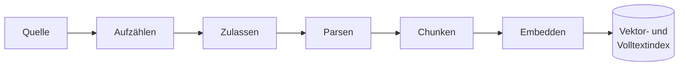
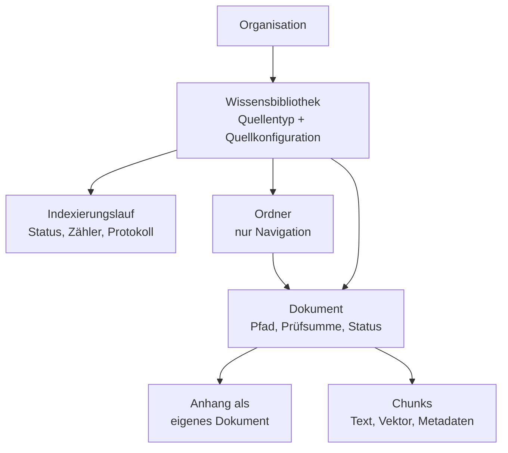
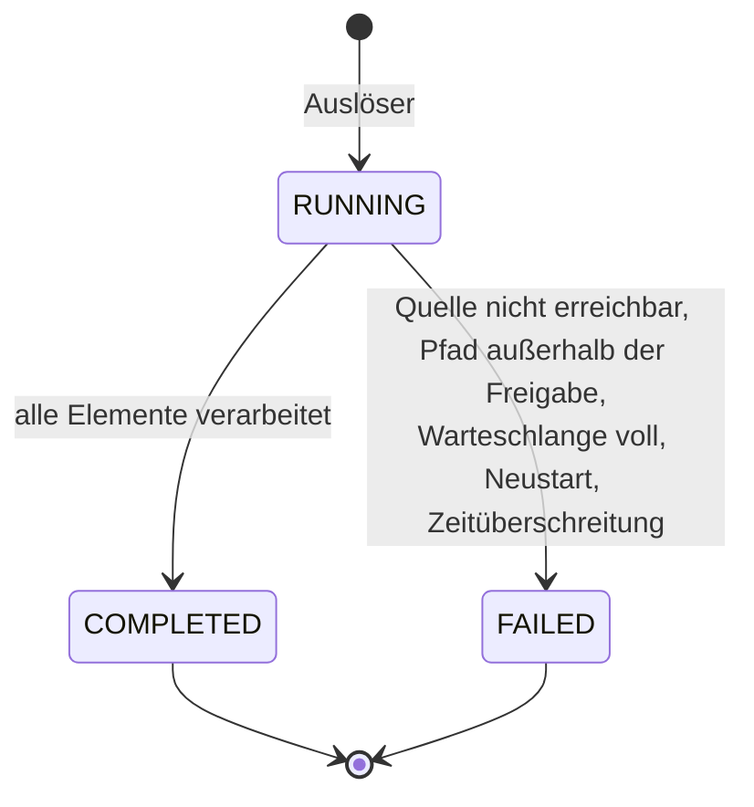
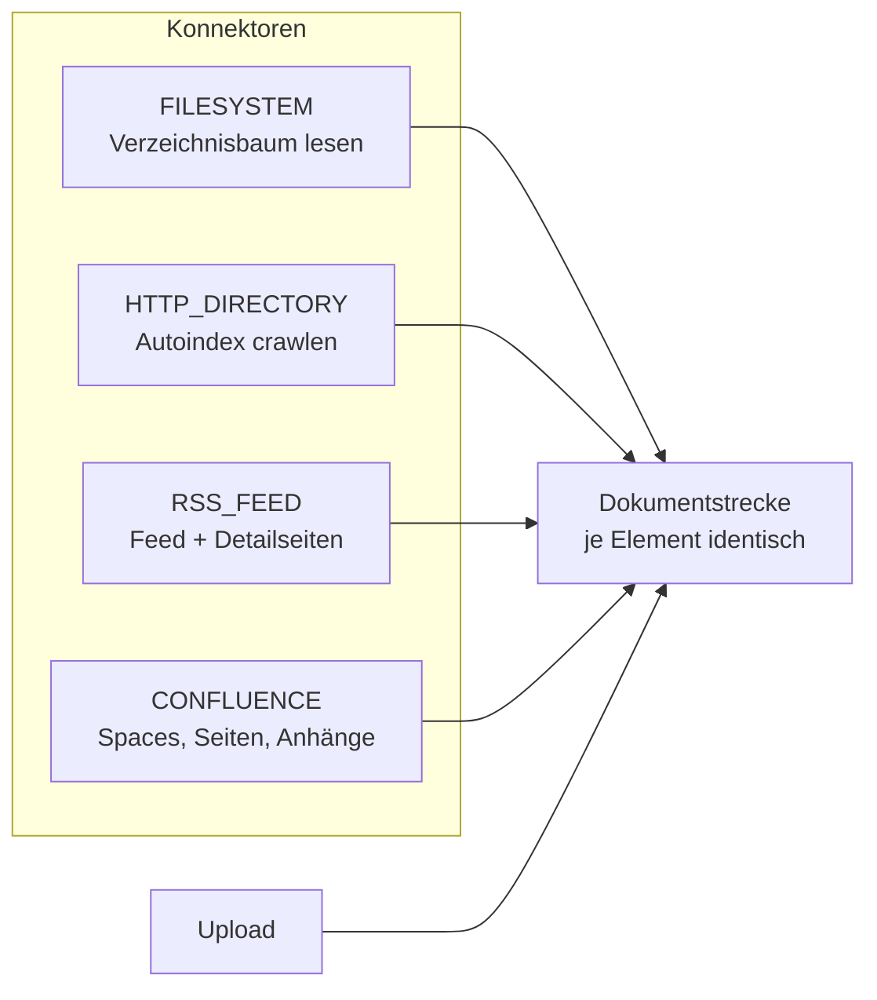
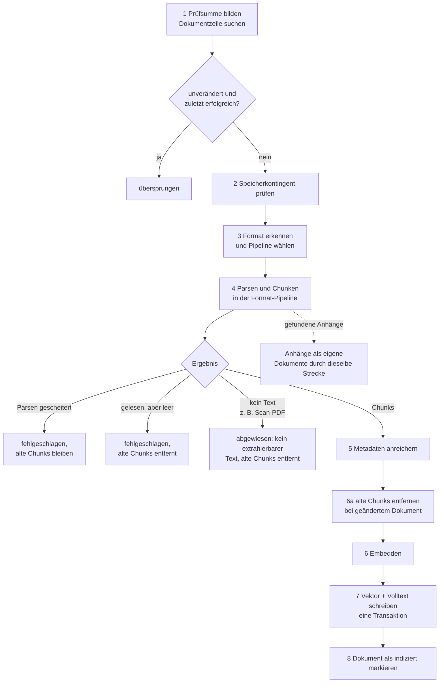
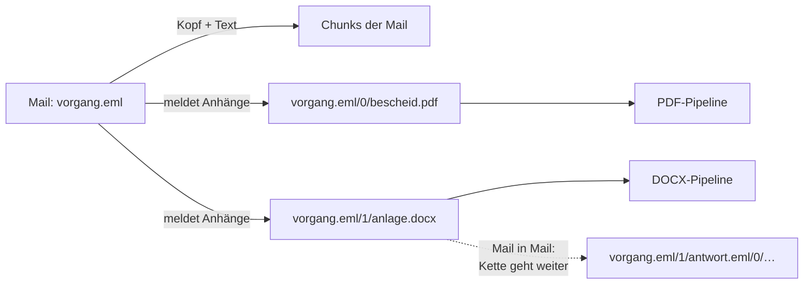
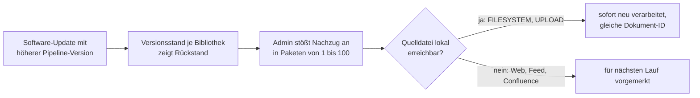

# Indexierung: Vom Dokument zum durchsuchbaren Index

> **Entwurf.** Dieses Kapitel beschreibt die Aufnahmestrecke (Ingestion-Pipeline) konzeptionell,
> von der Übersicht bis zu den einzelnen Verarbeitungsschritten. Die Konnektoren je Quellentyp
> und die Format-Pipelines je Dokumenttyp bekommen eigene Kapitel; hier werden sie nur als
> Übergabepunkte beschrieben.

## 1. Überblick in einem Bild

OPAA beantwortet Fragen aus Dokumenten, die zuvor in einen Index aufgenommen wurden. „Index"
bedeutet hier zweierlei: eine **Vektorablage**, in der Textstücke als Zahlenvektoren liegen und
über Bedeutungsähnlichkeit gefunden werden, und ein **Volltextindex**, der exakte Wörter,
Aktenzeichen und Paragrafen trifft. Beide werden im selben Arbeitsgang befüllt.

Der Weg dorthin ist für jedes Dokument gleich, unabhängig davon, woher es kommt und welches
Format es hat:

| Schritt | Frage, die er beantwortet |
|---|---|
| Aufzählen | Welche Dateien gibt es in der Quelle gerade? |
| Zulassen | Ist das ein Format, das OPAA verarbeiten kann? |
| Parsen | Welcher Text steckt in der Datei, und welche Struktur hat er? |
| Chunken | In welche Stücke wird der Text zerlegt, damit die Suche sie einzeln treffen kann? |
| Embedden | Wie sieht jedes Stück als Vektor aus? |
| Indexieren | Wo liegt das Stück, und mit welchen Metadaten ist es wiederfindbar? |

Zwei Dinge sind aus Betriebssicht wichtig, bevor es ins Detail geht:

- **Alles läuft im Backend-Prozess.** Es gibt keine separate Worker-Komponente. Die Pipeline
  ruft nur nach außen, um Einbettungen zu berechnen (Embedding-Modell) und um Dateien aus der
  Quelle zu lesen.
- **Die Datenbank ist die einzige Wahrheit.** Alles, was die Pipeline erzeugt, liegt in
  PostgreSQL: Dokumentzeilen, Chunks samt Vektoren, Volltext, Laufprotokolle. Ein Backup der
  Datenbank ist ein Backup des Index.

## 2. Bibliothek, Quelle, Lauf, Dokument

Vier Begriffe tragen das ganze Kapitel.

Eine **Wissensbibliothek** ist die Verwaltungseinheit. Sie gehört zu einer Organisation, trägt
Berechtigungen und genau **eine Quelle**. Der Typ der Quelle entscheidet, wie Dokumente in die
Bibliothek gelangen:

| Quellentyp | Wie Dokumente hereinkommen | Lauf-basiert? |
|---|---|---|
| `UPLOAD` | Eine Person lädt Dateien über die Oberfläche hoch | nein, jede Datei wird sofort einzeln verarbeitet |
| `FILESYSTEM` | Ein Verzeichnis auf dem Server bzw. ein eingebundenes Netzlaufwerk wird gelesen | ja |
| `HTTP_DIRECTORY` | Ein Webverzeichnis (Apache-Autoindex) wird gecrawlt | ja |
| `RSS_FEED` | Ein Feed und die verlinkten Detailseiten werden gelesen | ja |
| `CONFLUENCE` | Die Seiten und Anhänge ausgewählter Spaces einer Confluence-Instanz (Cloud oder Data Center) werden über deren API gelesen | ja, in zwei Betriebsarten |

Ein **Indexierungslauf** ist ein Durchgang über die Quelle einer lauf-basierten Bibliothek. Er
hat einen Start, ein Ende, einen Status, Zähler, ein Protokoll und eine **Betriebsart**: Ein
*vollständig auflistender* Lauf sieht die ganze Quelle und darf am Ende Verschwundenes entfernen;
ein *ergänzender* Lauf sieht nur ein Fenster (die jüngsten Feed-Einträge, die seit dem letzten Lauf
geänderten Seiten) und entfernt nie etwas wegen Abwesenheit. Welche Betriebsarten ein Quellentyp
kennt, legt sein Konnektor fest (Abschnitt 4). Uploads haben keinen Lauf: die Datei wird
verarbeitet, das Ergebnis steht am Dokument.

Ein **Dokument** ist eine Zeile in der Dokumenttabelle, eindeutig über das Paar aus Bibliothek
und Quellpfad. Es trägt Prüfsumme, Status, Chunk-Anzahl und Fehlermeldung. Steckt in einem
Dokument ein weiteres, etwa ein Anhang in einer E-Mail oder eine verlinkte Anlage auf einer
Feed-Seite, wird dieses zu einem eigenen Dokument mit Verweis auf sein Elterndokument (siehe
Abschnitt 6).

Ein **Ordner** gliedert die Dokumente einer Bibliothek für die Navigation. Ordner sind reine
Ablagestruktur: Sie sind keine Rechtegrenze, Berechtigungen hängen immer an der Bibliothek, und
die Suche kennt keine Ordner, sie durchsucht stets den ganzen Bestand und zeigt zum Treffer den
Ordnerpfad an. Wer Ordner anlegt, hängt vom Quellentyp ab:

| Quellentyp | Woher die Ordner kommen | Bearbeitbar? |
|---|---|---|
| `UPLOAD` | Nutzende legen sie an, auch leer, benennen sie um und löschen sie. Ein per Drag & Drop hochgeladener Ordner bringt seine Unterstruktur mit. | ja |
| `FILESYSTEM` | Der Lauf spiegelt die Verzeichnisstruktur der Quelle. Ordner entstehen nur entlang gefundener Dateien; ein Verzeichnis, das keine Dokumente mehr hält, verschwindet am Ende des Laufs. | nein, die Quelle ist führend |
| `HTTP_DIRECTORY` | Der Lauf spiegelt den gecrawlten Verzeichnisbaum: der URL-Pfad unterhalb der Start-URL, je Segment prozentdekodiert. Wie beim Dateisystem entstehen Ordner nur entlang gefundener Dateien; aufgeräumt wird nur nach einem vollständigen Crawl. | nein, die Quelle ist führend |
| `RSS_FEED` | keine Ordner; ein Feed hat keine Struktur | entfällt |
| `CONFLUENCE` | keine Ordner. Space und Gliederungspfad einer Seite stehen am Dokument und erscheinen in Zitat, Protokoll und Chunk-Kontext, nicht als Ordner. | entfällt |

Das Löschen eines Ordners in einer Upload-Bibliothek löscht die enthaltenen Dokumente samt
Chunks und Dateien, nach einer Bestätigung, die deren Anzahl nennt.

## 3. Wie ein Lauf entsteht und endet

### 3.1 Auslöser

| Auslöser | Beschreibung |
|---|---|
| **Manuell** | „Jetzt indizieren" an der Bibliothek, in der Betriebsart, die der Konnektor für den Zustand der Bibliothek vorsieht. Genügt die Rolle EDITOR an der Bibliothek. Bei Confluence gibt es zusätzlich „Vollabgleich starten". |
| **Zeitplan** | Je Bibliothek einstellbar, Details unten. |
| **Webhook** | Nur Confluence: Die Instanz meldet geänderte Seiten, OPAA holt wenige Sekunden später genau diese Seiten in einem kurzen Lauf „per Webhook". Ersetzt weder Zeitplan noch Vollabgleich. |
| **Upload** | Kein Lauf. Jede Datei geht sofort einzeln durch die Dokumentstrecke, auf einem eigenen Thread-Pool, damit ein Upload nie hinter einem langen Verzeichnislauf wartet. |
| **Nachzug (Admin)** | Kein regulärer Lauf. Ein Systemadministrator stößt die Neuverarbeitung von Dokumenten an, die mit einer älteren Pipeline-Version erzeugt wurden (Abschnitt 9), oder den Bestandslauf der Kernfelder (Kapitel [Metadaten](metadaten.md)). |

**Zeitplan je Bibliothek.** Jede lauf-basierte Bibliothek kann einen Zeitplan tragen; für
Upload-Bibliotheken wird er abgewiesen. Verwaltende setzen ihn in der Bibliotheksansicht:

| Stufe | Einstellungen |
|---|---|
| aus | keine |
| stündlich | keine, jeweils zur vollen Stunde |
| täglich | Uhrzeit |
| wöchentlich | Wochentag und Uhrzeit |

Die Uhrzeit gilt in der Zeitzone des Servers. Freie Cron-Ausdrücke gibt es in der Oberfläche
bewusst nicht. Ein minütlicher Takt im Backend prüft, welche Bibliotheken seit dem letzten Takt
fällig geworden sind. Daraus folgen drei Regeln:

- **Verpasste Termine werden nicht nachgeholt.** War das Backend zum Termin nicht in Betrieb,
  läuft die Bibliothek erst zum nächsten Termin wieder. Wer nach einer längeren Wartung einen
  aktuellen Stand braucht, stößt manuell an.
- **Ein fälliger Termin trifft auf einen laufenden Lauf:** Es entsteht kein zweiter Lauf,
  sondern der Protokolleintrag „Geplanter Lauf übersprungen: Indizierung läuft bereits" am
  laufenden. Ein Erstlauf, der länger dauert als das Intervall, verschluckt so die Termine bis
  zu seinem Ende.
- **Ein fehlgeschlagener geplanter Lauf schaltet den Zeitplan nicht ab.** Scheitern zwei
  geplante Läufe hintereinander, zeigt die Bibliothek ein Warnbanner; manuelle Läufe zählen dabei
  nicht mit.

Welche Stufe sinnvoll ist, hängt von der Quelle ab. Ein Feed kostet unverändert nur eine
Anfrage je Lauf und verträgt stündlich; ein großes Netzlaufwerk liest bei jedem Lauf alle Dateien
und ist eher täglich oder wöchentlich fällig. Eine Confluence-Bibliothek läuft täglich inkrementell
und nach ihrem eigenen Rhythmus (Standard sieben Tage, je Bibliothek im Zeitplan-Dialog
einstellbar) als Vollabgleich.

### 3.2 Zustände eines Laufs

Ein Lauf kennt drei Zustände und kehrt aus einem Endzustand nie zurück:

Pro Bibliothek gibt es **höchstens einen laufenden Lauf**. Das sichert ein eindeutiger Index in
der Datenbank, nicht eine Prüfung im Anwendungscode. Wird eine Bibliothek fällig, während ihr
Lauf noch läuft, entsteht kein zweiter Lauf, sondern ein Protokolleintrag „Zeitplan
übersprungen" am laufenden.

Ein einzelnes Dokument, das nicht verarbeitet werden kann, bricht den Lauf **nicht** ab. Es
wird gezählt, protokolliert und übersprungen. `FAILED` bedeutet, dass der Lauf als Ganzes nicht
zu Ende geführt werden konnte.

Ein Lauf kann `COMPLETED` und trotzdem **unvollständig** sein: Ein Confluence-Lauf, der sein
Anfragebudget verbraucht hat, endet geordnet mit dem Kennzeichen „unvollständig, wird fortgesetzt";
der nächste Lauf setzt dort an. Ein solcher Lauf entfernt nichts.

### 3.3 Wiederanlauf nach Störungen

Weil ein hängender Lauf seine Bibliothek dauerhaft blockieren würde, gibt es zwei Aufräumer:

- **Beim Start des Backends** werden alle Läufe, die noch als laufend markiert sind, mit der
  Meldung „Durch Neustart abgebrochen" beendet. Das setzt voraus, dass genau eine
  Backend-Instanz läuft (siehe Abschnitt 10).
- **Alle 15 Minuten** werden Läufe beendet, die länger als die konfigurierte Frist (Standard
  vier Stunden) keinen Fortschritt gemeldet haben. Maßgeblich ist der letzte Fortschritt, nicht
  der Start: ein großer Erstlauf darf länger als vier Stunden dauern, solange er arbeitet.

Ein abgebrochener Lauf lässt den bisherigen Bestand weitgehend stehen. Dokumente, die der Lauf
bereits fertig verarbeitet hat, bleiben indiziert; Dokumente, die er noch nicht erreicht hat,
bleiben auf dem alten Stand. Nur das eine Dokument, das gerade in Arbeit war, kann ohne Chunks
zurückbleiben, und auch das nur noch, wenn der Abbruch genau zwischen dem Entfernen der alten
Chunks und dem Schreiben der neuen fiel, also im Zeitfenster des Embedding-Aufrufs (Abschnitt 5,
Schritt 6a). Es steht dann nicht auf „indiziert" und
wird im nächsten Lauf erneut verarbeitet, unabhängig von der Prüfsumme.

## 4. Die Quellen: der Übergabepunkt an die Konnektoren

Jeder lauf-basierte Quellentyp hat einen eigenen **Konnektor** (im Code: Executor). Der
Konnektor kennt die Eigenheiten seiner Quelle, die Dokumentstrecke dahinter kennt sie nicht.
Was ein Konnektor liefern muss, ist für alle gleich:

1. eine **Aufzählung** der aktuell vorhandenen Elemente (Dateien, URLs, Feed-Einträge, Seiten)
   samt der Aussage, ob sie **vollständig** ist. Nur eine vollständige Aufzählung darf am Ende als
   Grundlage dienen, um verschwundene Dokumente zu erkennen (Abschnitt 7),
2. für jedes Element den **Inhalt** als Datei oder als bereits extrahierten Text,
3. die Erklärung seiner **Betriebsarten**: welche es gibt und ob sie vollständig auflisten oder
   nur ergänzen.

| Konnektor | Betriebsarten | Löscht durch Abwesenheit |
|---|---|---|
| FILESYSTEM | vollständig | ja, nach vollständigem Lauf |
| HTTP_DIRECTORY | vollständig | ja, wenn der Crawl weder abgeschnitten noch unvollständig war |
| RSS_FEED | ergänzend | nie |
| CONFLUENCE | Vollabgleich (vollständig), inkrementell (ergänzend) | nur der Vollabgleich, und nur bei vollständiger Auflistung aller Spaces |

Zwei Dinge liegen in der Verantwortung des Konnektors, bevor die Dokumentstrecke überhaupt
beginnt:

- **Schutz der Umgebung.** Jeder Quellentyp bringt eigene Risiken mit: ein Dateisystemkonnektor
  könnte beliebige Serverpfade lesen, ein Netzkonnektor könnte auf interne Adressen umgeleitet
  werden oder unbegrenzt große Antworten laden. Jeder Konnektor hat deshalb eigene
  Freigabe- und Grenzmechanismen, die der Betrieb konfiguriert. Ein Verstoß beendet den Lauf
  oder das betroffene Element mit einem Protokolleintrag, nie mit einem stillen Weiterlaufen.
- **Früherkennung von Unverändertem.** Je nach Quelle kann der Konnektor schon aus der
  Aufzählung erkennen, dass sich ein Element nicht geändert hat, etwa über ein Änderungsdatum
  oder eine bedingte HTTP-Anfrage, und sich den Download sparen. Das ist eine Optimierung; die
  verbindliche Entscheidung trifft immer die Prüfsumme in der Dokumentstrecke.

Alles Übrige ist nicht Sache des Konnektors, sondern eines **gemeinsamen Laufrahmens**, in dem
jeder Konnektor läuft: das Anlegen von Zählern und Protokoll, die Prüfung der Betriebsart, die
Zuordnung jedes Elementergebnisses zu Zähler und Protokolleintrag (Abschnitt 8.1), die Buchführung
über Anhänge, die Bereinigung verschwundener Dokumente nach vollständiger Aufzählung (Abschnitt 7),
die Kennzahlen des Laufs (Abschnitt 8.3) und die Übersetzung von Abbrüchen in eine verständliche
Fehlermeldung. Deshalb lauten die Meldungen eines Laufabbruchs bei allen Konnektoren gleich, etwa
„Lauf unterbrochen" oder „Die Bibliothek wurde während des Laufs gelöscht.", und ein neuer Konnektor bringt nur die drei oben
genannten Dinge mit.

> Welche Mechanismen und Grenzwerte das je Quelle konkret sind, steht in den Kapiteln
> [Verzeichnis im Dateisystem](konnektor-filesystem.md),
> [Webverzeichnis](konnektor-http-directory.md), [Feed](konnektor-rss-feed.md) und
> [Confluence](konnektor-confluence.md).

## 5. Die Dokumentstrecke: was mit jedem Element passiert

Das ist der Kern. Jedes Element, gleich welcher Herkunft, durchläuft diese Schritte in dieser
Reihenfolge:

Schritt 6a steht bewusst im Bild: Die alten Chunks werden erst entfernt, wenn die neue Fassung
geparst und gechunkt vorliegt, nicht schon vor dem Parsen.

### Schritt 1: Prüfsumme und Identität

Über den Inhalt wird eine SHA-256-Prüfsumme gebildet. Dann wird die Dokumentzeile über das Paar
aus Bibliothek und Quellpfad gesucht. Ist die Prüfsumme unverändert und stand das Dokument zuletzt
auf „indiziert", ist der Fall erledigt: **übersprungen**, keine Chunks angefasst. Das ist der
Normalfall in jedem Folgelauf und der Grund, warum Folgeläufe schnell sind. Was die Quelle sonst
über das Element sagt — Titel, Ort in der Quelle, Änderungsmarke, Ordner — wird dabei trotzdem auf
den aktuellen Stand gebracht: So überspringt der nächste Lauf das Element schon vor dem Abruf, und
Dokumentliste wie Zitat zeigen den aktuellen Titel.

Hat sich der Inhalt geändert, bleibt die Dokumentzeile mit ihrer ID bestehen. Nur die Chunks
werden ausgetauscht. Dadurch überleben Verweise auf das Dokument, etwa aus Chat-Zitaten oder von
Anhängen, eine Aktualisierung.

**Wann die alten Chunks verschwinden:** erst, wenn die neue Fassung tatsächlich geparst und
gechunkt vorliegt (Schritt 6a im Bild). Scheitert das Parsen der neuen Fassung, bleibt der alte Stand durchsuchbar; das
Dokument steht auf „fehlgeschlagen", behält aber seine Chunks und seine bisherige Chunk-Anzahl.
Nur eine neue Fassung, die gelesen werden konnte und leer oder ohne extrahierbaren Text ist,
entfernt die alten Chunks — dann ist „leer" eine Aussage über den neuen Inhalt, und die
Chunk-Anzahl der Dokumentzeile steht auf 0. An der Chunk-Anzahl einer fehlgeschlagenen
Dokumentzeile ist damit ablesbar, ob sie noch Chunks hat oder nicht — maßgeblich ist, ob gelöscht
wurde, nicht der Grund des Fehlschlags: Auch ein Fehler beim Embedden oder Schreiben, also nach dem
Löschen, hinterlässt eine 0.

### Schritt 2: Speicherkontingent

Jede Bibliothek hat ein Kontingent. Geprüft wird das **Delta**: Bei einer geänderten Datei
zählt nur die Größendifferenz, nicht die volle Größe. Überschreitet das Element das Kontingent,
wird es mit dem Ergebnis „Kontingent überschritten" abgelehnt.

### Schritt 3: Format erkennen und Pipeline wählen

Die Formaterkennung schaut in den **Inhalt** (Magic Bytes), nicht auf die Dateiendung. Eine als
`.pdf` benannte Word-Datei wird als Word-Datei verarbeitet. Stimmen Endung und Inhalt nicht
überein, wird das Dokument trotzdem indiziert, aber ein Protokolleintrag „Formatabweichung"
gesetzt, damit der Fall auffällt.

Als Inhaltstyp des Dokuments wird der kanonische Medientyp des erkannten Formats gespeichert (etwa
`text/markdown` für Markdown, auch wenn die Byte-Erkennung nur „Text" sagt); nur ein Dokument ohne
erkanntes Format behält den roh erkannten Typ. Anhand des erkannten Formats wird eine
**Format-Pipeline** gewählt. Für jedes Format gibt es
genau eine zuständige Pipeline; für alles Unbekannte oder Strukturlose gibt es eine
Auffang-Pipeline auf Basis von Apache Tika. Zwei Inhalte waren nie eine Datei und überspringen die
Formaterkennung: Der Text einer Feed-Detailseite geht direkt an die Auffang-Pipeline, der Körper
einer Confluence-Seite direkt an die [Confluence-Pipeline](format-confluence.md). Zugelassen sind grob: Text und Markdown, PDF, die
Office-Formate von Microsoft und OpenDocument, Tabellen, HTML und E-Mails. Welche Endungen das
genau sind, welche Pipeline sie bedient und welche Formate bewusst nicht aufgenommen werden,
steht in der [Formatübersicht](#anhang-formatübersicht) am Ende dieses Kapitels.

### Schritt 4: Parsen und Chunken

Beide Schritte liegen **innerhalb** der Format-Pipeline, weil sie zusammengehören: Nur wer das
Format kennt, weiß, wo Überschriften, Tabellen, Folien oder Mail-Kopfzeilen sind, und nur dann
kann der Zuschnitt entlang dieser Struktur erfolgen.

Was alle Pipelines gemeinsam haben:

- Sie liefern eine Liste von **Chunks** mit Text und Strukturkontext, oder eines von drei
  Nicht-Ergebnissen: „Parsen gescheitert" (die Quelle war nicht lesbar — beschädigte Datei,
  abgewiesene Schutzgrenze; zählt als Fehler), „kein Inhalt" (die Quelle war lesbar und ist leer;
  zählt ebenfalls als Fehler) und „kein extrahierbarer Text" (typisch für eingescannte PDFs ohne
  Textebene, zählt als Ablehnung, nicht als Fehler). Die Unterscheidung der ersten beiden
  entscheidet, ob die alten Chunks eines geänderten Dokuments stehen bleiben (Schritt 1).
- Jeder Chunk trägt eine **Ortsangabe**, etwa „S. 3 · Abschn. Fristen › Verlängerung", die später
  im Zitat erscheint. Die Seitenzahl überlebt die Textextraktion nur, weil Seitenwechsel als
  Marker in den Text geschrieben und vor dem Embedden wieder entfernt werden.
- Jede Pipeline hat eine **Kennung und eine Versionsnummer**, die an jedem erzeugten Chunk
  gespeichert wird (Abschnitt 9).
- Die Chunk-Größen sind je Pipeline **projektseitig festgelegt**, nicht über einen
  Admin-Regler. Die konfigurierbaren Werte für Chunk-Größe und Überlappung gelten nur noch für
  die Auffang-Pipeline und strukturlose Texte. Dort wird nach Tokens geschnitten, standardmäßig
  1000 Tokens mit 100 Tokens Überlappung zum Vorgänger, damit ein Satz an der Schnittkante in
  beiden Chunks vollständig vorkommt.

> Die einzelnen Format-Pipelines, ihre Struktur-Regeln, Metadaten und Grenzwerte haben je ein
> eigenes Kapitel; die Liste steht in der [Formatübersicht](#anhang-formatübersicht).

### Schritt 5: Metadaten anreichern

Vor dem Speichern bekommt jeder Chunk seinen Rahmen: Dokument, Bibliothek, Organisation,
laufende Nummer im Dokument, Dateiname, Pipeline-Kennung und -Version, sowie die
Struktur-Metadaten aus der Pipeline (Ortsangabe, bei Mails die Kopfdaten, bei Confluence-Seiten
Space und Gliederungspfad). Diese Metadaten sind das, worüber die Suche später filtert, etwa auf die
Bibliotheken, die eine Person sehen darf.

An derselben Stelle werden die **Kernfelder** des Dokuments ermittelt (Titel, Dokumentart,
Datum/Stand) und die filterbaren davon an jeden Chunk geschrieben. Woher sie kommen und was sie
bewirken, steht im Kapitel [Metadaten](metadaten.md).

Zusätzlich wird für das Embedding, nicht für den gespeicherten Text, ein **Kontexttitel**
vorangestellt: bei Dateien aus dem Dateinamen abgeleitet, bei Feed-Einträgen die Überschrift, bei
Confluence-Seiten der Ort der Seite im Space. Ein Chunk aus
`2024-03_Dienstanweisung_Homeoffice.pdf` wird als „[Dienstanweisung Homeoffice] …" eingebettet,
sofern das Dokument in mehr als einen Chunk zerfällt. Der Präfix wirkt nur auf der Vektorseite: Der Volltextindex enthält den
Chunk-Text und die Kennungen, nicht den Dateinamen. Er gleicht aus, dass ein Detail-Chunk (eine
Gebührenzeile, ein einzelner Paragraf) im Embedding sonst kaum Signal trägt, wovon das Dokument
handelt. Das Zitat bleibt unverändert.

### Schritt 6: Embedden

Die Chunks gehen in Paketen (Standard 50) an das konfigurierte Embedding-Modell. Bei großen
Dokumenten laufen mehrere Pakete parallel (Standard drei). Dieser Schritt ist der einzige
Netzaufruf der Strecke außerhalb der Quelle und bewusst **außerhalb jeder
Datenbanktransaktion**, damit keine Datenbankverbindung während eines Modell-Roundtrips
blockiert bleibt.

### Schritt 7: Vektor und Volltext schreiben

In **einer** Transaktion werden die Chunks mit ihren Vektoren in die Vektortabelle und
gleichzeitig in den Volltextindex geschrieben. Der Volltext wird mit deutscher Wortstammbildung
aufgebaut und um erkannte **Kennungen** ergänzt, die unzerlegt und mit hohem Gewicht abgelegt
werden. So trifft die Suche „§ 12 Abs. 3" exakt und nicht nur ungefähr. Die Liste der
Kennungen ist bewusst geschlossen; eine falsch erkannte Kennung erzeugt Rauschen, eine nicht
erkannte einen verpassten Treffer:

| Kennung | Beispiele | Was gespeichert wird |
|---|---|---|
| Paragrafen | `§ 34`, `§§ 34, 35 BauGB`, `§ 3 Abs. 2 VGS` | je Nummer die nackte Form, dazu die Form mit Absatz und mit Gesetzeskürzel |
| Aktenzeichen nach Gerichtsmuster | `4 K 1023/24.NW`, `12 A 45/2023` | die ganze Kennung |
| Aktenzeichen mit Schlüsselwort | `Az. 12/2024`, `Aktenzeichen: 45-2/2023` | die Kennung hinter dem Schlüsselwort |
| Strukturierte Verwaltungsnummern | `BAU-DA-2/2024`, `KAE-07`, `SOZ-DA-1/2023` | die ganze Kennung, auch ohne Schlüsselwort |
| Drucksachen- und Erlassnummern | `Drucksache 19/1234`, `Drs. 19/1234`, `Erlass Nr. 12/2024` | die Nummer; ein bloßes `Nr. 5` gilt als Aufzählung, nicht als Kennung |
| E-Mail-Adressen | `max.mustermann@example.org` | die Adresse; Umlaute in Adressen werden nicht erfasst |

Eine Kennung gilt nur als solche, wenn sie mindestens eine Ziffer und ein Trennzeichen enthält.
„Aktenzeichen der Satzung" erzeugt deshalb nichts. Dieselben Muster laufen auf der Frageseite,
sodass ein Dokument, das „Dienstanweisung mit dem Aktenzeichen BAU-DA-2/2024" schreibt, und eine
Frage nach „BAU-DA-2/2024" dieselbe Kennung erzeugen. Je Chunk werden höchstens 64 Kennungen
gespeichert.

### Schritt 8: Dokument markieren

Zuletzt wird die Dokumentzeile auf „indiziert" gesetzt, mit Chunk-Anzahl, Prüfsumme und
Zeitstempel. Das geschieht als bedingte Aktualisierung: Wurde das Dokument währenddessen
gelöscht, werden die gerade geschriebenen Chunks wieder entfernt, statt eine Leiche
zurückzulassen.

> **Restfenster:** Das Entfernen der alten Chunks (Schritt 6a) und das Schreiben der neuen
> (Schritt 7) liegen nicht in einer gemeinsamen Transaktion — dazwischen liegt der
> Embedding-Aufruf. Stürzt der Prozess genau darin ab, hat das Dokument kurzzeitig keine Chunks,
> während seine Zeile noch „indiziert" mit der alten Chunk-Anzahl zeigt. Der nächste Lauf
> verarbeitet es erneut (Abschnitt 3.3). Alte und neue Chunks liegen nie gleichzeitig vor.

## 6. Anhänge: ein Dokument in einem Dokument

Manche Dokumente enthalten oder verlinken weitere Dokumente, und die sind oft der eigentliche
Inhalt. Anhänge entstehen auf zwei Arten, und beide münden in denselben Mechanismus:

- **Aus dem Format:** Ein Dokument enthält andere Dokumente, wie eine E-Mail ihre Dateianhänge.
  Das ist unabhängig von der Quelle; die Format-Pipeline meldet die Anhänge, gleich ob die Mail
  hochgeladen, aus einem Verzeichnis gelesen oder von einem Server geladen wurde.
- **Aus der Quelle:** Ein Quellsystem verknüpft mit einem Element weitere Dateien, wie eine
  Feed-Detailseite ihre verlinkten Anlagen oder eine Confluence-Seite ihre angehängten Dateien.
  Hier meldet der Konnektor die Anhänge; bei Confluence trägt jeder Anhang Space und
  Gliederungspfad seiner Seite.

OPAA behandelt jeden Anhang als **eigenes Dokument**: mit eigener Prüfsumme, eigener Pipeline,
eigener Chunk-Anzahl und einem Verweis auf das Elterndokument. Das Beispiel zeigt eine Mail:

Konsequenzen für den Betrieb:

- Der Quellpfad eines Anhangs enthält den Elternpfad und seine laufende Nummer im Elternteil.
  Zwei gleichnamige Anhänge desselben Elterndokuments kollidieren nicht.
- Anhänge können selbst Anhänge haben (Mail in Mail, eine Mail als Anlage einer Feed-Seite).
  Die Verschachtelungstiefe ist begrenzt, Standard fünf Ebenen. Was darüber liegt, wird
  übersprungen und protokolliert.
- Das Kontingent zählt Anhangsbytes nur einmal: Enthält ein Dokument seine Anhänge physisch,
  wie eine Mail, wird seine eigene Größe auf den Anteil ohne Anhänge reduziert.
- Wer Anhänge findet, **meldet** sie nur; verarbeitet werden sie von der Dokumentstrecke über
  dieselben Schritte wie jedes andere Dokument. Damit gelten Kontingent, Formatzulassung und
  Protokoll auch für Anhänge.
- Wird ein Elterndokument neu verarbeitet und ein früher bekannter Anhang nicht mehr gemeldet,
  gilt er als entfernt und wird gelöscht. Wird das Elterndokument als unverändert übersprungen,
  bleiben seine Anhänge unangetastet.

Die Dokumentstrecke weiß nicht, woher ein Anhang stammt. Jeder Konnektor, der Anhänge
liefert, und jede Format-Pipeline, die welche findet, nutzt denselben Weg; die Grenzwerte für
Anzahl und Größe je Elternteil setzt die jeweilige Quelle bzw. das Format, ersatzweise gelten
`opaa.indexing.attachments.max-per-parent`/`max-size-bytes`; die Tiefe ist allgemein
(`opaa.indexing.attachments.max-depth`).

## 7. Änderungen und Löschungen erkennen

| Situation in der Quelle | Verhalten |
|---|---|
| Datei unverändert | übersprungen, Chunks bleiben |
| Datei geändert | alte Chunks entfernt, neue erzeugt, Dokument-ID bleibt |
| Datei umbenannt oder verschoben | neuer Pfad ist ein neues Dokument, alter Pfad gilt als entfernt |
| Datei verschwunden | Dokument samt Chunks wird am Ende eines **vollständig auflistenden, erfolgreichen** Laufs entfernt |
| Quelle meldet die Löschung selbst (Confluence: Seite im Papierkorb, Seite in einen anderen Space verschoben) | Dokument samt Anhängen wird sofort entfernt, in jeder Betriebsart |
| Quelle nicht erreichbar, Teil der Quelle nicht lesbar | Lauf `FAILED` bzw. Aufzählung unvollständig, **nichts** wird entfernt |

Die letzte Zeile ist die wichtigste Sicherung: Ein Lauf, der null Dateien sieht, kann eine leere
Quelle oder ein nicht eingebundenes Netzlaufwerk bedeuten. Deshalb löscht ein leeres Ergebnis nie,
und die Bereinigung läuft nur, wenn der Konnektor die Quelle vollständig aufgezählt hat. Ein
abgebrochener Crawl bereinigt nicht; ein Confluence-Space, den das Dienstkonto nicht lesen darf,
lässt den ganzen Bestand stehen. Ein entzogenes Recht ist kein Löschbefund.

Auch abgewiesene Dateien, etwa nicht unterstützte Formate, gelten dabei als „gesehen". Unlesbar
ist nicht dasselbe wie verschwunden.

Die Bereinigung wirkt je Bibliothek und Quellentyp und nur in vollständig auflistenden
Betriebsarten (Abschnitt 4). Feeds bereinigen **nie** durch Abwesenheit, weil ein Feed nur die
jüngsten Einträge zeigt und ältere Meldungen nicht verschwunden sind, nur nicht mehr gelistet; ein
inkrementeller Confluence-Lauf ebenso wenig, weil er nur Geändertes sieht.

Beim Löschen werden Anhänge vor ihren Elterndokumenten entfernt, damit die Verweise in der
Datenbank konsistent bleiben.

## 8. Fehlerbehandlung und Protokoll

### 8.1 Ergebnis je Element

Jedes Element endet in genau einem von fünf Ergebnissen: **verarbeitet**, **übersprungen**,
**Kontingent überschritten**, **kein extrahierbarer Text** oder **fehlgeschlagen**. Die ersten
drei Zähler eines Laufs (verarbeitet, übersprungen, fehlgeschlagen) ergeben sich daraus;
Anhänge erhöhen zusätzlich den Zähler der indizierten Dokumente.

### 8.2 Laufprotokoll

Jeder Lauf führt eine Ereignisliste mit einer deutschen, für Menschen lesbaren Begründung je
Eintrag. Die Kategorien:

| Kategorie | Bedeutung |
|---|---|
| abgewiesen | die Quelle hat das Element zurückgewiesen (Bot-Schutz, HTTP 403/429, fremder Host) |
| nicht erreichbar | Verbindungsfehler oder Zeitüberschreitung |
| Format nicht unterstützt | Datei- oder Inhaltstyp wird nicht indiziert |
| Formatabweichung | indiziert, aber Endung und Inhalt passen nicht zusammen |
| Allowlist | Quellpfad liegt außerhalb der Freigabe |
| Zeitplan übersprungen | fällig, aber ein Lauf lief bereits |
| in der Quelle entfernt | Dokument wurde gelöscht, wegen Abwesenheit oder auf Befund der Quelle |
| Ratenbegrenzung | die Quelle hat den Lauf gebremst (HTTP 429); eine Zeile je Lauf mit Anzahl und Wartezeit |
| Anfragebudget erschöpft | der Lauf endete geordnet unvollständig, der nächste setzt fort |
| Fehler | Verarbeitung begonnen, unerwartet gescheitert |

Drei Betriebsregeln dazu:

- Je Lauf werden **höchstens 500 Ereignisse** gespeichert. Darüber hinaus wird nur gezählt
  („… und N weitere"), damit ein Lauf mit zehntausend Abweisungen nicht am Protokoll erstickt.
- Je Bibliothek bleiben die **letzten zehn Läufe** samt Protokoll erhalten; ältere werden beim
  Start eines neuen Laufs entfernt.
- Ein Fehler beim Schreiben des Protokolls bricht den Lauf nie ab. Sonst bliebe der Lauf für
  immer auf „laufend" und die Bibliothek gesperrt.

### 8.3 Wer was sieht

Der **Laufstatus** (letzter Lauf, Zähler) ist für jede Leseberechtigung sichtbar. Das
**Protokoll** und die Fehlermeldung eines gescheiterten Laufs erfordern mindestens die Rolle
MANAGER an der Bibliothek, weil sie interne Pfade und URLs der Quellkonfiguration enthalten.

Scheitern zwei geplante Läufe hintereinander, zeigt die Bibliothek ein Warnbanner. Manuelle
Versuche zählen dafür nicht mit, damit ein Testlauf den Befund nicht überschreibt.

Jeder Lauf zeigt zusätzlich eine Kennzahlenzeile mit Anhängen (indiziert, übersprungen,
fehlgeschlagen) und Dauer. Anfragen an die Quelle und Drosselungen erscheinen nur bei Confluence,
dem einzigen Konnektor, der sie zählt. Bei Confluence kommen außerdem die Betriebsart und das
Kennzeichen „unvollständig, wird fortgesetzt" hinzu; eine unvollständige Auflistung bleibt
dauerhaft an der Bibliothek sichtbar.

Systemweit sieht ein Systemadministrator zusätzlich eine Liste der Dokumente **ohne einen
einzigen Chunk**, der typische Befund für eingescannte PDFs, sowie den Pipeline-Versionsstand je
Bibliothek (Abschnitt 9).

## 9. Pipeline-Versionen und Nachzug

Jede Format-Pipeline hat eine Versionsnummer, und jeder Chunk speichert, mit welcher Pipeline und
Version er entstanden ist. Die Version steigt nur, wenn sich der Zuschnitt oder die erzeugten
Struktur-Metadaten ändern, nie bei einer Korrektur ohne Wirkung auf den Bestand.

Damit lässt sich jederzeit beantworten, welcher Teil des Bestands nach einem Software-Update
noch mit einem älteren Verfahren im Index liegt. Der Nachzug läuft **nicht von selbst**. Ein
Systemadministrator stößt ihn über die Admin-API an; eine Oberfläche dafür gibt es noch nicht:

| Aufruf | Zweck |
|---|---|
| `GET /api/v1/admin/indexing/pipeline-versions` | Versionsstand je Bibliothek: wie viele Chunks liegen unter der aktuellen Version, ist die Bibliothek vollständig |
| `POST /api/v1/admin/indexing/pipeline-reindex` | ein Paket nachziehen; Parameter `belowVersion` (welche Version als veraltet gilt) und `batchSize` (1 bis 100, Standard 10) |
| `GET /api/v1/admin/indexing/low-chunk-documents` | Dokumente ohne Chunks, der typische Scan-Befund |

Jeder Aufruf des Nachzugs wird auditiert. Er verarbeitet ein Paket und kehrt zurück; für einen
großen Bestand wird er wiederholt aufgerufen, bis der Versionsstand keine Rückstände mehr zeigt.

Der Nachzug ist unterbrechbar und wiederaufnehmbar, weil er keine eigene Cursor-Tabelle führt:
Die Restmenge wird jedes Mal aus den Chunk-Metadaten neu abgeleitet. Alte Chunks werden erst
gelöscht, wenn die neuen vorliegen. Verwaiste Chunks ohne Dokumentzeile werden dabei mit
aufgeräumt.

Für Anhänge, die nur remote erreichbar sind, wird die ganze Elternkette vorgemerkt, weil der
Anhang nur aus der Elterndatei heraus neu extrahiert werden kann.

## 10. Betriebliche Rahmenbedingungen

### 10.1 Genau eine Backend-Instanz

Die Pipeline setzt eine **einzelne Backend-Instanz** voraus. Zeitplan,
Wiederanlauf, Thread-Pools und Fortschrittsheartbeat sind prozesslokal. Eine zweite Instanz
würde beim Start die legitimen Läufe der ersten als „durch Neustart abgebrochen" beenden.
Skalierung ist eine Frage von Hardware für diese eine Instanz, nicht von Replikaten.

### 10.2 Nebenläufigkeit

| Pool | Aufgabe | Standard |
|---|---|---|
| Lauf-Pool | ein Slot je Konnektor-Lauf; Läufe verschiedener Bibliotheken laufen parallel | 2 bis 4 Threads, 20 Wartende |
| Embedding-Pool | parallele Pakete eines großen Dokuments | 3 Threads |
| Upload-Pool | Einzeldateien aus Uploads, getrennt vom Lauf-Pool | eigene Konfiguration |

Ist der Lauf-Pool samt Warteschlange voll, wird ein neuer Lauf sofort mit `FAILED` beendet und
die Anfrage mit HTTP 503 beantwortet, statt endlos zu warten.

### 10.3 Konfiguration

Die wichtigsten Schlüssel unter `opaa.indexing.*`:

| Schlüssel | Standard | Wirkung |
|---|---|---|
| `filesystem.allowlist` | leer | freigegebene Basisverzeichnisse; leer schaltet `FILESYSTEM` ab |
| `attachments.max-depth` | 5 | Verschachtelungstiefe von Anhängen (Mail-in-Mail, Feed-Anlage) - ein Wert für jeden Konnektor |
| `attachments.max-per-parent` / `attachments.max-size-bytes` | 10 / 20 MiB | Anzahl je Elternteil und Größe eines vom Anhangsweg heruntergeladenen Anhangs für einen Konnektor ohne eigene Werte (Confluence); RSS und Mail behalten ihre eigenen |
| `http.user-agent` / `http.max-rate-limit-retries` / `http.max-retry-after` | `OPAA-Indexer/1.0` / 6 / 2m | `User-Agent` jeder Anfrage an eine fremde Quelle und die 429-Wartezeit von RSS- und Webverzeichnis-Konnektor; Confluence hat eigene 429-Werte |
| `chunk-size` / `chunk-overlap` | 1000 / 100 Tokens | nur Auffang-Pipeline und strukturlose Texte |
| `batch-size` | 50 | Chunks je Embedding-Aufruf |
| `embedding-concurrency` | 3 | parallele Embedding-Pakete je Dokument |
| `stale-job-timeout` | 4h | Frist ohne Fortschritt, bis ein Lauf als verwaist gilt |
| `thread-pool.*` | 2 / 4 / 20 | Lauf-Pool |
| `target-validation.*` | aktiv | Zieladressprüfung für Netzquellen |
| `rss.*`, `crawl.*`, `confluence.*`, `mail.*`, `tabular.*`, `odf.*` | siehe Konnektor- und Format-Kapitel | Grenzwerte je Quelle und Format |

### 10.4 Was nicht gebaut ist

- **OCR** für eingescannte Dokumente. Heute wird ein Scan erkannt und als „kein extrahierbarer
  Text" abgewiesen. Texterkennung ist als eigenes Vorhaben vorgesehen und setzt eine
  Voruntersuchung eines externen Konvertierungsdienstes (Docling) voraus.
- **Automatischer Nachzug** nach einem Pipeline-Update. Ob er selbsttätig oder auf
  Betreiberentscheidung läuft, ist bewusst offen.

Weitere Systemkonnektoren, etwa für Dokumentenmanagementsysteme, werden laufend ergänzt. Der
Rahmen dafür (eine Registrierung je Quellentyp, der gemeinsame Anhangsweg, die Löschsemantik je
Betriebsart) ist Teil dieser Pipeline und wächst nicht je Konnektor.

## 11. Weiterführende Kapitel

- Konnektoren je Quellentyp: [Verzeichnis im Dateisystem](konnektor-filesystem.md),
  [Webverzeichnis](konnektor-http-directory.md), [Feed](konnektor-rss-feed.md),
  [Confluence](konnektor-confluence.md)
- Format-Pipelines je Dokumenttyp: siehe [Formatübersicht](#anhang-formatübersicht)
- Kernfelder je Dokument, ihre Ermittlung, Pflege und Wirkung in der Suche: [Metadaten](metadaten.md)
- Installation, Umgebungsvariablen und Update-Verhalten des Index: [Deployment](deployment.md)

## Anhang: Formatübersicht

Zugelassen wird nach **Inhalt**, nicht nach Endung. Die Spalte „Zulassung" nennt, wie streng die
Inhaltsprüfung ist: *strikt* heißt fester Byte-Signatur-Abgleich; *text-tolerant* heißt, der Inhalt
muss nur als Text erkennbar sein und die Datei muss die Endung selbst tragen.

| Endung | Pipeline | Zulassung | Erkannte Struktur | Kapitel |
|---|---|---|---|---|
| `.pdf` | `pdf` | strikt | Lesezeichen-Gliederung, sonst Seiten | [PDF](format-pdf.md) |
| `.docx` | `docx` | strikt | Überschriften bis Ebene 3, Tabellen, Kopf- und Fußzeilen | [Word](format-docx.md) |
| `.doc` | `tika-fallback` | strikt | keine, Token-Fenster | [Auffang-Pipeline](format-fallback.md) |
| `.pptx` | `pptx` | strikt | eine Folie je Chunk, Titel, Notizen | [PowerPoint](format-pptx.md) |
| `.xlsx` | `tabular` | strikt | Blätter, Kopfzeile, Zeilengruppen | [Tabellen](format-tabular.md) |
| `.csv` | `tabular` | text-tolerant | Kopfzeile, Zeilengruppen | [Tabellen](format-tabular.md) |
| `.ods` | `tabular` | strikt | Blätter, Kopfzeile, Zeilengruppen | [Tabellen](format-tabular.md) |
| `.odt` | `odt` | strikt | Überschriften bis Ebene 3, Tabellen, Kopf- und Fußzeilen | [OpenDocument Text](format-odt.md) |
| `.odp` | `odp` | strikt | eine Folie je Chunk, Titel, Notizen, Masterfolie | [OpenDocument Präsentation](format-odp.md) |
| `.html` | `html` | strikt | Überschriften h1 bis h3, Hauptinhalt ohne Navigation | [HTML](format-html.md) |
| `.md` | `markdown` | text-tolerant | Überschriften bis Ebene 3, Frontmatter | [Markdown](format-markdown.md) |
| `.txt` | `tika-fallback` | text-tolerant | keine, Token-Fenster | [Auffang-Pipeline](format-fallback.md) |
| `.eml` | `email` | text-tolerant | Kopfdaten, Nachrichtentext, Thread-Segmente, Anhänge | [E-Mail](format-mail.md) |
| `.msg` | `email` | strikt | wie `.eml` | [E-Mail](format-mail.md) |
| Feed-Text | `tika-fallback` | entfällt | keine, Token-Fenster | [Auffang-Pipeline](format-fallback.md) |
| Confluence-Seite | `confluence` | entfällt | Überschriften h1 bis h3, Tabellen, Listen, Makros nach Regelwerk | [Confluence-Seite](format-confluence.md) |

### Bewusst nicht zugelassen

| Format | Grund |
|---|---|
| Eingescannte PDFs ohne Textebene | werden erkannt und mit klarer Meldung abgewiesen, statt mit null Chunks als „indiziert" zu gelten. Texterkennung (OCR) ist ein eigenes Vorhaben. |
| Bilder und Einzelscans (TIFF, PNG, JPEG) | gehören zum selben OCR-Vorhaben |
| Ältere Office-Binärformate außer `.doc` (`.xls`, `.ppt`, `.vsd`, `.pub`) | keine geeignete Leselogik; nur `.doc` wird über die Auffang-Pipeline verarbeitet |
| RTF | nie aufgenommen, kein Bedarf gemeldet |
| Archive (ZIP) | ein Container ist kein Dokument; eingebettete Dokumente laufen über den Anhangsweg, den heute Mails und Feed-Seiten nutzen |
| Fach-XML (LegalDocML.de, XJustiz, XÖV) | lohnt sich erst mit einem konkreten Quellanschluss; ein Parser ohne Bestand kann sich nicht bewähren |
| Generisches XML und JSON | wären nur als Klartext verarbeitbar und würden die Textzulassung aufweichen |
| Quellcode | für einen Verwaltungsbestand ohne Nutzungsfall |
| Flat-XML-OpenDocument (`.fodt`, `.fodp`) | die OpenDocument-Leser setzen den ZIP-Container voraus |

Abgewiesene Dateien werden gezählt und im Laufprotokoll namentlich als „Format nicht unterstützt"
geführt; bei der Löscherkennung gelten sie als vorhanden.
