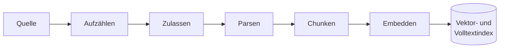
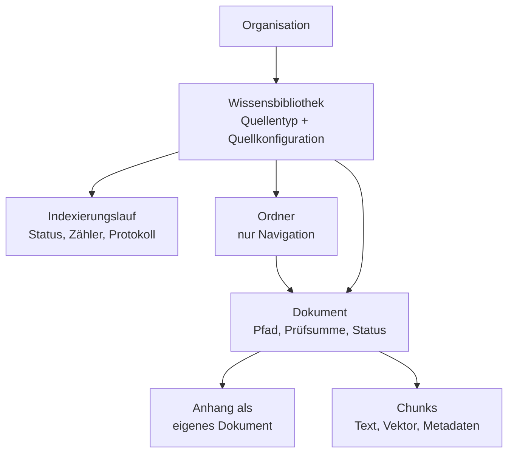
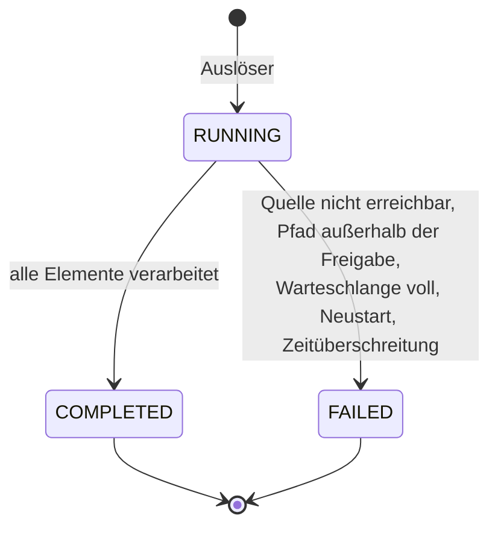
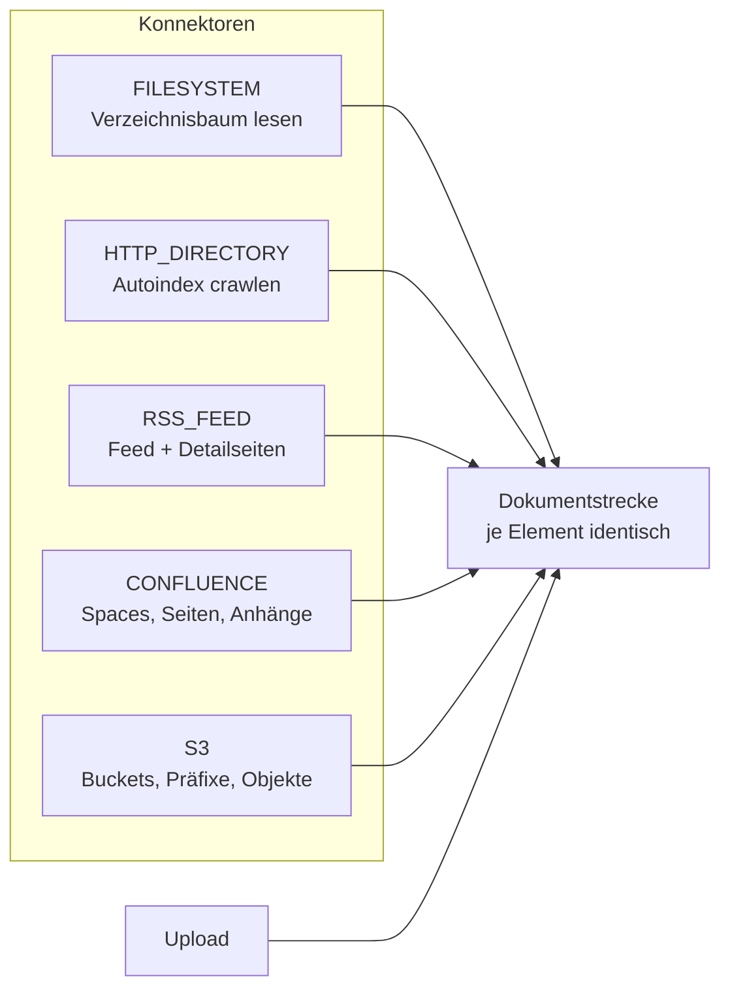
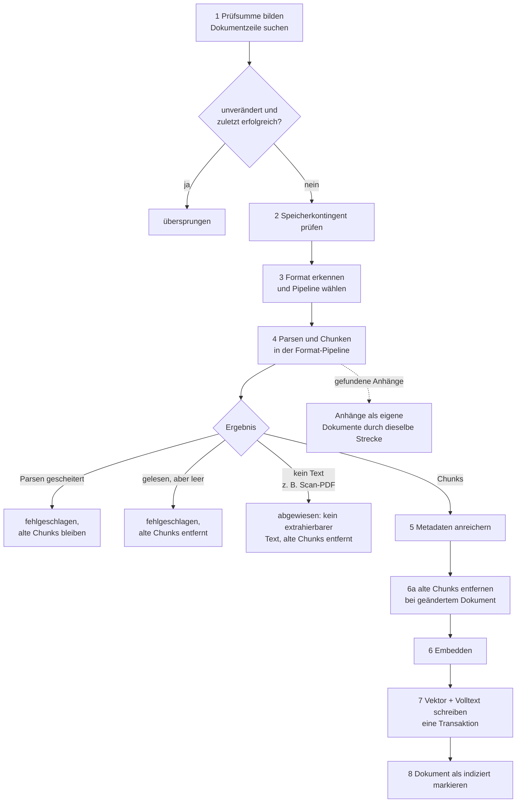
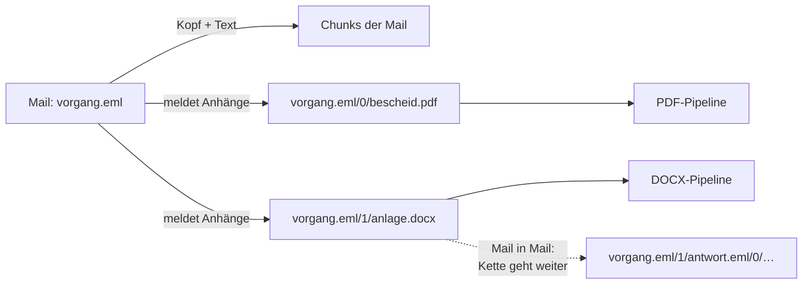
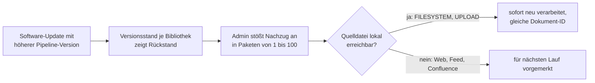

# Indexierung: Vom Dokument zum durchsuchbaren Index

> **Entwurf.** Dieses Kapitel beschreibt die Aufnahmestrecke (Ingestion-Pipeline) konzeptionell,
> von der Übersicht bis zu den einzelnen Verarbeitungsschritten. Die Konnektoren je Quellentyp
> und die Format-Pipelines je Dokumenttyp bekommen eigene Kapitel; hier werden sie nur als
> Übergabepunkte beschrieben.

## 1. Überblick in einem Bild

OPAA beantwortet Fragen aus Dokumenten, die zuvor in einen Index aufgenommen wurden. „Index"
bedeutet hier zweierlei: eine **Vektorablage**, in der Textstücke als Zahlenvektoren liegen und
über Bedeutungsähnlichkeit gefunden werden, und ein **Volltextindex**, der exakte Wörter,
Aktenzeichen und Paragrafen trifft. Beide werden im selben Arbeitsgang befüllt.

Der Weg dorthin ist für jedes Dokument gleich, unabhängig davon, woher es kommt und welches
Format es hat:

```mermaid
flowchart LR
    Q[Quelle] --> A[Aufzählen]
    A --> Z[Zulassen]
    Z --> P[Parsen]
    P --> C[Chunken]
    C --> E[Embedden]
    E --> S[(Vektor- und<br/>Volltextindex)]
```

| Schritt | Frage, die er beantwortet |
|---|---|
| Aufzählen | Welche Dateien gibt es in der Quelle gerade? |
| Zulassen | Ist das ein Format, das OPAA verarbeiten kann? |
| Parsen | Welcher Text steckt in der Datei, und welche Struktur hat er? |
| Chunken | In welche Stücke wird der Text zerlegt, damit die Suche sie einzeln treffen kann? |
| Embedden | Wie sieht jedes Stück als Vektor aus? |
| Indexieren | Wo liegt das Stück, und mit welchen Metadaten ist es wiederfindbar? |

Zwei Dinge sind aus Betriebssicht wichtig, bevor es ins Detail geht:

- **Alles läuft im Backend-Prozess.** Es gibt keine separate Worker-Komponente. Die Pipeline
  ruft nur nach außen, um Einbettungen zu berechnen (Embedding-Modell) und um Dateien aus der
  Quelle zu lesen.
- **Die Datenbank ist die einzige Wahrheit.** Alles, was die Pipeline erzeugt, liegt in
  PostgreSQL: Dokumentzeilen, Chunks samt Vektoren, Volltext, Laufprotokolle. Ein Backup der
  Datenbank ist ein Backup des Index.

## 2. Bibliothek, Quelle, Lauf, Dokument

Vier Begriffe tragen das ganze Kapitel.

Eine **Wissensbibliothek** ist die Verwaltungseinheit. Sie gehört zu einer Organisation, trägt
Berechtigungen und genau **eine Quelle**. Der Typ der Quelle entscheidet, wie Dokumente in die
Bibliothek gelangen:

| Quellentyp | Wie Dokumente hereinkommen | Lauf-basiert? |
|---|---|---|
| `UPLOAD` | Eine Person lädt Dateien über die Oberfläche hoch | nein, jede Datei wird sofort einzeln verarbeitet |
| `FILESYSTEM` | Ein Verzeichnis auf dem Server bzw. ein eingebundenes Netzlaufwerk wird gelesen | ja |
| `HTTP_DIRECTORY` | Ein Webverzeichnis (Apache-Autoindex) wird gecrawlt | ja |
| `RSS_FEED` | Ein Feed und die verlinkten Detailseiten werden gelesen | ja |
| `CONFLUENCE` | Die Seiten und Anhänge ausgewählter Spaces einer Confluence-Instanz (Cloud oder Data Center) werden über deren API gelesen | ja, in zwei Betriebsarten |

Ein **Indexierungslauf** ist ein Durchgang über die Quelle einer lauf-basierten Bibliothek. Er
hat einen Start, ein Ende, einen Status, Zähler, ein Protokoll und eine **Betriebsart**: Ein
*vollständig auflistender* Lauf sieht die ganze Quelle und darf am Ende Verschwundenes entfernen;
ein *ergänzender* Lauf sieht nur ein Fenster (die jüngsten Feed-Einträge, die seit dem letzten Lauf
geänderten Seiten) und entfernt nie etwas wegen Abwesenheit. Welche Betriebsarten ein Quellentyp
kennt, legt sein Konnektor fest (Abschnitt 4). Uploads haben keinen Lauf: die Datei wird
verarbeitet, das Ergebnis steht am Dokument.

Ein **Dokument** ist eine Zeile in der Dokumenttabelle, eindeutig über das Paar aus Bibliothek
und Quellpfad. Es trägt Prüfsumme, Status, Chunk-Anzahl und Fehlermeldung. Steckt in einem
Dokument ein weiteres, etwa ein Anhang in einer E-Mail oder eine verlinkte Anlage auf einer
Feed-Seite, wird dieses zu einem eigenen Dokument mit Verweis auf sein Elterndokument (siehe
Abschnitt 6).

Ein **Ordner** gliedert die Dokumente einer Bibliothek für die Navigation. Ordner sind reine
Ablagestruktur: Sie sind keine Rechtegrenze, Berechtigungen hängen immer an der Bibliothek, und
die Suche kennt keine Ordner, sie durchsucht stets den ganzen Bestand und zeigt zum Treffer den
Ordnerpfad an. Wer Ordner anlegt, hängt vom Quellentyp ab:

| Quellentyp | Woher die Ordner kommen | Bearbeitbar? |
|---|---|---|
| `UPLOAD` | Nutzende legen sie an, auch leer, benennen sie um und löschen sie. Ein per Drag & Drop hochgeladener Ordner bringt seine Unterstruktur mit. | ja |
| `FILESYSTEM` | Der Lauf spiegelt die Verzeichnisstruktur der Quelle. Ordner entstehen nur entlang gefundener Dateien; ein Verzeichnis, das keine Dokumente mehr hält, verschwindet am Ende des Laufs. | nein, die Quelle ist führend |
| `HTTP_DIRECTORY` | Der Lauf spiegelt den gecrawlten Verzeichnisbaum: der URL-Pfad unterhalb der Start-URL, je Segment prozentdekodiert. Wie beim Dateisystem entstehen Ordner nur entlang gefundener Dateien; aufgeräumt wird nur nach einem vollständigen Crawl. | nein, die Quelle ist führend |
| `RSS_FEED` | keine Ordner; ein Feed hat keine Struktur | entfällt |
| `CONFLUENCE` | keine Ordner. Space und Gliederungspfad einer Seite stehen am Dokument und erscheinen in Zitat, Protokoll und Chunk-Kontext, nicht als Ordner. | entfällt |
| `S3` | Der Lauf spiegelt die Schlüsselpräfixe der Geltungsbereiche: bei einem Bereich ist dessen Präfix die Wurzel, bei mehreren beginnt jede Kette mit dem Bucket und seinen Präfixsegmenten. Ordner entstehen nur entlang gefundener Objekte; ein Ordnermarker (`…/`) allein erzeugt keinen. Siehe [Konnektor S3](konnektor-s3.md), Abschnitt 10. | nein |
| `GOOGLE_DRIVE` | Der Lauf spiegelt die Ordnerkette bis zum Bereich; bei mehreren Bereichen beginnt jede Kette mit dem Namen der Ablage bzw. des Ordners. Siehe [Konnektor Google Drive](konnektor-google-drive.md), Abschnitt 6. | nein |
| `SHAREPOINT` | Der Lauf spiegelt die Ordnerkette ab der Wurzel der Dokumentbibliothek; bei mehreren Dokumentbibliotheken beginnt jede Kette mit deren Namen. Siehe [Konnektor SharePoint](konnektor-sharepoint.md), Abschnitt 6. | nein |
| `NEXTCLOUD` | Der Lauf spiegelt die Ordner unterhalb der konfigurierten Ordner: bei einem Ordner ist er die Wurzel, bei mehreren beginnt jede Kette mit seinen Pfadsegmenten. Ordner entstehen nur entlang gefundener Dateien. Siehe [Konnektor Nextcloud](konnektor-nextcloud.md), Abschnitt 5. | nein |
| `SMB` | Der Lauf spiegelt die Ordner unterhalb der konfigurierten Ordner der Freigabe, wie bei Nextcloud. Ordner entstehen nur entlang gefundener Dateien. Siehe [Konnektor Windows-Dateifreigabe](konnektor-smb.md), Abschnitt 5. | nein |

Das Löschen eines Ordners in einer Upload-Bibliothek löscht die enthaltenen Dokumente samt
Chunks und Dateien, nach einer Bestätigung, die deren Anzahl nennt.

```mermaid
flowchart TB
    O[Organisation] --> B[Wissensbibliothek<br/>Quellentyp + Quellkonfiguration]
    B --> L[Indexierungslauf<br/>Status, Zähler, Protokoll]
    B --> F[Ordner<br/>nur Navigation]
    F --> D
    B --> D[Dokument<br/>Pfad, Prüfsumme, Status]
    D --> D2[Anhang als<br/>eigenes Dokument]
    D --> K[Chunks<br/>Text, Vektor, Metadaten]
```

### Bibliotheken im Katalog finden

Die Bibliotheken, die Sie lesen dürfen, stehen im **Katalog** der Hauptnavigation, zusammen mit den
Prompt-Bibliotheken; der Filter „Wissen" grenzt ihn auf Wissensbibliotheken ein. Eine Kachel nennt
Name, Beschreibung, ob sie an „Alle Konten" freigegeben ist, die Anzahl der Dokumente, in wie vielen
Räumen die Bibliothek bereitsteht, die zuständige Stelle und „Aktualisiert am" oder den Zustand,
gegebenenfalls mit „Nachfolge offen". Suche, Filter, Reihenfolge und Seiten beschreibt
[Bibliotheken und Berechtigungen](bibliotheken-und-berechtigungen.md), Abschnitt 4, „Der Katalog".

**Was die Kachel über Läufe sagt.** Eine Konnektorbibliothek richtet sich nach ihrem jüngsten Lauf:
„Wird aktualisiert", solange er läuft, „Aktualisierung fehlgeschlagen", wenn er gescheitert ist, und
sonst „Aktualisiert am" mit dem Datum des letzten erfolgreichen Laufs; ohne jeden Lauf steht dort „Noch kein
Inhalt". Eine Upload-Bibliothek hat keine Läufe und richtet sich nach ihren Dokumenten, die erste
zutreffende Regel gilt: eines noch in Verarbeitung, eines gescheitert, eines indexiert, keines. Den
Fortschritt eines Laufs und warum er gescheitert ist, zeigt erst die Detailansicht: Kopf, Reiter
„Quelle" und das Laufprotokoll (Abschnitt 8.2).

### Die Detailansicht einer Bibliothek

Ein Klick auf eine Kachel im Katalog führt auf die Detailansicht. Sie besteht aus einem **Kopf**
und fünf **Reitern**; einen Weg „zurück zur Übersicht" gibt es nicht, der Einstieg ist die
Hauptnavigation.

**Der Kopf** ist derselbe wie bei einer Prompt-Bibliothek
([Bibliotheken und Berechtigungen](bibliotheken-und-berechtigungen.md), Abschnitt 4) und trägt, von
oben nach unten:

| Element | Inhalt |
|---|---|
| **Kopfzeile** | das Etikett „Wissen", das Welt-Symbol, wenn die Bibliothek an „Alle Konten" freigegeben ist, dann drei Abzeichen: der Quellentyp, die eigene Rolle und — für eine Systemverwaltung ohne eigene Berechtigung — „administrativ". Der Quellentyp steht genau hier und sonst nirgends auf der Seite. Rechts stehen die Aktionen (siehe unten), der Stern für den eigenen Favoriten und das Menü „⋯" |
| **Überschrift** | der Name der Bibliothek |
| **Beschreibung** | unter dem Namen; beide ändert, wer mindestens Verwalter ist, über den Stift „Name und Beschreibung bearbeiten" — ein eigener Bearbeitungsmodus mit „Speichern" und „Abbrechen", kein Klick in den Text |
| **Nachfolge** | steht die Nachfolge offen, sagt es eine Zeile darunter ([Bibliotheken und Berechtigungen](bibliotheken-und-berechtigungen.md), Abschnitt 13) |
| **Kennzahlen** | Anzahl der Dokumente; belegtes Speicherkontingent ab der Verwalterrolle; der letzte Lauf mit Ausgang, Zählern und Datum ab der Bearbeiterrolle, sobald eine Konnektorbibliothek einen hatte; in wie vielen Räumen die Bibliothek bereitsteht; die zuständige Stelle mit Personen- oder Gruppensymbol; „Aktualisiert am" |
| **Umfang** | bei Confluence und S3 eine Kurzzeile („3 Spaces · Data Center · Details") mit Sprung in den Reiter „Quelle"; die Warnung über einen unvollständig gelesenen Umfang bleibt dagegen im Kopf, weil sie den Bestand betrifft, den jede Ansicht zeigt |
| **Aktionen** | „Jetzt indizieren" (ab der Bearbeiterrolle, bei einer Konnektorbibliothek), bei Confluence zusätzlich „Vollabgleich starten". Das Menü „⋯" führt für jede lesende Rolle „In Space verwenden" und, abgesetzt, für den **Eigentümer** (sowie die Systemverwaltung) den einzigen folgenschweren Punkt der Seite: „Löschen" |

Darunter steht eine Zeile zur eigenen Rolle, wo sie die Bedienung erklärt: „Sie haben in dieser
Bibliothek nur Leserechte" beziehungsweise „Sie können Dokumente dieser Bibliothek pflegen, ihre
Einstellungen aber nicht ändern" — nie beide, und nie zweimal.

**Die Reiter** heißen **Dokumente · Quelle · Metadaten · Freigaben · Zuordnungen**; eine Upload-Bibliothek hat
keinen Reiter „Quelle". Jeder Reiter trägt seine eigene Adresse (`?tab=`), lässt sich also
verlinken und in einem neuen Browser-Tab öffnen, legt aber keinen eigenen Schritt in der
Browser-Historie an: Ein „Zurück" verlässt die Seite, egal wie viele Reiter dazwischen lagen. Alle
Reiter stehen jeder Rolle offen; was eine Rolle nicht abrufen darf, fehlt innerhalb des Reiters,
nicht der Reiter selbst.

| Reiter | Inhalt |
|---|---|
| **Dokumente** | der Bestand der Bibliothek, für jeden Quellentyp dieselbe Liste (siehe unten) |
| **Quelle** | Umfang · Anbindung · Zeitplan · Läufe (siehe unten); entfällt bei einer Upload-Bibliothek |
| **Metadaten** | „Metadatenfelder" — die eigenen Felder dieser Bibliothek samt Wertelisten — und, ab der Verwalterrolle, „Modellgestützte Extraktion". Beides beschreibt das Kapitel [Metadaten](metadaten.md) |
| **Freigaben** | Eigentümer, Berechtigungen, externer Zugang, Diagnosesperre und die Herleitung „Warum sehe ich diese Wissensbibliothek?" — die fünf Abschnitte beschreibt [Bibliotheken und Berechtigungen](bibliotheken-und-berechtigungen.md), Abschnitt 4 |
| **Zuordnungen** | „In Space verwenden" und die Räume, in denen die Bibliothek als Datenquelle bereitsteht, mit „Aus Space lösen" im Menü „⋯" jeder Zeile — beschrieben in [Bibliotheken und Berechtigungen](bibliotheken-und-berechtigungen.md), Abschnitt 4 |

Der Reiter **„Quelle"** hat vier Abschnitte in dieser Reihenfolge:

| Abschnitt | Inhalt | Sichtbar für |
|---|---|---|
| **Umfang** | Welchen Ausschnitt der Quelle diese Bibliothek spiegelt — bei Confluence die ausgewählten Spaces und die erkannte Edition, bei S3 die Geltungsbereiche (Bucket, wahlweise mit Präfix), jeweils mit einem Satz dazu, was ein Geltungsbereich ist und wer den daraus indizierten Bestand lesen kann. Entfällt bei den übrigen Konnektoren | alle Leseberechtigten |
| **Anbindung** | Quelladresse und Verbindungsparameter, „Bearbeiten", „Verbindung testen" gegen die gespeicherte Konfiguration sowie — je nach Typ — Webhook (Confluence) oder Ereignisse (S3) | ab MANAGER |
| **Zeitplan** | Rhythmus, nächster Termin, bei Confluence zusätzlich der Vollabgleich-Rhythmus; eine Warnung, wenn die letzten geplanten Läufe gescheitert sind | ab MANAGER |
| **Läufe** | das Laufprotokoll (Abschnitt 8.2) | ab MANAGER |

Wer darunter bleibt, sieht im Reiter „Quelle" den Umfang und einen Satz dazu, wem der Rest
vorbehalten ist — der Reiter selbst bleibt sichtbar. Der Verbindungstest im Abschnitt „Anbindung"
prüft die **gespeicherte** Konfiguration, ohne dass jemand sie dafür öffnen muss; bei Confluence
und S3 liegt er im jeweiligen Formular hinter „Bearbeiten", weil er dort die Zugangsdaten und die
erkannte Edition braucht, die die Leseansicht nicht trägt.

Der Reiter **„Dokumente"** zeigt für jeden Quellentyp dieselbe Liste: Suche, Seitengröße, Auswahl
und Blättern sind überall gleich; typabhängig sind nur die Zusatzzeilen einer Dokumentzeile
(Space bzw. Bucket, Herkunft, Anhänge) und die Aktionen. Steht ein Ordner offen, liegt sein Pfad
unmittelbar über dem Suchfeld. Ordnerzeilen sind nicht auswählbar; das ist an ihrem abgeblendeten
Auswahlkästchen zu sehen. „Alle auf dieser Seite auswählen" steht auch auf der obersten Ebene.
Für die Auswahl bietet die Leiste alle Aktionen an, die für **alle** ausgewählten Dokumente
zulässig sind: „Feld setzen" (siehe [Metadaten](metadaten.md)) und — nur in einer
Upload-Bibliothek — „Löschen". Das Sammellöschen fragt einmal nach und meldet danach, wie viele
Dokumente gelöscht wurden; blieb eines stehen (etwa weil es zwischenzeitlich schon weg war),
nennt die Meldung den Grund. In einer Konnektorbibliothek gibt es weder das Einzel- noch das
Sammellöschen — ein gelöschtes Dokument käme mit dem nächsten Lauf zurück.

### Eine Bibliothek anlegen

Angelegt wird über **„Neu"** im Katalog: Nach der Wahl der Art „Wissen" führt „Weiter" in einen
Assistenten ([Bibliotheken und Berechtigungen](bibliotheken-und-berechtigungen.md), Abschnitt 4,
„Anlegen über ‚Neu'"). Seine Schritte tragen dieselben Namen und dieselben
Formulare wie der Kopf und die Reiter der fertigen Bibliothek — was hier eingestellt wird, steht
später an derselben Stelle wieder:

| Schritt | Inhalt |
|---|---|
| **1. Art des Wissens** | je Quellentyp eine Kachel mit Symbol und einem Satz dazu. Fehlt das Anlegerecht für diese Art — „Bibliotheken für Uploads anlegen" und „Konnektorbibliotheken anlegen" sind zwei getrennte Rechte —, ist die Kachel gesperrt und nennt den Grund auf sich selbst. Eine Quellart, die für die Person nur über einen Zugang freigegeben ist, bleibt wählbar. Zwischen den Kacheln führen die Pfeiltasten |
| **2. Quelle** | bei einer Quellart mit Zugängen zuerst die Wahl des **Zugangs** (siehe [Zugänge](#zugänge)), darunter Anbindung und Verbindungstest wie im gleichnamigen Reiter, dazu der **Zeitplan** und der Schalter „Erste Indizierung sofort nach dem Anlegen starten". Beide gelten für **jeden** Konnektortyp. Bei einer Upload-Bibliothek entfällt der Schritt, der Assistent hat dann drei |
| **3. Name & Beschreibung** | der Name ist vorbelegt, wo die Quelle ihn hergibt — der einzelne Confluence-Space, der erste Bucket, der letzte Pfadabschnitt, der Hostname — und bleibt überschreibbar |
| **4. Freigaben** | Eigentümer („Mein Konto" oder eine Gruppe, in der die anlegende Person Mitglied ist) und vorgemerkte Freigaben an Personen und Gruppen. Eine Freigabe an „Alle Konten" gibt es hier nicht: Sie wird an der fertigen Bibliothek erteilt, wo auch die Obergrenze dafür gilt |

Nach „Bibliothek anlegen" führt der Assistent auf die Detailseite. Konnte eine vorgemerkte Freigabe
nicht erteilt werden, ist die Bibliothek trotzdem angelegt; ein Hinweis nennt die betroffenen
Empfänger, und die Rolle lässt sich im Reiter „Freigaben" nachtragen.

## 3. Wie ein Lauf entsteht und endet

### 3.1 Auslöser

| Auslöser | Beschreibung |
|---|---|
| **Manuell** | „Jetzt indizieren" an der Bibliothek, in der Betriebsart, die der Konnektor für den Zustand der Bibliothek vorsieht. Genügt die Rolle EDITOR an der Bibliothek. Bei Confluence gibt es zusätzlich „Vollabgleich starten". |
| **Zeitplan** | Je Bibliothek einstellbar, Details unten. |
| **Webhook / Ereignis** | Confluence: Die Instanz meldet geänderte Seiten, OPAA holt wenige Sekunden später genau diese Seiten in einem kurzen Lauf „per Webhook". S3: Der Objektspeicher meldet erzeugte oder gelöschte Objekte (MinIO-Webhook, Ceph-Topic, EventBridge), OPAA prüft die gemeldeten Schlüssel wenige Sekunden später einzeln in einem **Ereignislauf** — ein bestätigtes `404` entfernt das Dokument samt Anhängen, sonst gilt der Stand des Speichers. Ersetzt weder Zeitplan noch Vollabgleich. |
| **Upload** | Kein Lauf. Jede Datei geht sofort einzeln durch die Dokumentstrecke, auf einem eigenen Thread-Pool, damit ein Upload nie hinter einem langen Verzeichnislauf wartet. Wo das hochgeladene Original danach liegt, entscheidet der Betrieb: [Originalablage](deployment.md#originalablage). |
| **Nachzug (Admin)** | Kein regulärer Lauf. Ein Systemadministrator stößt die Neuverarbeitung von Dokumenten an, die mit einer älteren Pipeline-Version erzeugt wurden (Abschnitt 9), oder den Bestandslauf der Kernfelder (Kapitel [Metadaten](metadaten.md)). |

**Zeitplan je Bibliothek.** Jede lauf-basierte Bibliothek kann einen Zeitplan tragen; für
Upload-Bibliotheken wird er abgewiesen. Verwaltende setzen ihn im Reiter „Quelle" der Bibliothek,
Abschnitt „Zeitplan" — beim Anlegen im gleichnamigen Schritt des Assistenten:

| Stufe | Einstellungen |
|---|---|
| aus | keine |
| stündlich | keine, jeweils zur vollen Stunde |
| täglich | Uhrzeit |
| wöchentlich | Wochentag und Uhrzeit |

Die Uhrzeit gilt in der Zeitzone des Servers. Freie Cron-Ausdrücke gibt es in der Oberfläche
bewusst nicht. Ein minütlicher Takt im Backend prüft, welche Bibliotheken seit dem letzten Takt
fällig geworden sind. Daraus folgen drei Regeln:

- **Verpasste Termine werden nicht nachgeholt.** War das Backend zum Termin nicht in Betrieb,
  läuft die Bibliothek erst zum nächsten Termin wieder. Wer nach einer längeren Wartung einen
  aktuellen Stand braucht, stößt manuell an.
- **Ein fälliger Termin trifft auf einen laufenden Lauf:** Es entsteht kein zweiter Lauf,
  sondern der Protokolleintrag „Geplanter Lauf übersprungen: Indizierung läuft bereits" am
  laufenden. Ein Erstlauf, der länger dauert als das Intervall, verschluckt so die Termine bis
  zu seinem Ende.
- **Ein fehlgeschlagener geplanter Lauf schaltet den Zeitplan nicht ab.** Scheitern zwei
  geplante Läufe hintereinander, zeigt die Bibliothek ein Warnbanner; manuelle Läufe zählen dabei
  nicht mit.

Welche Stufe sinnvoll ist, hängt von der Quelle ab. Ein Feed kostet unverändert nur eine
Anfrage je Lauf und verträgt stündlich; ein großes Netzlaufwerk liest bei jedem Lauf alle Dateien
und ist eher täglich oder wöchentlich fällig. Eine Confluence-Bibliothek läuft täglich inkrementell
und nach ihrem eigenen Rhythmus (Standard sieben Tage, je Bibliothek im Zeitplan-Dialog
einstellbar) als Vollabgleich.

### 3.2 Zustände eines Laufs

Ein Lauf kennt drei Zustände und kehrt aus einem Endzustand nie zurück:

```mermaid
stateDiagram-v2
    [*] --> RUNNING: Auslöser
    RUNNING --> COMPLETED: alle Elemente verarbeitet
    RUNNING --> FAILED: Quelle nicht erreichbar, Pfad außerhalb der Freigabe,<br/>Warteschlange voll, Neustart, Zeitüberschreitung
    COMPLETED --> [*]
    FAILED --> [*]
```

Pro Bibliothek gibt es **höchstens einen laufenden Lauf**. Das sichert ein eindeutiger Index in
der Datenbank, nicht eine Prüfung im Anwendungscode. Wird eine Bibliothek fällig, während ihr
Lauf noch läuft, entsteht kein zweiter Lauf, sondern ein Protokolleintrag „Zeitplan
übersprungen" am laufenden.

Ein einzelnes Dokument, das nicht verarbeitet werden kann, bricht den Lauf **nicht** ab. Es
wird gezählt, protokolliert und übersprungen. `FAILED` bedeutet, dass der Lauf als Ganzes nicht
zu Ende geführt werden konnte.

Ein Lauf kann `COMPLETED` und trotzdem **unvollständig** sein: Ein Confluence-Lauf, der sein
Anfragebudget verbraucht hat, endet geordnet mit dem Kennzeichen „unvollständig, wird fortgesetzt";
der nächste Lauf setzt dort an. Ein solcher Lauf entfernt nichts. Bei den Dateiablagen Nextcloud,
SMB und SharePoint setzt der nächste Lauf an der gemerkten Stelle der Auflistung fort; ein
Vollabgleich darf sich so über mehrere Läufe erstrecken ([Nextcloud](konnektor-nextcloud.md),
Abschnitt 3.1; [SMB](konnektor-smb.md), Abschnitt 3.1; [SharePoint](konnektor-sharepoint.md),
Abschnitt 4.1).

### 3.3 Wiederanlauf nach Störungen

Weil ein hängender Lauf seine Bibliothek dauerhaft blockieren würde, gibt es zwei Aufräumer:

- **Beim Start des Backends** werden alle Läufe, die noch als laufend markiert sind, mit der
  Meldung „Durch Neustart abgebrochen" beendet. Das setzt voraus, dass genau eine
  Backend-Instanz läuft (siehe Abschnitt 10).
- **Alle 15 Minuten** werden Läufe beendet, die länger als die konfigurierte Frist (Standard
  vier Stunden) keinen Fortschritt gemeldet haben. Maßgeblich ist der letzte Fortschritt, nicht
  der Start: ein großer Erstlauf darf länger als vier Stunden dauern, solange er arbeitet.

Ein abgebrochener Lauf lässt den bisherigen Bestand weitgehend stehen. Dokumente, die der Lauf
bereits fertig verarbeitet hat, bleiben indiziert; Dokumente, die er noch nicht erreicht hat,
bleiben auf dem alten Stand. Nur das eine Dokument, das gerade in Arbeit war, kann ohne Chunks
zurückbleiben, und auch das nur noch, wenn der Abbruch genau zwischen dem Entfernen der alten
Chunks und dem Schreiben der neuen fiel, also im Zeitfenster des Embedding-Aufrufs (Abschnitt 5,
Schritt 6a). Es steht dann nicht auf „indiziert" und
wird im nächsten Lauf erneut verarbeitet, unabhängig von der Prüfsumme.

Ein S3-Vollabgleich, der durch das Anfragebudget oder eine Störung endete, hinterlässt je
Bibliothek einen Wiederaufnahmezustand: welche Geltungsbereiche er bereits vollständig gelistet
hatte. Der nächste Lauf listet **alle** Bereiche erneut — die unvollendeten zuerst — und spart nur
die Downloads, denn ein Objekt, dessen Änderungsmerkmal bereits gespeichert ist, kostet keinen
Abruf; erst ein Lauf, der jeden Bereich bis zur letzten Seite gelistet und den Bestand abgeglichen
hat, schließt den Zustand. Eine Änderung des Endpoints oder der Geltungsbereiche verwirft ihn.

**Abgleichstand und Einstellungen.** Jeder Abgleichstand (Wiederaufnahmezustand, Fortsetzungsstelle
einer Runde, Änderungszeiger, Anker des inkrementellen Laufs, gemerkte Ordner) gilt nur für die
Quelleinstellungen, unter denen er entstand: Adresse, Pfad und die Einstellungen, die der Konnektor
als auswahlbestimmend vergleicht, etwa Ordner, Spaces, Geltungsbereiche, Filter oder das imitierte
Konto, dazu das Konto, als das die Quelle verbunden ist. Vorgaben des Zugangs zählen mit. Proxy,
Zertifikatsprüfung und der Vollabgleich-Rhythmus gehören nicht dazu.

- Ein Lauf, für den niemand eine Betriebsart gewählt hat (Zeitplan, „Jetzt indizieren“, ein
  übergelaufener Ereignisstapel), ist ein Vollabgleich, sobald der gespeicherte Stand zu anderen
  Einstellungen gehört.
- Findet ein Lauf einen Stand anderer Einstellungen vor, verwirft er ihn, vermerkt das im Protokoll
  und gleicht vollständig neu ab. Ein ausdrücklich inkrementell gestarteter Lauf sucht dann nichts;
  der nächste Lauf ist ein Vollabgleich. Ein Stand, der vor dieser Prüfung entstand, nennt seine
  Einstellungen nicht; er wird einmal verworfen, mit eigenem Protokollvermerk.
- Das gilt auch, wenn ein Lauf, der vor der Änderung begann, den alten Stand danach noch einmal
  geschrieben hat, und auch nach einem Neustart.
- Ändern sich die Einstellungen, während ein Lauf läuft, entfernt dieser Lauf nichts als
  verschwunden, weder am Ende der Auflistung noch aus dem Änderungsprotokoll. Bei den Dateiablagen
  endet er meist als **fehlgeschlagen** mit „Die Quelle der Bibliothek wurde während des Laufs
  geändert …“, weil die Änderung den Stand verworfen hat und der Lauf ihn nicht neu anlegt. Sichert
  er danach nichts mehr, und bei Confluence, gilt er als **unvollständig** mit einem
  Protokollvermerk. Lassen sich die Einstellungen vor dem Abgleich nicht erneut lesen, vermerkt das
  Protokoll das eigens, und der Lauf entfernt ebenfalls nichts. In jedem Fall gleicht der nächste
  Lauf unter den neuen Einstellungen ab.

## 4. Die Quellen: der Übergabepunkt an die Konnektoren

Jeder lauf-basierte Quellentyp hat einen eigenen **Konnektor** (im Code: Executor). Der
Konnektor kennt die Eigenheiten seiner Quelle, die Dokumentstrecke dahinter kennt sie nicht.
Was ein Konnektor liefern muss, ist für alle gleich:

1. eine **Aufzählung** der aktuell vorhandenen Elemente (Dateien, URLs, Feed-Einträge, Seiten)
   samt der Aussage, ob sie **vollständig** ist. Nur eine vollständige Aufzählung darf am Ende als
   Grundlage dienen, um verschwundene Dokumente zu erkennen (Abschnitt 7),
2. für jedes Element den **Inhalt** als Datei oder als bereits extrahierten Text,
3. die Erklärung seiner **Betriebsarten**: welche es gibt und ob sie vollständig auflisten oder
   nur ergänzen.

| Konnektor | Betriebsarten | Löscht durch Abwesenheit |
|---|---|---|
| FILESYSTEM | vollständig | ja, nach vollständigem Lauf |
| HTTP_DIRECTORY | vollständig | ja, wenn der Crawl weder abgeschnitten noch unvollständig war |
| RSS_FEED | ergänzend | nie |
| CONFLUENCE | Vollabgleich (vollständig), inkrementell (ergänzend) | nur der Vollabgleich, und nur bei vollständiger Auflistung aller Spaces |
| S3 | Vollabgleich (vollständig), Ereignislauf (ergänzend, nur per Benachrichtigung) | nur der Vollabgleich, und nur bei vollständiger Auflistung aller Geltungsbereiche; ein Bereich, der nicht gelistet werden darf oder dessen Bucket fehlt, lässt den Bestand stehen. Der Ereignislauf löscht nur auf Befund des Speichers (`404`) |

```mermaid
flowchart LR
    subgraph Konnektoren
        F[FILESYSTEM<br/>Verzeichnisbaum lesen]
        H[HTTP_DIRECTORY<br/>Autoindex crawlen]
        R[RSS_FEED<br/>Feed + Detailseiten]
        C[CONFLUENCE<br/>Spaces, Seiten, Anhänge]
        S[S3<br/>Buckets, Präfixe, Objekte]
    end
    F --> DS
    H --> DS
    R --> DS
    C --> DS
    S --> DS
    U[Upload] --> DS
    DS[Dokumentstrecke<br/>je Element identisch]
```

Zwei Dinge liegen in der Verantwortung des Konnektors, bevor die Dokumentstrecke überhaupt
beginnt:

- **Schutz der Umgebung.** Jeder Quellentyp bringt eigene Risiken mit: ein Dateisystemkonnektor
  könnte beliebige Serverpfade lesen, ein Netzkonnektor könnte auf interne Adressen umgeleitet
  werden oder unbegrenzt große Antworten laden. Jeder Konnektor hat deshalb eigene
  Freigabe- und Grenzmechanismen, die der Betrieb konfiguriert. Ein Verstoß beendet den Lauf
  oder das betroffene Element mit einem Protokolleintrag, nie mit einem stillen Weiterlaufen.
- **Früherkennung von Unverändertem.** Je nach Quelle kann der Konnektor schon aus der
  Aufzählung erkennen, dass sich ein Element nicht geändert hat, etwa über ein Änderungsdatum
  oder eine bedingte HTTP-Anfrage, und sich den Download sparen. Das ist eine Optimierung; die
  verbindliche Entscheidung trifft immer die Prüfsumme in der Dokumentstrecke.

Alles Übrige ist nicht Sache des Konnektors, sondern eines **gemeinsamen Laufrahmens**, in dem
jeder Konnektor läuft: das Anlegen von Zählern und Protokoll, die Prüfung der Betriebsart, die
Zuordnung jedes Elementergebnisses zu Zähler und Protokolleintrag (Abschnitt 8.1), die Buchführung
über Anhänge, die Bereinigung verschwundener Dokumente nach vollständiger Aufzählung (Abschnitt 7),
die Kennzahlen des Laufs (Abschnitt 8.3) und die Übersetzung von Abbrüchen in eine verständliche
Fehlermeldung. Deshalb lauten die Meldungen eines Laufabbruchs bei allen Konnektoren gleich, etwa
„Lauf unterbrochen" oder „Die Bibliothek wurde während des Laufs gelöscht.", und ein neuer Konnektor bringt nur die drei oben
genannten Dinge mit.

> Welche Mechanismen und Grenzwerte das je Quelle konkret sind, steht in den Kapiteln
> [Verzeichnis im Dateisystem](konnektor-filesystem.md),
> [Webverzeichnis](konnektor-http-directory.md), [Feed](konnektor-rss-feed.md),
> [Confluence](konnektor-confluence.md), [S3-Objektspeicher](konnektor-s3.md),
> [Google Drive](konnektor-google-drive.md), [SharePoint](konnektor-sharepoint.md),
> [Nextcloud](konnektor-nextcloud.md) und [Windows-Dateifreigabe (SMB)](konnektor-smb.md).

### Zugänge

Ein **Zugang** ist ein Rahmen, den die Systemverwaltung für einen Konnektor vorgibt: Name,
Server-Adresse, Anmeldeart, bei Anmeldearten mit App-Registrierung Client-ID, Client-Secret,
Mandant, Ablaufdatum des Secrets und Scopes, dazu die Besitzart (Bibliothek, Person oder beides),
Proxy, die Zertifikatsprüfung und Vorgaben für die Einstellungen des Konnektors. Wer eine Bibliothek
auf einem Zugang anlegt, wählt ihn aus und trägt Server, Registrierung, Proxy und Vorgaben nicht
selbst ein.

Die Systemverwaltung pflegt Zugänge unter **Administration → Zugänge**. Solange keine Quellart
Zugänge anbietet, steht dort ein Hinweis, und „Neuer Zugang“ ist gesperrt. Sonst fragt „Neuer
Zugang“ zuerst die Quellart als Kachel ab; Quellarten ohne Zugänge bleiben mit Grund gesperrt
sichtbar. Das Formular richtet sich nach der Quellart:

- **Anmeldeart** bietet nur die Arten an, die die Quellart meldet; **Besitzart** nur die Besitzarten,
  die sie für die gewählte Anmeldeart zulässt.
- **Server-Adresse** verlangt eines der Schemata, die die Quellart meldet; der Hinweis unter dem
  Feld nennt sie. Hat die Quellart eine feste Adresse, entfällt das Feld, und das Formular nennt die
  Adresse.
- **Proxy** (`host:port`, ohne Zugangsdaten, optional) und **Zertifikatsprüfung aussetzen**
  gelten für jede Bibliothek auf dem Zugang und ersetzen deren eigene Angaben. Wohin der Konnektor
  sie anwendet, bestimmt er wie bei einer Bibliothek mit eigener Adresse: Beim RSS-Feed etwa gilt
  der Proxy für jeden Abruf des Laufs, auch für Detailseiten fremder Server, die ausgesetzte
  Zertifikatsprüfung dagegen nur für den Ursprung des Feeds. Beides gibt es nur bei einer Server-Adresse mit `http://` oder `https://`; einen Zugang mit
  `smb://`-Adresse und Proxy oder ausgesetzter Zertifikatsprüfung weist OPAA beim Speichern ab.
- **Vorgaben für jede Bibliothek** zeigt je Einstellung, die ein Zugang vorgeben darf, ein Feld:
  Text, Ja/Nein oder eine Auswahl, jeweils mit „Keine Vorgabe“. Meldet die Quellart keine solche
  Einstellung, fehlt der Abschnitt. Eine Vorgabe, die die Quellart nicht meldet, weist OPAA ab.
- **Endpunkte** (Autorisierungs-, Token- und Widerrufs-Endpunkt) fragt das Formular nur bei OAuth
  bzw. Client-Credentials ab und nur die, die die Quellart dem Zugang überlässt, etwa weil sie vom
  Realm eines Keycloak abhängen; dann sind sie Pflicht. Der Autorisierungs-Endpunkt beginnt mit
  `https://` oder `http://`, Token- und Widerrufs-Endpunkt nur mit `https://`: Sie bekommen
  Refresh-Tokens und das Client-Secret, die bei `http://` jede Station auf dem Weg mitlesen könnte,
  auch der Proxy des Zugangs. Eine andere Adresse markiert das Formular, und OPAA weist sie beim
  Speichern ab. Endpunkte, die die Quellart selbst festlegt, fragt es nicht ab, und ein Wert dafür wird
  abgewiesen. OPAA schreibt sie beim Speichern fest und erkennt sie nie zur Laufzeit neu.
  Token- und Widerrufs-Endpunkt bekommen das Client-Secret. Ändert die Verwaltung einen davon an
  einem Zugang mit hinterlegtem Secret, verlangt das Formular ein neues Secret: Das hinterlegte geht
  nie an eine neue Adresse. Für einen öffentlichen Client lässt sich stattdessen „Ohne
  Client-Secret speichern“ wählen. Ohne beides weist OPAA die Änderung ab und ändert nichts. Der
  Autorisierungs-Endpunkt bekommt kein Secret; ändert sich nur er, bleibt das Secret. Die Rückfrage
  vor dem Speichern nennt bei jedem geänderten Endpunkt die alte und die neue Adresse. Ein
  geänderter Proxy lässt das Secret bestehen, denn über `https://` sieht er nicht, was zu den
  Endpunkten geht.
- **Scopes** nennt unter dem Feld die Vorgabe der Quellart, die gilt, solange das Feld leer bleibt.
- **Dienstkonto-Schlüssel** lädt das Formular als JSON-Schlüsseldatei hoch; eine Client-ID fragt
  es dafür nicht ab, OPAA übernimmt sie aus `client_email` des Schlüssels. Gespeichert werden nur
  `client_email`, `private_key_id` und `private_key`, verschlüsselt.
- Eine **Vorgabe nur des Zugangs** (bei Google Drive das imitierte Konto) setzt keine Bibliothek
  auf dem Zugang selbst, auch wenn der Zugang sie leer lässt; ein Wert der Bibliothek wird
  abgewiesen.
- Liegen die Angaben der Quellart nicht vor (etwa weil sie nicht geladen werden konnten), lässt
  sich ein Zugang nicht speichern; das Formular sagt das, statt die Vorgaben zu verwerfen.

**Anmeldung des Zugangs (Client-Credentials, Dienstkonto-Schlüssel).** Bei diesen Anmeldearten
meldet sich der Zugang selbst an: OPAA holt mit Client-ID und Client-Secret bzw. mit dem
signierten Schlüssel ein Zugriffstoken beim Token-Endpunkt, den der Konnektor nennt, und gibt der
Bibliothek nur dieses Token. Der Abruf geht über den Proxy des Zugangs und immer mit
Zertifikatsprüfung; der Schalter „Zertifikatsprüfung aussetzen“ gilt nur für die Server-Adresse.
Das Token hält OPAA bis kurz vor seinem Ablauf. Lehnt der Anbieter die Registrierung ab (etwa ein
falsches Client-Secret oder ein widerrufener Schlüssel), zeigt die Liste am Zugang „Anmeldung
abgelehnt“, alle Bibliotheken darauf melden „Abgelaufen“ mit der Systemverwaltung als zuständig,
und kein Lauf fragt den Anbieter erneut. Ein neues Client-Secret bzw. ein neuer Schlüssel oder
**„Anmeldung testen“** am Zugang hebt das auf; der Test meldet sich einmal an und nennt bei einem
Fehler den Grund. Jeder Test steht mit seinem Ausgang (gelungen oder abgelehnt) im
Revisionsprotokoll, ohne die Meldung des Anbieters.

**Anmeldung über OAuth (App-Registrierung, Rücksprungadresse).** Bei dieser Anmeldeart stimmt jede
Person beim Anbieter selbst zu; OPAA erhält dafür ein Refresh-Token und ein Zugriffstoken und legt
beide verschlüsselt ab. Dafür braucht der Zugang eine **App-Registrierung beim Anbieter**, die die
Systemverwaltung dort einmal anlegt:

1. Beim Anbieter eine App (einen vertraulichen Client) anlegen und als **Rücksprungadresse**
   (Redirect-URI) genau `{öffentliche Adresse}/connections/callback` eintragen. Das Formular nennt
   die Adresse, sobald OAuth gewählt ist, so wie OPAA sie dem Anbieter nennt; die öffentliche
   Adresse ist die der Installation ([Deployment](deployment.md), `OPAA_PUBLIC_BASE_URL`). Fehlt
   sie, nennt das Formular statt einer Adresse diesen Mangel, kein Konto lässt sich verbinden, und
   die Kontoseite sagt das ebenfalls.
2. Die Scopes so wählen, dass der Anbieter eine **dauerhafte Zustimmung** erteilt (etwa
   `offline_access`); ohne Refresh-Token verbindet OPAA nicht und nennt den Grund.
3. Client-ID und Client-Secret am Zugang eintragen, dazu die Endpunkte, falls das Formular sie
   abfragt.

Wer verbindet, bestätigt vorher, dass er zum Anbieter weitergeleitet wird; dort meldet er sich an
und stimmt zu, dann führt der Anbieter ihn über die Rücksprungadresse zurück
([Benutzerverwaltung](benutzerverwaltung.md), Abschnitt 12). Eine begonnene Zustimmung gilt zehn
Minuten, für genau eine Person und einen Abschluss, und je Person lassen sich nur wenige in kurzer
Zeit beginnen; darüber hinaus bittet die Kontoseite, es später erneut zu versuchen. Ändert die Systemverwaltung den Zugang währenddessen, scheitert der Abschluss mit der
Bitte, erneut zu verbinden. OPAA erneuert das Zugriffstoken selbst kurz vor seinem Ablauf; nimmt der
Anbieter die Zustimmung nicht mehr an, gilt die Verbindung als abgelaufen, und die Person erhält die
Benachrichtigung „Verbindung abgelaufen“. Nennt der Anbieter ein Ende der Zustimmung, warnt OPAA die
Person 14 Tage vorher einmal (Benachrichtigung „Verbindung läuft ab“). Eine neue Zustimmung oder
ein Ende, das die Erneuerung wieder über diese Frist hinausschiebt, warnt erneut; ein Ende, das
schon bei der Zustimmung oder bei jeder Erneuerung innerhalb der Frist liegt (ein kurzes gleitendes
Ende, das sich durch Nutzung verschiebt), warnt nicht. Trennen widerruft das Token beim Anbieter, wo
er das anbietet.

Die Liste zeigt je Zugang Quellart, Server-Adresse, Anmeldeart, Besitzart und die Zahl der
Verbindungen von Bibliotheken, dazu einen Hinweis, wenn das Client-Secret bald abläuft. 14 Tage vor
dem Ablaufdatum des Secrets erhält zudem jede Systemverwaltung einmal die Benachrichtigung
„Client-Secret läuft ab“; ein neues Secret oder ein neues Datum warnt erneut. Zwei weitere
Spalten zählen die **verbundenen Konten** von Personen auf dem Zugang
([Benutzerverwaltung](benutzerverwaltung.md), Abschnitt 12):

| Spalte | Zählt | Darstellung |
|---|---|---|
| **Verbundene Konten** | die Konten von Personen auf dem Zugang, verbundene und abgelaufene | genau ab der Mindestgruppengröße, darunter — auch bei null — nur „weniger als N“ |
| **Davon abgelaufen** | die abgelaufenen unter ihnen | genau nur, wenn abgelaufene und aktive Konten je mindestens N sind — „niemand aktiv“ gilt wie „wenige aktiv“ —; sonst unter N „weniger als N“, ab N „nicht ausgewiesen“; bei einer Gesamtzahl unter 2N−1 immer „nicht ausgewiesen“. „Viele abgelaufen“ erscheint, sobald die ausgewiesenen Zahlen den Schwellenwert abgelaufener Konten zulassen; ist die Zahl nicht genau ausgewiesen, heißt die Warnung „Möglicherweise viele abgelaufen“ |

Der Schwellenwert wird nur gegen das geprüft, was die Liste ohnehin zeigt: gegen die genaue Zahl
oder, wo sie nicht genau ausgewiesen ist, gegen die größte Zahl, die Gesamtzahl und Rundungsregel
noch zulassen. Bei „nicht ausgewiesen“ ist das die Gesamtzahl, bei „weniger als N“ die Zahl N−1. Die
Warnung verrät so nichts, was die Zahlen nicht schon sagen, und gleiche Zahlen tragen immer dieselbe
Warnung. Dafür warnt die Liste auch dort, wo tatsächlich weniger Konten abgelaufen sind. Ein Zugang,
der keine Personen zulässt, warnt nie.

| Schlüssel | Standard | Wirkung |
|---|---|---|
| `opaa.connection.expired-connections.warning-threshold` | 10 | sobald die ausgewiesenen Zahlen so viele abgelaufene verbundene Konten je Zugang zulassen, zeigt die Liste „Viele abgelaufen“ bzw. „Möglicherweise viele abgelaufen“; mindestens 1 |

Die Seite zeigt die Zahlen genau so, wie OPAA sie liefert, und rechnet nichts daraus: „weniger als N“
unterscheidet null nicht von einer kleinen Zahl, und keine Anzeige, kein Hinweistext und keine
Rückfrage nennt eine genauere Zahl oder die Personen. „Alle Verbindungen trennen“ und „Löschen“
nennen vor der Bestätigung die Zahl der betroffenen Verbindungen und, in derselben Rundung, der
verbundenen Konten; eine Änderung, die Geheimnisse verwirft, nennt vorher die Zahl der Betroffenen.
Unter der Liste stellt die
Systemverwaltung im Abschnitt **„Verbindungsprotokoll“** dessen Aufbewahrungsfrist ein
([Bibliotheken und Berechtigungen](bibliotheken-und-berechtigungen.md), Abschnitt 12). Solange die Angaben der Quellart beim Bearbeiten eines Zugangs noch geladen
werden, sagt das Formular das und lässt noch nicht speichern.

**Vorschau beim Bearbeiten.** Ändert eine Bearbeitung, was für die Bibliotheken auf dem Zugang gilt
(Server-Adresse, Anmeldeart, Registrierung, Besitzart, Proxy, Zertifikatsprüfung oder Vorgaben), und
hat der Zugang Verbindungen, heißt der Knopf zuerst „Weiter“. Er zeigt, ohne etwas zu speichern, die
Auswirkungen:

- die Zahl der betroffenen Bibliotheken, bei einem Zugang, der Personen zulässt, auch die
  verbundenen Konten von Personen (in derselben gerundeten Form wie sonst, etwa „weniger als 5“),
- jede Bibliothek, deren Konnektor die Änderung ablehnt, mit der Art der Ablehnung (Verbindung oder
  Einstellungen), dem Grund und einem Verweis auf die Bibliothek,
- was das Speichern verwirft, so wie OPAA es beim Speichern ausführt: ob alle Zugangsdaten und Token
  des Zugangs verworfen werden und wie viele Verbindungen danach neu angemeldet werden müssen, von
  wie vielen Bibliotheken die gespeicherten Zugangsdaten neu einzutragen sind, ob die verbundenen
  Konten von Personen enden (gerundet wie oben), für wie viele Bibliotheken sich die Konfiguration
  ändert und für wie viele der Abgleichstand ganz verworfen wird; verwirft sie nichts davon, sagt
  die Vorschau das,
- bei einer Besitzart ohne Personen, dass alle privaten Bibliotheken vom Zugang gelöst werden,
- die Rückfrage, die OPAA vor dem Speichern stellt, im Wortlaut.

Lehnt der Konnektor die Änderung für eine Bibliothek ab, lässt sie sich so nicht speichern. Sonst
speichert ein zweiter Klick auf „Speichern“; eine Änderung, die etwas davon verwirft, fragt dann mit
genau dem Text aus der Vorschau noch einmal nach. Die Rückfrage nennt Personen ohne Zahl. Eine
Änderung, die keine gespeicherten Zugangsdaten und kein Konto verwirft und den Abgleichstand nicht
ganz verwirft (etwa nur Proxy oder Zertifikatsprüfung), speichert ohne Rückfrage; den Teil des
Abgleichstands, den die neue Konfiguration ungültig macht, verwirft der Konnektor dabei trotzdem.
Ändert sich ein Feld, gilt die
Vorschau nicht mehr, und der Knopf heißt
wieder „Weiter“. Lehnt der Konnektor die Änderung erst beim Speichern ab (etwa weil sich eine
Bibliothek inzwischen geändert hat), sagt die Meldung, dass nichts gespeichert wurde, und die
Vorschau nennt die Gründe. Ein reines Umbenennen speichert ohne Vorschau.

#### Einen Zugang wählen, zuordnen, wechseln, lösen

Die Auswahl, die Aktionen an der Bibliothek und der Schalter „Nur über Zugänge“ erscheinen nur bei
einer Quellart, die Zugänge meldet; welche das sind, zeigt die Tabelle unter „Welcher Konnektor
Zugänge kennt“.

**Im Wissens-Assistenten** steht bei einer solchen Quellart im Schritt „Quelle“ über dem
Formular die Wahl **„Zugang“**, sobald es für die Quellart einen Zugang gibt oder eine eigene
Adresse nicht zulässig ist:

- **„Eigene Adresse“** steht zur Wahl, solange die Quellart keine Profilpflicht hat und die Person
  sie mit eigener Adresse anlegen darf. Sonst sagt ein Satz, warum es sie nicht gibt.
- **Jeder Zugang** steht mit Server-Adresse, Anmeldeart und Vorgaben da. Ein Zugang, den die Person
  nicht nutzen darf oder der gesperrt ist, bleibt sichtbar, ist aber nicht wählbar und nennt, wer
  ihn freischaltet.
- Unter der Wahl steht „Zugang vorschlagen“ (siehe [Zugangswunsch](#zugangswunsch)) für den
  Fall, dass kein Zugang passt.
- Gibt es weder einen nutzbaren Zugang noch die eigene Adresse, ist die Quellart schon im Schritt
  „Art des Wissens“ nicht wählbar; der Schritt bietet dort „Zugang vorschlagen“ an.

Nach der Wahl eines Zugangs richtet sich das Formular nach ihm: Die Adresse ist mit der
Server-Adresse des Zugangs vorbelegt (eine Adresse darunter ist möglich), das Feld für die
Zugangsdaten entfällt bei einem Zugang ohne Anmeldung, und Einstellungen, die der Zugang vorgibt
(etwa die Confluence-Edition oder bei S3 Region und Adressstil), stehen ebenso wie Proxy und
Zertifikatsprüfung des Zugangs nur lesbar mit seinem Wert da. Die Oberfläche schickt für sie keinen
Wert mit; ändert die Systemverwaltung den Wert einer Vorgabe, während das Formular offen ist, gilt
beim Speichern der neue. Gibt der Zugang inzwischen eine Einstellung neu vor, die das offene
Formular noch als eigene kennt, kann das Speichern mit dem Hinweis auf die Vorgabe abgewiesen
werden; nach erneutem Öffnen klappt es, die übrigen Eingaben bleiben bis dahin stehen.
Verbindungstest und Auflistung prüfen über den gewählten Zugang. Wechselt die Wahl, entfallen eine
Adresse, die nicht unter dem neuen Weg liegt, und was die Quelle aus ihr gelesen hat (bei
Confluence die erkannte Edition).

#### Zugangswunsch

Wer im Wissens-Assistenten keinen passenden Zugang findet, schlägt der Systemverwaltung mit
**„Zugang vorschlagen“** einen vor. Die Aktion gibt es für jede Quellart, die Zugänge kennt, an drei
Stellen:

- im Schritt **„Art des Wissens“** unter den Kacheln, für jede Quellart, die nur deshalb nicht
  wählbar ist, weil der Person kein nutzbarer Zugang zur Verfügung steht (etwa bei Profilpflicht
  ohne freigegebenen Zugang);
- im Schritt **„Quelle“** unter der Wahl „Zugang“;
- im Schritt **„Quelle“** über dem Formular, wenn es für die Quellart noch keinen Zugang gibt und
  die eigene Adresse zulässig ist (die Wahl „Zugang“ entfällt dann).

Der Dialog nennt die Quellart, fragt die **Server-Adresse** (nach denselben Regeln wie im Formular
eines Zugangs, in der Länge begrenzt; OPAA ruft sie nicht auf) und eine optionale kurze
**Begründung**. Die Erfolgsmeldung sagt, dass der Wunsch bei der
Systemverwaltung eingegangen ist und die Person über das Ergebnis benachrichtigt wird. Stellen darf
den Wunsch, wer Zugänge im Assistenten sehen darf, also wer das Anlegerecht für
Konnektorbibliotheken in irgendeinem Geltungsbereich hat.

- Derselbe offene Wunsch (Quellart und Adresse) entsteht kein zweites Mal; die Meldung sagt, dass
  er bereits vorliegt.
- Je Person gibt es eine Obergrenze neuer Wünsche je Stunde und eine Obergrenze gleichzeitig
  offener Wünsche (Konfiguration unten), auch bei gleichzeitig abgeschickten Wünschen. Darüber
  hinaus nennt der Dialog den Grund und nimmt den Wunsch nicht an.
- Unter der Aktion stehen die eigenen Wünsche zur Quellart mit ihrem Stand („Offen“, „Erledigt“
  mit dem angelegten Zugang, „Abgelehnt“) und der Antwort der Systemverwaltung.

Die Systemverwaltung erhält zu jedem neuen Wunsch eine Benachrichtigung (Glocke) mit Quellart,
Adresse und Namen der Person, ohne die Begründung. Unter **Administration → Zugänge** listet der
Abschnitt **„Zugangswünsche“** die offenen Wünsche der eigenen Organisation, die ältesten zuerst,
mit Begründung:

- **„Zugang anlegen“** öffnet das Formular eines neuen Zugangs mit Quellart und Adresse des
  Wunschs; beim Speichern ist der Wunsch erledigt und mit dem neuen Zugang verknüpft. Schlägt das
  Speichern fehl, bleibt der Wunsch offen. Freigegeben ist der neue Zugang damit noch für niemanden;
  die Freigabe erteilt die Systemverwaltung wie bei jedem Zugang unter „Anlegerechte“.
- **„Ablehnen“** fragt nach einer optionalen Antwort, etwa welcher vorhandene Zugang passt.
- Hat jemand anderes den Wunsch inzwischen erledigt oder abgelehnt, weist OPAA die zweite
  Bearbeitung mit einem Hinweis ab.

Die Person erhält in beiden Fällen eine Benachrichtigung mit dem Ergebnis und gegebenenfalls der
Antwort. Erledigen und Ablehnen sind Governance-Ereignisse im Revisionsprotokoll (Zustand, Quellart,
Adresse und Zugang; ohne Begründung und Antwort). Wird das Konto der Person gelöscht, verschwinden
ihre Wünsche mit ihm; wird der verknüpfte Zugang gelöscht, bleibt der Wunsch erledigt, ohne Verweis.

| Schlüssel | Standard | Wirkung |
|---|---|---|
| `opaa.connection.profile-requests.max-per-hour` | 5 | neue Zugangswünsche je Person innerhalb einer Stunde; darüber antwortet OPAA mit „Zu viele Anfragen“ und nennt die Wartezeit |
| `opaa.connection.profile-requests.max-open` | 10 | gleichzeitig offene Zugangswünsche je Person |

Beide Grenzen gelten unabhängig vom Schalter `opaa.rate-limit.enabled`.

**An einer fertigen Bibliothek** steht im Reiter „Quelle“ unter „Anbindung“ ihr Zugang, für die
Verwaltenden mit diesen Aktionen:

| Aktion | Wann | Wirkung |
|---|---|---|
| „Zugang zuordnen“ | Bibliothek mit eigener Adresse, auch nach „Zugang entfernt“ | verbindet sie über einen gewählten Zugang; die Adresse muss unter dessen Server-Adresse liegen. Liegt sie nicht darunter, fragt der Dialog eine neue Adresse unter dem Zugang ab; so lässt sich eine wegen der Profilpflicht gesperrte Bibliothek reparieren, deren eingefrorene Adresse unter keinem Zugang liegt |
| „Zugang wechseln“ | Bibliothek auf einem Zugang | verbindet sie über einen anderen Zugang derselben Quellart; der bisherige steht nicht zur Wahl. Eine Adresse unter dem bisherigen Zugang wandert unter den neuen; der Dialog zeigt die neue Adresse. Ändert sich dabei der Server, werden die hinterlegten Zugangsdaten verworfen; die Meldung danach sagt das und führt zu „Quelle bearbeiten“, wo sie neu eingetragen werden |
| „Zugang lösen“ | Bibliothek auf einem Zugang, ohne Profilpflicht der Quellart | fragt nach; die Bibliothek behält Adresse und Zugangsdaten als eigene, und was der Zugang vorgab (Vorgaben, Proxy, Zertifikatsprüfung), wird zu ihrer eigenen Einstellung. Sie läuft unverändert weiter |

**Test vor dem Zuordnen und Wechseln.** Der Dialog prüft den gewählten Zugang mit der Adresse und
den Einstellungen der Bibliothek, bevor er etwas speichert: „Verbindung prüfen“ prüft nur,
„Prüfen und zuordnen“ prüft und speichert bei Erfolg. Das Ergebnis steht im Dialog, nach dem
Speichern auch in der Meldung. Gespeicherte Zugangsdaten gehen in den Test nur ein, solange ihr Ziel
gleich bleibt; bei einem Serverwechsel prüft er also ohne sie. Scheitert der Test, speichert der
Dialog nichts und bietet stattdessen **„Trotzdem zuordnen“** an. Die Bibliothek läuft dann erst,
wenn die Verbindung steht, etwa nachdem unter „Quelle bearbeiten“ neue Zugangsdaten eingetragen
sind. Ändern sich Wahl oder Adresse, gilt ein Testergebnis nicht mehr.

**Reparatur einer gesperrten Bibliothek.** Ist eine Bibliothek wegen der Profilpflicht gesperrt und
liegt ihre eingefrorene Adresse unter keinem Zugang, nennt der Dialog nach der Wahl eines Zugangs
die bisherige Adresse und fragt eine neue ab, vorbelegt mit der Server-Adresse des Zugangs. Erst
wenn sie darunter liegt, lässt sich prüfen und zuordnen. Test und Zuordnen bewerten den gewählten
Zugang, nicht die Sperre der Bibliothek; nach dem Zuordnen läuft sie wieder.

Zur Wahl stehen beim Zuordnen und Wechseln nur Zugänge, die die Person nutzen darf; die übrigen
bleiben mit ihrem Hinweis sichtbar. Das gilt auch für Verwaltende einer Bibliothek ohne das
Anlegerecht „Konnektorbibliotheken anlegen“: Sie sehen die Zugänge der Quellart, die nicht für sie
freigegebenen mit dem Hinweis, wer sie freischaltet. Die Hinweise „Zugang entfernt“ und die Sperre
wegen der Profilpflicht stehen im Reiter „Quelle“ für alle Leseberechtigten; den Verwaltenden bieten
sie „Zugang zuordnen“ direkt an. Allgemein trägt ein Sperrhinweis für die Verwaltenden die Aktion,
die ihn aufhebt: „Zugang zuordnen“, „Quelle bearbeiten“ (Geheimnis neu eintragen oder Adresse
korrigieren) oder bei einer privaten Bibliothek „Konto verbinden“ bzw. „Konto neu verbinden“, das
zur Seite „Verbundene Konten“ führt. Wo nur die Systemverwaltung die Sperre aufheben kann, fehlt
eine Aktion. Steht für eine private Bibliothek der Tag fest, ab dem ihr Inhalt gelöscht wird, nennt
der Hinweis ihn als Überschrift „Löschung ab dem …“, die Kachel im Katalog ebenso.

Beim Bearbeiten der Quelle einer Bibliothek auf einem Zugang gelten dieselben Regeln wie im
Assistenten. Die Angaben des Zugangs (Server-Adresse, Anmeldeart, Vorgaben, Proxy und
Zertifikatsprüfung, nie ein Geheimnis) kommen mit der Bibliothek selbst; ein Anlegerecht braucht es
dafür nicht. Fehlen sie, lässt sich nichts speichern, die eingetragenen Werte bleiben stehen, und
der Hinweis sagt das.

**Welcher Konnektor Zugänge kennt**, meldet er selbst: Zugänge verboten, möglich oder Pflicht,
dazu die Anmeldearten, die er anbietet (ohne Anmeldung, persönliches Geheimnis, OAuth,
Client-Credentials, Dienstkonto-Schlüssel), je mit den zulässigen Besitzarten, die zulässige
Server-Adresse und die Einstellungen, die ein Zugang vorgeben darf. Ein Zugang wählt eine
Anmeldeart. Pflicht sind Zugänge genau bei einer Quellart mit OAuth oder Client-Credentials, weil
die App-Registrierung nur am Zugang steht. Verboten sind sie bei einer Quellart, die nichts
Entferntes liest oder Uploads annimmt; jede entfernte Quellart lässt sie zu. Die mitgelieferten
Konnektoren melden:

| Quellart | Zugänge | Anmeldearten (Besitz: Bibliothek) | Vorgaben des Zugangs | Server-Adresse |
|---|---|---|---|---|
| Webverzeichnis | möglich | ohne Anmeldung; persönliches Geheimnis (Benutzername und Passwort) | keine | `https://`, `http://` |
| RSS-Feed | möglich | ohne Anmeldung; persönliches Geheimnis (Benutzername und Passwort) | keine | `https://`, `http://` |
| Confluence | möglich | persönliches Geheimnis (Token) | Edition | `https://`, `http://` |
| Nextcloud | möglich | persönliches Geheimnis (Benutzername und App-Passwort) | keine | `https://`, `http://` |
| S3-Objektspeicher | möglich | persönliches Geheimnis (Access Key und Secret Key) | Region, Path-Style-Adressierung | `https://`, `http://` |
| Windows-Dateifreigabe (SMB) | möglich | persönliches Geheimnis (Benutzername und Passwort) | keine | `smb://`, ohne Proxy und Zertifikatsprüfung |
| Google Drive | möglich | Dienstkonto-Schlüssel (am Zugang) | imitiertes Konto (nur am Zugang) | fest `https://www.googleapis.com` |
| SharePoint | Pflicht | Client-Credentials (am Zugang, mit Mandant) | keine | fest `https://graph.microsoft.com` |
| Upload, Dateisystem | verboten | – | – | – |

Das persönliche Geheimnis gehört der Bibliothek: Ihre Verwaltenden tragen es ein, der Zugang legt
nur Server, Anmeldeart, Proxy, Zertifikatsprüfung und Vorgaben fest. Den Dienstkonto-Schlüssel von
Google Drive trägt dagegen der Zugang (Kapitel [Google Drive](konnektor-google-drive.md),
Abschnitt 2.5), ebenso das Client-Secret von SharePoint (Kapitel [SharePoint](konnektor-sharepoint.md),
Abschnitt 2.5). Bei „ohne Anmeldung“ erreicht
ein Lauf die Quelle ohne Zugangsdaten. Was die einzelnen Quellarten auf einem Zugang beachten,
steht in ihren Kapiteln.

**Was für eine Bibliothek auf einem Zugang gilt:**

- Ihre Adresse liegt unter der Server-Adresse des Zugangs. Beim Anlegen ohne Adresse übernimmt sie
  die Server-Adresse; eine Adresse außerhalb wird abgewiesen.
- Proxy, Zertifikatsprüfung und Vorgaben bestimmt der Zugang. Beim Anlegen, im Verbindungstest, in
  der Auflistung und beim Ändern gelten sie schon, bevor etwas gespeichert ist; sie müssen nicht
  mitgeschickt werden. Ein abweichender Wert wird abgewiesen, ein gleicher angenommen. Die
  Bibliothek speichert nur, was der Zugang ihr überlässt.
- Ihr persönliches Geheimnis (etwa Benutzername und Passwort) tragen die Verwaltenden der
  Bibliothek ein wie bisher. Meldet sich der Zugang anders an (ohne Anmeldung, OAuth,
  Client-Credentials, Dienstkonto-Schlüssel), weist OPAA mitgeschickte Zugangsdaten ab, und die
  Bibliothek speichert keine.
- Die Verwaltenden der Bibliothek ordnen sie einem anderen Zugang desselben Konnektors zu oder
  lösen sie vom Zugang. **Zuordnen übernimmt die Vorgaben des Zugangs:** Eigener Proxy, ausgesetzte
  Zertifikatsprüfung und eigene Werte für vorgegebene Einstellungen entfallen ohne Rückfrage, bei
  einer Anmeldeart ohne persönliches Geheimnis auch die Zugangsdaten. Eine Adresse unter dem
  bisherigen Zugang wandert dabei unter den neuen; was der bisherige Zugang vorgab und der neue
  nicht vorgibt, behält sie als eigene Einstellung. **Lösen schreibt die Vorgaben in die
  Bibliothek:** Vorgegebene Einstellungen, Proxy und Zertifikatsprüfung des Zugangs werden ihre
  eigenen, sie läuft also unverändert weiter.
- **Der Konnektor prüft jeden Übergang.** Ändert Zuordnen, Wechseln oder Lösen, womit die Bibliothek
  ihre Quelle erreicht, prüft ihr Konnektor das Ergebnis wie eine direkte Änderung, bevor etwas
  gespeichert wird. Passt eine eigene Einstellung nicht zu einer Vorgabe des neuen Zugangs, weist
  er das Zuordnen mit seinem Grund ab, und alles bleibt, wie es war. Ein gespeicherter Übergang
  steht wie eine direkte Änderung im Revisionsprotokoll, und der Konnektor verwirft den
  Abgleichstand, den er ungültig macht.
- Das Geheimnis bleibt nur, solange sein Ziel gleich bleibt: Schema, Host und Port (ohne
  Portangabe zählt nur bei `http` und `https` der Standardport) und das, woran der Konnektor es
  zusätzlich bindet, etwa dieselbe Freigabe eines Dateiservers oder dasselbe imitierte Konto;
  sonst wird es verworfen. Ändert eine Bearbeitung der Quelle bei gleichem Server nur diese
  Bindung, verlangt OPAA neue Zugangsdaten, statt die alten weiterzureichen.
- Einen anderen Zugang können die Verwaltenden vor dem Speichern testen. Der Test nutzt dann dessen
  Rahmen und braucht dessen Anlegerecht. Eine Sperre oder ein entfernter Zugang der Bibliothek
  steht ihm nicht im Weg, so lässt sich eine solche Bibliothek reparieren; ist der gewählte Zugang
  oder die Quellart gesperrt, wird auch der Test abgewiesen.

**Was die Systemverwaltung am Zugang auslöst:**

| Handlung | Folge |
|---|---|
| Server-Adresse ändern | Nach Bestätigung werden alle Geheimnisse der Bibliotheken auf dem Zugang verworfen; ihre Adressen wandern unter die neue Server-Adresse. Vorher nennt OPAA die Zahl der betroffenen Verbindungen und der Bibliotheken, deren gespeicherte Zugangsdaten neu einzutragen sind |
| Client-ID, Mandant, Scopes, einen Endpunkt oder die Anmeldeart ändern | wie oben, ohne Adresswechsel: alle Verbindungen müssen neu verbunden werden. Ein neuer Token- oder Widerrufs-Endpunkt verlangt zudem ein neues Client-Secret, wenn eines hinterlegt ist |
| Vorgaben, Proxy oder Zertifikatsprüfung ändern | Die Bibliotheken behalten ihre Geheimnisse, es sei denn, eine Vorgabe ändert, woran der Konnektor sie bindet; dann gilt die Bestätigung wie oben für die Betroffenen. Entfällt eine Vorgabe, wird ihr bisheriger Wert zur eigenen Einstellung jeder Bibliothek auf dem Zugang; sie laufen unverändert weiter. Das gilt nicht für eine Vorgabe nur des Zugangs (bei Google Drive das imitierte Konto): Entfällt sie, imitiert keine Bibliothek mehr ein Konto |
| Dienstkonto-Schlüssel eines anderen Dienstkontos hochladen | wie eine neue Client-ID |
| Vorgabe nur des Zugangs ändern (bei Google Drive das imitierte Konto) | Nach Bestätigung, die die Zahl der Bibliotheken nennt, verwirft OPAA ihren Abgleichstand; der nächste Lauf jeder Bibliothek liest die Quelle vollständig neu, und ihre Verwaltenden erhalten eine Benachrichtigung. Dokumente des bisherigen Kontos bleiben bis zu diesem Vollabgleich durchsuchbar |
| nur ein neues Client-Secret zur selben Client-ID bzw. ein neuer Schlüssel desselben Dienstkontos | keine; die Verbindungen bleiben, eine abgelehnte Anmeldung ist aufgehoben |
| „Alle Verbindungen trennen“ (Notabschaltung) | alle Geheimnisse sofort verworfen, der Zugang bleibt. Personen mit verbundenem Konto werden benachrichtigt und müssen ihr Konto selbst neu verbinden; die Rückfrage sagt das bei einem Zugang, der Personen zulässt. Meldet sich der Zugang selbst an (Client-Credentials, Dienstkonto-Schlüssel), löscht OPAA auch sein Client-Secret bzw. seinen Schlüssel unwiderruflich; nur die Systemverwaltung kann ihn am Zugang neu hinterlegen. Beim Anbieter bleibt er gültig: Den Schlüssel bei Google bzw. das Secret bei Microsoft Entra widerruft die Verwaltung dort selbst. Die Zustimmungen der Personen und der Bibliotheken (OAuth) zieht OPAA anschließend im Hintergrund auch beim Anbieter zurück. Gelingt das für einzelne nicht, etwa weil der Anbieter nicht erreichbar ist oder OPAA gerade neu startet, steht nur eine Warnung im Betriebslog, und die Zustimmung bleibt beim Anbieter gültig, unter Umständen unbegrenzt; dann das Client-Secret der App-Registrierung beim Anbieter erneuern |
| Zugang löschen | alle Geheimnisse verworfen; die Bibliotheken bleiben mit Bestand und dem Hinweis „Zugang entfernt“ stehen |

Jede Änderung, die die Konfiguration einer Bibliothek auf dem Zugang verändert (Server-Adresse,
Proxy, Zertifikatsprüfung, Vorgaben), prüft zuerst der Konnektor jeder betroffenen Bibliothek, und
zwar bevor etwas gespeichert wird; Bibliotheken mit gleicher Konfiguration prüft er nur einmal.
Lehnt er die Änderung für eine Bibliothek ab, wird nichts geändert, weder am Zugang noch an einer
Bibliothek, und die Meldung nennt die Zahl der Bibliotheken je Kategorie (Verbindung, Einstellungen).
Die Gründe nennt die Vorschau der Auswirkungen, auch schon vor dem Speichern. Wird die Änderung gespeichert, steht sie
für jede betroffene Bibliothek im Revisionsprotokoll wie eine direkte Änderung ihrer Quelle, und
der Konnektor verwirft den Abgleichstand, den sie ungültig macht; der nächste Lauf gleicht dann
neu ab. Ein reines Umbenennen fragt keinen Konnektor.

**Private Bibliotheken auf dem Zugang** (Kapitel
[Bibliotheken und Berechtigungen](bibliotheken-und-berechtigungen.md), „Private Bibliotheken“)
zählen in keiner Zahl dieses Abschnitts mit, haben kein Veto und halten keine Änderung auf, auch
nicht mit einer laufenden Indexierung. Lehnt der Konnektor eine Änderung
für eine private Bibliothek ab oder lässt der Zugang danach keine Personen mehr zu, löst OPAA sie
vom Zugang; sie ruht mit dem Hinweis „Zugang nicht mehr nutzbar“, bis ihre Besitzerin sie einem
anderen Zugang zuordnet, und erhält darüber eine Benachrichtigung. Die Vorschau nennt solche
Ablehnungen nur als Zahl, ohne Bibliothek und Grund, und unterhalb der Mindestgruppengröße an
Besitzerinnen nur als „weniger als N“; wo OPAA die Zahl nicht nennt, steht „nicht ausgewiesen“.
Bei einem Zugang, der Personen zulässt, steht die Zeile immer da, auch ohne Ablehnung.

Das Client-Secret bzw. der Dienstkonto-Schlüssel liegt verschlüsselt mit demselben Schlüssel wie
die Zugangsdaten der Bibliotheken. Keine Antwort, kein Protokoll und kein Revisionseintrag enthält
es, ebenso wenig das Zugriffstoken; angezeigt wird
nur, ob eines hinterlegt ist, und eine Warnung, wenn sein Ablaufdatum in weniger als 14 Tagen
erreicht ist. Anlegen, Ändern, Löschen, die Notabschaltung und der Anmeldetest stehen im
Revisionsprotokoll.

**Wenn ein Lauf nicht starten darf**, endet er vor dem ersten Element mit einer eigenen Meldung,
die die zuständige Stelle nennt; der Bestand bleibt durchsuchbar und wird nicht aktualisiert:

| Meldung enthält | Ursache | Zuständig |
|---|---|---|
| „Zugang entfernt“ | Der Zugang der Bibliothek wurde gelöscht | Verwaltende der Bibliothek: anderen Zugang zuordnen oder löschen |
| „Verbindung getrennt“ | Das Geheimnis fehlt, etwa nach Adressänderung oder Notabschaltung | Verwaltende der Bibliothek: Geheimnis neu eintragen; bei einem Zugang, der sich selbst anmeldet, die Systemverwaltung: Client-Secret bzw. Schlüssel eintragen |
| „Abgelaufen: Der Anbieter hat die Anmeldung des Zugangs … abgelehnt“ | Der Anbieter hat Client-Secret bzw. Schlüssel des Zugangs abgewiesen | Systemverwaltung: neu eintragen oder „Anmeldung testen“ |
| „Nicht verbunden: Die Quelle ist über den Zugang … nicht verbunden“ bzw. „Abgelaufen: Die Verbindung der Quelle …“ | Ein Zugang mit Anmeldung beim Anbieter (OAuth) für Bibliotheken: Die Quelle wurde noch nicht verbunden, getrennt, oder der Anbieter nimmt die Zustimmung nicht mehr an | Verwaltende der Bibliothek: Quelle neu verbinden |
| „Die Adresse der Bibliothek liegt nicht unter …“ | Die Adresse verließ den Zugang | Verwaltende der Bibliothek |
| „Gesperrt – Inhalt wird nicht mehr aktualisiert“ | Die Quellart oder der Zugang ist gesperrt; gilt auch für Bibliotheken ohne Zugang | Systemverwaltung |
| „Die Bibliothek wird gelöscht.“ | Eine private Bibliothek ist zur Löschung vorgemerkt; ein laufender Lauf endet damit beim nächsten Zugriff auf die Quelle ([Benutzerverwaltung](benutzerverwaltung.md), „Private Bibliotheken löschen“) | niemand: Die Löschung schließt von selbst ab |
| „… ist nur noch über Zugänge nutzbar, und diese Bibliothek hat eine eigene Adresse“ | Die Profilpflicht der Quellart ist eingeschaltet, der Bestand gesperrt (siehe [Profilpflicht](#profilpflicht-nur-über-zugänge)) | Verwaltende der Bibliothek: einem Zugang zuordnen |

Umbenennen und das Korrigieren von Adresse oder Geheimnis bleiben in all diesen Fällen möglich.

**Wer einen Zugang nutzen darf**, regelt das Anlegerecht „Konnektorbibliotheken anlegen", erteilt je
Zugang; eine Bibliothek mit eigener Adresse braucht es für ihre Quellart (Kapitel
[Bibliotheken und Berechtigungen](bibliotheken-und-berechtigungen.md), Abschnitt 9). Ein neu
angelegter Zugang ist für niemanden außer der Systemverwaltung freigegeben.

#### Quelle verbinden

Meldet sich ein Zugang über OAuth an und lässt er die Besitzart Bibliothek zu, verbindet eine
Bibliothek ihre Quelle mit einer **eigenen Zustimmung beim Anbieter**: Eine verwaltende Person
meldet sich dort einmal mit einem **Dienstkonto** an und stimmt zu; die Zustimmung gehört danach der
Bibliothek, nicht der Person, und die Läufe erneuern das Zugriffstoken selbst. Heute meldet noch
kein mitgelieferter Konnektor diese Anmeldeart für Bibliotheken (siehe die Tabelle unter „Welcher
Konnektor Zugänge kennt“); ohne einen solchen Zugang erscheint nichts von diesem Abschnitt in der
Oberfläche. Der erste Konnektor dafür ist Dropbox (#2154).

**Im Wissens-Assistenten** steht nach der Wahl eines solchen Zugangs im Schritt „Quelle“ über dem
Formular der Abschnitt **„Quelle verbinden“**:

1. Pflicht ist die Bestätigung **„Ich verbinde ein Dienstkonto, kein persönliches Konto“**. Ohne sie
   startet keine Weiterleitung; der Assistent nennt den Grund, und auch OPAA selbst gibt ohne
   Bestätigung keine Adresse des Anbieters heraus.
2. „Quelle verbinden“ führt im selben Tab zum Anbieter. Die bisherigen Eingaben des Assistenten
   bleiben in diesem Tab erhalten, und zwar nur die Felder, die das Quellformular dafür ausdrücklich
   vorsieht, nie ein Passwort, Token oder anderes Geheimnis. Sie werden nach der Rückkehr sofort
   gelöscht, ebenso beim Abbrechen und nach dem Anlegen; wer den Assistenten danach neu lädt,
   beginnt leer und verbindet die Quelle erneut.
3. Nach der Zustimmung kehrt der Assistent auf den Schritt „Quelle“ zurück, mit dem Fokus auf dessen
   Überschrift, und nennt das Konto beim Anbieter („Verbunden als …“). Erst jetzt erscheinen
   Ordnerauswahl und Verbindungstest; beide laufen über die eben erteilte Zustimmung.
4. Die Zustimmung wartet 60 Minuten auf das Anlegen der Bibliothek und gilt nur für die Person, die
   sie erteilt hat, und nur auf diesem Zugang. Ist sie beim Anlegen abgelaufen oder schon verwendet,
   legt OPAA nichts an; der Assistent kehrt auf „Quelle“ zurück und bittet, die Quelle erneut zu
   verbinden. Eine nicht verwendete Zustimmung räumt OPAA ab und widerruft sie beim Anbieter.

Bricht die Person beim Anbieter ab oder scheitert der Abschluss, führt die Rücksprungseite mit
„Zurück zum Assistenten“ zu den bisherigen Eingaben zurück. Findet sie in diesem Fenster keinen
begonnenen Assistenten (etwa weil die Zustimmung in einem anderen Tab begann), sagt sie das und
bittet, die Quelle im Assistenten erneut zu verbinden; die nicht verwendete Zustimmung verfällt.

**Verantwortlich** für die Verbindung ist eine Person oder Gruppe, die die Bibliothek verwaltet. Der
Schritt „Freigaben“ fragt das ab, wenn eine Gruppe die Bibliothek besitzt („Ich“ oder die Gruppe);
sonst ist es die anlegende Person. Die Verantwortlichen erhalten die Benachrichtigungen zur
Verbindung und können sie neu verbinden; ein Klick auf die Benachrichtigung öffnet den Reiter
„Quelle“ der Bibliothek:

| Benachrichtigung | Wann |
|---|---|
| „Verbindung der Quelle läuft ab“ | Der Anbieter nennt ein Ende der Zustimmung; einmal 14 Tage vorher |
| „Quelle nicht mehr verbunden“ | Der Anbieter nimmt die Zustimmung nicht mehr an; die Quelle gilt als abgelaufen |
| „Quelle getrennt“ | Die Systemverwaltung hat die Verbindung beendet: Server-Adresse oder Registrierung des Zugangs geändert, Notabschaltung oder Zugang gelöscht |

Scheidet die Person aus, die zugestimmt hat, oder wird ihr Konto deaktiviert, bleibt die Verbindung
bestehen.

**An der fertigen Bibliothek** steht im Reiter „Quelle“ unter „Anbindung“ für die Verwaltenden der
Abschnitt **„Quellverbindung“**: das Konto beim Anbieter, wann verbunden wurde, wer verantwortlich
ist, das vom Anbieter genannte Ende der Zustimmung und, wenn sie beendet ist, warum und wann.
Leseberechtigte ohne Verwaltungsrecht sehen davon nichts, nur den Sperrhinweis, solange die Quelle
nicht erreicht wird.

| Aktion | Wirkung |
|---|---|
| „Neu verbinden“ | fragt die Bestätigung des Dienstkontos ab und führt zum Anbieter; danach kehrt die Seite zum Reiter „Quelle“ zurück. Meldet der Anbieter ein **anderes Konto** als bisher, verbindet OPAA zunächst nicht und widerruft die frische Zustimmung; die Rücksprungseite fragt nach, ob mit dem anderen Konto verbunden werden soll. Erst „Mit diesem Konto verbinden“, die erneute Bestätigung des Dienstkontos und das Wissen, dass der Abgleichstand der Bibliothek verworfen wird, führen erneut zum Anbieter; der nächste Lauf liest die Quelle dann vollständig neu |
| „Trennen“ | fragt nach, löscht die Zustimmung sofort und widerruft sie beim Anbieter, wo er das anbietet. Der Inhalt bleibt durchsuchbar und wird nicht mehr aktualisiert, bis die Quelle neu verbunden ist. Trennen ist immer möglich, auch an einem gesperrten Zugang |

Ist der Zugang der Bibliothek gelöscht, fehlt „Neu verbinden“; der Abschnitt verweist auf „Zugang
zuordnen“, danach lässt sich die Quelle über den neuen Zugang verbinden.

Ist die Quelle nicht verbunden, getrennt oder abgelaufen, trägt der Sperrhinweis für die
Verwaltenden die Aktion „Quelle verbinden“ bzw. „Quelle neu verbinden“. Zuordnen an einen anderen
Zugang, Adress- oder Registrierungswechsel, Notabschaltung und Löschen des Zugangs oder der
Bibliothek beenden die Zustimmung und widerrufen sie beim Anbieter. Eine private Bibliothek
verbindet ihre Quelle nie so; sie läuft über das verbundene Konto ihrer Besitzerin.

**Ruhende Quellverbindungen.** Unter **Administration → Zugänge** listet die Systemverwaltung im
Abschnitt **„Ruhende Quellverbindungen“** die geteilten Bibliotheken, deren eigene Quellverbindung
gerade nicht erreicht wird (abgelaufen, getrennt, gesperrt oder ohne Zugang), mit Zugang, Konto,
Zustand, Grund und Zeitpunkt des Endes und den Verantwortlichen; der Name führt zum Reiter „Quelle“
der Bibliothek. Private Bibliotheken stehen nie darin. Ruht keine Quellverbindung, entfällt der
Abschnitt.

#### Sperre einer Quellart oder eines Zugangs

Die Systemverwaltung kann eine **Quellart** (für alle ihre Bibliotheken, mit und ohne Zugang) oder
einen **Zugang** sperren, unter **Administration → Zugänge**: je Zugang mit „Sperren“ bzw.
„Entsperren“ in der Liste, je Quellart im Abschnitt „Quellarten“ darunter. Beides fragt vorher nach
und nennt die Folgen; ein gesperrter Zugang trägt in der Liste die Marke „Gesperrt“, einer, dessen
Quellart gesperrt ist, die Marke „Quellart gesperrt“. Beim Entsperren sagt die Rückfrage, wenn eine
andere Sperre bestehen bleibt. Die Folgen:

- Neue Bibliotheken der Quellart oder auf dem Zugang sind nicht mehr möglich, auch nicht für die
  Systemverwaltung; im Wissens-Assistenten ist die Kachel der Quellart gesperrt.
- Ein manuell ausgelöster Lauf endet vor dem ersten Element mit der Meldung „Gesperrt – Inhalt wird
  nicht mehr aktualisiert"; ein Lauf, der beim Sperren schon läuft, endet regulär. Der Zeitplan
  überspringt die Bibliothek, und Push-Ereignisse der Quelle werden verworfen, beides ohne
  fehlgeschlagenen Lauf.
- Verbindungstest, Auflistung und Abruf eines Originals erreichen die Quelle nicht; sie antworten
  mit dem Sperrhinweis. Ein Test auf einem anderen, nicht gesperrten Zugang bleibt möglich.
- Von einem gesperrten Zugang lässt sich eine Bibliothek nicht lösen, auch nicht durch die
  Systemverwaltung. Sie läuft wieder, wenn die Sperre aufgehoben ist oder wenn ihre Verwaltenden sie
  einem anderen, für sie freigegebenen Zugang zuordnen.
- Der Bestand bleibt durchsuchbar. Der Reiter „Quelle" der Bibliothek trägt für alle
  Leseberechtigten den Hinweis „Gesperrt – Inhalt wird nicht mehr aktualisiert" mit der gesperrten
  Quellart oder dem Zugang und der Systemverwaltung als zuständiger Stelle; die Kachel im Katalog
  trägt die Zeile „Gesperrt – Inhalt wird nicht mehr aktualisiert (zuständig: Systemverwaltung)".
- Ein Beleg einer Antwort, der aus einer gesperrten Bibliothek stammt, trägt in den Belegen „Stand
  vom …“ mit dem letzten erfolgreichen Lauf der Bibliothek und der Systemverwaltung als zuständiger
  Stelle. Dasselbe gilt für eine Bibliothek, deren Verbindung getrennt oder deren Zugang entfernt
  ist; zuständig sind dort die Verwaltenden der Bibliothek. Maßgeblich ist der Zustand zum
  Zeitpunkt der Antwort.
- Wird die Sperre aufgehoben, laufen die Bibliotheken ohne Neueinrichtung weiter.

Sperren und Entsperren sind Governance-Ereignisse im Revisionsprotokoll. Der Entzug einer Freigabe
stoppt dagegen keinen Lauf.

#### Profilpflicht („Nur über Zugänge“)

Für eine Quellart, deren Konnektor Zugänge als möglich meldet, kann die Systemverwaltung die
**Profilpflicht** einschalten: Danach ist die Quellart nur noch über einen Zugang nutzbar. Eine
Quellart, die Zugänge verbietet oder ohnehin verlangt, lässt sich nicht umschalten. Einschaltbar
ist die Pflicht damit für Webverzeichnis, RSS-Feed, Confluence, Nextcloud, S3-Objektspeicher,
Windows-Dateifreigabe (SMB) und Google Drive.

Der Schalter steht unter **Administration → Zugänge** im Abschnitt „Quellarten“, Spalte
„Zugänge“: Eine Quellart, die Zugänge verbietet, trägt dort „Keine Zugänge möglich“, eine, die sie
verlangt, „Immer über Zugänge“; nur bei „möglich“ gibt es den Schalter **„Nur über Zugänge“**.

- **Einschalten** öffnet einen Dialog. Lässt sich die Pflicht nicht einschalten, nennt er den Grund
  und bietet nichts zu bestätigen an. Sonst listet er die Bibliotheken mit eigener Adresse mit ihren
  Eigentümern, nennt, was die Pflicht für die Quellart nicht festlegt, und fragt nach der Wahl für
  den Bestand: **„Weiterlaufen lassen“** oder **„Sperren“** (Folgen in der Tabelle unten).
- **„Bestandswahl ändern“** öffnet denselben Dialog bei eingeschalteter Pflicht; unter dem Schalter
  steht, welche Wahl gilt.
- **Ausschalten** fragt vorher nach.

Einschalten geht erst, **wenn es einen passenden Zugang gibt**: mindestens einen nicht gesperrten
Zugang der Quellart, der Bibliotheken zulässt. Ein späteres Löschen oder Sperren dieses Zugangs
bleibt möglich; die Abfrage der Betroffenen eines Zugangs warnt dann, dass er der letzte passende
ist.

Mit eingeschalteter Pflicht gilt für die Quellart:

- Neue Bibliotheken mit eigener Adresse, Verbindungstest und Auflistung ohne Zugang sowie das Lösen
  einer Bibliothek von ihrem Zugang werden mit dem Hinweis abgewiesen, dass die Quellart nur über
  einen Zugang nutzbar ist.
- Für die **Bibliotheken mit eigener Adresse**, die es beim Einschalten gibt, wählt die
  Systemverwaltung für den ganzen Bestand:

  | Wahl | Folge |
  |---|---|
  | weiterlaufen | Die Bibliotheken laufen weiter. Ihre Adresse ist eingefroren: Eine neue Adresse erhalten sie nur, indem ihre Verwaltenden sie einem Zugang zuordnen. Zugangsdaten, Umfang und Zeitplan bleiben änderbar |
  | sperren | Die Bibliotheken laufen nicht mehr, wie bei einer gesperrten Quellart: Ein Lauf endet vor dem ersten Element mit dem Sperrhinweis, der Zeitplan überspringt sie. Der Bestand bleibt durchsuchbar; Reiter „Quelle“, Kachel und Belege („Stand vom …“) tragen den Hinweis mit den Verwaltenden der Bibliothek als zuständiger Stelle |

- Eine gesperrte Bibliothek läuft wieder, sobald ihre Verwaltenden sie einem Zugang zuordnen.
- Schaltet die Systemverwaltung die Pflicht aus, laufen alle gesperrten Bibliotheken ohne
  Neueinrichtung weiter, und eine eigene Adresse ist wieder möglich.

Was die Pflicht für eine Quellart nicht festlegt, meldet ihr Konnektor mit seiner Profilangabe;
die Abfrage vor dem Einschalten zeigt es. **Einschränkung RSS:** Die Pflicht legt nur die
Feed-Adresse fest. Die Detailseiten eines Feeds stammen aus seinen Einträgen
und können auf fremden Servern liegen; sie werden weiter abgerufen, aber ohne Zugangsdaten. Die
Zielprüfung gegen private und lokale Adressbereiche gilt daneben unverändert.

Eine Bibliothek, deren Zugang gelöscht wurde („Zugang entfernt“), zählt für die Pflicht als
Bibliothek mit eigener Adresse: Ihre Adresse ist eingefroren, und bei der Wahl „sperren“ ist sie
gesperrt, bis sie einem Zugang zugeordnet ist. Die Liste der Bibliotheken mit eigener Adresse
zeigt nur die der eigenen Organisation.

Ein- und Ausschalten sowie eine geänderte Wahl für den Bestand sind Governance-Ereignisse im
Revisionsprotokoll.

## 5. Die Dokumentstrecke: was mit jedem Element passiert

Das ist der Kern. Jedes Element, gleich welcher Herkunft, durchläuft diese Schritte in dieser
Reihenfolge:

```mermaid
flowchart TB
    S1[1 Prüfsumme bilden<br/>Dokumentzeile suchen] --> Q{unverändert und<br/>zuletzt erfolgreich?}
    Q -- ja --> SK[übersprungen]
    Q -- nein --> S2[2 Speicherkontingent prüfen]
    S2 --> S3[3 Format erkennen<br/>und Pipeline wählen]
    S3 --> S4[4 Parsen und Chunken<br/>in der Format-Pipeline]
    S4 --> R{Ergebnis}
    R -- Parsen gescheitert --> FP[fehlgeschlagen,<br/>alte Chunks bleiben]
    R -- gelesen, aber leer --> FA[fehlgeschlagen,<br/>alte Chunks entfernt]
    R -- kein Text<br/>z. B. Scan-PDF --> NT[abgewiesen: kein extrahierbarer<br/>Text, alte Chunks entfernt]
    R -- Chunks --> S5[5 Metadaten anreichern]
    S5 --> S6b[6a alte Chunks entfernen<br/>bei geändertem Dokument]
    S6b --> S6[6 Embedden]
    S6 --> S7[7 Vektor + Volltext schreiben<br/>eine Transaktion]
    S7 --> S8[8 Dokument als indiziert markieren]
    S4 -. gefundene Anhänge .-> AT[Anhänge als eigene<br/>Dokumente durch dieselbe Strecke]
```

Schritt 6a steht bewusst im Bild: Die alten Chunks werden erst entfernt, wenn die neue Fassung
geparst und gechunkt vorliegt, nicht schon vor dem Parsen.

### Schritt 1: Prüfsumme und Identität

Über den Inhalt wird eine SHA-256-Prüfsumme gebildet. Dann wird die Dokumentzeile über das Paar
aus Bibliothek und Quellpfad gesucht. Ist die Prüfsumme unverändert und stand das Dokument zuletzt
auf „indiziert", ist der Fall erledigt: **übersprungen**, keine Chunks angefasst. Das ist der
Normalfall in jedem Folgelauf und der Grund, warum Folgeläufe schnell sind. Was die Quelle sonst
über das Element sagt — Titel, Ort in der Quelle, Änderungsmarke, Ordner — wird dabei trotzdem auf
den aktuellen Stand gebracht: So überspringt der nächste Lauf das Element schon vor dem Abruf, und
Dokumentliste wie Zitat zeigen den aktuellen Titel.

Hat sich der Inhalt geändert, bleibt die Dokumentzeile mit ihrer ID bestehen. Nur die Chunks
werden ausgetauscht. Dadurch überleben Verweise auf das Dokument, etwa aus Chat-Zitaten oder von
Anhängen, eine Aktualisierung.

**Wann die alten Chunks verschwinden:** erst, wenn die neue Fassung tatsächlich geparst und
gechunkt vorliegt (Schritt 6a im Bild). Scheitert das Parsen der neuen Fassung, bleibt der alte Stand durchsuchbar; das
Dokument steht auf „fehlgeschlagen", behält aber seine Chunks und seine bisherige Chunk-Anzahl.
Nur eine neue Fassung, die gelesen werden konnte und leer oder ohne extrahierbaren Text ist,
entfernt die alten Chunks — dann ist „leer" eine Aussage über den neuen Inhalt, und die
Chunk-Anzahl der Dokumentzeile steht auf 0. An der Chunk-Anzahl einer fehlgeschlagenen
Dokumentzeile ist damit ablesbar, ob sie noch Chunks hat oder nicht — maßgeblich ist, ob gelöscht
wurde, nicht der Grund des Fehlschlags: Auch ein Fehler beim Embedden oder Schreiben, also nach dem
Löschen, hinterlässt eine 0.

### Schritt 2: Speicherkontingent

Jede Bibliothek hat ein Kontingent. Geprüft wird das **Delta**: Bei einer geänderten Datei
zählt nur die Größendifferenz, nicht die volle Größe. Überschreitet das Element das Kontingent,
wird es mit dem Ergebnis „Kontingent überschritten" abgelehnt.

Eine private Bibliothek unterliegt zusätzlich dem **Kontingent ihrer Besitzerin** über alle ihre
privaten Bibliotheken zusammen (Kapitel [Bibliotheken und Berechtigungen](bibliotheken-und-berechtigungen.md),
„Private Bibliotheken"). Überschreitet das Element dieses Kontingent, wird es wie am Kontingent
der Bibliothek abgelehnt, und das Laufprotokoll nennt am Element den Grund. Der Lauf geht weiter,
gleicht ab und endet als unvollständig mit der Kategorie `QUOTA_EXHAUSTED`. Das abgelehnte Element
gilt als vorhanden: Eine bereits aufgenommene Fassung bleibt stehen. Die Datei wird dafür wie am
Kontingent der Bibliothek erst heruntergeladen und dann abgelehnt. Anders als dort hält die
Ablehnung jede Fortschrittsmarke wie ein vorübergehender Fehler: Änderungsstand und
Ordnergedächtnis einer Dateiablage, Anker eines inkrementellen Confluence-Laufs und Feed-Zustand
bleiben stehen, und ein Dokument, dessen Anhang abgelehnt wurde, wird ohne Prüfsumme und
Änderungsmerkmal gespeichert. Der nächste Lauf liest das Element deshalb erneut. Prüfung und Speichern der Dokumentzeile laufen
für alle privaten Bibliotheken einer Person nacheinander, sodass auch gleichzeitige Läufe das
Kontingent nicht überschreiten.

### Schritt 3: Format erkennen und Pipeline wählen

Die Formaterkennung schaut in den **Inhalt** (Magic Bytes), nicht auf die Dateiendung. Eine als
`.pdf` benannte Word-Datei wird als Word-Datei verarbeitet. Stimmen Endung und Inhalt nicht
überein, wird das Dokument trotzdem indiziert, aber ein Protokolleintrag „Formatabweichung"
gesetzt, damit der Fall auffällt.

Als Inhaltstyp des Dokuments wird der kanonische Medientyp des erkannten Formats gespeichert (etwa
`text/markdown` für Markdown, auch wenn die Byte-Erkennung nur „Text" sagt); nur ein Dokument ohne
erkanntes Format behält den roh erkannten Typ. Anhand des erkannten Formats wird eine
**Format-Pipeline** gewählt. Für jedes Format gibt es
genau eine zuständige Pipeline; für alles Unbekannte oder Strukturlose gibt es eine
Auffang-Pipeline auf Basis von Apache Tika. Zwei Inhalte waren nie eine Datei und überspringen die
Formaterkennung: Der Hauptinhalt einer Feed-Detailseite geht als HTML direkt an die
[HTML-Pipeline](format-html.md), der Körper einer Confluence-Seite direkt an die
[Confluence-Pipeline](format-confluence.md). Zugelassen sind grob: Text und Markdown, PDF, die
Office-Formate von Microsoft und OpenDocument, Tabellen, HTML und E-Mails. Welche Endungen das
genau sind, welche Pipeline sie bedient und welche Formate bewusst nicht aufgenommen werden,
steht in der [Formatübersicht](#anhang-formatübersicht) am Ende dieses Kapitels.

### Schritt 4: Parsen und Chunken

Beide Schritte liegen **innerhalb** der Format-Pipeline, weil sie zusammengehören: Nur wer das
Format kennt, weiß, wo Überschriften, Tabellen, Folien oder Mail-Kopfzeilen sind, und nur dann
kann der Zuschnitt entlang dieser Struktur erfolgen.

Was alle Pipelines gemeinsam haben:

- Sie liefern eine Liste von **Chunks** mit Text und Strukturkontext, oder eines von drei
  Nicht-Ergebnissen: „Parsen gescheitert" (die Quelle war nicht lesbar — beschädigte Datei,
  abgewiesene Schutzgrenze; zählt als Fehler), „kein Inhalt" (die Quelle war lesbar und ist leer;
  zählt ebenfalls als Fehler) und „kein extrahierbarer Text" (typisch für eingescannte PDFs ohne
  Textebene, zählt als Ablehnung, nicht als Fehler). Die Unterscheidung der ersten beiden
  entscheidet, ob die alten Chunks eines geänderten Dokuments stehen bleiben (Schritt 1).
- Jeder Chunk trägt eine **Ortsangabe**, etwa „S. 3 · Abschn. Fristen › Verlängerung", die später
  im Zitat erscheint. Die Seitenzahl überlebt die Textextraktion nur, weil Seitenwechsel als
  Marker in den Text geschrieben und vor dem Embedden wieder entfernt werden.
- Jede Pipeline hat eine **Kennung und eine Versionsnummer**, die an jedem erzeugten Chunk
  gespeichert wird (Abschnitt 9).
- **Kein Text geht wegen seiner Länge verloren.** Ein Abschnitt ohne Zwischenüberschrift, der über
  die Zielgröße hinausgeht, wird in mehrere Chunks geteilt, nicht gekürzt. Geteilt wird an der
  gröbsten Grenze, die sich anbietet: zuerst an Leerzeilen, dann an Zeilenumbrüchen, dann an
  Satzenden, zuletzt an Leerzeichen. Nur eine Zeichenfolge ganz ohne solche Grenze wird hart
  geschnitten. Jedes Teilstück beginnt mit der Überschriftenzeile seines Abschnitts und trägt
  dessen Ortsangabe.
- Alle Format-Pipelines zielen auf rund **4.000 Zeichen** je Chunk: die überschriftengetriebenen
  (PDF mit Gliederung, Word, OpenDocument Text, HTML, Markdown, Confluence) je Abschnitt, die
  übrigen je Seite, Folie oder Zeilengruppe. Eine längere Seite oder Folie wird ebenso geteilt;
  jedes Teilstück behält deren Ortsangabe („S. 4", „Folie 3", „Zeile 12") und wiederholt den
  Folientitel bzw. bei Tabellen Kontext- und Kopfzeile. Ein Chunk liegt damit bei grob 1.000
  Tokens und passt auch in kleine Kontextfenster wie das von `nomic-embed-text`. Nur wenn schon
  die Überschriftenzeile oder der Folientitel selbst zu lang ist, greift als letzte Grenze
  **8.000 Zeichen**; auch die bleiben selbst bei zahlenlastigem Text deutlich unter der
  Eingabegrenze, die OPAA beim Embedden prüft (Schritt 6).
- **Kleinstabschnitte werden zusammengefasst.** Bei den überschriftengetriebenen Pipelines gilt ein
  Abschnitt, der samt eigener Überschrift kürzer als **200 Zeichen** ist, als Kleinstabschnitt —
  etwa ein Haushaltstitel mit einer einzigen Zeile. Aufeinanderfolgende Kleinstabschnitte direkt
  unter derselben übergeordneten Überschrift werden zu einem Chunk von höchstens rund 4.000 Zeichen
  zusammengelegt; eine kurze Einleitung dieser Überschrift selbst kommt mit. Text unter einer
  Überschrift ohne Titel wird nicht zusammengelegt. Der Chunk beginnt mit dem gemeinsamen Überschriftenpfad, der auch seine
  Ortsangabe ist; vor dem Text jedes zusammengelegten Abschnitts steht dessen eigene Überschrift.
  Über die Grenze der übergeordneten Überschrift hinweg wird nie zusammengelegt, Abschnitte ganz
  ohne gemeinsame Überschrift bleiben getrennt. Ein Abschnitt ab 200 Zeichen bleibt immer ein
  eigener Chunk: Ein einzelner Paragraf soll gezielt auffindbar bleiben. Seiten, Folien und
  Zeilengruppen werden nicht zusammengelegt.
- Die Chunk-Größen sind je Pipeline **projektseitig festgelegt**, nicht über einen
  Admin-Regler. Die konfigurierbaren Werte für Chunk-Größe und Überlappung gelten nur noch für
  die Auffang-Pipeline und strukturlose Texte. Dort wird nach Tokens geschnitten, standardmäßig
  1000 Tokens mit 100 Tokens Überlappung zum Vorgänger, damit ein Satz an der Schnittkante in
  beiden Chunks vollständig vorkommt.

> Die einzelnen Format-Pipelines, ihre Struktur-Regeln, Metadaten und Grenzwerte haben je ein
> eigenes Kapitel; die Liste steht in der [Formatübersicht](#anhang-formatübersicht).

### Schritt 5: Metadaten anreichern

Vor dem Speichern bekommt jeder Chunk seinen Rahmen: Dokument, Bibliothek, Organisation,
laufende Nummer im Dokument, Dateiname, Pipeline-Kennung und -Version, sowie die
Struktur-Metadaten aus der Pipeline (Ortsangabe, bei Mails die Kopfdaten). Der Container und der
Gliederungspfad der Quelle (bei Confluence Space und Seitenhierarchie, bei S3 Bucket und
Präfixpfad) kommen dagegen vom Dokument selbst, nicht von der Pipeline: Sie stehen auf jedem Chunk
eines Dokuments mit diesen Angaben, auch wenn ein Confluence-Anhang über eine andere Pipeline läuft
als die Confluence-Seite selbst. Diese Metadaten sind das, worüber die Suche später filtert, etwa
auf die Bibliotheken, die eine Person sehen darf.

An derselben Stelle werden die **Kernfelder** des Dokuments ermittelt (Titel, Dokumentart,
Datum/Stand) und die filterbaren davon an jeden Chunk geschrieben. Woher sie kommen und was sie
bewirken, steht im Kapitel [Metadaten](metadaten.md).

Zusätzlich wird für Embedding und Volltextindex, nicht für den gespeicherten Text, ein
**Kontextpräfix** vorangestellt: der Titel des Dokuments (Kapitel [Metadaten](metadaten.md),
Abschnitt 9), sofern das Dokument in mehr als einen Chunk zerfällt, dazu präfixwirksame Feldwerte
und der Gliederungspfad des Chunks. Ein Chunk aus `2024-03_Dienstanweisung_Homeoffice.pdf` wird
als „Dienstanweisung Homeoffice › …" eingebettet und volltextindiziert. Der Präfix gleicht aus,
dass ein Detail-Chunk (eine Gebührenzeile, ein einzelner Paragraf) sonst kaum Signal trägt, wovon
das Dokument handelt. Das Zitat bleibt unverändert.

### Schritt 6: Embedden

Die Chunks gehen in Paketen (Standard 50) an das konfigurierte Embedding-Modell. Bei großen
Dokumenten laufen mehrere Pakete parallel (Standard drei). Dieser Schritt ist der einzige
Netzaufruf der Strecke außerhalb der Quelle und bewusst **außerhalb jeder
Datenbanktransaktion**, damit keine Datenbankverbindung während eines Modell-Roundtrips
blockiert bleibt.

Vor dem Aufruf zählt OPAA die Tokens jedes Chunks. Die Eingabegrenze liegt bei 8.191 Tokens
abzüglich 10 % Reserve, also rund 7.400 Tokens. Überschreitet ein einzelner Chunk sie trotz der
Größengrenzen aus Schritt 4, praktisch nur bei Text mit sehr vielen Tokens je Zeichen wie
nicht-lateinischen Schriften, wird von dem Dokument nichts eingebettet. Es endet als
**fehlgeschlagen**, und seine Fehlermeldung nennt die Ortsangabe des Chunks, etwa „Die Datei
konnte nicht verarbeitet werden: Ein Textabschnitt ist zu lang für das Embedding-Modell (S. 4)".
Hat der Chunk keine Ortsangabe, steht dort seine laufende Nummer im Dokument („Teil 5").

### Schritt 7: Vektor und Volltext schreiben

In **einer** Transaktion werden die Chunks mit ihren Vektoren in die Vektortabelle und
gleichzeitig in den Volltextindex geschrieben. Der Volltext wird mit deutscher Wortstammbildung
aufgebaut und um erkannte **Kennungen** ergänzt, die unzerlegt und mit hohem Gewicht abgelegt
werden. So trifft die Suche „§ 12 Abs. 3" exakt und nicht nur ungefähr. Die Liste der
Kennungen ist bewusst geschlossen; eine falsch erkannte Kennung erzeugt Rauschen, eine nicht
erkannte einen verpassten Treffer:

| Kennung | Beispiele | Was gespeichert wird |
|---|---|---|
| Paragrafen | `§ 34`, `§§ 34, 35 BauGB`, `§ 3 Abs. 2 VGS` | je Nummer die nackte Form, dazu die Form mit Absatz und mit Gesetzeskürzel |
| Aktenzeichen nach Gerichtsmuster | `4 K 1023/24.NW`, `12 A 45/2023` | die ganze Kennung |
| Aktenzeichen mit Schlüsselwort | `Az. 12/2024`, `Aktenzeichen: 45-2/2023` | die Kennung hinter dem Schlüsselwort |
| Strukturierte Verwaltungsnummern | `BAU-DA-2/2024`, `KAE-07`, `SOZ-DA-1/2023` | die ganze Kennung, auch ohne Schlüsselwort |
| Drucksachen- und Erlassnummern | `Drucksache 19/1234`, `Drs. 19/1234`, `Erlass Nr. 12/2024` | die Nummer; ein bloßes `Nr. 5` gilt als Aufzählung, nicht als Kennung |
| E-Mail-Adressen | `max.mustermann@example.org` | die Adresse; Umlaute in Adressen werden nicht erfasst |

Eine Kennung gilt nur als solche, wenn sie mindestens eine Ziffer und ein Trennzeichen enthält.
„Aktenzeichen der Satzung" erzeugt deshalb nichts. Dieselben Muster laufen auf der Frageseite,
sodass ein Dokument, das „Dienstanweisung mit dem Aktenzeichen BAU-DA-2/2024" schreibt, und eine
Frage nach „BAU-DA-2/2024" dieselbe Kennung erzeugen. Je Chunk werden höchstens 64 Kennungen
gespeichert.

### Schritt 8: Dokument markieren

Zuletzt wird die Dokumentzeile auf „indiziert" gesetzt, mit Chunk-Anzahl, Prüfsumme und
Zeitstempel. Das geschieht als bedingte Aktualisierung: Wurde das Dokument währenddessen
gelöscht, werden die gerade geschriebenen Chunks wieder entfernt, statt eine Leiche
zurückzulassen.

> **Restfenster:** Das Entfernen der alten Chunks (Schritt 6a) und das Schreiben der neuen
> (Schritt 7) liegen nicht in einer gemeinsamen Transaktion — dazwischen liegt der
> Embedding-Aufruf. Stürzt der Prozess genau darin ab, hat das Dokument kurzzeitig keine Chunks,
> während seine Zeile noch „indiziert" mit der alten Chunk-Anzahl zeigt. Der nächste Lauf
> verarbeitet es erneut (Abschnitt 3.3). Alte und neue Chunks liegen nie gleichzeitig vor.

## 6. Anhänge: ein Dokument in einem Dokument

Manche Dokumente enthalten oder verlinken weitere Dokumente, und die sind oft der eigentliche
Inhalt. Anhänge entstehen auf zwei Arten, und beide münden in denselben Mechanismus:

- **Aus dem Format:** Ein Dokument enthält andere Dokumente, wie eine E-Mail ihre Dateianhänge.
  Das ist unabhängig von der Quelle; die Format-Pipeline meldet die Anhänge, gleich ob die Mail
  hochgeladen, aus einem Verzeichnis gelesen oder von einem Server geladen wurde.
- **Aus der Quelle:** Ein Quellsystem verknüpft mit einem Element weitere Dateien, wie eine
  Feed-Detailseite ihre verlinkten Anlagen oder eine Confluence-Seite ihre angehängten Dateien.
  Hier meldet der Konnektor die Anhänge; bei Confluence trägt jeder Anhang Space und
  Gliederungspfad seiner Seite.

OPAA behandelt jeden Anhang als **eigenes Dokument**: mit eigener Prüfsumme, eigener Pipeline,
eigener Chunk-Anzahl und einem Verweis auf das Elterndokument. Das Beispiel zeigt eine Mail:

```mermaid
flowchart LR
    M[Mail: vorgang.eml] -->|Kopf + Text| MC[Chunks der Mail]
    M -->|meldet Anhänge| A1[vorgang.eml/0/bescheid.pdf]
    M -->|meldet Anhänge| A2[vorgang.eml/1/anlage.docx]
    A1 --> P1[PDF-Pipeline]
    A2 --> P2[DOCX-Pipeline]
    A2 -.->|Mail in Mail:<br/>Kette geht weiter| A3[vorgang.eml/1/antwort.eml/0/…]
```

Konsequenzen für den Betrieb:

- Der Quellpfad eines Anhangs enthält den Elternpfad und seine laufende Nummer im Elternteil.
  Zwei gleichnamige Anhänge desselben Elterndokuments kollidieren nicht.
- Anhänge können selbst Anhänge haben (Mail in Mail, eine Mail als Anlage einer Feed-Seite).
  Die Verschachtelungstiefe ist begrenzt, Standard fünf Ebenen. Was darüber liegt, wird
  übersprungen und protokolliert.
- Das Kontingent zählt Anhangsbytes nur einmal: Enthält ein Dokument seine Anhänge physisch,
  wie eine Mail, wird seine eigene Größe auf den Anteil ohne Anhänge reduziert.
- Wer Anhänge findet, **meldet** sie nur; verarbeitet werden sie von der Dokumentstrecke über
  dieselben Schritte wie jedes andere Dokument. Damit gelten Kontingent, Formatzulassung und
  Protokoll auch für Anhänge.
- Wird ein Elterndokument neu verarbeitet und ein früher bekannter Anhang nicht mehr gemeldet,
  gilt er als entfernt und wird gelöscht. Wird das Elterndokument als unverändert übersprungen,
  bleiben seine Anhänge unangetastet.
- In der Dokumentliste einer Bibliothek steht ein Anhang nur unter seinem Elterndokument, auch
  wenn er wie bei `S3` und `HTTP_DIRECTORY` im Ordner seines Elterndokuments liegt. Die
  Dokumentzahlen der Dokumentliste, der Ordner sowie Kachel und Kennzahl der Bibliothek zählen nur
  Dokumente der obersten Ebene. Die Laufzähler (Abschnitt 8.1) und die Bestandszahlen der
  Suchverwaltung zählen Anhänge dagegen mit.

Die Dokumentstrecke weiß nicht, woher ein Anhang stammt. Jeder Konnektor, der Anhänge
liefert, und jede Format-Pipeline, die welche findet, nutzt denselben Weg; die Grenzwerte für
Anzahl und Größe je Elternteil setzt die jeweilige Quelle bzw. das Format (ersatzweise
`opaa.indexing.attachments.max-per-parent`/`max-size-bytes`, derzeit von keinem Konnektor
genutzt); die Tiefe ist allgemein (`opaa.indexing.attachments.max-depth`).

## 7. Änderungen und Löschungen erkennen

| Situation in der Quelle | Verhalten |
|---|---|
| Datei unverändert | übersprungen, Chunks bleiben |
| Datei geändert | alte Chunks entfernt, neue erzeugt, Dokument-ID bleibt |
| Datei umbenannt oder verschoben | neuer Pfad ist ein neues Dokument, alter Pfad gilt als entfernt |
| Datei verschwunden | Dokument samt Chunks wird am Ende eines **vollständig auflistenden, erfolgreichen** Laufs entfernt |
| Quelle meldet die Löschung selbst (Confluence: Seite im Papierkorb, Seite in einen anderen Space verschoben; S3: Objekt zwischen Auflistung und Abruf verschwunden oder im Ereignislauf per `HeadObject` als `404` bestätigt) | Dokument samt Anhängen wird sofort entfernt (Confluence in jeder Betriebsart, S3 im Ereignislauf) bzw. am Ende des vollständigen Laufs (S3-Vollabgleich) |
| S3-Objekt mit neuem ETag, aber gleichem Inhalt (erneuter Upload, Multipart, Verschlüsselungswechsel) | heruntergeladen, Prüfsumme gleich: Merkmal nachgetragen, Dokument-ID und Chunks bleiben |
| S3-Objekt übersprungen (Ordnermarker, Archivklasse, nicht unterstütztes Format, zu groß, nicht lesbar) | gilt als gesehen, nichts wird entfernt; das Protokoll nennt es |
| S3-Schlüssel außerhalb der Ein-/Ausschlussmuster oder eines abgewählten Geltungsbereichs | nicht mehr Teil des Bestands, wird am Ende des vollständigen Laufs entfernt |
| Datei im Verzeichnis-Konnektor, die ein Ausschlussmuster oder ein Standardausschluss (versteckt, Systemordner) trifft | nicht mehr Teil der Quelle, wird am Ende des vollständigen Laufs entfernt |
| Quelle nicht erreichbar, Teil der Quelle nicht lesbar | Lauf `FAILED` bzw. Aufzählung unvollständig, **nichts** wird entfernt |
| Verzeichnis-Konnektor: Unterverzeichnis oder Datei unterhalb des Verzeichnispfads nicht lesbar | nur der Bestand in diesem Teilbaum bleibt stehen, außerhalb wird normal entfernt ([Dateisystem-Konnektor](konnektor-filesystem.md), Abschnitt 9) |

Die letzte Zeile ist die wichtigste Sicherung: Ein Lauf, der null Dateien sieht, kann eine leere
Quelle oder ein nicht eingebundenes Netzlaufwerk bedeuten. Deshalb löscht ein leeres Ergebnis nie,
und die Bereinigung läuft nur, wenn der Konnektor die Quelle vollständig aufgezählt hat. Ein
abgebrochener Crawl bereinigt nicht; ein Confluence-Space, den das Dienstkonto nicht lesen darf,
lässt den ganzen Bestand stehen, ebenso ein S3-Geltungsbereich, den die Zugangsdaten nicht
auflisten dürfen oder dessen Bucket fehlt. Ein entzogenes Recht ist kein Löschbefund. Ein
S3-Lauf, dessen Anfragebudget erschöpft ist, endet unvollständig und bereinigt ebenfalls nicht;
der nächste Lauf listet alle Geltungsbereiche erneut und lädt nur, was noch fehlt.

Einzige Ausnahme ist der Verzeichnis-Konnektor: Kann er unterhalb des lesbaren Verzeichnispfads ein
Unterverzeichnis oder eine Datei nicht lesen, schont er nur die bekannten Dokumente in diesem
Teilbaum und bereinigt den Rest wie nach einer vollständigen Aufzählung. Hat er außer solchen
Bereichen nichts gefunden, löscht er nichts. Einzelheiten stehen im Kapitel
[Dateisystem-Konnektor](konnektor-filesystem.md), Abschnitt 9.

Für S3 ist das Änderungsmerkmal vor dem Download die Kombination aus ETag und Größe des
Objekts (`e:<ETag>|<Größe>` in `last_modified_remote`), nicht der Zeitstempel: Ein erneuter
Upload desselben Inhalts setzt `LastModified` neu, ändert aber nichts. Stimmt das Merkmal, wird
das Objekt nicht geladen; weicht es ab, entscheidet nach dem Download die Prüfsumme.

Auch abgewiesene Dateien, etwa nicht unterstützte Formate, gelten dabei als „gesehen". Unlesbar
ist nicht dasselbe wie verschwunden.

Die Bereinigung wirkt je Bibliothek und Quellentyp und nur in vollständig auflistenden
Betriebsarten (Abschnitt 4). Feeds bereinigen **nie** durch Abwesenheit, weil ein Feed nur die
jüngsten Einträge zeigt und ältere Meldungen nicht verschwunden sind, nur nicht mehr gelistet; ein
inkrementeller Confluence-Lauf ebenso wenig, weil er nur Geändertes sieht.

Beim Löschen werden Anhänge vor ihren Elterndokumenten entfernt, damit die Verweise in der
Datenbank konsistent bleiben.

## 8. Fehlerbehandlung und Protokoll

### 8.1 Ergebnis je Element

Jedes Element endet in genau einem von fünf Ergebnissen: **verarbeitet**, **übersprungen**,
**Kontingent überschritten**, **kein extrahierbarer Text** oder **fehlgeschlagen**. Die ersten
drei Zähler eines Laufs (verarbeitet, übersprungen, fehlgeschlagen) ergeben sich daraus;
Anhänge erhöhen zusätzlich den Zähler der indizierten Dokumente.

### 8.2 Laufprotokoll

Jeder Lauf führt eine Ereignisliste mit einer deutschen, für Menschen lesbaren Begründung je
Eintrag. Die Kategorien:

| Kategorie | Bedeutung |
|---|---|
| abgewiesen | die Quelle hat das Element zurückgewiesen (Bot-Schutz, HTTP 403/429, fremder Host) |
| nicht erreichbar | Verbindungsfehler oder Zeitüberschreitung |
| Format nicht unterstützt | Datei- oder Inhaltstyp wird nicht indiziert |
| Formatabweichung | indiziert, aber Endung und Inhalt passen nicht zusammen |
| Allowlist | Quellpfad liegt außerhalb der Freigabe |
| Zeitplan übersprungen | fällig, aber ein Lauf lief bereits |
| in der Quelle entfernt | Dokument wurde gelöscht, wegen Abwesenheit oder auf Befund der Quelle |
| Ratenbegrenzung | die Quelle hat den Lauf gebremst (HTTP 429, bei S3 auch 503); eine Zeile je Lauf mit Anzahl und Wartezeit, bei jedem Netzkonnektor gleich formuliert: „Die Quelle hat den Lauf n-mal gedrosselt (HTTP 429/503); der Lauf hat insgesamt … Sekunden gewartet statt abzubrechen" |
| Anfragebudget erschöpft | der Lauf endete geordnet unvollständig, weil sein Anfragebudget verbraucht oder der Deckel seiner 429-Wartezeit erreicht ist; die Zeile nennt, wo der nächste Lauf fortsetzt |
| Kennzahlen | die Zahlen des Laufs (Anfragen, geladene Bytes, gelistete / übersprungene / verarbeitete Objekte, Dauer je Geltungsbereich); eine Zeile je Lauf bei Konnektoren, die sie zählen (S3) |
| Fehler | Verarbeitung begonnen, unerwartet gescheitert |

Drei Betriebsregeln dazu:

- Je Lauf werden **höchstens 500 Ereignisse** gespeichert. Darüber hinaus wird nur gezählt
  („… und N weitere"), damit ein Lauf mit zehntausend Abweisungen nicht am Protokoll erstickt.
  Notizen über den Lauf als Ganzes (Kennzahlen, Anfragebudget, Ratenbegrenzung, Sammelnotizen)
  zählen nicht gegen diese Grenze, damit sie auch am Ende eines vollen Protokolls stehen.
- Je Bibliothek bleiben die **letzten zehn Läufe** samt Protokoll erhalten; ältere werden beim
  Start eines neuen Laufs entfernt.
- Ein Fehler beim Schreiben des Protokolls bricht den Lauf nie ab. Sonst bliebe der Lauf für
  immer auf „laufend" und die Bibliothek gesperrt.

### 8.3 Wer was sieht

Der **Laufstatus** (letzter Lauf, Zähler) ist für jede Leseberechtigung sichtbar. Das
**Protokoll** und die Fehlermeldung eines gescheiterten Laufs erfordern mindestens die Rolle
MANAGER an der Bibliothek, weil sie interne Pfade und URLs der Quellkonfiguration enthalten.

Scheitern zwei geplante Läufe hintereinander, zeigt die Bibliothek ein Warnbanner. Manuelle
Versuche zählen dafür nicht mit, damit ein Testlauf den Befund nicht überschreibt.

Jeder Lauf zeigt zusätzlich eine Kennzahlenzeile mit Anhängen (indiziert, übersprungen,
fehlgeschlagen) und Dauer. Anfragen an die Quelle und Drosselungen zählt jeder Netzkonnektor
(RSS-Feed, Webverzeichnis, Confluence, S3) auf demselben Zähler des Laufrahmens; geladene Bytes
zählt S3. Das Kennzeichen „unvollständig, wird fortgesetzt" trägt jeder Lauf, der an seinem
Anfragebudget oder am Deckel seiner 429-Wartezeit geordnet endete; bei Confluence und S3 kommen die
dauerhaft sichtbare Warnung einer unvollständigen Auflistung und die Betriebsart hinzu (Confluence:
Vollabgleich, inkrementell; S3: Vollabgleich, Ereignislauf).

Systemweit sieht ein Systemadministrator zusätzlich eine Liste der Dokumente **ohne einen
einzigen Chunk**, der typische Befund für eingescannte PDFs, sowie den Pipeline-Versionsstand je
Bibliothek (Abschnitt 9).

## 9. Pipeline-Versionen und Nachzug

Jede Format-Pipeline hat eine Versionsnummer, und jeder Chunk speichert, mit welcher Pipeline und
Version er entstanden ist. Die Version steigt nur, wenn sich der Zuschnitt oder die erzeugten
Struktur-Metadaten ändern, nie bei einer Korrektur ohne Wirkung auf den Bestand.

Damit lässt sich jederzeit beantworten, welcher Teil des Bestands nach einem Software-Update
noch mit einem älteren Verfahren im Index liegt. Der Nachzug läuft **nicht von selbst**. Ein
Systemadministrator stößt ihn über die Admin-API an; eine Oberfläche dafür gibt es noch nicht:

| Aufruf | Zweck |
|---|---|
| `GET /api/v1/admin/indexing/pipeline-versions` | Versionsstand je Bibliothek: wie viele Chunks liegen unter der aktuellen Version, ist die Bibliothek vollständig |
| `POST /api/v1/admin/indexing/pipeline-reindex` | ein Paket nachziehen; Parameter `belowVersion` (welche Version als veraltet gilt) und `batchSize` (1 bis 100, Standard 10) |
| `GET /api/v1/admin/indexing/low-chunk-documents` | Dokumente ohne Chunks, der typische Scan-Befund |

Jeder Aufruf des Nachzugs wird auditiert. Er verarbeitet ein Paket und kehrt zurück; für einen
großen Bestand wird er wiederholt aufgerufen, bis der Versionsstand keine Rückstände mehr zeigt.

```mermaid
flowchart LR
    U[Software-Update mit<br/>höherer Pipeline-Version] --> V[Versionsstand je Bibliothek<br/>zeigt Rückstand]
    V --> A[Admin stößt Nachzug an<br/>in Paketen von 1 bis 100]
    A --> L{Quelldatei lokal<br/>erreichbar?}
    L -- ja: FILESYSTEM, UPLOAD --> N[sofort neu verarbeitet,<br/>gleiche Dokument-ID]
    L -- nein: Web, Feed, Confluence --> M[für nächsten Lauf vorgemerkt]
```

Der Nachzug ist unterbrechbar und wiederaufnehmbar, weil er keine eigene Cursor-Tabelle führt:
Die Restmenge wird jedes Mal aus den Chunk-Metadaten neu abgeleitet. Alte Chunks werden erst
gelöscht, wenn die neuen vorliegen. Verwaiste Chunks ohne Dokumentzeile werden dabei mit
aufgeräumt.

**Ein Fehlschlag kostet nur das betroffene Dokument**, nicht das Paket — auch wenn schon seine
Quelldatei nicht zu beschaffen ist. Das Dokument wird als übersprungen gezählt, behält seine
bisherigen Chunks, die übrigen Dokumente des Pakets werden weiter verarbeitet, und beim nächsten
Aufruf steht es wieder in der Restmenge.

**Eine Ausnahme:** Antwortet der Objektspeicher der hochgeladenen Originale gar nicht, endet das
Paket nach diesem einen Dokument. Jeder weitere Kandidat aus derselben Ablage liefe in dieselbe
Wartezeit; der Aufruf meldet deshalb das eine übersprungene Dokument und die bis dahin erledigte
Arbeit ganz regulär zurück, statt den Speicher reihum zu befragen. Die dahinter liegenden
Dokumente bleiben unberührt und kommen an die Reihe, sobald der Speicher wieder antwortet — bis
dahin endet jeder Aufruf an demselben Dokument, und auch die dahinter liegenden Dokumente aus
anderen Quellen (etwa `FILESYSTEM`) werden nicht erreicht.

Für Anhänge, die nur remote erreichbar sind, wird die ganze Elternkette vorgemerkt, weil der
Anhang nur aus der Elterndatei heraus neu extrahiert werden kann.

## 10. Betriebliche Rahmenbedingungen

### 10.1 Genau eine Backend-Instanz

Die Pipeline setzt eine **einzelne Backend-Instanz** voraus. Zeitplan,
Wiederanlauf, Thread-Pools und Fortschrittsheartbeat sind prozesslokal. Eine zweite Instanz
würde beim Start die legitimen Läufe der ersten als „durch Neustart abgebrochen" beenden.
Skalierung ist eine Frage von Hardware für diese eine Instanz, nicht von Replikaten.

### 10.2 Nebenläufigkeit

| Pool | Aufgabe | Standard |
|---|---|---|
| Lauf-Pool | ein Slot je Konnektor-Lauf; Läufe verschiedener Bibliotheken laufen parallel | 2 bis 4 Threads, 20 Wartende |
| Embedding-Pool | parallele Pakete eines großen Dokuments | 3 Threads |
| Upload-Pool | Einzeldateien aus Uploads, getrennt vom Lauf-Pool | eigene Konfiguration |

Ist der Lauf-Pool samt Warteschlange voll, wird ein neuer Lauf sofort mit `FAILED` beendet und
die Anfrage mit HTTP 503 beantwortet, statt endlos zu warten.

### 10.3 Konfiguration

Die wichtigsten Schlüssel unter `opaa.indexing.*`:

| Schlüssel | Standard | Wirkung |
|---|---|---|
| `filesystem.allowlist` | leer | freigegebene Basisverzeichnisse; leer schaltet `FILESYSTEM` ab |
| `attachments.max-depth` | 5 | Verschachtelungstiefe von Anhängen (Mail-in-Mail, Feed-Anlage) - ein Wert für jeden Konnektor |
| `attachments.max-per-parent` / `attachments.max-size-bytes` | 10 / 20 MiB | Reserve für künftige Konnektoren ohne eigene Werte, derzeit ohne Wirkung: RSS und Mail bringen eigene Grenzen mit, Confluence lädt mit eigener Größengrenze und übergibt je Aufruf einen Anhang |
| `http.user-agent` / `http.max-rate-limit-retries` / `http.max-retry-after` | `OPAA-Indexer/1.0` / 6 / 2m | `User-Agent` jeder Anfrage an eine fremde Quelle und die 429-Wartezeit von RSS- und Webverzeichnis-Konnektor; Confluence hat eigene 429-Werte |
| `http.request-budget-per-run` / `http.max-rate-limit-wait-per-run` | 0 (unbegrenzt) / 15m | Anfragen je Lauf und Summe der 429-Wartezeiten je Lauf beim RSS- und Webverzeichnis-Konnektor; beim Erreichen endet der Lauf geordnet als „unvollständig, wird fortgesetzt". Confluence und S3 haben eigene Budgets |
| `chunk-size` / `chunk-overlap` | 1000 / 100 Tokens | nur Auffang-Pipeline und strukturlose Texte |
| `batch-size` | 50 | Chunks je Embedding-Aufruf |
| `embedding-concurrency` | 3 | parallele Embedding-Pakete je Dokument |
| `stale-job-timeout` | 4h | Frist ohne Fortschritt, bis ein Lauf als verwaist gilt |
| `thread-pool.*` | 2 / 4 / 20 | Lauf-Pool |
| `target-validation.*` | aktiv | Zieladressprüfung für Netzquellen |
| `rss.*`, `crawl.*`, `confluence.*`, `mail.*`, `tabular.*`, `odf.*` | siehe Konnektor- und Format-Kapitel | Grenzwerte je Quelle und Format |
| `s3.*` | siehe [S3-Objektspeicher, Abschnitt 15](konnektor-s3.md#15-konfiguration) (`OPAA_INDEXING_S3_*`, darunter `max-objects-per-run` als sichtbare Notbremse, `request-budget-per-run` als geordnetes Laufende, `download-concurrency` als Obergrenze gleichzeitiger Downloads und `events.*` für den Ereigniseingang) | Grenzwerte des S3-Konnektors |
| `google-drive.*` | siehe [Google Drive, Abschnitt 12](konnektor-google-drive.md#12-konfiguration) (`OPAA_INDEXING_GOOGLE_DRIVE_*`) | Grenzwerte des Google-Drive-Konnektors |
| `sharepoint.*` | siehe [SharePoint, Abschnitt 12](konnektor-sharepoint.md#12-konfiguration) (`OPAA_INDEXING_SHAREPOINT_*`, darunter `full-sync-interval` als Fenster für Ordneränderungen) | Grenzwerte des SharePoint-Konnektors |
| `nextcloud.*` | siehe [Nextcloud, Abschnitt 8](konnektor-nextcloud.md#8-konfiguration) (`OPAA_INDEXING_NEXTCLOUD_*`, darunter `full-descent-interval` als Höchstalter der gemerkten Ordner-Prüfsummen) | Grenzwerte des Nextcloud-Konnektors |
| `smb.*` | siehe [Windows-Dateifreigabe, Abschnitt 8](konnektor-smb.md#8-konfiguration) (`OPAA_INDEXING_SMB_*`) | Grenzwerte des SMB-Konnektors |

### 10.4 Was nicht gebaut ist

- **OCR** für eingescannte Dokumente. Heute wird ein Scan erkannt und als „kein extrahierbarer
  Text" abgewiesen. Texterkennung ist als eigenes Vorhaben vorgesehen und setzt eine
  Voruntersuchung eines externen Konvertierungsdienstes (Docling) voraus.
- **Automatischer Nachzug** nach einem Pipeline-Update. Ob er selbsttätig oder auf
  Betreiberentscheidung läuft, ist bewusst offen.

Weitere Systemkonnektoren, etwa für Dokumentenmanagementsysteme, werden laufend ergänzt. Der
Rahmen dafür (eine Registrierung je Quellentyp, der gemeinsame Anhangsweg, die Löschsemantik je
Betriebsart) ist Teil dieser Pipeline und wächst nicht je Konnektor.

## 11. Weiterführende Kapitel

- Konnektoren je Quellentyp: [Verzeichnis im Dateisystem](konnektor-filesystem.md),
  [Webverzeichnis](konnektor-http-directory.md), [Feed](konnektor-rss-feed.md),
  [Confluence](konnektor-confluence.md), [S3-Objektspeicher](konnektor-s3.md),
  [Google Drive](konnektor-google-drive.md), [SharePoint](konnektor-sharepoint.md),
  [Nextcloud](konnektor-nextcloud.md), [Windows-Dateifreigabe (SMB)](konnektor-smb.md)
- Format-Pipelines je Dokumenttyp: siehe [Formatübersicht](#anhang-formatübersicht)
- Wie der Index abgefragt wird, von der Frage bis zur belegten Antwort: [Suche](suche.md)
- Kernfelder je Dokument, ihre Ermittlung, Pflege und Wirkung in der Suche: [Metadaten](metadaten.md)
- Installation, Umgebungsvariablen und Update-Verhalten des Index: [Deployment](deployment.md)

## Anhang: Formatübersicht

Zugelassen wird nach **Inhalt**, nicht nach Endung. Die Spalte „Zulassung" nennt, wie streng die
Inhaltsprüfung ist: *strikt* heißt fester Byte-Signatur-Abgleich; *text-tolerant* heißt, der Inhalt
muss nur als Text erkennbar sein und die Datei muss die Endung selbst tragen.

| Endung | Pipeline | Zulassung | Erkannte Struktur | Kapitel |
|---|---|---|---|---|
| `.pdf` | `pdf` | strikt | Lesezeichen-Gliederung, sonst Seiten | [PDF](format-pdf.md) |
| `.docx` | `docx` | strikt | Überschriften bis Ebene 3, Tabellen, Kopf- und Fußzeilen | [Word](format-docx.md) |
| `.doc` | `tika-fallback` | strikt | keine, Token-Fenster | [Auffang-Pipeline](format-fallback.md) |
| `.pptx` | `pptx` | strikt | eine Folie je Chunk, Titel, Notizen | [PowerPoint](format-pptx.md) |
| `.xlsx` | `tabular` | strikt | Blätter, Kopfzeile, Zeilengruppen | [Tabellen](format-tabular.md) |
| `.csv` | `tabular` | text-tolerant | Kopfzeile, Zeilengruppen | [Tabellen](format-tabular.md) |
| `.ods` | `tabular` | strikt | Blätter, Kopfzeile, Zeilengruppen | [Tabellen](format-tabular.md) |
| `.odt` | `odt` | strikt | Überschriften bis Ebene 3, Tabellen, Kopf- und Fußzeilen | [OpenDocument Text](format-odt.md) |
| `.odp` | `odp` | strikt | eine Folie je Chunk, Titel, Notizen, Masterfolie | [OpenDocument Präsentation](format-odp.md) |
| `.html` | `html` | strikt | Überschriften h1 bis h3, Hauptinhalt ohne Navigation, Tabellen, Listen | [HTML](format-html.md) |
| `.md` | `markdown` | text-tolerant | Überschriften bis Ebene 3, Frontmatter | [Markdown](format-markdown.md) |
| `.txt` | `tika-fallback` | text-tolerant | keine, Token-Fenster | [Auffang-Pipeline](format-fallback.md) |
| `.eml` | `email` | text-tolerant | Kopfdaten, Nachrichtentext, Thread-Segmente, Anhänge | [E-Mail](format-mail.md) |
| `.msg` | `email` | strikt | wie `.eml` | [E-Mail](format-mail.md) |
| Feed-Detailseite | `html` | entfällt | wie `.html`; der Konnektor übergibt die Inhaltsbereiche als HTML | [HTML](format-html.md) |
| Confluence-Seite | `confluence` | entfällt | Überschriften h1 bis h3, Tabellen, Listen, Makros nach Regelwerk | [Confluence-Seite](format-confluence.md) |

### Bewusst nicht zugelassen

| Format | Grund |
|---|---|
| Eingescannte PDFs ohne Textebene | werden erkannt und mit klarer Meldung abgewiesen, statt mit null Chunks als „indiziert" zu gelten. Texterkennung (OCR) ist ein eigenes Vorhaben. |
| Bilder und Einzelscans (TIFF, PNG, JPEG) | gehören zum selben OCR-Vorhaben |
| Ältere Office-Binärformate außer `.doc` (`.xls`, `.ppt`, `.vsd`, `.pub`) | keine geeignete Leselogik; nur `.doc` wird über die Auffang-Pipeline verarbeitet |
| RTF | nie aufgenommen, kein Bedarf gemeldet |
| Archive (ZIP) | ein Container ist kein Dokument; eingebettete Dokumente laufen über den Anhangsweg, den heute Mails und Feed-Seiten nutzen |
| Fach-XML (LegalDocML.de, XJustiz, XÖV) | lohnt sich erst mit einem konkreten Quellanschluss; ein Parser ohne Bestand kann sich nicht bewähren |
| Generisches XML und JSON | wären nur als Klartext verarbeitbar und würden die Textzulassung aufweichen |
| Quellcode | für einen Verwaltungsbestand ohne Nutzungsfall |
| Flat-XML-OpenDocument (`.fodt`, `.fodp`) | die OpenDocument-Leser setzen den ZIP-Container voraus |

Abgewiesene Dateien werden gezählt und im Laufprotokoll namentlich als „Format nicht unterstützt"
geführt; bei der Löscherkennung gelten sie als vorhanden.
