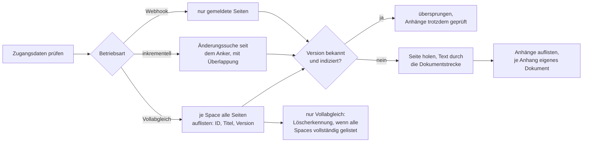

# Konnektor: Confluence (CONFLUENCE)

> **Entwurf.** Dieses Kapitel beschreibt den Konnektor für Confluence Cloud und Confluence Data
> Center. Der gemeinsame Ablauf eines Indexierungslaufs und die Dokumentstrecke stehen im Kapitel
> [Indexierung](indexierung.md); die Aufbereitung des Seiteninhalts im Kapitel
> [Confluence-Seite](format-confluence.md).

**Kurzfassung für den eiligen Betrieb**

1. Selbst betriebene Instanz im privaten Netz? Hostnamen in `OPAA_INDEXING_TARGET_VALIDATION_ALLOWLIST`
   eintragen (Abschnitt 4.1).
2. Ein Dienstkonto je Leserkreis; Token (Cloud: E-Mail plus API-Token, Data Center: Personal Access
   Token) nur mit Leserecht auf die gewünschten Spaces.
3. Bibliothek anlegen: Adresse eingeben, „Edition erkennen", Zugangsdaten, „Verbindung testen",
   Spaces auswählen. Alles aus den gewählten Spaces ist für **alle** Leseberechtigten der Bibliothek
   sichtbar.
4. Zeitplan setzen. Der Konnektor läuft inkrementell und regelmäßig als Vollabgleich; nur der
   Vollabgleich entfernt, was in Confluence nicht mehr existiert.
5. Optional Webhook einrichten (Geheimnis in OPAA erzeugen, in Confluence hinterlegen).
6. Im Laufprotokoll auf „nicht lesbar", „Ratenbegrenzung" und „unvollständig, wird fortgesetzt"
   achten.

## 1. Wofür er gedacht ist

Eine Confluence-Bibliothek zeigt auf **eine** Instanz (Cloud oder Data Center), mit **einem** Token
und einer **Auswahl von Spaces** (bis zu 500). Indiziert werden die **aktuellen Seiten** dieser Spaces
und ihre **Anhänge** in den unterstützten Dateiformaten. Nicht indiziert werden Blogbeiträge,
Kommentare, Whiteboards, Datenbanken, archivierte Seiten und der Papierkorb.

Anders als die drei anderen Konnektoren liest er kein Verzeichnis und keine Liste, sondern spricht
mit einer Anwendung, die eigene Rechte, eigene Versionsnummern und eine eigene Ratenbegrenzung hat.
Das prägt drei Dinge: Es gibt zwei **Betriebsarten** (Vollabgleich und inkrementell), ein
**Anfragebudget** je Lauf und einen **Webhook-Eingang** für Änderungen in Sekunden statt Stunden.

Jedes Dokument trägt Space, Gliederungspfad (die Titel der übergeordneten Seiten), Seitentitel,
Versionsnummer und die titelfreie Confluence-Adresse; die Fundstelle im Chat verlinkt auf die Seite
bzw. den Anhang in Confluence.

**Rechte werden nicht abgebildet.** Was das Token lesen darf und in der Auswahl liegt, sehen alle
Leseberechtigten der Bibliothek. Abschnitt 14 sagt, was daraus für den Zuschnitt folgt.



## 2. Quellkonfiguration

| Feld der Bibliothek | Regel |
|---|---|
| Adresse (`sourceUrl`) | Pflicht. Cloud mit oder ohne `/wiki`; Data Center einschließlich Kontextpfad, etwa `https://wiki.behoerde.example/confluence`. |
| Edition (`sourceConfluenceEdition`) | Pflicht, `CLOUD` oder `DATA_CENTER`. Wird beim Anlegen erkannt und ist danach unveränderlich; eine migrierte Instanz wird als neue Bibliothek angelegt. |
| Zugangsdaten (`sourceCredentials`) | Pflicht. Cloud: `<E-Mail>:<API-Token>`; Data Center: Personal Access Token. Verschlüsselt gespeichert, in keiner API-Antwort sichtbar. |
| Space-Auswahl (`confluenceSpaces`) | Pflicht, mindestens ein Space, höchstens 500. Später änderbar; jede Änderung erzwingt beim nächsten Lauf einen Vollabgleich. |
| Proxy (`sourceProxy`) | optional, `host:port`. Der Proxy-Host unterliegt derselben Zieladressprüfung wie die Instanz. |
| Zertifikatsprüfung aussetzen (`sourceInsecureSsl`) | optional, nur für Testinstanzen. Ein eigenes Zertifikat der Behörden-CA gehört in den Truststore des Backend-Containers (siehe [Deployment](deployment.md)). |
| Vollabgleich-Rhythmus (`confluenceFullSyncIntervalDays`) | optional, 1 bis 365 Tage, im Zeitplan-Dialog („Vollabgleich alle … Tage"); leer bedeutet die instanzweite Vorgabe (Standard sieben Tage). |
| Webhook-Geheimnis | optional, in OPAA erzeugt (Abschnitt 8). |

**Anlagedialog.** Die Reihenfolge ist Adresse eingeben, „Edition erkennen", Zugangsdaten im Format
der erkannten Edition, „Verbindung testen", Spaces auswählen. Die Auswahl zeigt nur, was das Token
lesen darf. Über der Auswahl steht der Hinweis, den auch dieses Kapitel wiederholt: Alles, was aus
den gewählten Spaces indiziert wird, sehen alle Leseberechtigten der Bibliothek.

**Sichtbarkeit.** Jede Leseberechtigung sieht Edition und ausgewählte Spaces. Adresse, Proxy und
Webhook-Zustand sehen nur Verwaltende (Rolle MANAGER oder Eigentümer), ebenso das Laufprotokoll.

### 2.1 Confluence Cloud

- **Token-Art:** E-Mail-Adresse des Kontos plus **API-Token** (Atlassian-Konto, Sicherheit,
  API-Token; ein klassisches, nicht bereichsbeschränktes Token). OPAA sendet beides als HTTP Basic.
- **Minimale Berechtigungen:** eine Confluence-Lizenz auf der Site und **Ansehen** auf jedem Space
  der Auswahl. Kein Site-Admin, kein Space-Admin.
- **Erkennung:** OPAA erkennt die Edition ohne Zugangsdaten am Antwortverhalten der Instanz, nicht
  am Hostnamen; eine Cloud-Site hinter eigener Domain wird ebenso erkannt.
- **Ratenbegrenzung:** Cloud rechnet mit einem Punktebudget je Site und antwortet mit HTTP 429;
  OPAA wartet (Abschnitt 4.3). Zwei Bibliotheken gegen dieselbe Site mit demselben Dienstkonto
  teilen sich dieses Budget.

### 2.2 Confluence Data Center

- **Token-Art:** **Personal Access Token** des Kontos (Profil, Personal Access Tokens), gesendet als
  `Bearer`. Ein Ablaufdatum setzen und im Betriebskalender führen: Ein abgelaufenes Token macht die
  Bibliothek nicht kaputt, aber jeder Lauf schlägt sichtbar fehl.
- **Minimale Berechtigungen:** **Ansehen** auf jedem Space der Auswahl; das Konto muss sich per REST
  anmelden dürfen (kein reines UI-Konto hinter einem SSO, das keine Tokens zulässt).
- **Besonderheit:** Data Center **weist ein ungültiges Token nicht ab**, sondern beantwortet
  Anfragen anonym mit dem, was anonym sichtbar ist, oft nichts. OPAA prüft deshalb vor jedem Lauf
  und im Verbindungstest, als wer die Instanz das Token sieht; ein anonym beantwortetes Token wird
  als „nicht angenommen" gemeldet, nie als leere Instanz.
- **Kontextpfad:** Eine Instanz unter `https://wiki.behoerde.example/confluence` wird mit genau
  dieser Adresse eingetragen.

### 2.3 Dienstkonten-Zuschnitt

- **Ein Dienstkonto je Leserkreis, nicht je Bibliothek.** Das Token bestimmt die Obergrenze dessen,
  was in die Bibliothek gelangen kann; die Space-Auswahl grenzt darunter ein. Ein Konto, das alles
  lesen darf, mit einer schmalen Auswahl zu kombinieren, funktioniert, aber ein Fehlgriff in der
  Auswahl legt dann Inhalte offen, die ein schmaleres Konto gar nicht hätte liefern können.
- **Kein persönliches Konto.** Ein persönliches Token trägt die Rechte einer Person und verfällt mit
  ihrem Austritt; die Bibliothek fällt dann aus.
- **Token je Bibliothek.** OPAA kennt keine geteilte Verbindung; wer ein Token rotiert, das in fünf
  Bibliotheken steht, rotiert es fünfmal (Bibliothek, Quellkonfiguration, Bearbeiten). Ein
  Rotationskalender mit Bibliotheksliste je Token erspart die Suche.
- **Webhook-Geheimnis** ebenfalls je Bibliothek (Abschnitt 8); es ist ein zweites Geheimnis, kein
  Ersatz für das Token.

## 3. Zugriff

| Eigenschaft | Verhalten |
|---|---|
| Zugriffsschicht | je Edition ein eigener Adapter: Cloud über `/wiki/api/v2` (Cursor-Paginierung) und die v1-Suche für CQL; Data Center über `/rest/api` (Offset-Paginierung). Läufe, Verbindungstest und Space-Liste sehen dieselbe Schnittstelle. |
| Authentifizierung | Cloud HTTP Basic, Data Center Bearer; die Zugangsdaten erreichen nie eine Fehlermeldung oder ein Protokoll |
| Zugangsdaten vor dem ersten Lauf | jeder Lauf prüft zuerst, ob die Instanz das Token annimmt (Cloud: Space-Liste, Data Center: angemeldetes Konto); eine anonym beantwortete Anfrage beendet den Lauf, bevor irgendetwas aufgelistet wird |
| User-Agent | gemeinsam für alle Netzkonnektoren konfigurierbar (`opaa.indexing.http.user-agent`), Standard `OPAA-Indexer/1.0` |
| Timeouts | 30 s je JSON-Anfrage, 10 s je Sonde der Editionserkennung, 120 s je Anhangs-Download, 30 s Verbindungsaufbau |
| Paginierung | folgt dem `next`-Link der Instanz bis zum Ende; höchstens 500 Seiten je Auflistung (Standard), danach Abbruch mit sichtbarem Fehler, nie stilles Abschneiden |
| Weiterleitungen | JSON-Aufrufe: ein fremder Ursprung wird abgelehnt. Anhangs-Downloads: eine Weiterleitung auf einen fremden Host (Cloud liefert Anhänge von einem vorsignierten Medien-Host) wird gefolgt, aber ohne Zugangsdaten. Ein `next`-Link oder Download-Link, der die Instanz verlässt, wird abgelehnt. |
| Wiederholung | nur bei HTTP 429 (Abschnitt 4.3); andere Fehlerstatus, etwa 503 im Wartungsfenster, werden nicht wiederholt |
| Wartezeit zwischen Anfragen | keine; das Anfragebudget und die Ratenbegrenzung der Instanz begrenzen den Lauf |

## 4. Schutzmechanismen

### 4.1 Zieladressprüfung

Alle Abrufe, Indizierungsläufe **und** der Verbindungstest, durchlaufen dieselbe Zieladressprüfung
wie beim [Webverzeichnis](konnektor-http-directory.md#41-zieladressprüfung): Ziele in lokalen,
privaten oder nicht routbaren Adressbereichen werden abgelehnt, auch nach einer Weiterleitung. Ein
selbst betriebenes Data Center steht praktisch immer in einem solchen Bereich.

Die Prüfung **nicht abschalten**, sondern den Hostnamen der Instanz ausnehmen:

```env
# .env / .env.docker: exakter Hostname, ohne Schema und Pfad, kommagetrennt bei mehreren
OPAA_INDEXING_TARGET_VALIDATION_ALLOWLIST=wiki.behoerde.example
```

Der Eintrag gilt für alle Bibliotheken gegen diese Adresse. Ein fehlender Eintrag zeigt sich beim
Verbindungstest als abgewiesenes Ziel, nicht als Token-Fehler; die Meldung nennt die Einstellung.
**Auch der Proxy-Hostname unterliegt der Prüfung**; ein interner Proxy muss ebenfalls in der Liste
stehen.

### 4.2 Größen- und Mengengrenzen

| Grenze | Standard | Bei Überschreitung |
|---|---|---|
| JSON-Antwort | 10 MiB | Anfrage scheitert |
| Anhang | 20 MiB | nur dieser Anhang entfällt, Protokolleintrag „Anhang überschreitet die Größengrenze" |
| Seiten je Auflistung | 500 (bei Seitengröße 100 also 50.000 Einträge) | Auflistung wird abgebrochen und als Fehler gemeldet; ein Vollabgleich gilt dann als unvollständig und bereinigt nichts |
| Anfragen je Lauf | 50.000 | Lauf endet geordnet als „unvollständig, wird fortgesetzt" (Abschnitt 6.3) |
| Spaces je Bibliothek | 500 | wird beim Anlegen abgewiesen |

### 4.3 Ratenbegrenzung der Instanz (HTTP 429)

Antwortet Confluence mit 429, **wartet** der Lauf die in `Retry-After` genannte Zeit (gedeckelt
auf zwei Minuten; ohne den Header fünf Sekunden) und wiederholt die Anfrage, bis zu sechsmal in
Folge. Danach bricht der Lauf mit einer klaren Meldung ab. Ein gebremster Lauf ist **kein Fehler**:
Das Protokoll enthält eine Zeile der Kategorie „Ratenbegrenzung" mit Anzahl und Gesamtwartezeit,
egal wie der Lauf endet. Cloud bremst nach einem Punktebudget je Site; mehrere Bibliotheken gegen
dieselbe Site bremsen einander. Data Center bremst im Auslieferungszustand nicht; dort ist das
Anfragebudget die einzige Grenze.

## 5. Betriebsarten

Ein Confluence-Lauf hat, anders als bei den übrigen Konnektoren, eine **Betriebsart**. Sie steht am
Lauf und entscheidet, ob der Lauf löschen darf.

| Betriebsart | Was passiert | Wann |
|---|---|---|
| **Vollabgleich** (`FULL`) | Alle gewählten Spaces vollständig auflisten, Neues und Geändertes holen, am Ende entfernen, was in der Auflistung fehlt | erster Lauf; nach jeder Änderung der Space-Auswahl oder der Adresse; nach einem unterbrochenen Vollabgleich; sobald der letzte Vollabgleich älter ist als der Rhythmus; manuell über „Vollabgleich starten" |
| **Inkrementell** (`INCREMENTAL`) | Per Änderungssuche nur die seit dem Anker geänderten Seiten holen; nie wegen Abwesenheit löschen | jeder andere geplante Lauf und „Jetzt indizieren" |
| **Webhook** (Auslöser „per Webhook") | Nur die gemeldeten Seiten gezielt holen; bei einem übergroßen Stapel die Betriebsart, die der Zustand vorgibt | wenige Sekunden nach einer Benachrichtigung (Abschnitt 8) |

„Jetzt indizieren" folgt dem Zustand der Bibliothek; „Vollabgleich starten" erzwingt den
Vollabgleich. Der Vollabgleich bleibt nötig, weil nur er Löschungen nachvollzieht; sein Rhythmus ist
verlängerbar, nicht abschaltbar. Eine Bibliothek über einem Space mit 50.000 Seiten darf seltener
vollständig abgleichen als eine über einem Team-Space.

**Anker des inkrementellen Abgleichs.** Der Anker ist der Startzeitpunkt des letzten erfolgreichen
Laufs, nicht sein Ende, damit Änderungen während des Laufs nicht verloren gehen. Das Suchfenster
geht mit einer Überlappung nach hinten (Standard zehn Minuten) als relative Angabe an die Instanz,
die es in ihrer eigenen Uhr auswertet; Uhrenversatz und die Minutengenauigkeit der Suche werden so
abgefangen. Eine erneut gefundene, unveränderte Seite kostet nur einen Auflistungseintrag. Der Anker
rückt nur vor, wenn der Lauf keine Seite als fehlgeschlagen gezählt hat.

## 6. Aufzählung und Wiederaufnahme

### 6.1 Vollabgleich

Je Space werden alle aktuellen Seiten aufgelistet, nur Kennung, Titel, Version und Elternseite, nie
der Inhalt. Eine Seite, deren Version dem gespeicherten Wert entspricht und die zuletzt erfolgreich
indiziert wurde, wird ohne Abruf übersprungen; ihre Anhangsliste wird trotzdem geholt, weil Anhänge
die Versionsnummer einer Seite nicht erhöhen. Alle anderen Seiten werden einzeln geholt.

Ein Space, den das Token nicht auflisten darf (HTTP 403 oder 404), macht die Auflistung
**unvollständig**: Er wird im Protokoll benannt, sein Bestand bleibt unverändert, und der Lauf
bereinigt am Ende nichts. Derselbe Befund bleibt an der Bibliothek dauerhaft sichtbar, bis ein
späterer Vollabgleich ihn aufhebt.

### 6.2 Inkrementell

Die Änderungssuche liefert die seit dem Anker geänderten Seiten der gewählten Spaces mit Version und
Space. Eine Seite, die in einen nicht gewählten Space verschoben wurde, wird protokolliert und
liegen gelassen; ihr bisheriger Stand bleibt bis zum nächsten Vollabgleich. Eine Seite, die zwischen
zwei gewählten Spaces umgezogen ist, bekommt bei Cloud eine neue Adresse: Das Dokument unter der
alten Adresse wird entfernt, weil die Instanz selbst sagt, wo die Seite jetzt liegt.

### 6.3 Anfragebudget und Wiederaufnahme

Das Anfragebudget (Standard 50.000, Wiederholungen nach 429 und Anhangs-Downloads eingerechnet)
begrenzt die Dauer eines einzelnen Laufs. Ist es erschöpft, endet der Lauf **geordnet**: Status
„abgeschlossen" mit dem Chip **„unvollständig, wird fortgesetzt"** und einem Protokolleintrag
„Anfragebudget erschöpft", der nennt, wo der nächste Lauf ansetzt.

- **Vollabgleich:** Der Fortschritt je Space ist gespeichert, auch über einen Neustart hinweg; der
  nächste Lauf beginnt mit den offenen Spaces. Ein angebrochener Space wird erneut aufgelistet; eine
  bereits in der aufgelisteten Version gespeicherte Seite kostet dabei keinen Abruf und auch keine
  Anhangsliste. So konvergiert die Kette der Wiederaufnahmeläufe. Ein unvollständiger Vollabgleich
  **bereinigt nichts**. Hat ein Lauf trotz erschöpftem Budget keine Seite neu aufgenommen, steht
  das als Fehler im Protokoll („reicht für diese Bibliothek nicht aus"): Budget anheben oder Auswahl
  aufteilen.
- **Inkrementell:** Der Anker bleibt stehen; der nächste Lauf durchsucht dasselbe Fenster erneut.
- **Webhook-Lauf:** Die übrigen gemeldeten Seiten nimmt der nächste Lauf auf.

**Faustregel zur Größe.** Eine Seite kostet etwa zwei Anfragen (Inhalt, Anhangsliste) plus ihre
Anhangs-Downloads und einen Anteil der Auflistung (100 Seiten je Anfrage). 50.000 Anfragen decken
damit rund 20.000 Seiten je Lauf. Eine Auswahl von 100.000 Seiten braucht für den ersten
Vollabgleich also etwa fünf Läufe, bei täglichem Zeitplan eine Arbeitswoche; danach sind
inkrementelle Läufe klein. Das Budget muss die Auflistung eines Spaces plus eine Handvoll Seiten
übersteigen, sonst kommt kein Lauf voran. Verbindungstest und Editionserkennung zählen nicht
dagegen; `0` schaltet das Budget ab.

## 7. Änderungserkennung

Drei Stufen, von billig nach teuer:

1. **Versionsnummer.** Seiten und Anhänge tragen in Confluence eine Version. Ist sie unverändert und
   war das Dokument zuletzt erfolgreich indiziert, entfällt der Abruf.
2. **Prüfsumme** über den Seiteninhalt bzw. die Anhangsbytes, wie bei jeder Quelle. Eine Seite mit
   neuer Version, aber unverändertem Inhalt (Titeländerung, Umzug, umbenannte Elternseite) behält
   ihre Chunks; Titel, Gliederungspfad und Versionsmarke werden trotzdem aktualisiert.
3. **Änderungssuche** (nur inkrementell), siehe Abschnitt 5.

## 8. Webhooks

Webhooks verkürzen die Zeit bis zur Aufnahme einer Änderung von „nächster geplanter Lauf" auf
wenige Sekunden. Sie ersetzen weder Zeitplan noch Vollabgleich: **Ohne Webhook ist nichts falsch,
nur später.**

### 8.1 Geheimnis in OPAA erzeugen

Bibliothek, Quellkonfiguration (Verwaltende), Zeile **Webhook**, **„Webhook einrichten"**. OPAA
zeigt das Geheimnis **genau einmal** zusammen mit der Adresse des Eingangs
(`https://<opaa-host>/api/v1/libraries/<Bibliotheks-ID>/confluence-webhook`). Beides jetzt in
Confluence hinterlegen; danach ist das Geheimnis nur noch als „eingerichtet" sichtbar. „Geheimnis
neu erzeugen" rotiert (das alte gilt sofort nicht mehr), „Webhook entfernen" schließt den Eingang.
Beide Aktionen fragen nach, denn Confluence merkt nichts davon, wenn OPAA seine Nachrichten abweist.
Jede Änderung steht im Audit-Protokoll mit dem Feldnamen `confluenceWebhookSecret`, nie mit dem
Wert.

Der Eingang muss für die Instanz erreichbar sein (Firewall- oder Proxy-Regel von Confluence zu
OPAA). Er ist einer der wenigen Pfade unter `/api/v1`, die ohne Anmeldung erreichbar sind, und der
einzige schreibende; die Nachricht weist sich mit dem Geheimnis aus. Der vorgelagerte Proxy **muss**
`X-Forwarded-For` autoritativ setzen (siehe [Deployment](deployment.md)), sonst greift die
Ratenbegrenzung je Client nicht.

### 8.2 Data Center (nativ, signiert)

1. Confluence-Administration, Webhooks, Webhook erstellen.
2. **URL:** die von OPAA angezeigte Adresse.
3. **Secret:** das von OPAA angezeigte Geheimnis. Confluence signiert damit jede Nachricht
   (`X-Hub-Signature: sha256=<HMAC-SHA256 über den Rohkörper>`); OPAA prüft die Signatur.
4. **Ereignisse:** Seite erstellt, aktualisiert, entfernt, in den Papierkorb verschoben,
   wiederhergestellt; Anhang erstellt, aktualisiert, entfernt. Andere Ereignisse darf man mitsenden;
   OPAA ignoriert alles ohne Seitenkennung.
5. **Aktiv** setzen und speichern.

Probe: In einem gewählten Space eine Seite bearbeiten; wenige Sekunden später erscheint in der
Laufhistorie ein Lauf „per Webhook" mit genau dieser Seite. Ohne Lauf: Abschnitt 13.

### 8.3 Cloud (über eine Automation-Regel)

Umfang und Kontingent der Automation hängen vom Atlassian-Tarif ab; vor der Einrichtung im eigenen
Tarif prüfen. Cloud bietet keine frei konfigurierbaren Webhooks ohne App; der Weg ist eine
**Automation-Regel** (Space-Einstellungen, Automation, oder global):

1. **Auslöser:** „Seite veröffentlicht" und „Seite aktualisiert" (nach Bedarf auch „Seite
   archiviert/gelöscht"; OPAA entscheidet ohnehin am Abruf).
2. **Aktion:** „Web-Anfrage senden" mit der Adresse aus OPAA, Methode `POST`, Body als
   benutzerdefinierte Daten:
   ```json
   {"pageId": "{{page.id}}"}
   ```
3. **Header:** `X-OPAA-Webhook-Secret` mit dem Geheimnis aus OPAA. Cloud-Regeln können nicht
   signieren; der Header trägt das Geheimnis selbst, deshalb nur über TLS.
4. Regel aktivieren; ein Test über „Regel ausführen" genügt als Probe.

Eine site-weite Regel genügt für mehrere Spaces: Seiten außerhalb der Auswahl protokolliert OPAA als
„liegt in einem nicht ausgewählten Space" und lässt sie liegen.

### 8.4 Was eine Nachricht auslöst

- Aus dem Körper werden **nur Seitenkennungen** gelesen (`page.id`, `content.id`,
  `attachment.pageId`, `attachment.container.id`, `pageId`, `pageIds`); die Ereignisart wird nicht
  ausgewertet. Was mit der Seite geschah, sagt der Abruf: geändert, dann neu indiziert; von der
  Instanz als im Papierkorb ausgewiesen, dann entfernt; 404 oder 403, dann unverändert.
- Nachrichten werden je Bibliothek **gesammelt** (Standard fünf Sekunden) und in **einem** kurzen
  Lauf geholt. Mehr als 200 Seiten in einem Stapel ergeben statt Einzelabrufen einen gewöhnlichen
  Lauf in der Betriebsart, die der Zustand vorgibt.
- Läuft für die Bibliothek gerade ein Lauf, wartet der Stapel bis zu 120 Sammelzeiten (zehn Minuten)
  und wird dann **verworfen**: Der nächste geplante Lauf deckt dieselben Seiten ab. Ein Verwerfen
  kostet Aktualität, nie Korrektheit.
- Der **Anker des inkrementellen Abgleichs bewegt sich nicht**; der nächste inkrementelle Lauf liest
  die gemeldeten Seiten noch einmal, je ein Auflistungseintrag.
- **Kein Replay-Schutz:** Eine mitgeschnittene, gültig signierte Nachricht lässt sich wieder
  einspielen und kostet je einen gezielten Lauf innerhalb der Ratenbegrenzung; für den Index ist das
  folgenlos.
- Jede nicht authentifizierte Anfrage (unbekannte Bibliothek, Bibliothek eines anderen Quellentyps,
  kein Geheimnis, falsche Signatur) erhält dieselbe Antwort 401; der Körper ist auf 256 KiB begrenzt
  (413 darüber). Der Eingang ist je Client-Adresse und Bibliothek sowie global ratenbegrenzt (siehe
  [Deployment](deployment.md)).

## 9. Anhänge

Anhänge einer Seite werden je Seite aufgelistet und einzeln über den gemeinsamen Anhangsweg
verarbeitet (siehe [Indexierung](indexierung.md#6-anhänge-ein-dokument-in-einem-dokument)). Jeder
Anhang ist ein eigenes Dokument mit der Seite als Elterndokument und trägt Space und Gliederungspfad
der Seite, ergänzt um deren Titel. Ein unveränderter Anhang (gleiche Version) wird vor dem Download
übersprungen. Ein nicht unterstütztes Format wird als „Format nicht unterstützt" protokolliert und
gilt bei der Löscherkennung als vorhanden.

Anhänge werden auch für Seiten geprüft, die selbst unverändert übersprungen wurden, mit einer
Ausnahme: In einem wiederaufgenommenen Vollabgleich kostet ein bereits abgearbeiteter Space nichts
mehr; neue Anhänge an unveränderten Seiten kommen dann mit dem nächsten vollständigen Vollabgleich.
Eine Seite ohne Text (etwa nur Formulare) bekommt keine eigene Dokumentzeile; ihre Anhänge werden
trotzdem indiziert.

## 10. Ordner

Keine Ordnerspiegelung. Die Gliederung der Seiten liegt am Dokument als Space und Gliederungspfad
und wird in Zitat, Protokoll und Chunk-Kontext verwendet; eine Navigation entlang der
Seitenhierarchie gibt es in der Bibliothek nicht.

## 11. Löscherkennung

**Ein Dokument wird nur entfernt, wenn die Instanz selbst den Befund liefert.** Konkret:

- Der **Vollabgleich** entfernt am Ende, was in der vollständigen Auflistung fehlt, aber nur, wenn
  die Auflistung vollständig war. Konnte ein Space oder eine Anhangsliste nicht gelesen werden,
  bleibt der gesamte Bestand stehen, und das Protokoll sagt es.
- Eine Seite, die die Instanz beim Einzelabruf **als im Papierkorb** ausweist, wird mitsamt Anhängen
  entfernt, in jeder Betriebsart.
- Ein **404 oder 403** beim Einzelabruf entfernt **nichts**: Der bisherige Stand bleibt, bis der
  nächste Vollabgleich über die Auflistung entscheidet. Ein Rechteentzug oder ein Token-Fehler leert
  den Index nie stillschweigend.
- Ein **Webhook** ist ein Anlass zur Prüfung, kein Befund.
- Der **inkrementelle Lauf** bereinigt nie durch Abwesenheit.

Ein entzogenes Leserecht wirkt also **verzögert**: Der Bestand eines nicht mehr lesbaren Spaces
bleibt sichtbar, bis eine Verwalterin den Space aus der Auswahl nimmt oder das Recht zurückkommt und
der Vollabgleich entscheidet. Wer den Bestand eines Spaces aus OPAA entfernen will, geht in drei
Schritten vor: den Space aus der Auswahl nehmen (das löscht nur den Synchronisationszustand, noch
kein Dokument), dann „Vollabgleich starten", und prüfen, dass dieser Lauf vollständig aufgelistet hat.
**Sofort** wirkt nur das Löschen der Dokumente bzw. der Bibliothek.

## 12. Protokoll und Kennzahlen

### 12.1 Protokolleinträge dieses Konnektors

| Kategorie | Meldung | Situation und Abhilfe |
|---|---|---|
| abgewiesen | Seite „…" (Space …) ist für das hinterlegte Dienstkonto nicht lesbar oder nicht mehr vorhanden, übersprungen; der bereits indizierte Stand bleibt erhalten | 404 oder 403 beim Einzelabruf. Nichts, wenn gewollt; sonst Rechte des Dienstkontos prüfen |
| abgewiesen | Space … ist für das hinterlegte Dienstkonto nicht lesbar; sein Bestand bleibt bis zur nächsten vollständigen Auflistung unverändert | ganzer Space nicht auflistbar. Rechte prüfen oder Space aus der Auswahl nehmen; solange das steht, bereinigt kein Vollabgleich |
| abgewiesen | … liegt in einem nicht ausgewählten Space; der bisherige Stand bleibt bis zum nächsten Vollabgleich | verschoben oder per Webhook außerhalb der Auswahl gemeldet |
| nicht erreichbar | Meldung der Zugriffsschicht (Zeitüberschreitung, Verbindung abgelehnt, TLS, HTTP-Status) | Instanz, Proxy, Allowlist prüfen; die Seite zählt als fehlgeschlagen, der Anker rückt nicht vor |
| nicht erreichbar | Anhänge nicht auflistbar: … | die Auflistung gilt als unvollständig, kein Vollabgleich bereinigt |
| in der Quelle entfernt | In der Quelle nicht mehr gefunden, entfernt / In Confluence im Papierkorb, entfernt / In Confluence in einen anderen Space verschoben, alter Stand entfernt | positiver Befund |
| Ratenbegrenzung | Confluence hat den Lauf n-mal gedrosselt (Retry-After); der Lauf hat insgesamt … Sekunden gewartet statt abzubrechen | eine Zeile je Lauf; bei Häufung Zeitpläne entzerren |
| Anfragebudget erschöpft | Anfragebudget von … Anfragen erschöpft; der Lauf endet unvollständig, … | der nächste Lauf setzt fort; bei Dauerzustand Abschnitt 6.3 |
| Fehler | Das Anfragebudget von … Anfragen reicht für diese Bibliothek nicht aus … | Budget anheben oder Auswahl aufteilen |
| Fehler | Abgleich des Bestands fehlgeschlagen; der nächste Lauf holt ihn nach | Datenbankfehler beim Bereinigen; der Vollabgleich gilt als nicht abgeschlossen |
| Format nicht unterstützt | Kein Inhalt extrahierbar | Seite ohne Text |
| Format nicht unterstützt / Formatabweichung / abgewiesen / Fehler (Anhang) | wie im gemeinsamen Anhangsweg, dazu „Anhang überschreitet die Größengrenze" | erwartbar bei Bildern; Fehler bei Häufung im Backend-Log nachsehen |
| abgewiesen | Speicherkontingent-Meldung / kein extrahierbarer Text | wie bei jeder Quelle |

Scheitert der Lauf als Ganzes, nennt die Fehlermeldung die Ursache: Token nicht angenommen (Data
Center: „anonym"), Edition passt nicht zur Adresse, Auflistung über der Seitengrenze, Ratenbegrenzung
nach sechs Wartezyklen, „Ein inkrementeller Abgleich braucht einen abgeschlossenen Vollabgleich",
Konfiguration ohne Edition, „Die Bibliothek wurde während des Laufs gelöscht."

### 12.2 Kennzahlen lesen

Jeder Lauf zeigt in der Laufhistorie Status, Zeitpunkt, Auslöser („manuell gestartet", „per
Zeitplan", „per Webhook"), Zähler (verarbeitet, übersprungen, fehlgeschlagen), Betriebsart, ggf.
„unvollständig, wird fortgesetzt" und die Zahl der Protokolleinträge; aufgeklappt eine
**Kennzahlenzeile**:

> 1842 Anfragen an die Quelle · 3-mal gedrosselt (95 s gewartet) · Anhänge: 120 indiziert, 800
> übersprungen, 2 fehlgeschlagen · Dauer 42 min 10 s

- **Anfragen geteilt durch Dauer** ist der Durchsatz. Sinkt er bei gleichbleibender Instanz, wird
  gebremst oder das Netz ist der Engpass.
- **Anfragen gegen das Budget:** Liegt ein Vollabgleich regelmäßig nah am Budget und endet
  unvollständig, ist die Auswahl für einen Lauf zu groß.
- **Übersprungene Anhänge** sind normal (unverändert, nicht unterstütztes Format); **fehlgeschlagene**
  nennt das Protokoll einzeln.
- **Drosselungen** auf Cloud: häufig und lang bedeutet Läufe verschiedener Bibliotheken gegen
  dieselbe Site zeitlich entzerren.

Eine entsprechende Zeile steht je Lauf im Backend-Log (`Confluence run … requests, … throttles
(… s waited), … attachments indexed, … s elapsed, incomplete=…`) für Auswertungen über viele Läufe.

## 13. Fehlerbehebung

| Symptom | Wahrscheinliche Ursache | Prüfung / Abhilfe |
|---|---|---|
| Verbindungstest: Ziel abgewiesen, obwohl die Instanz erreichbar ist | Zieladressprüfung blockt die private Adresse | Hostname in `OPAA_INDEXING_TARGET_VALIDATION_ALLOWLIST`, Backend neu starten |
| „Edition erkennen" findet kein Confluence | falscher Pfad (Kontextpfad fehlt), Proxy nötig, Instanz hinter Anmeldung ohne REST-Zugang | Adresse mit Kontextpfad; Proxy eintragen (und seinen Hostnamen in die Allowlist aufnehmen); `curl <adresse>/rest/api/space?limit=1` aus dem Backend-Netz |
| Data Center: Verbindungstest meldet Token „nicht angenommen", obwohl es im Browser geht | Token ungültig oder abgelaufen, oder das Konto darf REST nicht nutzen; Data Center antwortet anonym | neues Token; Rechte des Kontos prüfen |
| Verbindungstest gut, aber Space-Auswahl leer | Konto hat auf keinen Space „Ansehen" | Space-Rechte des Dienstkontos setzen |
| Läufe enden ständig „unvollständig, wird fortgesetzt", Bestand wächst aber | sehr große Auswahl, erster Vollabgleich braucht mehrere Läufe | normal; abwarten oder Budget anheben |
| Läufe enden unvollständig **mit** Fehler „reicht für diese Bibliothek nicht aus" | Budget kleiner als die Auflistung eines Spaces plus einige Seiten | Budget anheben oder Auswahl aufteilen |
| Läufe brechen mit Ratenbegrenzung ab | mehr als sechs aufeinanderfolgende 429; Cloud-Punktebudget durch parallele Läufe erschöpft | Zeitpläne entzerren; Wiederholungen oder Wartezeit anheben |
| Webhook: kein Lauf nach einer Änderung | Eingang von Confluence aus nicht erreichbar; Geheimnis falsch (Confluence erhält 401); Ereignis ohne Seitenkennung; Stapel wartet auf laufenden Lauf | Backend-Log „Rejected Confluence webhook … not authenticated", dann Geheimnis neu erzeugen und in Confluence eintragen; Erreichbarkeit vom Confluence-Host prüfen; Laufhistorie auf laufenden Lauf prüfen |
| Webhook: 413 | Nachricht größer als 256 KiB | Body der Automation-Regel auf die Seitenkennung beschränken |
| Webhook: 429 | Ratenbegrenzung je Client-Adresse und Bibliothek | `OPAA_RATE_LIMIT_WEBHOOK_*` anheben; `X-Forwarded-For` am Proxy prüfen |
| Ein gelöschter Space ist noch im Index | Space noch in der Auswahl, Auflistung nicht lesbar, kein Vollabgleich bereinigt | Space aus der Auswahl nehmen (erzwingt Vollabgleich) |
| Nach Token-Rotation läuft nichts mehr | altes Token in weiteren Bibliotheken | jede Bibliothek gegen diese Instanz einzeln aktualisieren |

Signatur eines Webhook-Tests von Hand (Data-Center-Format):

```bash
BODY='{"event":"page_updated","page":{"id":"102"}}'
SIG=$(printf '%s' "$BODY" | openssl dgst -sha256 -hmac "<geheimnis>" | sed 's/^.* //')
curl -i -X POST "https://<opaa-host>/api/v1/libraries/<id>/confluence-webhook" \
  -H "Content-Type: application/json" -H "X-Hub-Signature: sha256=$SIG" --data "$BODY"
# 202 Accepted = angenommen; 401 = Geheimnis/Signatur falsch oder Bibliothek ohne Webhook
```

## 14. Grenzen des Konnektors

- **Freigabefolge der gemeinsamen Bibliothek.** Alles Indizierte ist für jede Leseberechtigung der
  Bibliothek sichtbar, unabhängig von ihren Confluence-Rechten. Der Zuschnitt (Dienstkonto, Auswahl,
  Leserkreis der Bibliothek) ist die einzige Steuerung.
- **Keine Rechteabbildung.** Confluence-Gruppen oder Space-Berechtigungen werden nicht auf
  OPAA-Rechte abgebildet; ein Rechteentzug wirkt verzögert (Abschnitt 11).
- **Nur Seiten und Anhänge.** Keine Blogbeiträge, Kommentare, Whiteboards, Datenbanken, keine
  weiteren Atlassian-Produkte; archivierte Seiten gelten als nicht vorhanden.
- **Anhänge nur mit dem Vollabgleich vollständig.** Ein neuer oder geänderter Anhang an einer sonst
  unveränderten Seite bewegt deren Änderungszeit nicht; der inkrementelle Lauf sieht ihn nicht, der
  Webhook nur, wenn Confluence das Anhangs-Ereignis meldet.
- **Makros:** Zur Laufzeit erzeugte Inhalte fallen weg (siehe [Confluence-Seite](format-confluence.md)).
- **Ratenbudget der Instanz ist geteilt** zwischen allen Bibliotheken gegen dieselbe Instanz mit
  demselben Dienstkonto; eine instanzweite Koordination der Läufe gibt es nicht.
- **Webhooks:** kein Replay-Schutz, keine Bestätigung an Confluence über das Ergebnis, Cloud nur
  über Automation-Regeln.

## 15. Konfiguration

Alle Schlüssel unter `opaa.indexing.confluence.*`, Umgebungsvariablen als
`OPAA_INDEXING_CONFLUENCE_*`; die vollständige Tabelle mit Erläuterungen steht im
[Deployment](deployment.md).

| Schlüssel | Standard | Wirkung |
|---|---|---|
| `page-size` | 100 | Seitengröße jeder Auflistung; Cloud kappt bei 250, Data Center bei 200 |
| `request-timeout` | 30s | Zeitlimit je JSON-Anfrage |
| `detection-timeout` | 10s | Zeitlimit je Sonde der Editionserkennung |
| `max-rate-limit-retries` | 6 | aufeinanderfolgende 429-Antworten, die eine Anfrage abwartet (Confluence-eigener Wert; der `User-Agent` kommt aus `opaa.indexing.http.user-agent`) |
| `max-retry-after` | 2m | Obergrenze einer einzelnen Wartezeit aus `Retry-After` |
| `max-response-bytes` | 10485760 (10 MiB) | Obergrenze je JSON-Antwort |
| `max-attachment-size-bytes` | 20971520 (20 MiB) | Obergrenze je Anhang |
| `max-listing-pages` | 500 | Seiten je Auflistung, bevor sie als unbegrenzt abgebrochen wird |
| `full-sync-interval` | 7d | instanzweite Vorgabe für den Vollabgleich-Rhythmus; je Bibliothek überschreibbar |
| `incremental-overlap` | 10m | Überlappung des Änderungsfensters nach hinten |
| `request-budget-per-run` | 50000 | Anfragen je Lauf; `0` schaltet das Budget ab |
| `webhook.debounce` | 5s | Sammelzeit des Webhook-Eingangs |
| `webhook.max-pending-pages` | 200 | über dieser Stapelgröße ein gewöhnlicher Lauf statt Einzelabrufen |
| `webhook.max-deferrals` | 120 | Wartezyklen, bevor ein Stapel verworfen wird |

Dazu die Ratenbegrenzung des Webhook-Eingangs (`OPAA_RATE_LIMIT_WEBHOOK_MAX_REQUESTS` je
Client-Adresse und Bibliothek, `OPAA_RATE_LIMIT_WEBHOOK_GLOBAL_MAX_REQUESTS`, Fenster in Sekunden)
und die Zieladressprüfung wie in den anderen Kapiteln.

## 16. Zeitplan

Der Zeitplan je Bibliothek ist im Kapitel [Indexierung](indexierung.md#31-auslöser) beschrieben.
Für Confluence ist ein täglicher Zeitplan üblich: Ein inkrementeller Lauf kostet wenige Anfragen;
der Vollabgleich läuft nach seinem eigenen Rhythmus mit. Wer Webhooks eingerichtet hat, kann den
Zeitplan seltener wählen; der Vollabgleich bleibt trotzdem nötig.

## 17. Nicht gebaut

- Abbildung von Confluence-Rechten auf OPAA-Rechte
- Blogbeiträge, Kommentare, Whiteboards, Datenbanken
- Ordner entlang der Seitenhierarchie
- Replay-Schutz und Ergebnisrückmeldung für Webhooks
- Koordination des Ratenbudgets über mehrere Bibliotheken derselben Instanz
