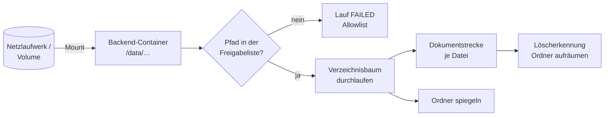

# Konnektor: Verzeichnis im Dateisystem (FILESYSTEM)

> **Entwurf.** Dieses Kapitel beschreibt den Konnektor für Verzeichnisse auf dem Server. Der
> gemeinsame Ablauf eines Indexierungslaufs und die Dokumentstrecke stehen im Kapitel
> [Indexierung](indexierung.md); hier geht es nur um das, was dieser Konnektor anders macht als
> die anderen.

## 1. Wofür er gedacht ist

Der Dateisystemkonnektor liest ein Verzeichnis, das dem Backend-Prozess als lokaler Pfad
sichtbar ist. Typische Fälle sind ein eingebundenes Netzlaufwerk (SMB/NFS-Mount im Container),
ein Ablageverzeichnis, das ein Fachverfahren befüllt, oder ein per Docker-Volume
durchgereichter Ordner. Er ist der einzige Konnektor, der die Ordnerstruktur der Quelle in die
Bibliothek spiegelt.

## 2. Quellkonfiguration

| Feld der Bibliothek | Regel |
|---|---|
| Verzeichnispfad (`sourcePath`) | Pflicht. Absoluter Pfad aus Sicht des Backend-Prozesses, also im Container, nicht auf dem Host. |

Weitere Felder gibt es für diesen Quellentyp nicht. Der Quellentyp einer Bibliothek ist nach dem Anlegen unveränderlich. Der Pfad darf später
geändert werden.

Bereits beim Anlegen oder Ändern wird der Pfad gegen die Freigabeliste geprüft (Abschnitt 4).
Zwei Fehlermeldungen sind dabei möglich: „sourceType FILESYSTEM ist deaktiviert", wenn der
Betrieb gar kein Verzeichnis freigegeben hat, und „sourcePath liegt außerhalb der vom Betrieb
freigegebenen Verzeichnisse", wenn der Pfad nicht unter einem freigegebenen Basisverzeichnis
liegt. Die freigegebenen Verzeichnisse teilt die Systemverwaltung den Bibliotheksverwaltenden
mit; die Oberfläche zeigt sie nicht an.

**Sichtbarkeit:** Der Pfad ist nur für Verwaltende der Bibliothek (Rolle MANAGER oder
Eigentümer) sichtbar. Alle anderen sehen den Hinweis, dass die Verbindungsdaten Verwaltenden
vorbehalten sind. Dieselbe Schwelle gilt für das Laufprotokoll, weil dessen Einträge den Pfad
enthalten.

## 3. Zugriff

Der Konnektor liest ausschließlich lokal. Die Zugriffsrechte sind die des Prozesses im
Container. Eine Datei, die der Prozess nicht lesen darf, erscheint im Protokoll als „Dateiformat
wird nicht unterstützt", weil die Formaterkennung sie nicht öffnen kann.

Daraus folgt die wichtigste Betriebsregel: **Das Backend braucht nur Leserechte.** Ein
Netzlaufwerk sollte schreibgeschützt eingebunden werden.

## 4. Schutzmechanismen

### 4.1 Freigabeliste für Pfade

Der Betrieb legt mit `opaa.indexing.filesystem.allowlist` fest, unter welchen
Basisverzeichnissen Bibliotheken überhaupt lesen dürfen. Ist die Liste leer, ist der Quellentyp
vollständig abgeschaltet. Das ist die Standardeinstellung.

Die Prüfung ist rein lexikalisch: Der Pfad wird normalisiert, dann muss er mit einem der
Basisverzeichnisse beginnen. Ein `../` im Pfad kann nicht ausbrechen. **Symbolische Links werden
dabei nicht aufgelöst.** Ein Link innerhalb des freigegebenen Verzeichnisses, der nach außen
zeigt, würde beim Lesen verfolgt. Deshalb gilt als Betriebsbedingung: Freigegebene Verzeichnisse
dürfen nicht von Endnutzenden beschreibbar sein.

Die Prüfung läuft zweimal, beim Konfigurieren und erneut bei jedem Lauf. Wird die Freigabeliste
nachträglich verengt, scheitert der nächste Lauf einer nun unzulässigen Bibliothek sofort mit
einem Protokolleintrag der Kategorie „Allowlist" und dem Status `FAILED`.

### 4.2 Was es nicht gibt

- **Keine Tiefen- oder Mengenbegrenzung.** Der Verzeichnisbaum wird vollständig durchlaufen.
  Ein Erstlauf über ein großes Netzlaufwerk dauert entsprechend lange; er darf beliebig lange
  laufen, solange er Fortschritt meldet.
- **Keine Dateigrößenbegrenzung im Konnektor.** Wirksam sind die Deckel der Format-Pipelines
  (etwa für Mails, Tabellen und OpenDocument) und das Speicherkontingent der Bibliothek.
- **Keine Ausschlussmuster.** Alles unter dem Pfad wird gelesen. Wer Teile ausnehmen will,
  legt die Bibliothek auf ein Unterverzeichnis oder schließt einzelne Dokumente nachträglich aus.

## 5. Aufzählung

Der Lauf durchläuft den Baum rekursiv und betrachtet alle regulären Dateien.

- **Verzeichnis-Links werden nicht betreten.** Ein symbolischer Link auf ein Verzeichnis gilt
  als Blatt. Links auf einzelne Dateien werden dagegen gelesen.
- **Zulassung nach Inhalt.** Jede Datei wird anhand ihrer ersten Bytes klassifiziert, nicht
  anhand der Endung. Ergebnis ist eine von drei Gruppen: unterstützt, abgewiesen, oder
  unterstützt mit Hinweis, dass Endung und Inhalt nicht zusammenpassen.
- **Keine definierte Reihenfolge.** Die Dateien werden in der Reihenfolge verarbeitet, in der
  das Dateisystem sie liefert.
- **Existiert der Pfad nicht** oder ist er kein Verzeichnis, scheitert der Lauf sofort. Das ist
  bewusst so, damit ein nicht eingebundenes Netzlaufwerk nie als „leerer, erfolgreicher Bestand"
  gewertet wird und Dokumente löscht.

## 6. Änderungserkennung

Der Konnektor hat keine Vorstufe. Jede Datei wird gelesen, ihre SHA-256-Prüfsumme gebildet und
mit dem gespeicherten Wert verglichen. Unveränderte, zuletzt erfolgreich indizierte Dateien
werden übersprungen. Das Lesen aller Dateien in jedem Lauf ist der Preis dafür, dass der
Konnektor ohne Änderungsdatum des Dateisystems auskommt, das auf Netzlaufwerken unzuverlässig
sein kann.

Für Mail-Anhänge hat das eine Folge: Eine unveränderte Mail wird nicht neu ausgepackt. Ein
Anhang, der bei einem früheren Lauf fehlgeschlagen ist, wird erst wieder versucht, wenn sich die
Mail selbst ändert oder ein Pipeline-Nachzug angestoßen wird.

## 7. Ordner

Als einziger Konnektor spiegelt FILESYSTEM heute die Verzeichnisstruktur als Ordner in der
Bibliothek. Nutzende können in der Bibliothek entlang derselben Struktur navigieren wie im
Netzlaufwerk.

| Regel | Verhalten |
|---|---|
| Ordner entstehen nur entlang gefundener Dateien | leere Verzeichnisse erscheinen nicht |
| Ordner sind schreibgeschützt | Anlegen, Umbenennen oder Löschen über die Oberfläche wird für diese Bibliotheken abgewiesen |
| Verschobene Datei | neuer Pfad ist ein neues Dokument im neuen Ordner, alter Pfad wird als entfernt erkannt |
| Verschwundener Ordner | wird am Ende eines erfolgreichen Laufs entfernt, sobald er weder direkt noch in Unterordnern ein Dokument mehr hält |

Das Aufräumen der Ordner läuft nach der Löscherkennung der Dokumente, damit ein im selben Lauf
leer gewordener Ordner sofort verschwindet. Ein Fehler beim Aufräumen der Ordner lässt den Lauf
nicht scheitern.

## 8. Anhänge

Anhänge entstehen aus dem Inhalt, nicht aus dem Verzeichnis: Eine EML- oder MSG-Datei im
Verzeichnis liefert ihre Anhänge als eigene Dokumente, mit dem Pfad der Mail als Elternpfad.
Es gelten die Mail-Grenzwerte (Standard: höchstens 50 Anhänge je Nachricht, 50 MiB je Anhang,
fünf Ebenen Mail-in-Mail).

## 9. Löscherkennung

Der Konnektor meldet am Ende eines **erfolgreichen** Laufs alle physisch gefundenen Dateien,
einschließlich der abgewiesenen. Dokumente der Bibliothek, deren Pfad nicht darunter ist, werden
mit ihren Chunks entfernt und als „In der Quelle nicht mehr gefunden, entfernt" protokolliert.

Nicht gelöscht wird:

- wenn der Lauf gescheitert ist, etwa weil das Verzeichnis nicht existiert,
- wenn der Lauf keine Dateien gefunden hat,
- ein Anhang, dessen Mail unverändert und daher nicht neu ausgepackt wurde.

## 10. Protokolleinträge dieses Konnektors

| Kategorie | Meldung | Situation |
|---|---|---|
| Allowlist | Verzeichnispfad liegt außerhalb der vom Betrieb freigegebenen Verzeichnisse | Freigabeliste verletzt, Lauf endet sofort |
| Format nicht unterstützt | Dateiformat wird nicht unterstützt | Inhalt nicht zugelassen oder Datei nicht lesbar |
| Formatabweichung | Dateiendung passt nicht zum erkannten Inhalt (erkannt: …) | wird trotzdem indiziert |
| abgewiesen | Speicherkontingent-Meldung | Kontingent der Bibliothek erreicht |
| abgewiesen | kein extrahierbarer Text | typisch Scan-PDF |
| Fehler | Verarbeitung fehlgeschlagen | Pipeline-Fehler oder Ausnahme |
| entfernt | In der Quelle nicht mehr gefunden, entfernt | Löscherkennung |
| Zeitplan übersprungen | Geplanter Lauf übersprungen: Indizierung läuft bereits | Zeitplan trifft laufenden Lauf |

Anhänge erzeugen zusätzlich die im Kapitel [Indexierung](indexierung.md) beschriebenen
Anhangs-Einträge (nicht unterstützt, Formatabweichung, nicht lesbar, Verarbeitung fehlgeschlagen).

## 11. Grenzfälle

| Situation | Verhalten |
|---|---|
| Netzlaufwerk nicht eingebunden, Pfad fehlt | Lauf `FAILED` mit Fehlermeldung, nichts gelöscht |
| Verzeichnis leer | Lauf erfolgreich mit null Dokumenten, nichts gelöscht |
| Freigabeliste nachträglich verengt | nächster Lauf endet sofort mit „Allowlist" |
| Datei zwischen Aufzählung und Verarbeitung gelöscht oder gesperrt | Eintrag „Format nicht unterstützt" oder „Fehler", Lauf läuft weiter |
| Datei nach Normalisierung außerhalb des Quellpfads | Warnung im Log, Datei wird der Wurzel zugeordnet |
| Bibliothek während des Laufs gelöscht | Lauf endet mit Fehler |

## 12. Konfiguration

| Schlüssel | Umgebungsvariable | Standard | Wirkung |
|---|---|---|---|
| `opaa.indexing.filesystem.allowlist` | `OPAA_INDEXING_FILESYSTEM_ALLOWLIST` | leer | Kommagetrennte absolute Basisverzeichnisse. Leer schaltet den Quellentyp ab. Bis zur Umsetzung von #1271 heißt der Schlüssel noch `opaa.indexing.filesystem-allowlist`. |
| `opaa.indexing.thread-pool.core-size` / `max-size` / `queue-capacity` | `OPAA_INDEXING_THREAD_POOL_*` | 2 / 4 / 20 | Pool für alle Konnektorläufe |
| `opaa.indexing.stale-job-timeout` | `OPAA_INDEXING_STALE_JOB_TIMEOUT` | `4h` | Lauf ohne Fortschritt gilt danach als verwaist |
| `opaa.library.quota-bytes` | `OPAA_LIBRARY_QUOTA_BYTES` | 10 GiB | Speicherkontingent je Bibliothek, 0 oder negativ hebt es auf. Bis zur Umsetzung von #1273 heißt der Schlüssel noch `opaa.upload.library-quota-bytes`. |

Chunking- und Embedding-Einstellungen gelten für alle Quellen und stehen im Kapitel
[Indexierung](indexierung.md); die Grenzen für Mail-Anhänge im Kapitel [E-Mail](format-mail.md).

## 13. Nicht gebaut

- Ausschlussmuster oder Zuschnitt der Quelle über Dateimuster
- Übernahme von Zugriffsrechten aus dem Dateisystem. Verbindlich bleibt: Die Bibliothek ist der
  Rechteanker, wer sie sehen darf, sieht alle ihre Dokumente.
- Schonzeitraum, in dem eine Quelle nicht gelesen wird
- Automatische Drosselung des Zeitplans nach wiederholtem Scheitern. Sichtbar ist nur das
  Warnbanner nach zwei fehlgeschlagenen geplanten Läufen.
- Ereignisgesteuerte Aktualisierung, etwa durch Dateisystem-Benachrichtigungen
