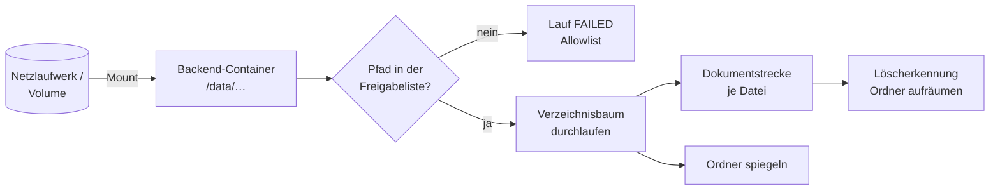

# Konnektor: Verzeichnis im Dateisystem (FILESYSTEM)

> **Entwurf.** Dieses Kapitel beschreibt den Konnektor für Verzeichnisse auf dem Server. Der
> gemeinsame Ablauf eines Indexierungslaufs und die Dokumentstrecke stehen im Kapitel
> [Indexierung](indexierung.md); hier geht es nur um das, was dieser Konnektor anders macht als
> die anderen.

## 1. Wofür er gedacht ist

Der Dateisystemkonnektor liest ein Verzeichnis, das dem Backend-Prozess als lokaler Pfad
sichtbar ist. Typische Fälle sind ein eingebundenes Netzlaufwerk (SMB/NFS-Mount im Container),
ein Ablageverzeichnis, das ein Fachverfahren befüllt, oder ein per Docker-Volume
durchgereichter Ordner. Er ist der einzige Konnektor, der die Ordnerstruktur der Quelle in die
Bibliothek spiegelt.

```mermaid
flowchart LR
    NL[(Netzlaufwerk /<br/>Volume)] -->|Mount| C[Backend-Container<br/>/data/…]
    C --> A{Pfad in der<br/>Freigabeliste?}
    A -- nein --> F[Lauf FAILED<br/>Allowlist]
    A -- ja --> W[Verzeichnisbaum<br/>durchlaufen]
    W --> D[Dokumentstrecke<br/>je Datei]
    W --> O[Ordner spiegeln]
    D --> L[Löscherkennung<br/>Ordner aufräumen]
```

## 2. Quellkonfiguration

Wo diese Felder stehen: Detailansicht der Bibliothek, Reiter **„Quelle"**, Abschnitt
**„Anbindung"** — dort liegt auch „Verbindung testen" gegen die gespeicherte Konfiguration; beim
Anlegen im gleichnamigen Schritt des Assistenten. Im selben Reiter stehen der **„Zeitplan"** und,
als **„Läufe"**, das Laufprotokoll.

**„Verbindung testen"** prüft nur, ob sich das Verzeichnis öffnen lässt: Es muss existieren, ein
Verzeichnis sein und sich auflisten lassen. Der Test liest keine Unterverzeichnisse und keine
Dateien und zählt keine Dokumente; er antwortet „Verzeichnis erreichbar." oder nennt den Grund, aus
dem das Verzeichnis nicht erreichbar ist. Die Zahl der Dokumente liefert erst der Lauf.

| Feld der Bibliothek | Regel |
|---|---|
| Verzeichnispfad (`sourcePath`) | Pflicht. Absoluter Pfad aus Sicht des Backend-Prozesses, also im Container, nicht auf dem Host. |
| Ausschlussmuster (`sourceSettings.excludePatterns`) | Optional, höchstens 50 Glob-Muster bis 255 Zeichen, in der Oberfläche eines pro Zeile. Regeln in Abschnitt 5.1. Beim Speichern abgewiesen, mit einer Meldung, die das Muster nennt, wird ein Muster mit ungültiger Syntax und eines, das nie treffen kann: führendes oder abschließendes `/`, leere Ebene (`//`), Ebene `.` oder `..`, Rückwärtsschrägstrich `\`, oder mehr als 32 Alternativen aus `{…}`. |

Weitere Felder gibt es für diesen Quellentyp nicht. Der Quellentyp einer Bibliothek ist nach dem Anlegen unveränderlich. Pfad und
Ausschlussmuster dürfen später geändert werden; eine Änderung wirkt mit dem nächsten Lauf.

Bereits beim Anlegen oder Ändern wird der Pfad gegen die Freigabeliste geprüft (Abschnitt 4).
Zwei Fehlermeldungen sind dabei möglich: „sourceType FILESYSTEM ist deaktiviert", wenn der
Betrieb gar kein Verzeichnis freigegeben hat, und „sourcePath liegt außerhalb der vom Betrieb
freigegebenen Verzeichnisse", wenn der Pfad nicht unter einem freigegebenen Basisverzeichnis
liegt. Die freigegebenen Verzeichnisse teilt die Systemverwaltung den Bibliotheksverwaltenden
mit; die Oberfläche zeigt sie nicht an.

**Sichtbarkeit:** Der Pfad ist nur für Verwaltende der Bibliothek (Rolle MANAGER oder
Eigentümer) sichtbar. Alle anderen sehen den Hinweis, dass die Verbindungsdaten Verwaltenden
vorbehalten sind. Dieselbe Schwelle gilt für das Laufprotokoll, weil dessen Einträge den Pfad
enthalten.

## 3. Zugriff

Der Konnektor liest ausschließlich lokal. Die Zugriffsrechte sind die des Prozesses im Container,
und der läuft unter der Kennung **65532**, nicht als `root`. Eine Datei, die der Prozess nicht lesen
darf, erscheint im Protokoll als „Dateiformat wird nicht unterstützt", weil die Formaterkennung sie
nicht öffnen kann.

**Diese Meldung ist die häufigste Rechteursache und nennt sie nicht.** Wer sie für jede oder fast
jede Datei eines Verzeichnisses sieht, sucht zuerst bei den Zugriffsrechten und nicht beim Parser:
Ein Verzeichnis oder eine Freigabe, die nur `root` lesen darf — `root:root 0700`, oder ein
CIFS-Mount mit `uid=0,file_mode=0600` —, war für frühere Stände lesbar und ist es nicht mehr. Der
Lauf endet dabei nicht mit einem Fehler; er läuft durch und meldet ein stilles Nichtergebnis.

Daraus folgt die wichtigste Betriebsregel: **Das Backend braucht nur Leserechte — aber die
tatsächlich.** Für jedes freigegebene Verzeichnis muss die Kennung 65532 es betreten (`x`) und seine
Dateien lesen (`r`) dürfen: über die Rechte für „andere" (`chmod -R o+rX`), über eine gemeinsame
Gruppe oder, auf einem Netzlaufwerk, über die Mount-Optionen (`uid=65532,gid=65532`). Ein `chown`
auf den Korpus ist der falsche Weg, wenn ihn ein Fachverfahren befüllt — das nähme dem Schreiber die
Rechte; Einzelheiten im [Deployment-Kapitel](deployment.md), Abschnitt „Nicht-root-Betrieb des
Backend-Containers". Ein Netzlaufwerk sollte schreibgeschützt eingebunden werden.

Ein **Unterverzeichnis**, das der Prozess nicht betreten darf, wird übersprungen, statt den Lauf
abzubrechen. Es erscheint im Protokoll als „Nicht lesbar, übersprungen" mit seinem Pfad relativ zum
Verzeichnispfad; „Verbindung testen" sieht solche Unterverzeichnisse nicht (Abschnitt 2).
Versteckte Ordner wie `.shortcut-targets-by-id` bei Google Drive und die Windows-Systemordner
betrifft das nicht: Sie sind ausgeschlossen und werden gar nicht erst betreten (Abschnitt 5.1).

## 4. Schutzmechanismen

### 4.1 Freigabeliste für Pfade

Der Betrieb legt mit `opaa.indexing.filesystem.allowlist` fest, unter welchen
Basisverzeichnissen Bibliotheken überhaupt lesen dürfen. Ist die Liste leer, ist der Quellentyp
vollständig abgeschaltet. Das ist die Standardeinstellung.

Die Prüfung ist rein lexikalisch: Der Pfad wird normalisiert, dann muss er mit einem der
Basisverzeichnisse beginnen. Ein `../` im Pfad kann nicht ausbrechen. **Symbolische Links werden
dabei nicht aufgelöst.** Ein Link innerhalb des freigegebenen Verzeichnisses, der nach außen
zeigt, würde beim Lesen verfolgt. Deshalb gilt als Betriebsbedingung: Freigegebene Verzeichnisse
dürfen nicht von Endnutzenden beschreibbar sein.

Die Prüfung läuft zweimal, beim Konfigurieren und erneut bei jedem Lauf. Wird die Freigabeliste
nachträglich verengt, scheitert der nächste Lauf einer nun unzulässigen Bibliothek sofort mit
einem Protokolleintrag der Kategorie „Allowlist" und dem Status `FAILED`.

### 4.2 Was es nicht gibt

- **Keine Tiefen- oder Mengenbegrenzung.** Der Verzeichnisbaum wird vollständig durchlaufen.
  Ein Erstlauf über ein großes Netzlaufwerk dauert entsprechend lange; er darf beliebig lange
  laufen, solange er Fortschritt meldet.
- **Keine Dateigrößenbegrenzung im Konnektor.** Wirksam sind die Deckel der Format-Pipelines
  (etwa für Mails, Tabellen und OpenDocument) und das Speicherkontingent der Bibliothek.

## 5. Aufzählung

Der Lauf durchläuft den Baum rekursiv und betrachtet alle regulären Dateien.

- **Verzeichnis-Links werden nicht betreten.** Ein symbolischer Link auf ein Verzeichnis gilt
  als Blatt. Links auf einzelne Dateien werden dagegen gelesen.
- **Zulassung nach Inhalt.** Jede Datei wird anhand ihrer ersten Bytes klassifiziert, nicht
  anhand der Endung. Ergebnis ist eine von drei Gruppen: unterstützt, abgewiesen, oder
  unterstützt mit Hinweis, dass Endung und Inhalt nicht zusammenpassen.
- **Keine definierte Reihenfolge.** Die Dateien werden in der Reihenfolge verarbeitet, in der
  das Dateisystem sie liefert.
- **Existiert der Pfad nicht**, ist er kein Verzeichnis oder lässt er sich selbst nicht auflisten,
  scheitert der Lauf sofort. Das ist bewusst so, damit ein nicht eingebundenes Netzlaufwerk nie
  als „leerer, erfolgreicher Bestand" gewertet wird und Dokumente löscht.
- **Nicht lesbare Unterverzeichnisse und Dateien** werden übersprungen (Abschnitt 3). Die
  Aufzählung gilt dann für diese Bereiche als unvollständig, für alles andere als vollständig
  (Abschnitt 9).
- **Ausgeschlossene Einträge** gehören nicht zur Quelle (Abschnitt 5.1).

### 5.1 Ausschlüsse

Immer ausgeschlossen sind:

- **versteckte Einträge**, deren Name mit einem Punkt beginnt, etwa `.git`, `.DS_Store` oder
  `.shortcut-targets-by-id`,
- die Windows-Systemordner **`$RECYCLE.BIN`** und **`System Volume Information`**, ohne Rücksicht
  auf Groß- und Kleinschreibung.

Diese Standardausschlüsse lassen sich nicht abschalten. Dazu kommen die Ausschlussmuster der
Bibliothek. Für sie gilt:

| Regel | Beispiel |
|---|---|
| Ein Muster gilt für den Pfad relativ zum Verzeichnispfad, getrennt mit `/` | `Archiv/2020/*.pdf` trifft `/data/dokumente/Archiv/2020/Plan.pdf` |
| `*` steht für beliebige Zeichen innerhalb einer Ordnerebene | `*.tmp` trifft nur Dateien direkt im Verzeichnispfad |
| `**` als ganze Ebene steht für beliebig viele Ordnerebenen, auch für keine | `**/*.tmp` trifft `notiz.tmp` und `a/b/notiz.tmp`; `a/**/z.txt` trifft auch `a/z.txt` |
| `**` innerhalb einer Ebene wirkt wie `*` | `Ar**v` trifft `Archiv`, aber nicht `Ar/chiv` |
| Ein abschließendes `/**` schließt auch den Ordner selbst aus, aber nie eine gleichnamige Datei | `Archiv*/**` lässt den Ordner `Archiv2020` unbetreten, die Datei `Archiv2020.pdf` bleibt |
| `?` steht für ein Zeichen, `[abc]`, `[a-z]` und `[!abc]` für ein Zeichen einer Klasse, `{a,b}` für Alternativen | `{Entwürfe,Papierkorb}/**`, `Plan-20[0-9]?.pdf` |

Ein ausgeschlossener Ordner wird nicht betreten. Ist er nicht lesbar, erscheint er deshalb auch
nicht als „Nicht lesbar, übersprungen", und die Aufzählung bleibt vollständig. Ausgeschlossene
Dateien zählen weder als gefunden noch als abgewiesen. „Verbindung testen" öffnet nur das
Verzeichnis selbst (Abschnitt 2); für ihn spielen die Ausschlüsse keine Rolle.

Die Muster unterscheiden Groß- und Kleinschreibung. Ihre Auswertung kostet höchstens Musterlänge
mal Namenslänge, auch bei vielen `*`; ein Muster kann einen Lauf daher nicht aufhalten.

## 6. Änderungserkennung

Der Konnektor hat keine Vorstufe. Jede Datei wird gelesen, ihre SHA-256-Prüfsumme gebildet und
mit dem gespeicherten Wert verglichen. Unveränderte, zuletzt erfolgreich indizierte Dateien
werden übersprungen. Das Lesen aller Dateien in jedem Lauf ist der Preis dafür, dass der
Konnektor ohne Änderungsdatum des Dateisystems auskommt, das auf Netzlaufwerken unzuverlässig
sein kann.

Für Mail-Anhänge hat das eine Folge: Eine unveränderte Mail wird nicht neu ausgepackt. Ein
Anhang, der bei einem früheren Lauf fehlgeschlagen ist, wird erst wieder versucht, wenn sich die
Mail selbst ändert oder ein Pipeline-Nachzug angestoßen wird.

## 7. Ordner

Als einziger Konnektor spiegelt FILESYSTEM heute die Verzeichnisstruktur als Ordner in der
Bibliothek. Nutzende können in der Bibliothek entlang derselben Struktur navigieren wie im
Netzlaufwerk.

| Regel | Verhalten |
|---|---|
| Ordner entstehen nur entlang gefundener Dateien | leere Verzeichnisse erscheinen nicht |
| Ordner sind schreibgeschützt | Anlegen, Umbenennen oder Löschen über die Oberfläche wird für diese Bibliotheken abgewiesen |
| Verschobene Datei | neuer Pfad ist ein neues Dokument im neuen Ordner, alter Pfad wird als entfernt erkannt |
| Verschwundener Ordner | wird am Ende eines erfolgreichen Laufs entfernt, sobald er weder direkt noch in Unterordnern ein Dokument mehr hält |

Das Aufräumen der Ordner läuft nach der Löscherkennung der Dokumente, damit ein im selben Lauf
leer gewordener Ordner sofort verschwindet. Ein Fehler beim Aufräumen der Ordner lässt den Lauf
nicht scheitern.

Ein Verzeichnisname, der nur aus Leerraum besteht oder einen Rückwärtsschrägstrich (`\`) enthält
— auf Linux-Dateisystemen zulässig —, lässt sich nicht als Ordnername darstellen. Die Dateien
darunter landen dann in der Wurzel der Bibliothek, und im Anwendungsprotokoll steht eine Warnung
mit dem betroffenen Pfad. Die Verschachtelungstiefe ist nicht begrenzt.

## 8. Anhänge

Anhänge entstehen aus dem Inhalt, nicht aus dem Verzeichnis: Eine EML- oder MSG-Datei im
Verzeichnis liefert ihre Anhänge als eigene Dokumente, mit dem Pfad der Mail als Elternpfad.
Es gelten die Mail-Grenzwerte (Standard: höchstens 50 Anhänge je Nachricht, 50 MiB je Anhang,
fünf Ebenen Mail-in-Mail).

## 9. Löscherkennung

Der Konnektor meldet am Ende eines **erfolgreichen** Laufs alle physisch gefundenen Dateien,
einschließlich der abgewiesenen, aber ohne die ausgeschlossenen. Dokumente der Bibliothek, deren
Pfad nicht darunter ist, werden mit ihren Chunks entfernt und als „In der Quelle nicht mehr
gefunden, entfernt" protokolliert. Das gilt auch für ein Dokument, das erst nachträglich unter ein
Ausschlussmuster fällt: Ausgeschlossen heißt nicht mehr Teil der Quelle.

Nicht gelöscht wird:

- wenn der Lauf gescheitert ist, etwa weil das Verzeichnis nicht existiert,
- wenn der Lauf keine Dateien gefunden hat,
- ein bekanntes Dokument in oder unter einem nicht lesbaren Unterverzeichnis und eine nicht
  lesbare Datei selbst, samt ihren Anhängen, sofern kein Ausschluss es trifft — ein
  ausgeschlossenes Dokument wird auch dort entfernt,
- ein Anhang, dessen Mail unverändert und daher nicht neu ausgepackt wurde.

Ein nicht lesbarer Bereich setzt die Löscherkennung also nur für sich selbst aus. Außerhalb davon
werden verschwundene Dokumente im selben Lauf entfernt und leere Ordner aufgeräumt. Der Vergleich
geht nach ganzen Pfadbestandteilen: Ist `projekte/intern` nicht lesbar, bleibt
`projekte/intern-alt` davon unberührt. Die Laufhistorie nennt die Zahl der nicht lesbaren Bereiche
als „N Bereiche nicht lesbar", die Pfade stehen im Protokoll des Laufs (Abschnitt 10). Ist der
Verzeichnispfad selbst nicht lesbar, scheitert der Lauf (Abschnitt 5).

## 10. Protokolleinträge dieses Konnektors

| Kategorie | Meldung | Situation |
|---|---|---|
| Allowlist | Verzeichnispfad liegt außerhalb der vom Betrieb freigegebenen Verzeichnisse | Freigabeliste verletzt, Lauf endet sofort |
| Format nicht unterstützt | Dateiformat wird nicht unterstützt | Inhalt nicht zugelassen oder Datei nicht lesbar |
| Formatabweichung | Dateiendung passt nicht zum erkannten Inhalt (erkannt: …) | wird trotzdem indiziert |
| nicht erreichbar | Nicht lesbar, übersprungen | Unterverzeichnis darf nicht betreten oder Datei nicht geprüft werden; bekannter Bestand darin bleibt erhalten |
| abgewiesen | Speicherkontingent-Meldung | Kontingent der Bibliothek erreicht |
| abgewiesen | kein extrahierbarer Text | typisch Scan-PDF |
| Fehler | Verarbeitung fehlgeschlagen | Pipeline-Fehler oder Ausnahme |
| entfernt | In der Quelle nicht mehr gefunden, entfernt | Löscherkennung |
| Zeitplan übersprungen | Geplanter Lauf übersprungen: Indizierung läuft bereits | Zeitplan trifft laufenden Lauf |

Anhänge erzeugen zusätzlich die im Kapitel [Indexierung](indexierung.md) beschriebenen
Anhangs-Einträge (nicht unterstützt, Formatabweichung, nicht lesbar, Verarbeitung fehlgeschlagen).

## 11. Grenzfälle

| Situation | Verhalten |
|---|---|
| Netzlaufwerk nicht eingebunden, Pfad fehlt | Lauf `FAILED` mit Fehlermeldung, nichts gelöscht |
| Verzeichnis leer | Lauf erfolgreich mit null Dokumenten, nichts gelöscht |
| Unterverzeichnis nicht lesbar | übersprungen, Bestand darin bleibt erhalten, soweit nicht ausgeschlossen; übrige Dateien werden indiziert, außerhalb verschwundene Dokumente entfernt |
| Versteckter oder ausgeschlossener Ordner nicht lesbar | nicht betreten, kein Eintrag, Löscherkennung läuft normal |
| Ausschlussmuster nachträglich ergänzt | nächster erfolgreicher Lauf entfernt die nun ausgeschlossenen Dokumente |
| Muster schließt alles aus (etwa `**`) | Lauf erfolgreich mit null Dokumenten; wie bei einem leeren Verzeichnis wird nichts gelöscht, der bisherige Bestand bleibt stehen |
| Freigabeliste nachträglich verengt | nächster Lauf endet sofort mit „Allowlist" |
| Datei zwischen Aufzählung und Verarbeitung gelöscht oder gesperrt | Eintrag „Format nicht unterstützt" oder „Fehler", Lauf läuft weiter |
| Datei nach Normalisierung außerhalb des Quellpfads | Warnung im Log, Datei wird der Wurzel zugeordnet |
| Bibliothek während des Laufs gelöscht | Lauf `FAILED` mit „Die Bibliothek wurde während des Laufs gelöscht." |

## 12. Konfiguration

| Schlüssel | Umgebungsvariable | Standard | Wirkung |
|---|---|---|---|
| `opaa.indexing.filesystem.allowlist` | `OPAA_INDEXING_FILESYSTEM_ALLOWLIST` | leer | Kommagetrennte absolute Basisverzeichnisse. Leer schaltet den Quellentyp ab. |
| `opaa.indexing.thread-pool.core-size` / `max-size` / `queue-capacity` | `OPAA_INDEXING_THREAD_POOL_*` | 2 / 4 / 20 | Pool für alle Konnektorläufe |
| `opaa.indexing.stale-job-timeout` | `OPAA_INDEXING_STALE_JOB_TIMEOUT` | `4h` | Lauf ohne Fortschritt gilt danach als verwaist |
| `opaa.library.quota-bytes` | `OPAA_LIBRARY_QUOTA_BYTES` | 10 GiB | Speicherkontingent je Bibliothek, 0 oder negativ hebt es auf. |

Chunking- und Embedding-Einstellungen gelten für alle Quellen und stehen im Kapitel
[Indexierung](indexierung.md); die Grenzen für Mail-Anhänge im Kapitel [E-Mail](format-mail.md).

## 13. Nicht gebaut

- Einschlussmuster, also ein Zuschnitt der Quelle auf passende Dateien
- Abschalten der Standardausschlüsse für versteckte Einträge und Systemordner
- Übernahme von Zugriffsrechten aus dem Dateisystem. Verbindlich bleibt: Die Bibliothek ist der
  Rechteanker, wer sie sehen darf, sieht alle ihre Dokumente.
- Schonzeitraum, in dem eine Quelle nicht gelesen wird
- Automatische Drosselung des Zeitplans nach wiederholtem Scheitern. Sichtbar ist nur das
  Warnbanner nach zwei fehlgeschlagenen geplanten Läufen.
- Ereignisgesteuerte Aktualisierung, etwa durch Dateisystem-Benachrichtigungen
