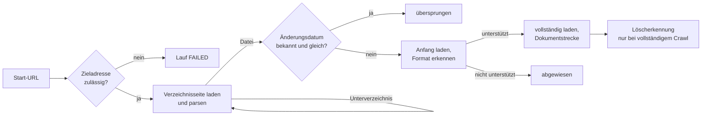

# Konnektor: Webverzeichnis (HTTP_DIRECTORY)

> **Entwurf.** Dieses Kapitel beschreibt den Konnektor für per HTTP erreichbare
> Verzeichnislisten. Der gemeinsame Ablauf eines Indexierungslaufs und die Dokumentstrecke
> stehen im Kapitel [Indexierung](indexierung.md).

## 1. Wofür er gedacht ist

Der Webverzeichnis-Konnektor crawlt eine automatisch erzeugte Verzeichnisliste, wie sie ein
Webserver für einen Ordner ohne Startseite ausgibt („Index of /dokumente"). Typische Fälle sind
ein interner Dokumentenserver, ein per Apache oder nginx freigegebenes Ablageverzeichnis oder ein
Download-Bereich, auf den das Backend nur über das Netz zugreifen kann.

Er ist **kein** allgemeiner Web-Crawler. Er folgt nur Links, die er in einer Verzeichnisliste
findet, und verlässt den Ursprungsserver nicht.

## 2. Quellkonfiguration

| Feld der Bibliothek | Regel |
|---|---|
| Adresse (`sourceUrl`) | Pflicht, `http://` oder `https://`. Fehlt der abschließende Schrägstrich und sieht der letzte Pfadteil nicht wie eine Datei aus, wird er ergänzt. |
| Proxy (`sourceProxy`) | optional, Format `host:port`. Keine Proxy-Authentifizierung. |
| Zugangsdaten (`sourceCredentials`) | optional, Format `benutzer:passwort` für HTTP Basic Auth. Der erste Doppelpunkt trennt. |
| Zertifikatsprüfung aussetzen (`sourceInsecureSsl`) | optional. Akzeptiert jedes Zertifikat, für interne Server mit Eigenzertifikat. |

Ein syntaktisch falscher Proxy fällt erst beim Lauf auf: Der Lauf scheitert sofort mit
„sourceProxy muss dem Format host:port entsprechen".

**Zugangsdaten** werden verschlüsselt gespeichert (AES-256-GCM, Schlüssel aus
`OPAA_CREDENTIALS_ENCRYPTION_KEY`) und erscheinen in keiner API-Antwort, auch nicht für
Eigentümer. Sichtbar ist nur, ob welche hinterlegt sind. Beim Ändern der Bibliothek gilt: Bleibt
das Feld leer und bleibt der Ursprung der URL (Schema, Host, Port) gleich, werden die gespeicherten
Zugangsdaten beibehalten. Ändert sich der Host, werden sie verworfen. Sonst könnte jemand mit
Verwaltungsrechten ein unbekanntes Passwort an einen eigenen Server umleiten.

Die Oberfläche bietet einen **Verbindungstest**, der die Start-URL lädt und unterscheidet
zwischen „nicht erreichbar", „erreichbar, aber keine erkennbare Verzeichnisliste" und
„Verzeichnisliste erkannt".

**Sichtbarkeit:** URL, Proxy und der Hinweis auf hinterlegte Zugangsdaten sind nur für
Verwaltende sichtbar; das Laufprotokoll ebenso, weil es die URLs enthält.

## 3. Zugriff

| Eigenschaft | Verhalten |
|---|---|
| Authentifizierung | Basic Auth, präemptiv bereits im ersten Request |
| User-Agent | gemeinsam für alle Netzkonnektoren konfigurierbar (`opaa.indexing.http.user-agent`), Standard `OPAA-Indexer/1.0`; wahrheitsgemäß, keine Browser-Imitation |
| Timeouts | 30 s Verbindungsaufbau, 60 s je Verzeichnisseite, 120 s je Datei |
| Wiederholung | nur bei HTTP 429: Verzeichnisseite wie Datei warten die in `Retry-After` genannte Zeit (gedeckelt auf `opaa.indexing.http.max-retry-after`, ohne Header fünf Sekunden) und wiederholen bis zu `opaa.indexing.http.max-rate-limit-retries`-mal; danach gilt die Anfrage als gescheitert. Jeder andere Fehlschlag ist für diesen Lauf endgültig |
| Wartezeit zwischen Anfragen | keine |
| Weiterleitungen | höchstens fünf; Details in Abschnitt 4 |

## 4. Schutzmechanismen

### 4.1 Zieladressprüfung

Vor jeder Anfrage, auch auf jeder Weiterleitung, wird die Zieladresse geprüft (Schutz gegen
Server-Side Request Forgery). Abgelehnt werden:

- alle Schemata außer `http` und `https`, unabhängig von allen anderen Einstellungen,
- Adressen in lokalen, privaten und nicht routbaren Bereichen: Loopback, Link-Local
  (einschließlich der Cloud-Metadaten-Adresse 169.254.169.254), private Netze nach RFC 1918,
  Carrier-Grade NAT, Multicast, reservierte Bereiche, sowie deren IPv6-Entsprechungen und
  IPv4-in-IPv6-Abbildungen,
- Hosts, deren DNS-Auflösung scheitert.

Geprüft wird jede aufgelöste Adresse eines Hostnamens. Auch der Proxy-Host wird geprüft. Über
`opaa.indexing.target-validation.allowlist` lassen sich Hostnamen exakt freigeben, etwa ein
interner Dokumentenserver im privaten Netz, was der Normalfall für diesen Konnektor sein dürfte.
Die Prüfung lässt sich komplett abschalten; die Schemaprüfung bleibt auch dann aktiv.

Bekannte Restlücke: DNS-Rebinding, bei dem ein Hostname zwischen Prüfung und Verbindung auf eine
andere Adresse wechselt, ist mit dem verwendeten HTTP-Client nicht abzufangen.

### 4.2 Weiterleitungen

- Höchstens fünf Weiterleitungen je Anfrage.
- Eine Weiterleitung von `https` auf `http` wird immer abgelehnt.
- Eine Weiterleitung auf einen fremden Ursprung wird gefolgt, aber **ohne Zugangsdaten**. Ein
  gleichnamiger Wechsel von `http` auf `https` gilt nicht als fremd.
- Protokolleinträge nennen vom Weiterleitungsziel nur Schema, Host und Port, nie Pfad oder
  Query.

### 4.3 Bleiben im Verzeichnis

- Absolute Links auf fremde Server werden nicht verfolgt.
- Ein absoluter, gleichursprünglicher Link außerhalb des gerade gecrawlten Verzeichnisses wird
  ebenfalls nicht verfolgt — dieselbe Regel wie für relative Links, unabhängig davon, ob der Link
  als `../`-Pfad oder bereits als vollständige URL in der Verzeichnisseite steht.
- Links, die per `../` über die Start-URL hinaus führen würden, werden normalisiert und
  verworfen. Das gilt auch für ein Segment, das erst nach der Prozentdekodierung zu `.`, `..`
  oder einem Pfadtrenner wird (z. B. `%2E%2E/`) — ein solcher Link wird nie angefragt.
- Jede URL wird nur einmal besucht (Zyklusschutz).
- Sortier-Links (`?C=`), „Parent Directory", Anker, `mailto:` und `javascript:` werden
  ignoriert.

### 4.4 Grenzwerte

| Grenze | Standard | Bei Überschreitung |
|---|---|---|
| Verzeichnistiefe (`max-depth`) | 10, Wurzel ist Tiefe 0 | Crawl gilt als abgeschnitten |
| Anzahl Einträge (`max-entries`) | 50.000, zählt Dateien **und** besuchte Verzeichnisse | Crawl gilt als abgeschnitten |
| Dateigröße (`max-file-size-bytes`) | 100 MiB | Datei wird abgewiesen, Lauf läuft weiter; geprüft anhand `Content-Length` und erneut während des Downloads |
| Verzeichnisseite | 8 MiB, fest | Unterverzeichnis gilt als nicht abrufbar; an der Wurzel scheitert der Lauf |

Die Dateigrenze liegt bewusst unter der Grenze, bis zu der Apache Tika Inhalte im Speicher
hält. Grenzen gegen komprimierte Inhalte (Zip-Bomben) liegen nicht im Konnektor, sondern in den
Format-Pipelines.

## 5. Aufzählung

Der Konnektor versteht vier Listenformate:

1. Apache `mod_autoindex` mit `HTMLTable` (Tabelle mit Icon, Link, Datum, Größe)
2. Apache `mod_autoindex` ohne Tabelle (`<pre>` mit Icons)
3. nginx `autoindex on` (`<pre>` ohne Icons)
4. schlichte `<ul>`-Liste, wie sie Apache mit `-FancyIndexing` oder Pythons `http.server` liefert

Damit eine gewöhnliche Startseite nicht als Verzeichnis gecrawlt wird, entscheidet eine Heuristik
zuerst, ob die Seite überhaupt wie eine Verzeichnisliste aussieht: Tabellenzeilen, mehrere Links
in einem `<pre>`-Block, Datum-und-Größe-Muster oder ein Titel wie „Index of". Fällt sie
negativ aus, liefert die Seite keine Einträge.

Der Dateiname kommt aus dem Linkziel, nicht aus dem Linktext, weil Apache lange Namen im
Anzeigetext kürzt und so die Endung verlieren würde. Änderungsdatum und Größe werden aus dem
Text hinter dem Link gelesen, wenn er wie „Datum Uhrzeit Größe" aussieht (Apache- und
nginx-Datumsformate). Bei `<ul>`-Listen bleiben beide leer.

Unterverzeichnisse werden rekursiv in Fundreihenfolge betreten. Es gibt keine Sortierung.

Ein Crawl endet mit drei Kennzeichen: **abgeschnitten** (Tiefe oder Menge erreicht),
**unvollständig** (mindestens ein Unterverzeichnis war nicht abrufbar) oder vollständig. Nur ein
vollständiger Crawl erlaubt die Löscherkennung.

## 6. Änderungserkennung

Zwei Stufen:

1. **Änderungsdatum aus der Liste.** Ist es bekannt, gleich dem gespeicherten Wert und war das
   Dokument zuletzt erfolgreich indiziert, wird die Datei ohne Download übersprungen. Ein
   fehlendes Datum gilt als „unbekannt", nicht als „unverändert". Sonst würde eine `<ul>`-Liste
   nur beim ersten Mal geladen.
2. **Prüfsumme** nach dem Download, wie bei jeder Quelle. Eine Datei mit neuem Änderungsdatum,
   aber unveränderter Prüfsumme behält ihre Chunks; das neue Datum wird trotzdem gespeichert, sodass
   der nächste Lauf sie schon in Stufe 1 überspringt.

Bedingte HTTP-Anfragen mit ETag oder If-Modified-Since nutzt dieser Konnektor nicht.

Vor dem vollständigen Download wird nur der Anfang der Datei (64 KiB) geladen und daraus das
Format erkannt. Nicht unterstützte Formate kosten so nur einen kleinen Teil-Download. Erst
wenn der Anfang in einem noch nicht entscheidbaren Container endet, wird zur Entscheidung die
ganze Datei geladen, ebenfalls innerhalb der Größengrenze.

## 7. Anhänge

Wie beim Dateisystem entstehen Anhänge aus dem Inhalt: Eine EML- oder MSG-Datei im
Webverzeichnis liefert ihre Anhänge als eigene Dokumente mit den Mail-Grenzwerten. Links auf
Verzeichnisseiten werden nicht als Anlagen interpretiert; Anlagenerkennung aus Seiteninhalt gibt
es nur beim Feed-Konnektor.

## 8. Ordner

Der Lauf spiegelt die Verzeichnisstruktur der Quelle als schreibgeschützte Ordner, wie beim
Dateisystem. Der Ordnerpfad ist der Teil des URL-Pfads unterhalb der Start-URL, ohne den Dateinamen
und ohne Abfrageparameter; jedes Segment wird prozentdekodiert, `Verg%C3%BCtung` wird also zum
Ordner `Vergütung`.

Ordner entstehen nur entlang gefundener Dateien — ein Verzeichnis, in dem nichts Indexierbares
liegt, erscheint nicht. Angelegt oder umbenannt werden können sie nicht: Die Ordner-Endpunkte
antworten für diesen Quellentyp mit `409`, die Quelle ist führend.

Ein Segment, das nach der Dekodierung leer ist, `.` oder `..` lautet, einen Pfadtrenner oder ein
NUL-Byte (`%00`) enthält oder länger als 255 Zeichen ist, lässt sich nicht als Ordnername
darstellen. Die betroffene Datei landet dann in der Wurzel der Bibliothek, und im
Anwendungsprotokoll steht eine Warnung mit der betroffenen URL.

Ein Verzeichnis, das keine Dokumente mehr hält, verschwindet am Ende eines Laufs — allerdings nur
unter derselben Bedingung wie die Löscherkennung im nächsten Abschnitt: Ein abgeschnittener oder
unvollständiger Crawl räumt weder Dokumente noch Ordner auf. Dokumente, die vor Einführung der
Spiegelung indiziert wurden, bekommen ihren Ordner beim nächsten Lauf zugewiesen, ohne dass sie neu
eingelesen werden. Ein Anhang liegt im Ordner seiner Mail.

## 9. Löscherkennung

Am Ende eines erfolgreichen Laufs werden Dokumente entfernt, deren URL nicht mehr gefunden wurde,
**aber nur, wenn der Crawl weder abgeschnitten noch unvollständig war**. Ein Lauf, der durch das
Tiefen- oder Mengenlimit begrenzt wurde oder ein Unterverzeichnis nicht lesen konnte, hat die
Quelle nicht vollständig gesehen und darf nichts löschen. Ein Lauf ohne Einträge löscht
ebenfalls nichts.

Anhänge unveränderter Mails gelten als weiterhin vorhanden.

## 10. Protokolleinträge dieses Konnektors

| Kategorie | Meldung | Situation |
|---|---|---|
| abgewiesen | Crawl wurde durch ein konfiguriertes Limit abgeschnitten (Tiefe oder Anzahl Einträge) | Limit erreicht, keine Löscherkennung |
| abgewiesen | Mindestens ein Unterverzeichnis konnte nicht abgerufen werden, der Bestand dieses Laufs ist unvollständig | Unterverzeichnis nicht lesbar, keine Löscherkennung |
| Format nicht unterstützt | Dateiformat wird nicht unterstützt | Inhaltsentscheidung negativ |
| Formatabweichung | Dateiendung passt nicht zum erkannten Inhalt (erkannt: …) | wird trotzdem indiziert |
| abgewiesen | Datei überschreitet die zulässige Größe von … und wurde nicht indiziert | Größengrenze |
| abgewiesen | Zieladresse liegt in einem gesperrten Adressbereich | Zieladressprüfung |
| abgewiesen | Speicherkontingent-Meldung | Kontingent erreicht |
| abgewiesen | kein extrahierbarer Text | typisch Scan-PDF |
| Fehler | Verarbeitung fehlgeschlagen | Download- oder Pipeline-Fehler, auch HTTP 403/429 einzelner Dateien |
| entfernt | In der Quelle nicht mehr gefunden, entfernt | Löscherkennung |

Scheitert der Lauf als Ganzes, steht die Ursache in der Fehlermeldung des Laufs, etwa „HTTP 401
Unauthorized, check credentials" oder „HTTP 503 for URL …".

## 11. Grenzfälle

| Situation | Verhalten |
|---|---|
| Start-URL nicht erreichbar oder HTTP-Fehler | Lauf `FAILED`, nichts gelöscht |
| HTTP 401 an der Wurzel | Lauf `FAILED` mit Hinweis auf die Zugangsdaten |
| Unterverzeichnis nicht erreichbar | Lauf läuft weiter, gilt als unvollständig, keine Löscherkennung |
| Wartungsseite mit HTTP 200 | keine Verzeichnisliste erkannt, null Einträge, Lauf erfolgreich, nichts gelöscht |
| Weiterleitung auf fremden Host | wird ohne Zugangsdaten gefolgt |
| Weiterleitung `https` auf `http` | abgelehnt |
| Mehr als fünf Weiterleitungen | Anfrage gilt als fehlgeschlagen |
| HTTP 403 oder 429 bei einer Datei | Eintrag „Fehler", Lauf läuft weiter; keine gesonderte Bot-Schutz-Erkennung |
| Bot-Schutzseite als Antwort auf einen Dateilink | wird als „Format nicht unterstützt" abgewiesen |
| Endlos streamende Verzeichnisseite | bei 8 MiB abgebrochen |
| Bibliothek während des Laufs gelöscht | Lauf `FAILED` mit „Die Bibliothek wurde während des Laufs gelöscht." |

## 12. Konfiguration

| Schlüssel | Umgebungsvariable | Standard | Wirkung |
|---|---|---|---|
| `opaa.indexing.crawl.max-depth` | `OPAA_INDEXING_CRAWL_MAX_DEPTH` | 10 | Verzeichnistiefe, Wurzel ist 0; 0 bedeutet Standard |
| `opaa.indexing.crawl.max-entries` | `OPAA_INDEXING_CRAWL_MAX_ENTRIES` | 50000 | Dateien und besuchte Verzeichnisse zusammen |
| `opaa.indexing.crawl.max-file-size-bytes` | `OPAA_INDEXING_CRAWL_MAX_FILE_SIZE_BYTES` | 104857600 (100 MiB) | Obergrenze je Datei |
| `opaa.indexing.http.user-agent` | `OPAA_INDEXING_HTTP_USER_AGENT` | `OPAA-Indexer/1.0` | `User-Agent` aller Anfragen, gemeinsam mit Feed- und Confluence-Konnektor |
| `opaa.indexing.http.max-rate-limit-retries` | `OPAA_INDEXING_HTTP_MAX_RATE_LIMIT_RETRIES` | 6 | aufeinanderfolgende 429-Antworten, die eine Anfrage abwartet |
| `opaa.indexing.http.max-retry-after` | `OPAA_INDEXING_HTTP_MAX_RETRY_AFTER` | 2m | Obergrenze einer einzelnen Wartezeit aus `Retry-After` |
| `opaa.indexing.target-validation.enabled` | `OPAA_INDEXING_TARGET_VALIDATION_ENABLED` | `true` | Zieladressprüfung |
| `opaa.indexing.target-validation.allowlist` | `OPAA_INDEXING_TARGET_VALIDATION_ALLOWLIST` | leer | Hostnamen, die trotz privater Adresse zulässig sind |
| `OPAA_CREDENTIALS_ENCRYPTION_KEY` | | | Schlüssel für gespeicherte Zugangsdaten |

Nicht konfigurierbar: Verzeichnisseiten-Grenze 8 MiB, Timeouts, Anzahl Weiterleitungen.
Thread-Pool, Kontingent, Mail-Grenzen und Chunking wie im Kapitel [Indexierung](indexierung.md).

## 13. Nicht gebaut

- Wartezeit zwischen Anfragen; die gibt es nur beim Feed-Konnektor
- Wiederholungsversuche und Backoff über die 429-Wartezeit (Abschnitt 3) hinaus
- Bedingte Anfragen mit ETag
- Schonzeitraum, Rechteübernahme, ereignisgesteuerte Aktualisierung, Drosselung nach
  wiederholtem Scheitern
