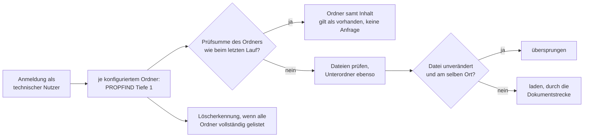

# Konnektor: Nextcloud (NEXTCLOUD)

> **Entwurf.** Dieses Kapitel beschreibt den Konnektor für Nextcloud, auch als Dateiablage von
> openDesk. Der gemeinsame Ablauf eines Indexierungslaufs und die Dokumentstrecke stehen im Kapitel
> [Indexierung](indexierung.md).

**Kurzfassung für den eiligen Betrieb**

1. Nextcloud im privaten Netz? Ihren Hostnamen in `OPAA_INDEXING_TARGET_VALIDATION_ALLOWLIST`
   eintragen ([Deployment](deployment.md)).
2. In der Nextcloud einen **technischen Nutzer** anlegen. Die gewünschten Ordner mit ihm teilen
   (Lesen genügt) oder ihn in die Gruppe eines Gruppenordners aufnehmen. Für ihn ein
   **App-Passwort** erzeugen.
3. Die Quellart Nextcloud ist ab Werk für niemanden außer der Systemverwaltung freigegeben. Wer
   außer ihr Bibliotheken anlegen soll, bekommt das Anlegerecht „Konnektorbibliotheken anlegen"
   für die Quellart Nextcloud oder für einen Zugang
   ([Bibliotheken und Berechtigungen](bibliotheken-und-berechtigungen.md), Abschnitt 9).
4. Bibliothek anlegen: Adresse, Benutzername, App-Passwort, Ordner („Ordner laden“ hilft),
   „Verbindung testen“. Alles aus diesen Ordnern ist für **alle** Leseberechtigten der Bibliothek
   sichtbar.
5. Zeitplan setzen. Jeder Lauf ist ein **Vollabgleich**, kostet aber für unveränderte Ordner nur
   eine Anfrage (Abschnitt 4).
6. Im Laufprotokoll auf „Geltungsbereich … nicht auflistbar“, „unvollständig, wird fortgesetzt“
   und „nicht lesbar“ achten.

## 1. Wofür er gedacht ist

Eine Nextcloud-Bibliothek liest **einen** Server mit **einem** technischen Nutzer und **einem bis
fünfzig Ordnern** dieses Nutzers. Indiziert wird die aktuelle Fassung jeder Datei in den
unterstützten Formaten. Die Anhänge von Mail-Dateien werden zu eigenen Dokumenten. Was der Nutzer
sieht, zählt: eigene Ordner, **Freigaben an ihn** und **Gruppenordner** (Group Folders), so wie sie
in seinem Dateibaum erscheinen.

Jedes Dokument trägt als Pfad die Adresse `<Nextcloud>/index.php/f/<Datei-ID>`. Das ist zugleich
der **Beleg-Link**: Er öffnet die Datei in der Weboberfläche der Nextcloud, nach deren eigener
Anmeldung. Die Datei-ID bleibt beim **Umbenennen und Verschieben** gleich, das Dokument auch. Es
wird dann einmal neu geladen, aber nicht neu verarbeitet, solange der Inhalt gleich ist. Titel,
Ordner und Gliederungspfad ziehen mit. „Original öffnen“ lädt die Datei durch OPAA (Abschnitt 6).

Der konfigurierte Ordner steht als Container am Dokument, die Ordner darunter als Gliederungspfad.

**Rechte werden nicht abgebildet.** Was der technische Nutzer lesen kann, sehen alle
Leseberechtigten der Bibliothek. Der Zuschnitt erfolgt über die Ordner, die man mit ihm teilt.

## 2. Quellkonfiguration

Wo diese Felder stehen: Detailansicht der Bibliothek, Reiter **„Quelle“**, Abschnitt
**„Anbindung“**; beim Anlegen im gleichnamigen Schritt des Assistenten. Die Ordner stehen im
Abschnitt **„Umfang“** und sind für jeden Leseberechtigten sichtbar.

| Feld der Bibliothek | Regel |
|---|---|
| Adresse (`sourceUrl`) | Pflicht. `http(s)://host[:port][/pfad]` der Nextcloud. Eine eingefügte WebDAV-Adresse (`…/remote.php/dav/files/…`) wird auf die Instanzadresse gekürzt. Gespeichert ohne abschließenden Schrägstrich. |
| Zugangsdaten (`sourceCredentials`) | Pflicht. `Benutzername:App-Passwort` des technischen Nutzers; das Formular hat zwei Felder. Der Benutzername darf keinen Doppelpunkt enthalten. Verschlüsselt gespeichert, nie ausgegeben. Gesendet wird es nur an die Adresse; eine geänderte Adresse verlangt neue Zugangsdaten. |
| Ordner (`sourceSettings.folders`) | Pflicht, ein bis fünfzig Pfade, wie der technische Nutzer sie sieht, etwa `/Projekte` oder `/Bauamt/Satzungen`; `/` liest alles. Zwei Ordner derselben Bibliothek dürfen sich nicht überschneiden. Kein Komma, kein `.` oder `..`. Eine Änderung verwirft den Abgleichszustand; der nächste Lauf listet alles. |
| Proxy (`sourceProxy`) | optional, `host:port`, unterliegt derselben Zieladressprüfung. |
| Zertifikatsprüfung aussetzen (`sourceInsecureSsl`) | optional, nur für ein bekanntes, selbstsigniertes Zertifikat im Hausnetz. |

**„Ordner laden“** zeigt die Ordner im Stamm des technischen Nutzers, mit dem Zusatz „Freigabe“
oder „Gruppenordner“. Ein Klick übernimmt den Ordner. **„Verbindung testen“** meldet sich an und
prüft jeden Ordner. Gemeldet wird, welcher Ordner für den Nutzer nicht lesbar ist oder ob die
Zugangsdaten abgelehnt wurden.

**Über einen Zugang** (siehe [Indexierung, Zugänge](indexierung.md#zugänge)): Ein Zugang für
Nextcloud gibt Server-Adresse, Proxy und Zertifikatsprüfung vor und meldet sich mit einem
persönlichen Geheimnis an, das der Bibliothek gehört: Benutzername und App-Passwort des technischen
Nutzers tragen ihre Verwaltenden wie oben ein. Die Adresse ist mit der Server-Adresse vorbelegt;
ohne eigene Angabe übernimmt die Bibliothek sie. Vorgaben für Einstellungen gibt es nicht, die
Ordner wählt jede Bibliothek selbst.

### 2.1 Der technische Nutzer

- Ein eigenes Konto, kein persönliches. Es braucht **nur Leserechte**; OPAA schreibt nie.
- Das **App-Passwort** entsteht in der Nextcloud unter *Persönliche Einstellungen › Sicherheit ›
  Geräte & Sitzungen* oder als Verwaltung mit `occ user:auth-tokens:add <nutzer>`. Es lässt sich
  dort einzeln widerrufen, ohne das Kontopasswort zu ändern.
- Ordner kommen über **Freigaben** (Lesen genügt) oder als **Gruppenordner** an eine Gruppe des
  Nutzers zu ihm. Eine Freigabe mit gesperrtem Herunterladen hält OPAA nicht zuverlässig ab und
  ist kein Mittel, Inhalte auszuschließen.
- Unter LDAP dürfen Anmeldename und Nutzer-ID abweichen; OPAA fragt die ID bei der Anmeldung ab.

## 3. Betriebsart

Es gibt **nur den Vollabgleich**. Nextcloud kennt für Dateien kein Änderungsprotokoll und keine
Benachrichtigung an OPAA. Ein Lauf sucht deshalb den ganzen Baum ab, steigt aber nur in Ordner ab,
deren Prüfsumme sich seit dem letzten vollständigen Abgleich geändert hat (Abschnitt 4). Nur ein
Lauf, der allein alle Ordner gelistet oder über ihre Prüfsumme bestätigt hat, entfernt Dokumente,
die es in der Nextcloud nicht mehr gibt.

### 3.1 Abgleich über mehrere Läufe

Die Ordner werden in Namensreihenfolge abgearbeitet, jeder Ordner vor seinen Unterordnern. Reicht
`request-budget-per-run` nicht für alle geänderten Ordner, endet der Lauf geordnet als
„unvollständig, wird fortgesetzt“, und OPAA merkt sich die Stelle. Der nächste Lauf fragt nur die
Ordner auf dem Weg zu dieser Stelle noch einmal ab und setzt danach fort; fertige Ordner und
fertige konfigurierte Ordner fragt er nicht erneut an. So wird auch eine Bibliothek mit mehr
Ordnern als Anfragebudget nach einigen Läufen vollständig.

- Ein Abgleich, der sich über mehrere Läufe erstreckt hat, **entfernt nichts**: Zwischen zwei
  Läufen kann eine Datei aus einem noch nicht gelisteten in einen schon gelisteten Ordner gewandert
  sein, und ihr Dokument muss bleiben. Er merkt sich aber die Prüfsummen. Der nächste Lauf steigt
  dann nur noch in geänderte Ordner ab, passt meist in ein Budget und entfernt, was fehlt.
- Ordner, unter denen ein gespeichertes Dokument liegt, das der Abgleich nicht gesehen hat (gelöscht
  oder verschoben, bevor sein Ordner an der Reihe war), merkt er sich nicht. Der nächste Lauf listet
  sie und klärt den Fall.
- Eine Datei, die in einem schon gelisteten Ordner neu angelegt wird, kommt mit dem nächsten Lauf:
  Die Prüfsumme des Ordners hat sich geändert.
- Ändert sich die Nextcloud so schnell, dass kein Lauf mehr alles allein bestätigt, wird weiter
  aufgenommen, aber nicht mehr entfernt. Das Protokoll sagt bei jedem Abschluss über mehrere Läufe
  „Vollabgleich über mehrere Läufe abgeschlossen …“; Abhilfe ist ein höheres Budget.
- Die Obergrenze `max-entries-per-run` gilt für den ganzen Abgleich, nicht je Lauf.
- Ein Lauf, der an einem Fehler scheitert (Anmeldung abgelehnt, Verbindung gesperrt), ändert die
  gemerkte Stelle nicht; der nächste setzt an derselben Stelle fort.
- **Ein Ordner, der dauerhaft nicht gelistet werden kann** (gelöscht, Freigabe entzogen, kein
  Leserecht), macht seinen Geltungsbereich unvollständig. Ein Lauf, der deshalb unvollständig
  endet, schließt den Abgleich ab, ohne etwas zu entfernen oder Prüfsummen zu merken; der nächste
  beginnt einen neuen und listet die übrigen Geltungsbereiche wieder. Neue und geänderte Dateien
  kommen so weiter in die Bibliothek; entfernt wird nichts, bis der Ordner wieder listbar ist oder
  aus der Bibliothek genommen wird.

## 4. Unveränderte Ordner

Nextcloud ändert die Prüfsumme (ETag) eines Ordners, sobald sich darin oder darunter etwas ändert,
bis hinauf zur Wurzel; das gilt auch für Freigaben und Gruppenordner. OPAA merkt sich nach jedem
vollständigen Lauf die Prüfsumme jedes Ordners. Im nächsten Lauf wird ein Ordner mit gleicher
Prüfsumme nicht gelistet; seine Dokumente gelten als vorhanden. Ein unveränderter konfigurierter
Ordner kostet so **eine** Anfrage, dazu kommt eine für die Anmeldung je Lauf.

Wieder gelistet wird ein Ordner,

- dessen Prüfsumme sich geändert hat,
- der umbenannt oder verschoben wurde,
- in dem ein Dokument für den nächsten Lauf vorgemerkt ist (Nachzug) oder nicht indexiert wurde,
- in dem beim letzten Lauf eine Datei nicht geladen, nicht gelesen oder nicht aufgenommen werden
  konnte,
- in oder unter dem ein Dokument in OPAA gelöscht wurde, auch während eines Laufs. Es kommt mit
  dem nächsten Lauf zurück, der den Ordner listet; die Ordner darüber werden mitgelistet.

Der ganze Ordnerbaum einer Bibliothek wird wieder gelistet,

- nach einer Änderung der Größengrenze, der unterstützten Formate, der Adresse oder der Ordner,
- einmal nach einem Update, das die Grundlage des Gedächtnisses ändert,
- in jedem Lauf, solange ein Ordner dauerhaft nicht gelistet werden kann (Abschnitt 3.1): Ohne
  vollständigen Abgleich entsteht kein Gedächtnis, ein solcher Ordner kostet also jeden Lauf die
  volle Auflistung aller Bereiche,
- spätestens nach `full-descent-interval` (Abschnitt 8). Das fängt Änderungen ab, die Nextcloud
  nicht weiterträgt, etwa auf externem Speicher ohne Änderungserkennung.

## 5. Ordner in der Bibliothek

Der Lauf spiegelt die Ordner unterhalb der konfigurierten Ordner. Bei einem konfigurierten Ordner
ist er die Wurzel, bei mehreren beginnt jede Kette mit seinen Pfadsegmenten. Ordner entstehen nur
entlang gefundener Dokumente und sind nicht bearbeitbar; die Quelle ist führend.

## 6. Beleg-Link und Original

- Der **Beleg-Link** öffnet die Datei in der Nextcloud-Oberfläche. Wer dort keine Rechte hat,
  sieht sie nicht; die Antwort in OPAA bleibt trotzdem belegt.
- **„Original öffnen“** lädt die Datei durch OPAA, mit dem technischen Nutzer, nach der
  Größengrenze. OPAA sucht sie an dem Ort, den der letzte Lauf gespeichert hat, und prüft die
  Datei-ID. Eine seither verschobene Datei liefert bis zum nächsten Lauf kein Original. Eine
  Datei außerhalb der konfigurierten Ordner liefert keines.

## 7. Fehlerbilder

| Protokoll oder Testmeldung | Bedeutung | Abhilfe |
|---|---|---|
| „Nextcloud hat Benutzername oder App-Passwort abgelehnt (HTTP 401).“ | Zugangsdaten falsch oder widerrufen; der Lauf endet ohne Änderung am Bestand. | Neues App-Passwort erzeugen und eintragen. |
| „Geltungsbereich „/…“: Nextcloud kennt den Ordner „/…“ nicht (HTTP 404).“ | Ordner gelöscht, umbenannt oder Freigabe entzogen, auch ein Unterordner, der während des Laufs verschwand; der Bestand des Geltungsbereichs bleibt, es wird nichts entfernt. Ein umbenannter Unterordner ist im nächsten Lauf unter seinem neuen Namen da. | Bei einem konfigurierten Ordner: in der Bibliothek anpassen oder Freigabe wiederherstellen. |
| „Nextcloud nannte für … eine Adresse außerhalb der Instanz“ | Die Nextcloud antwortete mit einer Adresse, die nicht unter ihren eigenen Dateien liegt. OPAA schickt dorthin keine Zugangsdaten; eine Datei wird übersprungen und behält ihre Fassung, ein Ordner macht seinen Geltungsbereich unvollständig. | Vorgeschalteten Proxy oder Umschreibregeln der Nextcloud prüfen. |
| „Keine Leseberechtigung für … (HTTP 403).“ | Der Nutzer darf den Ordner oder die Datei nicht lesen; eine Datei behält ihre gespeicherte Fassung. | Freigabe prüfen. |
| „Nextcloud kann die Datei … derzeit nicht öffnen (HTTP 503).“ | Die Nextcloud listet die Datei, kann sie aber nicht lesen (etwa Rechte im Speicher). Die gespeicherte Fassung bleibt; der Ordner wird im nächsten Lauf erneut geprüft. | Speicher der Nextcloud prüfen. |
| „Unter … antwortet … kein WebDAV einer Nextcloud“ | Falsche Adresse oder ein vorgeschaltetes Anmeldeportal. | Adresse prüfen; die WebDAV-Adresse aus der Nextcloud funktioniert auch. |
| „… überschreitet … Bytes (opaa.indexing.nextcloud.max-response-bytes)“ | Ein Ordner mit sehr vielen Einträgen; er gilt als nicht auflistbar. | Grenze anheben oder Ordner aufteilen. |
| Zieladressprüfung lehnt den Host ab | Nextcloud im privaten Adressbereich. | Hostnamen in `OPAA_INDEXING_TARGET_VALIDATION_ALLOWLIST`. |
| „unvollständig, wird fortgesetzt“ | Anfragebudget des Laufs erschöpft; die Stelle ist gemerkt (Abschnitt 3.1). Auch der Lauf, der einen Abgleich über mehrere Läufe abschließt, trägt das Kennzeichen, weil er nichts entfernt. | Nichts; der nächste Lauf setzt fort. Dauerhaft: Budget anheben. |
| „Vollabgleich über mehrere Läufe abgeschlossen; in der Quelle gelöschte Dateien entfernt erst ein Lauf, der alle Geltungsbereiche allein auflistet“ | Alle Ordner sind gelistet, aber über mehrere Läufe; entfernt wird nichts (Abschnitt 3.1). | Nichts. Kommt die Meldung bei jedem Lauf: Budget anheben. |
| „Der Lauf hat keine Datei neu aufgenommen. Budget anheben …“ | Das Budget reicht nicht einmal, um die Ordner auf dem Weg zur gemerkten Stelle abzufragen und einen weiteren Ordner zu schaffen; die Kette der Läufe kommt nicht voran. | `request-budget-per-run` anheben. |
| „Geltungsbereich „/…“: Der Fortsetzungspunkt … Die Auflistung dieses Geltungsbereichs beginnt neu.“ | Die gemerkte Stelle passt nicht mehr (etwa nach einem Update); der Ordner wird von vorn gelistet, entfernt wird nichts. Geschieht das zweimal hintereinander, wird er für diesen Lauf übersprungen und als nicht auflistbar genannt. | Nichts. |

Eine Ratenbegrenzung (`429`) wartet OPAA ab und wiederholt, wie bei den anderen Netzquellen.

## 8. Konfiguration

Instanzweit unter `opaa.indexing.nextcloud.*`, als Umgebungsvariablen `OPAA_INDEXING_NEXTCLOUD_*`
(Liste im Kapitel [Deployment](deployment.md)):

| Eigenschaft | Standard | Wirkung |
|---|---|---|
| `max-file-size-bytes` | 50 MiB | Obergrenze einer Datei, vor und während des Downloads |
| `request-timeout` | 30 s | Zeitlimit je Auflistung |
| `request-budget-per-run` | 20 000 | Anfragen je Lauf, danach endet er geordnet als unvollständig, und der nächste setzt fort |
| `max-entries-per-run` | 1 000 000 | gelistete Dateien je Vollabgleich, auch über mehrere Läufe; danach scheitert der Lauf sichtbar |
| `download-concurrency` | 2 | gleichzeitige Downloads je Lauf |
| `max-response-bytes` | 64 MiB | Obergrenze einer Auflistungsantwort (ein Ordner) |
| `full-descent-interval` | 7 Tage | Höchstalter der gemerkten Ordner-Prüfsummen |

## 9. ownCloud

- **ownCloud 10** spricht dasselbe WebDAV wie Nextcloud. Von Hand geprüft mit ownCloud 10.15:
  Anmeldung über App-Passwort oder Passwort, Abfrage der Nutzer-ID, Datei-ID (`oc:fileid`),
  Fortpflanzung der Prüfsumme bis zur Wurzel des Empfängers einer Freigabe, gleichbleibende
  Prüfsumme eines umbenannten Ordners, Beleg-Link `/index.php/f/<id>`. Eine automatische
  Testreihe gegen ownCloud gibt es nicht. Eine ownCloud-10-Bibliothek legt man als Nextcloud an.
- **ownCloud Infinite Scale (oCIS)** nutzt eine andere Schnittstelle (Spaces) und wird **nicht
  unterstützt**.

## 10. Was nicht gebaut ist

- **Ein- und Ausschlussmuster** wie beim S3-Konnektor. Heute schränken nur die Ordner ein.
- **Benachrichtigungen** der Nextcloud an OPAA. Änderungen kommen mit dem nächsten geplanten Lauf.
- **Persönliche Ablagen** einzelner Personen über ihr eigenes Konto. Vorgesehen mit den
  Verbindungsprofilen (Epic #2147).
- **Rechte aus der Nextcloud.** Die Bibliothek bestimmt, wer liest.
