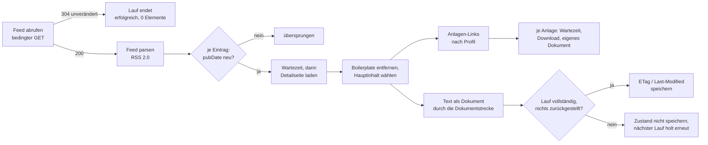

# Konnektor: Feed (RSS_FEED)

> **Entwurf.** Dieses Kapitel beschreibt den Konnektor für RSS-Feeds. Der gemeinsame Ablauf
> eines Indexierungslaufs und die Dokumentstrecke stehen im Kapitel
> [Indexierung](indexierung.md).

## 1. Wofür er gedacht ist

Der Feed-Konnektor hält eine Bibliothek mit Veröffentlichungen aktuell, die eine Website als
RSS-Feed anbietet: Pressemitteilungen, Amtsblätter, Bekanntmachungen, Rundschreiben. Er liest
den Feed, lädt zu jedem Eintrag die verlinkte Detailseite, reduziert sie auf den Hauptinhalt und
holt die dort verlinkten Anlagen als eigene Dokumente.

Anders als die beiden anderen Konnektoren sieht er nie den ganzen Bestand, sondern nur das
Fenster, das der Feed gerade zeigt. Das prägt sein Verhalten bei Änderungen und Löschungen.

## 2. Quellkonfiguration

Die Felder sind dieselben wie beim Webverzeichnis:

| Feld der Bibliothek | Regel |
|---|---|
| Adresse (`sourceUrl`) | Pflicht, die Feed-URL, `http://` oder `https://` |
| Proxy (`sourceProxy`) | optional, `host:port`, ohne Proxy-Authentifizierung |
| Zugangsdaten (`sourceCredentials`) | optional, `benutzer:passwort`, Basic Auth |
| Zertifikatsprüfung aussetzen (`sourceInsecureSsl`) | optional |

Speicherung und Sichtbarkeit der Zugangsdaten sowie das Verhalten beim Ändern der URL sind im
Kapitel [Webverzeichnis](konnektor-http-directory.md#2-quellkonfiguration) beschrieben.

Die Oberfläche weist beim Anlegen darauf hin, dass OPAA neben dem Feed auch die verlinkten
Detailseiten abruft und dass der Betreiber des Feeds bestimmt, welche Adressen das sind.

## 3. Zugriff

| Eigenschaft | Verhalten |
|---|---|
| User-Agent | gemeinsam für alle Netzkonnektoren konfigurierbar (`opaa.indexing.http.user-agent`), Standard `OPAA-Indexer/1.0`. Bewusst wahrheitsgemäß, keine Browser-Imitation. |
| Zugangsdaten und ausgesetzte Zertifikatsprüfung | wirken **nur auf dem Ursprung des Feeds**. Eine Detailseite oder Anlage auf einem anderen Host bekommt weder Zugangsdaten noch gelockerte Prüfung. |
| Wartezeit | konfigurierbar, Standard eine Sekunde vor jeder Detailseite und vor jedem Anlagen-Download. Nicht vor dem Feed selbst. |
| Timeouts | 30 s Verbindungsaufbau, 60 s Feed, 30 s Detailseite, 120 s Anlage |
| Wiederholung | nur bei HTTP 429: Feed, Detailseite und Anlage warten die in `Retry-After` genannte Zeit (gedeckelt auf `opaa.indexing.http.max-retry-after`, ohne Header fünf Sekunden) und wiederholen bis zu `opaa.indexing.http.max-rate-limit-retries`-mal; erst danach greift die Zurückstellung (Abschnitt 6). Jeder andere Fehlschlag wird nicht wiederholt, sondern zurückgestellt |
| Weiterleitungen | Feed: bis zu fünf, fremder Ursprung ohne Zugangsdaten. Detailseite und Anlage: ein fremder Ursprung wird gar nicht kontaktiert. |

Die Wartezeit bestimmt die Laufzeit: Bei 200 Einträgen mit je einer Seite und bis zu zehn
Anlagen liegt der Worst Case bei rund 40 Minuten je Lauf. Das ist gewollt; der Konnektor soll
fremde Server nicht belasten.

## 4. Schutzmechanismen

- **Zieladressprüfung** auf Feed, Detailseite, Anlage und jeder Weiterleitung, wie im
  Kapitel [Webverzeichnis](konnektor-http-directory.md#41-zieladressprüfung).
- **Schema- und Syntaxprüfung je Eintrag**, bevor irgendetwas geladen wird. Ein Eintrag mit
  `ftp://`-Link oder kaputter URL wird abgewiesen, ohne den Lauf zu beeinträchtigen.
- **Kein Verlassen des Ursprungs** bei Detailseiten und Anlagen. Ein Feed kann nicht dazu
  benutzt werden, das Backend auf beliebige Server zu schicken.
- **XML-Härtung** beim Parsen: keine DTDs, keine externen Entitäten.
- **Inhaltstypprüfung**: Eine Detailseite muss HTML sein. Eine Anlage, die HTML statt eines
  Dokuments liefert, wird als vermutliche Bot-Schutzseite verworfen.
- **Größengrenzen mit abgestufter Wirkung:**

| Grenze | Standard | Bei Überschreitung |
|---|---|---|
| Feed | 10 MiB | ganzer Lauf scheitert |
| Detailseite | 5 MiB | nur dieser Eintrag entfällt |
| Anlage | 20 MiB | nur diese Anlage entfällt |

- **Mengengrenzen:** höchstens 200 Feed-Einträge (Rest wird abgeschnitten), höchstens zehn
  Anlagen je Eintrag, fünf Ebenen Verschachtelung bei Anlagen, die selbst Anhänge enthalten.

## 5. Aufzählung

**Nur RSS 2.0.** Das Wurzelelement muss `<rss>` sein. Atom-Feeds werden mit einer klaren
Meldung abgewiesen, der Lauf scheitert.

Je `<item>` werden `title`, `link`, `description` und `pubDate` gelesen. Erweiterungen in fremden
Namensräumen (etwa `content:encoded`, `media:*`) werden ignoriert. Ein Eintrag ohne `<link>`
entfällt. Bei mehreren Links gewinnt der erste. Ein nicht lesbares `pubDate` gilt als fehlend,
nicht als Fehler; zweistellige Jahre und die üblichen Zeitzonenkürzel werden verstanden.

Die **Detailseite** wird geladen und in zwei Schritten reduziert:

1. Navigations- und Rahmenelemente werden entfernt: `nav`, `header`, `footer`, Elemente mit
   den Rollen navigation, banner und contentinfo, die Klassen `nav`, `navigation`, `menu`,
   `breadcrumb`, sowie `script`, `style` und `noscript`. Das geschieht **vor** der Auswahl des
   Hauptinhalts, damit Boilerplate auch innerhalb von `<main>` verschwindet.
2. Der Hauptinhalt wird über den konfigurierbaren Selektor gewählt (Standard `main, article,
   [role=main]`), Rückfall ist `body`.

Der so gewonnene Text geht ohne Formaterkennung direkt in die Dokumentstrecke; der Titel des
Eintrags wird als Kontexttitel verwendet. Die Zeichenkodierung folgt dem Server, sonst der
Erkennung aus der Seite.

## 6. Änderungserkennung und Zurückstellung

Drei Stufen, von billig nach teuer:

1. **Feed-Ebene, bedingter GET.** Je Bibliothek und Feed-URL merkt sich OPAA ETag und
   Last-Modified. Antwortet der Server mit 304, endet der Lauf nach einer einzigen Anfrage
   erfolgreich mit null Elementen. Das ist der Normalfall bei einem Feed, der sich stündlich
   prüfen lässt, aber nur wöchentlich neue Einträge bekommt.
2. **Eintragsebene, Veröffentlichungsdatum.** Ein Eintrag, dessen `pubDate` dem gespeicherten
   Wert entspricht und der zuletzt erfolgreich indiziert wurde, wird übersprungen. Ein fehlendes
   Datum gilt als „geändert".
3. **Prüfsumme** über den extrahierten Text, wie bei jeder Quelle. Ein Eintrag mit neuem `pubDate`,
   aber unverändertem Text behält seine Chunks; das neue Datum wird als Änderungsmarke übernommen
   und eine geänderte Überschrift als Titel, sodass der nächste Lauf ihn schon in Stufe 2
   überspringt. Das Dokumentdatum der Kernfelder bleibt bis zur nächsten Inhaltsänderung.

**Zurückstellung.** Der Feed-Zustand aus Stufe 1 wird nur gespeichert, wenn der Lauf
vollständig war: kein Fehler und kein zurückgestellter Eintrag. Zurückgestellt wird alles, was
in diesem Lauf nicht verarbeitet werden konnte, obwohl es beim nächsten Mal klappen könnte: eine
nicht erreichbare Detailseite, eine Abweisung mit 403 oder 429, ein abgeschnittener Feed, eine
verlorene Anlage. Ohne gespeicherten Zustand liefert der Server beim nächsten Lauf den Feed
erneut vollständig, und die zurückgestellten Einträge bekommen eine zweite Chance. Das ersetzt
Wiederholungsversuche innerhalb des Laufs.

**Nachholen von Anlagen.** Ein unveränderter Eintrag, zu dem noch keine Anlagen-Dokumente
existieren, lädt seine Detailseite trotzdem einmal, ausschließlich um Anlagen zu finden. Der
Artikeltext wird dabei nicht neu verarbeitet. Ein unveränderter Feed erzeugt also nicht
zwangsläufig null Anfragen.

## 7. Anlagen

Anlagen sind Links im reduzierten Hauptinhalt der Detailseite. Welche Links als Anlage gelten,
bestimmt das **Anlagenprofil**, das je Installation gesetzt wird, nicht je Bibliothek:

| Profil | Kandidat ist jeder Link, der … | Typischer Einsatz |
|---|---|---|
| `GENERIC` (Standard) | auf denselben Ursprung zeigt und dessen letzter Pfadteil irgendeine Dateiendung trägt | Websites, die Anlagen als `bescheid.pdf` verlinken |
| `GSB` | auf denselben Ursprung zeigt und den Query-Parameter `__blob=publicationFile` trägt | Bundesbehörden auf dem Government Site Builder, dessen Anlagen keine Endung haben |

Beide Profile prüfen nicht auf unterstützte Endungen. Ein als `.csv` veröffentlichtes PDF würde
sonst still verloren gehen; ob eine Anlage aufgenommen wird, entscheidet nach dem Download der
Inhalt. Doppelt verlinkte Anlagen (im Text und in einer Downloadliste) werden nur einmal gezählt,
damit das Limit nicht an Duplikaten aufgebraucht wird.

Beim GSB-Profil wird der Dateiname erst nach dem Download aus dem gemeldeten Inhaltstyp
gebildet. Restlücke: Ein GSB-Server, der eine Nicht-Text-Antwort als `text/plain` deklariert, wird
für den Text-Weg geglaubt, weil eine endungslose Adresse keinen anderen Hinweis bietet.

Jede Anlage wird ein eigenes Dokument mit Verweis auf den Feed-Eintrag als Elterndokument und mit
der URL des Eintrags als Herkunft. Enthält eine Anlage selbst Anhänge, etwa eine verlinkte
EML-Datei, geht die Kette bis zur Tiefengrenze weiter. Ein Fehler bei einer Anlage wirkt nie auf
den Eintrag zurück. Wird der Eintrag selbst abgewiesen, weil sein Text nicht extrahierbar ist,
werden seine Anlagen bewusst nicht indiziert.

## 8. Ordner

Keine Ordnerspiegelung. Ein Feed hat keine Struktur, die sich abbilden ließe.

## 9. Löscherkennung

**Nie durch Abwesenheit.** Ein Feed zeigt nur die jüngsten Einträge; dass ein älterer Eintrag
nicht mehr im Feed steht, sagt nichts darüber, ob die Meldung noch existiert. Der Konnektor
löscht deshalb nichts von selbst, auch nicht bei leerem Feed. Ein Eintrag verschwindet nur durch
ausdrückliches Löschen in der Bibliothek, dann mitsamt seinen Anlagen.

Eine Löschung anhand eines positiven Befunds, etwa wenn die Detailseite dauerhaft 404 liefert,
ist als künftiger Mechanismus benannt, aber nicht gebaut.

## 10. Protokolleinträge dieses Konnektors

| Kategorie | Meldung | Situation |
|---|---|---|
| abgewiesen | Verknüpfung mit nicht unterstütztem Schema abgelehnt | Link ist nicht http/https |
| abgewiesen | Verknüpfung mit ungültiger URL abgelehnt | Link syntaktisch kaputt |
| abgewiesen | Vom Quellserver abgewiesen (HTTP 403 / 429) | Bot-Schutz oder Ratenbegrenzung der Detailseite (429 erst nach erschöpften Wiederholungen); Eintrag zurückgestellt |
| abgewiesen | Weiterleitung auf einen fremden Host abgelehnt (Ziel: …) | Detailseite leitet auf fremden Ursprung |
| abgewiesen | Weiterleitung von https auf http abgelehnt (Protokoll-Downgrade) | |
| abgewiesen | Zieladresse liegt in einem gesperrten Adressbereich | Zieladressprüfung |
| abgewiesen | Weiterleitung der Detailseite ungültig | Location nicht auflösbar |
| nicht erreichbar | Detailseite nicht erreichbar | Verbindungsfehler, Timeout, Seite zu groß; Eintrag zurückgestellt |
| Format nicht unterstützt | Inhaltstyp der Detailseite wird nicht unterstützt | Link zeigt direkt auf ein PDF o. ä. |
| Format nicht unterstützt | Kein Inhalt extrahierbar | Hauptinhalt nach der Reduktion leer |
| abgewiesen | Speicherkontingent-Meldung | Kontingent erreicht |
| abgewiesen | kein extrahierbarer Text | Eintrag und seine Anlagen entfallen |
| Fehler | Verarbeitung fehlgeschlagen | Pipeline-Fehler oder Ausnahme |

Beim Nachholen von Anlagen tragen die Meldungen den Zusatz „beim Nachladen von Anlagen".

Anlagen-Einträge:

| Kategorie | Meldung |
|---|---|
| abgewiesen | Anlage antwortete mit HTML statt einem Dokument (vermutlich Bot-Schutz) |
| abgewiesen | Anlage überschreitet die zulässige Größe |
| abgewiesen | Weiterleitungs- oder Zieladressmeldung mit Zusatz „(Anlage)" |
| nicht erreichbar | Anlage nicht erreichbar |
| Format nicht unterstützt | Anlagenformat wird nicht unterstützt |
| Formatabweichung | Dateiendung passt nicht zum erkannten Inhalt (erkannt: …) |
| Fehler | Anlage konnte nach dem Herunterladen nicht auf ihr Format geprüft werden / Verarbeitung der Anlage fehlgeschlagen |

Scheitert der Lauf als Ganzes, nennt die Fehlermeldung die Ursache: Feed nicht abrufbar mit
HTTP-Code, kein gültiges XML, kein RSS-Feed (etwa Atom), Feed zu groß, Proxy-Format falsch, oder
„Die Bibliothek wurde während des Laufs gelöscht".

## 11. Grenzfälle

| Situation | Verhalten |
|---|---|
| Feed unverändert (304) | Lauf erfolgreich mit null Elementen nach einer Anfrage |
| Feed nicht erreichbar, HTTP-Fehler, kein XML, Atom, zu groß | Lauf `FAILED`, Bestand unverändert |
| Feed hat mehr als 200 Einträge | Rest abgeschnitten, Lauf erfolgreich, Zustand nicht gespeichert, nächster Lauf holt vollständig |
| Detailseite 403, oder 429 nach erschöpften Wiederholungen | Eintrag abgewiesen und zurückgestellt, Lauf läuft weiter, nächster Lauf versucht es erneut |
| Detailseite leitet auf fremden Host | abgelehnt, bevor der fremde Server kontaktiert wird |
| Detailseite liefert PDF statt HTML | Eintrag „Format nicht unterstützt" |
| Bibliothek während des Laufs gelöscht | Lauf `FAILED` mit verständlicher Meldung |
| Feed-Eintrag während der Anlagenverarbeitung gelöscht | Warnung im Log, Anlagen entfallen |

## 12. Konfiguration

Alle Schlüssel unter `opaa.indexing.rss.*`, Umgebungsvariablen als `OPAA_INDEXING_RSS_*`:

| Schlüssel | Standard | Wirkung |
|---|---|---|
| `max-entries` | 200 | Feed-Einträge je Lauf; Rest wird abgeschnitten |
| `max-feed-size-bytes` | 10485760 (10 MiB) | darüber scheitert der Lauf |
| `max-page-size-bytes` | 5242880 (5 MiB) | darüber entfällt der Eintrag |
| `request-delay-ms` | 1000 | Wartezeit vor jeder Detailseite und Anlage; 0 schaltet ab |
| `main-content-selector` | `main, article, [role=main]` | Jsoup-Selektor für den Hauptinhalt, Rückfall `body` |
| `attachment-profile` | `GENERIC` | `GENERIC` oder `GSB`, gilt für die ganze Installation |
| `max-attachments-per-entry` | 10 | Anlagen je Eintrag |
| `max-attachment-size-bytes` | 20971520 (20 MiB) | darüber entfällt die Anlage |

`User-Agent` und 429-Wartezeit kommen aus dem gemeinsamen Block `opaa.indexing.http.*`
(`user-agent`, `max-rate-limit-retries`, `max-retry-after`; siehe [Deployment](deployment.md)).
Nicht konfigurierbar: Timeouts. Verschachtelungstiefe der Anlagen, Zieladressprüfung,
Thread-Pool, Kontingent und Chunking wie in den anderen Kapiteln.

Der Speicherbedarf im Lauf liegt bei bis zu einer Anlagengröße je gleichzeitig verarbeiteter
Anlage; die Grenzen sind entsprechend zu wählen.

## 13. Zeitplan

Der Zeitplan je Bibliothek ist im Kapitel [Indexierung](indexierung.md#31-auslöser)
beschrieben. Für Feeds ist ein stündlicher Zeitplan üblich: Ein unveränderter Feed kostet dank
bedingtem GET nur eine Anfrage.

## 14. Nicht gebaut

- Atom-Feeds
- Anlagenprofil je Bibliothek statt je Installation; bewusst so entschieden
- Löschung anhand eines positiven Befunds (404 der Detailseite)
- Nennung der Eintrags-URL als Beleg im Chat (Issue #639)
- Schonzeitraum, Rechteübernahme, ereignisgesteuerte Aktualisierung, Drosselung nach
  wiederholtem Scheitern
