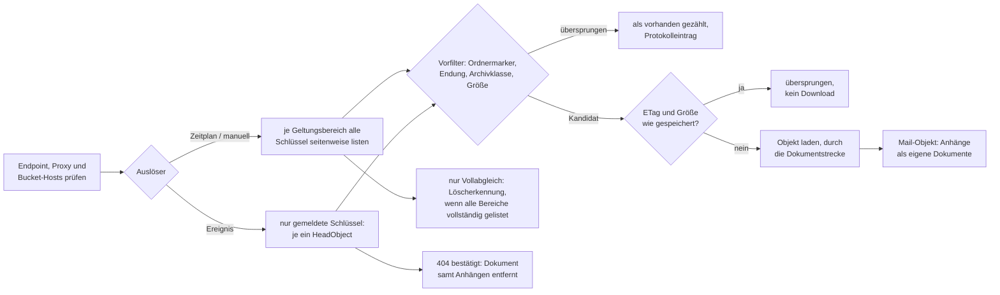

# Konnektor: S3-Objektspeicher (S3)

> **Entwurf.** Dieses Kapitel beschreibt den Konnektor für S3-kompatible Objektspeicher — AWS S3,
> MinIO, Ceph RGW, Hetzner Object Storage und jeden weiteren Dienst, der `ListObjectsV2`,
> `HeadBucket`, `HeadObject` und `GetObject` mit Signature v4 bedient. Der gemeinsame Ablauf eines
> Indexierungslaufs und die Dokumentstrecke stehen im Kapitel [Indexierung](indexierung.md).

**Kurzfassung für den eiligen Betrieb**

1. Objektspeicher im privaten Netz (MinIO, Ceph im Haus)? Hostnamen des Endpoints in
   `OPAA_INDEXING_TARGET_VALIDATION_ALLOWLIST` eintragen — bei Virtual-Host-Adressierung zusätzlich
   jeden Bucket-Hostnamen `<bucket>.<endpoint-host>` (Abschnitt 4.1).
2. Ein Zugriffsschlüssel je Leserkreis mit `s3:ListBucket` und `s3:GetObject` auf die gewünschten
   Buckets; Access Key und Secret Key ohne Doppelpunkt (Abschnitt 2).
3. Bibliothek anlegen: Anbietervorlage wählen, Endpoint, Region und Adressstil prüfen,
   Zugangsdaten eingeben, Geltungsbereiche (Bucket plus optionales Präfix) eintragen, „Verbindung
   testen". Alles aus allen Geltungsbereichen ist für **alle** Leseberechtigten der Bibliothek
   sichtbar.
4. Zeitplan setzen. Jeder Lauf ist ein **Vollabgleich**; er allein entfernt, was im Speicher
   nicht mehr existiert.
5. Optional Ereignisbenachrichtigungen einrichten (Token in OPAA erzeugen, im Objektspeicher
   hinterlegen) — nicht bei Hetzner, das keine Benachrichtigungen kennt.
6. Im Laufprotokoll auf „Geltungsbereich … darf … nicht aufgelistet werden", „Ratenbegrenzung"
   und „unvollständig, wird fortgesetzt" achten.

## 1. Wofür er gedacht ist

Eine S3-Bibliothek zeigt auf **einen** Endpoint mit **einem** Zugriffsschlüssel und einer Liste von
**einem bis fünfzig Geltungsbereichen** — je ein Bucket mit optionalem Schlüsselpräfix. Indiziert
wird die **aktuelle Version** jedes Objekts in den unterstützten Dateiformaten, dessen Schlüssel in
einem Geltungsbereich liegt und die Ein-/Ausschlussmuster passiert; die Anhänge von Mail-Objekten
(`.eml`, `.msg`) werden zu eigenen Dokumenten. Nicht indiziert werden Ordnermarker, Objekte in
Archivklassen, ältere Versionen versionierter Buckets sowie Objektmetadaten und Tags.

Anders als Confluence hat ein Objektspeicher keine Änderungssuche: Es gibt **nur eine anforderbare
Betriebsart, den Vollabgleich**, weil die vollständige Auflistung mit 1000 Schlüsseln je Aufruf
billig ist (Abschnitt 5). Gemeinsam mit Confluence hat er das **Anfragebudget** je Lauf, die
**Wiederaufnahme** nach einem unterbrochenen Lauf und einen **Push-Eingang**, über den der Speicher
erzeugte und gelöschte Objekte meldet (Abschnitt 8).

Jedes Dokument trägt als Pfad `s3://<bucket>/<schlüssel>` — Bucket und Schlüssel sind die Identität,
der Endpoint nur der Weg; ein Umzug des Speichers auf einen anderen Endpoint mit denselben Buckets
baut den Bestand nicht neu. Der Bucket steht als Container, die Präfixsegmente unterhalb des
Geltungsbereichs als Gliederungspfad am Dokument. **Einen Beleg-Link gibt es nicht** — Beleg und
Dokumentliste zeigen Bucket und Schlüsselordner als Text, denn eine `s3://`-Adresse öffnet kein
Browser —, **wohl aber einen Beleg-Abruf:** „Original öffnen" am Beleg und in der Dokumentliste
lädt das Objekt durch OPAA aus dem Speicher der Bibliothek (Abschnitt 3.1).

**Rechte werden nicht abgebildet.** Was der Schlüssel lesen darf und in einem Geltungsbereich
liegt, sehen alle Leseberechtigten der Bibliothek. Abschnitt 14 sagt, was daraus für den Zuschnitt
folgt.



## 2. Quellkonfiguration

| Feld der Bibliothek | Regel |
|---|---|
| Endpoint (`sourceUrl`) | Pflicht. `http(s)://host[:port]` **ohne Pfad**, Abfrage oder Zugangsdaten; wird normalisiert gespeichert (Schema und Host kleingeschrieben). Bucket und Präfix gehören in die Geltungsbereiche, nicht in den Endpoint. |
| Region (`s3Settings.region`) | optional, höchstens 64 Zeichen aus Buchstaben, Ziffern und Bindestrichen. Leer bedeutet `us-east-1`, was MinIO und Ceph erwarten; AWS verlangt die Region des Buckets, Hetzner den Ort. |
| Adressstil (`s3Settings.pathStyle`) | `true` spricht `endpoint/bucket/key` an (MinIO, Ceph), `false` `bucket.endpoint/key` (AWS, Hetzner). |
| Geltungsbereiche (`s3Settings.scopes`) | Pflicht, ein bis fünfzig Einträge aus Bucket und optionalem Präfix. Bucket nach den AWS-Namensregeln (3 bis 63 Zeichen, Kleinbuchstaben, Ziffern, Punkte, Bindestriche, keine IP-Adresse). Das Präfix wird normalisiert: kein führender, ein abschließender Schrägstrich (`2025/protokolle` wird `2025/protokolle/`); leer ist der ganze Bucket. Zwei Bereiche derselben Bibliothek dürfen sich **nicht überschneiden**; die Anlage weist das mit beiden Bereichen ab. Später änderbar; jede Änderung verwirft den Wiederaufnahmezustand. |
| Ein-/Ausschlussmuster (`s3Settings.includePatterns`, `excludePatterns`) | optional, je Liste höchstens 50 Glob-Muster bis 255 Zeichen auf den **vollständigen Schlüssel** einschließlich Bereichspräfix. Mit Einschlussmustern muss ein Schlüssel mindestens eines treffen; ein Ausschlussmuster gewinnt danach. `*` bleibt in einem Segment, `**` überschreitet Schrägstriche: `**/*.pdf` trifft PDFs in Unterordnern, `*.pdf` nur auf oberster Ebene. Was die Muster ausschließen, gehört nicht zum Bestand und wird mit dem nächsten Vollabgleich entfernt. |
| Zugangsdaten (`sourceCredentials`) | Pflicht. `accessKey:secretKey`, optional gefolgt von `:sessionToken` (zeitlich begrenzte STS-Schlüssel). **Access Key und Secret Key dürfen keinen Doppelpunkt enthalten** — MinIO und Ceph lassen beide frei wählen, und ein Doppelpunkt würde still falsch zerlegt und als Signaturfehler erscheinen; die Eingabe weist ihn ab. Zusammen höchstens 500 Zeichen. Verschlüsselt gespeichert, in keiner API-Antwort, keinem Protokoll und keiner Fehlermeldung sichtbar. |
| Proxy (`sourceProxy`) | optional, `host:port`. Der Proxy-Host unterliegt derselben Zieladressprüfung wie der Endpoint. |
| Zertifikatsprüfung aussetzen (`sourceInsecureSsl`) | optional, nur für ein bekanntes, selbstsigniertes Zertifikat im Hausnetz — die Oberfläche warnt, dass sich dann jeder Server als der Objektspeicher ausgeben und den Schlüssel mitlesen kann. Ein eigenes Zertifikat der Behörden-CA gehört in den Truststore des Backend-Containers (siehe [Deployment](deployment.md)). |
| Ereignis-Token | optional, in OPAA erzeugt (Abschnitt 8). |

**Anlagedialog.** Die Stufen sind: **Anbieter** wählen (die Vorlage belegt Endpoint-Form, Region
und Adressstil vor; jede Vorbelegung bleibt änderbar), **Zugangsdaten** eingeben, der Hinweis auf
die Freigabefolge („Wer diese Bibliothek lesen darf, sieht alles aus allen Geltungsbereichen"),
**Geltungsbereiche** eintragen — „Buckets laden" bietet die Buckets an, die der Schlüssel sehen
darf, und ist ein Komfort, kein Muss —, unter „Erweitert" Ein-/Ausschlussmuster, Proxy und TLS,
dann **„Verbindung testen"**. Der Test prüft **je Geltungsbereich** in drei Schritten: Bucket
erreichbar (`HeadBucket`), Auflisten erlaubt (`ListObjectsV2` mit Präfix), Lesen erlaubt
(`HeadObject` auf das erste Objekt) — und zählt die Objekte der ersten Auflistungsseite
(„mindestens", wenn sie voll ist). Er nennt das fehlende Recht, eine falsche Region oder einen
falschen Adressstil, abgelehnte Zugangsdaten oder ein gesperrtes Ziel. Weil der Endpoint vor dem
Speichern geprüft wird, ist die Anlage netzabhängig wie bei Confluence.

**Sichtbarkeit.** Jede Leseberechtigung sieht die Geltungsbereiche — im Kopf der Bibliothek, mit
dem Hinweis, dass dieser Umfang für alle Leseberechtigten gilt. Endpoint, Region, Adressstil,
Muster, Proxy, TLS-Schalter und der Zustand des Ereignis-Tokens stehen in der Quellkonfiguration,
die nur Verwaltende (Rolle MANAGER oder Eigentümer) sehen, ebenso das Laufprotokoll.

### 2.1 Benötigte Rechte

Der Schlüssel braucht auf jedem Bucket eines Geltungsbereichs:

| Recht | Wofür | Pflicht? |
|---|---|---|
| `s3:ListBucket` | Auflistung (`ListObjectsV2`), `HeadBucket` — und die Unterscheidung von „fehlt" und „verboten": Ein `HeadObject` auf einen fehlenden Schlüssel antwortet nur mit diesem Recht `404`, sonst `403`. Ohne es kann OPAA eine Löschung nie bestätigen. | ja |
| `s3:GetObject` | `HeadObject` und Download | ja |
| `s3:ListAllMyBuckets` | „Buckets laden" im Anlagedialog | nein; ohne das Recht zeigt der Dialog den Hinweis, den Bucket-Namen von Hand einzutragen |
| `s3:GetBucketLocation` | bei AWS von manchen Werkzeugen für die Regionsauflösung verlangt; OPAA signiert immer mit der konfigurierten Region und ruft es selbst nicht auf | nein |

Eine minimale IAM-Policy (AWS; MinIO und Ceph verstehen dieselbe Form) für den Bucket `dokumente`:

```json
{
  "Version": "2012-10-17",
  "Statement": [
    {
      "Effect": "Allow",
      "Action": ["s3:ListBucket", "s3:GetObject"],
      "Resource": ["arn:aws:s3:::dokumente", "arn:aws:s3:::dokumente/*"]
    }
  ]
}
```

Für „Buckets laden" kommt eine zweite Anweisung mit `"Action": ["s3:ListAllMyBuckets"]` auf
`"Resource": "arn:aws:s3:::*"` hinzu. Ein Schlüssel ohne Schreibrechte ist der Normalfall — OPAA
schreibt nie in den Speicher.

### 2.2 AWS S3

- **Vorlage:** Region wählen (Vorschlag `eu-central-1`), Endpoint wird abgeleitet
  (`https://s3.<region>.amazonaws.com`), Virtual-Host-Adressierung. Die Region ist Teil der
  Signatur; eine falsche Region antwortet mit `301` (Abschnitt 13).
- **Zugangsdaten:** Access Key und Secret Key eines IAM-Nutzers mit der Policy aus 2.1, oder ein
  zeitlich begrenzter STS-Schlüssel mit Session-Token — der verfällt mit dem Token, danach schlägt
  jeder Lauf sichtbar fehl. Die Instanzrolle des OPAA-Hosts wird **nie** benutzt (Abschnitt 17).
- **Archivklassen:** Objekte in `GLACIER` und `DEEP_ARCHIVE` sowie `INTELLIGENT_TIERING`-Objekte in
  einer Archivstufe werden übersprungen, bis eine Wiederherstellung abgeschlossen ist;
  `GLACIER_IR` wird normal gelesen (Abschnitt 14).
- **Kosten:** Jeder Vollabgleich listet alles — `LIST`-Anfragen fallen bei AWS ins Entgelt
  (Abschnitt 16).
- **Benachrichtigungen:** über eine EventBridge-API-Destination (Abschnitt 8.5); SNS- und
  SQS-Wege sind nicht gebaut.

### 2.3 MinIO

- **Vorlage:** Endpoint-URL eingeben (`https://minio.intern.example:9000`), Region `us-east-1`,
  Path-Style.
- **Zugangsdaten:** ein eigener Nutzer mit Policy wie in 2.1, nicht der Root-Schlüssel. Beide
  Werte frei wählbar — ohne Doppelpunkt.
- **Bucket-Liste:** MinIO **filtert** `ListBuckets` auf die Buckets, die die Policy erlaubt, statt
  mit `403` zu antworten; ein Schlüssel ohne bucketweite Rechte sieht dann eine leere Liste, und
  der Dialog sagt „Der Schlüssel sieht keine Buckets - der Bucket-Name kann von Hand eingetragen
  werden."
- **Benachrichtigungen:** eingebauter Webhook (Abschnitt 8.3).
- **Zieladressprüfung:** Ein MinIO im privaten Adressbereich braucht den Allowlist-Eintrag
  (Abschnitt 4.1).

### 2.4 Ceph RGW

- **Vorlage:** Endpoint-URL, Region `us-east-1`, Path-Style; Virtual-Host ist möglich, wenn das
  Gateway die Bucket-Subdomains bedient.
- **Zugangsdaten:** ein RGW-Nutzer oder Subuser mit Leserecht auf die Buckets; ohne Doppelpunkt.
- **Benachrichtigungen:** Bucket-Topic mit `push-endpoint`; die Absicherung geht nur als
  `benutzer:passwort` in der Endpunkt-URI (Abschnitt 8.4).

### 2.5 Hetzner Object Storage

- **Vorlage:** Ort wählen (`fsn1`, `nbg1`, `hel1`), Endpoint wird abgeleitet
  (`https://<ort>.your-objectstorage.com`), der Ort ist zugleich die Signaturregion,
  Virtual-Host-Adressierung.
- **Keine Benachrichtigungen:** Hetzner bietet keine Bucket-Benachrichtigungen; eine
  Aktualisierung per Push ist dort nicht möglich, der Zeitplan ist der einzige Weg. Die Vorlage
  zeigt den Hinweis: „Hetzner Object Storage bietet keine Ereignisbenachrichtigungen (eine
  Aktualisierung per Push ist dort nicht möglich) und Verschlüsselung nur als SSE-C."
- **Verschlüsselung:** nur SSE-C — ein SSE-C-verschlüsseltes Objekt kann OPAA nicht lesen
  (Abschnitt 14). Nur die Speicherklasse `STANDARD`.

### 2.6 Anderer Anbieter

Vorlage „Anderer Anbieter": Endpoint-URL, Region leer (`us-east-1`), Path-Style. Jeder Dienst, der
die vier Aufrufe aus der Einleitung mit Signature v4 bedient, kommt in Frage. Was **kein** Ziel ist,
nennt Abschnitt 14: Nextcloud und ownCloud als S3-Primärspeicher.

### 2.7 Schlüssel-Zuschnitt

- **Ein Schlüssel je Leserkreis, nicht je Bibliothek.** Der Schlüssel bestimmt die Obergrenze
  dessen, was in die Bibliothek gelangen kann; die Geltungsbereiche grenzen darunter ein. Ein
  Schlüssel, der alle Buckets lesen darf, mit einem schmalen Bereich zu kombinieren, funktioniert,
  aber ein Fehlgriff im Bereich legt dann Inhalte offen, die ein schmalerer Schlüssel gar nicht
  hätte liefern können.
- **„Person darf Bucket A, aber nicht Präfix B"** ist in diesem Modell eine zweite Bibliothek mit
  eigenen Geltungsbereichen. Zwei Bibliotheken dürfen denselben Bereich tragen (getrennter
  Leserkreis, doppelte Indizierung als Preis); zwei Bereiche **einer** Bibliothek dürfen sich nicht
  überschneiden.
- **Schlüssel je Bibliothek.** OPAA kennt keine geteilte Verbindung; wer einen Schlüssel rotiert,
  der in fünf Bibliotheken steht, rotiert ihn fünfmal (Bibliothek, Quellkonfiguration,
  Bearbeiten). Ein Wechsel von Schema, Host oder Port des Endpoints verwirft die gespeicherten
  Zugangsdaten; sie müssen neu eingegeben werden.
- **Ereignis-Token** ebenfalls je Bibliothek (Abschnitt 8); es ist ein zweites Geheimnis, kein
  Ersatz für den Schlüssel.

## 3. Zugriff

| Eigenschaft | Verhalten |
|---|---|
| Zugriffsschicht | AWS SDK for Java v2 mit Apache-HTTP-Client, **ein** Adapter für alle Anbieter. Aufrufe: `ListObjectsV2`, `HeadBucket`, `HeadObject`, `GetObject`, `ListBuckets`. Läufe, Verbindungstest und Bucket-Liste sehen dieselbe Schnittstelle. |
| Authentifizierung | Signature v4 mit dem statischen Schlüssel der Bibliothek und der **konfigurierten Region** (leer: `us-east-1`). Die Standard-Auflösungsketten des SDK für Zugangsdaten und Region (Umgebungsvariablen, Profile, Instanz-Metadatendienst) werden nie befragt — jede Bibliothek spricht nur mit ihrer eigenen Identität. Zugangsdaten erreichen nie eine Fehlermeldung oder ein Protokoll; jede SDK-Ausnahme wird in einen eigenen deutschen Satz ohne Anfrage-URL und Schlüssel-ID übersetzt. |
| Timeouts | ein Wert `request-timeout` (Standard 30 s) für Verbindungsaufbau, Lesen und jeden Versuch; die Sonden des Verbindungstests und der Bucket-Liste laufen mit 5 s je Versuch, einer Wiederholung und einem Gesamtlimit von 30 s je Test — Bereiche, die das Limit nicht mehr erreicht, meldet der Test als „Nicht geprüft: das Zeitlimit des Verbindungstests war vor diesem Bereich erreicht." |
| Paginierung | `MaxKeys` 1000 je Auflistungsaufruf (Standard, Obergrenze von S3), Fortsetzungstoken bis zur letzten Seite. Eine Antwort, die „abgeschnitten" meldet, aber kein Fortsetzungstoken liefert, gilt als unvollständig — nie als letzte Seite. |
| Weiterleitungen | keine. Ein `301`/`307` oder eine als fehlerhaft zurückgewiesene Signatur ist ein Konfigurationsfehler (Region oder Adressstil) und wird als solcher gemeldet. |
| Wiederholung | `503 SlowDown`, `429` und vorübergehende Transportfehler mit exponentiellem Backoff (Abschnitt 4.3); andere Fehlerstatus werden nicht wiederholt. |
| Wartezeit zwischen Anfragen | keine; der Objektspeicher ist ein Dienst des Hauses oder ein bezahlter Dienst, kein fremder Webserver. Das Anfragebudget und die Drosselung des Speichers begrenzen den Lauf. |
| Downloads | jedes Objekt wird in eine temporäre Datei geladen (Verzeichnis `temp-directory`, Standard das Temp-Verzeichnis der JVM) und nach der Verarbeitung gelöscht; bis zu `download-concurrency` Downloads (Standard 2) laufen gleichzeitig, während die Auflistung weitergeht. Die Dokumentstrecke verarbeitet die geladenen Objekte weiterhin nacheinander in Auflistungsreihenfolge. |
| Anfrage-Prüfsummen | nur wo der Speicher sie verlangt (`WHEN_REQUIRED`) — MinIO und Ceph verstehen die neueren Prüfsummenkopfzeilen des SDK nicht in jeder Version. |
| User-Agent | der des SDK; `opaa.indexing.http.user-agent` gilt für diesen Konnektor nicht, weil er nicht über den gemeinsamen HTTP-Client der anderen Netzkonnektoren läuft. |

### 3.1 Original öffnen

Ein Klick auf „Original öffnen" — am Beleg einer Antwort wie in der Dokumentliste — lädt das Objekt
**im Moment des Klicks** aus dem Speicher der Bibliothek und liefert es an den Browser aus. OPAA
bewahrt keine Kopie auf: Die Datei entsteht nur für die Dauer der Übertragung und verschwindet
danach, auch wenn der Leser sie abbricht.

Der Abruf benutzt dieselbe Quellkonfiguration wie ein Lauf (Endpoint, Zugangsdaten, Proxy,
TLS-Einstellung) und dieselbe Zieladressprüfung (Abschnitt 4.1) und Größenobergrenze
(`max-object-size-bytes`). Er ist aber **kürzer geduldig** als ein Lauf, weil ein Mensch darauf
wartet: 5 Sekunden je Versuch und eine Wiederholung, wie beim Verbindungstest.

Was der Leser sieht, wenn es nicht klappt:

- **„Für dieses Dokument steht kein Originaldokument zur Verfügung"** — das Objekt ist inzwischen
  gelöscht, liegt in einer Archivklasse, überschreitet die Größenobergrenze oder liegt in keinem
  Geltungsbereich der Bibliothek mehr. Dieselbe Meldung wie bei jedem anderen Dokument ohne
  Original; welcher der Fälle vorliegt, steht nur im Anwendungsprotokoll.
- **„Der Objektspeicher dieser Bibliothek ist derzeit nicht erreichbar"** — der Speicher antwortet
  nicht, drosselt, weist die Zugangsdaten ab oder verweigert das Leserecht. Die Einzelheit steht im
  Anwendungsprotokoll und nie in der Meldung; Abschnitt 13 führt die Ursachen auf.

**Für den Betrieb zwei Folgen:** Jeder Klick kostet einen `GetObject` gegen den Speicher — bei AWS
also Abrufentgelt (Abschnitt 16) —, und jede Leseberechtigung der Bibliothek kann jedes Objekt
ihres Bestands wiederholt laden, unabhängig von den Rechten im Objektspeicher (Abschnitt 14). Die
Zahl der Abrufe je Fenster ist wie für jedes andere Original durch die Ratenbegrenzung des
Abruf-Endpunkts gedeckelt (`OPAA_RATE_LIMIT_DOCUMENT_CONTENT_*`, siehe
[Deployment](deployment.md)); das Anfragebudget der Läufe gilt hier nicht.

## 4. Schutzmechanismen

Das SDK bringt seinen eigenen HTTP-Client mit. Was `io.opaa.sourceaccess` für Webverzeichnis, Feed
und Confluence zentral erzwingt, bildet der S3-Adapter Stück für Stück nach — mit demselben
Ergebnis für den Betrieb.

### 4.1 Zieladressprüfung

Der Endpoint-Host, der Proxy-Host und — bei Virtual-Host-Adressierung — **jeder Bucket-Hostname**
`<bucket>.<endpoint-host>` durchlaufen dieselbe Zieladressprüfung wie beim
[Webverzeichnis](konnektor-http-directory.md#41-zieladressprüfung): Ziele in lokalen, privaten oder
nicht routbaren Adressbereichen werden abgelehnt. Geprüft wird beim Speichern der Bibliothek, im
Verbindungstest, beim Bau jedes Clients **und vor jeder einzelnen Anfrage** am Host der signierten
Anfrage. Ein selbst betriebenes MinIO oder Ceph steht praktisch immer in einem solchen Bereich.

Die Prüfung **nicht abschalten**, sondern die Hostnamen ausnehmen:

```env
# .env / .env.docker: exakte Hostnamen, ohne Schema und Port, kommagetrennt bei mehreren
OPAA_INDEXING_TARGET_VALIDATION_ALLOWLIST=minio.intern.example
# Virtual-Host-Adressierung gegen einen internen Speicher: je Bucket ein weiterer Eintrag
OPAA_INDEXING_TARGET_VALIDATION_ALLOWLIST=rgw.intern.example,dokumente.rgw.intern.example
```

Die Allowlist vergleicht Hostnamen **exakt** (ohne Groß-/Kleinschreibung), nicht als Suffix; bei
Path-Style genügt der Endpoint-Host, bei Virtual-Host braucht jeder Bucket seinen Eintrag, und der
Name muss im DNS auflösbar sein. Ein fehlender Eintrag zeigt sich beim Verbindungstest und beim
Speichern als abgewiesenes Ziel, nicht als Schlüsselfehler; die Meldung endet mit „Interne
Adressen gibt der Betrieb über OPAA_INDEXING_TARGET_VALIDATION_ALLOWLIST frei." **Auch der
Proxy-Hostname unterliegt der Prüfung.**

### 4.2 Größen- und Mengengrenzen

| Grenze | Standard | Bei Überschreitung |
|---|---|---|
| Objekt | 50 MiB (`max-object-size-bytes`) | Vorfilter auf die gelistete Größe **und** Byte-Grenze beim Kopieren des Streams (die Auflistung kann lügen): Objekt entfällt mit Protokolleintrag „Das Objekt „…“ überschreitet die Größenobergrenze von … Bytes und wurde nicht übernommen.", gilt als vorhanden |
| Gelistete Objekte je Lauf | 1.000.000 (`max-objects-per-run`) | Lauf endet **sichtbar als Fehler**: „Die Geltungsbereiche dieser Bibliothek listen mehr als … Objekte; so viele verarbeitet ein Lauf nicht. Bitte die Geltungsbereiche enger fassen (Präfixe) oder die Bibliothek aufteilen." — eine Notbremse für Arbeitsspeicher und Laufzeit, keine Regelgrenze |
| Anfragen je Lauf | 20.000 (`request-budget-per-run`) | Lauf endet geordnet als „unvollständig, wird fortgesetzt" (Abschnitt 6.3) |
| Geltungsbereiche je Bibliothek | 50 | wird beim Anlegen abgewiesen |
| Muster je Liste / Musterlänge | 50 / 255 Zeichen | wird beim Anlegen abgewiesen |
| Präfixlänge | 1024 Zeichen | wird beim Anlegen abgewiesen |
| Körper einer Ereignisbenachrichtigung | 256 KiB | `413` |
| Speicherkontingent der Bibliothek | wie bei jeder Quelle | Objekt übersprungen, Protokolleintrag „Abgewiesen" |

### 4.3 Wiederholungen bei 503 und 429

Antwortet der Speicher mit `503 SlowDown` oder `429` (oder scheitert ein Versuch an einem
vorübergehenden Transportfehler), wiederholt der Adapter den Aufruf mit exponentiellem Backoff:
Basis `retry-backoff` (500 ms), Obergrenze 20 Sekunden, höchstens `max-retries` (5) Wiederholungen.
Jede Drosselung und jede Wartezeit wird gezählt, nie stillschweigend: Das Protokoll enthält eine
Zeile der Kategorie „Ratenbegrenzung" — „Die Quelle hat den Lauf n-mal gedrosselt (HTTP
429/503); der Lauf hat insgesamt … Sekunden gewartet statt abzubrechen", bei jedem Netzkonnektor
gleich formuliert —, egal wie der Lauf endet. Bleibt der Speicher auch nach der letzten
Wiederholung bei der Drosselung, lautet die Meldung „Der Objektspeicher drosselt die Anfragen (HTTP 503/429) auch nach 5 Wiederholungen.":
Trifft das einen **Download**, zählt das Objekt als fehlgeschlagen und der Lauf geht weiter; trifft
es eine **Auflistung**, scheitert der Lauf — eine dauerhaft gedrosselte Auflistung darf nie als
unvollständiger Bereich durchgehen, der die Bereinigung nur abschaltet. `max-retries` `0` schaltet
Wiederholungen ab. Wiederholungen zählen gegen das Anfragebudget.

## 5. Betriebsart

Ein S3-Lauf hat, wie ein Confluence-Lauf, eine Betriebsart am Lauf; anders als dort gibt es aber
**nur eine, die sich anfordern lässt**:

| Betriebsart | Was passiert | Wann |
|---|---|---|
| **Vollabgleich** (`FULL`) | Alle Geltungsbereiche vollständig auflisten, Neues und Geändertes laden, am Ende entfernen, was in der Auflistung fehlt | jeder geplante Lauf, „Jetzt indizieren", der Stapel eines übergroßen Ereignisses (Abschnitt 8.6) |
| **Ereignislauf** (`EVENT`, Auslöser „per Webhook") | Nur die gemeldeten Schlüssel je mit einem `HeadObject` prüfen; nie eine Auflistung, nie eine Löschung wegen Abwesenheit | wenige Sekunden nach einer Benachrichtigung (Abschnitt 8); **nur** über den Push-Weg |

**Warum kein inkrementeller Lauf.** S3 kennt keine Änderungssuche: Eine Auflistung ist immer die
ganze Auflistung, nur der Vergleich könnte anders sein. Und sie ist billig — 1000 Schlüssel je
Aufruf mit ETag, Größe und Zeitstempel; eine Million Objekte kosten tausend Aufrufe, die
Größenordnung, die Confluence für zwanzigtausend Seiten braucht. Der Vollabgleich ist damit
zugleich der Regellauf des Zeitplans und der einzige Lauf, der löschen darf. Es gibt für S3 kein
„Vollabgleich starten" neben „Jetzt indizieren", weil beides dasselbe ist, und keinen
Vollabgleich-Rhythmus, weil jeder Lauf einer ist.

**Der Ereignislauf ist nicht anforderbar.** Nur eine Benachrichtigung weiß, welche Schlüssel zu
prüfen sind; ein Anstoß mit `runMode = EVENT` über die API oder den Zeitplan wird mit `400`
abgewiesen: „Betriebsart EVENT wird nur durch eine Ereignisbenachrichtigung gestartet, nicht von
Hand oder nach Zeitplan". Der Ereignislauf rührt den Wiederaufnahmezustand nicht an und ist im
Laufprotokoll als „Ereignislauf" mit Auslöser „per Webhook" erkennbar.

## 6. Aufzählung und Wiederaufnahme

### 6.1 Ablauf je Geltungsbereich

Jeder Bereich wird mit `ListObjectsV2` und seinem Präfix seitenweise bis zur letzten Seite
gelistet — Schlüssel, ETag, Größe, Zeitstempel und Speicherklasse, nie der Inhalt und **kein
`Content-Type`**. Für jeden gelisteten Schlüssel gilt in dieser Reihenfolge:

1. **Muster.** Ein Schlüssel außerhalb der Ein-/Ausschlussmuster ist nicht Teil des Bestands: Er
   wird weder als vorhanden gemeldet noch einzeln protokolliert, sondern gezählt (Sammelnotiz in
   Abschnitt 12).
2. **Als vorhanden gemeldet.** Jeder zugelassene Schlüssel gilt ab hier als gesehen — auch wenn er
   in den nächsten Schritten übersprungen wird, denn unlesbar ist nicht verschwunden.
3. **Ordnermarker** (Schlüssel endet auf `/`, null Bytes) werden übersprungen und nie zu Dokumenten
   (Sammelnotiz).
4. **Endung.** Ein Schlüssel mit einer Endung, die kein unterstütztes Format ist (Bilder, Archive —
   der Massenfall eines Objektspeichers), wird ohne Abruf als „Format nicht unterstützt"
   übersprungen.
5. **Archivklasse** (`GLACIER`, `DEEP_ARCHIVE`): übersprungen mit Protokolleintrag „Das Objekt „…“
   liegt in der Archivklasse … und ist ohne Wiederherstellung nicht lesbar."
6. **Größe** gegen `max-object-size-bytes`: übersprungen mit Protokolleintrag.
7. **Änderungsmerkmal** (Abschnitt 7): Stimmt ETag und Größe mit dem gespeicherten Stand überein,
   wird das Objekt ohne Download als übersprungen gezählt.
8. **Endungsloser Schlüssel:** Er kostet genau einen `HeadObject`; ist der gespeicherte
   `Content-Type` ein unterstütztes Format, wird geladen, sonst „Format nicht unterstützt
   (Content-Type …)". Ein `HeadObject`, der einen nicht abgeschlossenen Archivstatus meldet
   (`INTELLIGENT_TIERING` in einer Archivstufe ohne fertige Wiederherstellung), führt zum
   Archiv-Eintrag aus Schritt 5.
9. **Download und Dokumentstrecke.** Die verbindliche Formaterkennung bleibt die aus dem Inhalt; der
   Vorfilter spart Bandbreite, entscheidet aber nichts.

Ein Objekt, das zwischen Auflistung und Abruf verschwindet (`404` beim Download), wird mit „…
Zwischen Auflistung und Abruf entfernt." protokolliert und gilt als abwesend; ein Objekt, das der
Schlüssel nicht lesen darf (`403`), bleibt mit „… Der bereits indizierte Stand bleibt erhalten." auf
dem alten Stand.

### 6.2 Unlesbarer Geltungsbereich

Ein Bereich, dessen Bucket nicht existiert (`NoSuchBucket`), den der Schlüssel nicht auflisten darf
(`403`) oder dessen Auflistung ohne Fortsetzungstoken abbricht, macht die Auflistung
**unvollständig**: Das Protokoll trägt „Geltungsbereich „bucket/präfix“: <Meldung der
Zugriffsschicht> Sein Bestand bleibt bis zur nächsten vollständigen Auflistung unverändert.", die
übrigen Bereiche werden trotzdem verarbeitet, und der Lauf **bereinigt am Ende nichts**. Der Befund
bleibt an der Bibliothek dauerhaft sichtbar („Der letzte Vollabgleich konnte den Geltungsbereich „…“
nicht auflisten; sein Bestand ist möglicherweise veraltet."), bis ein späterer Vollabgleich wieder
alle Bereiche auflistet. Ein unlesbarer Bereich wird nicht als abgeschlossen in den
Wiederaufnahmezustand aufgenommen und beim nächsten Lauf zuerst versucht.

Ein Speicher, der die Auflistung dauerhaft drosselt oder nicht erreichbar ist, macht dagegen den
ganzen Lauf zum Fehler (Abschnitt 4.3).

### 6.3 Anfragebudget und Wiederaufnahme

Das Anfragebudget (Standard 20.000, jeder Aufruf einschließlich Wiederholungen, `HeadObject` für
endungslose Schlüssel und Downloads) begrenzt die Dauer eines einzelnen Laufs. Ist es erschöpft,
endet der Lauf **geordnet**: Status „abgeschlossen" mit dem Chip **„unvollständig, wird
fortgesetzt"** und einem Protokolleintrag der Kategorie „Anfragebudget erschöpft":

> Anfragebudget von 20000 Anfragen erschöpft; der Lauf endet unvollständig, der nächste Lauf listet
> alle Geltungsbereiche erneut und lädt nur, was noch fehlt

— ergänzt um „; bis dahin nicht auflistbar: …", wenn ein Bereich zugleich unlesbar war. Ein
unvollständiger Lauf **bereinigt nichts**.

**Was gespeichert wird.** Die Zustandstabelle `source_sync_state` trägt je Bibliothek die Kennung des
laufenden Vollabgleichs, die in ihm bereits vollständig gelisteten Bereiche als `bucket/präfix`
und den Zeitpunkt des letzten vollständigen Laufs. **Der `ContinuationToken` wird nie gespeichert**
— er gilt nur innerhalb eines Laufs. Der Grund: Die Menge, gegen die am Ende gelöscht wird, entsteht
je Lauf neu; ein Lauf, der nur den Rest einer abgebrochenen Auflistung listete und dann als
vollständig gälte, würde alles entfernen, was der Vorlauf gesehen hat.

**Was der nächste Lauf tut.** Er listet **jeden** Bereich erneut von vorn — die unvollendeten
zuerst, die abgeschlossenen danach — und spart nur die Downloads: Ein Objekt, dessen
Änderungsmerkmal bereits gespeichert ist, kostet keinen weiteren Aufruf. Die Kette der
Wiederaufnahmeläufe konvergiert damit, solange das Budget die Auflistung aller Bereiche plus eine
Handvoll Downloads übersteigt. Erst ein Lauf, der jeden Bereich bis zur letzten Seite gelistet
**und den Bestand abgeglichen** hat, schließt den Zustand; scheitert der Abgleich, bleibt er offen
(„Abgleich des Bestands fehlgeschlagen; der nächste Lauf holt ihn nach"). Hat ein Lauf trotz
erschöpftem Budget kein Objekt neu aufgenommen, steht das als Fehler im Protokoll: „Das
Anfragebudget von … Anfragen reicht für diese Bibliothek nicht aus: Der Lauf hat kein Objekt neu
aufgenommen. Budget anheben oder die Geltungsbereiche aufteilen."

Jede Änderung des Endpoints oder der S3-Einstellungen (Bereiche, Region, Adressstil, Muster)
verwirft den Zustand; der nächste Lauf beginnt von vorn. Der Ereignislauf rührt ihn nicht an; ein
erschöpftes Budget beendet ihn mit „Anfragebudget von … Anfragen erschöpft; die übrigen gemeldeten
Objekte nimmt der nächste geplante Lauf auf".

**Faustregel zur Größe.** Ein Aufruf je 1000 gelistete Objekte, plus einer je endungslosem
Schlüssel, plus einer je geändertem Objekt. 20.000 Aufrufe decken damit eine Million unveränderter
Objekte mit Endung und rund 18.000 Downloads je Lauf. Ein Erstlauf über 100.000 zu ladende
Dokumente braucht also etwa sechs Läufe; danach kostet ein unveränderter Bestand nur die
Auflistung. Verbindungstest und Bucket-Liste zählen nicht dagegen; `0` schaltet das Budget ab.

### 6.4 Objektobergrenze je Lauf

`max-objects-per-run` (Standard 1.000.000) begrenzt, wie viele Objekte ein Lauf über alle Bereiche
listen darf, bevor er **sichtbar als Fehler** endet (Meldung in Abschnitt 4.2). Anders als das
Budget ist das kein geordnetes Laufende: Ein Lauf, der diese Grenze erreicht, würde nie vollständig
und nie bereinigen. Die Grenze schützt Arbeitsspeicher und Laufzeit — jeder gelistete Pfad wird bis
zur Bereinigung gehalten — und ist keine Regelgrenze; wer sie erreicht, teilt die Bibliothek oder
fasst die Präfixe enger.

## 7. Änderungserkennung

Drei Stufen, von billig nach teuer:

1. **Änderungsmerkmal vor dem Download.** Für ein S3-Objekt ist es die Kombination aus **ETag und
   Größe**, gespeichert als `e:<ETag ohne Anführungszeichen>|<Größe in Bytes>`. Der ETag ändert sich
   nur mit dem Inhalt, nie mit Metadaten; die Größe fängt den theoretischen Fall eines Speichers ab,
   der einen ETag wiederverwendet. Stimmt das Merkmal, entfällt der Download. `LastModified` ist
   **nicht** Teil des Merkmals: Ein erneutes Hochladen desselben Inhalts (Kopie, Replikation,
   Metadatenänderung per `CopyObject`) setzt den Zeitstempel neu, ohne dass sich etwas geändert
   hat. Liefert der Speicher keinen ETag oder wäre das Merkmal länger als 64 Zeichen, tritt die
   Rückfallform `t:<LastModified als Epochenmillisekunden>|<Größe>` an seine Stelle; die Präfixe
   `e:` und `t:` halten beide Formen unterscheidbar.
2. **Prüfsumme** (SHA-256) über die geladenen Bytes, wie bei jeder Quelle. Ein Objekt mit neuem
   Merkmal, aber gleicher Prüfsumme (Multipart-Upload desselben Inhalts, Wechsel der
   Verschlüsselung, Schlüsselrotation bei SSE-KMS) behält Dokument-ID und Chunks; nur das Merkmal
   wird nachgetragen. Der ETag ist kein Inhaltshash — bei Multipart-Uploads, SSE-KMS und SSE-C
   ist er keiner — und ersetzt die Prüfsumme nie.
3. **Geänderter Inhalt** unter demselben Schlüssel: dieselbe Dokument-ID, neue Zerlegung und neue
   Einbettungen.

**Umbenennen ist ein neues Dokument.** S3 kennt kein Umbenennen, nur Kopie und Löschung; ein Objekt
unter neuem Schlüssel wird neu indiziert, der alte Schlüssel gilt nach dem nächsten vollständigen
Lauf als entfernt. Ein Bucket, in dem Präfixe regelmäßig umgeräumt werden, kostet entsprechend. In
versionierten Buckets ist die Wiederherstellung einer alten Version für OPAA eine Änderung (neuer
ETag).

## 8. Ereignisbenachrichtigungen

Benachrichtigungen verkürzen die Zeit bis zur Aufnahme einer Änderung von „nächster geplanter Lauf"
auf wenige Sekunden. Sie ersetzen weder Zeitplan noch Vollabgleich: **Ohne Benachrichtigung ist
nichts falsch, nur später**, und ein verlorenes Ereignis holt der nächste geplante Lauf nach.

### 8.1 Token in OPAA erzeugen

Bibliothek, Quellkonfiguration (Verwaltende), Zeile **Ereignisbenachrichtigung**, **„Benachrichtigung
einrichten"**. OPAA zeigt das Token **genau einmal** zusammen mit der Adresse des Eingangs
(`https://<opaa-host>/api/v1/libraries/<Bibliotheks-ID>/s3-events`) und den Einrichtungsbefehlen je
Anbieter (unten). Beides jetzt im Objektspeicher hinterlegen; danach ist das Token nur noch als
„Token hinterlegt" sichtbar. „Token neu erzeugen" rotiert (das alte gilt sofort nicht mehr),
„Benachrichtigung entfernen" schließt den Eingang. Beide Aktionen fragen nach, denn der Speicher
merkt nichts davon, wenn OPAA seine Nachrichten abweist. Jede Änderung steht im Audit-Protokoll als
`LIBRARY_SOURCE_UPDATED` mit dem Feldnamen `s3EventsToken`, nie mit dem Wert.

Der Eingang muss für den Objektspeicher erreichbar sein (Firewall- oder Proxy-Regel vom Speicher zu
OPAA) und **über TLS** — die Nachricht trägt das Token im Klartext; der Dialog warnt, wenn OPAA
nicht über `https` erreicht wird. Er ist neben dem Confluence-Webhook einer von zwei schreibenden
Pfaden unter `/api/v1`, die ohne Anmeldung erreichbar sind, und hat dafür eine eigene
Sicherheitskette — auch im `oidc`-Profil prüft die Anmeldung des Resource-Servers ihn nicht, sonst
würde sie jede `Bearer`-Nachricht eines Objektspeichers vorab abweisen. Der vorgelagerte Proxy
**muss** `X-Forwarded-For` autoritativ setzen (siehe [Deployment](deployment.md)), sonst greift die
Ratenbegrenzung je Client nicht.

### 8.2 Drei Absicherungsformen

Der Eingang nimmt das Token in drei Formen an, weil die Anbieter sie vorgeben; alle Vergleiche sind
zeitkonstant:

| Form | Wer sie sendet |
|---|---|
| `Authorization: Bearer <Token>` | MinIO baut genau das aus einem einteiligen `auth_token` |
| `Authorization: Basic <Base64(benutzer:Token)>` — das Token als Passwort, der Benutzername beliebig | Ceph RGW, das nur `benutzer:passwort` in der Endpunkt-URI kennt |
| Kopfzeile `X-OPAA-Webhook-Secret: <Token>` | EventBridge-API-Destination mit API-Schlüssel-Verbindung; jeder Absender mit frei setzbarer Kopfzeile |

Weil MinIO einen `auth_token` **mit Leerzeichen** unverändert als `Authorization`-Kopfzeile sendet,
lässt sich dort auch die Basic-Form hinterlegen (`auth_token="Basic <Base64(opaa:Token)>"`) — ein
Rückfall, falls ein vorgelagerter Proxy `Bearer`-Kopfzeilen abfängt.

### 8.3 MinIO

Der Dialog zeigt die Befehle mit eingesetzter Adresse und Token; `ALIAS` ist der `mc`-Alias des
Servers, eine Zeile `mc event add` je Geltungsbereich (mit `--prefix` bei einem Präfix):

```bash
mc admin config set ALIAS notify_webhook:opaa endpoint="https://<opaa-host>/api/v1/libraries/<id>/s3-events" auth_token="<token>"
mc admin service restart ALIAS
mc event add ALIAS/dokumente arn:minio:sqs::opaa:webhook --event put,delete --prefix "2025/protokolle/"
```

Dieselbe Konfiguration lässt sich beim Start über Umgebungsvariablen setzen
(`MINIO_NOTIFY_WEBHOOK_ENABLE_OPAA=on`, `MINIO_NOTIFY_WEBHOOK_ENDPOINT_OPAA=<Adresse>`,
`MINIO_NOTIFY_WEBHOOK_AUTH_TOKEN_OPAA=<Token>`); das Abonnement je Bucket bleibt `mc event add`.
MinIO sendet `Authorization: Bearer <Token>` und den Körper im S3-`Records`-Format mit einem
zusätzlichen Umschlag `EventName`/`Key`, den OPAA ignoriert.

Probe: Ein Objekt in einen gewählten Bereich legen; wenige Sekunden später erscheint in der
Laufhistorie ein „Ereignislauf" „per Webhook" mit genau diesem Objekt. Ohne Lauf: Abschnitt 13.

### 8.4 Ceph RGW

Ceph sichert einen HTTP-Endpunkt nur über `benutzer:passwort` in der Endpunkt-URI ab. Beim Anlegen
des Topics den Endpunkt mit dem Token als Passwort angeben — **nur über `https`**, sonst geht das
Token im Klartext über das Netz:

```
push-endpoint=https://opaa:<token>@<opaa-host>/api/v1/libraries/<id>/s3-events
```

Anschließend je Bucket eine Benachrichtigung auf das Topic für `s3:ObjectCreated:*` und
`s3:ObjectRemoved:*` einrichten. Ceph sendet den Körper im S3-`Records`-Format.

### 8.5 AWS (EventBridge)

AWS kennt keinen direkten HTTP-Webhook; der gebaute Weg ist eine **EventBridge-API-Destination**:

1. Am Bucket die Benachrichtigungen an EventBridge einschalten.
2. Eine **Verbindung** vom Typ „API-Schlüssel" anlegen: Kopfzeile `X-OPAA-Webhook-Secret`, Wert das
   Token aus OPAA.
3. Eine **API-Destination** mit der Adresse aus OPAA und dieser Verbindung anlegen.
4. Eine **Regel** auf die Ereignisse „Object Created" und „Object Deleted" des Buckets mit der
   API-Destination als Ziel.

EventBridge sendet den Schlüssel **roh** (nicht URL-kodiert); OPAA erkennt die Nutzlastform am
Aufbau. Die Testnachricht `s3:TestEvent`, die AWS beim Einrichten sendet, wird mit `202`
angenommen und hat keine Wirkung.

**SNS und SQS sind nicht gebaut.** Eine SNS-HTTP-Subscription verlangt einen Bestätigungs-Handshake
(Abruf einer `SubscribeURL` auf Zuruf des Absenders), den OPAA nicht ausführt — die Subscription
bliebe unbestätigt. Eine SQS-Warteschlange fragt OPAA nicht ab. Beides steht in Abschnitt 17.

### 8.6 Was eine Nachricht auslöst

- Aus dem Körper werden **Bucket und Schlüssel** gelesen: aus dem S3-`Records`-Format
  (`s3.bucket.name`, `s3.object.key` **URL-dekodiert**, `+` ist ein Leerzeichen; `eventName` mit
  oder ohne Präfix `s3:`) oder aus dem EventBridge-Umschlag (`detail.bucket.name`,
  `detail.object.key` roh, `detail-type`). Die Ereignisart ist nur ein Hinweis; was mit dem Objekt
  geschah, sagt der Speicher.
- Ein Ereignis für einen Bucket oder Schlüssel **außerhalb der Geltungsbereiche oder Muster** wird
  verworfen und gezählt; der Ereignislauf trägt dann „N gemeldete Objekte liegen außerhalb der
  Geltungsbereiche oder Muster und wurden verworfen". Bleibt nichts übrig, startet kein Lauf.
- Nachrichten werden je Bibliothek **gesammelt** (`opaa.indexing.events.debounce`, Standard fünf
  Sekunden) und in **einem** Ereignislauf mit Auslöser „per Webhook" geprüft — ein Skript, das
  fünfzig Objekte hochlädt, kostet einen Lauf, nicht fünfzig. Mehr als
  `opaa.indexing.events.max-pending-keys` (500) verschiedene Schlüssel in einem Stapel ergeben
  statt Einzelprüfungen einen gewöhnlichen **Vollabgleich**: Ein Massenimport listet billiger, als
  er einzeln prüft.
- Läuft für die Bibliothek gerade ein Lauf, wartet der Stapel bis zu
  `opaa.indexing.events.max-deferrals` (120) Sammelzeiten — zehn Minuten — und wird dann
  **verworfen**: Der nächste Lauf deckt dieselben Schlüssel ab. Ein Verwerfen kostet Aktualität,
  nie Korrektheit.
- Sammeln, Stapelgrenze und Warten sind der gemeinsame Ereigniseingang aller Push-Wege; der
  [Confluence-Webhook](konnektor-confluence.md) nutzt dieselben Werte.
- **Je Schlüssel ein `HeadObject`**, die Antwort des Speichers ist der Befund:
  - `404` — das Objekt ist weg: Das Dokument wird **samt Anhängen** entfernt, Protokolleintrag „Vom
    Objektspeicher als gelöscht bestätigt, entfernt". Eindeutig nur, weil `s3:ListBucket`
    Pflichtrecht ist; ohne das Recht antwortete der Speicher `403`.
  - `200` — das Objekt existiert: derselbe Weg wie im Vollabgleich (Vorfilter, Merkmal vergleichen,
    ggf. laden). Ein Löschereignis für ein Objekt, das der Speicher noch hält, ändert nichts —
    veraltet oder falsch.
  - `403` oder ein anderer Fehler — das Dokument bleibt bis zum nächsten Vollabgleich stehen.
  - Archivklasse — übersprungen, als vorhanden gezählt.
- Der Ereignislauf **listet nichts, löscht nie wegen Abwesenheit** und lässt den
  Wiederaufnahmezustand unberührt. Seine Kennzahlenzeile zählt „… gemeldete Objekte geprüft".
- **Kein Replay-Schutz:** Eine mitgeschnittene Nachricht lässt sich wieder einspielen und kostet
  je einen `HeadObject` innerhalb der Ratenbegrenzung; für den Index ist das folgenlos, weil ein
  gestohlenes Token den Bestand nicht leeren kann — der Speicher muss jede Löschung bestätigen.
- Jede nicht authentifizierte Anfrage (unbekannte Bibliothek, Bibliothek eines anderen Quellentyps,
  kein Token hinterlegt, falsches Token) erhält dieselbe Antwort `401`; der Körper ist auf 256 KiB
  begrenzt (`413` darüber). Der Eingang ist je Client-Adresse und Bibliothek sowie global
  ratenbegrenzt (`OPAA_RATE_LIMIT_WEBHOOK_*`, siehe [Deployment](deployment.md)).

## 9. Anhänge

Anhänge gibt es bei S3 nur in **Mail-Objekten** (`.eml`, `.msg`): Sie laufen über den gemeinsamen
Anhangsweg (siehe [Indexierung](indexierung.md#6-anhänge-ein-dokument-in-einem-dokument)) mit den
Grenzen des [E-Mail](format-mail.md)-Kapitels. Jeder Anhang ist ein eigenes Dokument mit der Mail
als Elterndokument, liegt im Ordner der Mail und trägt Bucket und Gliederungspfad des Objekts. Eine
Mail, die beim nächsten Lauf nur noch einen von zwei Anhängen trägt, behält genau ein Kinddokument;
ein unverändertes Mail-Objekt (gleiches Merkmal) wird samt Anhängen ohne Download übersprungen.
Wird das Objekt entfernt — durch den Vollabgleich oder durch ein bestätigtes `404` im Ereignislauf
—, verschwinden seine Anhänge mit ihm.

## 10. Ordner

Ein Objektspeicher kennt keine Verzeichnisse, nur Schlüssel mit Schrägstrichen. Der Lauf spiegelt
die **Präfixsegmente eines Schlüssels unterhalb des Bereichspräfixes** als schreibgeschützte
Ordner — `2025/protokolle/q1/sitzung.pdf` im Bereich `dokumente/` ergibt `2025` › `protokolle` ›
`q1`. Die Wurzel hängt von der Zahl der Bereiche ab:

- **Ein Geltungsbereich:** Sein Präfix ist die Wurzel der Bibliothek; darüber steht nichts.
- **Mehrere Geltungsbereiche:** Über den Schlüsselsegmenten steht je Bereich eine **Segmentkette
  aus dem Bucket-Namen und den Segmenten des Bereichspräfixes** (`dokumente` › `2025` › … und
  `satzungen` › …) — nie ein zusammengesetzter Einzelname `bucket/präfix`, denn ein Ordnername ist
  schrägstrichfrei. So bleiben gleichnamige Schlüssel aus zwei Buckets getrennt; Bucket- und
  Präfixsegmente zählen zum Ordnerlimit.

**Tiefenkappung.** Ein Schlüssel darf beliebig tief verschachtelt sein, ein Ordnerbaum nicht: Ist
die Kette tiefer als 10 Ebenen, liegt das Objekt im tiefsten zulässigen Ordner, mit Warnung im
Anwendungsprotokoll. Ein Segment, das leer ist, `.` oder `..` lautet, einen Rückwärtsschrägstrich
oder ein NUL-Byte enthält oder länger als 255 Zeichen ist, wird abgewiesen — das Objekt liegt dann
in der Wurzel, mit Warnung; ein Bereichspräfix mit solchen Segmenten wird schon beim Speichern
abgelehnt. Ordner entstehen nur entlang tatsächlich aufgenommener Objekte; Ordnermarker erzeugen
keinen, und ein Ordner, dessen einziges Objekt die Dokumentstrecke abgewiesen hat, ist leer und
verschwindet mit demselben Lauf. Aufgeräumt wird nur nach einem vollständigen, abgeglichenen Lauf.
Die Ordner-Endpunkte antworten für eine S3-Bibliothek mit `409`; die Dokumentliste zeigt die
Herkunft als Text (Bucket und Schlüsselordner), nicht als Link.

## 11. Löscherkennung

**Ein Dokument wird nur entfernt, wenn der Speicher selbst den Befund liefert.** Konkret:

- Der **Vollabgleich** entfernt am Ende, was in der vollständigen Auflistung fehlt — aber nur, wenn
  **jeder** Geltungsbereich bis zur letzten Seite gelistet wurde und das Anfragebudget gereicht hat.
  Ein Bereich, den der Schlüssel nicht auflisten darf oder dessen Bucket fehlt, **hält den ganzen
  Bestand**; das Protokoll und der Hinweis an der Bibliothek sagen es. Auch ein abgewählter Bereich
  und Schlüssel außerhalb neuer Muster fallen erst mit dem nächsten vollständigen Lauf weg.
- Ein Objekt, das der Speicher beim Abruf **mit `404`** beantwortet — im Vollabgleich zwischen
  Auflistung und Download, im Ereignislauf beim `HeadObject` —, wird mitsamt Anhängen entfernt.
- Ein **`403`** beim Einzelabruf entfernt **nichts**: Der bisherige Stand bleibt, bis der nächste
  Vollabgleich über die Auflistung entscheidet. Ein Rechteentzug oder ein abgelaufener Schlüssel
  leert den Index nie stillschweigend.
- Eine **Benachrichtigung** ist ein Anlass zur Prüfung, kein Befund.
- Der **Ereignislauf** bereinigt nie durch Abwesenheit.
- Ein Lauf, der **null Objekte** sieht, löscht nichts (gemeinsamer Failsafe).

Ein entzogenes Leserecht wirkt also **verzögert**: Der Bestand eines nicht mehr listbaren Bereichs
bleibt sichtbar, bis eine Verwalterin den Bereich aus der Konfiguration nimmt oder das Recht
zurückkommt und der Vollabgleich entscheidet. Wer den Bestand eines Bereichs aus OPAA entfernen
will: den Bereich aus den Geltungsbereichen nehmen (das verwirft nur den Wiederaufnahmezustand,
noch kein Dokument), „Jetzt indizieren", und prüfen, dass dieser Lauf vollständig aufgelistet hat.
**Sofort** wirkt nur das Löschen der Dokumente bzw. der Bibliothek.

## 12. Protokoll und Kennzahlen

### 12.1 Protokolleinträge dieses Konnektors

| Kategorie | Meldung | Situation und Abhilfe |
|---|---|---|
| Abgewiesen | Geltungsbereich „bucket/präfix“: Der Bucket „…“ darf mit diesen Zugangsdaten nicht aufgelistet werden (s3:ListBucket fehlt). Sein Bestand bleibt bis zur nächsten vollständigen Auflistung unverändert. | Bereich nicht listbar; ebenso mit „… existiert nicht oder ist über diesen Endpoint nicht erreichbar." (Bucket fehlt) und „… abgeschnittene Auflistung ohne Fortsetzungstoken …". Rechte prüfen oder Bereich entfernen; solange das steht, bereinigt kein Lauf |
| Abgewiesen | Das Objekt „bucket/schlüssel“ darf mit diesen Zugangsdaten nicht gelesen werden (s3:GetObject fehlt). Der bereits indizierte Stand bleibt erhalten. | `403` beim Einzelabruf; `s3:GetObject` prüfen |
| Abgewiesen | Das Objekt „…“ existiert nicht. Zwischen Auflistung und Abruf entfernt. | positiver Befund im Vollabgleich; nichts zu tun |
| Abgewiesen | Das Objekt „…“ liegt in der Archivklasse GLACIER und ist ohne Wiederherstellung nicht lesbar. | Objekt wiederherstellen oder hinnehmen; gilt als vorhanden |
| Abgewiesen | Das Objekt „…“ überschreitet die Größenobergrenze von … Bytes und wurde nicht übernommen. | `max-object-size-bytes` anheben oder hinnehmen; gilt als vorhanden |
| Abgewiesen | N Schlüssel durch die Ein-/Ausschlussmuster ausgeschlossen; sie sind nicht Teil des Bestands und werden entfernt, falls ein früherer Lauf sie aufgenommen hat | Sammelnotiz, eine je Lauf |
| Abgewiesen | N gemeldete Objekte liegen außerhalb der Geltungsbereiche oder Muster und wurden verworfen | Sammelnotiz des Ereignislaufs; eine bucketweite Benachrichtigung meldet auch, was nicht zur Bibliothek gehört — erwartbar |
| Abgewiesen | Speicherkontingent-Meldung / kein extrahierbarer Text | wie bei jeder Quelle |
| Nicht erreichbar | Meldung der Zugriffsschicht zu einem einzelnen Objekt (Drosselung nach 5 Wiederholungen, unerwarteter HTTP-Status) | das Objekt zählt als fehlgeschlagen, der Lauf läuft weiter; bei Häufung Zeitpläne entzerren |
| Format nicht unterstützt | Dateiformat wird nicht unterstützt / … (Content-Type …) | Endung bzw. `Content-Type` eines endungslosen Schlüssels; erwartbar bei Bildern und Archiven |
| Format nicht unterstützt | N Ordnermarker (Schlüssel endet auf „/“) übersprungen; sie sind keine Dokumente | Sammelnotiz; ein per Konsole angelegter Bucket trägt je Ordner einen Marker |
| In der Quelle entfernt | In der Quelle nicht mehr gefunden, entfernt / Vom Objektspeicher als gelöscht bestätigt, entfernt | positiver Befund (Vollabgleich bzw. Ereignislauf) |
| Ratenbegrenzung | Die Quelle hat den Lauf n-mal gedrosselt (HTTP 429/503); der Lauf hat insgesamt … Sekunden gewartet statt abzubrechen | eine Zeile je Lauf, bei jedem Netzkonnektor gleich formuliert; bei Häufung Zeitpläne entzerren oder `download-concurrency` senken |
| Anfragebudget erschöpft | Anfragebudget von … Anfragen erschöpft; der Lauf endet unvollständig, der nächste Lauf listet alle Geltungsbereiche erneut und lädt nur, was noch fehlt | der nächste Lauf setzt fort; bei Dauerzustand Abschnitt 6.3 |
| Fehler | Das Anfragebudget von … Anfragen reicht für diese Bibliothek nicht aus: Der Lauf hat kein Objekt neu aufgenommen. Budget anheben oder die Geltungsbereiche aufteilen. | Budget anheben oder Bibliothek aufteilen |
| Fehler | Abgleich des Bestands fehlgeschlagen; der nächste Lauf holt ihn nach | Datenbankfehler beim Bereinigen; der Vollabgleich gilt als nicht abgeschlossen |
| Kennzahlen | 1842 Anfragen, 312,4 MB geladen; 48210 Objekte gelistet, 120 durch Muster ausgeschlossen, 47900 übersprungen, 190 neu verarbeitet, 0 fehlgeschlagen; Dauer je Geltungsbereich: dokumente/2025/ 41 s, satzungen 3 s | eine Zeile je Lauf, auch bei einem gescheiterten — sie ist die Diagnose bei „zu viele Objekte" |
| Kennzahlen | Ereignislauf ohne gemeldete Objekte - nichts zu prüfen | ein Ereignislauf, dessen Stapel leer war |
| Format nicht unterstützt / Endung weicht vom Inhalt ab / Abgewiesen / Fehler (Anhang) | wie im gemeinsamen Anhangsweg | Mail-Anhänge |

Scheitert der Lauf als Ganzes, nennt die Fehlermeldung die Ursache mit dem Satz der
Zugriffsschicht: „Der Objektspeicher hat die Zugangsdaten abgelehnt (Access Key oder Secret Key
ungültig, Session-Token abgelaufen; …)", „… lehnt die Anfrage wegen Zeitabweichung ab
(RequestTimeTooSkewed): Die Uhr des OPAA-Servers weicht zu weit von der des Speichers ab.", „Die
TLS-Verbindung zum Objektspeicher ist fehlgeschlagen (…)", „Der Objektspeicher ist nicht
erreichbar: …", „… verweist für den Bucket „…“ auf einen anderen Endpoint: Region oder Adressstil
(Path-Style/Virtual-Host) passen nicht zur Konfiguration.", der Allowlist-Hinweis der
Zieladressprüfung, „Der Objektspeicher drosselt die Anfragen (HTTP 503/429) auch nach 5
Wiederholungen." bei einer Auflistung, die Objektobergrenze (Abschnitt 4.2), „Die Bibliothek trägt
keine S3-Konfiguration; bitte die Quellkonfiguration prüfen." oder „Die Bibliothek wurde während
des Laufs gelöscht."

### 12.2 Kennzahlen lesen

Jeder Lauf zeigt in der Laufhistorie Status, Zeitpunkt, Auslöser („manuell gestartet", „per
Zeitplan", „per Webhook"), Zähler (verarbeitet, übersprungen, fehlgeschlagen), Betriebsart
(„Vollabgleich", „Ereignislauf"), ggf. „unvollständig, wird fortgesetzt" und die Zahl der
Protokolleinträge; aufgeklappt eine **Statuszeile**:

> 1842 Anfragen an die Quelle · 3-mal gedrosselt (12 s gewartet) · 312,4 MB geladen · Anhänge: 4
> indiziert, 0 übersprungen, 0 fehlgeschlagen · Dauer 6 min 40 s

Die Werte kommen aus `requestsSent`, `throttleCount`, `throttleWaitSeconds` und `bytesDownloaded`
des Laufs; geladene Bytes zählt nur S3. Dazu die Kennzahlen-Zeile im Protokoll (12.1) mit den
Objektzählern und der Dauer je Geltungsbereich.

- **Anfragen gegen das Budget:** Liegt ein Lauf regelmäßig nah an 20.000 und endet unvollständig,
  ist die Bibliothek für einen Lauf zu groß (Abschnitt 6.3).
- **Gelistet gegen neu verarbeitet:** Im eingeschwungenen Zustand sind fast alle gelisteten
  Objekte übersprungen; die Anfragen liegen dann nahe bei „gelistete Objekte geteilt durch 1000"
  plus einem je endungslosem Schlüssel.
- **Dauer je Geltungsbereich** zeigt, welcher Bereich den Lauf trägt — ein Kandidat für ein engeres
  Präfix oder eine eigene Bibliothek.
- **Geladene Bytes geteilt durch Dauer** ist der Durchsatz des Downloads; sinkt er bei
  gleichbleibendem Speicher, wird gedrosselt oder das Netz ist der Engpass.

Eine entsprechende Zeile steht je Lauf im Backend-Log (`Indexing run … (S3) for library …: …
processed, … failed, … skipped, attachments …, incomplete=…, failed=…`) für Auswertungen über
viele Läufe.

## 13. Fehlerbehebung

| Symptom | Wahrscheinliche Ursache | Prüfung / Abhilfe |
|---|---|---|
| Verbindungstest oder Speichern: Ziel abgewiesen, Meldung nennt `OPAA_INDEXING_TARGET_VALIDATION_ALLOWLIST` | Zieladressprüfung blockt die private Adresse des Endpoints, des Proxys oder — bei Virtual-Host — eines Bucket-Hostnamens | Hostnamen (bei Virtual-Host je Bucket `<bucket>.<host>`) in die Allowlist, Backend neu starten |
| „Der Objektspeicher verweist … auf einen anderen Endpoint: Region oder Adressstil (Path-Style/Virtual-Host) passen nicht zur Konfiguration." | `301`: falsche Region (AWS signiert je Region) oder Path-Style gegen einen Speicher, der nur Virtual-Host bedient — bzw. umgekehrt | AWS: Region des Buckets eintragen (Endpoint wird abgeleitet); MinIO/Ceph: Path-Style einschalten; Hetzner: Ort als Region |
| „Der Endpoint antwortet nicht wie ein S3-Objektspeicher (HTTP 404 auf die Bucket-Liste)." | Endpoint zeigt auf eine Konsole, einen Reverse-Proxy-Pfad oder einen anderen Dienst | S3-API-Adresse eintragen, ohne Pfad (MinIO: API-Port, nicht Konsolen-Port) |
| „Der Objektspeicher hat die Zugangsdaten abgelehnt (…; SignatureDoesNotMatch)" bei richtigem Schlüssel | Doppelpunkt im Access oder Secret Key (still falsch zerlegt); Secret Key mit Leerzeichen kopiert; falsche Region bei einem Speicher, der sie in die Signatur einbezieht | Schlüssel ohne Doppelpunkt anlegen; Region prüfen |
| „… wegen Zeitabweichung ab (RequestTimeTooSkewed) …" | Uhr des OPAA-Hosts weicht mehr als einige Minuten vom Speicher ab | NTP auf dem OPAA-Host (bzw. im Container-Host) prüfen |
| „Die TLS-Verbindung zum Objektspeicher ist fehlgeschlagen …" | selbstsigniertes oder Haus-CA-Zertifikat, das der Backend-Container nicht kennt | CA in den Truststore des Containers; „TLS-Prüfung aussetzen" nur als letzte Option für ein bekanntes Zertifikat im Hausnetz |
| Verbindungstest: Bereich „…“: Der Bucket „…“ darf mit diesen Zugangsdaten nicht aufgelistet werden (s3:ListBucket fehlt). | Policy erlaubt nur `s3:GetObject` auf `bucket/*`, nicht `s3:ListBucket` auf den Bucket selbst | beide Ressourcen in die Policy (Abschnitt 2.1) |
| Verbindungstest: Auflisten erlaubt, Lesen nicht („s3:GetObject fehlt") | Policy erlaubt `s3:ListBucket`, aber kein `s3:GetObject` auf `bucket/*` | Policy ergänzen |
| Verbindungstest: „… Leserecht konnte mangels Objekt … nicht geprüft werden." | Bereich ist leer oder enthält nur Ordnermarker | kein Fehler; das Leserecht zeigt sich beim ersten Objekt |
| „Buckets laden" zeigt bei MinIO eine leere Liste statt eines Fehlers | MinIO filtert `ListBuckets` auf die Policy, statt `403` zu antworten | Bucket-Namen von Hand eintragen |
| „Buckets laden": „Die Bucket-Liste ist mit diesen Zugangsdaten nicht lesbar (s3:ListAllMyBuckets fehlt) …" | erwartbar bei einem eingeschränkten Schlüssel (AWS, Ceph) | Bucket-Namen von Hand eintragen; das Recht ist für den Betrieb nicht nötig |
| Läufe enden ständig „unvollständig, wird fortgesetzt", Bestand wächst aber | großer Erstbestand, mehrere Läufe nötig | normal; abwarten, Zeitplan dichter setzen oder `request-budget-per-run` anheben |
| Läufe enden unvollständig **mit** Fehler „reicht für diese Bibliothek nicht aus" | Budget kleiner als die Auflistung aller Bereiche plus einige Downloads | Budget anheben oder Bibliothek aufteilen |
| Lauf scheitert mit „… listen mehr als … Objekte …" | Bereiche zusammen über `max-objects-per-run` | Präfixe enger fassen, Bibliothek aufteilen; die Kennzahlen-Zeile nennt die Dauer je Bereich |
| Lauf scheitert mit „… drosselt die Anfragen (HTTP 503/429) auch nach 5 Wiederholungen." | Speicher dauerhaft überlastet, parallele Läufe mehrerer Bibliotheken | Zeitpläne entzerren, `download-concurrency` auf 1, `max-retries`/`retry-backoff` anheben |
| Ein gelöschtes Objekt ist noch im Index | letzter Lauf war unvollständig (Bereich nicht listbar, Budget erschöpft) oder das Objekt kam als `403` zurück | Hinweis an der Bibliothek und Protokoll prüfen; erst ein vollständiger Lauf bereinigt |
| Ein unter neuem Schlüssel abgelegtes Objekt erscheint doppelt | der alte Schlüssel wird erst mit dem nächsten vollständigen Lauf entfernt | vollständigen Lauf abwarten |
| Nur `.pdf`/`.docx` werden aufgenommen, viele Objekte „Format nicht unterstützt" | Objektspeicher voller Bilder, Archive, Exporte — der Massenfall | erwartbar; Muster (`**/*.pdf`) setzen, damit die Sammelnotiz statt tausend Einzelzeilen erscheint |
| Ereignis: kein Lauf nach einer Änderung | Eingang vom Speicher aus nicht erreichbar; Token falsch (Speicher erhält `401`); Ereignis außerhalb der Bereiche; Stapel wartet auf laufenden Lauf; Hetzner (keine Benachrichtigungen) | Backend-Log „Rejected S3 event notification … not authenticated", dann Token neu erzeugen und hinterlegen; MinIO: `mc admin service restart` nach `config set`; Erreichbarkeit vom Speicher-Host prüfen; Laufhistorie auf laufenden Lauf prüfen |
| Ereignis: `401`, obwohl das Token stimmt | Die Kopfzeile kommt verändert an — ein vorgelagerter Reverse-Proxy entfernt oder ersetzt `Authorization`. Der Eingang hat eine eigene, vor der `oidc`-Kette geordnete Sicherheitskette (`S3EventSecurityConfig`) und nimmt auch ein Nicht-JWT-`Bearer`-Token an; ein `401` bedeutet also, dass das gespeicherte Token nicht unverändert beim Eingang ankam | Proxy-Regel prüfen; alternativ Basic-Form (Abschnitt 8.2) oder Kopfzeile `X-OPAA-Webhook-Secret` verwenden |
| Ereignis: `413` | Nachricht größer als 256 KiB | Nachricht auf `Records` beschränken |
| Ereignis: `429` | Ratenbegrenzung je Client-Adresse und Bibliothek | `OPAA_RATE_LIMIT_WEBHOOK_*` anheben; `X-Forwarded-For` am Proxy prüfen |
| AWS: SNS-Subscription bleibt „pending confirmation" | OPAA führt den SNS-Handshake nicht aus | EventBridge-API-Destination (Abschnitt 8.5) verwenden |
| Nach Schlüsselrotation läuft nichts mehr | alter Schlüssel in weiteren Bibliotheken; oder der Endpoint wurde mitgeändert und die Zugangsdaten deshalb verworfen | jede Bibliothek gegen diesen Speicher einzeln aktualisieren |
| „Original öffnen": „Für dieses Dokument steht kein Originaldokument zur Verfügung" | Objekt inzwischen gelöscht, in einer Archivklasse, über der Größenobergrenze oder in keinem Geltungsbereich mehr (Abschnitt 3.1) | Anwendungsprotokoll nennt den Fall; ein vollständiger Lauf räumt ein verschwundenes Objekt aus dem Bestand |
| „Original öffnen": „Der Objektspeicher dieser Bibliothek ist derzeit nicht erreichbar" | Speicher antwortet nicht, drosselt, lehnt die Zugangsdaten ab oder verweigert `s3:GetObject` | Verbindungstest an der Bibliothek ausführen — er nennt die Ursache; die Zeilen oben führen sie auf |

Probe des Ereigniseingangs von Hand (S3-`Records`-Format, wie MinIO und Ceph es senden):

```bash
BODY='{"Records":[{"eventName":"s3:ObjectCreated:Put","s3":{"bucket":{"name":"dokumente"},"object":{"key":"2025/protokolle/sitzung.pdf"}}}]}'
curl -i -X POST "https://<opaa-host>/api/v1/libraries/<id>/s3-events" \
  -H "Content-Type: application/json" -H "Authorization: Bearer <token>" --data "$BODY"
# 202 Accepted = angenommen; 401 = Token falsch oder Bibliothek ohne Token
```

## 14. Grenzen des Konnektors

- **Freigabefolge der gemeinsamen Bibliothek.** Alles Indizierte ist für jede Leseberechtigung der
  Bibliothek sichtbar, unabhängig von den Rechten im Objektspeicher. Der Zuschnitt (Schlüssel,
  Geltungsbereiche, Leserkreis der Bibliothek) ist die einzige Steuerung.
- **Keine Rechteabbildung.** Bucket-Policies und IAM-Rechte werden nicht auf OPAA-Rechte
  abgebildet; ein Rechteentzug wirkt verzögert (Abschnitt 11).
- **Nextcloud und ownCloud als S3-Primärspeicher sind kein Ziel.** Beide legen Dateien mit opaken
  Objektnamen (`urn:oid:<id>`) ohne Endung ab; Dateinamen und Ordner stehen nur in ihrer Datenbank.
  Ein Lauf über einen solchen Bucket sieht tausende namenlose Objekte, für die je ein `HeadObject`
  fällig würde, und nimmt nichts Brauchbares auf. Nur ein in Nextcloud als *externer Speicher*
  eingebundener Bucket zeigt echte Dateien — und der ist dann schlicht ein S3-Bucket, den OPAA
  direkt liest.
- **Archivklassen.** Objekte in `GLACIER` und `DEEP_ARCHIVE` sowie `INTELLIGENT_TIERING`-Objekte
  in einer Archivstufe werden übersprungen, solange keine Wiederherstellung abgeschlossen ist; eine
  Wiederherstellung anzustoßen wäre ein Schreibvorgang mit Kosten und wird nicht getan.
  `GLACIER_IR` wird normal gelesen.
- **SSE-C.** Ein mit kundeneigenem Schlüssel verschlüsseltes Objekt lässt sich ohne diesen
  Schlüssel je Anfrage nicht lesen; OPAA übergibt keinen. Betroffen ist damit die gesamte
  serverseitige Verschlüsselung bei Hetzner (nur SSE-C). SSE-S3 und SSE-KMS sind für den Leser
  transparent, sofern der Schlüssel das KMS-Recht hat.
- **Versionierung.** Nur die aktuelle Version; ältere Versionen werden weder gelistet noch
  gespeichert, ein Löschmarker gilt als Löschung, `versionId` wird nicht angefragt.
- **Keine Benachrichtigungen bei Hetzner** — dort bleibt der Zeitplan der einzige Weg zur
  Aktualität.
- **Kein Beleg-Link.** Wer das Objekt **im Speicher selbst** öffnen will, braucht Pfad und eigenen
  Zugang dorthin; in OPAA öffnet „Original öffnen" es über den Abruf aus Abschnitt 3.1, und
  vorsignierte Links bleiben Zielbild.
- **Der Abruf eines Originals kennt die Rechte des Speichers nicht.** Er läuft mit dem Schlüssel der
  Bibliothek, nicht mit dem des Lesers: Wer die Bibliothek lesen darf, kann jedes ihrer Objekte
  wiederholt und auf Zuruf laden.
- **Umbenennen und Verschieben bauen Dokumente neu** (Abschnitt 7).
- **Jeder Lauf listet alles.** Ein Vollabgleich lädt nie weniger als die vollständige Auflistung;
  bei AWS fallen `LIST`-Anfragen ins Entgelt (Abschnitt 16).
- **Eine Bibliothek, ein Lauf.** Bibliotheken gegen denselben Speicher koordinieren ihre Läufe
  nicht; Drosselungen treffen alle gemeinsam.
- **Ereignisse:** kein Replay-Schutz, keine Ergebnisrückmeldung an den Speicher, kein
  SNS-Handshake, keine SQS-Abfrage.

## 15. Konfiguration

Alle Schlüssel unter `opaa.indexing.s3.*`, Umgebungsvariablen als `OPAA_INDEXING_S3_*`; die Tabelle
mit ausführlichen Erläuterungen steht im [Deployment](deployment.md).

| Schlüssel | Umgebungsvariable | Standard | Wirkung |
|---|---|---|---|
| `list-page-size` | `OPAA_INDEXING_S3_LIST_PAGE_SIZE` | 1000 | `MaxKeys` je `ListObjectsV2`-Aufruf; höchstens 1000, S3 kappt dort; `0` fällt auf 1000 zurück |
| `max-object-size-bytes` | `OPAA_INDEXING_S3_MAX_OBJECT_SIZE_BYTES` | 52428800 (50 MiB) | Obergrenze je Objekt: Vorfilter auf die gelistete Größe und Byte-Grenze beim Kopieren des Streams |
| `request-timeout` | `OPAA_INDEXING_S3_REQUEST_TIMEOUT` | 30s | Zeitlimit je Aufruf; Verbindungs-, Lese- und Versuchs-Timeout werden aus diesem einen Wert abgeleitet |
| `max-retries` | `OPAA_INDEXING_S3_MAX_RETRIES` | 5 | Wiederholungen eines Aufrufs nach `503 SlowDown`/`429` oder einem vorübergehenden Transportfehler; `0` schaltet Wiederholungen ab |
| `retry-backoff` | `OPAA_INDEXING_S3_RETRY_BACKOFF` | 500ms | Basis des exponentiellen Backoffs zwischen Wiederholungen (Obergrenze 20 Sekunden) |
| `request-budget-per-run` | `OPAA_INDEXING_S3_REQUEST_BUDGET_PER_RUN` | 20000 | Anfragen je Lauf einschließlich Wiederholungen und `HeadObject`, bevor der Lauf geordnet als „unvollständig, wird fortgesetzt" endet; Verbindungstest und Bucket-Liste sind nicht betroffen; `0` schaltet das Budget ab |
| `max-objects-per-run` | `OPAA_INDEXING_S3_MAX_OBJECTS_PER_RUN` | 1000000 | gelistete Objekte je Lauf über alle Geltungsbereiche, bevor der Lauf sichtbar als Fehler endet („Geltungsbereiche enger fassen") — Notbremse, keine Regelgrenze; `0` fällt auf den Standard zurück |
| `download-concurrency` | `OPAA_INDEXING_S3_DOWNLOAD_CONCURRENCY` | 2 | gleichzeitige Objekt-Downloads je Lauf, während die Auflistung weiterläuft; `1` lädt seriell; `0` fällt auf den Standard zurück |
| `temp-directory` | `OPAA_INDEXING_S3_TEMP_DIRECTORY` (kein Eintrag in `application.yml`; greift über die Relaxed-Binding-Regel von Spring Boot) | Temp-Verzeichnis der JVM | Verzeichnis, in das Objekte vor der Übergabe an die Dokumentstrecke geladen werden |

Der Ereigniseingang selbst wird nicht hier, sondern über den gemeinsamen Ereigniseingang aller
Push-Wege konfiguriert (`opaa.indexing.events.*`):

| Schlüssel | Umgebungsvariable | Standard | Wirkung |
|---|---|---|---|
| `events.debounce` | `OPAA_INDEXING_EVENTS_DEBOUNCE` | 5s | Sammelzeit je Bibliothek |
| `events.max-pending-keys` | `OPAA_INDEXING_EVENTS_MAX_PENDING_KEYS` | 500 | über dieser Stapelgröße ein gewöhnlicher Vollabgleich statt des Ereignislaufs |
| `events.max-deferrals` | `OPAA_INDEXING_EVENTS_MAX_DEFERRALS` | 120 | Wartezyklen je Sammelzeit, bevor ein Stapel wegen eines laufenden Laufs verworfen wird (Standard: zehn Minuten) |

Dazu die Ratenbegrenzung des Ereigniseingangs (`OPAA_RATE_LIMIT_WEBHOOK_MAX_REQUESTS` je
Client-Adresse und Bibliothek, `OPAA_RATE_LIMIT_WEBHOOK_GLOBAL_MAX_REQUESTS`, Fenster
`OPAA_RATE_LIMIT_WEBHOOK_WINDOW_SECONDS` — geteilt mit dem Confluence-Webhook) und die
Zieladressprüfung (`OPAA_INDEXING_TARGET_VALIDATION_ENABLED`,
`OPAA_INDEXING_TARGET_VALIDATION_ALLOWLIST`) wie in den anderen Kapiteln. Die Obergrenze von fünfzig
Geltungsbereichen und die Mustergrenzen sind feste Konstanten, keine Properties.

## 16. Zeitplan

Der Zeitplan je Bibliothek ist im Kapitel [Indexierung](indexierung.md#31-auslöser) beschrieben.
Für S3 ist jeder geplante Lauf ein Vollabgleich, der **alle Geltungsbereiche vollständig listet**
— das ist billig, aber nicht kostenlos: Eine Million Objekte kosten tausend Auflistungsaufrufe je
Lauf, auch stündlich, auch wenn sich nichts geändert hat. **Bei AWS fallen `LIST`-Anfragen ins
Entgelt**; ein stündlicher Zeitplan über einen großen Bucket summiert sich dort zu 24.000
Auflistungsaufrufen je Million Objekte und Tag. Für einen Speicher im Haus (MinIO, Ceph) ist das
eine Frage der Last, nicht der Kosten.

Neben den Läufen kostet der **Abruf eines Originals** (Abschnitt 3.1) je Klick einen `GetObject`
samt übertragener Bytes — bei AWS also Abruf- und Datenausgangsentgelt. Das fällt gegenüber den
Auflistungen kaum ins Gewicht, hängt aber am Verhalten der Leser, nicht am Zeitplan.

Faustregeln: Ein täglicher Zeitplan ist für die meisten Ablagen richtig; stündlich lohnt sich für
kleine, lebhafte Bereiche. Wer Ereignisbenachrichtigungen eingerichtet hat, kann den Zeitplan
seltener wählen — der Vollabgleich bleibt als Sicherheitsnetz für verlorene Ereignisse und als
einziger Lauf, der Löschungen ohne Benachrichtigung nachvollzieht. Bei Hetzner ohne
Benachrichtigungen bestimmt allein der Zeitplan die Aktualität. Ein Erstbestand, der mehrere Läufe
braucht (Abschnitt 6.3), kommt mit einem dichteren Zeitplan schneller ans Ziel; danach kann er
gelockert werden.

## 17. Nicht gebaut

- **SQS-Abfrage** durch OPAA und **SNS-Bestätigungs-Handshake** samt SNS-Signaturprüfung — beide
  holen auf Zuruf des Absenders eine URL ab und öffnen damit genau die Fläche, die die
  Zieladressprüfung schließt; für AWS ist die EventBridge-API-Destination der gebaute Weg
- **Rechteübernahme** aus Bucket-Policies oder IAM auf OPAA-Rechte
- **Schreibender Zugriff** auf den Objektspeicher (auch keine Wiederherstellung archivierter
  Objekte)
- **Objektmetadaten (`x-amz-meta-*`) und Tags** als Dokumentmetadaten — der `HeadObject` liest sie
  bereits mit, ausgewertet werden sie nicht
- **Anmeldung über die Instanzrolle** des OPAA-Hosts statt eines statischen Schlüssels
- **Vorsignierte Beleg-Links** auf das Objekt
- **Ein Test der Virtual-Host-Adressierung gegen MinIO im Container** — MinIO löst dort keine
  Bucket-Subdomains auf; Virtual-Host ist über die Anfragesignatur im Unit-Test abgesichert,
  Path-Style, Paginierung, Signaturen, ETag-Verhalten und der Webhook gegen MinIO
- **Replay-Schutz** und **Ergebnisrückmeldung** für Ereignisbenachrichtigungen
- **Koordination der Läufe** mehrerer Bibliotheken gegen denselben Speicher
