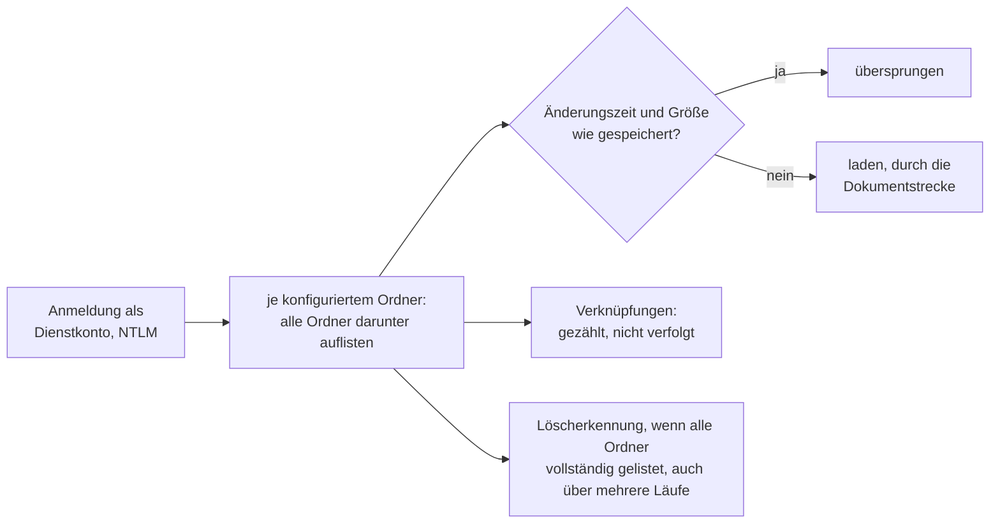

# Konnektor: Windows-Dateifreigabe (SMB)

> **Entwurf.** Dieses Kapitel beschreibt den Konnektor für Windows-Dateifreigaben und andere
> SMB-Server (etwa Samba oder ein NAS). Der gemeinsame Ablauf eines Indexierungslaufs und die
> Dokumentstrecke stehen im Kapitel [Indexierung](indexierung.md).

**Kurzfassung für den eiligen Betrieb**

1. Dateiserver im privaten Netz? Seinen Hostnamen in `OPAA_INDEXING_TARGET_VALIDATION_ALLOWLIST`
   eintragen ([Deployment](deployment.md)). OPAA braucht Port 445 zum Server.
2. Ein **Dienstkonto** anlegen, das sich mit **NTLM** am Server anmelden darf, und ihm
   **Leserecht auf alles** in den gewünschten Ordnern geben (Abschnitt 2.1). Kerberos allein
   genügt nicht.
3. Die Quellart ist ab Werk für niemanden außer der Systemverwaltung freigegeben. Wer außer ihr
   Bibliotheken anlegen soll, bekommt das Anlegerecht „Konnektorbibliotheken anlegen" für die
   Quellart SMB ([Bibliotheken und Berechtigungen](bibliotheken-und-berechtigungen.md),
   Abschnitt 9).
4. Bibliothek anlegen: Adresse `smb://server/freigabe`, Dienstkonto, Passwort, Ordner („Ordner
   laden“ hilft), „Verbindung testen“. Alles aus diesen Ordnern ist für **alle**
   Leseberechtigten der Bibliothek sichtbar.
5. Zeitplan setzen. Jeder Lauf ist ein **Vollabgleich** über alle Ordner; reicht das Budget
   nicht, setzt der nächste Lauf fort (Abschnitt 3).
6. Im Laufprotokoll auf „Geltungsbereich … nicht auflistbar“, „unvollständig, wird fortgesetzt“
   und „Verknüpfungen … werden nicht verfolgt“ achten.

## 1. Wofür er gedacht ist

Eine SMB-Bibliothek liest **eine** Freigabe auf **einem** Server mit **einem** Dienstkonto und
**einem bis fünfzig Ordnern** dieser Freigabe. Indiziert wird die aktuelle Fassung jeder Datei in
den unterstützten Formaten. Die Anhänge von Mail-Dateien werden zu eigenen Dokumenten.

Jedes Dokument trägt als Pfad `smb://server/freigabe/ordner/datei`. Der Pfad ist die Identität:
**Umbenennen oder Verschieben** einer Datei oder eines Ordners entfernt das alte Dokument und legt
ein neues an. Es gibt **keinen Beleg-Link**, den ein Browser öffnen könnte; „Original öffnen“
lädt die Datei durch OPAA (Abschnitt 6).

Der konfigurierte Ordner steht als Container am Dokument, die Ordner darunter als Gliederungspfad.

**Rechte werden nicht abgebildet.** Was das Dienstkonto lesen kann, sehen alle
Leseberechtigten der Bibliothek. Der Zuschnitt erfolgt über die Ordner und die Rechte des
Dienstkontos.

## 2. Quellkonfiguration

Wo diese Felder stehen: Detailansicht der Bibliothek, Reiter **„Quelle“**, Abschnitt
**„Anbindung“**; beim Anlegen im gleichnamigen Schritt des Assistenten. Die Ordner stehen im
Abschnitt **„Umfang“** und sind für jeden Leseberechtigten sichtbar.

| Feld der Bibliothek | Regel |
|---|---|
| Adresse (`sourceUrl`) | Pflicht. `smb://server[:port]/freigabe`; ein UNC-Pfad `\\server\freigabe` wird angenommen. Nur Server und Freigabe, Ordner darin stehen bei „Ordner“. Gespeichert mit kleingeschriebenem Server, ohne Port 445. Versteckte Freigaben (Name endet auf `$`) werden grundsätzlich nicht angebunden, auch keine Nutzfreigaben wie `Daten$`; das schließt die Verwaltungsfreigaben `C$`, `ADMIN$` und `IPC$` ein. |
| Zugangsdaten (`sourceCredentials`) | Pflicht. `DOMÄNE\Benutzer:Passwort`, `Benutzer@domäne:Passwort` oder `Benutzer:Passwort` für ein lokales Konto des Servers; das Formular hat die Felder „Dienstkonto“ und „Passwort“. Das Konto darf keinen Doppelpunkt enthalten. Verschlüsselt gespeichert, nie ausgegeben. Verwendet wird es nur für den Server der Adresse; ein anderer Server **oder eine andere Freigabe** verlangt das Passwort erneut, weil eine Freigabe eine eigene Rechtegrenze ist. |
| Ordner (`sourceSettings.folders`) | Ein bis fünfzig Pfade ab der Freigabe, etwa `/Projekte` oder `/Bauamt/Satzungen`; `/` oder keine Angabe liest die ganze Freigabe. Ein umgekehrter Schrägstrich gilt als Trenner. Zwei Ordner derselben Bibliothek dürfen sich nicht überschneiden, auch nicht bei anderer Groß- und Kleinschreibung. Kein Komma, kein `.` oder `..`, keines der Zeichen `\ : * ? " < > |`. Eine Änderung verwirft den Abgleichszustand. |

Proxy und „Zertifikatsprüfung aussetzen“ gibt es bei SMB nicht; die API lehnt sie ab.

**„Ordner laden“** zeigt die Ordner im Stamm der Freigabe. Ein Klick übernimmt den Ordner. Darf
das Dienstkonto den Stamm nicht auflisten, lassen sich die Pfade von Hand eintragen.
**„Verbindung testen“** meldet sich an, öffnet die Freigabe und prüft jeden Ordner. Jeder Befund
hat einen eigenen Satz (Abschnitt 7): Anmeldung abgelehnt, NTLM gesperrt, Freigabe nicht
gefunden, Freigabe nicht lesbar, Ordner nicht gefunden, Ordner nicht lesbar, Ordner ist eine
Verknüpfung.

### 2.1 Das Dienstkonto

- Ein eigenes Konto, kein persönliches. Es braucht **nur Leserechte**, auf der Freigabe und im
  Dateisystem darunter; OPAA schreibt nie.
- **Leserecht auf alles im Bereich.** Ist auf der Freigabe **zugriffsbasierte Aufzählung**
  (Access-Based Enumeration) eingeschaltet, zeigt der Server einen Ordner ohne Leserecht gar
  nicht erst an. Für OPAA ist er dann verschwunden, und seine Dokumente werden **entfernt**. Ohne
  diese Aufzählung meldet der Lauf den Ordner als nicht lesbar und entfernt nichts (Abschnitt 3).
- Das Konto muss sich über das Netzwerk mit **NTLM** (NTLMv2) anmelden dürfen. Eine Domäne, die
  NTLM für dieses Konto oder diesen Server sperrt, lässt sich noch nicht anbinden; Kerberos fehlt
  (Abschnitt 9).
- Signierte Verbindungen sind Pflicht; Verschlüsselung wird genutzt, wo der Server SMB 3
  anbietet. SMB 1 spricht OPAA nicht. Eine Anmeldung, die der Server nur als Gast annimmt, gilt als
  abgelehnt.

## 3. Betriebsart

Es gibt **nur den Vollabgleich**. SMB kennt kein Änderungsprotokoll, das ein Lauf abfragen
könnte. Jeder Lauf listet deshalb jeden Ordner unterhalb der konfigurierten Ordner. Eine Datei,
deren **Änderungszeit und Größe** dem gespeicherten Stand entsprechen, wird nicht neu geladen.

Anders als bei Nextcloud merkt sich OPAA bei SMB **keine Ordner**: Die Änderungszeit eines Ordners
ändert sich nur, wenn darin direkt etwas angelegt, gelöscht oder umbenannt wird, nicht beim
Schreiben einer Datei und nicht tiefer im Baum. Sie taugt nicht als Merkmal für den ganzen Baum.

Entfernt werden Dokumente nur nach einem Lauf, der alle Ordner eines Bereichs vollständig gelistet
hat:

- Ein **nicht lesbarer Unterordner** wird im Protokoll genannt, der Rest gelistet. Der Bereich gilt
  dann als unvollständig; im Bereich wird nichts entfernt, bis alle Ordner lesbar sind.
- Ein Ordner tiefer als 64 Ebenen wird nicht gelistet und macht den Bereich ebenso unvollständig.
- Ist der konfigurierte Ordner selbst nicht lesbar, gilt der ganze Bereich als nicht auflistbar.
- Ein Ordner, den die Auflistung zeigte, der sich danach aber nicht öffnen lässt (seither
  gelöscht oder eine Verknüpfung, die der Server selbst auflöst), gilt als verschwunden.

Ein Ordner wird beim Betreten ganz gelesen und nach Namen sortiert, seine Einträge dann seitenweise
verarbeitet; Dateien werden schon geladen, während die Auflistung weiterläuft.

### 3.1 Abgleich über mehrere Läufe

Die Ordner werden in Namensreihenfolge abgearbeitet, jeder Ordner vollständig, bevor der nächste
an der Reihe ist. Reicht `request-budget-per-run` nicht für alles, endet der Lauf geordnet als
„unvollständig, wird fortgesetzt“, und OPAA merkt sich die Stelle samt dem, was der Abgleich bis
dahin gefunden hat: nicht lesbare und zu tiefe Ordner und die Ordner, denen er schon begegnet ist.
Der nächste Lauf öffnet nur die Ordner auf dem Weg zu dieser Stelle noch einmal und setzt danach
fort; fertige Bereiche liest er nicht erneut.

Ist jeder Bereich bis zum Ende gelistet, ist der Abgleich vollständig, auch wenn er mehrere Läufe
gebraucht hat. Dann werden die Dokumente entfernt, die keiner dieser Läufe gesehen hat. Weil der
Pfad die Identität ist, ist eine Datei, die in keinem Lauf an ihrem Ort war, unter diesem Pfad
wirklich weg.

- Eine Datei, die gelöscht wird, nachdem ihr Ordner gelistet war, bleibt bis zum nächsten
  Abgleich.
- Eine Datei, die an einer schon gelisteten Stelle neu angelegt wird, kommt mit dem nächsten
  Abgleich.
- **Umbenannt oder verschoben während eines Abgleichs:** Liegt der neue Ort vor der gemerkten
  Stelle, entfernt der Abgleich das Dokument unter dem alten Pfad, bevor der neue gelistet ist.
  Dasselbe gilt für eine Datei, die gelöscht und am selben Ort neu angelegt wird, nachdem ihr
  Ordner gelistet war. Die Lücke dauert bis zum nächsten Abgleich; dann ist die Datei unter ihrem
  Pfad wieder da.
- Was ein Lauf zwischendurch an Dateien bestätigt, auch einzeln, zählt für den Abgleich mit.
- Die Obergrenze `max-entries-per-run` gilt für den ganzen Abgleich, nicht je Lauf.
- Ein Lauf, der an einem Fehler scheitert (Anmeldung abgelehnt, Server nicht erreichbar), ändert
  die gemerkte Stelle nicht und entfernt nichts; der nächste setzt an derselben Stelle fort.
- Ein Bereich, der sich nicht vollständig listen lässt, beginnt beim nächsten Lauf von vorn;
  entfernt wird erst nach einem vollständigen Durchgang.

## 4. Verknüpfungen, besondere Dateien und Namen

- **Symbolische Links, Junctions und DFS-Verweise** werden nicht verfolgt, weder beim Auflisten
  noch beim Öffnen einer Datei oder eines Ordners. Sie erscheinen gezählt im Protokoll
  („Verknüpfungen … werden nicht verfolgt“). Ein Verweis in einen DFS-Namensraum wird nicht
  aufgelöst; ist die Freigabe selbst ein DFS-Namensraum, die Zielfreigabe direkt angeben.
- **Samba** löst Unix-Links meist selbst auf (`follow symlinks`) und zeigt sie als gewöhnliche
  Datei oder als Ordner. OPAA öffnet sie trotzdem nicht. Ein Ordner, dem der Abgleich schon unter
  einem anderen Namen begegnet ist, auch in einem früheren Lauf desselben Abgleichs, gilt als
  Verknüpfung; in Namensreihenfolge gewinnt der erste Name. Das beendet Schleifen.
- **Deduplizierte Dateien** (Windows-Datendeduplizierung) werden normal gelesen.
- **Ausgelagerte Dateien** (offline, nur bei Zugriff zurückgeholt, etwa durch ein Archivsystem
  oder einen Cloud-Speicher) werden nicht geladen: ein Abruf würde die Rückholung auslösen. Sie
  gelten als vorhanden; eine gespeicherte Fassung bleibt.
- Ein Name mit `/`, `\`, `:` oder Steuerzeichen, den nur ein Nicht-Windows-Server liefern kann,
  wird nicht gelesen und gezählt im Protokoll genannt.
- Ein Pfad über 2000 Zeichen wird nicht gelesen.

## 5. Ordner in der Bibliothek

Der Lauf spiegelt die Ordner unterhalb der konfigurierten Ordner. Bei einem konfigurierten Ordner
ist er die Wurzel, bei mehreren beginnt jede Kette mit seinen Pfadsegmenten. Ordner entstehen nur
entlang gefundener Dokumente und sind nicht bearbeitbar; die Quelle ist führend.

## 6. Original

**„Original öffnen“** lädt die Datei durch OPAA, mit dem Dienstkonto, nach der Größengrenze, von
dem Pfad, den das Dokument trägt. Eine seither gelöschte oder umbenannte Datei, eine Datei
außerhalb der konfigurierten Ordner und eine Verknüpfung liefern kein Original. Einen Link, den
ein Browser öffnen könnte, gibt es nicht: `smb://`-Adressen öffnet kein Browser.

## 7. Fehlerbilder

| Protokoll oder Testmeldung | Bedeutung | Abhilfe |
|---|---|---|
| „Der Server „…“ hat die Anmeldung von „…“ abgelehnt.“ | Konto, Domäne oder Passwort falsch, Konto gesperrt, abgelaufen oder Passwortwechsel fällig; der Lauf endet ohne Änderung am Bestand. | Konto prüfen, Passwort neu eintragen. |
| „… hat die Anmeldung von „…“ verweigert (Zugriff verweigert).“ | Das Konto darf sich nicht über das Netzwerk an diesem Server anmelden. | Recht „Auf diesen Computer vom Netzwerk aus zugreifen“ prüfen. |
| „… lässt keine Anmeldung mit NTLM zu. OPAA unterstützt Kerberos noch nicht …“ | NTLM ist für das Konto oder den Server gesperrt. | NTLM für das Dienstkonto zulassen (Ausnahmeliste der NTLM-Einschränkung). |
| „… hat „…“ nur als Gast angemeldet …“ | Der Server kennt das Konto nicht und bietet einen Gastzugang an. | Konto und Domäne prüfen. |
| „Die Freigabe „…“ gibt es auf dem Server „…“ nicht.“ | Freigabename falsch oder entfernt. | Adresse prüfen. |
| „Das Dienstkonto darf die Freigabe „…“ nicht lesen (Zugriff verweigert).“ | Keine Freigabeberechtigung. | Freigabeberechtigung „Lesen“ für das Konto. |
| „Geltungsbereich „/…“: Diese Ordner konnte das Dienstkonto nicht lesen: …“ | NTFS-Rechte fehlen auf diesen Ordnern; der Rest wird gelesen, im Bereich wird nichts entfernt. | Leserecht vererben oder Ordner aus dem Bereich nehmen. |
| „… liegen tiefer als 64 Ebenen und wurden nicht gelesen …“ | Sehr tiefe Ordnerstruktur, meist eine Schleife. | Struktur prüfen, Bereich enger fassen. |
| „… liegt hinter einem DFS-Verweis …“ | Der konfigurierte Ordner oder die Freigabe ist DFS. | Zielserver und -freigabe direkt eintragen. |
| „… führt über mehr als 16 Verknüpfungen (Schleife) …“ | Eine Verknüpfungsschleife im Pfad. | Verknüpfungen auf dem Server bereinigen. |
| „… ist von einem anderen Programm gesperrt.“ | Die Datei ist exklusiv geöffnet; die gespeicherte Fassung bleibt. | Nichts; der nächste Lauf versucht es erneut. |
| „… ist ausgelagert (offline) …“ | Die Datei liegt im Archiv. | Datei auf dem Server zurückholen, wenn sie gebraucht wird. |
| „Der Server „…“ hat nicht rechtzeitig geantwortet.“ | Netz oder Server überlastet; der Lauf endet. | Erreichbarkeit prüfen, `request-timeout` anheben. |
| „Die Verbindung zum Server „…“ ist gescheitert (SMB 2 oder 3 mit Signatur erforderlich).“ | Der Server spricht nur SMB 1 oder signiert nicht. | SMB 2/3 mit Signatur auf dem Server einschalten. |
| Zieladressprüfung lehnt den Host ab | Dateiserver im privaten Adressbereich. | Hostnamen in `OPAA_INDEXING_TARGET_VALIDATION_ALLOWLIST`. |
| „unvollständig, wird fortgesetzt“ | Anfragebudget des Laufs erschöpft; die Stelle ist gemerkt (Abschnitt 3.1). | Nichts; der nächste Lauf setzt fort. Dauerhaft: Budget anheben. |
| „Der Lauf hat keine Datei neu aufgenommen …“ | Das Budget reicht nicht, um die Ordner auf dem Weg zur gemerkten Stelle zu öffnen und weiterzukommen. | `request-budget-per-run` anheben. |
| „Geltungsbereich „/…“: Der Fortsetzungspunkt … Die Auflistung dieses Geltungsbereichs beginnt neu.“ | Die gemerkte Stelle stammt aus einer anderen Fassung von OPAA; der Bereich wird von vorn gelistet, entfernt wird nichts. | Nichts. |

## 8. Konfiguration

Instanzweit unter `opaa.indexing.smb.*`, als Umgebungsvariablen `OPAA_INDEXING_SMB_*` (Liste im
Kapitel [Deployment](deployment.md)):

| Eigenschaft | Standard | Wirkung |
|---|---|---|
| `max-file-size-bytes` | 50 MiB | Obergrenze einer Datei, vor und während des Downloads |
| `request-timeout` | 30 s | Zeitlimit für den Verbindungsaufbau und je SMB-Nachricht |
| `request-budget-per-run` | 100 000 | SMB-Nachrichten je Lauf, danach endet er geordnet als unvollständig, und der nächste setzt fort; ein Download kostet mindestens vier (öffnen, prüfen, lesen, schließen), ein Ordner mindestens fünf |
| `max-entries-per-run` | 1 000 000 | gelistete Dateien je Vollabgleich, auch über mehrere Läufe; danach scheitert der Lauf sichtbar |
| `download-concurrency` | 2 | gleichzeitige Downloads je Lauf |
| `list-page-size` | 1000 | Einträge oder geöffnete Ordner, die ein Lauf auflistet, bevor er die Dateien davon verarbeitet und sich die Stelle merken kann |

## 9. Was nicht gebaut ist

- **Kerberos.** OPAA meldet sich nur mit NTLM an. Kerberos bräuchte eine Kerberos-Konfiguration,
  einen erreichbaren KDC und eine Keytab je Installation.
- **Inhaltsänderung ohne neue Änderungszeit.** Setzt ein Werkzeug die Änderungszeit einer Datei
  zurück und bleibt die Größe gleich, bemerkt der Lauf die Änderung nicht.
- **Sehr viele Ordner in einem Bereich.** Die gemerkte Stelle enthält die Datei-IDs aller Ordner,
  denen der Abgleich begegnet ist. Wird sie zu groß (bei mehreren hunderttausend Ordnern in einem
  Bereich), merkt sich OPAA keine neue Stelle mehr, und ein Lauf, der danach am Budget endet,
  kommt in diesem Bereich nicht weiter. Abhilfe: den Bereich in mehrere Ordner aufteilen.
- **Geteilte Datei-ID.** Teilen sich zwei Ordner eine Datei-ID (etwa bei Samba mit mehreren
  Dateisystemen unter einer Freigabe), hält OPAA den zweiten für eine Verknüpfung; er fehlt dann
  ohne Befund, und sein Bestand wird entfernt.
- **Ein- und Ausschlussmuster** wie beim S3-Konnektor. Heute schränken nur die Ordner ein.
- **Benachrichtigungen** des Servers an OPAA. Änderungen kommen mit dem nächsten geplanten Lauf.
- **Zugänge** (Verbindungsprofile) für SMB.
- **Rechte aus der Freigabe.** Die Bibliothek bestimmt, wer liest.
