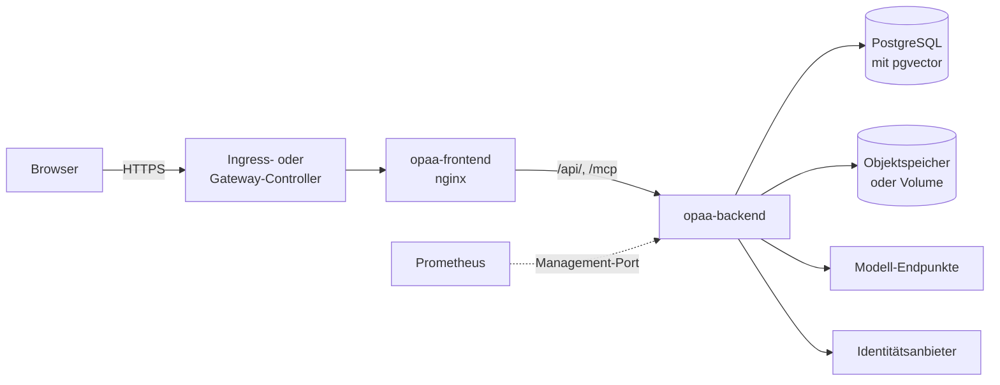

# Kubernetes

> **Entwurf.** Dieses Kapitel ist geschrieben und gegen den Helm-Chart geprüft, aber noch nicht
> abgenommen.

OPAA lässt sich unter Kubernetes mit dem Helm-Chart des Projekts betreiben. Der Chart startet
dieselben Images wie der Compose-Stapel aus dem Kapitel [Deployment](deployment.md): ein Backend und
ein Frontend. Datenbank, Modelle, Objektspeicher und Identitätsanbieter betreibt das Haus selbst; der
Chart bindet sie an.

Dieses Kapitel beschreibt, was unter Kubernetes anders ist und welcher Wert des Charts welche
Einstellung setzt. Was für beide Betriebswege gleich gilt, steht weiterhin im Kapitel
[Deployment](deployment.md), und dieses Kapitel verweist an der jeweiligen Stelle dorthin: die Bedeutung
der Umgebungsvariablen, die Authentifizierung, der Erststart, die Originalablage, die Voraussetzungen
der Datenbank und was ein Update mit dem Index macht.

## Kubernetes oder Compose

Beide Wege führen zur selben Anwendung mit denselben Grenzen. Insbesondere gilt unter Kubernetes
dieselbe Grundannahme wie im Compose-Betrieb: **genau eine Backend-Instanz.** Zeitpläne, Caches und
der Wiederanlauf abgebrochener Läufe sind an den einen Prozess gebunden. Der Chart setzt das
durch:

- Das Backend-Deployment hat ein Replikat. `backend.replicas` lässt `1` und `0` (angehalten) zu; ein
  größerer Wert bricht das Rendern mit einer Meldung ab.
- Die Strategie ist `Recreate`. Bei einer Aktualisierung endet der alte Pod, bevor der neue startet;
  zwei Fassungen laufen nie gleichzeitig gegen dieselbe Datenbank. Eine Aktualisierung ist deshalb
  eine **kurze Unterbrechung**.
- Das Frontend hält keinen Zustand und darf mehrfach laufen (`frontend.replicas`).

Kubernetes bringt damit keine Hochverfügbarkeit des Backends. Es bringt die vorhandene Plattform des
Hauses: Eingang und Zertifikate, Geheimnisverwaltung, Überwachung, Netztrennung und GitOps.

| Thema | Compose ([Deployment](deployment.md)) | Kubernetes (dieses Kapitel) |
|---|---|---|
| Konfiguration | `.env.docker` | Werte-Datei des Charts und ein Secret; weitere Variablen über `backend.extraEnv` |
| Betriebsmodus | `SPRING_PROFILES_ACTIVE` frei wählbar | fest `oidc`; der Entwicklungsmodus ist nicht vorgesehen |
| Datenbank | im Stapel mitgeliefert | extern; zur Erprobung eine zuschaltbare Datenbank im Release |
| Identitätsanbieter | Keycloak im Stapel zuschaltbar | extern oder nur lokale Konten |
| Originalablage | Verzeichnis auf dem Host oder Objektspeicher | Objektspeicher oder PersistentVolumeClaim |
| Eingang und TLS | eigener Reverse-Proxy vor dem Frontend | Ingress oder HTTPRoute, TLS am Controller |
| Vertraute Proxys | feste Adresse des Frontend-Containers | Pod-Netz, abgesichert durch zwei NetworkPolicies |
| Eigene CA | Kopie des Truststores einhängen | `extraCACertificates`, Truststore entsteht bei jedem Start |
| Beschreibbare Pfade | benannte Volumes | `emptyDir` je Pod |
| Aktualisierung | `docker compose pull` und `up -d` | `helm upgrade` |

Was der Chart anlegt, mit dem Release-Namen `opaa`:

| Objekt | Name | Wann |
|---|---|---|
| Deployment, Service, ConfigMap | `opaa-backend` | immer |
| Deployment, Service | `opaa-frontend` | immer |
| ServiceAccount | `opaa` | `serviceAccount.create` |
| Secret | `opaa` | ohne `secrets.existingSecret` |
| PersistentVolumeClaim | `opaa-uploads` | Originalablage auf einem Volume ohne `existingClaim` |
| StatefulSet, Service | `opaa-postgresql` | `evaluationDatabase.enabled` |
| NetworkPolicies | `opaa-backend-ingress` und weitere | siehe [NetworkPolicies](#networkpolicies) |
| Ingress oder HTTPRoute | `opaa` | `ingress.enabled` bzw. `httpRoute.enabled` |
| ServiceMonitor, PrometheusRule | `opaa-backend`, `opaa` | siehe [Betriebsüberwachung](#betriebsüberwachung) |
| Pod für `helm test` | `opaa-test-health` | nur während `helm test` |

Enthält der Release-Name nicht `opaa`, beginnen die Namen mit `<Release-Name>-opaa`. Alle Befehle
dieses Kapitels verwenden den Release-Namen `opaa` und den Namespace `opaa`.



## Voraussetzungen

| Was | Anforderung |
|---|---|
| Kubernetes | eine der drei jüngsten Minor-Versionen, die das Kubernetes-Projekt zum Zeitpunkt des OPAA-Releases pflegt; ältere können funktionieren, werden aber nicht geprüft |
| Knoten | `linux/amd64` oder `linux/arm64`; beide Images gibt es für beide Architekturen, der Knoten zieht die passende |
| Helm | Helm 4, oder Helm 3 ab 3.8 |
| Namespace | Pod Security Admission auf `restricted` ist möglich und empfohlen; der Chart braucht keine Ausnahme |
| Netzwerkschicht | setzt NetworkPolicies durch, sobald `trustedProxyCidrs` gesetzt wird (siehe [Proxy-Kette und Client-Adresse](#proxy-kette-und-client-adresse)) |
| Eingang | ein Ingress-Controller oder eine Gateway-API-Implementierung mit einem Gateway; ein DNS-Name und ein Zertifikat, etwa über cert-manager |
| Datenbank | PostgreSQL mit pgvector 0.8.0 oder neuer, vom Cluster aus erreichbar, mit einer Datenbank und einem Konto für OPAA; Vorbereitung siehe [Voraussetzungen einer eigenen PostgreSQL](deployment.md#voraussetzungen-einer-eigenen-postgresql) |
| Originalablage | ein vorher angelegter Bucket in einem S3-kompatiblen Objektspeicher mit Zugangs- und Geheimschlüssel, oder eine StorageClass für ein Volume mit `ReadWriteOnce` |
| Modelle | ein OpenAI-kompatibler Endpunkt für die Einbettung und einer für den Chat, wahlweise im Cluster; optional ein Rerank-Endpunkt (siehe [LLM-Anbieter](deployment.md#llm-anbieter)) |
| Identitätsanbieter | optional ein OIDC-Anbieter mit einem öffentlichen Client; ohne ihn melden sich Personen mit lokalen Konten an |
| Mailserver | optional; wird nach der Installation in der Oberfläche eingerichtet |
| Postfach | eine zustellbare Adresse für das erste Systemverwalter-Konto, am besten ein Funktionspostfach der IT |

Für eine Erprobung ohne eigene Datenbank bringt der Chart eine Erprobungsdatenbank mit (siehe
[Datenbank](#datenbank)). Sie ist nicht für den Betrieb gedacht.

## Installation

### 1. Namespace anlegen

```bash
kubectl create namespace opaa
kubectl label namespace opaa \
  pod-security.kubernetes.io/enforce=restricted \
  pod-security.kubernetes.io/warn=restricted
```

Der Namespace wird vor dem Chart angelegt, damit die Labels von Anfang an gelten. `helm install`
braucht dann kein `--create-namespace`.

### 2. Datenbank vorbereiten

Ein Datenbankverwalter legt die Erweiterung `vector` und gegebenenfalls die Rolle
`opaa_audit_owner` an, bevor OPAA zum ersten Mal startet. Die Befehle stehen unter
[Voraussetzungen einer eigenen PostgreSQL](deployment.md#voraussetzungen-einer-eigenen-postgresql).
Soll OPAA in einem eigenen Schema liegen, muss es ebenfalls vorher existieren
([Eigenes Datenbankschema](deployment.md#eigenes-datenbankschema)).

### 3. Geheimnisse anlegen

Der empfohlene Weg ist ein Secret, das der Chart nur liest (`secrets.existingSecret`). Welche
Schlüssel es enthält, steht unter [Geheimnisse](#geheimnisse). Die Schlüssel werden zuerst in Dateien
erzeugt, damit eine Kopie außerhalb des Clusters entsteht:

```bash
umask 077
mkdir opaa-geheimnisse
cd opaa-geheimnisse
openssl rand -base64 48 | tr -d '\n' > OPAA_AUTH_JWT_SECRET
openssl rand -base64 32 | tr -d '\n' > OPAA_CREDENTIALS_ENCRYPTION_KEY
openssl rand -base64 32 | tr -d '\n' > OPAA_SETTINGS_ENCRYPTION_KEY
printf '%s' '<Passwort des Datenbankkontos>' > OPAA_DB_PASSWORD
printf '%s' '<Zugangsschlüssel des Objektspeichers>' > OPAA_UPLOAD_S3_ACCESS_KEY
printf '%s' '<Geheimschlüssel des Objektspeichers>' > OPAA_UPLOAD_S3_SECRET_KEY
kubectl -n opaa create secret generic opaa-secrets --from-file=.
cd ..
```

Jede Datei wird ein Schlüssel des Secrets, ihr Name ist der Schlüsselname. `tr -d '\n'` und
`printf '%s'` verhindern einen Zeilenumbruch am Ende des Werts. Die beiden Dateien des Objektspeichers
entfallen, wenn die Originale auf einem Volume liegen. Optionale Schlüssel, etwa ein API-Schlüssel der
Modelle, kommen als weitere Datei dazu.

**Das Verzeichnis ist danach die einzige Kopie der Verschlüsselungsschlüssel außerhalb des
Clusters.** Es gehört dorthin, wo das Haus seine Notfallgeheimnisse verwahrt, und vom Arbeitsrechner
gelöscht. Wer External Secrets, Sealed Secrets oder Vault verwendet, legt dort ein Secret mit
denselben Schlüsselnamen an.

### 4. Werte-Datei schreiben

Eine Werte-Datei für den Betrieb mit Objektspeicher, Identitätsanbieter und Ingress:

```yaml
# opaa-werte.yaml
publicBaseUrl: https://opaa.example.org

database:
  host: postgres.example.org
  sslMode: verify-full

embedding:
  baseUrl: https://modelle.example.org/v1
  model: nomic-embed-text
  dimensions: 768

bootstrap:
  initialAdmin:
    email: it-postfach@example.org
  oidc:
    issuerUri: https://login.example.org/realms/opaa
    clientId: opaa
  chatModel:
    baseUrl: https://modelle.example.org/v1
    model: qwen2.5:7b

secrets:
  existingSecret: opaa-secrets

uploads:
  store: s3
  s3:
    endpoint: https://s3.example.org
    bucket: opaa-originale

frontend:
  cspConnectSrcExtra: https://login.example.org

ingress:
  enabled: true
  className: nginx
  host: opaa.example.org
  annotations:
    nginx.ingress.kubernetes.io/proxy-body-size: 52m
    nginx.ingress.kubernetes.io/proxy-read-timeout: "600"
    nginx.ingress.kubernetes.io/proxy-buffering: "off"
  tls:
    - secretName: opaa-tls
      hosts:
        - opaa.example.org
```

- **Pflicht** sind `publicBaseUrl`, `database.host` (ohne Erprobungsdatenbank),
  `embedding.baseUrl`, `embedding.model`, `embedding.dimensions`,
  `bootstrap.initialAdmin.email`, `bootstrap.chatModel.baseUrl` und `bootstrap.chatModel.model`,
  dazu die Geheimnisse und beim Objektspeicher `uploads.s3.endpoint` und `uploads.s3.bucket`. Fehlt
  einer, lehnt der Chart die Installation mit einer Meldung ab, die den Wert nennt.
- `publicBaseUrl` ist die Adresse, unter der Personen OPAA aufrufen: mit Schema, ohne Pfad und ohne
  Schrägstrich am Ende. OPAA läuft immer an der Wurzel seines Hostnamens; ein Unterpfad ist mit dem
  Chart nicht möglich.
- `embedding.dimensions` muss zum Einbettungsmodell passen und lässt sich später nur mit einer
  Neuindizierung ändern.
- `bootstrap.*` sind **Startwerte**. Sie wirken nur beim allerersten Start (siehe
  [Was der Chart setzt und was die Oberfläche pflegt](#was-der-chart-setzt-und-was-die-oberfläche-pflegt)).
- Ohne Identitätsanbieter entfällt `bootstrap.oidc` ganz, und `frontend.cspConnectSrcExtra` bleibt
  leer.
- Der Eingang ist hier ein Ingress für ingress-nginx; andere Controller und die Gateway API stehen
  unter [Eingang](#eingang).

Liegen die Originale auf einem Volume statt im Objektspeicher, ersetzt dieser Block den Abschnitt
`uploads`:

```yaml
uploads:
  store: persistentVolumeClaim
  persistence:
    size: 20Gi
    fsGroup: 65532
```

`fsGroup` ist nur nötig, wenn das Volume sonst nicht beschreibbar ist (siehe
[Originalablage](#originalablage)).

Vor der Installation zeigt `helm template`, ob der Chart die Werte annimmt. Die vollständige Liste
aller Werte samt Kommentaren liefert `helm show values`:

```bash
helm template opaa oci://ghcr.io/criew/charts/opaa --version <x.y.z> -n opaa -f opaa-werte.yaml > /dev/null
helm show values oci://ghcr.io/criew/charts/opaa --version <x.y.z>
```

### 5. Installieren

Jedes Release von OPAA veröffentlicht den Chart neben den Images in der GitHub Container Registry.
Chart und Images tragen dieselbe Versionsnummer; ohne eigene Angabe startet der Chart genau die Images
seiner Version:

```bash
helm install opaa oci://ghcr.io/criew/charts/opaa --version <x.y.z> -n opaa -f opaa-werte.yaml
```

Die verfügbaren Versionen und ihre Vorbereitungsschritte stehen unter *Releases* im
GitHub-Repository. Vor dem ersten Release mit Chart liegt unter dieser Adresse noch keine Version;
bis dahin bleibt nur die Installation aus einem Checkout. Wer den Entwicklungsstand `main` aus einem Checkout des Repositorys installiert,
nennt die Image-Tags ausdrücklich, weil der Chart im Repository keine Release-Version trägt:

```bash
helm install opaa deploy/helm/opaa -n opaa -f opaa-werte.yaml \
  --set backend.image.tag=main --set frontend.image.tag=main
```

### 6. Auf das Backend warten und prüfen

Der erste Start legt das Datenbankschema an. Das Backend meldet sich erst danach bereit:

```bash
kubectl -n opaa rollout status deploy/opaa-backend --timeout=15m
helm test opaa -n opaa
```

`helm test` ruft über den Frontend-Service `/api/health` ab und prüft damit die Kette Frontend-nginx
→ Backend. Schlägt einer der beiden Schritte fehl, hilft die [Fehlersuche](#fehlersuche).

### 7. Erste Anmeldung

Beim ersten Start legt OPAA das lokale Systemverwalter-Konto für die Adresse aus
`bootstrap.initialAdmin.email` an. Enthält das Secret kein `OPAA_INITIAL_ADMIN_PASSWORD`, steht ein
Einmalpasswort **einmalig** im Protokoll des ersten Starts:

```bash
kubectl -n opaa logs deploy/opaa-backend | grep -A5 NOTANKER
```

Mit `backend.logFormat` ist der Block ein einziges JSON-Ereignis; dann im Log-Sammler nach `NOTANKER`
suchen. Die Anmeldung läuft über `<publicBaseUrl>/login/system`. Was danach zu tun ist (Passwort
wechseln, persönliche Verwalterkonten anlegen, Notanker versiegeln), steht unter
[Erststart und Systemverwalter-Konto](deployment.md#erststart-und-systemverwalter-konto).

### 8. Nach der Ersteinrichtung

- **In der Oberfläche einrichten:** Mailserver ([E-Mail-Versand](deployment.md#e-mail-versand-smtp)),
  weitere Identitätsanbieter, weitere Chat-Modelle, Verzeichnisabgleich und Fremdzugänge.
- **Client-Adresse richtigstellen:** `trustedProxyCidrs` und die Eingangs-Policy des Frontends setzen
  (siehe [Proxy-Kette und Client-Adresse](#proxy-kette-und-client-adresse)). Bis dahin teilen sich
  alle Personen einen Zähler der Rate-Limits und der Anmeldesperre.
- **Ausgang begrenzen:** die Egress-Policies einschalten, sobald alle Ziele bekannt sind (siehe
  [NetworkPolicies](#networkpolicies)).
- **Überwachung anschließen:** siehe [Betriebsüberwachung](#betriebsüberwachung).
- **Sicherung einrichten:** siehe [Sicherung und Wiederherstellung](#sicherung-und-wiederherstellung).

### Erprobung ohne Eingang und ohne eigene Datenbank

Für eine Erprobung auf einem Testcluster genügt eine Werte-Datei mit der Erprobungsdatenbank, einem
Volume für die Originale und Geheimnissen in den Werten:

```yaml
# opaa-erprobung.yaml - nicht für den Betrieb
publicBaseUrl: http://localhost:8080
evaluationDatabase:
  enabled: true
embedding:
  baseUrl: http://ollama.ai.svc.cluster.local:11434/v1
  model: nomic-embed-text
  dimensions: 768
bootstrap:
  initialAdmin:
    email: it-postfach@example.org
  chatModel:
    baseUrl: http://ollama.ai.svc.cluster.local:11434/v1
    model: qwen2.5:7b
uploads:
  store: persistentVolumeClaim
  persistence:
    fsGroup: 65532
secrets:
  jwtSecret: <Ausgabe von openssl rand -base64 48>
  databasePassword: <frei gewähltes Passwort>
  credentialsEncryptionKey: <Ausgabe von openssl rand -base64 32>
  settingsEncryptionKey: <Ausgabe von openssl rand -base64 32>
```

Erreichbar ist die Installation dann über eine Portweiterleitung auf genau die Adresse aus
`publicBaseUrl`; eine andere Adresse lehnt das Backend als fremde Herkunft ab:

```bash
kubectl -n opaa port-forward svc/opaa-frontend 8080:80
```

Die Erprobungsdatenbank hat keine Sicherung, keine Replikation und keinen Aktualisierungsweg über
Hauptversionen von PostgreSQL. Wer aus der Erprobung einen Betrieb macht, setzt neu auf.

## Geheimnisse

Geheimnisse stehen nie in der ConfigMap. Der Chart liest sie aus einem Secret, auf einem von zwei
Wegen:

- **Vorhandenes Secret** (`secrets.existingSecret`), empfohlen. Der Chart legt dann kein Secret an
  und ignoriert die übrigen Werte unter `secrets`.
- **Secret aus den Werten.** Der Chart legt das Secret aus `secrets.jwtSecret` und den übrigen
  Werten an. Die Geheimnisse stehen dann in der Werte-Datei und in den Daten des Helm-Releases.

| Schlüssel im Secret | Wert unter `secrets` | Pflicht | Inhalt |
|---|---|---|---|
| `OPAA_AUTH_JWT_SECRET` | `jwtSecret` | ja | Wurzelgeheimnis der lokalen Anmeldung, mindestens 32 Zeichen, erzeugt mit `openssl rand -base64 48` |
| `OPAA_DB_PASSWORD` | `databasePassword` | ja | Passwort des Datenbankkontos |
| `OPAA_CREDENTIALS_ENCRYPTION_KEY` | `credentialsEncryptionKey` | ja | Base64 von 32 Zufallsbytes, erzeugt mit `openssl rand -base64 32`; verschlüsselt Zugangsdaten von Quellen und Verbindungen |
| `OPAA_SETTINGS_ENCRYPTION_KEY` | `settingsEncryptionKey` | ja | wie oben; verschlüsselt Modellschlüssel und das Passwort des Mailservers |
| `OPAA_UPLOAD_S3_ACCESS_KEY` | `s3AccessKey` | bei `uploads.store: s3` | Zugangsschlüssel des Objektspeichers |
| `OPAA_UPLOAD_S3_SECRET_KEY` | `s3SecretKey` | bei `uploads.store: s3` | Geheimschlüssel des Objektspeichers |
| `OPAA_OPENAI_EMBEDDING_API_KEY` | `embeddingApiKey` | nein | Schlüssel des Einbettungs-Endpunkts |
| `OPAA_OPENAI_CHAT_API_KEY` | `chatApiKey` | nein | Schlüssel des ersten Chat-Modells; Startwert |
| `OPAA_RERANK_API_KEY` | `rerankApiKey` | nein | Schlüssel des Rerank-Endpunkts |
| `OPAA_INITIAL_ADMIN_PASSWORD` | `initialAdminPassword` | nein | festes Anfangspasswort des ersten Systemverwalters statt eines erzeugten; Startwert |

Die Verschlüsselungsschlüssel sind im Chart Pflicht, auch wenn noch nichts verschlüsselt gespeichert
ist. Ein fehlender Schlüssel fiele sonst erst auf, wenn die erste Quelle ihre Zugangsdaten speichert.

**Wo ein fehlender Schlüssel auffällt.** Bei Geheimnissen aus den Werten lehnt der Chart die
Installation ab. Bei einem vorhandenen Secret sieht der Chart nur den Namen; fehlt ein
Pflichtschlüssel, startet der Pod nicht (`CreateContainerConfigError`), und `kubectl describe pod`
nennt den Schlüssel. Ein optionaler Schlüssel darf fehlen.

**Der Chart erzeugt keine Schlüssel.** Ein bei der Installation zufällig erzeugter Schlüssel ginge mit
`helm template`, in GitOps-Werkzeugen oder bei einer Neuinstallation verloren. Geht einer der beiden
Verschlüsselungsschlüssel verloren, sind die damit gespeicherten Geheimnisse unlesbar (siehe
[Zugangsdaten-Verschlüsselung](deployment.md#zugangsdaten-verschlüsselung)). Deshalb gehört eine
Kopie außerhalb des Clusters zur Sicherung.

**Ein geänderter Schlüssel wirkt erst nach einem Neustart.** Bei einem vorhandenen Secret startet
`kubectl -n opaa rollout restart deploy/opaa-backend` das Backend neu. Bei Geheimnissen aus den Werten
startet `helm upgrade` es von selbst. Eine Änderung von `OPAA_AUTH_JWT_SECRET` beendet alle lokalen
Sitzungen und entwertet alle offenen Einladungs- und Rücksetzlinks.

## Wertereferenz

OPAA kennt drei Arten von Konfiguration. Der Chart behandelt sie unterschiedlich:

| Art | Gelesen | Im Chart |
|---|---|---|
| **Bereitstellungswerte** | bei jedem Start | alle Werte außer `bootstrap`; eine Änderung wirkt mit dem nächsten `helm upgrade` |
| **Startwerte** | einmal, beim ersten Start, dann in die Datenbank übernommen | `bootstrap` und die Schlüssel `OPAA_OPENAI_CHAT_API_KEY` und `OPAA_INITIAL_ADMIN_PASSWORD` |
| **Verwaltungseinstellungen** | nur aus der Datenbank | keine Werte; Einrichtung in der Oberfläche |

Die folgenden Tabellen nennen jeden Wert des Charts mit seiner Vorgabe und der Umgebungsvariablen, die
er setzt. Bedeutung und Wertebereich der Variablen stehen in der
[Variablenliste](deployment.md#alle-umgebungsvariablen) des Deployment-Kapitels. `values.schema.json`
prüft die Werte beim Rendern; ein unbekannter Schlüssel wird abgelehnt.

### Allgemein

| Wert | Vorgabe | Setzt | Wirkung |
|---|---|---|---|
| `publicBaseUrl` | leer, Pflicht | `OPAA_PUBLIC_BASE_URL`, `OPAA_CORS_ALLOWED_ORIGINS` | öffentliche Adresse; Basis aller Links in Mails, der OAuth-Rücksprungadresse und der erlaubten Herkunft |
| `nameOverride`, `fullnameOverride` | leer | — | ersetzt `opaa` bzw. den ganzen Namensstamm der Objekte |
| `imagePullSecrets` | leer | — | Secrets für eine eigene Registry, an allen Pods |
| `serviceAccount.create` | `true` | — | legt einen ServiceAccount an; kein Pod hängt dessen Token ein |
| `serviceAccount.name`, `serviceAccount.annotations` | leer | — | Name eines eigenen oder vorhandenen Kontos, Annotationen |
| `podSecurityContext` | `runAsNonRoot`, `seccompProfile: RuntimeDefault` | — | Sicherheitskontext aller Pods (siehe [Pod Security](#pod-security)) |
| `containerSecurityContext` | ohne Rechteausweitung, nur lesbares Root-Dateisystem, keine Capabilities | — | Sicherheitskontext aller Container |

### Datenbank und Erprobungsdatenbank

| Wert | Vorgabe | Setzt | Wirkung |
|---|---|---|---|
| `database.host` | leer, Pflicht ohne Erprobungsdatenbank | `OPAA_DB_URL` | Hostname der PostgreSQL |
| `database.port` | `5432` | `OPAA_DB_URL` | Port |
| `database.name` | `opaa` | `OPAA_DB_URL` | Name der Datenbank |
| `database.username` | `opaa` | `OPAA_DB_USERNAME` | Konto von OPAA; das Passwort kommt aus dem Secret |
| `database.schema` | leer (`public`) | `OPAA_DB_SCHEMA` | eigenes Schema; muss vor dem ersten Start existieren |
| `database.sslMode` | leer (Vorgabe des Treibers, `prefer`) | `OPAA_DB_URL` | `disable`, `allow`, `prefer`, `require`, `verify-ca` oder `verify-full`; die beiden `verify-*` prüfen das Serverzertifikat gegen die öffentlichen CAs und `extraCACertificates` |
| `evaluationDatabase.enabled` | `false` | — | PostgreSQL mit pgvector im Release, nur zur Erprobung; schließt `database.host` aus |
| `evaluationDatabase.image.repository`, `.tag`, `.digest`, `.pullPolicy` | `docker.io/pgvector/pgvector`, `pg18`, leer, `IfNotPresent` | — | Image der Erprobungsdatenbank |
| `evaluationDatabase.persistence.size`, `.storageClassName` | `8Gi`, leer | — | Volume der Erprobungsdatenbank |
| `evaluationDatabase.resources` | 100m CPU und 256Mi angefordert, 1Gi Grenze | — | Ressourcen der Erprobungsdatenbank |

### Modelle, Mail und Adressprüfung

| Wert | Vorgabe | Setzt | Wirkung |
|---|---|---|---|
| `embedding.baseUrl` | leer, Pflicht | `OPAA_OPENAI_EMBEDDING_BASE_URL` | OpenAI-kompatibler Einbettungs-Endpunkt; der Schlüssel kommt aus dem Secret |
| `embedding.model` | leer, Pflicht | `OPAA_OPENAI_EMBEDDING_MODEL` | Einbettungsmodell |
| `embedding.dimensions` | leer, Pflicht | `OPAA_PGVECTOR_DIMENSIONS` | Vektorbreite des Modells |
| `rerank.enabled` | `false` | `OPAA_RERANK_ENABLED` | schaltet Reranking ein; verlangt dann `baseUrl` und `model` |
| `rerank.baseUrl`, `rerank.model` | leer | `OPAA_RERANK_BASE_URL`, `OPAA_RERANK_MODEL` | Rerank-Endpunkt ohne den Pfad `/rerank`, Modell |
| `rerank.timeout` | leer (Vorgabe der Anwendung) | `OPAA_RERANK_TIMEOUT` | Zeitbudget eines Rerank-Aufrufs, etwa `120s`; wer es anhebt, hebt `frontend.backendReadTimeout` mit an |
| `mail.connectTimeout`, `.readTimeout`, `.writeTimeout` | leer (Vorgaben der Anwendung) | `OPAA_MAIL_CONNECT_TIMEOUT`, `OPAA_MAIL_READ_TIMEOUT`, `OPAA_MAIL_WRITE_TIMEOUT` | Zeitgrenzen der SMTP-Verbindung; den Mailserver selbst richtet die Oberfläche ein |
| `targetValidation.indexingAllowlist` | leer | `OPAA_INDEXING_TARGET_VALIDATION_ALLOWLIST` | Hostnamen interner Quellen, die die Adressprüfung passieren dürfen |
| `targetValidation.identityProviderAllowlist` | leer | `OPAA_OIDC_TARGET_VALIDATION_ALLOWLIST` | Hostnamen weiterer interner Identitätsanbieter; der Startanbieter ist immer erlaubt |

### Originalablage, Dateisystem-Quellen und Zertifikate

| Wert | Vorgabe | Setzt | Wirkung |
|---|---|---|---|
| `uploads.store` | `s3` | `OPAA_UPLOAD_STORE` | `s3` (Objektspeicher) oder `persistentVolumeClaim` (Volume unter `/app/uploads`, setzt `OPAA_UPLOAD_STORE=filesystem`) |
| `uploads.s3.endpoint`, `uploads.s3.bucket` | leer, Pflicht bei `s3` | `OPAA_UPLOAD_S3_ENDPOINT`, `OPAA_UPLOAD_S3_BUCKET` | Adresse des Objektspeichers mit Schema, Bucket |
| `uploads.s3.region` | `us-east-1` | `OPAA_UPLOAD_S3_REGION` | Region |
| `uploads.s3.pathStyle` | `true` | `OPAA_UPLOAD_S3_PATH_STYLE` | Pfad-Adressierung; die meisten hauseigenen Speicher brauchen sie, AWS nicht |
| `uploads.s3.keyPrefix` | leer | `OPAA_UPLOAD_S3_KEY_PREFIX` | Präfix aller Objektschlüssel |
| `uploads.persistence.existingClaim` | leer | — | vorhandener Claim statt eines neuen |
| `uploads.persistence.size`, `.storageClassName`, `.accessModes` | `20Gi`, leer, `ReadWriteOnce` | — | Größe, StorageClass und Zugriffsart des neuen Claims |
| `uploads.persistence.fsGroup` | leer | — | Gruppe, für die das Volume beschreibbar gemacht wird |
| `filesystemSources` | leer | `OPAA_INDEXING_FILESYSTEM_ALLOWLIST` | Verzeichnisse für den Dateisystem-Konnektor, je `name`, `mountPath` und `volume`; nur lesend eingehängt |
| `extraCACertificates.configMap` oder `.secret` | leer | `JAVA_TOOL_OPTIONS` | ConfigMap oder Secret mit zusätzlichen CA-Zertifikaten im PEM-Format, nur eines von beiden |

### Startwerte

| Wert | Vorgabe | Setzt | Wirkung |
|---|---|---|---|
| `bootstrap.initialAdmin.email` | leer, Pflicht | `OPAA_INITIAL_ADMIN_EMAIL` | Adresse des lokalen Notanker-Kontos; `admin@opaa.local` wird abgelehnt |
| `bootstrap.oidc.issuerUri` | leer | `OPAA_OIDC_ISSUER_URI` | Issuer des ersten Identitätsanbieters |
| `bootstrap.oidc.clientId` | leer | `OPAA_OIDC_CLIENT_ID` | Client-ID dieses Anbieters |
| `bootstrap.oidc.jwkSetUri` | leer | `OPAA_OIDC_JWK_SET_URI` | Adresse der Signaturschlüssel, falls das Backend den Anbieter unter einer anderen Adresse erreicht als der Browser |
| `bootstrap.oidc.authority` | leer | `OPAA_OIDC_AUTHORITY` | ohne Wirkung, der Issuer ist zugleich die Authority. Der Wert wird angenommen, damit bestehende Werte-Dateien gültig bleiben; weicht er vom Issuer ab, vermerkt das Backend das im Protokoll |
| `bootstrap.chatModel.baseUrl`, `.model` | leer, Pflicht | `OPAA_OPENAI_CHAT_BASE_URL`, `OPAA_OPENAI_CHAT_MODEL` | das erste Chat-Modell; der Schlüssel kommt aus dem Secret |

### Backend

| Wert | Vorgabe | Setzt | Wirkung |
|---|---|---|---|
| `backend.image.repository` | `ghcr.io/criew/opaa-backend` | — | Image |
| `backend.image.tag` | leer (Version des Charts) | — | Tag; für eine Release-Installation leer lassen |
| `backend.image.digest` | leer | — | heftet das Image an einen Digest; hat Vorrang vor dem Tag |
| `backend.image.pullPolicy` | `IfNotPresent` | — | Pull-Verhalten |
| `backend.replicas` | `1` | — | `1` oder `0` (angehalten); mehr wird abgelehnt |
| `backend.managementPort` | `8081` | `MANAGEMENT_SERVER_PORT` | Port für Proben und Metriken, getrennt von der API |
| `backend.logFormat` | leer (Text) | `LOGGING_STRUCTURED_FORMAT_CONSOLE` | `ecs`, `logstash` oder `gelf` für JSON-Protokolle |
| `backend.shutdownTimeoutSeconds` | `60` | `OPAA_SHUTDOWN_TIMEOUT` | Zeit, die ein Stopp laufenden Anfragen lässt, je Stopp-Phase |
| `backend.terminationGracePeriodSeconds` | `75` | — | muss größer sein als `shutdownTimeoutSeconds`, sonst bricht das Rendern ab |
| `backend.maxRamPercentage` | `70` | `JAVA_TOOL_OPTIONS` | Heap-Anteil an der Speichergrenze; wirkt nur mit `resources.limits.memory` |
| `backend.javaToolOptions` | leer | `JAVA_TOOL_OPTIONS` | weitere JVM-Optionen; Dateiziele gehören unter `/tmp` |
| `backend.resources` | 500m CPU und 1Gi angefordert, 2Gi Grenze | — | siehe [Speicher und Container-Grenzen](deployment.md#speicher-und-container-grenzen) |
| `backend.initResources` | 50m CPU und 128Mi angefordert, 256Mi Grenze | — | Init-Container des Backends: der Truststore mit `extraCACertificates` und das Warten auf die Erprobungsdatenbank |
| `backend.startupProbe` | alle `10` s, Zeitgrenze `5` s, `60` Fehlversuche | — | gibt dem ersten Start und der Migration Zeit (`periodSeconds` mal `failureThreshold`) |
| `backend.livenessProbe` | alle `20` s, Zeitgrenze `5` s, `3` Fehlversuche | — | Lebendigkeit |
| `backend.readinessProbe` | alle `10` s, Zeitgrenze `5` s, `3` Fehlversuche | — | Bereitschaft; je Probe außerdem `initialDelaySeconds` und `successThreshold` |
| `backend.tmp.sizeLimit`, `.medium` | `2Gi`, leer | — | `emptyDir` unter `/tmp`; `Memory` macht daraus ein tmpfs, das gegen die Speichergrenze zählt |
| `backend.service.port` | `8080` | — | Port des Backend-Service |
| `backend.podAnnotations`, `.podLabels`, `.nodeSelector`, `.tolerations`, `.affinity` | leer | — | Planung und Kennzeichnung des Pods |
| `backend.extraEnv`, `.extraEnvFrom` | leer | beliebige | weitere Variablen, etwa eine `OPAA_*`-Einstellung ohne eigenen Wert; `SPRING_PROFILES_*` und `JAVA_TOOL_OPTIONS` lehnt der Chart in `extraEnv` ab. Den Inhalt einer Quelle aus `extraEnvFrom` prüft er nicht; dort gehören sie ebenso wenig hin |
| `backend.extraVolumes`, `.extraVolumeMounts` | leer | — | weitere Volumes |

Fest gesetzt und nicht über Werte änderbar sind `SPRING_PROFILES_ACTIVE=oidc`,
`OPAA_SERVER_ADDRESS=0.0.0.0` und bei der Ablage auf einem Volume `OPAA_UPLOAD_STORAGE_PATH=/app/uploads`.

### Frontend

| Wert | Vorgabe | Setzt | Wirkung |
|---|---|---|---|
| `frontend.image.repository` | `ghcr.io/criew/opaa-frontend` | — | Image |
| `frontend.image.tag`, `.digest`, `.pullPolicy` | leer (Version des Charts), leer, `IfNotPresent` | — | wie beim Backend |
| `frontend.replicas` | `1` | — | Zahl der Frontend-Pods; mehr als einer ist zulässig |
| `frontend.backendReadTimeout` | leer (Vorgabe des Images, `600s`) | `OPAA_BACKEND_READ_TIMEOUT` | wie lange der Frontend-nginx auf die Antwort des Backends wartet, für `/api/` und `/mcp`; Zahl mit Einheit `s`, `m` oder `h`. Mit `rerank.timeout` zusammen anheben; Controller oder Gateway davor brauchen mindestens denselben Wert |
| `frontend.cspConnectSrcExtra` | leer | `OPAA_CSP_CONNECT_SRC_EXTRA` | weitere Origins für `connect-src`, durch Leerzeichen getrennt; Pflicht, wenn ein Identitätsanbieter auf einem anderen Origin liegt als `publicBaseUrl` |
| `frontend.resources` | 50m CPU und 64Mi angefordert, 256Mi Grenze | — | Ressourcen |
| `frontend.livenessProbe`, `.readinessProbe` | alle `20` bzw. `10` s, Zeitgrenze `3` s, `3` Fehlversuche | — | Proben auf `/index.html` |
| `frontend.tmp.sizeLimit`, `.medium` | `512Mi`, leer | — | `emptyDir` unter `/tmp` für die erzeugte Konfiguration und Puffer von nginx |
| `frontend.service.type`, `.port` | `ClusterIP`, `80` | — | Service des Frontends; Ziel von Ingress und HTTPRoute |
| `frontend.podAnnotations`, `.podLabels`, `.nodeSelector`, `.tolerations`, `.affinity` | leer | — | Planung und Kennzeichnung der Pods |
| `frontend.extraEnv`, `.extraVolumes`, `.extraVolumeMounts` | leer | — | weitere Variablen und Volumes |

Das Ziel, an das der Frontend-nginx `/api/` und `/mcp` weiterreicht (`OPAA_BACKEND_UPSTREAM`), setzt der
Chart selbst auf den Backend-Service.

### Netz und Eingang

| Wert | Vorgabe | Setzt | Wirkung |
|---|---|---|---|
| `trustedProxyCidrs` | leer | `OPAA_RATE_LIMIT_TRUSTED_PROXY_CIDRS` | Netze, aus denen das Backend `X-Forwarded-For` auswertet; verlangt beide Eingangs-Policies |
| `localAdminAllowedCidrs` | leer | `OPAA_LOCAL_ADMIN_ALLOWED_CIDRS` | Netze, aus denen sich lokale Systemverwalter anmelden dürfen; leer heißt ohne Einschränkung |
| `networkPolicy.backendIngress.enabled` | `true` | — | Eingangs-Policy des Backends |
| `networkPolicy.backendIngress.extraFrom` | leer | — | weitere Peers, die die API des Backends erreichen dürfen |
| `networkPolicy.frontendIngress.controllerNamespaceSelector`, `.controllerPodSelector` | leer | — | Namespace und Pods des Controllers; sind beide gesetzt, entsteht die Eingangs-Policy des Frontends |
| `networkPolicy.egress.enabled` | `false` | — | Ausgangs-Policies für Backend und Frontend |
| `networkPolicy.egress.dns` | `kube-dns` in `kube-system`, Port 53 | — | Regeln zum DNS des Clusters |
| `networkPolicy.egress.backendRules` | leer | — | Ausgangsregeln des Backends zu allem außerhalb des Releases |
| `ingress.enabled` | `false` | — | legt ein Ingress an |
| `ingress.className`, `.annotations`, `.host`, `.tls` | leer | — | Klasse, Annotationen des Controllers, Hostname (Pflicht bei `enabled`), TLS-Block |
| `httpRoute.enabled` | `false` | — | legt eine HTTPRoute der Gateway API an |
| `httpRoute.parentRefs` | leer | — | das Gateway, an das die Route gebunden wird; Pflicht bei `enabled` |
| `httpRoute.hostnames`, `.annotations`, `.timeouts` | leer | — | Hostnamen, Annotationen, Zeitgrenzen der Route, etwa `request: 600s`; nicht kürzer als `frontend.backendReadTimeout` |

### Metriken und Alarme

Die Werte unter `metrics` beschreibt der Abschnitt [Betriebsüberwachung](#betriebsüberwachung).

## Anbindungen

### Datenbank

OPAA braucht genau eine PostgreSQL-Datenbank mit pgvector. Für den Betrieb ist das die Datenbank des
Rechenzentrums oder ein Operator im Cluster, etwa CloudNativePG. Die Vorbereitung durch den
Datenbankverwalter und die Wahl eines eigenen Schemas stehen im Deployment-Kapitel unter
[Datenbank](deployment.md#datenbank).

Den Verbindungs-URL baut der Chart aus `database.host`, `database.port`, `database.name` und
`database.sslMode`. Mit `verify-ca` oder `verify-full` prüft das Backend das Serverzertifikat gegen die
öffentlichen CAs seiner Java-Laufzeit und gegen `extraCACertificates`; eine hauseigene CA der
Datenbank gehört deshalb dorthin.

**Erprobungsdatenbank.** `evaluationDatabase.enabled` startet ein StatefulSet mit dem Image
`pgvector/pgvector` und einem eigenen Volume. Konto, Datenbankname und Passwort kommen aus
`database.username`, `database.name` und dem Secret. Sie ist für Erprobungen gedacht:

- keine Sicherung, keine Replikation, kein Aktualisierungsweg über Hauptversionen von PostgreSQL
- läuft als das Konto `postgres` des Images mit fester Kennung; Plattformen, die Kennungen selbst
  zuweisen (OpenShift `restricted-v2`), lassen den Pod nicht zu
- ihr Volume bleibt nach `helm uninstall` erhalten und wird bei Bedarf von Hand gelöscht
- das Backend wartet in einem Init-Container, bis sie über ihren Service Verbindungen annimmt; erst
  dann startet es. Mit einer eigenen Datenbank entfällt das Warten

### Originalablage

Die Originale hochgeladener Dokumente liegen entweder im Objektspeicher oder auf einem Volume. Was
die Originalablage ist und wie sich beide Wege unterscheiden, steht unter
[Originalablage](deployment.md#originalablage).

**Objektspeicher** (`uploads.store: s3`, Vorgabe). Der Bucket muss vorher existieren. Der konfigurierte
Endpunkt passiert die Adressprüfung immer, auch mit einer internen Adresse. Ist der Speicher nicht
erreichbar, läuft OPAA weiter; der Zustand steht in der Gesundheitsgruppe `upload-store`. Jeder Upload
legt zunächst eine Arbeitsdatei unter `/tmp` an; `backend.tmp.sizeLimit` muss mehrere gleichzeitige
Uploads fassen.

**Volume** (`uploads.store: persistentVolumeClaim`). Der Chart legt einen Claim an oder verwendet
`uploads.persistence.existingClaim`. `ReadWriteOnce` genügt, weil genau ein Backend-Pod schreibt. Das
Backend-Image läuft unter der Kennung und Gruppe `65532`; ist das Volume dafür nicht beschreibbar,
endet der erste Upload mit einem Fehler. `uploads.persistence.fsGroup: 65532` macht es beschreibbar.
Plattformen, die Kennungen selbst zuweisen, setzen dort ihre eigene Gruppe oder lassen den Wert leer.

Ein vom Chart angelegter Claim trägt `helm.sh/resource-policy: keep` und **bleibt nach
`helm uninstall` erhalten**. Gelöscht wird er nur bewusst mit `kubectl delete pvc`.

Wie eine laufende Installation vom Volume auf den Objektspeicher wechselt, steht unter
[Eine laufende Installation auf den Objektspeicher umstellen](deployment.md#eine-laufende-installation-auf-den-objektspeicher-umstellen).
Unter Kubernetes kopiert ein eigener Pod mit Zugriff auf den Claim die Dateien, weil das
Backend-Image weder Shell noch `tar` enthält.

### Dateisystem-Quellen

Bibliotheken mit dem Quellentyp Dateisystem lesen nur Verzeichnisse, die unter `filesystemSources`
eingetragen sind. Jeder Eintrag wird nur lesend eingehängt, und seine Einhängepfade bilden die
Freigabeliste des Konnektors; ohne Eintrag ist der Quellentyp abgeschaltet.

```yaml
filesystemSources:
  - name: ablage
    mountPath: /data/ablage
    volume:
      nfs:
        server: nas.example.org
        path: /export/opaa
```

`volume` nimmt jede Volume-Quelle von Kubernetes an, etwa einen `persistentVolumeClaim`. Das Backend
muss die Dateien unter seiner Kennung lesen dürfen. Einhängepfade unter `/tmp`, `/app`, `/etc/opaa` und
`/opt/java` lehnt der Chart ab. Einrichtung und Verhalten der Quelle stehen im Kapitel
[Dateisystem](konnektor-filesystem.md).

### Eigene Zertifizierungsstelle

Spricht OPAA mit einem Dienst, dessen Zertifikat eine hauseigene CA ausgestellt hat, gehört diese CA
in eine ConfigMap oder ein Secret:

```bash
kubectl -n opaa create configmap opaa-ca --from-file=haus-ca.pem
```

```yaml
extraCACertificates:
  configMap: opaa-ca
```

Ein Init-Container schreibt bei jedem Start die öffentlichen CAs der Java-Laufzeit und jedes
PEM-Zertifikat aus jedem Schlüssel der ConfigMap in einen neuen Truststore. Ein Bündel, etwa aus
trust-manager, funktioniert ebenso. Weil der Truststore bei jedem Start neu entsteht, bringen neue
Images ihre aktualisierten öffentlichen CAs mit. Der Handgriff aus
[Eigene interne CA ergänzen](deployment.md#eigene-interne-ca-ergänzen) entfällt unter Kubernetes.

### Identitätsanbieter

Ohne `bootstrap.oidc` melden sich Personen mit lokalen Konten an
([Benutzerverwaltung](benutzerverwaltung.md)). Das Protokoll nennt dann bei jedem Start, dass kein
Identitätsanbieter übernommen wurde; das ist in diesem Fall erwartet.

Mit einem Identitätsanbieter gehören `bootstrap.oidc.issuerUri` und `bootstrap.oidc.clientId`
zusammen; fehlt eines, übernimmt der erste Start keinen Anbieter. Beim Anbieter werden eingetragen:

- als Weiterleitungs-URI `<publicBaseUrl>/auth/callback`
- als Web-Origin und Abmelde-Weiterleitung `<publicBaseUrl>`

Drei Werte hängen am Netz des Clusters:

- **`frontend.cspConnectSrcExtra`:** Liegt der Issuer auf einem anderen Origin als `publicBaseUrl`,
  gehört dieser Origin hierher. Sonst blockiert die Content-Security-Policy die Anmeldung, ohne eine
  Meldung zu zeigen. Fehlt der Origin, warnt `helm install` in seiner Ausgabe davor. Kommt später in
  der Oberfläche ein Anbieter mit einem weiteren Origin hinzu, wird der Wert ergänzt und mit
  `helm upgrade` übernommen.
- **`bootstrap.oidc.jwkSetUri`:** Erreicht das Backend den Anbieter nur unter einer internen Adresse,
  die der Browser nicht kennt, nennt dieser Wert die Adresse der Signaturschlüssel unter der internen
  Adresse. Der Issuer bleibt die Adresse, die der Browser sieht.
- **`targetValidation.identityProviderAllowlist`:** Weitere Anbieter mit privater Adresse, die in der
  Oberfläche angelegt werden, brauchen hier ihren Hostnamen. Die Adressen des Startanbieters sind
  immer erlaubt.

Stellt eine hauseigene CA das Zertifikat des Anbieters aus, gehört sie nach `extraCACertificates`.
Weiteres zur Anbindung, zur Anbieterverwaltung und zum Verzeichnisabgleich steht unter
[OIDC (Keycloak)](deployment.md#oidc-keycloak).

### Was der Chart setzt und was die Oberfläche pflegt

| Einstellung | Wo | Im Chart |
|---|---|---|
| Datenbank, Originalablage, Einbettung, Reranking, Proxy-Kette, CSP-Ergänzungen, Zeitgrenzen | Bereitstellungswerte | Werte; wirken bei jedem `helm upgrade` |
| erster Identitätsanbieter | Startwert | `bootstrap.oidc`; danach Administration → Benutzer → Anbieter |
| erstes Chat-Modell samt Schlüssel | Startwert | `bootstrap.chatModel` und `OPAA_OPENAI_CHAT_API_KEY`; danach die Modellverwaltung ([LLM-Anbieter](deployment.md#llm-anbieter)) |
| erster Systemverwalter | Startwert | `bootstrap.initialAdmin.email` und `OPAA_INITIAL_ADMIN_PASSWORD`; danach [Benutzerverwaltung](benutzerverwaltung.md) |
| Mailserver, weitere Anbieter, Verzeichnisabgleich, Fremdzugänge | Verwaltungseinstellungen | keine Werte; nur in der Oberfläche |

**Eine geänderte Werte-Datei ändert an einem Startwert nichts.** Nach dem ersten Start führt die
Datenbank; ein GitOps-Werkzeug kann Anbieter, Modelle und Mailserver nicht nachführen. Der
Einbettungs-Endpunkt ist dagegen ein Bereitstellungswert: Ein Wechsel des Modells oder von
`embedding.dimensions` verlangt eine Neuindizierung (siehe
[Was ein Update mit dem Index macht](deployment.md#was-ein-update-mit-dem-index-macht)).

**Notfallzugang.** Kommt niemand mehr herein, stellt `OPAA_LOCAL_ADMIN_RESET=force` beim nächsten
Start einen anmeldefähigen lokalen Systemverwalter her (siehe
[Notfallprozedur: wieder hereinkommen](deployment.md#notfallprozedur-wieder-hereinkommen)). Die
Variable wirkt bei **jedem** Start, solange sie gesetzt ist, und gehört deshalb nicht in die
Werte-Datei. Einmalig setzen und nach dem Neustart entfernen:

```bash
kubectl -n opaa set env deploy/opaa-backend OPAA_LOCAL_ADMIN_RESET=force
kubectl -n opaa rollout status deploy/opaa-backend --timeout=15m
kubectl -n opaa logs deploy/opaa-backend | grep -A5 NOTANKER
kubectl -n opaa set env deploy/opaa-backend OPAA_LOCAL_ADMIN_RESET-
```

Die letzte Zeile entfernt die Variable und startet das Backend erneut. Ein späteres `helm upgrade`
entfernt eine so gesetzte Variable nicht zuverlässig, deshalb gehört die letzte Zeile immer dazu. Wo
ein GitOps-Werkzeug Abweichungen sofort zurücksetzt, geht derselbe Weg über einen befristeten Eintrag
in `backend.extraEnv`, der nach dem Neustart wieder entfernt wird.

### Modelle im Cluster

Ein Modellserver im Cluster, etwa Ollama, wird über seinen Service angesprochen. Der Chart bringt
keinen Modellserver mit.

```yaml
embedding:
  baseUrl: http://ollama.ai.svc.cluster.local:11434/v1
  model: nomic-embed-text
  dimensions: 768
bootstrap:
  chatModel:
    baseUrl: http://ollama.ai.svc.cluster.local:11434/v1
    model: qwen2.5:7b
```

Mit eingeschalteten Egress-Policies braucht das Backend eine Regel zum Namespace des Modellservers
(siehe [NetworkPolicies](#networkpolicies)).

## Netz und Sicherheit

### Eingang

Der Chart legt wahlweise ein Ingress (`ingress.enabled`) oder eine HTTPRoute der Gateway API
(`httpRoute.enabled`) an. Beide schicken jeden Pfad an den Frontend-Service; der Frontend-nginx reicht
`/api/` und `/mcp` an das Backend weiter. TLS endet am Controller. Zertifikate verwaltet der Betrieb,
der Chart bringt keine Zertifikatslogik mit.

Zwei Eigenschaften des Frontends muss der Controller mittragen, jeder nennt sie anders:

- **Uploads:** Der Frontend-nginx nimmt Anfragen bis zu einer festen Größe an (siehe Tabelle). Die
  Grenze des Controllers darf nicht kleiner sein, sonst antwortet er selbst mit `413`.
- **Lange Antworten:** Eine Chat-Antwort kommt am Stück, erst wenn Suche, Reranking und
  Modellaufruf fertig sind; bis dahin können Minuten vergehen. Der MCP-Endpunkt kann als Datenstrom
  antworten. Der Controller darf `/mcp` nicht puffern und darf keine der beiden Antworten früher
  abbrechen als der Frontend-nginx, sonst antwortet er selbst mit `504`.

| Grenze des Frontend-nginx | Wert |
|---|---|
| Größe einer Anfrage an `/api/` | 52m |
| Wartezeit auf eine Antwort von `/api/` und `/mcp` | `frontend.backendReadTimeout` |

Für ingress-nginx stehen die passenden Annotationen im Beispiel unter
[Werte-Datei schreiben](#4-werte-datei-schreiben). HAProxy Ingress kennt
`haproxy-ingress.github.io/proxy-body-size`; Traefik begrenzt die Größe einer Anfrage ohne eigene
Angabe nicht.

Mit der Gateway API:

```yaml
httpRoute:
  enabled: true
  parentRefs:
    - name: public
      namespace: gateway-system
      sectionName: https
  hostnames:
    - opaa.example.org
  timeouts:
    request: 600s
```

Die Größengrenze einer Anfrage ist dort eine Eigenschaft der Gateway-Implementierung und steht in
deren Dokumentation.

### Proxy-Kette und Client-Adresse

Eine Anfrage passiert drei Stationen: Controller, Frontend-nginx, Backend. Das Backend begrenzt
Anfragen je Client-Adresse, sperrt lokale Konten nach Fehlversuchen und prüft
`localAdminAllowedCidrs`. Die Adresse liest es aus `X-Forwarded-For`, aber nur von Verbindungen aus den
Netzen in `trustedProxyCidrs`.

Pods haben keine feste Adresse. `trustedProxyCidrs` nennt deshalb das **Pod-Netz** des Clusters, etwa
`10.244.0.0/16`. Bei vielen Clustern zeigt
`kubectl get nodes -o jsonpath='{.items[*].spec.podCIDR}'` die Bereiche der Knoten; maßgeblich ist die
Dokumentation der Plattform.

Damit gilt jeder Pod im Pod-Netz als Proxy. Das ist nur vertretbar, solange kein fremder Pod Frontend
oder Backend erreicht. Der Chart verlangt deshalb zu `trustedProxyCidrs` beide Eingangs-Policies und
bricht das Rendern sonst ab:

```yaml
trustedProxyCidrs:
  - 10.244.0.0/16
networkPolicy:
  frontendIngress:
    controllerNamespaceSelector:
      matchLabels:
        kubernetes.io/metadata.name: ingress-nginx
    controllerPodSelector:
      matchLabels:
        app.kubernetes.io/name: ingress-nginx
```

Die Eingangs-Policy des Backends ist ohnehin an. Weitere Voraussetzungen, die der Chart nicht prüfen
kann:

- **Die Netzwerkschicht setzt NetworkPolicies durch.** Sonst kann jeder Pod die Client-Adresse
  fälschen.
- **Der Controller setzt `X-Forwarded-For` und `X-Forwarded-Proto` selbst** und reicht Werte des
  Clients nicht ungeprüft durch.
- **Der Controller sieht die echte Adresse des Clients**, etwa mit `externalTrafficPolicy: Local` an
  seinem LoadBalancer-Service.
- **Die Adresse, unter der der Controller das Frontend erreicht, liegt in `trustedProxyCidrs`.**
- **Peers aus `networkPolicy.backendIngress.extraFrom` gelten ebenfalls als Proxy** und brauchen
  deshalb einen `podSelector`.

Ob die Kette stimmt, zeigt der Diagnose-Endpunkt aus
[Diagnose ohne Shell](deployment.md#diagnose-ohne-shell), aufgerufen über `publicBaseUrl`: Steht unter
`clientAddress` die Adresse des eigenen Rechners, ist die Kette richtig.

**Leer** (Vorgabe) sieht das Backend den Frontend-Pod als Client. Die Grenzen wirken dann zu streng,
weil sich alle Personen einen Zähler teilen, sind aber nicht umgehbar.

### NetworkPolicies

| Policy | Wann | Lässt zu |
|---|---|---|
| `opaa-backend-ingress` | `networkPolicy.backendIngress.enabled`, Vorgabe an | API-Port: Frontend-Pods und `extraFrom`; Management-Port: `metrics.scrapeFrom`, solange Metriken eingeschaltet sind |
| `opaa-frontend-ingress` | beide Selektoren unter `networkPolicy.frontendIngress` gesetzt | der Controller und der Pod von `helm test` |
| `opaa-postgresql-ingress` | Erprobungsdatenbank und Eingangs-Policy des Backends | nur das Backend |
| `opaa-frontend-egress`, `opaa-backend-egress` | `networkPolicy.egress.enabled` | DNS, Frontend zum Backend, Backend zur Erprobungsdatenbank und zu `networkPolicy.egress.backendRules` |

Die Eingangs-Policies sperren keinen Ausgang und brechen keine frische Installation. Die
Ausgangs-Policies sind aus, weil sie vor der Einrichtung Identitätsanbieter, Modelle und Quellen
blockieren würden. **Empfohlen ist, sie nach der Einrichtung einzuschalten**, mit einer Regel je
Ziel des Backends:

- Datenbank
- Identitätsanbieter (das Backend ruft Discovery-Dokument und Signaturschlüssel selbst ab)
- Einbettungs-, Chat- und Rerank-Endpunkte
- Objektspeicher der Originalablage
- Mailserver
- die Quellen der Bibliotheken und die Anbieter verbundener Konten

```yaml
networkPolicy:
  egress:
    enabled: true
    backendRules:
      - to:
          - ipBlock:
              cidr: 10.20.0.15/32
        ports:
          - port: 5432
            protocol: TCP
      - to:
          - namespaceSelector:
              matchLabels:
                kubernetes.io/metadata.name: ai
        ports:
          - port: 11434
            protocol: TCP
```

Die DNS-Regel zeigt auf `kube-dns` in `kube-system`. Unter OpenShift steht das DNS im Namespace
`openshift-dns`, Pods mit `dns.operator.openshift.io/daemonset-dns: default`, Port 5353; mit NodeLocal
DNSCache kommt eine `ipBlock`-Regel für dessen Adresse hinzu. Beides wird unter
`networkPolicy.egress.dns` eingetragen.

### Pod Security

Alle Pods des Charts laufen unter dem Pod Security Standard `restricted`, ohne Ausnahme:

- ohne Root-Rechte, ohne Rechteausweitung, ohne Capabilities, mit `seccompProfile: RuntimeDefault`
- nur lesbares Root-Dateisystem; beschreibbar ist je Pod nur ein `emptyDir` unter `/tmp`, beim
  Backend dazu das Volume der Originalablage
- ohne eingehängtes Token des ServiceAccounts

`runAsUser`, `runAsGroup` und `fsGroup` bleiben leer. Das Backend-Image läuft dann unter seiner
Kennung `65532`, das Frontend-Image unter `101`; Plattformen, die Kennungen selbst zuweisen, setzen
eigene, ohne dass der Chart angepasst wird. Ausnahme ist die Erprobungsdatenbank (siehe
[Datenbank](#datenbank)).

Was das Backend unter `/tmp` schreibt und wie groß das Verzeichnis sein sollte, steht unter
[Nur lesbares Dateisystem](deployment.md#nur-lesbares-dateisystem). Überschreitet es
`backend.tmp.sizeLimit`, verdrängt das Kubelet den Pod. Mit `medium: Memory` zählt das Verzeichnis
gegen die Speichergrenze.

Von außen ist kein Actuator-Pfad erreichbar: Der Frontend-nginx reicht nur `/api/` und `/mcp` weiter.
Proben und Metriken laufen über den Management-Port (siehe
[Betriebsüberwachung](#betriebsüberwachung)).

## Aktualisierung und Rückweg

### Ablauf

1. **Vorbereitungsschritte lesen.** Jedes Release nennt unter *Releases* im GitHub-Repository die
   Schritte, die eine Bestandsinstallation vorher erledigen muss.
2. **Datenbank sichern**, danach die Originale (siehe
   [Sicherung und Wiederherstellung](#sicherung-und-wiederherstellung)). Ohne diese Sicherung gibt es
   nach einer Schemaänderung keinen Rückweg.
3. **Schemastand notieren:** die Zahl der Zeilen in `databasechangelog` (siehe
   [Rückweg](#rückweg)).
4. **Aktualisieren**, mit derselben Werte-Datei wie bei der Installation:

   ```bash
   helm upgrade opaa oci://ghcr.io/criew/charts/opaa --version <neue Version> -n opaa -f opaa-werte.yaml
   kubectl -n opaa rollout status deploy/opaa-backend --timeout=15m
   helm test opaa -n opaa
   ```

Wegen der Strategie `Recreate` endet zuerst der alte Backend-Pod. Er lässt laufende Anfragen bis
`backend.shutdownTimeoutSeconds` auslaufen; laufende Indexierungen brechen ab und werden beim nächsten
Start als abgebrochen erkannt (siehe [Sanftes Herunterfahren](deployment.md#sanftes-herunterfahren)).
Dann startet der neue Pod, migriert das Schema und meldet sich bereit. Bis dahin antwortet OPAA nicht.

Hinweise zum Aufruf:

- **Werte-Datei statt `--reuse-values`.** `--reuse-values` übernimmt die Werte der alten Fassung und
  übergeht neue Vorgaben des Charts. Die Werte-Datei gehört in eine Versionsverwaltung.
- **Kein Image-Tag in der Werte-Datei**, solange aus einem Release installiert wird. Ein gesetztes
  `backend.image.tag` bleibt bei einem `helm upgrade` stehen, und die neue Chart-Version liefe mit dem
  alten Image.
- **Backend und Frontend immer in derselben Version.** Beides folgt aus der Chart-Version, solange
  kein Tag und kein Digest gesetzt ist.
- **Installation aus einem Checkout:** `helm upgrade opaa deploy/helm/opaa -n opaa -f opaa-werte.yaml`
  braucht bei jedem Aufruf wieder `--set backend.image.tag=main --set frontend.image.tag=main`. Ohne
  sie fällt der Tag auf die Version des Charts im Repository zurück, `0.0.0-dev`, zu der es kein Image
  gibt, und der neue Pod bleibt in `ImagePullBackOff`.
- **Der Tag `main` bringt mit `helm upgrade` allein kein neues Image.** Bleibt der Tag gleich, ändert
  sich die Pod-Vorlage nicht, und mit `pullPolicy: IfNotPresent` verwendet der Knoten das vorhandene
  Image weiter. Einen neuen Stand von `main` holt entweder ein Digest in `backend.image.digest` und
  `frontend.image.digest`, der die Pod-Vorlage ändert, oder `pullPolicy: Always` zusammen mit
  `kubectl -n opaa rollout restart deploy/opaa-backend deploy/opaa-frontend`.

Ob die Aktualisierung den Index berührt, steht unter
[Was ein Update mit dem Index macht](deployment.md#was-ein-update-mit-dem-index-macht).

### Rückweg

Liquibase migriert das Schema beim Start und **nur vorwärts**. `helm rollback` stellt Manifeste und
Images der alten Revision wieder her, nicht die Datenbank. Eine ältere Fassung auf einem neueren Schema
wird nicht unterstützt. **Der verlässliche Rückweg auf eine ältere Version ist deshalb die
Datenbanksicherung von vor dem Upgrade.**

Ein Signal dafür, ob die Aktualisierung das Schema geändert hat, gibt die Tabelle `databasechangelog`.
Vor und nach dem Upgrade, mit einem eigenen Schema vorangestellt:

```sql
SELECT count(*) FROM databasechangelog;
```

- **Gleiche Zahl:** Kein Changeset ist hinzugekommen. `helm rollback` ist dann der vorgesehene Weg,
  aber keine Garantie: Eine neue Version kann Daten in einer Form schreiben, die die alte nicht liest,
  ohne dass dafür ein Changeset nötig war, etwa einen neuen Wert in einer Spalte ohne Prüfregel. Zeigt
  die alte Version danach Fehler, bleibt die Sicherung der Rückfall, wie unten beschrieben.

  ```bash
  helm history opaa -n opaa
  helm rollback opaa <Revision> -n opaa
  ```

- **Größere Zahl:** Das Schema ist migriert. Zurück geht es ausschließlich über die Sicherung von vor
  dem Upgrade:

  1. Backend anhalten: `kubectl -n opaa scale deploy/opaa-backend --replicas=0`
  2. Die Datenbank aus der Sicherung wiederherstellen, auf eine leere Datenbank.
  3. `OPAA_AUTH_JWT_SECRET` im Secret durch einen neuen Wert ersetzen, **bevor** das Backend auf der
     zurückgespielten Datenbank startet. Die beiden Verschlüsselungsschlüssel bleiben unverändert.
  4. `helm rollback opaa <Revision> -n opaa` auf die Revision vor dem Upgrade.
  5. Prüfen, dass das Backend wieder mit einer Instanz läuft (`kubectl -n opaa get deploy`), sonst
     `kubectl -n opaa scale deploy/opaa-backend --replicas=1`.
  6. Die übrige [Nacharbeit nach einer Rücksicherung der Datenbank](deployment.md#nacharbeit-nach-einer-rücksicherung-der-datenbank)
     erledigen: die Sperren und Rücksetzungen der Zwischenzeit erneut vornehmen.

  Alles, was seit der Sicherung entstanden ist, ist danach verloren: Uploads, Chats, Rechteänderungen.
  Originale, die in dieser Zeit hochgeladen wurden, bleiben als verwaiste Originale liegen (siehe
  [Verwaiste Originale aufräumen](deployment.md#verwaiste-originale-aufräumen)).

Ein Upgrade, dessen neuer Pod nie bereit wurde, kann trotzdem einen Teil der Migration ausgeführt
haben. Auch dann gilt die Zahl der Zeilen als Signal. Wurde der Pod mitten in der Migration beendet,
etwa von der Startup-Probe, bleibt außerdem die Sperre in `databasechangeloglock` stehen, und jeder
weitere Start wartet auf sie (siehe [Fehlersuche](#installation-und-start)).

## Sicherung und Wiederherstellung

| Bestandteil | Wo | Gesichert durch |
|---|---|---|
| Datenbank: Dokumente, Chunks samt Vektoren, Volltext, Metadaten, Rechte, Chats, Protokolle | externe PostgreSQL | Sicherung des Datenbankbetriebs, etwa `pg_dump` oder die Sicherung eines Operators |
| Originale der Uploads | Bucket oder Volume `opaa-uploads` | Versionierung oder Replikation des Objektspeichers, Snapshots des Volumes oder eine Dateikopie |
| Geheimnisse | Secret `opaa-secrets` | Kopie außerhalb des Clusters, vor allem `OPAA_CREDENTIALS_ENCRYPTION_KEY`, `OPAA_SETTINGS_ENCRYPTION_KEY` und `OPAA_AUTH_JWT_SECRET` |
| Konfiguration | Werte-Datei | Versionsverwaltung; sie nennt auch Endpunkt und Bucket, auf die die Verweise in der Datenbank zeigen |

Nicht zu sichern sind die Pods, `/tmp` und das Frontend. Die Erprobungsdatenbank wird nicht gesichert.

**Reihenfolge.** Erst die Datenbank sichern, dann die Originale; wiederherstellen umgekehrt, erst die
Originale, dann die Datenbank. Die Begründung steht unter
[Sicherung und Wiederherstellung](deployment.md#sicherung-und-wiederherstellung) im Abschnitt
Originalablage des Deployment-Kapitels. Einen genau zusammenpassenden Stand ergibt eine Sicherung bei
angehaltenem Backend (`backend.replicas: 0` oder `kubectl scale`).

**Was eine Datenbanksicherung nicht enthält.** `pg_dump` sichert eine Datenbank, nicht die Rollen der
PostgreSQL-Instanz. Auf dem Ziel müssen die Erweiterung `vector` und die Rolle `opaa_audit_owner`
vorher existieren (siehe [Voraussetzungen einer eigenen PostgreSQL](deployment.md#voraussetzungen-einer-eigenen-postgresql)).
Wiederhergestellt wird mit einem Konto, das Eigentümer setzen darf, damit die Protokolltabellen
`opaa_audit_owner` gehören.

**Wiederherstellung auf einem neuen Cluster.** Namespace und Secret anlegen, mit **denselben**
Verschlüsselungsschlüsseln und demselben Datenbankpasswort, aber einem **neuen**
`OPAA_AUTH_JWT_SECRET`. Originale und Datenbank zurückspielen, dann den Chart mit derselben
Werte-Datei und derselben Version installieren. Die Startwerte wirken dabei nicht erneut, weil die Datenbank sie bereits enthält.

**Nach jeder Rücksicherung der Datenbank** gehört die
[Nacharbeit nach einer Rücksicherung der Datenbank](deployment.md#nacharbeit-nach-einer-rücksicherung-der-datenbank)
dazu: `OPAA_AUTH_JWT_SECRET` im Secret ersetzen, bevor das Backend auf der zurückgespielten Datenbank
startet, und die Sperren der Zwischenzeit erneut setzen. `OPAA_CREDENTIALS_ENCRYPTION_KEY` und
`OPAA_SETTINGS_ENCRYPTION_KEY` bleiben dieselben, sonst sind die gespeicherten Geheimnisse unlesbar. Sind Fremdzugänge in Betrieb, folgt die Prüfliste aus
[Fremdzugänge](fremdzugaenge.md).

## Betriebsüberwachung

OPAA bindet sich an die Überwachung des Clusters an und bringt keine eigene mit. Das Backend liefert
Metriken im Prometheus-Format, der Chart beschreibt sie für den Prometheus Operator und bringt einige
Grundalarme mit. Die Protokolle gehen wie bei jedem Pod auf die Standardausgabe.

### Management-Port

Proben und Metriken laufen über einen eigenen Port des Backends, den **Management-Port**. Die API
bleibt auf ihrem Port. Damit kann die NetworkPolicy des Backends dem Prometheus den Management-Port
öffnen, ohne ihm die API zu öffnen. Wer die API direkt erreicht, könnte sonst die Client-Adresse
fälschen, aus der Rate-Limits und Anmeldesperre zählen.

Von außen ist kein Actuator-Pfad erreichbar: Der Frontend-nginx reicht nur `/api/` und `/mcp` an das
Backend weiter.

### Metriken einsammeln

| Wert | Vorgabe | Wirkung |
|---|---|---|
| `backend.managementPort` | `8081` | Port von Proben und Metriken (`MANAGEMENT_SERVER_PORT`) |
| `metrics.serviceMonitor.enabled` | `false` | legt einen `ServiceMonitor` an; Prometheus fragt `/actuator/prometheus` auf dem Management-Port ab |
| `metrics.serviceMonitor.labels` | leer | Labels, nach denen der Prometheus seine ServiceMonitors auswählt |
| `metrics.serviceMonitor.interval`, `scrapeTimeout` | `30s`, `10s` | Abfrageintervall und Zeitgrenze |
| `metrics.podAnnotations` | `false` | setzt `prometheus.io/scrape`, `port` und `path` am Backend-Pod, für Prometheus ohne Operator |
| `metrics.scrapeFrom` | Pods mit `app.kubernetes.io/name: prometheus` in jedem Namespace | wer den Management-Port erreichen darf, solange Metriken eingeschaltet sind |

Mit **kube-prometheus-stack** genügen zwei Werte. Der Prometheus dieses Charts wählt ServiceMonitors
nach dem Label `release` mit dem Namen seines Releases aus:

```yaml
metrics:
  serviceMonitor:
    enabled: true
    labels:
      release: kube-prometheus-stack
```

Seine Pods tragen `app.kubernetes.io/name: prometheus`, die Vorgabe von `metrics.scrapeFrom` lässt
sie also durch. Ist der Prometheus anders beschriftet, gehört sein Selektor nach `metrics.scrapeFrom`.
Fehlen dort die passenden Labels, sieht man das am Alarm `OpaaBackendMetricsMissing`.

Die wichtigsten Metriken:

| Metrik | Bedeutung |
|---|---|
| `up` | ob Prometheus das Backend erreicht |
| `http_server_requests_seconds_*` | Anfragen an das Backend nach Pfad, Methode und Status |
| `opaa_query_duration_seconds_*`, `opaa_query_count_total` | Dauer und Anzahl der Fragen im Chat |
| `opaa_chat_search_duration_seconds_*` | Dauer der Suche über Chats |
| `opaa_indexing_documents_total` | verarbeitete Dokumente der Indexierung, nach Ergebnis |
| `opaa_auth_local_account_lockout_total` | Sperren lokaler Konten nach Fehlversuchen |
| `executor_active_threads{name="indexingTaskExecutor"}` | laufende Indexierungsläufe |
| `hikaricp_connections_*` | Verbindungspool zur Datenbank |
| `jvm_memory_used_bytes`, `jvm_memory_max_bytes` | Speicher der JVM |

### Alarme

`metrics.prometheusRule.enabled` legt eine `PrometheusRule` mit fünf Alarmen an. Sie setzt den
ServiceMonitor voraus, weil die Alarme die Metriken über dessen Labels auswählen.
`metrics.prometheusRule.labels` trägt die Labels, nach denen der Prometheus Regeln auswählt; bei
kube-prometheus-stack wieder `release: <Release-Name>`.

| Alarm | Schwere | Löst aus, wenn | Erste Prüfung |
|---|---|---|---|
| `OpaaBackendNotReady` | critical | das Backend zehn Minuten lang weniger bereite Pods hat als gewünscht | Protokoll des Pods; ist die Datenbank erreichbar? |
| `OpaaBackendMetricsMissing` | warning | Prometheus das Backend zehn Minuten lang nicht abfragen kann | Pod, `ServiceMonitor`, `metrics.scrapeFrom` |
| `OpaaHighErrorRate` | warning | der Anteil der Antworten mit Status 5xx zehn Minuten lang über der Schwelle liegt, bei einer Mindestzahl von Anfragen | Protokoll; oft ein nicht erreichbares Modell |
| `OpaaIndexingStalled` | warning | die ganze Frist über ein Indexierungslauf aktiv war, aber kein Dokument verarbeitet wurde | Laufstatus der Bibliothek, Quelle, Embedding-Modell |
| `OpaaHeapUsageHigh` | warning | der Heap 15 Minuten lang über der Schwelle belegt ist | Speichergrenze oder Heap-Anteil anheben |

| Wert | Vorgabe | Wirkung |
|---|---|---|
| `metrics.prometheusRule.errorRateThreshold` | `0.05` | Schwelle von `OpaaHighErrorRate` (Anteil) |
| `metrics.prometheusRule.errorRateMinRequests` | `20` | Mindestzahl der Anfragen in zehn Minuten, ab der `OpaaHighErrorRate` zählt |
| `metrics.prometheusRule.heapUsageThreshold` | `0.9` | Schwelle von `OpaaHeapUsageHigh` (Anteil des maximalen Heaps) |
| `metrics.prometheusRule.indexingStallMinutes` | `60` | Frist ohne Fortschritt für `OpaaIndexingStalled` |

`OpaaBackendNotReady` liest die Metriken von **kube-state-metrics**, das kube-prometheus-stack
mitbringt. Ist das Backend mit `backend.replicas: 0` bewusst angehalten, schweigen
`OpaaBackendNotReady` und `OpaaBackendMetricsMissing`.

Uploads zählen ebenfalls als verarbeitete Dokumente. Ein Upload während eines hängenden Laufs
verschiebt `OpaaIndexingStalled` deshalb um eine Frist.

Schwellen mit Nachkommastellen gehören in eine Wertedatei oder `--set-json`: `--set` übergibt sie
als Text, und das Schema lehnt sie ab.

### Protokolle

Das Backend schreibt auf die Standardausgabe; ein Log-Sammler des Clusters nimmt sie dort ab. Mit
`backend.logFormat` wird jede Zeile ein JSON-Objekt, das der Sammler ohne eigenes Muster zerlegt:

| `backend.logFormat` | Format |
|---|---|
| leer (Vorgabe) | Text, wie im Compose-Betrieb |
| `ecs` | Elastic Common Schema |
| `logstash` | Logstash-JSON |
| `gelf` | Graylog Extended Log Format |

Mehrzeilige Ausgaben wie das Einmalpasswort des Erststarts bleiben dabei ein einziges Ereignis.

## Fehlersuche

Die ersten Blicke:

```bash
kubectl -n opaa get pods
kubectl -n opaa describe pod -l app.kubernetes.io/component=backend
kubectl -n opaa logs deploy/opaa-backend
kubectl -n opaa logs deploy/opaa-backend --previous
kubectl -n opaa get events --sort-by=.lastTimestamp
```

`--previous` zeigt das Protokoll des vorigen Containers, nachdem ein Pod neu gestartet ist. Das
Backend-Image hat keine Shell und kein `tar`; `kubectl exec … sh` und `kubectl cp` funktionieren
deshalb nicht. Einen Thread-Dump schreibt
`kubectl -n opaa exec deploy/opaa-backend -- /opt/java/openjdk/bin/jcmd 1 Thread.print`. Die
Actuator-Pfade aus [Diagnose ohne Shell](deployment.md#diagnose-ohne-shell) sind über eine
Portweiterleitung auf den Management-Port erreichbar:

```bash
kubectl -n opaa port-forward deploy/opaa-backend 8081:8081
curl -s http://localhost:8081/actuator/health/readiness
```

### Installation und Start

| Bild | Wahrscheinliche Ursache |
|---|---|
| `helm install` bricht mit einer Meldung des Schemas ab | Ein Pflichtwert fehlt oder hat eine unzulässige Form, etwa ein Platzhalter in `secrets.jwtSecret` oder ein Schlüssel, der kein Base64 von 32 Bytes ist. Die Meldung nennt den Wert |
| `helm install` bricht mit einer Meldung des Charts ab | Eine unzulässige Kombination: `backend.replicas` größer 1, `trustedProxyCidrs` ohne beide Eingangs-Policies, `database.host` zusammen mit der Erprobungsdatenbank, `ingress.enabled` ohne `ingress.host`, `httpRoute.enabled` ohne `parentRefs`, `prometheusRule` ohne `serviceMonitor`, `terminationGracePeriodSeconds` nicht größer als `shutdownTimeoutSeconds`, `SPRING_PROFILES_*` oder `JAVA_TOOL_OPTIONS` in `backend.extraEnv`, ein doppelter oder reservierter Pfad in `filesystemSources`. Die Meldung nennt die Regel |
| Pod im Zustand `CreateContainerConfigError` | Dem vorhandenen Secret fehlt ein Pflichtschlüssel; `kubectl describe pod` nennt ihn |
| `ImagePullBackOff` mit dem Tag `0.0.0-dev` | Installation aus dem Repository ohne `backend.image.tag` und `frontend.image.tag` |
| Pod wird vom Namespace abgewiesen | Die Erprobungsdatenbank unter einer Plattform, die Kennungen selbst zuweist; oder ein eigener Wert in `podSecurityContext`, der `restricted` verletzt |
| Backend-Pod bleibt mit der Erprobungsdatenbank im Zustand `Init` | Die Erprobungsdatenbank nimmt keine Verbindungen an, etwa weil ihr Volume nicht bereitgestellt wird. Den Grund zeigt `kubectl -n opaa describe pod opaa-postgresql-0`; `kubectl -n opaa logs deploy/opaa-backend -c wait-for-database` bestätigt nur, auf welches Ziel und welchen Port gewartet wird |
| Backend startet wiederholt neu, das Protokoll zeigt eine laufende Migration | Die Migration braucht länger, als die Startup-Probe erlaubt. `backend.startupProbe.failureThreshold` anheben |
| Backend wird nie bereit, das Protokoll zeigt `Waiting for changelog lock` | Ein früherer Start wurde mitten in der Migration beendet, etwa von der Startup-Probe, und die Sperre in `databasechangeloglock` ist stehen geblieben. Backend anhalten (`kubectl -n opaa scale deploy/opaa-backend --replicas=0`), in der Datenbank `UPDATE databasechangeloglock SET locked = false, lockgranted = null, lockedby = null WHERE id = 1;` ausführen, mit einem eigenen Schema vorangestellt, und das Backend wieder auf eine Instanz setzen. Vorher die Startup-Probe großzügiger stellen, sonst wiederholt sich der Abbruch |
| `APPLICATION FAILED TO START` mit dem Hinweis auf pgvector | pgvector ist auf dem Datenbankserver nicht installiert (siehe [Voraussetzungen einer eigenen PostgreSQL](deployment.md#voraussetzungen-einer-eigenen-postgresql)) |
| Migration bricht mit `permission denied to create extension "vector"` oder `permission denied to grant role` ab | Die Vorbereitung der Datenbank fehlt, siehe derselbe Abschnitt |
| Backend erreicht die Datenbank nicht | Mit Egress-Policies fehlt die Regel zur Datenbank; sonst Hostname, Port oder `database.sslMode`. Bei `verify-*` und einer hauseigenen CA fehlt `extraCACertificates` |
| Backend startet nicht und nennt `OPAA_AUTH_JWT_SECRET` | Das Geheimnis im vorhandenen Secret ist zu kurz oder ein Platzhalter |
| Pod im Zustand `OOMKilled` | Die Speichergrenze ist zu klein; `backend.resources.limits.memory` anheben, nicht den Heap-Anteil (siehe [Speicher und Container-Grenzen](deployment.md#speicher-und-container-grenzen)) |
| Pod verdrängt, das Ereignis nennt `ephemeral-storage` | `/tmp` ist über `backend.tmp.sizeLimit` gewachsen, etwa bei vielen großen Uploads |
| `helm test` schlägt fehl | Das Backend ist nicht bereit, oder eine eigene Änderung an den NetworkPolicies trennt Frontend und Backend |

### Anmeldung

| Bild | Wahrscheinliche Ursache |
|---|---|
| Kein Einmalpasswort im Protokoll | `OPAA_INITIAL_ADMIN_PASSWORD` steht im Secret, die Adresse wurde abgelehnt, oder der Pod ist seit dem ersten Start mehrmals neu gestartet und das Protokoll ist weg. Weiter unter [Kein Einmalpasswort im Log zu finden](deployment.md#kein-einmalpasswort-im-log-zu-finden) und mit dem [Notfallzugang](#was-der-chart-setzt-und-was-die-oberfläche-pflegt) |
| Die Anmeldung über den Identitätsanbieter tut nichts, keine Meldung | Die Content-Security-Policy blockiert den Issuer; sein Origin fehlt in `frontend.cspConnectSrcExtra` |
| Anmeldeschleife oder Fehler beim Anbieter nach der Rückkehr | Die Weiterleitungs-URI beim Anbieter ist nicht `<publicBaseUrl>/auth/callback`, oder `publicBaseUrl` stimmt nicht mit der Adresse im Browser überein |
| Anmeldung gelingt beim Anbieter, OPAA antwortet `401` | Der Issuer im Token ist nicht `bootstrap.oidc.issuerUri`, das Backend erreicht die Signaturschlüssel nicht (dann `bootstrap.oidc.jwkSetUri` setzen oder die Egress-Regel ergänzen), oder die Client-ID passt nicht. Den Grund nennt der Header `WWW-Authenticate` |
| `POST`-Anfragen antworten `403` | Die Adresse im Browser ist nicht `publicBaseUrl`, und die Herkunftsprüfung lehnt ab |
| Eine geänderte Werte-Datei ändert Anbieter, Chat-Modell oder ersten Systemverwalter nicht | So gebaut: Das sind Startwerte; Änderungen laufen über die Oberfläche |
| Ein lokaler Systemverwalter wird aus einem bestimmten Netz abgewiesen | `localAdminAllowedCidrs` schließt das Netz aus, oder die Client-Adresse ist falsch aufgelöst (siehe unten) |

### Eingang und Client-Adresse

| Bild | Wahrscheinliche Ursache |
|---|---|
| Uploads größerer Dateien antworten `413` | Die Größengrenze des Controllers ist kleiner als die des Frontend-nginx; ingress-nginx braucht dafür `nginx.ingress.kubernetes.io/proxy-body-size` |
| Verbindungen von MCP-Werkzeugen brechen ab oder liefern nichts | Der Controller puffert die Antwort oder bricht sie zu früh ab, siehe [Eingang](#eingang) |
| Während einer Aktualisierung antwortet OPAA mit `502` oder `503` | Erwartet: Bei der Strategie `Recreate` gibt es kurz keinen bereiten Backend-Pod |
| Die Anmeldegrenze trifft das ganze Haus, `429` mit `Retry-After` | `trustedProxyCidrs` ist leer oder enthält die Adresse des Controllers nicht; alle teilen sich einen Zähler |
| Der Diagnose-Endpunkt zeigt als `clientAddress` die Adresse des Controllers oder eines Knotens | Der Controller sieht die Adresse des Clients nicht, etwa ohne `externalTrafficPolicy: Local`, oder seine Adresse fehlt in `trustedProxyCidrs` |

### Originalablage und Quellen

| Bild | Wahrscheinliche Ursache |
|---|---|
| Jeder Upload endet mit „Interner Serverfehler", das Protokoll nennt `AccessDeniedException: /app/uploads/…` | Das Volume ist für das Backend nicht beschreibbar; `uploads.persistence.fsGroup` setzen |
| Uploads antworten „Dienst nicht verfügbar" | Objektspeicher nicht erreichbar, Bucket fehlt oder fehlendes Schreibrecht; mit Egress-Policies auch eine fehlende Regel. Weiter unter [Wenn etwas nicht stimmt](deployment.md#wenn-etwas-nicht-stimmt) |
| Eine Quelle mit interner Adresse wird abgelehnt | Ihr Hostname fehlt in `targetValidation.indexingAllowlist` |
| Eine Dateisystem-Bibliothek findet ihr Verzeichnis nicht | Der Pfad liegt nicht unter einem `mountPath` aus `filesystemSources` |

## Was nicht gebaut ist

- **Mehrere Backend-Instanzen und eine Aktualisierung ohne Unterbrechung.** Der Chart betreibt genau
  eine Instanz; die Werte sind so geschnitten, dass sie später ohne Neuinstallation erweitert werden
  können (#1292).
- **Ein Operator, eine Kustomize-Basis oder plattformspezifische Pakete** wie OpenShift-Templates.
- **Eine produktive Datenbank im Release.** Die Erprobungsdatenbank ersetzt keinen Datenbankbetrieb.
