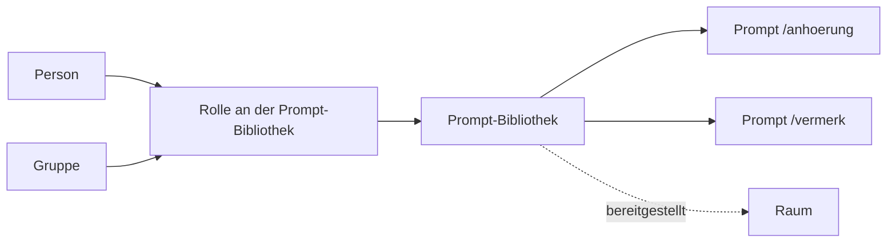

# Prompt-Bibliotheken

> **Entwurf.** Dieses Kapitel beschreibt, wie Prompt-Bibliotheken angelegt, gefüllt und freigegeben
> werden: wiederkehrende Formulierungshilfen — Anhörung, Vermerk, Ablehnung nach Hausstandard —, die
> einmal benannt und beschrieben werden und dann allen zur Verfügung stehen, denen sie freigegeben
> sind. Das Berechtigungsmodell dahinter ist dasselbe wie bei der Wissensbibliothek und steht
> ausführlich im Kapitel [Bibliotheken und Berechtigungen](bibliotheken-und-berechtigungen.md);
> hier steht, was für Prompt-Bibliotheken gilt und wo sie sich unterscheiden.

## 1. Der Aufbau: Prompt-Bibliothek und Prompt

| Objekt | Was es ist | Was es an Rechten trägt |
|---|---|---|
| **Prompt-Bibliothek** | Eine benannte, beschriebene Sammlung von Prompts mit genau einem Eigentümer | Eigene Rollen, eine Verteilungsstufe, eine Auffindbarkeit, einen Eigentümer — wie eine Wissensbibliothek |
| **Prompt** | Eine benannte Anweisung in genau einer Prompt-Bibliothek, mit Titel, Befehl, Beschreibung, Text und Variablen | Keine eigenen — wer die Bibliothek lesen darf, liest alle ihre Prompts |

Eine Prompt-Bibliothek **bindet kein Wissen und erreicht keine Quelle**: Ein Prompt ist Text mit
einem Namen und benannten Platzhaltern, ohne Dokumente, ohne Werkzeuge und ohne eigene Modellwahl.
Deshalb verengt eine Prompt-Bibliothek, die einem Raum zugeordnet ist, auch nicht dessen
Suchbereich — das tun nur Wissensbibliotheken.

Die Prompt-Bibliotheken, die eine Person lesen darf, stehen in der Hauptnavigation unter
**„Prompts"**, gleich unter „Wissen". Die Übersicht dort funktioniert wie die der
Wissensbibliotheken: Anzahl in der Kopfzeile, „Neue Prompt-Bibliothek" oben rechts, Suche über Name
und Beschreibung, Umschalter zwischen Kacheln und Tabelle. Eine Kachel nennt Eigentümer, Anzahl der
Prompts, die eigene Rolle und ob die Bibliothek in der Organisation geteilt ist.

## 2. Begriffe

| Begriff | Bedeutung |
|---|---|
| **Titel** | Die Bezeichnung für Menschen, etwa „Anhörungsschreiben" |
| **Befehl** | Der Name, unter dem ein Prompt aufgerufen wird: `/anhoerung`. Kleinbuchstaben, Ziffern und einzelne Bindestriche, eindeutig innerhalb der Prompt-Bibliothek |
| **Variable** | Eine Stelle im Text, die beim Einsetzen gefüllt wird, geschrieben als `{{name}}`, etwa `{{aktenzeichen}}` |
| **Systemvariable** | `{{CURRENT_DATE}}` und `{{USER_NAME}}`: das Datum des Tages und der Name der einsetzenden Person. OPAA füllt sie selbst; sie werden nicht definiert |

**Schreibweise.** Leerzeichen innerhalb der Klammern (`{{ aktenzeichen }}`) und Systemvariablen in
beliebiger Groß- und Kleinschreibung (`{{current_date}}`) sind erlaubt; OPAA speichert sie als
`{{aktenzeichen}}` und `{{CURRENT_DATE}}`. Jede andere Folge in doppelten geschweiften Klammern,
etwa `{{akten zeichen}}`, lehnt OPAA als ungültigen Platzhalter ab.

**Variablen sind keine Einstellungen der Bibliothek.** Eine Variable gehört zu dem, was ein Prompt
ist, und wird bei jedem Einsetzen neu gefüllt — von der Person, die ihn einsetzt.

## 3. Wem ein Recht gegeben werden kann

Genau wie bei einer Wissensbibliothek: einer **Person** oder einer **Gruppe**, unbefristet oder mit
Ablaufdatum, ausgewählt mit derselben Personen- und Gruppenauswahl, mit denselben Regeln für
geschützte Gruppen und derselben Rückfrage vor einer Freigabe an die Gruppe eines externen Anbieters
([Bibliotheken und Berechtigungen](bibliotheken-und-berechtigungen.md), Abschnitte 3 und 8).
**„Alle Konten"** erreicht eine Prompt-Bibliothek nicht über eine Rolle, sondern über die
Verteilungsstufe „organisationsweit".

## 4. Rollen an einer Prompt-Bibliothek

| Rolle | Darf |
|---|---|
| **Leser** (`VIEWER`) | Die Prompt-Bibliothek und ihre Prompts lesen |
| **Bearbeiter** (`EDITOR`) | Zusätzlich Prompts anlegen, ändern und löschen |
| **Verwalter** (`MANAGER`) | Zusätzlich Name und Beschreibung ändern, Verteilungsstufe und Auffindbarkeit setzen, Rechte vergeben und entziehen |
| **Eigentümer** (`OWNER`) | Zusätzlich die Prompt-Bibliothek samt aller Prompts löschen |

**Verwalten ist nicht Lesen.** Die Systemverwaltung kann jede Prompt-Bibliothek verwalten, liest
ihre Prompts aber nur mit einer eigenen Rolle, einer Rolle über eine Gruppe oder einer
organisationsweiten Freigabe. Ohne sie zeigt der Reiter „Prompts" statt der Liste den Hinweis, dass
der Zugriff fehlt.

### Anlegen

„Neue Prompt-Bibliothek" öffnet einen Assistenten mit drei Schritten; es sind dieselben Bausteine
wie beim Anlegen einer Wissensbibliothek, nur ohne den Schritt „Herkunft":

1. **Stammdaten** — Name und, optional, Beschreibung.
2. **Eigentümer** — „Mein Konto" oder „Eine Gruppe". Angeboten werden nur Gruppen, in denen die
   anlegende Person Mitglied ist. Als persönliche Bibliothek erhält die anlegende Person die
   Eigentümerrolle, bei einer Gruppe als Eigentümerin erhält die Gruppe die Verwalterrolle.
   **Gruppeneigentum ist die haltbarere Wahl** für Prompts, die ein Referat gemeinsam pflegt.
3. **Rechte** — die Verteilungsstufe, „Im Katalog auffindbar" und optional vorgemerkte Rollen für
   Personen und Gruppen, die gleich nach dem Anlegen erteilt werden. **„Im Katalog auffindbar" ist
   aus**, bis jemand es ausdrücklich setzt.

Anlegen darf, wer das Anlegerecht **„Prompt-Bibliotheken anlegen"** hat; ausgeliefert ist es an
„Alle Konten" ([Bibliotheken und Berechtigungen](bibliotheken-und-berechtigungen.md), Abschnitt 9).
Fehlt es, nennt der Assistent es beim Namen, statt die Funktion zu verstecken. Kann eine
vorgemerkte Rolle nicht erteilt werden, ist die Bibliothek trotzdem angelegt: Der Assistent führt
auf ihre Detailseite, nennt in einem Hinweis die betroffenen Personen oder Gruppen, und die Rolle
lässt sich dort unter „Rechte verwalten" nachtragen. Ein zweites Anlegen bietet er nicht an.

### Die Detailseite

Die Detailseite hat zwei Reiter, jeder mit eigener Adresse:

| Reiter | Inhalt | Sichtbar für |
|---|---|---|
| **Prompts** | Die Prompts der Bibliothek, aufklappbar mit Text und Variablen; ab der Bearbeiterrolle „Neuer Prompt", „Bearbeiten" und „Löschen" | alle Leser |
| **Verwaltung** | Stammdaten, der Abschnitt „Freigabe", „Warum sehe ich diese Prompt-Bibliothek?" und für den Eigentümer „Prompt-Bibliothek löschen" | ab der Verwalterrolle |

Der Abschnitt **„Freigabe"** ist derselbe wie bei einer Wissensbibliothek: Verteilungsstufe und
„Im Katalog auffindbar" mit eigenem „Freigabe speichern", „Rechte verwalten" mit dem Dialog, in dem
Rollen erteilt, geändert, befristet und entzogen werden, und die Liste „Zuordnungen" mit den
Räumen, denen die Bibliothek zugeordnet ist — jede Zuordnung einzeln lösbar. Das Speichern der
Stammdaten ändert die Reichweite nicht, und das Speichern der Freigabe ändert Name und Beschreibung
nicht.

Die **Herleitung** „Warum sehe ich das?" zeigt den eigenen Weg zur wirksamen Rolle, genau wie bei
der Wissensbibliothek ([Bibliotheken und Berechtigungen](bibliotheken-und-berechtigungen.md),
Abschnitt 11).

### In einem Raum bereitstellen

Die Einstellungen eines Raums haben einen eigenen Reiter **„Prompts"**. Dort ordnet, wer im Raum
mindestens Kurator ist, eine Prompt-Bibliothek zu, die er selbst lesen darf, und löst Zuordnungen
wieder. Die Zuordnung **gewährt niemandem zusätzlichen Zugriff**: Wer die Bibliothek nicht lesen
darf, sieht sie im Raum nicht. Auf der Übersichtsseite des Raums stehen zugeordnete
Prompt-Bibliotheken unter „Datenquellen" zusammen mit den Wissensbibliotheken, jede mit ihrer Art
gekennzeichnet.

## 5. Prompts pflegen

„Neuer Prompt" und „Bearbeiten" öffnen denselben Dialog:

| Feld | Inhalt |
|---|---|
| **Titel** | Die Bezeichnung für Menschen |
| **Befehl** | Folgt beim neuen Prompt dem Titel („Anhörung Bußgeld" wird `anhoerung-bussgeld`), bis er selbst geändert wird; darunter steht, wie der Prompt aufgerufen wird |
| **Beschreibung** | Optional, wofür der Prompt gedacht ist |
| **Text** | Die Anweisung selbst, mit Platzhaltern `{{name}}` |

Unter dem Text zeigt eine Hervorhebung, was OPAA als Platzhalter liest: eigene Variablen,
Systemvariablen und ungültige Platzhalter in je eigener Farbe, Systemvariablen zusätzlich
gepunktet und ungültige Platzhalter gewellt unterstrichen; eine Legende darunter nennt die
vorkommenden Arten. Feldfehler des Servers stehen mit dem Namen des Formularfelds, etwa
„Variable „frist“ – Beschriftung“.

**Die Variablentabelle folgt dem Text.** Jeder Platzhalter, der im Text steht, hat eine Zeile —
ein neuer Platzhalter fügt sie hinzu, ein gelöschter entfernt sie. Je Variable:

| Spalte | Inhalt |
|---|---|
| **Beschriftung** | Was beim Einsetzen über dem Eingabefeld steht; vorbelegt mit dem Namen |
| **Typ** | Text (eine Zeile), Text (mehrere Zeilen), Auswahl oder Datum |
| **Pflicht** | Ob beim Einsetzen ein Wert verlangt wird |
| **Vorbelegung** | Optional; bei einer Auswahl einer der Auswahlwerte, bei einem Datum ein Kalendertag |
| **Auswahlwerte** | Nur bei einer Auswahl: ein Wert je Zeile |

**Vor dem Speichern prüft der Dialog**, was der Server ablehnen würde — ungültiger Befehl, fehlender
Titel oder Text, ungültige Platzhalter, fehlende Beschriftung, eine Auswahl ohne Werte, eine
Vorbelegung, die nicht passt — und nennt alle Befunde auf einmal. Was der Server danach noch
ablehnt, etwa ein Befehl, den es in der Bibliothek schon gibt, steht mit seinem Wortlaut im selben
Hinweisfeld.

Die **Vorschau mit Beispielwerten** zeigt den Text, wie er beim Einsetzen herauskäme: mit den
eingegebenen Beispielwerten, sonst der Vorbelegung, sonst der Beschriftung in eckigen Klammern; die
Systemvariablen mit dem heutigen Datum und dem eigenen Namen. Beispielwerte werden nicht
gespeichert.

**Grenzen eines Prompts** — fest, nicht konfigurierbar:

| Angabe | Grenze |
|---|---|
| Befehl | 64 Zeichen |
| Titel | 255 Zeichen |
| Beschreibung | 2000 Zeichen |
| Text | 8000 Zeichen |
| Variablen je Prompt | 20 |
| Auswahlwerte je Variable | 1 bis 50 |

## 6. Im Chat verwenden

Im Eingabefeld des Chats öffnet ein `/` am Anfang einer Zeile die Auswahl der Prompts. Angeboten
wird jeder Prompt aus einer Prompt-Bibliothek, die die Person lesen darf, gruppiert nach
Bibliothek. Die dem Raum zugeordneten Bibliotheken (Abschnitt 4, „In einem Raum bereitstellen")
stehen voran und tragen den Zusatz „diesem Space zugeordnet". Eine zugeordnete Bibliothek, die die
Person nicht lesen darf, erscheint nicht. Die Systemverwaltung ohne eigenes Recht sieht keine
Prompts: Verwalten ist nicht Lesen. Weitertippen sucht in Befehl, Titel und Beschreibung.

- **Ohne Variablen** steht der Text sofort im Eingabefeld.
- **Mit Variablen** fragt ein Formular die Werte ab. Das Formular hat dieselben Felder wie die
  Vorschau (Abschnitt 5). Pflichtfelder sperren „Einsetzen", Vorbelegungen sind eingetragen, und ein
  Datum ohne Vorbelegung steht auf dem heutigen Tag.
- Eingesetzt wird genau der Text, den die Vorschau zeigt: Daten als `TT.MM.JJJJ`, die
  Systemvariablen mit dem heutigen Datum und dem eigenen Namen.

Der Text bleibt bearbeitbar. Gesendet wird er erst mit Enter oder der Senden-Schaltfläche. Ein Chip
„Prompt: <Titel>" am Eingabefeld markiert die Herkunft und lässt sich entfernen. Im Verlauf steht
an der Frage „Prompt: <Titel>", mit dem Titel zum Zeitpunkt des Sendens, ohne Verweis auf den
Prompt. Dieser Hinweis bleibt, wenn der Prompt später umbenannt oder gelöscht wird.

Wird der Prompt nach dem Einsetzen gelöscht oder das Leserecht entzogen, lehnt OPAA die Frage ab.
Sie steht dann ohne Chip wieder im Eingabefeld und lässt sich ohne Prompt senden. Wie die Frage
danach gesucht und beantwortet wird, beschreibt [Suche](suche.md), Abschnitt 2 („Prompts
einsetzen"). Für die Suche und die Antwort macht ein Prompt keinen Unterschied.

Die **Verwendung** eines Prompts wird weder protokolliert noch gezählt. Es gibt keine Auswertung,
wer welchen Prompt wie oft verwendet hat.

## 7. Lebenszyklus: „Nachfolge offen"

Für Prompt-Bibliotheken gilt der Lebenszyklus aus
[Bibliotheken und Berechtigungen](bibliotheken-und-berechtigungen.md), Abschnitt 13, ohne
Abweichung: Scheidet die Eigentümerin einer persönlichen Prompt-Bibliothek aus oder verliert eine
Eigentümergruppe ihr letztes aktives Mitglied, geht die Bibliothek in den Zustand **„Nachfolge
offen"**. Sie bleibt nutzbar, alle Rollen bleiben, nichts wird gelöscht — **nur ihre Reichweite ist
eingefroren**: keine neuen oder größeren Rollen, keine größere Verteilungsstufe, keine neue
Auffindbarkeit, keine neue Zuordnung zu einem Raum. Prompts anlegen und ändern bleibt möglich.

Die Kennzeichnung „Nachfolge offen — zuständig: …" steht in der Übersicht unter „Prompts" und auf
der Detailseite. In der Betriebsliste unter **Administration → Lebenszyklus** erscheint die
Prompt-Bibliothek als eigene Zeile; ihr Name führt auf ihre Detailseite, und der Ausgang ist
dieselbe Übertragung wie bei jeder anderen Bibliothek.

## 8. Protokoll

Anlegen, Ändern und Löschen einer Prompt-Bibliothek und eines Prompts schreiben je einen Eintrag ins
Nachweisprotokoll. Eine Änderung nennt nur, welche Felder sich geändert haben, nie deren Werte —
Titel und Text eines Prompts stehen nie im Protokoll. Rollen, Verteilungsstufe, Auffindbarkeit,
Eigentum und Nachfolge protokolliert und historisiert OPAA wie bei jeder Wissensbibliothek.

## 9. Was nicht gebaut ist

- **Der Katalog**, in dem „Im Katalog auffindbar" wirkt (#1904).
  Bis dahin wird die Auffindbarkeit gespeichert und historisiert, aber nirgends ausgewertet.
- **Versionen, Freigabeweg, Favoriten und Nutzungszähler** für Prompts.
- **Mitgelieferte Prompt-Bibliotheken** und **Export und Import** als Paket.
- **Eine eigene Reihenfolge der Prompts** in der Oberfläche; die Liste folgt der gespeicherten
  Reihenfolge, dann dem Befehl.

## 10. Weiterführende Kapitel

- Rollen, Gruppen, Anlegerechte, Herleitung, Rechtehistorie und Lebenszyklus im Einzelnen:
  [Bibliotheken und Berechtigungen](bibliotheken-und-berechtigungen.md)
- Wissensbibliotheken und ihre Quellen: [Indexierung](indexierung.md)
