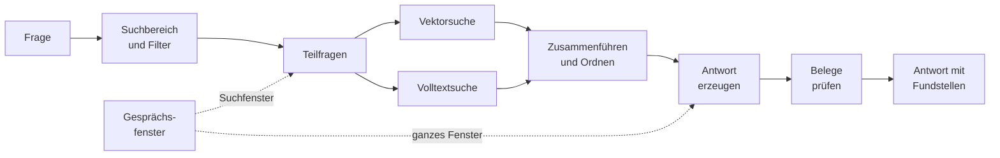
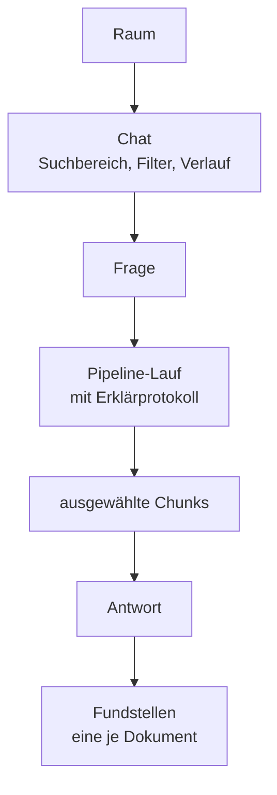
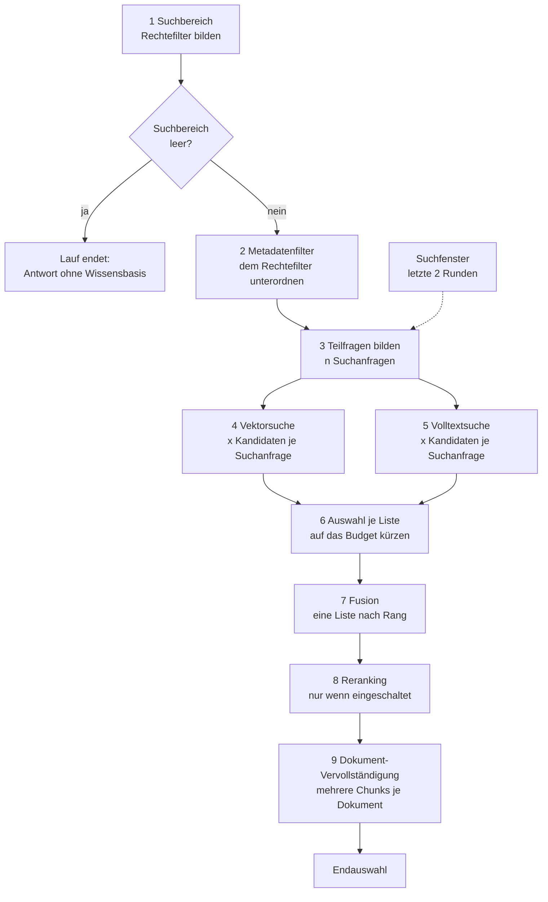
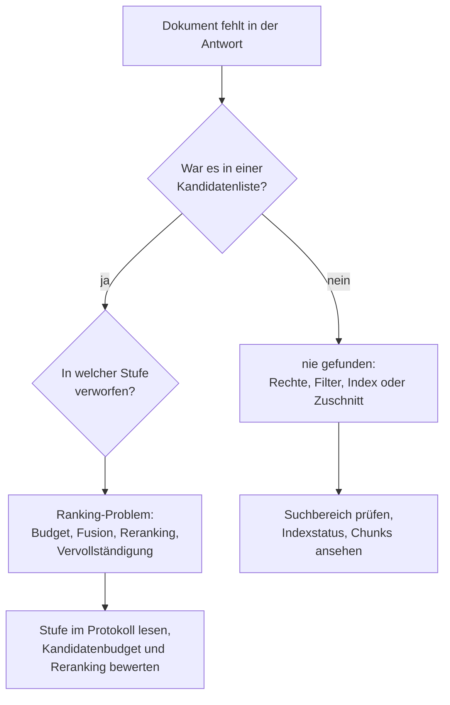

# Suche: Von der Frage zur belegten Antwort

> **Entwurf.** Dieses Kapitel beschreibt die Abfragestrecke (Query-Pipeline) konzeptionell: was
> zwischen dem Absenden einer Frage und der Anzeige einer Antwort mit Belegen passiert, welche
> Stellschrauben es gibt und wie der Betrieb einer schlechten Antwort auf den Grund geht. Wie die
> Dokumente vorher in den Index gelangen, steht im Kapitel [Indexierung](indexierung.md).

## 1. Überblick in einem Bild

Eine Frage wird nicht „an das Sprachmodell gestellt". Sie läuft zuerst durch eine Suche über den
Index, und erst die dabei ausgewählten Textstücke (Chunks) gehen zusammen mit der Frage an das
Chat-Modell. Das Modell soll aus diesen Stücken antworten und jede benutzte Quelle zitieren.
Erzwungen wird nicht die Antwort, sondern die Prüfbarkeit der Belege: Sie werden geprüft, bevor
die Antwort angezeigt wird.

| Schritt | Frage, die er beantwortet |
|---|---|
| Suchbereich und Filter | In welchen Bibliotheken darf und soll überhaupt gesucht werden? |
| Teilfragen | Wonach wird gesucht: nach der Frage wörtlich, oder nach mehreren eigenständigen Suchanfragen? |
| Vektorsuche | Welche Chunks sind der Frage in der Bedeutung ähnlich? |
| Volltextsuche | Welche Chunks enthalten die Wörter, Paragrafen und Aktenzeichen der Frage wörtlich? |
| Zusammenführen und Ordnen | Welche Chunks bekommt das Modell am Ende zu sehen, und in welcher Reihenfolge? |
| Antwort erzeugen | Was antwortet das Chat-Modell aus diesen Chunks und dem Gesprächsverlauf? |
| Belege prüfen | Zeigt jedes Zitat auf einen Chunk, der wirklich abgerufen wurde, und stimmt der zitierte Wert? |

Drei Dinge sind aus Betriebssicht wichtig, bevor es ins Detail geht:

- **Die Rechte sitzen in der Suche selbst, nicht dahinter.** Jede Suchabfrage trägt den Filter auf
  die Bibliotheken, die die fragende Person lesen darf, als Teil der Datenbankabfrage. Ein Chunk aus
  einer fremden Bibliothek wird nie geladen, nie gerankt und nie aussortiert; er kommt in der
  Abfrage gar nicht vor. Es gibt keinen Administrator-Durchgriff: Auch ein Systemadministrator
  fragt mit seinen eigenen Leserechten.
- **Die Suche entscheidet, das Modell formuliert.** Was nicht unter den ausgewählten Chunks ist,
  kann in keiner Antwort stehen. Fast jede schlechte Antwort ist deshalb zuerst eine Suchfrage
  (Abschnitt 9), keine Modellfrage.
- **Jeder Lauf erklärt sich selbst.** Jede Stufe protokolliert, welche Kandidaten sie gesehen,
  behalten, verworfen oder hinzugefügt hat. Im Chat wird dieses Protokoll verworfen; das
  Diagnosewerkzeug (Abschnitt 8) zeigt es Stufe für Stufe.

## 2. Frage, Chat, Suchbereich, Chunk

Vier Begriffe tragen das Kapitel.

Eine **Frage** ist die einzelne Eingabe einer Person. Sie kommt fast immer aus einem **Chat**: einer
gespeicherten Unterhaltung in einem Raum, die ihren Suchbereich, ihren Filter und ihren Verlauf
kennt.

Der Verlauf heißt **Gesprächsfenster**: die letzten 20 Nachrichten des Chats (zehn Runden aus Frage
und Antwort), wörtlich. Suche und Antwort bekommen ihn **unterschiedlich dosiert**:

| | Was davon | Warum |
|---|---|---|
| Antwort (Abschnitt 6) | das ganze Fenster | Kontinuität: „wie vorhin beim Parkausweis" soll noch verstanden werden |
| Suche (Stufe 3) | nur das **Suchfenster**, die letzten zwei Runden | Bezüge auflösen, ohne dass ein altes Thema die Suche weiter färbt |

Zwei Eigenschaften des Fensters sind betrieblich wichtig:

- **Zitiermarken früherer Antworten stehen nicht im Fenster.** Sie werden auf dem Weg hinein
  entfernt — sowohl direkt nach einer Antwort als auch beim Nachladen aus der Datenbank. Der
  gespeicherte Antworttext behält sie unverändert; er ist die Grundlage für Fußnoten, Textanker und
  Belegfenster. Ohne Marke im Verlauf kann das Modell keine Marke für ein Dokument wiederholen, das
  in dieser Runde gar nicht im Kontext ist.
- **Ein Neustart ändert nichts an der Aufbereitung.** Nach einem Neustart oder wenn der
  prozessinterne Zwischenspeicher abgelaufen ist, wird das Fenster aus den letzten 20 gespeicherten
  Nachrichten desselben Chats neu gebildet, durch dieselbe Marken-Entfernung — derselbe Chat schickt
  denselben Prompt wie davor. Eine Ausnahme betrifft nicht die Aufbereitung, sondern den Bestand:
  Liefert eine Runde keinen Antworttext (Modellfehler, oder eine Antwort, die nur aus Marken
  bestand), fehlt sie im laufenden Fenster wie im nachgeladenen gleichermaßen.

Beide Breiten sind Konfigurationswerte (Abschnitt 10.3); in einer Verwaltungsoberfläche erscheinen
sie nicht.

Der **Suchbereich** ist die Menge der Bibliotheken, in denen diese Frage sucht. Er steht in der
Chip-Leiste am Eingabefeld und gilt für den ganzen Chat: „Durchsucht wird, was in der Leiste
steht."

| Leiste | Suchbereich |
|---|---|
| `@Alles-Wissen` (Standard) | alle Bibliotheken, die die Person lesen darf; in einem Raum mit zugeordneten Bibliotheken nur diese, geschnitten mit den Leserechten |
| eine oder mehrere Bibliotheken | genau diese, geschnitten mit den Leserechten; eine referenzierte, aber nicht lesbare Bibliothek liefert stillschweigend keine Treffer |
| leer | bewusst ohne Wissensbasis: keine Suche, das Modell antwortet aus dem Gespräch allein |

Der Suchbereich ist **nie weiter als die Leserechte**. Er kann sie nur einschränken. Ist er leer,
läuft keine Suche, und das Modell antwortet aus dem Gespräch allein. Was die Person davon sieht,
hängt vom Grund ab:

| Grund für den leeren Suchbereich | Hinweis an der Antwort |
|---|---|
| Leiste bewusst geleert | „Diese Antwort wurde ohne Wissensbasis erstellt." |
| Raum ordnet nur Bibliotheken zu, die die Person nicht lesen darf (gespeicherter Chat) | „In diesem Space ist für Sie derzeit kein Wissen verfügbar." |
| Person darf gar keine Bibliothek lesen | kein Hinweis |

Der letzte Fall bleibt absichtlich stumm: Die Antwort unterscheidet „nichts gefunden" nicht von
„nichts lesbar", damit aus einer Fehlantwort kein Rückschluss auf fremde Bestände möglich ist.

Ein **Chunk** ist ein Textstück aus dem Index, wie die Indexierung es zugeschnitten hat, samt seinen
Metadaten: Dokument, Bibliothek, laufende Nummer, Ortsangabe („S. 3 · Abschn. Fristen") und die
Kernfelder des Dokuments. Die Suche arbeitet ausschließlich auf Chunks. Ein „Dokument" taucht erst
wieder auf, wenn die Fundstellen zusammengefasst werden (Abschnitt 7).

## 3. Was eine Frage nach außen kostet

Die Pipeline läuft im Backend-Prozess und in der Datenbank. Nach außen ruft sie nur die
konfigurierten Modelle. Je Frage sind das im Auslieferungsstand:

| Aufruf | Wann | Modellrolle |
|---|---|---|
| Teilfragen-Zerlegung | einmal, sofern eingeschaltet und der Suchbereich nicht leer ist | Chat-Modell |
| Einbettung der Suchanfrage | einmal je Teilfrage | Embedding-Modell |
| Reranking | einmal, nur wenn Reranking eingeschaltet und der Endpunkt erreichbar ist | Rerank-Modell |
| Antwort | einmal | Chat-Modell |
| Chat-Titel | einmal je neuem gespeicherten Chat, nach der ersten Antwort, nebenläufig | Chat-Modell |

Die Volltextsuche, die Vielfaltsauswahl, die Fusion, die Dokument-Vervollständigung und die
Belegprüfung sind reine Datenbank- und Rechenschritte ohne Modellaufruf. Die Latenz einer Frage
besteht deshalb im Wesentlichen aus zwei Chat-Modell-Aufrufen, und bei eingeschaltetem Reranking
aus dessen Antwortzeit (Stufe 8).

## 4. Die Suchstrecke: Stufe für Stufe

Das ist der Kern. Jede Frage durchläuft diese Stufen in dieser Reihenfolge. Die Reihenfolge ist im
Code an genau einer Stelle festgelegt und nicht konfigurierbar.

### Stufe 1: Suchbereich

Der Suchbereich aus Abschnitt 2 wird in den Rechtefilter übersetzt, den jede folgende Suche in
ihre Abfrage einbaut. Diese Stufe ist die einzige, die sich nicht abschalten lässt: Ein Lauf ohne
Rechtefilter wäre keine Variante der Suche, sondern eine Rechteumgehung.

Ist der Suchbereich leer, endet der Lauf hier. Es wird kein Modell für die Zerlegung gerufen und
nichts gesucht; die übrigen Stufen stehen im Protokoll als „nicht erreicht".

Die Leserechte, aus denen der Filter entsteht, werden für die Frage einmal live aus den aktuellen
Berechtigungen berechnet. Parallel dazu führt OPAA eine **Rechtehistorie**, in der jede Änderung an
Berechtigungen, Gruppenmitgliedschaften und Freigaben mit Zeitpunkt festgehalten wird; aus ihr lässt
sich für Prüfer zu jedem Stichtag rekonstruieren, wer worauf Zugriff hatte. Die Historie wird beim
Beantworten einer Frage nicht gelesen: Ein Abgleich beider Rechenwege je Anfrage findet nicht statt.
Dass beide Wege dieselbe Bibliotheksmenge ergeben, sichert die Testsuite für jede Operation ab, die
Leserechte ändert — Berechtigungen, Gruppenmitgliedschaften aus der Verwaltung, dem
Verzeichnisabgleich und dem Anmeldetoken sowie Bestand und Sichtbarkeit einer Bibliothek.

### Stufe 2: Metadatenfilter

Hat die Person im Chat einen Filter gesetzt (Dokumentart, Datum/Stand, ein Bibliotheks- oder
Formatfeld), wird er hier einmal in die Form gebracht, die beide Suchpfade verstehen, und im Lauf
mitgeführt. Ohne Filter passiert nichts, und das Protokoll sagt das.

Der Filter wird dem Rechtefilter **untergeordnet**: Er wird mit UND angehängt und kann die lesbare
Menge nur verkleinern. Ein Dokument ohne Wert im gefilterten Feld wird **nicht** ausgeschlossen
(Leerwert-Regel); es wird gefunden und in der Fundstelle als „ohne Angabe" markiert. Ein unbekannter
Dokumentart-Code wird schon vor dem Lauf mit einer Fehlermeldung abgewiesen, statt still einen
Filter zu erzeugen, der nur Dokumente ohne Wert übrig ließe. Was Metadaten sonst in der Suche tun,
fasst Abschnitt 5 zusammen.

### Stufe 3: Teilfragen

Die Frage wird nicht wörtlich gesucht. Das Chat-Modell formt sie unter Berücksichtigung des
**Suchfensters** — der letzten zwei Runden des Gesprächsfensters, siehe Abschnitt 2 — in **eine oder
mehrere eigenständige Suchanfragen** um, bis zu einer konfigurierten Obergrenze:

- Eine Frage mit zwei Themen („Was kostet ein Anwohnerparkausweis und wie lange ist er gültig?")
  wird in zwei Suchanfragen zerlegt, die jede für sich gesucht werden.
- Eine Rückfrage im Gespräch („Und was gilt bei Bedürftigkeit?") wird zu einer vollständigen
  Frage, in der das Bezugswort durch den Gegenstand aus dem Verlauf ersetzt ist.
- Offensichtliche Tippfehler werden korrigiert. Eine bereits einthemige, eigenständige Frage
  bleibt eine Suchanfrage, bei Bedarf wortgleich.

Dieser Schritt hat einen **Sicherheitsgurt**: Antwortet das Modell nicht, unparsebar oder mit
Suchanfragen, von denen auch nur eine kein Wort mit dem Kontext gemeinsam hat, den die Zerlegung
bekommen hat (ein kleines Modell ersetzt gelegentlich die Frage durch etwas Eigenes), fällt die
Stufe auf die Frage selbst zurück, und zwar ganz: Eine Teilfrage wegzulassen kostet ein Thema der
Frage, die Frage selbst kostet nur Genauigkeit.

„Der Kontext, den die Zerlegung bekommen hat" ist dabei wörtlich zu nehmen: **genau die Frage und
das Suchfenster**, nicht mehr und nicht weniger. Das ist nötig, weil eine korrekt aufgelöste
Rückfrage mit der Frage oft kein Wort teilt — „Wie lange dauert das?" wird zu „Bearbeitungsdauer für
den Anwohnerparkausweis", und das Ankerwort steht in der Vorrunde, nicht in der Frage. Ein Thema,
das älter als das Suchfenster ist, kann eine Teilfrage umgekehrt nicht mehr rechtfertigen.

Im Rückfall wird der aktuellen Frage die **letzte** Nutzerfrage des Suchfensters vorangestellt; gibt
es im Suchfenster keine Vorrunde, wird die Frage allein gesucht. Ein solcher Rückfall steht als
Warnung im Log, ohne den Fragetext, und zählt auf der Metrik `opaa.query.decomposition.fallback`.
Die Frage scheitert dadurch nie; sie wird nur ungenauer gesucht. Ist die Zerlegung abgeschaltet,
wird immer so gesucht und der Modellaufruf gespart.

### Stufe 4: Vektorsuche

Je Suchanfrage läuft eine Ähnlichkeitssuche über die Vektorablage: Die Suchanfrage wird mit dem
Embedding-Modell eingebettet, und die **`fetch-k` ähnlichsten Chunks** oberhalb einer
Mindest-Ähnlichkeit bilden eine Kandidatenliste. Rechtefilter und
Metadatenfilter sind Teil dieser Abfrage. Die Schwelle ist bewusst niedrig: Sie hält nur
offensichtliches Rauschen fern, damit ein unscharf formulierter Fall nicht schon hier verloren
geht.

Die Vektorsuche findet, was der Frage **in der Bedeutung** nahe ist, auch wenn kein Wort
übereinstimmt („Parkausweis" trifft „Bewohnerparkberechtigung"). Ihre bekannte Schwäche ist der
umgekehrte Fall: Ein Dokument, das den Suchbegriff wörtlich enthält, aber in einem Chunk, dessen
Bedeutung im Ganzen woanders liegt, rankt zu weit hinten. Dafür gibt es die nächste Stufe.

### Stufe 5: Volltextsuche

Je Suchanfrage läuft zusätzlich eine Volltextsuche über denselben Bestand, mit
demselben Rechte- und Metadatenfilter und demselben Kandidatenbudget `fetch-k`. Die Suchanfrage wird
mit deutscher Wortstammbildung zerlegt (die Wörter sind mit ODER verknüpft, damit auch ein Chunk
gefunden wird, der nur einen Teil der Wörter enthält), und erkannte **Kennungen** (Paragrafen,
Aktenzeichen, Drucksachennummern, E-Mail-Adressen) werden unzerlegt und mit hohem Gewicht gesucht.
Es sind dieselben Muster, mit denen die Indexierung die Kennungen abgelegt hat, sodass 㤠12 Abs. 3"
in Frage und Dokument dieselbe Kennung ergibt. So bleibt 㤠34" von 㤠35" unterscheidbar, was die
Vektorsuche nicht leistet.

Beide Pfade sehen **denselben Bestand**: Die Indexierung schreibt Vektor und Volltext eines Chunks
in einer Transaktion (Kapitel [Indexierung](indexierung.md), Schritt 7); auf diesem Weg entsteht
kein Chunk, den nur ein Pfad kennt. Was sich unterscheiden kann, ist allein die **Fassung** des
Volltexts: Ändert ein Software-Update die Volltextzerlegung (etwa neue Kennungsmuster), tragen
ältere Chunks die neuen Bestandteile erst nach dem Nachzug (Kapitel
[Indexierung](indexierung.md), Abschnitt 9). Sie werden bis dahin gefunden, nur nicht über das
Neue. Diesen Rückstand zeigt die Administrationsseite je Bibliothek (Abschnitt 8.1).

Zwei bekannte Grenzen des Pfads:

- PostgreSQL bewertet Treffer mit `ts_rank`, nicht mit BM25. Lange Chunks werden überbewertet,
  seltene Begriffe zu wenig gegenüber häufigen abgesetzt. Die Fusion (Stufe 7) verbraucht nur den
  Rang, nicht den Wert, was diese Schwäche abmildert. Einzelheiten stehen im Kapitel
  [Deployment](deployment.md#bekannte-grenze-ts_rank-ist-kein-bm25).
- Der Pfad lässt sich per Konfiguration abschalten. Er bleibt dann in der Kette, weist sich im
  Protokoll als abgeschaltet aus, und die Suche läuft rein vektoriell. Auf der Verwaltungs-Evaldomäne
  kostet das gemessen 15 Prozentpunkte Hit Rate@5.

Schlägt die Volltextabfrage fehl, scheitert die Frage — wie bei einem Ausfall der Vektorsuche. Ein
Lauf, der die halbe hybride Suche still verliert, gäbe eine schlechtere Antwort als normale aus; die
Fehlerursache steht im Server-Log.

### Stufe 6: Auswahl je Liste

Jetzt liegen mehrere Kandidatenlisten vor: je Suchanfrage eine aus der Vektorsuche und eine aus
der Volltextsuche. Jede Liste wird auf das **Kandidatenbudget** gekürzt: die endgültige Anzahl
`top-k`, oder das größere Reranking-Fenster, solange Reranking läuft (Stufe 8).

An dieser Stelle sitzt die **Vielfaltsauswahl** (Maximal Marginal Relevance, MMR). Sie ist gebaut,
aber im Auslieferungsstand nicht aktiv: Der Regler `mmr-lambda` steht auf seinem Höchstwert 1,0,
und die Kürzung ist dann eine reine Top-k-Auswahl nach Relevanz. Ein niedrigerer Wert lässt einen Kandidaten, der einen
bereits gewählten inhaltlich nur wiederholt, gegenüber einem weniger ähnlichen, aber thematisch
neuen zurückfallen. Dafür ist kein Modellaufruf nötig: Die Relevanz jedes Kandidaten hat die Suche
schon geliefert, und die Ähnlichkeit der Kandidaten **untereinander** wird aus ihren Vektoren
berechnet, die seit der Indexierung in der Datenbank liegen. Die Stufe liest die Vektoren aller
Kandidaten in einer Abfrage und rechnet die Kosinus-Ähnlichkeit je Paar selbst aus. Die Auswahl
läuft dann Platz für Platz: Zuerst kommt der relevanteste Kandidat, danach jeweils der mit dem
höchsten Wert aus `lambda × Relevanz − (1 − lambda) × größte Ähnlichkeit zu einem bereits
gewählten Chunk`. Bei 1,0 ist der zweite Term null, und die Vektoren werden gar nicht erst gelesen.
Der Default 1,0 ist eine Messentscheidung: Auf
den Mehrthemen-Fällen der Evaluierung war reine Relevanz besser als die Vielfaltsauswahl (siehe
[Deployment](deployment.md), `OPAA_QUERY_MMR_LAMBDA`). Ein Wert unter 1,0 wirkt zudem auf die
Volltextlisten anders als auf die Vektorlisten, weil deren Relevanzwerte auf einer anderen Skala
liegen; wer ihn setzt, sollte das messen.

### Stufe 7: Fusion

Alle Listen werden zu einer zusammengeführt, und zwar **nach Rang, nie nach Wert**: Eine
Kosinus-Ähnlichkeit aus der Vektorsuche und ein `ts_rank` aus der Volltextsuche sind nicht
vergleichbar, und selbst zwei Vektorlisten verschiedener Teilfragen nicht. Das Verfahren heißt
Reciprocal Rank Fusion: Jeder Chunk bekommt je Liste, in der er vorkommt, einen Beitrag von
`1 / (60 + Rang)`; die Beiträge werden addiert. Ein Chunk, den Vektor- und Volltextsuche beide
gefunden haben, ist damit ein Kandidat mit zwei Beiträgen, kein doppelter, und setzt sich
gegenüber einem Chunk durch, der nur in einer Liste weit vorn stand. Die fusionierte Liste wird auf
das Kandidatenbudget gekürzt: `top-k`, oder das Reranking-Fenster, solange Reranking läuft.

Das ist der Grund, warum die Pipeline keine Gewichtung „Vektor gegen Volltext" kennt: Beide Pfade
sind gleichberechtigte Listen derselben Fusion. Ein Dokument, das nur ein Pfad findet, kann in der
Endauswahl ganz vorn stehen.

### Stufe 8: Reranking

Reranking ist der „zweite Blick": Ein eigenes Rerank-Modell bewertet das fusionierte
Kandidatenfenster noch einmal gegen die Originalfrage, nicht gegen eine Suchanfrage, und kürzt die
Liste auf `top-k`. Ein Reranker liest Frage und Chunk gemeinsam und erkennt dadurch Passung, die weder
Vektor- noch Wortübereinstimmung erfassen. Er ist für die Fälle da, in denen die richtige Fundstelle
im Fenster liegt, aber nicht weit genug oben.

Im Auslieferungsstand ist Reranking **aus** (`OPAA_RERANK_ENABLED=false`): Die Modellrolle ist
gebaut, nicht aktiviert, weil sie Hardware braucht (auf einer CPU Minuten je Frage, auf einer GPU
Sekunden). Die Rolle kennt drei Zustände, die das Protokoll und die
Administrationsseite unterscheiden:

| Zustand | Bedeutung | Was die Suche tut |
|---|---|---|
| abgeschaltet | Betreiber-Entscheidung | Fusion kürzt auf `top-k`; die Stufe ist die Identität |
| eingeschaltet, nicht nutzbar | Endpunkt oder Modell nicht konfiguriert, oder Endpunkt antwortet nicht | wie abgeschaltet, aber als Störung protokolliert („nicht verfügbar") und beim Start als Fehler im Log |
| eingeschaltet, nutzbar | Endpunkt hat zuletzt geantwortet | Fusion behält das Reranking-Fenster, der Reranker wählt `top-k` |

Fällt der Endpunkt **während** einer Frage aus oder überschreitet er das Zeitbudget, behält die
Suche die fusionierte Reihenfolge und kürzt selbst auf `top-k`. Ein Ausfall kostet die Sortierung, nie die
Antwort. Diese Reihenfolge ist allerdings eine dritte, eigene: Weil die früheren Stufen ihr Budget
für den Reranker auf das Reranking-Fenster geweitet hatten, haben in der Fusion mehr Kandidaten mitgespielt als in
einem Lauf ohne Reranking. Wer Reranking einschaltet, sollte deshalb die Erreichbarkeit des
Endpunkts überwachen und nicht nur die Antworten ansehen.

Ist `rerank-candidate-count` **kleiner** als `top-k`, liefert die Fusion trotzdem bis zu `top-k`
Kandidaten (das Kandidatenbudget ist dann das Maximum aus beiden Werten, damit die Antwort nicht
unter `top-k` schrumpft), aber der Reranker bewertet nur die ersten `rerank-candidate-count` davon.
Die Kandidaten dahinter werden **angehängt**, in fusionierter Reihenfolge, nicht verworfen. Im
Auslieferungsstand (`rerank-candidate-count` 50 ≥ `top-k` 8) tritt der Fall nicht ein; erst eine
Konfiguration mit `rerank-candidate-count < top-k` löst ihn aus.

Das Fenster **erweitert die Reichweite der Suche nicht**. Was keine Suchstufe zurückgegeben hat,
kann kein Reranker nach vorn holen. Die Reichweite ist `fetch-k` je Liste mal der Zahl der Listen,
also Teilfragen mal aktive Pfade; bei einer Teilfrage liefern zwei Pfade höchstens doppelt
`fetch-k` verschiedene Kandidaten. Wer das Fenster darüber hinaus vergrößert, muss `fetch-k` mit
anheben. Was zum Einschalten gehört, steht im Kapitel
[Deployment](deployment.md#reranking-einschalten).

### Stufe 9: Dokument-Vervollständigung

Die letzte Auswahlstufe behebt einen typischen Fehler der Rangordnung: Ein Dokument ist mit seinem
Einleitungs-Chunk in der Auswahl, aber sein Detail-Chunk (die Gebührenzeile, der eine Paragraf)
hat seinen Platz an ein fremdes Dokument verloren. Jedes bereits vertretene Dokument darf deshalb
**mehrere Chunks** beisteuern (`max-chunks-per-document`), nachgezogen aus dem Kandidatenpool der Suchstufen, also nur aus
Chunks, die Rechte- und Metadatenfilter bereits passiert haben.

Weil die Auswahl nicht über `top-k` wachsen darf, muss dafür etwas weichen, in zwei Stufen: zuerst der
schwächste Chunk eines anderen Dokuments, das selbst schon mit mindestens zwei Chunks vertreten ist (die Zahl
der vertretenen Dokumente bleibt gleich); erst wenn es kein solches gibt, der rangletzte Chunk der
Gesamtauswahl, und nur, wenn das zu vervollständigende Dokument mit seinem besten Chunk strikt
besser rankt. Die zweite Stufe darf ein Dokument ganz aus der Antwort drängen und ist deshalb je
Frage auf ein Viertel von `top-k` solcher Verdrängungen gedeckelt. Das Protokoll unterscheidet
beide Stufen, weil sie für die Diagnose zwei verschiedene Antworten sind.

Damit steht die **Endauswahl**: höchstens `top-k` Chunks aus meist mehreren Dokumenten,
in einer Reihenfolge, die für jede Fundstelle dasselbe bedeutet, gleich über welchen Pfad sie kam.

## 5. Wo Metadaten mitspielen

Metadaten sind in der Suche keine eigene Stufe, sondern wirken an vier Stellen, die leicht
verwechselt werden:

| Stelle | Metadatum | Wirkung | Muss jemand etwas tun? |
|---|---|---|---|
| Rechtefilter (Stufe 1) | Bibliothek des Chunks | entscheidet, ob ein Chunk überhaupt in einer Abfrage vorkommt | nein, immer |
| Metadatenfilter (Stufe 2) | Kernfelder Dokumentart und Datum/Stand, Bibliotheks- und Formatfelder | schränkt beide Suchpfade vor dem Ranking ein; Leerwerte bleiben drin und werden als „ohne Angabe" markiert | ja, die Person setzt den Filter im Chat; aus der Frage wird kein Filter abgeleitet |
| Kontextpräfix (Stufen 4 und 5) | Titel des Dokuments, ausgewählte Kernfelder und Bibliotheksfelder, Gliederungspfad des Chunks | steht dem Chunk-Text in Einbettung **und** Volltextindex voran, sodass ein Detail-Chunk trägt, wovon sein Dokument handelt; wirkt auf Ähnlichkeit und Wortsuche, ohne dass jemand filtert | nein, wirkt bei jeder Frage; welche Felder das tun, entscheidet die Bibliothek |
| Fundstelle (Abschnitt 7) | Titel, Dokumentart, Datum/Stand, Ortsangabe, Belegfelder der Bibliothek | ordnet den Beleg ein: welche Fassung, welche Seite | nein |

Der Filter wird nur angeboten, wenn das Feld im Suchbereich der Person ausreichend gefüllt ist:
eine konfigurierte Schwelle je Kernfeld, für die Dokumentart höher als für das Datum; für
Bibliotheksfelder gilt eine eigene Schwelle, gemessen an der eigenen Bibliothek; Formatfelder
werden angeboten, sobald ein Dokument des Suchbereichs einen Wert trägt. Ein Formatfeld bietet
höchstens 20 Werte an und meldet, wenn der Bestand mehr hergibt (siehe [Metadaten](metadaten.md)).
Ein Filter auf ein nur zu einem Bruchteil gefülltes
Feld sähe aus wie eine Einschränkung des Bestands und wäre keine. Die Optionen werden je Person
und Suchbereich für kurze Zeit zwischengespeichert und bei
jeder Rechteänderung verworfen. Ein gesetzter Filter bleibt am Chat und gilt für jede weitere Frage
darin; das Popover sagt das.

Was Metadaten in der Suche **nicht** tun: Sie verändern keine Rangordnung. Ein Dokument mit
gepflegten Kernfeldern rankt nicht besser als eines ohne, sofern kein Filter gesetzt ist und das
Kontextpräfix nicht gerade das fehlende Bedeutungssignal liefert. Freie Schlagworte filtern nie und
erscheinen nicht im Beleg; sie wirken allein über das Kontextpräfix. Woher die Werte kommen, wie sie gepflegt werden und wie sich der
Kontextpräfix über den Bestand nachziehen lässt, steht im Kapitel [Metadaten](metadaten.md).

## 6. Antwort erzeugen

Die ausgewählten Chunks gehen mit einem Kopf je Chunk (Dateiname, Dokument-ID, Chunk-Nummer und die
vorgegebene Zitierform) zusammen mit dem Gesprächsverlauf und der Frage an das **systemweit aktive
Chat-Modell**. Die Systemanweisung verpflichtet das Modell, jede genutzte Quelle mit einer Marke der
Form `【source: <Dokument-ID>#<Chunk-Nummer> | <Dateiname>】` am Satzende zu zitieren und keine
Quellen zu erfinden. Das Modell wird bei jedem Aufruf neu aufgelöst; eine Aktivierung eines anderen
Modells in der Verwaltung wirkt ohne Neustart. Ist kein Chat-Modell aktiv oder antwortet das
Embedding-Modell in Stufe 4 nicht, endet die Frage mit einer deutschen Fehlermeldung; anders als
beim Reranking gibt es für diese beiden Rollen keinen Weiterlauf ohne sie.

Die Systemanweisung ist **nicht konfigurierbar**: Sie ist im Code festgelegt und enthält nur die
Rolle, die Anweisung, aus Verlauf und Kontextdokumenten zu antworten, und die Zitierregeln.
Antwortsprache, Tonfall oder fachlicher Rahmen sind nicht Teil davon. Das Zitatformat ist ohnehin
fest, weil Belegprüfung und Fundstellen darauf aufbauen. Dasselbe gilt für die Anweisung der
Teilfragen-Zerlegung (Stufe 3). Konfigurierbar ist nur, welches Modell die Anweisung bekommt.

Bei einer leeren Endauswahl (leerer Suchbereich, leere Leiste, nichts über der Schwelle) antwortet
das Modell aus dem Gespräch allein (die Hinweise dazu stehen in Abschnitt 2). Jede Antwort, die
gesucht hat, aber keinen Beleg zitiert, trägt die Zeile **„Durchsucht wurden: …"** mit den Namen
der durchsuchten Bibliotheken, damit die Person sieht, worin nichts gefunden oder nichts verwendet
wurde.

Frage und Antwort werden dem Gesprächsfenster hinzugefügt und bei einem gespeicherten Chat
persistiert — die Antwort im Fenster ohne ihre Zitiermarken, der gespeicherte Text mit ihnen
(Abschnitt 2). Modell, verbrauchte Tokens und Dauer der Frage stehen an der Antwort und in den Metriken
(Abschnitt 10.2).

## 7. Belege prüfen und Fundstellen bilden

Die Zitiermarken werden nicht dem Modell geglaubt. Zwei deterministische Prüfungen laufen ohne
weiteren Modellaufruf:

1. **Herkunftsprüfung.** Dokument-ID, Chunk-Nummer und Dateiname einer Marke müssen zu ein und
   demselben Chunk der Endauswahl passen, also zu etwas, das diese Antwort tatsächlich gesehen hat.
   Groß- und Kleinschreibung sowie die Unicode-Schreibweise von Umlauten im Dateinamen werden dabei
   vergeben; ein abgeschnittener Name, ein Pfad oder eine andere Endung nicht.
2. **Faktenprüfung.** Für eine so bestätigte Marke wird der Satz davor auf den nächstgelegenen
   harten Fakt untersucht (Geldbetrag, Datum, Paragrafenverweis, Zahl mit Tausenderpunkt oder
   Dezimalkomma) und gegen den Text aller abgerufenen Chunks des zitierten Dokuments verglichen.
   Nur ein Wert derselben Gattung mit **abweichendem** Inhalt stuft die Marke zurück. Fehlt die
   Gattung im Dokument ganz, steht eine Näherung im Satz („rund", „etwa", „insgesamt") oder ist
   kein Fakt extrahierbar, bleibt die Marke unangetastet. Die Prüfung ist bewusst konservativ: Ein
   fälschlich beanstandeter richtiger Beleg wiegt schwerer als ein übersehener falscher.

Eine ungültige Marke wird nicht aus dem Antworttext entfernt. Sie wird an der Fundstelle als
**„Beleg nicht bestätigt"** ausgewiesen, mit Warnsymbol. Zeigt eine Marke auf ein Dokument, das gar
nicht in der Endauswahl war, entsteht dafür eine eigene Fundstellenzeile ohne Rang, damit der
erfundene Beleg sichtbar ist und nicht in einer echten Fundstelle untergeht. Jede Antwort mit
mindestens einer ungültigen Marke erzeugt eine Logzeile mit der Anzahl.

Aus den Chunks werden dann die **Fundstellen** gebildet, **eine je Dokument**, in der Reihenfolge
des ersten Auftretens in der Endauswahl:

| Angabe | Bedeutung |
|---|---|
| Rang n | Position in der Fundstellenliste; lückenlos, gleichbedeutend über beide Suchpfade. Es ist keine Ähnlichkeit und kein Prozentwert |
| zitiert / „geprüft, nicht zitiert" | ob das Modell das Dokument in der Antwort belegt hat; nicht zitierte Dokumente waren in der Endauswahl, wurden aber nicht verwendet |
| Trefferzahl | wie viele Chunks des Dokuments in der Endauswahl standen |
| Ortsangaben | je Chunk die Stelle im Dokument („S. 3 · Abschn. Fristen"), über die eine Fußnote im Text aufgelöst wird |
| Titel · Dokumentart · Datum/Stand | die Kernfelder des Dokuments, dazu die Belegfelder der Bibliothek; ein abgeleiteter Wert ist als „(abgeleitet)" gekennzeichnet |
| „ohne Angabe" | unter aktivem Filter: das Dokument wurde nur durch die Leerwert-Regel gefunden |
| Quelle | Quellentyp und Link zum Dokument bzw. zur Seite in der Quelle, Indexierungszeitpunkt |

Die Fundstellenzeile unter der Antwort und das Belegfenster zeigen dieselben Fundstellen; das
Belegfenster stellt zitierte vor nicht zitierte und zeigt den Auszug jedes Chunks.

## 8. Diagnose: warum sieht eine Person ein Dokument nicht?

Das ist die Frage, die im Betrieb tatsächlich gestellt wird, und sie hat zwei völlig verschiedene
Antworten mit zwei verschiedenen Abhilfen:

Beides lässt sich ohne Datenbank- oder Codezugriff auf der Administrationsseite **„Suche &
Indexierung"** feststellen. Sie ist bewusst keine Reglerwand: Sie zeigt und diagnostiziert, stellt
aber nichts ein. Die einzigen Eingriffe dort sind die beiden Chargenläufe der Metadaten
(Bestandslauf und Kontextpräfix-Nachlauf).

### 8.1 Was die Seite zeigt

- **Modellrollen** Chat, Einbettung, Reranking mit Endpunkt, Modellkennung und Erreichbarkeit. Die
  Rerank-Rolle in ihren drei Zuständen (Stufe 8); „eingeschaltet, nicht nutzbar" ist eine
  Störungsmeldung. Ein Zugangsschlüssel erscheint nie, auch nicht gekürzt.
- **Suchpfade** Vektor und Volltext mit Zustand.
- **Indexstatus je Bibliothek**: Dokumente, Chunks, letzter Lauf, Rückstand der Indexierung,
  Fassungs-Rückstand des Volltextindex. Ein Volltext-Rückstand nach einem Update ist hier sichtbar
  und nicht erst an schlechten Antworten spürbar.
- **Stand der Kernfelder und des Kontextpräfix** je Bibliothek, mit Start, Anhalten und
  Wiederaufnahme der Chargenläufe (Kapitel [Metadaten](metadaten.md)).

### 8.2 Das Diagnosewerkzeug

Eine Testfrage wird eingegeben, optional mit einem Metadatenfilter, und in einem gewählten
**Rechtekontext** durch die echte Pipeline geschickt. Die Diagnose liest dieselbe Konfiguration wie
eine Chat-Frage, läuft ohne Gesprächsverlauf und erzeugt keine Antwort: Es geht um die Suche, nicht
um die Formulierung. Das Erklärprotokoll wird unverändert angezeigt, nichts wird nachträglich
rekonstruiert.

| Rechtekontext | Wer darf ihn wählen | Was gilt |
|---|---|---|
| eigener Rechtekontext | Systemadministrator | die eigenen Leserechte |
| Rechteprofil (eine Gruppe mit ihrer lesbaren Bibliotheksmenge) | Systemadministrator | Voreinstellung; Installationen, die Rechte nur einzeln statt über Gruppen vergeben, haben keine Profile, und die Seite sagt das |
| Person („Sicht als") | nur mit einzeln vergebener, befristeter Befugnis, die aus keiner Rolle folgt | Pflichtbegründung vor dem Lauf, Protokolleintrag, Abzug der diagnosegesperrten Bibliotheken; das Ergebnis wird nirgends gespeichert |

Die Oberfläche zeigt jede Stufe unter ihrer deutschen Bezeichnung. Referenz zwischen Handbuch,
Spezifikation und dem API-Feld `stage` des Erklärprotokolls ist der technische Name
(`RetrievalStageName`), der vor der 1–9-Zählung dieses Kapitels Bestand hat und der Wert ist, den
`stage` tatsächlich trägt:

| Stufe (dieses Kapitel) | Bezeichnung in der Oberfläche | `stage` (technischer Name) |
|---|---|---|
| 1 Suchbereich | Suchbereich | `SEARCH_SCOPE` |
| 2 Metadatenfilter | Metadatenfilter | `METADATA_FILTER` |
| 3 Teilfragen | Teilfragen | `SUB_QUERY_DECOMPOSITION` |
| 4 Vektorsuche | Vektorsuche | `VECTOR_SEARCH` |
| 5 Volltextsuche | Volltextsuche | `FULL_TEXT_SEARCH` |
| 6 Auswahl je Liste | Auswahl je Liste | `MMR_SELECTION` |
| 7 Fusion | Fusion (RRF) | `RANK_FUSION` |
| 8 Reranking | Neubewertung (Reranking) | `RERANK` |
| 9 Dokument-Vervollständigung | Dokument-Vervollständigung | `DOCUMENT_COMPLETION` |

Für jede Stufe zeigt die Seite Eingang, Ausgang, Status (ausgeführt, abgeschaltet, nicht verfügbar,
nicht erreicht), die Notizen (Suchanfragen, Budgets, Filter) und je Kandidat das Urteil: gefunden über welchen Pfad mit welchem
Rang, behalten, verworfen (außerhalb des Listenbudgets, außerhalb des Fusionsbudgets, unterhalb des
Reranking-Budgets, verdrängt durch Vervollständigung Stufe 1 oder 2) oder als Geschwister-Chunk
nachgezogen. Die Endauswahl steht mit Begründung je Chunk darunter.

**„Dokument verfolgen"** beantwortet die Frage aus dem Bild oben für ein benanntes Dokument: nie
gefunden, oder gefunden und in Stufe X verworfen. Liegt das Dokument außerhalb des durchsuchten
Bereichs, nennt die Antwort weder Dateinamen noch Bibliothek. Eine diagnosegesperrte Bibliothek wird
als „gesperrter Suchbereich" ausgewiesen, ausdrücklich ohne Aussage darüber, ob die Person dort
lesen dürfte.

**„Chunk anzeigen"** öffnet jeden Kandidaten mit Text, Kontextpräfix und Metadaten; der Abschnitt
„Chunks eines Dokuments" zeigt alle Chunks eines Dokuments in Reihenfolge und stellt ihre Zahl der
am Dokument vermerkten gegenüber. Weichen beide ab, ist das selbst der Befund. Vektoren werden dabei
nie ausgeliefert.

### 8.3 Diagnosesperre und Nachweis

Jede Bibliothek ist im Grundzustand **diagnosegesperrt**. Die Sperre wirkt nur auf den Personenkontext
und hält Bestände, die eine Person nicht zugeordnet sehen soll (etwa Personalvertretung), aus einer
„Sicht als"-Diagnose heraus. Lösen kann sie nur die zuständige Stelle der Bibliothek über die
Bibliotheksdetailseite; ein Systemadministrator, der sich die Eigentümerrolle selbst gegeben hat,
kann das nicht. Jede Diagnose im Personenkontext hinterlässt einen Protokolleintrag mit Begründung
und Rechte-Abbild; die betroffene Person sieht die Einträge zu sich selbst, die Rolle AUDITOR das
Gesamtprotokoll. Die Aufbewahrungsfrist ist einstellbar; abschalten lässt sich die Löschung nicht.

## 9. Typische Befunde

| Befund | Wo er sichtbar wird | Übliche Ursache |
|---|---|---|
| Dokument nie in einer Kandidatenliste | „Dokument verfolgen", Indexstatus | außerhalb des Suchbereichs; Dokument nicht indiziert oder ohne Chunks (Scan); Filter mit Leerwert-Sonderfall; Begriff steht weder wörtlich noch sinngemäß im Chunk |
| gefunden, außerhalb des Listenbudgets | Stufe „Auswahl je Liste" | Rang jenseits von `top-k` in seinem Pfad; hilft: Reranking (weitet das Budget auf das Reranking-Fenster), präzisere Frage, Kontextpräfix |
| gefunden, außerhalb des Fusionsbudgets | Stufe „Fusion" | nur ein Pfad hat es gefunden und andere Kandidaten standen in beiden; hilft: Reranking |
| unterhalb des Reranking-Budgets | Stufe „Reranking" | der Reranker hält andere Kandidaten für passender; der Reranker-Wert steht daneben |
| verdrängt durch Vervollständigung Stufe 2 | Stufe „Dokument-Vervollständigung" | ein besser rankendes Dokument hat seinen zweiten Chunk nachgezogen |
| Reranking „nicht verfügbar" | Modellrollen, Stufe „Reranking" | Endpunkt nicht erreichbar oder Zeitbudget überschritten; die Suche lief ohne Reranking weiter |
| Bibliotheken mit Volltext-Rückstand | Indexstatus („Nachzug ausstehend"), Suchpfade | Nachzug nach einem Update noch nicht gelaufen (Kapitel [Indexierung](indexierung.md), Abschnitt 9) |
| Rückfall der Zerlegung | Log-Warnung, Metrik `opaa.query.decomposition.fallback` | das Chat-Modell folgt dem Zerlegungsformat nicht; die Frage wurde wörtlich gesucht |
| „Beleg nicht bestätigt" | Fundstelle | Modell hat eine Marke erfunden oder einen Wert abweichend wiedergegeben |
| viele „ohne Angabe" unter Filter | Fundstellen, Notiz der Suchstufen | Feld im Bestand schwach gefüllt; Bestandslauf oder Pflege (Kapitel [Metadaten](metadaten.md)) |

Zwei bekannte, offene Schwächen gehören hierher, weil sie wie Fehler aussehen:

- **Einchunkige Dokumente** bekommen den Titel nicht ins Kontextpräfix, weil ihr einziger Chunk
  den ganzen Text samt Thema ohnehin enthält; ein Präfix erhalten sie nur aus präfixwirksamen
  Feldwerten. Beim mehrchunkigen Nachbardokument steht das Thema dagegen zweimal im indexierten
  Text, als Titelpräfix und im Inhalt, was seinen Vektor stärker zum Thema hin verschiebt und im
  Volltext ein zusätzliches Wortvorkommen zählt. Bei einer Frage nach diesem Thema rückt das mehrchunkige Dokument
  deshalb nach vorn, und das einchunkige fällt relativ zurück, auch wenn es inhaltlich ebenso
  einschlägig ist. Ob der Titel auch für einchunkige Dokumente netto hilft, ist eine offene
  Messfrage.
- Welcher **Geschwister-Chunk** bei der Vervollständigung nachrückt, folgt bei mehreren Teilfragen
  der Ankunftsreihenfolge der Listen, nicht einer teilfragenübergreifenden Rangordnung. Betroffen
  ist nur die Auswahl innerhalb eines Dokuments, nicht der Wettbewerb zwischen Dokumenten.

## 10. Betriebliche Rahmenbedingungen

### 10.1 Ratenbegrenzung

Fragen sind je IP-Adresse und über alle Adressen zusammen auf eine Anzahl je Zeitfenster begrenzt.
Darüber antwortet das Backend mit HTTP 429. Die Werte stehen unter `opaa.rate-limit.query.*`.

### 10.2 Metriken und Log

| Metrik | Bedeutung |
|---|---|
| `opaa.query.duration` | Dauer je Frage, einschließlich Zerlegung, Suche und Antwort |
| `opaa.query.count` | Fragen, nach Erfolg und Fehler unterschieden |
| `opaa.query.tokens` | verbrauchte Tokens des Chat-Modells |
| `opaa.query.decomposition.fallback` | Rückfälle der Zerlegung, nach Ursache unterschieden |

Als Warnung geht der Rückfall der Zerlegung ins Log. Ungültige
Belege werden je Antwort mit ihrer Anzahl auf Info-Ebene vermerkt; wer nur auf Warnungen
alarmiert, sieht sie nicht. Fragetext, Suchanfragen und Antwort erscheinen in keiner Logzeile
oberhalb der Debug-Ebene.

### 10.3 Konfiguration

Alle Werte sind benchmark-gehärtete Defaults und bewusst in keiner Verwaltungsoberfläche
einstellbar; wer sie ändert, sollte den Effekt messen. Die Schlüssel unter `opaa.query.*`, mit
Umgebungsvariable im Kapitel [Deployment](deployment.md#alle-umgebungsvariablen):

| Schlüssel | Standard | Wirkung |
|---|---|---|
| `top-k` | 8 | Chunks in der Endauswahl (1 bis 100) |
| `fetch-k` | 25 | Kandidaten je Suchanfrage und Pfad (1 bis 200, mindestens `top-k`); die Reichweite der Suche |
| `similarity-threshold` | 0,3 | Mindestähnlichkeit in der Vektorsuche |
| `query-decomposition-enabled` / `max-sub-queries` | an / 3 | Teilfragen-Zerlegung und ihre Obergrenze (1 bis 10) |
| `full-text-search-enabled` | an | Volltextpfad; `false` lässt die Suche rein vektoriell laufen |
| `mmr-lambda` | 1,0 | Vielfaltsauswahl; 1,0 ist reine Relevanz |
| `rerank-candidate-count` | 50 | Reranking-Fenster und Budget der Fusion bei aktivem Reranking (0 bis 200); 0 schaltet die Stufe ab |
| `max-chunks-per-document` | 2 | Dokument-Vervollständigung (1 bis 10); 1 schaltet sie ab |
| `conversation-window-messages` | 20 | Breite des Gesprächsfensters in Nachrichten (2 bis 100, gerade) — was die Antwort sieht und was bei kaltem Zwischenspeicher nachgeladen wird |
| `search-window-turns` | 2 | Runden des Gesprächsfensters, die die Teilfragen-Zerlegung sieht (0 bis `conversation-window-messages` ÷ 2); 0 heißt „nur die Frage" |
| `metadata-filter.*` | 0,90 / 0,75 / 0,75 / 5m | Füllstandsschwellen für Dokumentart, Datum und Bibliotheksfelder, Cache der Filteroptionen |
| `pipeline.disabled-stages` | leer | ganze Stufen aus der Kette nehmen; nur für Entwicklung und Messung, der Suchbereich ist nicht abschaltbar |

Die Rerank-Rolle wird getrennt konfiguriert (`opaa.rerank.*`: Schalter, Basisadresse, Modell,
Schlüssel, Zeitbudget), weil sie eine Installationsentscheidung über ein Modell ist, kein
Suchparameter. Bei einem Reverse-Proxy muss dessen Antwort-Timeout mindestens dem Zeitbudget
entsprechen.

### 10.4 Was nicht gebaut ist

- **BM25** im Volltextpfad. Ob der Wechsel nötig ist, wird gemessen; die Eintrittsbedingung steht
  im Kapitel [Deployment](deployment.md#bekannte-grenze-ts_rank-ist-kein-bm25).
- **Reranking und Vielfaltsauswahl als Default.** Beides ist gebaut und per Konfiguration
  aktivierbar; der Auslieferungsstand entscheidet nach Messung, nicht nach Möglichkeit.
- **Ableitung eines Filters aus der Frage** („nur Vermerke aus 2024"). Filter setzt die Person.
- **Eine modellgestützte Belegprüfung** (Stufe 2). Die Belegprüfung bleibt deterministisch.
- **Eine Gewichtung zwischen den Suchpfaden.** Die Fusion behandelt beide gleich; das entspricht
  dem Default der gängigen Suchsysteme.
- **Ein einstellbarer Systemprompt** für Antwort oder Zerlegung, etwa je Installation, Raum oder
  Bibliothek.

## 11. Weiterführende Kapitel

- Wie die Chunks entstehen, die hier gesucht werden: [Indexierung](indexierung.md)
- Kernfelder, Filter, Kontextpräfix und Beleg-Anzeige: [Metadaten](metadaten.md)
- Umgebungsvariablen, Reranking einschalten, Grenze des Volltextpfads:
  [Deployment](deployment.md)
